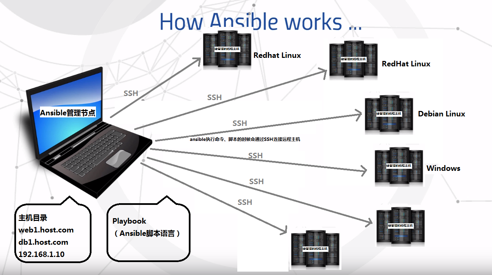
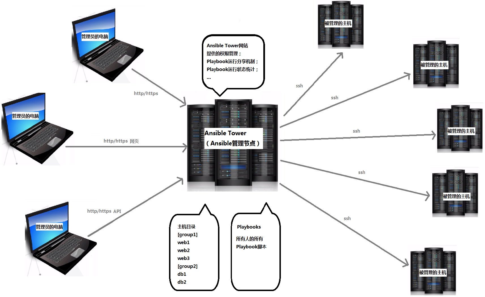

# Ansible 的架构

# Ansible 的架构

Ansilbe 管理员节点和远程主机节点通过 ssh 协议进行通信。所以 Ansible 配置的时候只需要保证从 Ansible 管理节点通过 SSH 能够连接到被管理的远程的远程节点即可，当然需要建立的 ssh，是基于 key 的，不能要求输入密码，下一章会讲到具体的配置方法。

## 连接方式 SSH

在管理员节点安装 Ansible，编写脚本。在管理节点执行命令或者脚本时，通过 SSH 连接被管理的主机。 被管理的远程节点不需要进行特殊安装软件。

## 支持多种类型的主机

Ansible 可以同时管理 Redhat 系的 Linux，Debian 系的 Linux，以及 Windows 主机。管理节点只在执行脚本时与远程主机连接，没有特别的同步机制，所以发生断电等异常一般不会影响 ansbile。

# Ansible Tower 的架构

# Ansible Tower 的架构

## 为什么要有 Ansbile Tower

Ansilbe Tower 一款针对企业级的收费软件。

在上一节的 Ansible 架构中和下一章 Ansbile 的安装中会讲到，每一台被 ansible 远程管理的主机，都需要配置基于 key 的 ssh 连接。个人用户自己管理几台虚拟机和远程主机不会有什么问题，但是作为企业级也用户，则满足不了业务和安全上的需求。

*   首先，每增加一台主机，都需要手工配置一下 ssh 连接，企业级的 pc 主机成百上千，每个管理员都需要在自己的电脑上配置所有的 ssh 连接，无疑工作量巨大。

*   还有，在安全方面如果管理员能够拿到 ssh key，或者拷贝给别人，对于生产环境来说无疑是最大的安全隐患。

## Ansible Tower 能做什么

Ansile Tower 则是针对解决企业级用户以上两个需求的，ansible tower 是中心化 ansible 管理节点，它向管理员提供网站页面作为接口，来运行 ansible 脚本 playbook。

*   管理员在 ansible tower 上使用和分享主机的 ssh key，但是不能查看和拷贝 key 文件。

*   ansible 网站所有人可以共享 playbook 脚本，减少重复工作。

*   此外 ansible 还可以收集和展现所有主机的 playbook 的执行状况，便于统计和分析主机的状态。

说了这么多，看下面这张架构图就清晰了：

