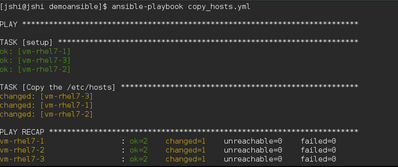
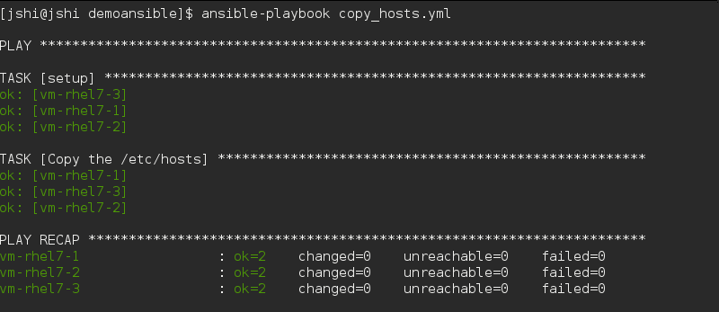
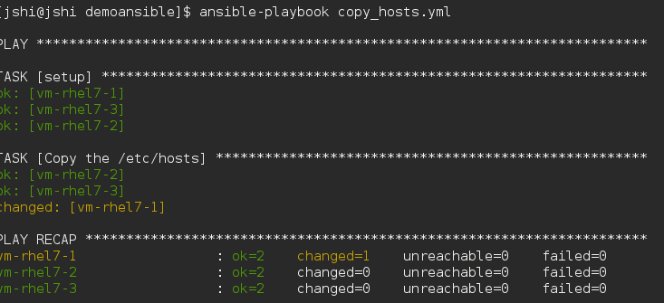

# Ansible 进阶

# Ansible 进阶

## 深入介绍一下几个主题

*   Ansible 的配置
*   Ansible 的主机目录管理(Host Inventory)
*   Ansible Playbook 的进阶语法
*   配置 Extra Modules

# ansible 的配置

# ansible 的配置

## 可以配置什麼?

从基本的，主机目录文件"inventory"，extra module 放置路径"library" ，远程主机的临时文件位置" remote_tmp" ，管理节点上临时文件的位置"local_tmp"

```
inventory      = /etc/ansible/hosts
library        = /usr/share/my_modules/
remote_tmp     = $HOME/.ansible/tmp
local_tmp      = $HOME/.ansible/tmp 
```

到高级的，连接端口号"accelerate_port"，超时时间等。

```
accelerate_port = 5099
accelerate_timeout = 30
accelerate_connect_timeout = 5.0 
```

看一个完整的 anbile 配置文件例子，就能基本了解到 ansible 都能配置什么了:

[https:\/\/raw.githubusercontent.com\/ansible\/ansible\/devel\/examples\/ansible.cfg](https://raw.githubusercontent.com/ansible/ansible/devel/examples/ansible.cfg)

对 ansible 配置文件里面的关键字不能完整理解，还可以参考关键词解释列表:

[http:\/\/docs.ansible.com\/ansible\/intro_configuration.html#explanation-of-values-by-section](http://docs.ansible.com/ansible/intro_configuration.html#explanation-of-values-by-section)

## anbile 配置文件的优先级

ansible 的默认配置文件是\/etc\/ansible\/ansible.cfg。其实 ansible 会按照下面的顺序查找配置文件，并**使用第一个**发现的配置文件。

```
* ANSIBLE_CONFIG (an environment variable)
* ansible.cfg (in the current directory)
* .ansible.cfg (in the home directory)
* /etc/ansible/ansible.cfg 
```

Ansible1.5 以前的版本顺序为：

```
* ansible.cfg (in the current directory)
* ANSIBLE_CONFIG (an environment variable)
* .ansible.cfg (in the home directory)
* /etc/ansible/ansible.cfg 
```

# Host Inventory

# 主机目录(Host Inventory)

什么叫主机目录管理,告诉 ansible 需要管理哪些 server，和 server 的分类和分组信息。可以根据你自己的需要根据地域分类，也可以按照功能的不同分类。

## 主机目录的配置文件

### 默认文件

/etc/ansible/hosts

### 修改主机目录的配置文件

/etc/ansible/ansible.cfg

```
...
inventory      = /etc/ansible/hosts
... 
```

### 命令行中传递主机目录配置文件

```
$ ansible-playbook -i hosts site.yml 
```

或者参数--inventory-file

```
$ ansible-playbook --inventory-file hosts site.yml 
```

# 远程主机的分组

# 远程主机的分组

简单的分组[]内是组名

```
mail.example.com

[webservers]
foo.example.com
bar.example.com

[dbservers]
one.example.com
two.example.com
three.example.com

[webservers]
www[01:50].example.com

[databases]
db-[a:f].example.com 
```

分组 usa 的子组还可以是其它的组,例如[usa:children]中还可以子组 southeast, [southeast:children]中还可以包含 atlanta 和 releigh

```
[atlanta]
host1
host2

[raleigh]
host2
host3

[southeast:children]
atlanta
raleigh

[usa:children]
southeast
northeast
southwest
northwest 
```

# 远程主机的连接参数和变量

# 指定连接的参数

## 参数

指定 Server 的连接参数，其中包括连接方法，用户等。

```
[targets]

localhost              ansible_connection=local
other1.example.com     ansible_connection=ssh        ansible_user=mpdehaan
other2.example.com     ansible_connection=ssh        ansible_user=mdehaan

[atlanta]
host1 http_port=80 maxRequestsPerChild=808
host2 http_port=303 maxRequestsPerChild=909 
```

所有可以指定的参数在文档中 [`docs.ansible.com/ansible/intro_inventory.html#list-of-behavioral-inventory-parameters`](http://docs.ansible.com/ansible/intro_inventory.html#list-of-behavioral-inventory-parameters)

## 变量

为一个组指定变量

```
[atlanta]
host1
host2

[atlanta:vars]
ntp_server=ntp.atlanta.example.com
proxy=proxy.atlanta.example.com 
```

# 按目录结构存储变量

# 按目录结构存储变量

假设 inventory 文件为/etc/ansible/hosts，那么相关的 hosts 和 group 变量可以放在下面的目录结构下

```
/etc/ansible/group_vars/raleigh # can optionally end in '.yml', '.yaml', or '.json'
/etc/ansible/group_vars/webservers
/etc/ansible/host_vars/foosball 
```

/etc/ansible/group_vars/raleigh 文件内容可以为

```
---
ntp_server: acme.example.org
database_server: storage.example.org 
```

如果对应的名字为目录名，ansible 会读取这个目录下面所有文件的内容

```
/etc/ansible/group_vars/raleigh/db_settings
/etc/ansible/group_vars/raleigh/cluster_settings 
```

group_vars/ 和 host_vars/ 目录可放在 inventory 目录下,或是 playbook 目录下. 如果两个目录下都存在,那么 **playbook 目录下的配置**会**覆盖** inventory 目录的配置.

# Ansible 的脚本(Playbook)

# Playbook

## YML

ansible 的脚本语言，yaml 格式。请参考 YAML 语法结构章节

## 别人的 Playbook

能够学会快速用别人的成果，高效地分享自己的成果，才是好码农，才是能早下班的好码农。在你动手从头开始写一个 Playbook 之前，不如先参考一下别人的成果吧。

### 官方例子

Ansible 官方提供了一些比较常用的、经过测试的 Playbook 例子：

[https:\/\/github.com\/ansible\/ansible-examples](https://github.com/ansible/ansible-examples)

### Playbook 分享平台

此外，Ansible 还提供了 Playbook 的分享平台，上面的例子是 Ansible 用户自己上传的。你如果在没有思路的情况下参考下吧，不过一定要再重新严谨的测试下。

[https:\/\/galaxy.ansible.com\/](https://galaxy.ansible.com/)

# Playbook 基本语法

# Playbook 基本语法

本节列举了写第一个 Playbook，你必须了解基本语法。

随着你面临的机器越多，配置的需求越复杂，你可能需要了解后面介绍的一些稍微复杂逻辑的语句。

## 执行 Playbook 语法

```
$ ansible-playbook deploy.yml 
```

查看输出的细节

```
ansible-playbook playbook.yml  --verbose 
```

查看该脚本影响哪些 hosts

```
ansible-playbook playbook.yml --list-hosts 
```

并行执行脚本

```
ansible-playbook playbook.yml -f 10 
```

## 完整的 playbook 脚本示例

最基本的 playbook 脚本分为三个部分:

1.  在什么机器上以什么身份执行

    *   hosts
    *   users
    *   ...
2.  执行的任务是都有什么

    *   tasks
3.  善后的任务都有什么

    *   handlers

deploy.yml 文件

```
---
- hosts: webservers
 vars:
 http_port: 80
 max_clients: 200
 user: root
 tasks:
 - name: ensure apache is at the latest version
 yum: pkg=httpd state=latest
 - name: write the apache config file
 template: src=/srv/httpd.j2 dest=/etc/httpd.conf
 notify:
 - restart apache
 - name: ensure apache is running
 service: name=httpd state=started
 handlers:
 - name: restart apache
 service: name=httpd state=restarted 
```

# 主机和用户(hosts&user)

# 主机和用户

| key | 含义 |
| --- | --- |
| **hosts** | 为主机的 IP，或者主机组名，或者关键字 all |
| **user** | 在远程以哪个用户身份执行。 |
| **become** | 切换成其它用户身份执行，值为 yes 或者 no |
| **become_method** | 与 became 一起用，指可以为‘sudo’/’su’/’pbrun’/’pfexec’/’doas’ |
| **become_user** | 与 bacome_user 一起用，可以是 root 或者其它用户名 |

脚本里用 became 的时候，执行的 playbook 的时候可以加参数--ask-become-pass

`ansible-playbook deploy.yml --ask-become-pass`

# 执行的任务(Tasks)

# Tasks 任务列表

*   tasks 是从上到下顺序执行，如果中间发生错误，那么整个 playbook 会中止。你可以改修文件后，再重新执行。
*   每一个 task 的对 module 的一次调用。使用不同的参数和变量而已。
*   每一个 task 必须有一个 name 属性，这个是供人读的，然后会在命令行里面输出，提示用户执行情况。

## 语法

task 的基本写法:

```
tasks:
  - name: make sure apache is running
    service: name=httpd state=running 
```

其中 name 是可选的，也可以简写成下面的例子。

```
tasks:
  - service: name=httpd state=running 
```

写 name 的 task 在 playbook 执行时，会显示对应的名字，信息更友好、丰富。写 name 是个好习惯！

```
TASK: [make sure apache is running] ************************************************************* 
changed: [yourhost] 
```

没有写 name 的 task 在 playbook 执行时，直接显示对应的 task 语法。

```
TASK: [service name=httpd state=running] ************************************** 
changed: [yourhost] 
```

参数太长可以分隔到多行

```
 tasks:
  - name: Copy ansible inventory file to client
    copy: src=/etc/ansible/hosts dest=/etc/ansible/hosts
            owner=root group=root mode=0644 
```

或者用 yml 的字典作为参数

```
 tasks:
  - name: Copy ansible inventory file to client
    copy: 
      src: /etc/ansible/hosts 
      dest: /etc/ansible/hosts
      owner: root
      group: root 
      mode: 0644 
```

## TASK 的执行状态

task 中每个 action 会调用一个 module，在 module 中会去检查当前系统状态是否需要重新执行。 具体的判断规则由各个 module 自己实现。

*   如果本次执行了，那么 action 会得到返回值 changed;
*   如果不需要执行，那么 action 得到返回值 ok

"copy" module 的判断方法是比较文件的 checksum，代码如下：

[https:\/\/github.com\/ansible\/ansible-modules-core\/blob\/devel\/files\/copy.py](https://github.com/ansible/ansible-modules-core/blob/devel/files/copy.py)

### 状态示例

以一个 copy 文件的 task 为例子:

```
 tasks:
  - name: Copy the /etc/hosts
    copy: src=/etc/hosts dest=/etc/hosts 
```

第一次执行,它的结果是这个样子的:

TASK 的状态是 changed 

第二次执行是下面这个样子的:

TASK 的状态是 ok,由于第一次执行 copy_hosts.yml 的时候,已经拷贝过文件,那么 ansible 目标文件的状态避免重复执行. 

下面我更改 vm-rhel7-1 的\/etc\/hosts, 再次执行看看:



# 响应事件(Handler)

# 响应事件 Handler

## 什么是 handler?

每个主流的编程语言都会有 event 机制，那么 handler 就是 playbook 的 event。

Handlers 里面的每一个 handler，也是对 module 的一次调用。而 handlers 与 tasks 不同，tasks 会默认的按定义顺序执行每一个 task，handlers 则不会，它需要在 tasks 中被调用，才有可能被执行。

Tasks 中的任务都是有状态的，changed 或者 ok。 在 Ansible 中，只在 task 的执行状态为 changed 的时候，才会执行该 task 调用的 handler，这也是 handler 与普通的 event 机制不同的地方。

## 应用场景

什么情况下使用 handlers 呢?

如果你在 tasks 中修改了 apache 的配置文件。需要重起 apache。此外还安装了 apache 的插件。那么还需要重起 apache。像这样的应该场景中，重起 apache 就可以设计成一个 handler.

### 一个 handler 最多只执行一次

在所有的任务里表执行之后执行，如果有多个 task notify 同一个 handler,那么只执行一次。

在下面的例子里 apache 只执行一次

[`github.com/ansible-book/ansible-first-book-examples/blob/master/handlers_state.yml`](https://github.com/ansible-book/ansible-first-book-examples/blob/master/handlers_state.yml)

```
---
- hosts: lb
  remote_user: root
  vars:
      random_number1: "{{ 10000 | random }}"
      random_number2: "{{ 10000000000 | random }}"
  tasks:
  - name: Copy the /etc/hosts to /tmp/hosts.{{ random_number1 }}
    copy: src=/etc/hosts dest=/tmp/hosts.{{ random_number1 }}
    notify:
      - call in every action
  - name: Copy the /etc/hosts to /tmp/hosts.{{ random_number2 }}
    copy: src=/etc/hosts dest=/tmp/hosts.{{ random_number2 }}
    notify:
      - call in every action

  handlers:
  - name: call in every action
    debug: msg="call in every action, but execute only one time" 
```

## action 是 Changed ,才会执行 handler

只有当 TASKS 种的 action 的执行状态是 changed 时，才会触发 notify handler 的执行。

下面的脚本执行两次,执行结果是不同的:

*   第一次执行是，tasks 的状态都是 changed，会触发两个 handler

*   第二次执行是,

    *   第一个 task 的状态是 OK，那么不会触发 handlers"call by /tmp/hosts",
    *   第二个 task 的状态是 changed，触发了 handler"call by /tmp/hosts.random_number"

测试代码见：

[`github.com/shijingjing1221/ansible-first-book-examples/blob/master/handlers_execution_time.yml`](https://github.com/shijingjing1221/ansible-first-book-examples/blob/master/handlers_execution_time.yml)

```
---
- hosts: lb
  remote_user: root
  vars:
      random_number: "{{ 10000 | random }}"
  tasks:
  - name: Copy the /etc/hosts to /tmp/hosts
    copy: src=/etc/hosts dest=/tmp/hosts
    notify:
      - call by /tmp/hosts
  - name: Copy the /etc/hosts to /tmp/hosts.{{ random_number }}
    copy: src=/etc/hosts dest=/tmp/hosts.{{ random_number }}
    notify:
      - call by /tmp/hosts.random_number

  handlers:
  - name: call by /tmp/hosts
    debug: msg="call first time"
  - name: call by /tmp/hosts.random_number
    debug: msg="call by /tmp/hosts.random_number" 
```

## 按 Handler 的定义顺序执行

handlers 是按照在 handlers 中定义个顺序执行的，而不是安装 notify 的顺序执行的。

下面的例子定义的顺序是 1>2>3，notify 的顺序是 3>2>1，实际执行顺序：1>2>3.

```
---
- hosts: lb
  remote_user: root
  gather_facts: no
  vars:
      random_number1: "{{ 10000 | random }}"
      random_number2: "{{ 10000000000 | random }}"
  tasks:
  - name: Copy the /etc/hosts to /tmp/hosts.{{ random_number1 }}
    copy: src=/etc/hosts dest=/tmp/hosts.{{ random_number1 }}
    notify:
      - define the 3nd handler
  - name: Copy the /etc/hosts to /tmp/hosts.{{ random_number2 }}
    copy: src=/etc/hosts dest=/tmp/hosts.{{ random_number2 }}
    notify:
      - define the 2nd handler
      - define the 1nd handler

  handlers:
  - name: define the 1nd handler
    debug: msg="define the 1nd handler"
  - name: define the 2nd handler
    debug: msg="define the 2nd handler"
  - name: define the 3nd handler
    debug: msg="define the 3nd handler" 
```

# 变量

# 变量

## 定义

使用 YAML 格式定义

```
foo:
  field1: one
  field2: two 
```

## 使用变量

使用 Python 的 template 语言[Jinja2](http://jinja.pocoo.org/docs/dev/templates/#builtin-filters)的语法引用：利用中括号和点号来访问子属性

```
foo['field1']
foo.field1 
```

# Playbook 中使用的变量

# Playbook 中使用的变量

在 Playbook 中使用，需要用{{ }}引用以来即可：

```
- hosts: webservers
  vars:
      apache_config: labs.conf
  tasks:
      - name: deploy haproxy config
        template: src={{ apache_config }} dest=/etc/httpd/conf.d/{{ apache_config }} 
```

在 Playbook 中使用变量文件定义变量

```
- hosts: webservers
  vars_files:
      - vars/server_vars.yml
  tasks:
      - name: deploy haproxy config
        template: src={{ apache_config }} dest=/etc/httpd/conf.d/{{ apache_config }} 
```

变量文件 vars/server_vars.yml 的内容为：

```
apache_config: labs.conf 
```

## YAML 的陷阱

YAML 的陷阱是 YAML 和 Ansible Playbook 的变量语法不能在一起好好工作了。这里特指冒号后面的值不能以"{ "开头。

下面的代码会报错:

```
- hosts: app_servers
  vars:
      app_path: {{ base_path }}/22 
```

解决办法：要在"{ "开始的值**加上引号**:

```
- hosts: app_servers
  vars:
       app_path: "{{ base_path }}/22" 
```

# 主机的系统变量(facts)

# 主机的系统变量(facts)

ansible 会通过 module setup 来收集主机的系统信息，这些收集到的系统信息叫做 facts，这些 facts 信息可以直接以变量的形式使用。

哪些 facts 变量可以引用呢？在命令行上通过调用 setup module 命令可以查看

```
$ ansible all -m setup -u root 
```

怎样在 playbook 中使用 facts 变量呢，答案是直接使用：

```
---
- hosts: all
  user: root
  tasks:
  - name: echo system
    shell: echo {{ ansible_os_family }}
  - name install ntp on Debian linux
    apt: name=git state=installed
    when: ansible_os_family == "Debian"
  - name install ntp on redhat linux
    yum: name=git state=present
    when: ansible_os_family == "RedHat" 
```

## 使用复杂 facts 变量

一般在系统中收集到如下的信息，复杂的、多层级的 facts 变量如何使用呢？

```
...
        "ansible_ens3": {
            "active": true, 
            "device": "ens3", 
            "ipv4": {
                "address": "10.66.192.234", 
                "netmask": "255.255.254.0", 
                "network": "10.66.192.0"
            }, 
            "ipv6": [
                {
                    "address": "2620:52:0:42c0:5054:ff:fef2:e2a3", 
                    "prefix": "64", 
                    "scope": "global"
                }, 
                {
                    "address": "fe80::5054:ff:fef2:e2a3", 
                    "prefix": "64", 
                    "scope": "link"
                }
            ], 
            "macaddress": "52:54:00:f2:e2:a3", 
            "module": "8139cp", 
            "mtu": 1500, 
            "promisc": false, 
            "type": "ether"
        }, 
... 
```

那么可以通过下面的两种方式访问复杂的变量中的子属性:

中括号：

```
{{ ansible_ens3["ipv4"]["address"] }} 
```

点号：

```
{{ ansible_ens3.ipv4.address }} 
```

## 关闭 facts

在 Playbook 中,如果写 gather_facts 来控制是否收集远程系统的信息.如果不收集系统信息,那么上面的变量就不能在该 playybook 中使用了.

```
- hosts: whatever
  gather_facts: no 
```

# 把运行结果当做变量使用

# 把运行结果当做变量使用-注册变量

把 task 的执行结果当作是一个变量的值也是可以的。这个时候就需要用到注册变量，将执行结果注册到一个变量中，待后面的 action 使用：

```
---

- hosts: web

  tasks:

     - shell: ls
       register: result
       ignore_errors: True

     - shell: echo "{{ result.stdout }}"
       when: result.rc == 5

     - debug: msg="{{ result.stdout }}" 
```

# 文件模板中使用的变量

# 文件模板中使用的变量

文件模板即 template。Ansible 使用的文件是 python 的一个 j2 的模板。

## template 变量的定义

在 playbook 中定义的变量，可以直接在 template 中使用。

下面的 playbook 脚本中使用了 template module 来拷贝文件 index.html.j2，并且替换了 index.html.j2 中的变量为 playbook 中定义变量值。

```
---
- hosts: web
  vars:
    http_port: 80
    defined_name: "Hello My name is Jingjng"
  remote_user: root
  tasks:
  - name: ensure apache is at the latest version
    yum: pkg=httpd state=latest

  - name: Write the configuration file
    template: src=templates/httpd.conf.j2 dest=/etc/httpd/conf/httpd.conf
    notify:
    - restart apache

  - name: Write the default index.html file
    template: src=templates/index2.html.j2 dest=/var/www/html/index.html

  - name: ensure apache is running
    service: name=httpd state=started
  - name: insert firewalld rule for httpd
    firewalld: port={{ http_port }}/tcp permanent=true state=enabled immediate=yes

  handlers:
    - name: restart apache
      service: name=httpd state=restarted 
```

## template 变量的使用

在 template index.html.j2 中可以直接使用系统变量和用户自定义的变量

*   系统变量 **{{ ansible_hostname }}** , **{{ ansible_default_ipv4.address }}**

*   用户自定义的变量 **{{ defined_name }}**

index.html.j2 文件：

```
<html>
<title>#46 Demo</title>

<!--
http://stackoverflow.com/questions/22223270/vertically-and-horizontally-center-a-div-with-css
http://css-tricks.com/centering-in-the-unknown/
http://jsfiddle.net/6PaXB/
-->

<style>.block {text-align: center;margin-bottom:10px;}.block:before {content: '';display: inline-block;height: 100%;vertical-align: middle;margin-right: -0.25em;}.centered {display: inline-block;vertical-align: middle;width: 300px;}</style>

<body>
<div class="block" style="height: 99%;">
    <div class="centered">
        <h1>#46 Demo {{ defined_name }}</h1>
        <p>Served by {{ ansible_hostname }} ({{ ansible_default_ipv4.address }}).</p>
    </div>
</div>
</body>
</html> 
```

# 用命令行传递参数

# 用命令行传递参数

## 定义命令行变量

在 release.yml 文件里，hosts 和 user 都定义为变量，需要从命令行传递变量值。

```
---

- hosts: '{{ hosts }}'
  remote_user: '{{ user }}'

  tasks:
     - ... 
```

## 使用命令行变量

在命令行里面传值得的方法：

```
ansible-playbook e33_var_in_command.yml --extra-vars "hosts=web user=root" 
```

还可以用 json 格式传递参数：

```
ansible-playbook e33_var_in_command.yml --extra-vars "{'hosts':'vm-rhel7-1', 'user':'root'}" 
```

还可以将参数放在文件里面：

```
ansible-playbook e33_var_in_command.yml --extra-vars "@vars.json" 
```

# 重用 playbook(include 语句)

# Include 语句

Include 语句的功能，基本的代码重用机制。主要重用 tasks。

## 普通用法

像其它语言的 Include 语句一样，直接 Include：

```
---
# possibly saved as tasks/firewall_httpd_default.yml

  - name: insert firewalld rule for httpd
    firewalld: port=80/tcp permanent=true state=enabled immediate=yes 
```

main.yml 文件中调用 include 的方法:

```
 tasks:
    - include: tasks/firewall_httpd_default.yml 
```

## 高级用法-加参数

加参数

```
tasks:
  - include: tasks/firewall.yml port=80
  - include: tasks/firewall.yml port=3260
  - include: tasks/firewall.yml port=423 
```

还可以这样加：

```
tasks:

  - include: wordpress.yml
    vars:
        wp_user: timmy
        ssh_keys:
          - keys/one.txt
          - keys/two.txt 
```

还可以简写成：

```
tasks:
 - { include: wordpress.yml, wp_user: timmy, ssh_keys: [ 'keys/one.txt', 'keys/two.txt' ] } 
```

在 handlers 里面加 include

```
handlers:
  - include: handlers/handlers.yml 
```

在全局加 include 时，tasks 和 handlers 不能有 include

```
- name: this is a play at the top level of a file
  hosts: all
  remote_user: root

  tasks:

  - name: say hi
    tags: foo
    shell: echo "hi..."

- include: load_balancers.yml
- include: webservers.yml
- include: dbservers.yml 
```

## include 里面的 handlers 在外面调用不了

不知道为什么有一处文档里面写可以调用。文档下面两个地方提到 include 里面的 handlers，但是两处是矛盾的:

*   hander 的文档写不能调用 [`docs.ansible.com/ansible/playbooks_intro.html`](http://docs.ansible.com/ansible/playbooks_intro.html)
*   include 的文档写能调用 [`docs.ansible.com/ansible/playbooks_roles.html#task-include-files-and-encouraging-reuse`](http://docs.ansible.com/ansible/playbooks_roles.html#task-include-files-and-encouraging-reuse)

通过下面的例子实测后，是不能调用 include 里面的 handler 的。

```
---
- hosts: lb
  user: root
  gather_facts: no
  vars:
      random_number: "{{ 10000 | random }}"
  tasks:
  - name: Copy the /etc/hosts to /tmp/hosts.{{ random_number }}
    copy: src=/etc/hosts dest=/tmp/hosts.{{ random_number }}
    notify:
      - restart apache
      - restart apache in handlers

  handlers:
    - include: handlers/handlers.yml
    - name: restart apache
      debug: msg="This is the handler restart apache" 
```

# playbook 的“函数"(role 语句)

# Role 语句

比 include 更强大的代码重用机制。一个 role 可以包含 vars_files, tasks, and handlers 等等. 通常一个 role 定义了如何完成一个特定的功能,比如安装 Webservers 可以写成一个 role, 安装 Database 可以写成一个 role.

Ansible 提供了一个分享 role 的平台, [`galaxy.ansible.com/`](https://galaxy.ansible.com/), 在 galaxy 上可以找到别人写好的 role.

## Role 的目录结构

**在 ansible 中,通过遵循特定的目录结构,就可以实现对 role 的定义.**

下面的目录结构定义了两个 role：一个是 common，另外一个是 webservers。

在 site.yml，调用了这两个 role。

| role 的目录结构 | site.yml 中的使用 |
|  
```
 site.yml
roles/
   common/  
     files/
     templates/
     tasks/
     handlers/
     vars/
     defaults/
     meta/
   webservers/
     files/
     templates/
     tasks/
     handlers/
     vars/
     defaults/
     meta/ 

```

 |  
```
 ---
- hosts: webservers
  roles:
     - common
     - webservers 

```

 |

## 带参数的 Role

### 定义带参数的 role

定义一个带参数的 role,名字是 role_with_var,那么目录结构为

```
 main.yml
 roles
   role_with_var
     tasks
       main.yml 
```

在 roles/rolw_with_var/tasks/main.yml 中,直接使用定义的变量就可以了

```
 ---
 - name: use param
   debug: msg="{{ param }}" 
```

### 使用带参数的 role

那么在 main.yml 就可以用如下的方法使用 role_with_var

```
---

- hosts: webservers
  roles:
    - { role: role_with_var, param: 'Call some_role for the 1st time' }
    - { role: role_with_var, param: 'Call some_role for the 2nd time' } 
```

### 指定默认的参数

指定默认参数后,如果在调用时传参数了,那么就使用传入的参数值.如果调用的时候没有传参数,那么就使用默认的参数值.

指定默认参数很简单,以上面的 role_with_var 为例

```
main.yml
roles:
  role_with_var
    tasks
      main.yml
    vars
      main.yml 
```

在 roles/role_with_var/vars/main.yml 中,使用 yml 的字典定义语法定义 param 的值,如下:

```
param: "I am the default value" 
```

这样在 main.yml 中,下面两种调用方法都可以

```
---

- hosts: webservers
  roles:
    - role_with_var
    - { role: role_with_var, param: 'I am the value from external' } 
```

更多的例子在[`github.com/shijingjing1221/ansible-first-book-examples/blob/master/role_vars.yml`](https://github.com/shijingjing1221/ansible-first-book-examples/blob/master/role_vars.yml) 中

## 与条件语句一起执行

下面的例子中,some_role 只有在 RedHat 系列的 server 上才执行.

```
---

- hosts: webservers
  roles:
    - { role: some_role, when: "ansible_os_family == 'RedHat'" } 
```

## 执行顺序

pre_tasks > role > tasks > post_tasks

```
---

- hosts: vm-rhel7-1
  user: root

  pre_tasks:
    - name: pre
      shell: echo 'hello'

  roles:
    - { role: some_role }

  tasks:
    - name: task
      shell: echo 'still busy'

  post_tasks:
    - name: post
      shell: echo 'goodbye' 
```

看例子！！！

# 条件语句 when

# 条件语句 When

类似于编程语言的 if

## When 语句

有时候用户有可能需满足特定条件才执行某一个特定的步骤。在某一个特定版本的系统上装包，或者只在磁盘空间满了的文件系统上执行清理操作一样。这些操作在 Ansible 上，使用`when`语句都非常简单.

主机为 Debian Linux 立刻关机

```
tasks:
  - name: "shutdown Debian flavored systems"
    command: /sbin/shutdown -t now
    when: ansible_os_family == "Debian" 
```

根据 action 的执行结果，来决定接下来执行的 action。

```
tasks:
  - command: /bin/false
    register: result
    ignore_errors: True
  - command: /bin/something
    when: result|failed
  - command: /bin/something_else
    when: result|success
  - command: /bin/still/something_else
    when: result|skipped 
```

远程中的系统变量 facts 变量作为 when 的条件，用“|int”还可以转换返回值的类型：

```
---
- hosts: web
  tasks:
    - debug: msg="only on Red Hat 7, derivatives, and later"
      when: ansible_os_family == "RedHat" and ansible_lsb.major_release|int >= 6 
```

## 条件表达式

```
vars:
  epic: true 
```

基本款

```
tasks:
    - shell: echo "This certainly is epic!"
      when: epic 
```

否定款：

```
tasks:
    - shell: echo "This certainly isn't epic!"
      when: not epic 
```

变量定义款

```
tasks:
    - shell: echo "I've got '{{ foo }}' and am not afraid to use it!"
      when: foo is defined

    - fail: msg="Bailing out. this play requires 'bar'"
      when: bar is not defined 
```

数值表达款

```
tasks:
    - command: echo {{ item }}
      with_items: [ 0, 2, 4, 6, 8, 10 ]
      when: item > 5 
```

## 与 Include 一起用

```
- include: tasks/sometasks.yml
  when: "'reticulating splines' in output" 
```

## 与 Role 一起用

```
- hosts: webservers
  roles:
     - { role: debian_stock_config, when: ansible_os_family == 'Debian' } 
```

# 循环语句 loop

# Loop 循环

## 标准循环

为了保持简洁,重复的任务可以用以下简写的方式:

```
- name: add several users
  user: name={{ item }} state=present groups=wheel
  with_items:
     - testuser1
     - testuser2 
```

如果你在变量文件中或者 ‘vars’ 区域定义了一组 YAML 列表,你也可以这样做:

```
vars:
  somelist: ["testuser1", "testuser2"]
tasks:
  -name: add several user
   user: name={{ item }} state=present groups=wheel
   with_items: "{{somelist}}" 
```

使用 ‘with_items’ 用于迭代的条目类型不仅仅支持简单的字符串列表.如果你有一个哈希列表,那么你可以用以下方式来引用子项:

```
- name: add several users
  user: name={{ item.name }} state=present groups={{ item.groups }}
  with_items:
    - { name: 'testuser1', groups: 'wheel' }
    - { name: 'testuser2', groups: 'root' } 
```

注意：如果同时使用 when 和 with_items （或其它循环声明）,`when`声明会为每个条目单独执行.请参见 the_when_statement 示例.

## 嵌套循环

循环也可以嵌套:

```
- name: give users access to multiple databases
  mysql_user: name={{ item[0] }} priv={{ item[1] }}.*:ALL append_privs=yes password=foo
  with_nested:
    - [ 'alice', 'bob' ]
    - [ 'clientdb', 'employeedb', 'providerd'] 
```

或者

```
- name: give users access to multiple databases
  mysql_user: name={{ item.0 }} priv={{ item.1 }}.*:ALL append_privs=yes password=foo
  with_nested:
    - [ 'alice', 'bob' ]
    - [ 'clientdb', 'employeedb', 'providerd'] 
```

## 对哈希表使用循环

```
---
vars:
  alice:
    name: Alice Appleworth
    telephone: 123-456-7890
  bob:
    name: Bob Bananarama
    telephone: 987-654-3210
tasks:
  - name: Print phone records
    debug: msg="User {{ item.key }} is {{ item.value.name }} ({{ item.value.telephone }})"
    with_dict: "{{users}}" 
```

## 对文件列表使用循环

with_fileglob 可以以非递归的方式来模式匹配单个目录中的文件.如下面所示:

```
 tasks:

    # first ensure our target directory exists
    - file: dest=/etc/fooapp state=directory

    # copy each file over that matches the given pattern
    - copy: src={{ item }} dest=/etc/fooapp/ owner=root mode=600
      with_fileglob:
        - /playbooks/files/fooapp/* 
```

# 块语句 block

# Block 块

多个 action 组装成块，可以根据不同条件执行一段语句 ：

```
 tasks:
 - block:
 - yum: name={{ item }} state=installed
 with_items:
 - httpd
 - memcached

 - template: src=templates/src.j2 dest=/etc/foo.conf

 - service: name=bar state=started enabled=True

 when: ansible_distribution == 'CentOS'
 become: true
 become_user: root 
```

组装成块处理异常更方便：

```
tasks:
 - block:
 - debug: msg='i execute normally'
 - command: /bin/false
 - debug: msg='i never execute, cause ERROR!'
 rescue:
 - debug: msg='I caught an error'
 - command: /bin/false
 - debug: msg='I also never execute :-('
 always:
 - debug: msg="this always executes" 
```

# 更多的 Ansible 模块(Extra Modules)

# 更多的 Ansible 模块

*   介绍两类 Modules： Core Module 和 Extra module
*   Extra module 的配置和使用方法
*   通过命令行查看 modules 的用法

# Modules 的分类

# Modules 的分类

你[Ansible Module 文档](http://docs.ansible.com/ansible/modules_by_category.html)上查看单个 Module 的时候,每一个 Module 文档的底部都会标识, 这是一个"Core Module", 或者这是一个"Extra Module".

比如, [yum](http://docs.ansible.com/ansible/yum_module.html)就是一个 core module, [yum_repository](http://docs.ansible.com/ansible/yum_repository_module.html)就是一个 extra module,

## Core Module

*   不需要格外下载和配置就可以直接使用的.
*   比较常用的 module
*   经过严格测试的.

## Extra module

*   进行下载和格外的配置才能使用
*   次常用的
*   还有可能存在 bug 的

# Extra module 的使用方法

# Extra module 的使用方法

使用 Exra module 需要进行下面的配置，就可以在命令行或者是 playbook 中使用了。配置后 extra module 使用方法和 core module 的使用方法是一样的。

**1 下载 ansible module extra 项目**

```
git clone https://github.com/ansible/ansible-modules-extras.git 
```

我的一下在/home/jshi/software/目录下了，后面会用到。

**2 修改配置文件或者环境变量**

**方法 1 - 改 ansible 默认配置文件/etc/ansible/ansible.cfg**

修改 ansible 配置文件/etc/ansible/ansible.cfg, 添加一行

```
library    = /home/jshi/software/ansible-modules-extras/ 
```

**方法 2 - 改 ansible 当前目录下配置文件 ansible.cfg**

改 ansible playbook 当前的目录下的配置文件 ansible.cfg，那么只**对当前目录的 playbook 生效**。对所有其它目录，包括父目录和子目录的 playbook 都不生效。

```
library/ansible-modules-extras
ansible.cfg
use_extra_module.yml
subfolder/use_extra_module_will_throw_error.yml 
```

在当前目录的 ansible.cfg 中，可以使用相对路径：

```
library = library/ansible-modules-extras/ 
```

**方法 3 - 该环境变量**

```
export ANSIBLE_LIBRARY=/project/demo/demoansible/library/ansible-module-extras 
```

如果需要在重启后生效，那么放在~/.bashrc 中声明 ANSIBLE_LIBRARY 变量：

```
$ echo >>~/.bashrc <<EOF

export ANSIBLE_LIBRARY=/project/demo/demoansible/library/ansible-module-extras

EOF

$ source ~/.bashrc 
```

# 命令行查看 module 的用法

# 命令行查看 module 的用法

类似 bash 命令的 man，ansible 也可以通过命令行查看 module 的用法。命令是 ansible-doc，语法如下:

```
ansible-doc module_name 
```

core module 可以在任何目录下执行。例如查看 yum 的用法：

```
ansible-doc yum 
```

extra module 必须在配置了 extra module 的目录下查看用法(行为当前目录下的 playbook 是一致的):

```
ansible-doc yum_repository 
```

# 最佳使用方法

# 最佳使用方法

*   鼓励文件的重用，尽量使用 include 和 role 避免重复的代码。

*   尽量把大的文件分成小的文件

[`github.com/ansible/ansible-examples`](https://github.com/ansible/ansible-examples)

```
production                # inventory file for production servers
staging                   # inventory file for staging environment

group_vars/
   group1                 # here we assign variables to particular groups
   group2                 # ""
host_vars/
   hostname1              # if systems need specific variables, put them here
   hostname2              # ""

library/                  # if any custom modules, put them here (optional)
filter_plugins/           # if any custom filter plugins, put them here (optional)

site.yml                  # master playbook
webservers.yml            # playbook for webserver tier
dbservers.yml             # playbook for dbserver tier

roles/
    common/               # this hierarchy represents a "role"
        tasks/            #
            main.yml      #  <-- tasks file can include smaller files if warranted
        handlers/         #
            main.yml      #  <-- handlers file
        templates/        #  <-- files for use with the template resource
            ntp.conf.j2   #  <------- templates end in .j2
        files/            #
            bar.txt       #  <-- files for use with the copy resource
            foo.sh        #  <-- script files for use with the script resource
        vars/             #
            main.yml      #  <-- variables associated with this role
        defaults/         #
            main.yml      #  <-- default lower priority variables for this role
        meta/             #
            main.yml      #  <-- role dependencies

    webtier/              # same kind of structure as "common" was above, done for the webtier role
    monitoring/           # ""
    fooapp/               # "" 
```