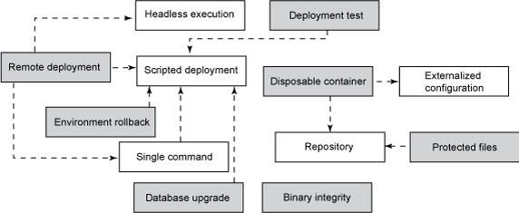
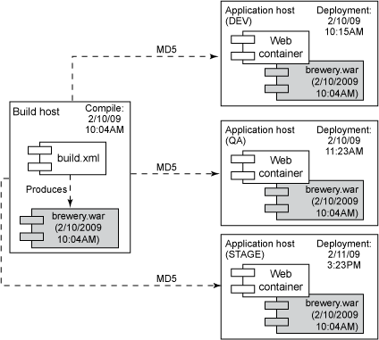
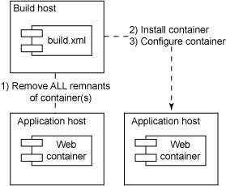
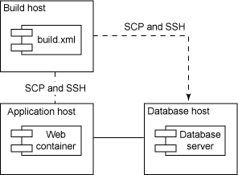
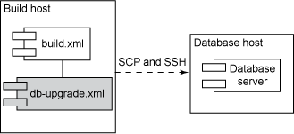
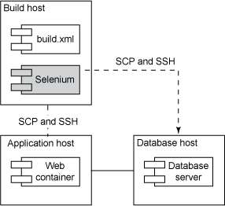
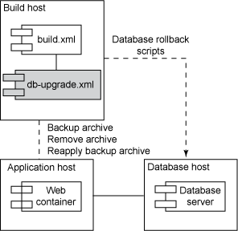
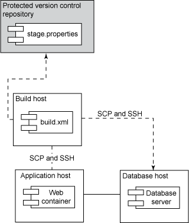

# 让开发自动化: 部署自动化模式，第 2 部分

*更多一键式部署模式*

Java™部署常常很混乱，容易出现错误，需要许多手工操作，这会延误向用户交付软件的时间。本文是分两部分的让开发自动化系列文章的第 2 部分。在本文中，自动化专家 Paul Duvall 进一步补充用于开发可靠、可重复且一致的部署流程的一些关键模式，帮助读者为 Java 应用程序生成简便的部署。

## 关于本系列

作为开发人员，我们致力于为用户自动化流程；但许多开发人员疏忽了自动化我们自己的开发流程的机会。为此，我们编写了 [*让开发自动化*](http://www.ibm.com/developerworks/cn/java/j-ap/)系列文章，专门探讨软件开发流程自动化的实践应用，为您介绍 *何时*以及 *如何*成功应用自动化。

部署是软件创建过程中又一个适合实现自动化的方面。通过自动化部署，可获得一个可靠、可重复的流程，其中好处颇多：更高的准确性、更快的速度和更好的控制。在这个分两部分的系列文章的 [第 1 部分](http://www.ibm.com/developerworks/cn/java/j-ap01139/)中，我描述了 8 种部署自动化模式。在本期，我进一步扩大讨论范围，阐述另外 7 种同样有益的部署方法：

*   **Binary Integrity**，确保全部目标环境使用相同的工件。
*   **Disposable Container**，使目标环境处于已知状态，以减少部署错误。
*   **Remote Deployment**，确保部署可以从一个集中化的机器或集群与多台机器交互。
*   **Database Upgrades**，提供一个集中管理的、脚本化流程，以便将增量更改应用到数据库。
*   **Deployment Test**，根据最近的部署，使用部署前和部署后检查，确认应用程序按预期运行。
*   **Environment Rollback**，如果部署失败，回滚应用程序和数据库更改。
*   **Protected Files**，控制对构建系统使用的某些文件的访问。

图 1 解释了本文阐述的部署模式之间的关系（未使用阴影的那些模式在 [第 1 部分](http://www.ibm.com/developerworks/cn/java/j-ap01139/)中介绍过）：

##### 图 1\. 部署自动化模式



这 7 个附加的部署自动化模式以之前 8 个模式为基础，它们有助于创建一键式（one-click）部署。

## 一次编译，部署到多个环境

**名称**：Binary Integrity

**模式**：对于每个标记过的部署，每个目标环境中使用相同的归档文件（WAR 或 EAR）。

**反模式**：对于同一标记，为每个目标环境单独进行编译。

就这个话题与同事经过多次讨论后，我最终站在了 *一次编译，部署到多个目标环境*一边，而不是 *在每个目标环境中编译和打包*。例如，一次 Java 开发产生的部署工件是 Web 归档（WAR）或企业归档（EAR）文件。这个归档应该注册到版本控制储存库中，并一次性贴上标记 —就像在 DEV 环境中那样。

图 2 解释了 *一次编译，部署到多个环境*这一概念：构建机器上生成的同一个 brewery.war 被部署到每个目标环境：

##### 图 2\. 同一个 Web 归档被部署到不同的目标环境



Ant 提供一个 `checksum`任务 —使用 Message-Digest algorithm 5（MD5）hash 算法 —以确保构建机器上编译和打包的文件就是部署到每个目标环境的文件。

有人会争辩说，虽然工件可能相同，但每个目标环境的部署配置是不同的。也就是说，当使用 Single-Command、Scripted Deployment 时，无论它是否为相同的归档，很多自动化流程可以改变应用程序的输出。确实如此；但是，您还需要花不必要的时间解决问题，因为在 STAGE 环境中使用与 QA 环境不同的 JDK 版本编译和打包软件。并且，当 DEV 中使用的来自一个集中式依赖管理储存库（例如 Ivy 或 Maven）的 JAR 与准备（staging）环境中的那些 JAR 不同时，失败的机率就会增加。这些风险使我确信，为了确保二进制代码的完整性，必须一次性编译和打包，以便部署到多个环境。

* * *

## 用一次性容器降低部署成本

**名称**：Disposable Container

**模式**：通过将安装和配置解耦，使 Web 和数据库容器的安装和配置自动化。

**反模式**：手动将容器安装到每个目标环境并进行配置。

在较早一期的 [*让开发自动化*](http://www.ibm.com/developerworks/cn/java/j-ap/)文章 “[持续集成反模式，第 2 部分](http://www.ibm.com/developerworks/cn/java/j-ap03048/)” 中，谈到了为什么清理一个 “受污染的” 环境有助于防止出现误判或漏判的构建。Disposable Container 可以减少在使用持久性容器时可能出现的很多问题。Disposable Container 模式基于两个原则：*完全移除所有容器组件*，以及 *将容器的安装与配置分离*。对于有些人，尤其是系统工程师来说，这似乎是一个极端的概念，因为不再要求由一个单独的团队管理和模糊化容器，不让开发人员或其他人接触到它们。然而，考虑到部署期间经常出现的、代价不菲的问题，它可以让所有团队成员的利益最大化。

## 一键式部署

经常有一些团队和我说：“是的，我们已经实现了自动化部署。”当我问一些简单的问题时 —例如 “输入一条简单的命令（例如 `ant`）就可以生成一个有效的软件应用程序吗？” —回答通常是这样的：“是的，一旦安装和配置好 Web 容器……”，或者 “是的，一旦设置好数据库”。我对于一个真正自动化的部署的定义是，应该能够从一台干净的机器开始，安装 Java 平台和 Ant（有一些方法可以免除这个步骤），然后输入一条 *简单命令*，即可得到一个可以正常工作的软件应用程序。如果做不到，就不算是 “一键式” 部署，并且在部署过程中将出现代价不菲的人员方面的瓶颈问题。

如图 3 所示，Disposable Container 模式基于这样一个原则：*一切*都应该在 *系统*中 —（使用 [第 1 部分](http://www.ibm.com/developerworks/cn/java/j-ap01139/)中提到的 Repository 模式）—而不是在某个人的头脑中。

##### 图 3\. 部署期间移除和安装容器



清单 1 中的 Ant 脚本从 Internet 下载 Tomcat ZIP，移除之前的部署残留的任何容器，然后解压、安装和启动 Tomcat：

##### 清单 1\. 用 Ant 脚本编写的部署，该脚本移除、重新安装、启动和配置容器

```
 <!-- Check to see if Tomcat is running prior to this --> 
 ... 
 <exec executable="sh" osfamily="unix" dir="${tomcat.home}/bin" spawn="true"> 
  <env key="NOPAUSE" value="true" /> 
  <arg line="shutdown.sh" /> 
 </exec> 
 <delete dir="${tomcat.home}" /> 
 <get src="${tomcat.binary.uri}/${tomcat.binary.file}" 
  dest="${download.dir}/${tomcat.binary.file}" usetimestamp="true"/> 
 <unzip dest="${target.dir}" src="${download.dir}/${tomcat.binary.file}" /> 
 <exec osfamily="unix" executable="chmod" spawn="true"> 
  <arg value="+x" /> 
  <arg file="${tomcat.home}/bin/startup.sh" /> 
  <arg file="${tomcat.home}/bin/shutdown.sh" /> 
 </exec> 
 <xmltask source="${appserver.server-xml.file}"
  dest="${appserver.server-xml.file}"> 
  <attr path="/Server/Service[@name='${s.name}']/Connector[${port='${c.port}']" 
    attr="proxyPort" 
     value="${appserver.external.port}"/> 
    <attr path="/Server/Service[${name='${s.name}']/Connector[${port='${c.port}']" 
     attr="proxyName"
     value="${appserver.external.host}"/> 
 </xmltask> 
 <!-- Perform other container configuration --> 
 ... 
 <echo message="Starting tomcat instance at ${tomcat.home} with startup.sh" /> 
 <exec executable="sh" osfamily="unix" dir="${tomcat.home}/bin" spawn="true"> 
  <env key="NOPAUSE" value="true" /> 
  <arg line="startup.sh" /> 
 </exec> 
```

通过使环境处于已知状态，并以一种受控制的方式部署容器，可以减少很多常见的、引发大部分部署难题的部署错误。

* * *

## 在多个外部环境中运行命令

**名称**：Remote Deployment

**模式**：使用一个集中式机器或集群将软件部署到多个目标环境。

**反模式**：在每个目标环境中通过手动方式在本地应用部署。

一旦安装了数据库和 Web 容器，让部署在开发人员的 *工作站*上运行是件非常简单的事情。然而，开发与生产之间有着巨大的差异。如果组织有多个项目和不同的目标环境（例如测试或准备环境），那么常常需要从一个单独的环境集中地管理部署：一台机器或一个集群。团队常使用一台构建服务器来管理每个目标环境的部署。在 [第 1 部分](http://www.ibm.com/developerworks/cn/java/j-ap01139/)中，我介绍了 Headless Execution 模式，该模式采用公共和私有密钥，所以不必手动登录到每台机器。如图 4 所示，Remote Deployment 依赖于 Headless Execution、Single Command 和 Scripted Deployment 模式，因此可以方便地部署到远程机器：

##### 图 4\. 用于多个环境的构建管理服务器



要从集中构建服务器远程部署软件，需要使用一些机制安全地进行远程复制和运行命令。我将讨论的两个机制使用 Secure Copy（SCP）和 Secure Shell（SSH）。如清单 2 所示，在 Scripted Deployment 模式下，集中构建机器上生成的 Web 归档被远程地复制到一个目标环境：

##### 清单 2\. 将 war 文件安全地从一台机器复制到另一台机器

```
 <target name="copy-tomcat-dist"> 
  <scp file="${basedir}/target/brewery.war" 
  trust="true" 
  keyfile="${basedir}/config/id_dsa"
  username="bobama"
  passphrase=""
  todir="pduvall:G0theD!stance@myhostname:/usr/local/jakarta-tomcat-5.5.20/webapps" /> 
 </target> 
```

当 WAR 文件被安全地复制到远程目标环境时，我就可以在 Java Secure Channel 中使用 `SSHExec`之类的任务运行任何 SSH 命令，这一切都是从集中构建机器中远程执行的。另一种方法是 `ssh`到远程环境，并在本地运行命令。这样可以减少来回的远程传输，并缩短部署时间。

* * *

## 使数据库和数据处于已知状态

**名称**：Database Upgrade

**模式**：使用脚本和数据库在每个目标环境中应用增量更改。

**反模式**：在每个目标环境中手动应用数据库和数据更改。

在图 5 中，可以看到一个在 Scripted Deployment 中使用自动化脚本更新数据库的例子：

##### 图 5\. 自动应用增量数据库更新



在较早一期的 *让开发自动化*文章 “[实现自动化数据库迁移](http://www.ibm.com/developerworks/cn/java/j-ap08058/)” 中，我谈到了以自动化的方式应用增量数据库更改的必要性。和 Scripted Deployment 中的其他部分一样，数据库更新脚本被签入到储存库中。

LiquiBase（参见 参考资料）是用于将增量更改应用到数据库的工具，可使同样的更改作为 Scripted Deployment 的一部分应用到每一个目标环境。在清单 3 中，一个 SQL 脚本被作为 LiquiBase changelog 的一部分调用。然后，Scripted Deployment（使用一种构建脚本工具实现 —例如 Ant）调用这个 changelog（使用 XML 定义）。

##### 清单 3\. 从 LiquiBase 更改集运行定制的 SQL 文件

```
 <changeSet id="1" author="jbiden"> 
  <sqlFile path="insert-distributor-data.sql"/> 
 </changeSet> 
```

要学习和应用自动化数据库更新，还有相当多的事情要做，但其主旨是在 Scripted Deployment 中执行更新，使所有数据库更改都在 *系统*中，而不是一个写好的程序或存在某个人的头脑中。

* * *

## 冒烟测试部署

**名称**：Deployment Test

**模式**：将自测试功能编写到 Scripted Deployments 中。

**反模式**：通过运行手动功能测试来验证部署，没有关注特定于部署的方面。

图 6 解释了在部署前后运行部署测试的一个例子：

##### 图 6\. 对应用程序运行功能部署测试



在清单 4 中，我使用 Ant 执行部署前测试，以确认正在使用的版本是正确的工具版本。在 Scripted Deployment 中，脚本可以检查正在使用的端口（这可能导致 Web 容器部署失败），检查与数据库的连接，检查容器是否已被启动，以及很多其他内部部署测试。

##### 清单 4\. 运行部署前检查，确保部署有效

```
 <condition property="ant.version.success"> 
  <antversion atleast="${ant.check.version}" /> 
 </condition> 
 <antunit:assertPropertyEquals name="ant.version.success" value="true" /> 
 <echo message="Ant version is correct." /> 
 <echo message="Validating Java version..."/> 
 <condition property="java.major.version.correct"> 
  <equals arg1="${ant.java.version}" arg2="${java.check.version.major}" /> 
 </condition> 
 <antunit:assertTrue message="Your Java SDK version must be 1.5+. \ 
  You must install correct version."> 
  <isset property="java.major.version.correct"/> 
 </antunit:assertTrue> 
```

更全面的部署测试可以确保应用程序的 *功能性*是正确的。通过使用用于 Web 应用程序的 Selenium 或用于客户机应用程序的 Abbot 之类的工具编写 *特定于部署*的自动化功能测试，可以验证是否已正确应用了部署更改。可以将这些测试看作 *冒烟测试（smoke tests）*：只需测试受部署影响的功能。例如，表 1 展示了使用 Selenium 和其他用于 Web 应用程序的工具的一些方式：

##### 表 1\. 部署测试

| 部署测试 | 描述 |
| --- | --- |
| 数据库 | 编写一个自动化功能测试，该测试将数据插入到数据库。验证数据是否被输入到数据库中。 |
| 简单邮件传输协议（Simple Mail Transfer Protocol，SMTP） | 编写一个自动化功能测试，该测试从应用程序发送一个电子邮件消息。 |
| Web 服务 | 使用 SoapAPI 之类的工具提交一个 Web 服务，并验证输出。 |
| Web 容器 | 验证所有容器服务是否正确运行。 |
| 轻量级目录访问协议（Lightweight Directory Access Protocol，LDAP） | 使用应用程序，通过 LDAP 进行验证。 |
| 日志记录 | 编写一个测试，该测试使用应用程序的日志记录机制编写日志。 |

自动化测试不仅仅用于测试用户功能。通过创建侧重于部署测试的套件，可以检验部署的有效性，减少下游错误和开发成本。

* * *

## 回滚所有部署更改

**名称**：Environment Rollback

**模式**：当部署失败后，提供自动的 Single Command 更改回滚。

**反模式**：手动回滚应用程序和数据库更改。

图 7 解释了回滚数据库更改 —使用 Database Upgrade —以及回滚 Web 部署的自动化过程：

##### 图 7\. 回滚部署更改



不管是否执行自动化部署，当部署失败时，最好有一种方式可以回滚更改。在某些情况下，错误的更改可能导致系统中断，使组织损失数百万美元。要执行 Environment Rollback，需要让目标环境回到部署前的状态。为此，实际上每个更改都需要一个回滚脚本。Web 部署常常需要回滚更多的更改。Environment Rollback 的一个例子是在部署前复制归档（例如一个 WAR 文件），并为每个更改提供回滚数据库脚本。另外还需要重新应用已应用于 Web 容器的配置更改。

清单 6 演示了一个示例，该示例使用 LiquiBase 为每个前滚语句提供一个回滚语句。我将添加一个名为 `brewery`的新表，同时提供一个相应的 `dropTable`回滚语句。

##### 清单 6\. 当应用增量数据更新时提供回滚过程

```
 <changeSet id="rollback-database-changes" author="bobama"> 
  <createTable tableName="brewery"> 
    <column name="id" type="int"/> 
  </createTable> 
  <rollback> 
    <dropTable tableName="brewery"/> 
  </rollback> 
 </changeSet> 
```

这个简单的例子仅用于说明问题，并不意味着回滚就是这么简单。恢复到前一个部署常常是一个复杂的、费时的过程（需要实现自动化）。用于编写回滚脚本的时间应该与部署失败付出的代价成比例。

* * *

## 保护信息不被窥探

**名称**：Protected Files

**模式**：使用储存库，只允许经过授权的团队成员共享文件。

**Antipattern**：在团队成员的机器上管理文件，或者将文件存储在可由已授权团队成员访问的共享驱动器上。

图 8 展示了一个受保护的版本控制储存库，它用于存放只有已授权人员或系统可以访问的文件：

##### 图 8\. 使用受保护的版本控制储存库存放敏感文件



在某些情况下，并不是所有团队成员都应该访问特定于环境的数据。但是，将该信息与部署脚本分离又可能使脚本无法执行。当讨论 Headless Execution 模式时，我描述了使用 SSH 密钥和 Java Secure Channel 工具复制文件，并安全地运行远程命令，而不需要人为输入命令。使用 Externalized Configuration 处理的属性很可能包含不应该让所有团队成员看到的数据。为了确保实现 Headless Execution，同时防止 .properties 文件中的数据被窥探，我使用的技巧是将这些文件签入到一个受保护的储存库中。

在清单 7 中，我配置了一个由 Apache 托管的 Subversion 储存库，先拒绝所有用户访问某个目录，然后显式地添加某些用户：

##### 清单 7\. 在 Apache 上使用 Subversion 保护一个 Subversion 储存库

```
 <DirectoryMatch "^/.*/(\.svn)/"> 
  Order deny,allow 
  Deny from all 
  Allow bobama,jbiden,hclinton 
 </DirectoryMatch> 
```

通过保护对 Subversion 储存库的访问，可以将一个 Scripted Deployment 设为被允许的用户，使其不必输入密码就可以访问属性，从而通过 SSH 密钥定义的方式实现 Headless Execution。

* * *

## 一键式部署

除了这份分两部分的系列文章中描述的 15 个部署自动化模式外，我还归纳了更多的模式，但是这 15 个模式大概可以应对我遇到的 80% 的部署情况。每个模式都是为了帮助在每个目标环境中实现真正的一键式 / 单命令部署。希望您一切顺利！

### 结束语

这是我的 [*让开发自动化*](http://www.ibm.com/developerworks/cn/java/j-ap/)系列的最后一篇文章。在两年多的时间里与您一起分享我的经验，令我感觉像在经历一场有趣的探险。编写这个系列的目的是展示如何以及为何自动化大量软件开发过程，使开发人员可以将更多的时间花在感兴趣的问题上，而不是将时间浪费在重复的、容易出错的活动上。在这个系列中，我演示了如何自动化代码检查以便适当地重构、增量式地升级应用程序数据库、应用 Continuous Integration 实践和工具、每次更改时运行自动测试、生成 GUI 安装程序、创建一键式部署、使开发人员自动生成文档、执行依赖管理、利用版本控制储存库，以及有效地使用各种构建脚本和工具。希望您在阅读这个系列时能够充满乐趣。