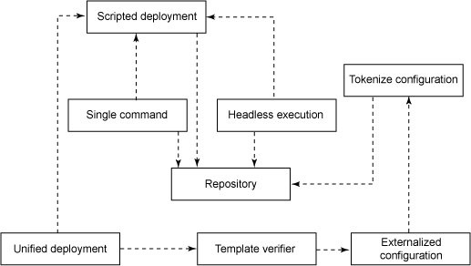
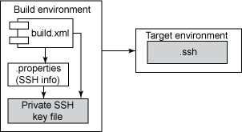
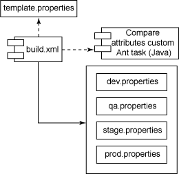
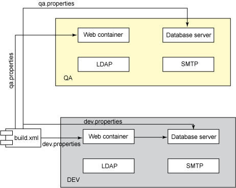

# 让开发自动化: 部署自动化模式，第 1 部分

*用于实现简便部署的模式*

Java™ 部署常常很混乱，容易出现错误，需要许多手工操作，这会延误向用户交付软件的时间。本文是分两部分的 [*让开发自动化*](http://www.ibm.com/developerworks/cn/java/j-ap/) 系列文章的第 1 部分。在本文中，自动化专家 Paul Duvall 将介绍用于开发可靠、可重复且一致的部署流程的一些关键模式，帮助读者为 Java 应用程序生成简便的部署。

软件部署常常被视为不可避免的麻烦，可以在遇到它时应付一下，以后就不用理会了。但是，与开发周期的其他部分一样，可以并且应该对部署应用软件工程原理。在手工进行部署时，部署是一个重复且容易出现错误的流程。正如可以通过自动化构建来减少错误并加快软件开发，也可以通过自动化部署流程来减少错误和加快软件交付。

在前面的一期*让开发自动化* “[使用自动化加速部署](http://www.ibm.com/developerworks/cn/java/j-ap01088/)” 中，介绍了一种把软件远程部署到多个目标环境中的技术。本文在更高的层面上讨论自动化部署。正如存在一些用于软件开发的模式，也有一些用于部署的模式。在过去几年里，我一直在收集和整理这些模式。在第 1 部分中，我将介绍 8 个部署模式并提供相关示例：

*   **Repository**，这个模式在一个集中的存储库中管理所有配置文件，这样就可以使用 Scripted Deployment 生成有效的软件
*   **Scripted Deployment**，这个模式通过脚本执行所有部署操作，这样在执行部署时就不需要人为干预
*   **Single Command**，这个模式减少部署的复杂性，确保实现部署流程的无头执行（Headless Execution）
*   **Tokenize Configuration**，这个模式提供一种可重复的把可变信息注入配置文件中的方法
*   **Externalized Configuration**，这个模式可以*一次性地* 输入在目标环境之间有差异的信息
*   **Template Verifier**，这个模式帮助确保所有目标环境属性都是相同的
*   **Headless Execution**，这个模式提供一种在自动化流程中安全地访问多台机器的方法
*   **Unified Deployment**，这个模式帮助建立可以在许多目标环境中运行的单一部署脚本

第 2 部分将介绍更多的部署模式。

## 关于本系列

作为开发人员，我们致力于为用户自动化流程；但许多开发人员疏忽了自动化我们自己的开发流程的机会。为此，我们编写了 [*让开发自动化*](http://www.ibm.com/developerworks/cn/java/j-ap/) 系列文章，专门探讨软件开发流程自动化的实践应用，为您介绍*何时* 以及*如何* 成功应用自动化。

图 1 说明本文讨论的部署模式之间的关系：

##### 图 1\. 部署自动化模式



我将依次讨论每个模式。在这个过程中，您会逐渐理解图 1 中显示的关系。

## 把所有文件提交给一个版本控制存储库

**名称**：Repository

**模式**：所有文件都被提交给版本控制存储库 — 在部署上下文中，这是指所有*配置文件* 和工具。

**反模式**：一些团队把这些信息放在一个具有访问控制的共享驱动器上。其他团队可能仅仅把信息放在自己的机器上，然后把它们复制到目标环境中。

作为一般规则，我建议开发团队签入创建软件所需的*所有* 文件。有时候，这个规则有一些例外情况，但是不常见。在部署上下文中，一些团队错误地认为服务器和服务器配置是固定不变的资产。尽管有时候签入大的二进制代码比较困难，但是应该把配置、数据库脚本以及所有构建和部署脚本提交给版本控制存储库。使用 Repository 模式对于实现下面讨论的 Scripted Deployment 和 Single Command 模式很有帮助。

* * *

## 用脚本执行所有部署流程

**名称**：Scripted Deployment

**模式**：在脚本中编写所有部署流程。

**反模式**：一些团队可能手工配置部署任务，比如安装和配置 Web 容器。其他团队可能使用容器提供的基于 GUI 的管理工具针对特定环境修改容器。尽管这种方式最初可以简化配置的手工修改，但是如果要在许多目标环境中频繁地执行部署，这就不合适了。另外，在*首次* 使用时，基于 GUI 的管理工具对于部署非常有帮助。但是，因为许多人必须重复执行这些流程，所以这种方式的可伸缩性很差且容易出现错误。

清单 1 通过实现 Scripted Deployment 模式对启动（或重新启动）Tomcat Web 容器的流程进行自动化。这个流程是用 Apache Ant 构建脚本语言编写的。

##### 清单 1\. 启动 Tomcat Web 容器的示例

```
<available file="@{tomcat.home}/server/@{tomcat.server.name}/bin" 
   property="tomcat.bin.exists"/>
<if>
  <isset property="tomcat.bin.exists"/>
<then>
  <echo message="Starting tomcat instance at @{tomcat.home} with start_tomcat" />
  <exec executable="@{tomcat.home}/server/@{tomcat.server.name}/bin/start_tomcat" 
   osfamily="unix" />
</then>
<else>
  <echo message="Starting tomcat instance at @{tomcat.home} with startup.sh" />
  <exec osfamily="unix" executable="chmod" spawn="true">
    <arg value="+x" />
    <arg file="@{tomcat.home}/bin/startup.sh" />
    <arg file="@{tomcat.home}/bin/shutdown.sh" />
  </exec>

  <exec executable="sh" osfamily="unix" dir="@{tomcat.home}/bin" spawn="true">
    <env key="NOPAUSE" value="true" />
    <arg line="startup.sh" />
  </exec>

    <exec osfamily="windows" executable="cmd" dir="@{tomcat.home}/bin" spawn="true" >
      <env key="NOPAUSE" value="true" />
        <arg line="/c startup.bat" />
    </exec>
    <sleep seconds="15" />
    </else>
  </if> 
```

通过脚本执行这个流程，就不再需要在 Tomcat 提供的 GUI 管理界面中执行操作。另外，因为这个流程已经脚本化了，可以在全面的自动化部署中通过无头流程运行它。

* * *

## 通过单一命令运行部署

**名称**：Single Command

**模式**：部署者或无头流程只需输入*单一命令*，即可为用户生成有效的软件。

**反模式**：某些部署流程要求部署者输入多个命令并完成多个流程，比如复制文件、修改配置文件、重新启动服务器、设置密码等等，这些重复的操作很容易出现错误。如果他们走运，手头有详细的文档，能够指导他们执行这些操作。但是无论如何，要求人员执行部署流程都会增加出错的风险，导致时间瓶颈，延误软件在多个目标环境中的发布。

## 开发环境不等于生产环境

即使软件能够在开发环境或 QA 环境中正常工作，也不意味着它会在生产环境中正常工作，因为环境之间可能存在各种差异。这就是为什么通过脚本执行所有部署工作是很重要的。

在编写部署时，您的客户常常是团队、组织和公司中的其他人 — 甚至可能是计算机。运行部署的方法越复杂，别人或无头流程成功执行它的可能性就越小。清单 2 给出一个简单的单一命令部署示例：

##### 清单 2\. 使用 Ant 执行单一命令部署

```
ant -Dproperties.file=$USERHOME/projects/petstore/properties/dev-install.properties \
  deploy:remote:install 
```

清单 2 中的命令执行一个名为 `deploy:remote:install` 的 Ant 任务，并传递一个与环境相关的 .properties 文件，从而把软件远程部署到其他计算机上。这个任务执行的操作包括使用 Secure Copy protocol (SCP) 安全地复制文件；通过 Secure Shell (SSH) 在远程计算机上安全地执行命令；安装、配置和重新启动 Web 容器；以及其他流程 — 这些都不需要人为干预。显然，用户可以输入这个命令；但是因为它非常简单，所以很容易通过无头流程（比如持续集成或构建管理服务器）运行它。

* * *

## 把可变信息注入配置文件

**名称**：Tokenize Configuration

**模式**：把标记化的值输入配置文件，然后在 Scripted Deployment 期间根据 Repository 中的 Externalized Configuration 属性替换它们。

**反模式**：把与目标相关的数据输入每个环境中的配置文件。

清单 3 中的 XML 文件用来管理 Web 容器和数据库服务器之间的配置。在这个文件中，我使用 `@` 符号设置了一些标记。在自动化部署期间，一个脚本将把这些标记替换为来自 Externalized Configuration 文件的实际值。

##### 清单 3\. 标记化的 Web 容器配置文件

```
<datasources>
  <local-tx-datasource>
    <jndi-name>@application.context.name@</jndi-name>
    <use-java-context>false</use-java-context>
    <connection-url>@database.url@</connection-url>
    <user-name>@database.user@</user-name>
    <password>@database.password@</password>
    <driver-class>@database.driver@</driver-class>
  </local-tx-datasource>
</datasources> 
```

把与环境相关的值标记化，就使 Scripted Deployment 能够通过 Unified Deployment 支持多个环境。

* * *

## 提取所有与环境相关的属性

**名称**：Externalize Configuration

**模式**：把所有可变值从应用程序配置转移到构建时属性中。

**反模式**：一些团队为每个目标环境手工硬编码这些值，或者使用 GUI 工具执行同样的工作。

清单 4 给出一些常常包含在与应用程序相关的配置文件中的属性。通过把所有*可变值* 集中在一个 .properties 文件，就可以把数据（可变属性）与行为（部署脚本）分隔开。换句话说，无论在哪个目标环境中，自动化部署流程都以相同的方式运行。

##### 清单 4\. 可以提取到与应用程序相关的文件中的示例属性

```
authentication.type=db
application.url=http://${tomcat.server.hostname}:${tomcat.server.port}/brewery-webapp
database.type=mysql
database.server=localhost
database.port=3306
database.name=mydb
database.user=myuser!
database.password=mypa$$!
database.url=jdbc:mysql://${database.server}:${database.port}/${database.name}
tomcat.server.hostname=localhost
tomcat.server.name=default
tomcat.web.password=pa$$123!
tomcat.cobraorb.port=12748 
```

清单 4 中的值常常分散在源代码、服务器配置、XML、.properties 和其他文件中。另外，我发现这些数据常常在系统中重复出现，这会导致难以调试的部署问题。通过把这些信息从许多地方集中到一个 .properties 文件中，可以减少发生部署问题的可能性。

* * *

## 通过无头执行减少麻烦

**名称**：Headless Execution

**模式**：安全地与多台计算机进行交互，而不需要输入任何命令。

**反模式**：由人以不同的用户身份手工登录并访问每台计算机，然后执行复制文件、配置值等操作。

尽管 “无头执行” 这个名称有点儿夸张，但是在需要通过自动化流程远程访问其他计算机时，无头执行确实是很有效的解决方案。通过使用公共密钥基础结构 (PKI)，可以把通常由开发人员、构建工程师、软件配置管理 (SCM) 或操作员执行的命令组合为自动化的解决方案。在图 2 中，在构建计算机和 SSH 上安装一个私有密钥文件。在每个与目标相关的 .properties 文件中定义具体值。这通常包括私有密钥文件名和位置、SSH 端口号和主机名。目标计算机包含公共 SSH 密钥文件，从而完成 SSH 握手。

##### 图 2\. 使用 SSH 密钥实现 Headless Execution 模式



如果使用这种方式，Scripted Deployment 就可以从构建环境对目标环境执行部署流程，不需要人为干预。

* * *

## 检查在不同的环境中属性是否相同

**名称**：Template Verifier

**模式**：创建一个模板文件，所有目标环境属性都基于这个文件。

**反模式**：一些团队执行手工检查、尝试和纠错（在部署失败时，检查失败的原因），或者把文件 “隐藏” 在计算机上。

问题在于，需要确保在每个环境中具有完全相同的属性。但是，在自动化环境中如何检查这一点呢？根据一个模板 .properties 文件检查所有目标环境文件，就可以确保所有属性在任何目标环境中都是相同的。在图 3 中，构建脚本运行一个 Ant 任务，此任务对 template.properties 和与目标相关的 .properties 文件（dev.properties、qa.properties 等）中的*属性*（而不是值）进行比较。如果发现差异，部署就会失败。

##### 图 3\. Template Verifier 模式的实现



清单 5 给出一个示例 template.properties 文件。注意，它只包含*属性*，因为值与这个问题无关。

##### 清单 5\. 包含属性但不包含值的模板文件

```
db.database=
db.username=
db.password=
db.hostname=
db.driver=
db.port=
db.url= 
```

清单 6 给出 dev.properties（或 qa.properties 等）文件的片段。注意，它既包含属性，*也* 包含值。这些值是与目标环境相关的。

##### 清单 6\. 基于模板文件的目标环境属性文件

```
db.database=brewery
db.username=root
db.password=p@ssword
db.hostname=dev1.domain.com
db.driver=com.mysql.jdbc.Driver
db.port=3306
db.url=jdbc:mysql://${db.hostname}:${db.port}/${db.database} 
```

* * *

## 同时在多个目标环境中执行部署

**名称**：Unified Deployment

**模式**：创建能够在不同的平台和目标环境中运行的单一部署脚本。

**反模式**：一些团队为每个目标环境（甚至特定的计算机）使用不同的部署脚本。

尽管一些部署流程只在某些环境中运行，但是所有流程应该*能够* 在*任何* 目标环境中运行。例如，在开发、测试、准备和生产环境中应该运行相同的 Scripted Deployment，但是使用不同的 Externalized Configuration 文件。使用 Template Verifier 检查 Externalized Configuration 属性。

图 4 给出一个能够在多个目标环境中执行部署的部署脚本：

##### 图 4\. 单一部署，多个目标环境



* * *

## 结束语

部署是软件开发中另一个适合自动化的方面。自动化部署可以受益于可靠且可重复的流程：提高准确性、速度和控制能力。在本文中，我讨论了 8 个适用于软件部署自动化的模式。第 2 部分将讨论更多的模式，包括 Remote Deployment、Disposable Containers、Deployment Test 和 Environment Rollback。