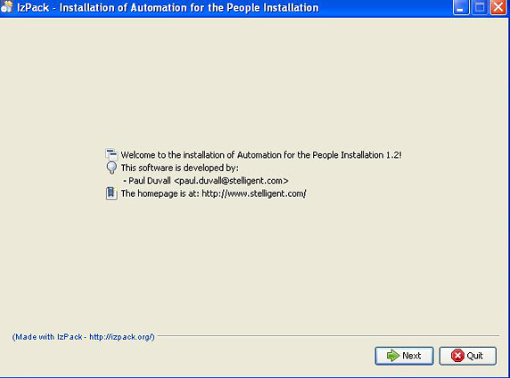
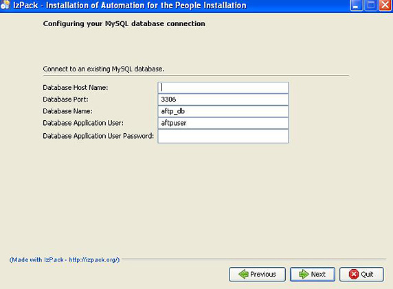

# 让开发自动化: 使用基于向导的安装程序

*使用 IzPack 生成 GUI 安装程序*

对于大多数用户来说，安装软件常常是一件痛苦的事情。生成安装包是软件开发的 “最后一步”，但它可能导致不同的结果：要么用户采用软件，要么它就成为无人问津的垃圾品。在本期的 [*让开发自动化*](http://www.ibm.com/developerworks/cn/java/j-ap/)中，自动化专家 Paul Duvall 演示了如何使用免费、开源的工具 IzPack 来编写为您的用户安装软件的基于向导的安装程序。

在我职业生涯的大部分时间里，我参与了软件开发的整个生命周期 —不仅设计软件的需求、设计、开发和测试，还涉及部署、构建管理、文档编制和安装等活动。最近，随着敏捷开发越来越流行，这些活动可能会更加规范。然而，我在敏捷项目方面的经验表明，有效的部署和安装并没有受到同等的重视。这很滑稽，因为如果潜在用户不能轻松地安装您的软件，那么您很可能会失去他们。提供一种简单的方式来安装您的软件，这对于吸引和留住用户至关重要。

## 关于本系列

作为开发人员，我们致力于为用户自动化流程；但许多开发人员疏忽了自动化我们自己的开发流程的机会。为此，我们编写了 [*让开发自动化*](http://www.ibm.com/developerworks/cn/java/j-ap/)系列文章，专门探讨软件开发流程自动化的实践应用，为您介绍 *何时*以及 *如何*成功应用自动化。

这些年来，我使用过很多安装程序工具。我们团队在今年年初开始的一个大型项目中，为了创建企业级安装程序，必须满足一些非常特别的需求。我们看过 Antigen、AntInstaller、Denova、install4j、InstallAnywhere、IzPack、NSIS 等工具。但是根据项目的特定需求，我们最后决定使用 IzPack，因为：

*   它可以在多种平台上运行。我们需要支持 Windows®、Linux®和 Macintosh。
*   IzPack 使用 Java™语言，而我们团队对于这种语言有丰富的经验。
*   它可以执行 Apache Ant 脚本。我们已经花了大量的时间为软件部署而编写 Ant 脚本。
*   IzPack 可免费下载。

IzPack 在 2001 年已经出现。它为创建基于向导的安装程序提供了一套丰富的特性。在本文中，我演示如何使用该工具创建安装程序，并给出定义面板、用脚本编写验证器、设置资源等方面的例子。

## 下载和安装 IzPack

## IzPack 文档

要仔细查看的第一个子文件夹是 doc 文件夹。它包含 HTML、PDF 和 Javadoc 版本的文档，当您查阅如何在 IzPack 中编写脚本时，它们是您忠实的伙伴。

下载和安装 IzPack 非常简单。IzPack 使用 IzPack 来安装 IzPack，这也许并不奇怪。请访问 IzPack 网站，下载 IzPack JAR 文件（请参阅 参考资料）。

要安装 IzPack，必须有一个正在运行的 Java Runtime Environment（JRE）。打开命令行提示符，输入 `java -jar IzPack-install-4.1.0.jar`，可以根据需要修改版本。

基于向导的安装程序要求提供基本的安装信息，比如想将 IzPack 安装在哪里。IzPack 安装完毕后，将得到一个可以运行的示例安装程序。

* * *

## 修改示例脚本

IzPack 提供了一套完整的示例安装脚本。以它们为基础编写自己的安装程序，这是获得一个可运行的安装程序的最快方法。安装 IzPack 的根目录下有一些子目录，包括 bin、doc 和 lib 等。示例安装程序在子文件夹 sample 中，实际上它包含了开发您自己的安装程序所需的所有东西。我选择复制这个 sample 目录，这样就可以随意修改它，而不会破坏原始的内容。图 1 显示了 sample 目录的内容：

##### 图 1\. IzPack 文件的文件列表


下面是对图 1 中列出的每个文件的描述：

*   **antActionSpec.xml**：执行与构建相关的 Ant 脚本的文件。
*   **install.jar**：IzPack 编译期间生成的 JAR 安装文件。这是用户运行的安装程序文件。
*   **install.xml**：IzPack 的主安装脚本。IzPack 安装程序中使用的所有资源都以这个脚本开始。
*   **Licence.txt**：安装程序的许可文件。
*   **Readme.txt**：软件用户使用的 readme 文件。
*   **userInputSpec.xml**：IzPack 特有的 XML 脚本，用于定义用户在一个安装程序面板中输入信息时的行为（验证、默认值、字段大小等）。

接下来，通过查看 install.xml 脚本仔细研究 IzPack。

### 资源

通过资源定义不同的脚本、图像、许可和其他文件，它们共同构成我将要创建的安装程序。我在 install.xml 脚本中定义了一个 `&lt;resources&gt;`XML 元素。在 `&lt;resources&gt;`元素下，我可以定义安装程序将使用的多个文件，如清单 1 所示：

##### 清单 1\. 在 IzPack install.xml 中定义资源文件

```
<resources> 
  <res id="LicencePanel.licence" src="Licence.txt"/> 
  <res id="InfoPanel.info" src="Readme.txt"/> 
  <res id="AntActionsSpec.xml" src="antActionSpec.xml" /> 
  <res id="userInputSpec.xml" src="userInputSpec.xml" /> 
 </resources> 
```

可以将 IzPack 的资源看作安装程序的 “原料单”，其中定义了用于安装程序的所有文件。

### 面板

面板是用户在安装向导的每一步中看到的东西。IzPack 提供了很多类型的开箱即用的面板，您可以根据自己的需求定制它们。在图 2 中，我定制了 IzPack 的 `HelloPanel`，以便向用户提供介绍信息：

##### 图 2\. IzPack 提供的定制的基于向导的 GUI 安装



标准面板包括 `LicensePanel`、`UserInputPanel`和 `PacksPanel`等。在 install.xml 文件中，可以使用 `&lt;panels&gt;`元素定义要显示的面板，然后再定义编写安装程序时将使用的面板模板。清单 2 中的例子演示了如何定义面板模板：

##### 清单 2\. 确定安装程序中显示的面板

```
 <panels> 
  <panel classname="HelloPanel"/> 
  <panel classname="InfoPanel"/> 
  <panel classname="LicensePanel"/> 
  <panel classname="UserInputPanel" id="UserInputPanel.0" /> 
  <panel classname="TargetPanel"/> 
  <panel classname="PacksPanel"/> 
  <panel classname="InstallPanel"/> 
  <panel classname="FinishPanel"/> 
 </panels> 
```

您最常用的是模板类型可能是 `UserInputPanel`。这是让用户可以输入可变信息而定制的面板模板。这包括用户的联系方式信息、认证凭证、目录位置等。用户可能需要根据他们特定的环境在面板上输入信息。由于我们的团队需要用户连接到一个数据库并设置多个 JBoss 容器，所以我们使用面板提示用户提供特定的信息。

清单 3 是从 userInputSpec.xml 摘录的一个例子，在 清单 1 中我将它定义为一个资源。在这个例子中，我将收集特定于用户的信息，用于连接到一个特定的数据库。

##### 清单 3\. 定义安装程序中的面板的属性

```
<panel order="0"> 
 <field type="title" txt="Configuring your database connection" bold="true" size="1" /> 
 <field type="staticText" align="left" txt="Connect to an existing database..."/> 
 <field type="divider" align="top"/> 

 <field type="text" variable="database.hostname"> 
  <spec txt="Database Host Name:" id="databasehostname.label" size="40" set=""/> 
  <validator class="com.izforge.izpack.util.NotEmptyValidator" 
      txt=" Database Hostname is a required field" /> 
 </field> 
 ... 
 </panel> 
```

该面板的 `order`属性被设置为 `0`，这对应于 清单 2 中的面板集合中定义的 `UserInputPanel`的数量。

在用户输入面板中，可以为用户定义信息文本。而且，我加入了一个 `NotEmptyValidator`，它要求用户在文本域中输入一个值。这样可以防止因用户忘记输入必需的信息而导致安装错误。图 3 中显示了基于 清单 3 的 `UserInputPanel`：

##### 图 3\. 供用户输入信息的面板



用户常常根据输入信息和显示消息的难易程度来判断安装程序的好坏。因此一定要让用户看到的东西容易使用。

### pack

IzPack 使用术语 *pack*表示负责实际安装开发团队已实现的软件的组件。所有其他的 IzPack 组件（面板、用户输入、验证器等）都是为运行这些 pack 做准备。我的项目使用 pack 做两件事：下载我们已经用 Ant 编写好的一个 ZIP 安装发布包，然后运行这个安装。这种方法使我们可以重用之前编写的在命令行运行的命令。清单 4 定义了一个 `&lt;pack&gt;`：

##### 清单 4\. 在 install.xml 中定义一个 `&lt;pack&gt;`

```
<packs> 
  <pack name="download_install" id="download_install" 
    installGroups="ap" required="no"> 
    <description>The base files</description> 
    <file src="autopeople.zip.file" 
      targetdir="$SYSTEM_user_home/_cnnew1_cnnew1@{installer.dir}"/> 
    <file src="build.xml" 
      targetdir="$SYSTEM_user_home/@{installer.dir}"/> 
    <file src="property-template" 
      targetdir="$SYSTEM_user_home/@{installer.dir}"> 
      <excludes>**/.svn/**</excludes> 
    </file>     
  </pack> 
```

图 4 显示一个进行中的 pack 安装：

##### 图 4\. 执行一个 pack


IzPack 中的 packs 可以包含多个 *pack*！如果您已经完成了用户验证、诊断和获取特定于环境的信息等前期工作，那么用户应该很容易运行安装包。

* * *

## 运行 Ant 脚本

在我的团队中，我们花了很多时间用 Ant 创建基于发布包的安装程序。我们不想在 IzPack 中再次重新实现该功能。幸运的是，IzPack 支持调用已有 Ant 文件。还记得吗，我在 清单 1 中定义资源时，曾列出了 antActionSpec.xml 作为一个资源。清单 5 显示了摘自 antActionSpec.xml 脚本的一个片段：

##### 清单 5\. 在 antActionSpec.xml 中执行 pack 行为

```
 <antactions> 
  <pack name="download_install"> 
    <antcall buildfile="$SYSTEM_user_home/${installer.dir}/build.xml"
      order="afterpack"
      verbose="yes"
      logfile="$SYSTEM_user_home/${installer.dir}/antlog_installer.txt"
      inheritall="false"
      messageid="AntAction.download-install"> 
      <target name="install"/> 
      <property name="install.path" value="$SYSTEM_user_home/${installer.dir}"/>   
     </antcall> 
  </pack> 
 ... 
 </antactions> 
```

这个脚本中最重要的执行 `build.xml`的部分。这是现有的 Ant 构建脚本，它执行下载和提取一个 ZIP 安装文件，安装并配置 Web 容器，然后完成安装中剩下的其他任务。antActionSpec.xml 使我们可以重用现有的 Ant 脚本。

* * *

## 编译安装程序

最后一步就是 IzPack 的 *编译*。编写好 install.xml 和相关脚本之后，就可以生成安装程序。清单 6 是一个可用于生成 install.jar（可以修改这个文件的文件名）的单行命令的例子：

##### 清单 6\. 创建一个安装程序

```
 compile ../sample/install.xml -b ../sample 
```

清单 6 中的命令假设您是从 IzPack 的 bin 子目录运行它。`sample`是对 IzPack 提供的 sample 子目录的引用。生成安装程序后，可以通过从 sample 子目录中生成 install.jar 的位置运行 `java -jar install.jar`来测试它。

* * *

## 结束语

在本文中，我展示了如何使用 IzPack 的不同组件为用户创建易于使用的安装包。他们可能是安装基于客户机的软件的用户，也可能是安装和配置多个服务器的远程站点的用户，还可能是安装和配置企业工具套件的团队。如果软件容易安装，则更易被采纳，这一点在安装比较复杂的环境中尤为突出。如果安装需要很多手动步骤或者干脆无法进行，那么用户很快就会对软件失去信心。通过 IzPack 等工具使安装变得更加容易，这可以帮助您赢得并留住热情的用户。