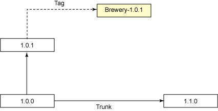

# 让开发自动化: 针对广大开发人员的并行开发

*Subversion 中的分支、标记和合并*

虽然很多开发团队都使用版本控制系统管理代码变更，但当多个开发人员并行地使用不同的代码库进行编码时，还是会出现问题的。在本期的 [*让开发自动化*](http://www.ibm.com/developerworks/cn/java/j-ap/) 中，自动化专家 Paul Duvall 展示了如何运用开源的、免费的 Subversion 版本控制系统来有效地进行标记、分支和合并。

说到源代码分支，可以将大多数的软件开发团队大致划分为两大阵营：有些是根本不分支；或存在大量的分支（甚至储存库），以致开发人员不知道从哪里签入变更 — 或者觉得合并变更很痛苦，于是就冒险将这项工作推迟到软件快要发布时才做。

## 术语

*主干（trunk）*（有时称 *head*）用于干线开发（mainline development）。*分支（branch）*是指一个代码支线副本，用于进行与干线开发不同的变更。*标记（tag）*（有时称 *标签*）是一个使用时间戳的代码支线副本，用于标识代码支线，以在开发周期中返回到标记的地方。

永远只需要操作主干是最理想的情况。这使合并两个或多个代码支线间的变更没有那么复杂。然而，在现实的软件开发中，您正在开发的可能是未来版本，或者有时您可能需要为一个已经交付使用的版本准备一条后路。你需要有权限访问已发布版本的源代码副本 — 但又不能扰乱正在开发的新代码。

但当开发团队试图使用分开的代码支线时，问题就会出现了。有些时候，开发团队可能会选择不创建分支，免得会延误发布或导致开发人员瓶颈。而有些时候，开发人员合并的频率太低，结果导致了合并冲突、瓶颈以及发布延误。而增加分支则会使导航项目储存库很困难，从而导致开发人员无意中更改了不应该更改的代码。

团队进行并行开发时，一定要以最高的频率将代码合并回干线（即主干）。如果无法经常将代码合并到主干的话，可以运行测试，这样就能够确定是否会发生合并冲突，从而使*实施* 合并没有那么困难。要有效地进行并行开发，您可以使用 Subversion（SVN）中的标记和分支，Subversion 是一个开源的、免费的源代码管理系统。通过标记，团队可以安全地返回到源代码的前一版本中。

我将通过介绍以下内容来示范如何在 SVN 中进行并行开发：

*   如何从主干创建一个 SVN 版本标记
*   根据版本标记来创建一个 SVN 分支
*   将变更合并回干线（即主干）的技巧
*   如何在开发中的主干运行持续集成（Continuous Integration，CI），以定期测试分支与主干的合并
*   演示如何将源于分支的变更应用到主干
*   举例说明如何标记分支的源代码

## 关于本系列

作为开发人员，我们致力于自动化用户流程；但许多开发人员却疏忽了自动化自己的开发流程。为此，我们编写了 [*让开发自动化*](http://www.ibm.com/developerworks/cn/java/j-ap/) 系列文章，专门探讨软件开发流程自动化的实际应用，为您介绍*何时* 以及*如何* 成功应用自动化。

图 1 显示了几个并行代码支线的基本流程：

##### 图 1\. 并行开发


在图 1 中，有效的开发发生在 SVN 主干的版本 1.0.0 和版本 1.1.0 之间。可以是一组开发人员在版本 1.0.1 分支上进行开发，而其他人员在干线上开发。

如果想要多个开发人员负责不同的代码支线的话，可以使用很多策略和技巧。在本文中，我将展示一个很常用的方法，我曾在使用 SVN 的项目上用过它。

## 为并行开发配置 Subversion

安装和配置 SVN 服务器并不在本文的讨论范围之内。如果您有权限访问一个有效的 SVN 服务器，就可以执行以下的步骤了：

1.  将 SVN 客户机软件下载到您的工作站。
2.  在工作站中创建一个标准本地目录。
3.  将目录添加到 SVN 储存库。
4.  将目录提交到 SVN 储存库。

从 Tigris.org Web 站点（参见 参考资料）为您的操作系统下载 SVN 客户机软件，并将其安装到您的工作站。确保 SVN 可执行文件在您的工作站的系统目录中。用 `svn co _URL_` 执行储存库的 SVN 签出。

接下来，创建三个本地目录：

*   分支：用于维护干线开发之外的软件。
*   标记：在发布软件时用于标识变更集，以备使用。
*   主干：用于干线开发。

清单 1 展示了在 Windows®、Macintosh 以及基于 *nix 的系统上如何从命令行创建这些目录：

##### 清单 1\. 创建本地目录，将其添加到 Subversion

```
$ mkdir branches
$ mkdir tags
$ mkdir trunk 
```

在操作系统中创建了目录之后，您可以分别使用 SVN `add` 和 `commit` 命令将它们添加并提交到 SVN。在我创建清单 1 的目录的目录中，我输入了如清单 2 所示的命令（在适当的时候替代用户凭证）：

##### 清单 2\. 将本地目录添加并提交到远程 SVN 储存库

```
$ svn add *.*
$ svn commit -m "Setting up standard SVN branches, tags and trunk directories" \
  --username tjefferson --password Mont!cello 
```

执行了清单 1 和清单 2 中的操作之后，SVN 储存库应该类似于图 2：

##### 图 2\. 在储存库中创建的标准 SVN 目录


基本的 SVN 储存库就绪以后，就可以创建版本标记了。

* * *

## 根据主干创建一个版本标记

标记的用途是在某个特定点及时标识代码支线副本，以便以后返回到该版本。图 3 展示了一个名为 `brewery-1.0.0` 的标记，它是针对 `1.0.0` 版本创建的。（标记能够随时在任何点创建，但通常都是在发布软件时创建）。

##### 图 3\. 为 SVN 主干创建一个惟一的标记


假设主干包含已发布的软件的源代码的话，第一个任务就是要依据主干创建一个 SVN 标记。清单 3 就是一个关于如何创建这个标记的例子：

##### 清单 3\. 根据主干创建一个版本标记

```
<path id="svn.classpath">
  <fileset dir="${lib.dir}">
    <include name="**/*.jar" />
  </fileset>
</path>    
<taskdef name="svn" classpathref="svn.classpath" 
  classname="org.tigris.subversion.svnant.SvnTask"/>

<target name="create-tag-from-trunk">
  <svn username="jhancock" password="S!gnhere">
    <copy srcUrl="https://brewery-ci.googlecode.com/svn/trunk"
      destUrl="https://brewery-ci.googlecode.com/svn/tags/brewery-1.0.0"
      message="Tag created by jhancock on ${TODAY}" />
  </svn>
</target> 
```

## 安全验证失败

第一次运行使用 Hypertext Transfer Protocol 而不是 Secure Socket Layer 的 SVN 服务器时，一定要接受安全认证。如果您是第一次这样从 Ant 脚本连接到安全 SVN 服务器，连接会失败，并且不提供诊断信息。因此，第一次时，必须从命令行运行 SVN 命令连接到服务器。以后，您就可以从您的工作站运行任何 SVN Ant 脚本，以连接到该服务器。

清单 3 使用了由 Subclipse 开源项目提供的 SVN Ant 任务（下载地址请参见 参考资料）。运行该 Ant 脚本时，一定要将随 SVN Ant 任务一起提供的 JARs —svnant.jar、svnClientAdapter.jar 和 svnjavahl.jar— 包含在您的类路径中。清单 3 的前半部分定义了这个类路径。中间部分使用 `taskdef` 定义了 SVN Ant 任务。最后，我向主干和标记目录执行了 SVN `copy` 命令，从而为这个版本提供一个惟一的名称：`brewery-1.0.0`.

运行清单 3 中的脚本并创建了一个新标记之后，您的 SVN 储存库应该如图 4 所示。储存库的根级下面是标记目录（在 清单 2 中创建）。而标记目录的下面是在清单 3 中创建的新标记（目录）：brewery-1.0.0。它含有主干的副本。

##### 图 4\. 根据主干创建标记


虽然标记的内容在 Subversion 中是可以更改的，但*千万* 不要这样做。

* * *

## 根据版本标记创建一个分支

在技术上，根据版本标记创建分支与根据主干创建标记是相似的。两者都要使用到 SVN 的 `copy` 命令。通常都会依照标记而创建分支，因为标记的是已*发布* 的代码的代码副本 — 而不是正在开发的代码（可能已经更改）。图 5 展示了如何根据 `1.0.0` 版本标记创建 `1.0.1` 分支：

## 版本命名

人们一直都想找到一个简单的版本命名的模式。但是，只要一个版本和下一个版本或不同项目之间所使用的版本命名模式稍有不同的话，麻烦就大了。版本模式可能有很多种。一定要选择一个既简单又能够灵活处理将来的版本的模式。我所使用的模式是 major-version.minor-version.patch，它很简单。Version 1.1.2 就是以这个命名模式命名的。也有些团队选择向版本追加一个构建号。

##### 图 5\. 根据 1.0.0 版本标记创建分支 1.0.1


清单 4 通过 SVN Ant 任务调用了 SVN `copy` 命令，以将 `brewery-1.0.0` 标记中的所有文件拷贝到分支位置：

##### 清单 4\. 从版本标记创建分支的 Ant 脚本

```
<target name="create-branch-from-tag">
  <svn username="sadams" password="b0stonM@ss">
    <copy srcUrl="https://brewery-ci.googlecode.com/svn/tags/brewery-1.0.0"
      destUrl="https://brewery-ci.googlecode.com/svn/branches/brewery-1.0.1"
      message="Branch created by sadams on ${TODAY}" />
  </svn>
</target> 
```

运行清单 4 中的脚本之后，SVN 储存库应该如图 6 所示：

##### 图 6\. 从版本标记创建分支


## 记住主干

有些团队处理分支开发时很极端，他们所有的开发工作都从分支开始。要记住，根据主干进行开发会更轻松、更易于管理。分支就是为了并行地进行分开的开发。尽量不要滥用分支，动不动就创建分支。

在创建分支和使用 SVN Ant 任务时，一定要记得使用标记，这样您才能够提供一个可重复的过程，该过程方便源代码的维护，使您可以轻松返回到上一版本的源代码。

### 根据分支运行 CI

通常 CI 过程都是根据储存库的干线（即主干）而运行的。但如果想集成开发人员在分支上的变更并检查支线与干线的合并，这个原理也适用于分支。

图 7 展示了 SVN 的位置。在这个 Hudson 配置页面上，您还能够定义要调用的 Ant 目标。

##### 图 7\. Hudson CI 服务器根据主干构建分支并测试合并


运行 Hudson 等 CI 服务器来测试合并可以提供一个预警系统，警告可能会在开发周期中发生潜在的合并冲突。

* * *

## 将分支的变更合并到主干

创建分支的主要原因之一就是防止中断干线开发。但是，一定要将分支上的更改合并到主干。图 8 展示了将版本 1.0.1 合并到干线，这个干线是软件正在开发的版本 1.1.0：

##### 图 8\. SVN 时间线


在清单 5 中，我使用了 Subversion 的 `merge` 命令。我先输入 `svn merge`，接着是合并到的目标 URL，然后是合并源的 URL，最后是本地目录位置：

##### 清单 5\. 使用 SVN 的 `merge` 命令将分支开发合并到主干

```
$ svn merge https://brewery-ci.googlecode.com/svn/trunk \
 https://brewery-ci.googlecode.com/svn/branches/brewery-1.0.1 \
 /dev/brewery --username pduvall --password password! 
```

SVN Ant 任务没有提供合并命令，因此需要从命令行运行 `merge` 命令。或者使用 Ant 的 `exec` 任务来运行它。

运行清单 5 中的命令会得到类似于图 9 的结果：

##### 图 9\. 将分支合并到主干的结果


如果合并成功，则需要提交 Subversion 中的变更，如清单 6 所示。在命令行上输入 `svn commit`，然后输入消息描述和主干的 SVN URL ：

##### 清单 6\. 将合并后的变更提交到主干

```
<target name="commit-branch-to-trunk">
  <svn username="gwbush" password="IL0veTHEG00g!e">
    <commit dir="${basedir}"
      message="Committing changes from brewery-1.0.1">
    </commit>
  </svn>
</target> 
```

要经常将变更从分支合并到主干以避免合并冲突，从而使代码支线始终保持一致。

* * *

## 根据分支创建标记

为了根据特定的分支准备一个版本，我创建了一个 SVN 标记。这里使用方法与前面一些清单提供的方法类似。图 10 展示了根据 `brewery-1.0.1` 分支创建名为 `brewery-1.0.1` 的标记的方法：

##### 图 10\. 根据分支创建标记



在特定的分支上完成开发后，就需要在 Subversion 中标记它。清单 7 展示了一个根据分支创建标记的例子：

##### 清单 7\. 根据分支创建 SVN 标记

```
<svn username="jbartlett" password="newHampsh!re">
  <copy srcUrl="https://brewery-ci.googlecode.com/svn/branches/brewery-1.0.1"
    destUrl="https://brewery-ci.googlecode.com/svn/tags/brewery-1.0.1"
    message="Branch created by jbartlett on ${TODAY}" />
</svn> 
```

根据具体分支创建标记之后，您就可以在以后的开发周期中返回到该版本了。

* * *

## 结束语

并行开发并不是什么难事，但如果不按照项目需求进行规划并不断改进，它的管理将非常困难。如果必须记住一点的话，那就是一切最终都要回到主干。您可以将分支看作是一个容纳可能中断干线开发的源代码的临时居所。最后要考虑的是要尽早地、经常地测试合并。当然可能有比 Subversion 更好的支持并行开发的版本控制系统，但根据我的经验，开发团队在开发时坚持原则比使用工具解决问题重要得多。