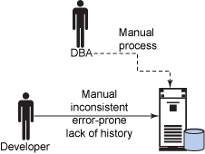
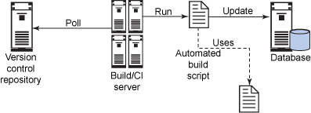
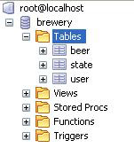
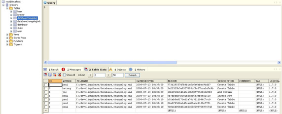

# 让开发自动化: 实现自动化数据库迁移

*使用 LiquiBase 管理数据库变更*

数据库通常不能够与它们支持的应用程序保持同步，从管理方面来讲，将数据库和数据置于一个已知状态是个很大的挑战。在本期的 [*让开发自动化*](http://www.ibm.com/developerworks/cn/java/j-ap/)中，自动化专家 Paul Duvall 演示了如何使用开源的 LiquiBase 数据库迁移工具轻松地处理数据库和应用程序的频繁变更。

在过去几年中，我使用过的大多数应用程序都是需要管理大量数据的企业应用程序。从事这类项目的开发团队常常将数据库视为与应用程序完全脱离的单独实体。造成这种现象的原因是组织结构经常将数据库团队从应用程序开发团队分离出来。有时候，这是团队的习惯引起的。不管怎样，我发现这种分离会导致（或忽略）一些实践：

*   手工变更数据库
*   不能与团队的其他成员分享数据库变更
*   使用不一致的方法变更数据库或数据
*   使用低效的手工方法管理数据库版本之间的变更

这些实践效率低下，使开发人员无法与数据变更保持同步。而且，还使应用程序的 *用户*遇到与数据不一致和数据损坏等问题。

图 1 演示了软件开发项目中经常用到的手工方法。手工方法在使用时通常不能保证一致性并且容易产生错误，撤销已完成的工作很困难，而且难以分析数据库变更的历史。例如，某个 DBA 可能想变更查找数据，但是开发人员却忘记将这个数据插入到同一个表中。

## 关于本系列

作为开发人员，我们致力于用户自动化流程；但许多开发人员却疏忽了自动化自己的开发流程。为此，我们编写了 [*让开发自动化*](http://www.ibm.com/developerworks/cn/java/j-ap/)系列文章，专门探讨软件开发流程自动化的实践应用，为您介绍 *何时*以及 *如何*成功应用自动化。

##### 图 1\. 手工变更数据库



通过实现最小化人为干预的数据库变更策略，可以避免手工方法带来的缺陷。通过结合各种实践和工具，可以使用一致且可重复的过程变更数据库和数据。在本文中，我将介绍以下内容：

*   使用一种称为 LiquiBase 的工具在各个数据库版本之间进行迁移
*   如何自动运行数据库迁移
*   一致地变更数据库的实践
*   使用 LiquiBase 进行数据库重构

在图 2 中，一个 Build/Continuous Integration 服务器轮询版本控制库（例如子版本）中的变更。当它发现一个变更后，将运行一个自动化构建脚本，该脚本使用 LiquiBase 更新数据库。

##### 图 2\. 自动化数据库迁移



通过使用类似图 2 所示的过程，团队中的任何人都可以将相同的变更应用到数据库中 —可以是本地或共享数据库服务器。此外，由于这个过程使用了自动化脚本，因此这些变更不需要任何人为干预就可以应用到不同环境中。

## DDL、DML 模式、数据库或数据

在本文中，我使用术语 *数据库变更*表示通过应用数据定义语言（Data Definition Language，DDL）脚本变更数据库结构。（一些数据库供应商将之称为 *模式*）。同时，我将通过数据定义语言（DML）脚本变更数据库称为 *数据*变更。

## 使用 LiquiBase 管理数据库变更

LiquiBase（从 2006 年开始投入使用）是一种免费开源的工具，可以实现不同数据库版本之间的迁移（参见 参考资料）。目前也存在少量其他开源数据库迁移工具，包括 openDBcopy 和 dbdeploy。LiquiBase 支持 10 种数据库类型，包括 DB2、Apache Derby、MySQL、PostgreSQL、Oracle、Microsoft®SQL Server、Sybase 和 HSQL。

要安装 LiquiBase，下载经过压缩的 LiquiBase Core 文件，解压缩，然后将包含的 liquibase-*version*.jar 文件放到系统路径中。

要开始使用 LiquiBase，需要以下四个步骤：

1.  创建一个数据库 *变更日志（change log）*文件。
2.  在变更日志文件内部创建一个 *变更集（change set）*。
3.  通过命令行或构建脚本对数据库运行变更集。
4.  检验数据库中的变更。

### 创建一个变更日志和变更集

要运行 LiquiBase，如清单 1 所示，首先要创建一个 XML 文件，也称为数据库变更日志：

##### 清单 1\. 在 LiquiBase XML 文件中定义一个变更集

```
 <?xml version="1.0" encoding="UTF-8"?> 

 <databaseChangeLog

  xsi:schemaLocation="http://www.liquibase.org/xml/ns/dbchangelog/1.7 
         http://www.liquibase.org/xml/ns/dbchangelog/dbchangelog-1.7.xsd"> 
  <changeSetid="2" author="paul"> 
    <createTable tableName="brewer"> 
      <column name="id" type="int"> 
        <constraints primaryKey="true" nullable="false"/> 
      </column> 
      <column name="name" type="varchar(255)"> 
        <constraints nullable="false"/> 
      </column> 
      <column name="active" type="boolean" defaultValue="1"/> 
    </createTable> 
  </changeSet> 
 </databaseChangeLog> 
```

## 再次使用 XML

有些开发人员会使用 XML，而其他人则没有涉足这个领域。很多开发人员甚至已经习惯使用 XML 脚本进行编程（例如，使用 Apache Ant），但是 DBA 不一定用到。最近，我非常兴奋地向一个 DBA 同事展示 LiquiBase 的一些特性。他非常喜欢其中一些强大的数据库变更管理工具，但是很怀疑 DBA 是否会使用基于 XML 的语法。我向他保证，LiquiBase 还通过它的 `sqlFile`和 `sql`定制重构支持调用定制 SQL 脚本。

可以看到，数据库变更日志文件包括一个 XML 模式引用（LiquiBase 安装中包含的 dbchangelog-1.7.xsd 文件）。我在变更日志文件中创建了一个 `&lt;changeSet&gt;`。在 `&lt;changeSet&gt;`中，我使用结构化的方式将变更应用到数据库，如 LiquiBase 模式所定义。

### 从命令行运行 LiquiBase

定义完变更集后，可以从命令行运行 LiquiBase，如清单 2 所示：

##### 清单 2\. 从命令行运行 LiquiBase

```
 liquibase --driver=org.apache.derby.jdbc.EmbeddedDriver \ 
 --classpath=derby.jar \ 
 --changeLogFile=database.changelog.xml\ 
 --url=jdbc:derby:brewery;create=true \ 
 --username= --password= \ 
 update 
```

在本例中，运行 LiquiBase 传入的内容：

*   数据库驱动器
*   数据库驱动器 JAR 文件的位置所在的类路径
*   所创建的变更日志文件（如 清单 1 所示）名称为 database.changelog.xml
*   数据库的 URL
*   用户名和密码

最后，清单 2 调用 `update`命令告诉 LiquiBase 将变更应用到数据库中。

### 在自动构建中运行 LiquiBase

这里并不使用命令行选项，通过调用 LiquiBase 提供的 Ant 任务，可以将数据库变更作为自动化构建的一部分。清单 3 展示了 Ant 任务的示例：

##### 清单 3\. 执行 `updateDatabase`Ant 任务的 Ant 脚本

```
 <target name="update-database"> 
  <taskdef name="updateDatabase" classname="liquibase.ant.DatabaseUpdateTask" 
    classpathref="project.class.path" /> 
  <updateDatabase changeLogFile="database.changelog.xml"
    driver="org.apache.derby.jdbc.EmbeddedDriver"
    url="jdbc:derby:brewery"
    username=""
    password=""
    dropFirst="true"
    classpathref="project.class.path"/> 
 </target> 
```

在清单 3 中，创建了一个名为 `update-database`的目标。在其中定义了一个将要用到的特殊 LiquiBase Ant 任务，称为 `updateDatabase`。我传入需要的值，包括 `changeLogFile`（指定 清单 1 中定义的变更日志文件）和数据库的连接信息。`classpathref`中定义的类路径必须包含 liquibase-*version*.jar。

### 运行前后

图 3 展示了在 清单 1 中运行变更集之前的数据库状态：

##### 图 3\. 运行 LiquiBase 变更集之前的数据库状态



图 4 展示了运行数据库变更集的结果，可以通过命令行（如 清单 2 所示）或从 Ant（如 清单 3 所示）运行：

##### 图 4\. 运行 LiquiBase 变更集后将变更应用到数据库



查看 完整的图。

需要注意图 4 中的几个方面。创建了两个特定于 LiquiBase 的表，以及一个根据 清单 1 中的变更集定义创建的新表。第一个特定于 LiquiBase 的表称为 `databasechangelog`，它跟踪应用到数据库的所有变更 —有助于跟踪谁执行了数据库变更以及原因。第二个特定于 LiquiBase- 的表是 `databasechangelock`，标识出具有数据库变更锁的用户。

还可以使用多种其他方式运行 LiquiBase，但我已经介绍了应用数据库变更所需的大部分信息。在使用 LiquiBase 时，将花很多时间研究应用数据库重构的各种方法，以及变更特定数据库的复杂性。例如，LiquiBase 提供了数据回滚支持，这可能是个很大的挑战。在展示数据库重构示例之前，我将快速浏览一些数据库集成的基本原则和实践，它们能帮助您充分利用数据库迁移。

* * *

## 频繁集成数据库变更

最近几年，开发团队将类似于处理源代码的原则和实践应用到数据库资产管理中。因此，可以将数据库变更编写为脚本、在一个源代码库中共享这些资产，以及将变更集成到构建和持续集成过程，这只是自然的演进。表 1 概括了开发团队将数据库变更变成一个自动化过程的一部分时，需要遵循的关键实践：

## 自动化 DBA

在我曾经参与的一些项目中，DBA 在控制开发数据库的变更时造成了一些不必要的瓶颈。DBA 应该把时间花在一些创新的、非重复性行为，例如监视和改善数据库性能，而不是假借控制性和一致性的名义做一些无用的重复性工作。

##### 表 1\. 数据库集成实践

| 实践 | 说明 |
| --- | --- |
| 脚本化所有 DDL 和 DML | 数据库变更应该能够从命令行运行。 |
| 数据资产的源代码控制 | 使用一个版本控制库管理所有与数据库相关的变更。 |
| 本地数据库沙盒 | 每个开发人员使用一个本地数据库沙盒执行变更。 |
| 自动化数据库集成 | 将数据库相关的变更作为构建过程的一部分。 |

这些实践确保了更好的一致性并防止变更在软件版本转换之间丢失。

* * *

## 对现有数据库应用重构

随着新特性添加到了应用程序中，经常需要变更数据库的结构或修改表约束。LiquiBase 提了超过 30 种数据库重构支持（参见 参考资料）。本节将介绍 4 种重构：添加列（Add Column）、删除列（Drop Column）、创建表（Create Table）和操作数据。

### 添加列

在项目的开始，几乎不可能考虑到数据库中的所有列。而有时候，用户要求新的特性 —例如为存储在系统中的信息收集更多的数据 —这就要求添加新的列。清单 4 使用 LiquiBase `addColumn`重构，向数据库中的 `distributor`表添加了一个列：

##### 清单 4\. 使用 LiquiBase 变更集中的 Add Column 数据库重构

```
 <changeSet id="4" author="joe"> 
  <addColumn tableName="distributor"> 
    <column name="phonenumber" type="varchar(255)"/> 
  </addColumn> 
 </changeSet> 
```

新的 `phonenumber`列被定义为 `varchar`数据类型。

### 删除列

假如在以后几个版本中，您想要删除在清单 4 添加的 `phonenumber`列。只需要调用 `dropColumn`重构，如清单 5 所示：

##### 清单 5\. 删除一个数据库列

```
 <dropColumn tableName="distributor" columnName="phonenumber"/> 
```

### 创建表

向数据库添加一个新表也是常见的数据库重构。清单 6 创建了一个新表 `distributor`，定义了列、约束和默认值：

##### 清单 6\. 在 LiquiBase 中创建一个新数据库表

```
 <changeSet id="3" author="betsey"> 
  <createTable tableName="distributor"> 
    <column name="id" type="int"> 
      <constraints primaryKey="true" nullable="false"/> 
    </column> 
    <column name="name" type="varchar(255)"> 
      <constraints nullable="false"/> 
    </column> 
    <column name="address" type="varchar(255)"> 
      <constraints nullable="true"/> 
    </column> 
    <column name="active" type="boolean" defaultValue="1"/> 
  </createTable> 
 </changeSet> 
```

这个示例使用了 `createTable`数据库重构作为变更集的一部分（清单 1 中也使用了 `createTable`）。

### 操作数据

在应用了结构性数据重构后（例如添加列和创建表），通常需要向受重构影响的表中插入数据。此外，可能需要修改查找表（或其他类型的表）中的现有数据。清单 7 展示了如何使用一个 LiquiBase 变更集插入数据：

##### 清单 7\. 使用一个 LiquiBase 变更集插入数据

```
 <changeSet id="3" author="betsey"> 
  <code type="section" width="100%"> 
  <insert tableName="distributor"> 
    <column name="id" valueNumeric="3"/> 
    <column name="name" value="Manassas Beer Company"/> 
  </insert> 
  <insert tableName="distributor"> 
    <column name="id" valueNumeric="4"/> 
    <column name="name" value="Harrisonburg Beer Distributors"/> 
  </insert> 
 </changeSet> 
```

您应该编写用于操作数据的 SQL 脚本，因为使用 LiquiBase XML 变更集限制很多。有时候使用 SQL 脚本向数据库应用大量的变更会简单一些。LiquiBase 也可以支持这些情景。清单 8 调用变更集中的 `insert-distributor-data.sql`来插入 `distributor`表数据：

##### 清单 8\. 从 LiquiBase 变更集运行一个定制 SQL 文件

```
 <changeSet id="6" author="joe"> 
  <sqlFile path="insert-distributor-data.sql"/> 
 </changeSet> 
```

LiquiBase 支持很多其他数据库重构，包括 Add Lookup Table 和 Merge Columns。可以使用如清单 4 到清单 8 所示的方式定义所有这些支持。

* * *

## 持续保持数据同步

在软件开发中，如果遇到一些难题，您应该更多地关注它，而不是等到以后才手动执行这些操作，从而使问题变得更严重，花费也更大。数据库迁移非常重要，自动化迁移过程能够获得很多好处。在本文中，我已经介绍了以下内容：

*   演示如何使用 LiquiBase 脚本化数据库迁移并将这些变更变成自动化构建过程的一部分
*   描述了实现一致性的数据库集成的原则和实践
*   展示如何通过使用 LiquiBase 应用数据库重构，比如 Add Column、Create Table 和更新数据

表 2 总结了 LiquiBase 提供的一些特性的列表：

##### 表 2\. LiquiBase 部分特性总结

| 特性 | 说明 |
| --- | --- |
| 支持多个数据库 | 支持 DB2、Apache Derby、MySQL、PostgreSQL、Oracle、Microsoft SQL Server、Sybase 和 HSQL 等。 |
| 查看应用到数据库的变更的历史。 | 使用 `databasechangelog`表，可以查看应用到数据库的每一个变更。 |
| 生成数据库差异日志 | 了解 LiquiBase 变更集以外的应用到数据库的变更。 |
| 能够运行定制 SQL 脚本 | 使用 LiquiBase 调用已经编写好的 SQL 脚本。 |
| 回滚数据库变更的工具 | 可以对应用到数据库的任何变更执行回滚。 |

可以看到，通过自动化脚本恰当地应用变更时，数据库迁移变得更加轻松，并且成为团队中的多数成员都可以运行的重复过程。