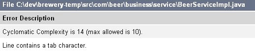
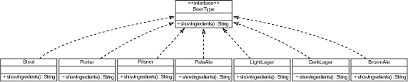
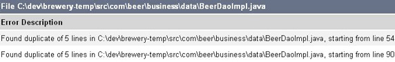

# 让开发自动化: 持续重构

*使用静态分析工具识别代码味道*

重构是公认的改进现有代码的好方法。然而，如何通过一种一致且可重复的方式 *找到*需要重构的代码呢？本期的 [*让开发自动化*](http://www.ibm.com/developerworks/cn/java/j-ap/)阐述了如何使用静态分析工具来识别需要重构的代码味道，并举例说明了如何改进坏味道代码。

在过去的几年里，我曾看过很多项目的大量源代码，从精美的设计到像是用胶带绑定到一起的代码。我写过新的代码也维护过其他开发人员的源代码。我喜欢编写新的代码，但也喜欢采用一些现有的代码，以某种方法将其简化或将重复的代码提取到一个公共类中。在我早期的工作生涯中，许多人都认为如果不编写新的代码就不会有好的效率。幸好，在 20 世纪 90 年代末，Martin Fowler 编写了 *Refactoring*一书（参见 参考资料），它使得在不改变外部行为的前提下改进现有代码成为可能。

我在 [本系列](http://www.ibm.com/developerworks/cn/java/j-ap/)中所一直推崇的就是 *效率*：如何减少耗时过程的冗余度，更快速地执行它们。在本文的任务中，我一样推崇这个目标，*并且*将论述怎样更 *有效地*执行它们。

## 关于本系列

作为开发人员，我们致力于为用户自动化流程；但许多开发人员疏忽了自动化我们自己的开发流程的机会。为此，我们编写了 [*让开发自动化*](http://www.ibm.com/developerworks/cn/java/j-ap/)系列文章，专门探讨软件开发流程自动化的实践应用，为您介绍 *何时*以及 *如何*成功应用自动化。

重构的一个典型方法是在引入新代码或更改方法时对现有代码做出小小的变动。该技巧面临的挑战在于一个开发团队的开发人员的应用方法不一致，并且很容易错失重构的机会。这也正是我提倡使用静态分析工具识别编码违规的原因所在。有了这些工具，您就能够从总体上了解代码库，并且处于类或方法的级别。幸运的是，在 Java™程序设计中，您可以选择的可免费下载的开源静态分析工具很多：CheckStyle、PMD、FindBugs、JavaNCSS、JDepend 等等。

在本文中，您将学习如何：

*   使用 CheckStyle 度量 **圈复杂度（cyclomatic complexity）**，并提供诸如 **Replace Conditional with Polymorphism**之类的重构，以此来减少 **条件复杂度**代码味道
*   使用 CheckStyle 评估 **代码重复率**，并提供诸如 **Pull Up Method**之类的重构，以此来移除 **重复代码**
*   使用 PMD（或 JavaNCSS）计算 **源代码行**，并提供诸如 **Extract Method**之类的重构，以此来淡化 **大类**代码味道
*   使用 CheckStyle（或 JDepend）确定一个类的 **传出耦合度（efferent coupling）**，并提供诸如 **Move Method**之类的重构，以此来除掉 **过多的导入**代码味道

我将使用如下的通用格式来检查每一种代码味道：

1.  描述可以指示出代码里面的问题的味道
2.  定义可以找到该味道的度量方法
3.  展示可以度量代码味道的工具
4.  提供用于修复代码味道的重构和模式（在某些情况下）

实质上，这个方法提供了一个找到和修复整个代码库中的代码味道的一个框架。这样您就可以更好地了解到代码库中较危险的部分，然后再做出更改。更好的是，我还会向您展示如何将这个方法集成到自动构建中。

## 您的代码有 *味道*么？

所谓代码味道其实只是一种 *提示*，提示一些内容可能存在错误。和模式类似，代码味道提供了一个通用词汇表，您可以用它来快速识别这些类型的潜在问题。在文章中 *真实*地示范代码味道是很有难度的，因为它可能包括很多行代码，这样就过分地加大了文章的篇幅。因此，我会只针对其中的一些味道进行示范，然后您就可以根据查看特定代码味道的经验进行推断，识别出剩余的代码味道。

## 条件复杂度

**味道**：条件复杂度

**度量**：圈复杂度

**工具**：CheckStyle、JavaNCSS 以及 PMD

**重构**：Replace Conditional with Polymorphism、Extract Method

### 味道

*条件复杂度*可以以几种不同的方式出现在源代码中。这种代码味道的一个例子就是含有多个条件语句，如 `if`、`while`或者 `for`语句。另一种条件复杂度是以 `switch`语句的形式呈现出来的，如清单 1 所示：

##### 清单 1\. 使用 `switch`语句来执行条件行为

```
 ... 
 switch (beerType) { 
  case LAGER:  
    System.out.println("Ingredients are..."); 
     ... 
     break; 
  case BROWNALE: 
    System.out.println("Ingredients are..."); 
     ... 
     break; 
  case PORTER  
    System.out.println("Ingredients are..."); 
     ... 
     break; 
  case STOUT: 
    System.out.println("Ingredients are..."); 
     ... 
     break; 
  case PALELAGER: 
    System.out.println("Ingredients are..."); 
     ... 
     break; 
  ... 
  default: 
    System.out.println("INVALID."); 
     ... 
     break; 
 } 
 ... 
```

`switch`语句本身并没有不妥。但当一个语句包含太多的选择和代码时，它就可能暗示有需要重构的代码。

### 度量

要确定条件复杂度代码味道，需要确定方法的 *圈复杂度*。圈复杂度是一种度量方法，由 Thomas McCabe 于 1975 年定义。圈复杂度数（Cyclomatic Complexity Number，CCN）度量一个方法中某一路径的数量。无论一个方法中有多少条路径，它的起始 CNN 都从 1 开始。每一个条件构造，如 `if`、`switch`、`while`和 `for`语句，都被分配一个 1 值和异常路径。一个方法的总的 CCN 表明了它的复杂度。很多人认为当 CCN 为 10 或超过 10 时，就表明该方法过于复杂。

### 工具

CheckStyle、JavaNCSS、以及 PMD 都是度量圈复杂度的开源工具。清单 2 展示了用 XML 定义的 CheckStyle 规则文件的一个代码片断。`CyclomaticComplexity`模块定义了一个方法的 CCN 的最大限度。

##### 清单 2\. 配置 CheckStyle，查找圈复杂度为 10 或大于 10 的方法

```
 <module name="CyclomaticComplexity"> 
  <property name="max" value="10"/> 
 </module> 
```

用清单 2 的 CheckStyle 规则文件、清单 3 的 Gant 例子来示范如何将 CheckStyle 作为一个自动构建的一部分来运行。（参见 什么是 Gant ？侧边栏）：

##### 清单 3\. 使用 Gant 脚本来执行 CheckStyle 检查

```
 target(findHighCcn:"Finds method with a high cyclomatic complexity number"){ 
  Ant.mkdir(dir:"target/reports") 
  Ant.taskdef(name:"checkstyle", 
    classname:"com.puppycrawl.tools.checkstyle.CheckStyleTask", 
    classpathref:"build.classpath") 
  Ant.checkstyle(shortFilenames:"true", config:"config/checkstyle/cs_checks.xml", 
    failOnViolation:"false", failureProperty:"checks.failed", classpathref:"libdir") { 
    formatter(type:"xml", tofile:"target/reports/checkstyle_report.xml") 
    formatter(type:"html", tofile:"target/reports/checkstyle_report.html") 
    fileset(dir:"src"){ 
      include(name:"**/*.java") 
    } 
  } 
 } 
```

## 什么是 Gant ？

Gant 是一个自动构建工具，它提供了一个支持构建依赖关系的表达能力强的编程语言。开发人员利用 Groovy 编程语言的强大功能编写 Gant 脚本。由于 Gant 提供对 Ant 的 API 的完全访问，所以任何可以运行于 Ant 的东西都可以从 Gant 脚本运行。（参见 “[用 Gant 构建软件](http://www.ibm.com/developerworks/cn/edu/j-dw-java-gant-i.html)” 教程，了解 Gant。）

清单 3 中的 Gant 脚本创建了图 1 中展示的 CheckStyle 报告。该图下面的部分指示出了一个方法的 CheckStyle 圈复杂度违规。

##### 图 1\. CheckStyle 报告根据过高的 CCN 来指示一种方法失败



### 重构

图 2 为用 UML 表示的 *Replace Conditional with Polymorphism*重构：

##### 图 2\. 用多态替代条件语句



单击 [此处](http://www.ibm.com/developerworks/cn/java/j-ap07088/figure2.html)查看完整图。

在图 2 中，我：

1.  创建了一个叫做 `BeerType`的 Java 界面
2.  定义了一个通用的 `showIngredients()`方法
3.  为每一个 `BeerType`创建了一个实现类

为了使文章保持简洁，我仅为每一个类提供一个方法的实现。显然，创建一个界面的方法可能不只一个。重构能够使代码更易于维护，如 Replace Conditional with Polymorphism 和 Extract Method（本文稍后将会讨论）。

* * *

## 重复代码

**味道**：重复代码

**度量**：代码重复率

**工具**：CheckStyle、PMD

**重构**：Extract Method、Pull Up Method、Form Template Method、Substitute Algorithm

### 味道

重复代码可能在代码库中悄然发生。有时，复制粘贴某些代码要比将该行为泛化到另一个类更简单。但复制粘贴的方法存在一个问题，即它强制将代码复制多份，并且需要维护。而且当复制出的代码发生轻微的变化而引发行为不一致时，就会发生更不易察觉的问题，具体取决于哪个方法在执行该行为。清单 4 是一个关闭代码库连接的代码示例，相同的代码出现在两种方法中：

##### 清单 4\. 重复代码

```
 public Collection findAllStates(String sql) { 
 ... 
  try { 
    if (resultSet != null) { 
      resultSet.close(); 
    } 
    if (stmt != null) { 
      stmt.close(); 
    } 
    if (conn != null) { 
     conn.close(); 
   } 
   catch (SQLException se) { 
     throw new RuntimeException(se); 
   } 
 } 
 ... 
 } 
 ... 
 public int create(String sql, Beer beer) { 
 ... 
  try { 
    if (resultSet != null) { 
      resultSet.close(); 
    } 
    if (stmt != null) { 
      stmt.close(); 
    } 
    if (conn != null) { 
     conn.close(); 
   } 
   catch (SQLException se) { 
     throw new RuntimeException(se); 
   } 
 } 
 ... 
 } 
```

## 我有性能更好的 IDE

虽然在本文的例子中我使用 Gant 来运行查找特定味道的工具，但是使用 IDE 也同样可以解决这些问题。Eclipse IDE 就有很多静态分析工具的插件。但我仍然推荐使用自动构建工具，因为这样可以在其他环境中运行集成构建，无需使用 IDE。

### 度量

查找重复代码的度量方法是在代码库中的类的内部和其他类之间搜索代码重复。没有工具的话，类间的重复就更难评估。由于复制的代码通常都会发生一些轻微的变化，因此不仅要度量完全相同的代码，而且要度量 *相似*的代码，两者都很重要。

### 工具

PMD 的 Copy/Paste Detector（CPD）与 CheckStyle 这两种开源工具可以用于在整个 Java 代码库中查找相似的代码。清单 5 中的 CheckStyle 配置文件例子示范了如何使用 `StrictDuplicateCode`模块：

##### 清单 5\. 使用 CheckStyle 找到至少 10 行重复代码

```
 <module name="StrictDuplicateCode"> 
  <property name="min" value="10"/> 
 </module> 
```

清单 5 中的 `min`属性设置了 CheckStyle 将会标记出的最小重复行数，以供查阅。在这样的情况下，它将只指示出那些至少有 10 行类似或重复的代码块。

图 3 展示了自动构建运行后，清单 5 中的模块设置的结果：

##### 图 3\. CheckStyle 报告指示代码重复度过高



### 重构

在清单 6 中，我用了 清单 4 中的重复代码，使用了 *Pull Up Method*重构来降低重复度 —将行为从较大方法提取到一个抽象类方法中：

##### 清单 6\. Pull Up Method

```
 ... 
 } finally { 
  closeDbConnection(rs, stmt, conn); 
 } 
 ... 
```

## 不要忘记编写测试程序

任何时候改变现有代码，您都需要用诸如 JUnit 这样的框架编写相应的自动测试程序。修改现有代码是存在风险的；而将这个风险降到最低的一种方法就是通过测试来验证该行为在现在和将来都有效。

重复代码是难以避免的。我永远不会建议一个团队去努力实现什么 *无*重复之类的目标，这是不切实际的。然而，确保代码库中的重复代码不会增多这样的目标是可以实现的。使用诸如 PMD 的 CPD 或 CheckStyle 这样的静态分析工具，您能够将整个分析过程作为自动构建的一部分，持续分析，确定代码重复度高的区域。

* * *

## 长方法（大类）

**味道**：长方法（大类）

**度量**：源代码行数（SLOC）

**工具**：PMD、JavaNCSS、CheckStyle

**重构**: Extract Method、Replace Temp with Query、Introduce Parameter Object、Preserve Whole Object、Replace Method with Method Object

### 味道

我一直在尝试坚持的一条经验法则是将方法限制在 20 行或 20 行以内。当然，这个原则也可能会有例外，但如果我的方法超过 20 行的话，我就会更仔细地去了解它。通常情况下，长方法和条件复杂度是息息相关的。而大类与长方法之间又有着必然的联系。我可以给您展示一个 2200 行的方法，这个方法是我在需要维护的一个项目上发现的。我将整个含有 25000 行的代码的类打印了出来，让我的同事来找出里面的错误。这么说吧，当我把打印出来的代码沿着走廊卷起来的时候，他们就已经同意我的看法了。

清单 7 中高亮显示的部分展示了一个长方法代码味道示例的一小部分：

##### 清单 7\. 长方法代码味道

```
 public void saveLedgerInformation() { 
 ... 
 try { 
  if (ledger.getId() != null && filename == null) { 
    getLedgerService().saveLedger(ledger); 
  } else { 
    accessFiles().decompressFiles(files, filenames); 
  } 
  if (!files.get(0).equals(upload)) { 
    upload = files.get(0); 
    filename = filenames.get(0); 
  } 
  if (invalidFiles.isUnsupported(filename)) { 
    setError(fileName, message.getMessage()); 
  } else { 
  LedgerFile entryFile = accessFiles().add(upload, filename); 
  if (fileType != null && FileType.valueOf(fileType) != null) { 
    entryFile.setFileType(FileType.valueOf(fileType)); 
  } 
  getFileManagementService().saveLedger(ledger, entryFile); 
  if (!FileStatus.OPENED.equals(entryFile.getFileStatus())) { 
    getFileManagementService().importLedgerDetails(ledger); 
  } 
  if (uncompressedFiles.size() > 1) { 
    Helper.saveMessage(getText("ledger.file")); 
  } 
  if (user.getLastName() != null) { 
    SearchInfo searchInfo = ServiceLocator.getSearchInfo(); 
    searchInfo.setLedgerInfo(null); 
    isValid = false; 
    setDefaultValues(); 
    resetSearchInfo(); 
    if (searchInfoValid && ledger != null) { 
      isValid = true; 
    } 
  } 
 } catch (InvalidDataFileException e) { 
  ResultType result = e.getResultType(); 
  for (ValidationMessage message : result.getMessages()) { 
    setError(fileName, message.getMessage()); 
  } 
  ledger.setEntryFile(null); 

 } ... 
```

### 度量

在过去的几年里，SLOC 度量方法被误认为是高效率的象征。尽管我们都知道，并不一定是行数越多越好。但说到复杂度，SLOC 可是一个有用的度量方法。一个方法（或类）的行数越多，将来维护其代码就可能越难。

### 工具

清单 8 中的脚本为长方法（大类）找到了 SLOC 度量方法：

##### 清单 8\. 识别过大的类和方法的 Gant 脚本

```
 target(findLongMethods:"runs static code analysis"){ 
 Ant.mkdir(dir:"target/reports") 
 Ant.taskdef(name:"pmd", classname:"net.sourceforge.pmd.ant.PMDTask", 
   classpathref:"build.classpath") 
 Ant.pmd(shortFilenames:"true"){ 
   codeSizeRules.each{ rfile -> 
    ruleset(rfile) 
   } 
   formatter(type:"xml", tofile:"target/reports/pmd_report.xml") 
   formatter(type:"html", tofile:"target/reports/pmd_report.html") 
   fileset(dir:"src"){ 
     include(name:"**/*.java") 
   } 
  }  
 } 
```

我又使用了 Gant 访问 Ant API 来执行 Ant 任务。在清单 8 中，我调用 PMD 静态分析工具来搜索代码库中的长方法。PMD（连同 JavaNCSS 与 CheckStyle）也可以用于查找长方法、大类以及其他代码味道。

### 重构

清单 9 展示了用 *Extract Method*重构来减少 清单 7 中的长方法代码味道的一个例子。将清单 7 的方法中的行为提取到清单 9 的代码中以后，我就可以从清单 7 的 `saveLedgerInformation()`方法中调用新建的 `isUserValid()`方法了：

##### 清单 9\. Extract Method 重构

```
 private boolean isUserValid(User user) { 
  boolean isValid = false; 
  if (user.getLastName() != null) { 
    SearchInfo searchInfo = ServiceLocator.getSearchInfo(); 
    searchInfo.setLedgerInfo(null); 
    setDefaultValues(); 
    resetSearchInfo(); 
    if (searchInfoValid && ledger != null) { 
      isValid = true; 
    } 
  } 
  return isValid; 
 } 
```

通常，长方法和大类也暗示着存在其他代码味道，如条件复杂度和重复代码。因此，找到这些长方法和大类也就可以修复其他的问题了。

* * *

## 太多导入

**味道**：太多导入

**度量**：传出耦合（每个类的扇出（fan-out））

**工具**：CheckStyle

**重构**：Move Method、Extract Class

### 味道

*太多导入*表明一个类过多地依赖于其他的类。您会注意到，由于一个类与很多其他的类耦合得太紧密，修改这个类会导致必须对很多其他的类进行修改，这时就说明这个类存在这种代码味道了。清单 10 中的多个导入就是一个例子：

##### 清单 10\. 一个类中的多个导入

```
 import com.integratebutton.search.SiteQuery; 
 import com.integratebutton.search.OptionsQuery; 
 import com.integratebutton.search.UserQuery; 
 import com.integratebutton.search.VisitsQuery; 
 import com.integratebutton.search.SiteQuery; 
 import com.integratebutton.search.DateQuery; 
 import com.integratebutton.search.EvaluationQuery; 
 import com.integratebutton.search.RangeQuery 
 import com.integratebutton.search.BuildingQuery; 
 import com.integratebutton.search.IPQuery; 
 import com.integratebutton.search.SiteDTO; 
 import com.integratebutton.search.UrlParams; 
 import com.integratebutton.search.SiteUtil; 

 import java.text.DateFormat; 
 import java.text.ParseException; 
 import java.text.SimpleDateFormat; 
 import java.util.ArrayList; 
 import java.util.Calendar; 
 import java.util.Collection; 
 import java.util.Collections; 
 import java.util.Date; 
 import java.util.HashMap; 
 import java.util.List; 
 import java.util.Map; 
 import org.apache.log4j.Logger; 
 ... 
```

### 度量

找到带有太多责任的类的一个方法就是通过 *传出耦合*度量方法，亦指 *扇出复杂度*。扇出复杂度给被分析的类所依附的每一个类赋值 1。

### 工具

清单 11 展示了一个用 CheckStyle 设置最大扇出复杂度数的例子：

##### 清单 11\. 使用 CheckStyle 设置最大扇出复杂度

```
 <module name="ClassFanOutComplexity"> 
  <property name="max" value="10"/> 
 </module> 
```

## Refactoring to Patterns

*工厂方法*模式是应用重构时可以实现的多种设计模式之一。用工厂方法创建类无需显式定义正在创建的实际的类。这个模式可以使界面比实现类更简单。当根据代码味道实现重构时，您也可以使用其他的设计模式；参见 参考资料查看专门研究这个概念的书籍的链接。

### 重构

修复由于太多导入而引发的耦合过紧的方法有很多种。对于诸如 清单 10 中那样的代码来说，可用的重构就包括 *Move Method*重构：将方法从单独的 *`Query`类移动到 Java 界面，并定义所有 `Query`类必须实现的通用方法。然后再使用 工厂方法模式，这样耦合度就与界面相关联了。

通过使用 Gant 自动构建脚本执行 CheckStyle Ant 任务，我可以搜索代码库，查找过多依赖于其他类的类。当修改这些类中的代码时，就能够实现特定的重构（比如 Move Method）和特定的设计模式，以逐步改进可维护性。

* * *

## 重构……要尽早且要经常进行

持续集成（Continuous Integration，CI）就是经常集成变更。正如其典型的实现方式一样，每当对项目的版本控制储存库做出一个更改时，运行于独立机器上的自动 CI 服务器就会触发一个自动构建。为了确保 清单 3 和 清单 8 中的脚本可以在对数据库做出更改时一致地运行，您需要配置一个诸如 Hudsona 这样的 CI 服务器（参见 参考资料）。Hudson 是以 WAR 文件的形式发布的，您可以将它放入任何 Java Web 容器中。

由于 清单 3 和 清单 8 中的例子使用了 Gant，下面我就简要介绍一下配置 Hudson CI 服务器以运行 Gant 脚本的步骤：

1.  在 Hudson 的仪表板上为 Hudson 安装 Gant 插件：首先选择 **Manage Hudson**，再选择 **Manage Plugins**，然后选择 **Available**选项卡。在这个选项卡上选中 Gant 插件复选框，然后单击 **Install**按钮。
2.  重新启动 Web 容器（例如，Tomcat）。
3.  选择 **Manage Hudson**，然后选择 **Configure System**。在 **Gant installation**部分，键入一个惟一的名称以及 Groovy 安装到运行 Hudson 的机器上的位置。保存所作更改。
4.  返回到仪表板（选择 **Hudson**链接），选择一个 **existing Hudson Job**，再选择 **Configure**，然后单击 **Add build step**按钮，选择 **Invoke Gant script**选项。

配置 Hudson，使其运行使用 Gant 编写的自动构建脚本。一旦诸如长方法和条件复杂度这样的代码味道被引入到代码库中，您立刻就会得到与它们相关的度量方法的反馈。

* * *

## 其他味道与重构

并非所有的味道都有相关的度量方法。但是，静态分析工具能够揭露的味道不止我所示范的这些。表 1 列举了其他的代码味道、工具、以及可能的重构例子：

##### 表 1\. 其他味道与重构

| 味道 | 工具 | 重构 |
| --- | --- | --- |
| 死代码 | PMD | Remove Code |
| 临时字段 | PMD | Inline Temp |
| 不一致 / 拘谨（uncommunicative）的名称 | CheckStyle、PMD | Rename Method、Rename Field |
| 长参数列表 | PMD | Replace Parameter with Method、Preserve Whole Object、Introduce Parameter Object |

本文提供了一种使代码味道与一种度量方法相关的模式，这种度量方法可以配置为通过自动静态分析工具标记。您可以使用或不使用特定的设计模式来进行重构。这为您提供了一个以可重复的方式一致地查找和修复代码味道的框架。我坚信本文的例子也有助于您使用静态分析工具来查找本文未涉及到代码味道。