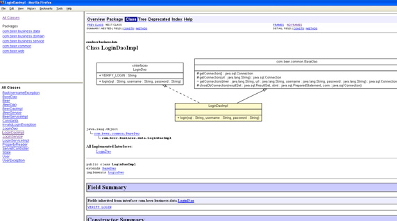
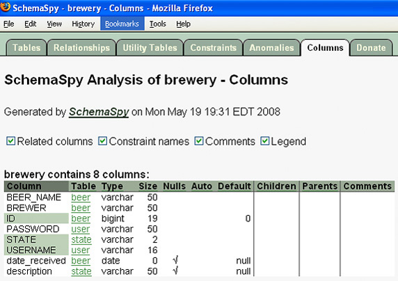
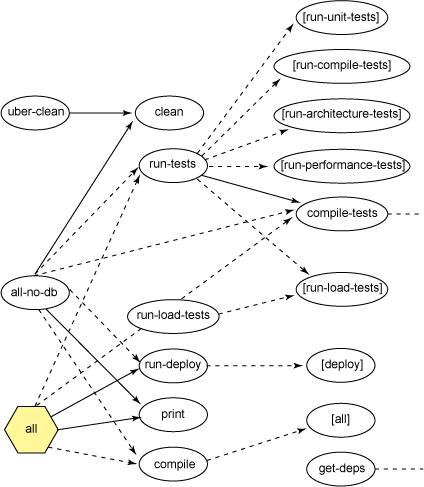
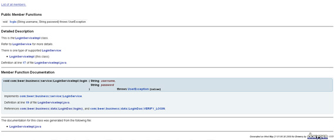
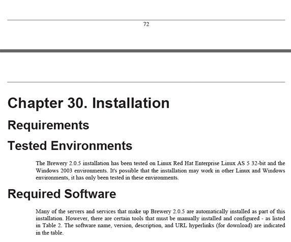

# 让开发自动化: 文档化一键通

*自动生成开发人员和用户文档*

项目的文档化通常都是交付软件产品时不可避免的难题。但是想象一下如果仅需单击一个按钮就能够生成文档呢？在本期的 [*让开发自动化*](http://www.ibm.com/developerworks/cn/java/j-ap/)中，自动化专家 Paul Duvall 阐述了如何运用开源工具自动生成统一建模语言（Unified Modeling Language，UML）图、构建图、实体关系图（entity-relationship diagram，ERD）乃至用户文档。

很少有软件开发人员愿意为他们的软件开发项目编写文档。然而，除非您永远不想完成您的项目，或者您永远独立进行软件开发，又或者您没有用户 —这对一个项目来说可不是一个好现象，否则您就需要用一种方式来向别人交待您的软件的用途。有些开发者误解了 Agile Manifesto 的 “可运行的软件 *优于*全面的文档” 的说法，以为根本不需要 *任何的*文档资料（请参阅 参考资料）。另一方面，多余的文档对用户或其他开发人员来说也是一个负担。我通常寻找一种中间办法。您猜对了：本文将向您展示如何运用 *自动化*来简化项目文档的生成过程，从而减轻这方面的负担。

## 关于本系列

作为开发人员，我们致力于为用户自动化流程；但许多开发人员疏忽了自动化我们自己的开发流程的机会。为此，我们编写了 [*让开发自动化*](http://www.ibm.com/developerworks/cn/java/j-ap/)系列文章，专门探讨软件开发流程自动化的实践应用，为您介绍 *何时*以及 *如何*成功应用自动化。

按照我的经验，有两个关键性的问题制约着软件开发的文档化。第一个问题，似乎没有人会去阅读文档。第二个常见问题就是几乎是在编写文档的同时，它就已经过时了。这两个问题是有着因果联系的：如果文档总是保持最新，那么人们就更有可能去阅读它。自动化生成文档便可以解决这两个问题，它可以保持文档的时效性，从而使它对您的软件用户更加有用。

自动化也可能对其他类型的文档有利，但在本文中我将着重阐述如何让那些令人痛苦的文档化任务自动化（请参阅 参考资料查找下面列表中提到的工具的链接）：

*   使用 UMLGraph 生成当前源代码的 **UML**图。
*   使用 SchemaSpy 创建 **实体关系图（ERD）**，归档数据库中的表格和关系。
*   使用 Grand 生成构建目标以及它们之间的关系的 Ant **构建图**。
*   使用 Doxygen 生成 **源代码文档**。
*   使用 DocBook 制作 **用户文档**。

我将使用一般的方法阐述以下内容：

1.  描述手动执行每一项任务遇到的问题。
2.  呈现一个结合使用 Apache Ant 和相关的文档 / 图表生成工具实现自动化的例子。
3.  展示一个基于代码示例的脚本生成文档的图象。

和本系列前面的文章一样，文中所有示例都使用可免费获得的开源工具，您可以在自己的项目中使用。有些工具（例如，UMLGraph 和 Grand）会使用一个附带的 GraphViz 工具，该工具要用到一个由特定工具生成的 .dot 文件。

## 将代码反向工程到 UML 中

我曾遇到过一些拥有十分美观的 UML 图的项目 —在项目的初始阶段。问题是，在某种特殊情况下，技术负责人无法使模型与源代码同步。或者需要将宝贵的时间浪费在将源代码 *手动*反向工程到模型中。这两种情况都不尽如人意。如果模型无法如实地展示签入到版本控制库中的代码，那么这个 UML 图构造的再美观也毫无意义。如果您没有根据实际的代码制定决策，那么您可能就要面临随之而来的很多问题。

您可以在构建过程中生成图示，并建立一个持续集成（Continuous Integration，CI）环境来即时地（或定期地）创建图示。这样您就能够制作出有益于决策、易于创建且始终反映最新情况的图示了。

清单 1 使用 Ant、UMLGraph 以及 Graphviz 对源代码进行文档化 :

##### 清单 1\. 使用 UMLGraph 文档化工具的 Ant 脚本

```
 <property name="reports.dir" value="${basedir}/reports"/> 
  <mkdir dir="${reports.dir}"/> 
  <path id="project.path"> 
    <pathelement path="${basedir}/src"/> 
    <pathelement path="${basedir}/lib"/> 
  </path> 
  <javadoc sourcepath="${basedir}/src" destdir="${reports.dir}" 
    classpathref="project.path" access="private"> 
    <doclet name="org.umlgraph.doclet.UmlGraphDoc" 
      path="UMLGraph.jar"> 
        <param name="-attributes" /> 
        <param name="-enumerations" /> 
        <param name="-enumconstants" /> 
        <param name="-operations" /> 
        <param name="-qualify" /> 
        <param name="-types" /> 
        <param name="-visibility"/> 
    </doclet> 
  </javadoc> 
  <apply executable="dot" dest="${reports.dir}" parallel="false"> 
    <arg value="-Tpng"/> 
    <arg value="-o"/> 
     <targetfile/> 
     <srcfile/> 
     <fileset dir="${reports.dir}" includes="*.dot"/> 
     <mapper type="glob" from="*.dot" to="*.png"/> 
  </apply> 
```

清单 1 中，我结合使用 UMLGraph 和 Javadoc 在 Javadoc HTML 报告内部生成一些基本的 UML 类图。为了自定义展示在每一个类图中的信息，调用 `UmlGraphDoc`时，我传递了如下属性：

## 使用 GraphViz 制图

要正常使用 UMLGraph，您必须先安装 Graphviz 工具（请参阅 参考资料，并且计算机的系统路径中必须包含 Graphviz .dot 文件。

*   **`-attribute`**为类显示字段。
*   **`-enumeration`**展示不同的枚举。
*   **`-enumconstant`**为枚举展示可能的值。
*   **`-operation`**为类显示 Java 方法。
*   **`-qualify`**显示完全限定类名。
*   **`-type`**显示参数数据类型和返回类型
*   **`-visibility`**展示字段和方法修改语：`public`、`protected`、`private`或 `default`。

图 1 展示了用 UMLGraphshows 生成到 HTML 中的 `LoginDaoImpl`类及其关系的 UML 图例：

##### 图 1\. 用 UMLGraph 生成的 UML 图



请 单击此处查看完整图形。

UMLGraph 能够生成更复杂的关系和其他细节。但是，即便是这个简单例子中极其基本的 UML 类图，就已经提供了相当多的信息。它也可以根据当前的代码库快捷、形象地展示软件。它防止了 “代码 *应该*是这样的” 这种陈述方式，并且有益于做出更好的决策（关于描述了多种可以自定义 UMLGraph 输出的属性的链接，请参阅 参考资料）。

* * *

## 数据库文档化

自动创建最新的 UML 图将使您获益良多，同样，自动地可视化表示数据库也可以让您受益匪浅。实体关系图（ERD）是实现数据库可视化的最流行的图示类型。大多数创建 ERD 的工具（例如，ERWinfor）都需要手动生成 ERD。虽然我将要示范的工具 SchemaSpy 无法与现存的一些更复杂的工具媲美，但是它能够提供数据库的高级 ERD 视图 —以及约束、关系等。而且，通过自动构建来运行它，您就可以轻松地从您的版本控制库中检查数据定义语言（Data Definition Language，DDL）的最新显示。

清单 2 中的 Ant 脚本使用 SchemaSpy 工具来创建 Javadoc 格式的文件：

##### 清单 2\. 结合使用 SchemaSpy、Ant 和 Javadoc

```
 <property name="reports.dir" value="${basedir}"/> 
 <java jar="schemaSpy_3.1.1.jar"
  output="${reports.dir}/output.log"
  error="${reports.dir}/error.log"
  fork="true"> 
  <arg line="-t mysql"/> 
  <arg line="-host localhost"/> 
  <arg line="-port 3306"/> 
  <arg line="-db brewery"/> 
  <arg line="-u root"/> 
  <arg line="-p sa"/> 
  <arg line="-cp mysql-connector-java-5.0.5-bin.jar"/> 
  <arg line="-o ${reports.dir}"/> 
 </java> 
```

清单 2 使用 `java`Ant 任务调用 SchemaSpy，传递了很多属性：

*   **`-t`**为数据库类型（有效值为 `mysql`、`ora`、`db2`，等等。)
*   **`-host`**为托管数据库的计算机名。
*   **`-port`**为数据库 URL 的端口数。
*   **`-u`**为数据库用户名。
*   **`-p`**为数据库密码。
*   **`-cp`**为类路径（用于指示数据库驱动程序 JAR 文件的位置）。
*   **`-o`**为输出目录的位置。

这些 SchemaSpy 的命令行属性用于生成显示 ERD 的 HTML 文件，如图 2 所示：

##### 图 2\. 用 SchemaSpy 和 Ant 创建的 ERD



通过结合使用多种工具、作为构建的一部分针对数据库执行 ERD 生成脚本，并调度 ERD 生成，您就可以在开发过程中轻松、快速地做出很多数据库决策。

* * *

## 图解构建过程

通常，构建脚本在相关的目标之间有着复杂的关系。我曾见过许多构建脚本足有 1000 多行，含有大量多余的重复行。如果没有自动构建的高级视图，这些构建脚本会很难处理。要想快速确定一个构建过程正在处理的内容，一个有效的方法就是创建一个目标和关系图。Ant 目标的一个可视模型能够帮助您作出更有效、更明智的决策，以改进构建脚本的设计。

结合使用 Ant、Grand 和 Graphviz，您就可以创建出构建目标的精确的可视表示。有很多的工具都旨在可视化表示 Ant 目标。而 Grand 的一个优势便在于它运用了 Ant API，这样无论 Ant 脚本是否完全有效，它都可以创建图示。

清单 3 中的 Ant 脚本展示了如何运用 Grand 工具来创建 Ant 脚本目标的可视表示，包括目标间的依赖性：

##### 清单 3\. 使用 Ant 和 Grand 创建 Ant 目标的图示

```
 <target name="create-ant-diagram"> 
  <property name="file.type" value="pdf"/> 
  <typedef resource="net/ggtools/grand/antlib.xml" 
    classpath="grand-1.8.jar"/> 
  <grand output="build.dot" buildfile="${basedir}/build.xml"/> 
    <exec executable="dot"> 
      <arg line="-T${file.type} -Gsize=11.69,8.27 -Grotate=90 -o build.${file.type} 
    ${grand.output.file}"/> 
    </exec> 
 </target> 
```

在清单 3 中，首先，我通过指向 `grand-1.8.jar`创建了任务。接着，我在 `buildfile`属性中为正在分析的构建文件命名。`output`属性是我正在创建的 Graphviz 文件（我将其命名为 `build.dot`）。 最后，我调用了 `dot`可执行文件生成 `buildfile`的构建目标的 PDF。图 3 展示了这种文件的一个例子：

##### 图 3\. 使用 Ant、Grand 和 GraphViz 生成 Ant 目标的图示



我可以运用这些图表分析已完成的项目，或者为开发中的项目优化构建过程。

* * *

## 代码文档化

如果我想记住为什么创建了一个新的 Java 类或方法，那么我会写一个 Java 代码注释。但如果我想更全面地了解新建的类、方法和属性，那么我就需要一个代码文档化的工具了。多年以来，Java 平台都将 Javadoc 作为生成代码文档的方法，用于代码库中的所有类。事实上，`javadoc`任务已成了 Ant 中的标准，它也确实能够生成代码文档。然而，它需要由开发人员负责将一些难看的 HTML 标记嵌入到 Java 源代码注释中。例如，清单 4 所示的运用 Javadoc 的代码注释：

##### 清单 4\. Javadoc 的代码注释

```
 /** 
  This is <i>the</i> LoginServiceImpl  class.  
  <p> 
  Refer to <a href="url.html"> 
  LoginService overview</a> for more details. 
  <p> 
  There is one type of supported {@link LoginServiceImpl }: 
  <ul> 
    <li>{@link LoginServiceImpl } (this class)</li> 
  </ul> 
 */ 
```

如果使用 Doxygen，代码注释就会更简洁，省去了嵌入的 HTML 标记，如清单 5 所示：

##### 清单 5\. 使用 Doxygen 文档化工具的 Ant 脚本

```
 /** 
 This is <i>the</i> LoginServiceImpl class. 
 Refer to \ref LoginService for more details. 
 There is one type of supported LoginService: 
 - LoginServiceImpl (this class) 
 */ 
```

Javadoc 和 Doxygen 都支持自动生成代码文档，但是使用 Doxygen 比较简单，它提供了一种更直观的方法来用注释标注源代码。清单 6 中的 Ant 代码片断展示了 Doxygen 最基本的使用方法：

##### 清单 6\. 使用 Doxygen 文档化工具的 Ant 脚本

```
 <target name="generate-doxygen"> 
  <taskdef name="doxygen" classname="org.doxygen.tools.DoxygenTask" 
    classpath="ant-doxygen.jar" /> 
  <doxygen configFilename="Doxyfile"> 
  <property name="INPUT" value="${src.dir}" /> 
  <property name="RECURSIVE" value="yes" /> 
  </doxygen> 
 </target> 
```

在清单 6 中，`Doxyfile`的 `configFilename`值是由 Doxygen 自动生成的配置文件的名称；您可以重新定义。图 4 展示了一个 `LoginDaoImpl`类的 HTML 报告的例子，它是由清单 6 中的 Doxygen 示例生成的：

##### 图 4\. HTML Doxygen 文档



请 单击此处查看完整图形。

通过在自动构建中创建 Doxygen 文档，您可以获得有关某个 API 的最新的使用信息。

* * *

## 用户文档

到目前为止，您可能一直在想，自动生成技术文档固然不错，但是最头疼的是创建 *用户*文档。在编写自己的用户文档时，我发现大量的时间都浪费在文档内部的复制、粘贴上。分析了该过程之后，我决定将诸如版本号、文件名等内容定义到单一源中，以此来实现这些内容的生成自动化。而且我可以运用 XML 和可扩展样式语言（Extensible Stylesheet Language，XSL）将内容从格式化中分离出来，这样我只要对一个样式做一个简单的修改就可以使文档的观感发生显著的变化。

DocBook 工具已存在数年之久，它使您能够用 XML 定义文档，并能够以包括 HTML 和 PDF 在内的多种格式生成文档。DocBook 提供了一种为编写者定义模板的模式。

清单 7 结合使用 Ant、一个 DocBook XSL 文件和 XSL Formatting Objects (XSL-FO) 来生成 PDF 格式的用户文档（请参阅 参考资料）：

##### 清单 7\. 使用 Ant、DocBook 和 FO 创建 PDF

```
 <target name="pdf" depends="init" description="Generates PDF files from DocBook XML"> 
  <property name="fo.stylesheet" value="${docbook.xsl.dir}/fo/docbook.xsl" /> 
  <xslt style="${fo.stylesheet}" extension=".fo" basedir="${src.dir}" destdir="${fo.dir}"> 
    <classpath refid="xalan.classpath" /> 
    <include name="${guide}.xml" /> 
  </xslt> 
  <property name="fop.home" value="lib/fop-0.94" /> 
  <taskdef name="fop" classname="org.apache.fop.tools.anttasks.Fop"> 
    <classpath> 
      <fileset dir="${fop.home}/lib"> 
        <include name="*.jar" /> 
      </fileset> 
      <fileset dir="${fop.home}/build"> 
        <include name="fop.jar" /> 
        <include name="fop-hyph.jar" /> 
      </fileset> 
    </classpath> 
  </taskdef> 
  <fop format="application/pdf" fofile="${fo.dir}/${guide}.fo" 
    outfile="${doc.dir}/${guide}.pdf" /> 
 </target> 
```

图 5 展示了由清单 7 中的脚本生成的 PDF 的一部分：

##### 图 5\. 用户指南文档的 PDF



由于我的全部内容都是用基于文本的 XML 定义的，所以我可以轻松地写出令文档发生显著变化的脚本。此外，我可以将这些文档做为构建过程的一部分生成，进而为定义诸如版本、定义、缩写、文件名以及目录之类的元素提供一个单一的标准源。

* * *

## 文档化无需手动操作

希望阅读本文之后，您能够了解到可以通过有效的方法自动生成文档。在我看来，文档化最关键的地方就在于交流，而非生成文档的过程。我向您描述的文档化工具和技术能够帮助您保持文档的精确性和实效性，从而清除了文档之所以被忽视的症结所在 —信息过时。