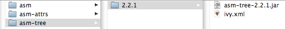

# 让开发自动化: 利用 Ivy 管理依赖项

# 让开发自动化: 利用 Ivy 管理依赖项

*使用公共存储库和 Apache Ant 共享其他项目的源代码*

管理项目和工具之间的源代码依赖项往往非常困难，但并不一定总是如此。在这一期“ *[让开发自动化](http://www.ibm.com/developerworks/cn/java/j-ap/)*”中，自动化专家 Parl Duvall 介绍了如何利用 Apache Ant 项目中的 Ivy 依赖项管理器来处理所有重要 Java 项目必须管理的无数依赖项。

实际上，所有软件开发项目都必须依靠来自其他项目的源代码。例如，许多项目可能依靠 log4j 等日志记录工具和 Struts 之类的 Web 框架。您的开发团队不会维护其他项目的源代码，但要依靠其 API 来实现项目中的定制软件。您的软件所依靠的其他项目数量越多（包括这些项目自身的依赖项），构建软件就变得越复杂。

## 关于本系列

作为开发人员，我们致力于为用户自动化流程；但许多开发人员疏忽了自动化我们自己的开发流程的机会。为此，我们编写了 [*让开发自动化*](http://www.ibm.com/developerworks/cn/java/j-ap/)系列文章，专门探讨软件开发流程自动化的实践应用，为您介绍 *何时*以及 *如何*成功应用自动化。

我已经看到许多团队使用各种不完善的技术，尝试解决这种难题：

*   将全部有依赖关系的项目（JAR 文件）放在一个目录中，此目录将签入项目的版本控制存储库。这种技术不必要地增加了存储库的大小，使得管理版本差异极为困难。
*   将有依赖关系的 JAR 分配到一个公共文件服务器上，使团队无法控制版本更改。
*   手动将 JAR 文件复制到各开发人员工作站上的指定位置。这种方法使得确定丢失的文件或修正版本极为困难。
*   执行一条 HTTP `Get`命令，将文件下载到开发人员的工作站，手动执行或将其作为自动构建的一部分。这种技术会造成未受管理的 JAR 文件。

我参加过一个中型项目，包含 1,000 个 Java 类和 100 多个有依赖关系的 JAR 文件。（我们选择了第一种不完美的技术：将所有 JAR 签入项目的版本控制存储库。）图 1 显示了可能在此类项目中看到的一小部分依赖项的类型：

##### 图 1\. Web 开发项目中的 JAR 依赖项示例


## Transfixed on transitive dependencies

*传递依赖（Transitive dependency）*是一个复杂的术语，但表示的是 Ivy 提供的一种简单而强大的特性。某些 JAR 文件依赖于其他 JAR，这样才能正常工作。使用 Ivy，您只需一次性声明一个组件的依赖项。此后，仅需了解一个项目的主要 JAR 文件，而无需了解它的所有 JAR 文件依赖项。如果您体验过手动查找依赖项的痛苦——无论是通过文档还是通过研究代码，您就会发现，此特性本身就值得您付出时间在项目中配置 Ivy。参见本文 依赖于依赖项一节了解更多细节。

图 1 表现出，Brewery 项目的源代码依赖于 Hibernate、Struts 2、MySQL Connector 和 Cobertura。而 Cobertura 又依赖其他 JAR，如 asm-2.2.1.jar、jakarta-oro-2.0.8.jar 和 log4j-1.2.9.jar。此外，asm-2.2.1.jar 依赖 asm-tree-2.2.1.jar。这仅仅是可能出现的各类嵌套依赖项的一个简单示例。即便是某个 JAR 的版本不正确，您也会体验到难以排除的问题，例如编译错误或意料之外的行为。

Apache Maven 构建管理和项目管理工具已经吸引了 Java 开发人员的注意。Maven 引入了 JAR 文件公共存储库的概念，可通过公开的 Web 服务器访问（称为 ibiblio）。Maven 的方法减少了 JAR 文件膨胀的情况，不会占用大多数版本控制存储库。但使用 Maven 时，它会鼓励您采用其 “惯例优于配置” 的方法来构建软件，这会制约您定制构建脚本的灵活性。

如果您多年来一直使用 Apache Ant，现在希望获得使用公共存储库的优势，又该如呢？您是否不得不接受 Maven 的构建方法来获得这些收益？幸运的是，答案是否定的，这是由于一种称为 Apache Ivy 的工具 —Ant 的一个子项目。Ivy 提供了最一致、可重复、易于维护的方法，来管理项目的所有构建依赖项（在 参考资料部分中可以找到 Maven 和 Ivy 的比较）。这篇文章介绍了安装和配置 Ivy 来管理依赖项的基础知识，指出了可参考的更多信息。

## 入门

开始使用 Ivy 非常简单，只需创建两个 Ivy 特有的文件，添加一些 Ant 目标即可。Ivy 特有的文件是 ivy.xml 和一个 Ivy 设置文件。ivy.xml 文件中列举了项目的所有依赖项。ivysettings.xml 文件（可以随意为此文件命名）用于配置从中下载有依赖关系的 JAR 文件的存储库。

清单 1 展示了一个简单的 Ant 脚本，它调用了两个 Ivy 任务：`ivy:settings`和 `ivy:retrieve`。

##### 清单 1\. 使用 Ivy 的简单 Ant 脚本

```
 <target name="init-ivy" depends="download-ivy"> 
  <ivy:settingsfile="${basedir}/ivysettings.xml" /> 
  <ivy:retrieve/> 
 </target> 
```

在 清单 1 中，`ivy:settings`定义了 Ivy 设置文件。对 `ivy:retrieve`的调用从 ivy.xml 声明的一个存储库中检索 JAR 文件。

### 安装 Ivy

下载并使用 Ivy 的方法有几种。第一种是手动将 Ivy JAR 文件下载到 Ant lib 目录中，也可下载到 Ant 脚本的类路径中定义的某个目录中。我迷上了自动化，所以更倾向于使用自动化替代方案：下载 Ivy 的 JAR 文件，在 Ant 目标中配置类路径。清单 2 展示了这种技术的示例：

##### 清单 2\. 使用 Ant 自动安装 Ivy

```
 <?xml version="1.0" encoding="iso-8859-1"?> 
 <project name="test-ivy" default="init-ivy" basedir="." 
    > 
  <property name="ivy.install.version" value="2.0.0-beta2" /> 
  <property name="ivy.home" value="${user.home}/.ant"/> 
  <property name="ivy.jar.dir" value="${ivy.home}/lib" /> 
  <property name="ivy.jar.file" value="${ivy.jar.dir}/ivy.jar" /> 

  <taskdefresource="org/apache/ivy/ant/antlib.xml" 
     uri="antlib:org.apache.ivy.ant" classpath="${ivy.jar.dir}/ivy.jar"/> 

  <target name="download-ivy"> 
    <mkdir dir="${ivy.jar.dir}"/> 
    <get src="http://www.integratebutton.com/repo/ 
       ${ivy.install.version}/ivy-2.0.0-beta2.jar"
      dest="${ivy.jar.file}"usetimestamp="true"/> 
  </target> 

 </project> 
```

清单 2 中的第二行定义了 XML 名称空间。`antlib`在 ivy.jar 文件中引用 antlib.xml。其余的 `xmlns`指明了 `ivy`Ant 任务的完全限定路径。`${user.home}/.ant`的 `ivy.home`值是 ivy.jar 文件下载的目标位置。`taskdef`定义了 `ivy`Ant 任务，引用其类路径的位置。`download-ivy`目标下载 ivy-2.0.0-beta2.jar 并使用 `dest`属性为其重命名。

一旦下载并配置了 Ivy，就可以使用任意 Ivy Ant 任务（如 清单 1 中调用的两个任务）。

### 创建配置脚本

ivy.xml 文件是必不可少的，您在此文件中定义项目的全部有依赖关系的 JAR。清单 3 展示了一个示例：

##### 清单 3\. 在 ivy.xml 中定义依赖项

```
 <?xml version="1.0" encoding="ISO-8859-1"?> 
 <?xml-stylesheet type="text/xsl" href="./config/ivy/ivy-doc.xsl"?> 
 <ivy-module version="1.0"> 
  <info organisation="com"module="integratebutton" /> 
  <dependencies> 
    <dependency name="hsqldb" rev="1.8.0.7" /> 
    <dependency name="pmd" rev="2.0" /> 
    <dependency name="cobertura" rev="1.9"/> 
    <dependency name="checkstyle" rev="4.1" /> 
    <dependency name="junitperf" rev="1.9.1" /> 
    <dependency name="junit" rev="3.8.1" /> 
  </dependencies> 
 </ivy-module> 
```

请注意，清单 3 未表示任何文件位置或 URL，允许您转到其他目录位置，而无需更改依赖项列表。`info`元素中的 `organisation`属性标识了组织类型（如 .net、.org 或 .com）。后接 `module`名称。此模块的依赖项列表遵循一种命名规范，在下一个清单中您将更清晰地看出此规范。目前，只需记住 `dependency name="cobertura" rev="1.9"`将转换为 cobertura-1.9.jar 即可。

清单 4 是 Ivy 设置文件的示例。它定义了 清单 3 中 ivy.xml 文件所用的存储库位置和相关模式。

##### 清单 4\. Ivy 设置文件

```
 <ivysettings> 
  <settings defaultResolver="chained"/> 
  <resolvers> 
    <chain name="chained" returnFirst="true"> 
      <filesystem name="libraries"> 
        <artifact pattern="${ivy.conf.dir}/repository/[artifact]-[revision].[type]" /> 
      </filesystem> 
      <url name="integratebutton"> 
        <artifact pattern="http://www.integratebutton.com/repo/[organisation]/[module]/ 
           [revision]/[artifact]-[revision].[ext]" /> 
      </url> 
      <ibiblio name="ibiblio" /> 
      <url name="ibiblio-mirror"> 
        <artifact pattern="http://mirrors.ibiblio.org/pub/mirrors/maven2/[organisation]/ 
           [module]/[branch]/[revision]/[branch]-[revision].[ext]" /> 
      </url> 
    </chain> 
  </resolvers> 
 </ivysettings> 
```

清单 4 中的 `filesystem`元素定义了本地工作站上的位置模式。两个 `url`元素定义了可用于下载 JAR 文件的多个位置：第一个元素定义了受我控制的 integratebutton.com 上的一个自定义存储库；第二个元素定义了包含大量开源 JAR 文件的外部 Maven 存储库（不受我控制）。如果 Ivy 无法从第一个存储库下载 —比如此存储库宕机，或者文件未在指定位置 —它将尝试第二个位置。优点在于，一旦 Ivy 下载了一个 JAR，它就会将文件置入您的本地文件系统，不必再为每一次构建重新下载这些文件。

* * *

## 依赖于依赖项

一个模块常常要依赖其他模块。例如，在 图 1 中可以看到，cobertura-1.9.jar 文件的多个依赖项中包括 asm-2.2.1.jar，而 asm-2.2.1.jar 又依赖于 asm-tree-2.2.1.jar。如果没有像 Ivy 这样的工具，您就需要确保类路径中存在这些 JAR 的正确版本，保证 JAR 版本之间不存在冲突。而使用 Ivy，您只需定义 `cobertura`模块及其所有依赖模块，如清单 5 中所示的 ivy.xml 文件那样。切记，这个 ivy.xml 文件与 cobertura-1.9.jar 文件位于同一目录。

##### 清单 5\. 在 ivy.xml 文件中定义依赖项

```
 <?xml version="1.0" encoding="UTF-8"?> 
 <ivy-module version="2.0"

  xsi:noNamespaceSchemaLocation="http://ant.apache.org/ivy/schemas/ivy.xsd"> 
  <info organisation="cobertura" module="cobertura"revision="1.9"/> 
  <configurations> 
    <conf name="master"/> 
  </configurations> 

  <publications> 
    <artifact name="cobertura" type="jar" conf="master" /> 
  </publications> 

  <dependencies> 
    <dependency org="objectweb" name="asm" rev="2.2.1" conf="master"/> 
    <dependency org="jakarta" name="oro" rev="2.0.8" conf="master"/> 
    <dependency org="apache" name="log4j" rev="1.2.9" conf="master"/>         
  </dependencies> 
 </ivy-module> 
```

清单 5 中特别强调的依赖项定义了 `objectweb org`和名称 `asm`以及要使用的特定修订版。Ivy 将此信息与 ivysettings.xml 文件中的存储库定义（如 清单 4 所示）一起使用，用于下载 JAR 文件的依赖项。

图 2 展示了符合 清单 4 所示 ivysettings.xml 文件配置的存储库中的目录结构：

##### 图 2\. `asm`模块的目录结构


请注意，图 2 展示了一个 ivy.xml 文件（见清单 6），它定义了 `asm`的依赖项。 在清单 6 中，针对 `asm`模块的 ivy.xml 文件片段表示了它惟一的依赖项 —asm-tree-2.2.1.jar：

##### 清单 6\. 为 `asm`定义依赖项的 ivy.xml

```
 ... 
 <dependencies> 
  <dependency org="objectweb" name="asm-tree"rev="2.2.1" conf="master"/> 
 </dependencies> 
 ... 
```

简单说明一下，`cobertura`模块定义了三个依赖模块：`asm`、`jakarta-oro`和 `log4j`，如 清单 5 所示。而 `asm`模块又有一个依赖模块，名为 `asm-tree`，如 清单 6 所示。

请注意，图 3 中的 `asm-tree`目录结构与 图 2 中的 `asm`模块结构相似：

##### 图 3\. `asm-tree`模块的目录结构



当然，差别在于 JAR 文件包含不同的类，图 2 所示的 ivy.xml 文件的定义描述了 `asm-tree`模块。（碰巧，`asm-tree`模块未在其 ivy.xml 文件中定义任何依赖项。）

* * *

## Ivy 进阶

既然您已经掌握了使用 Ivy 的基本知识，下面我将介绍其他一些有用的 Ant 任务。

### 呈现报告

Ivy 提供了一个任务，用于报告一个项目中的依赖文件。清单 7 展示了如何调用 Ivy 的 `report`Ant 任务来创建依赖项列表：

##### 清单 7\. 通过 Ant 生成 Ivy 依赖项报告

```
 <target name="ivy-report" depends="init-ivy"> 
  <ivy:report todir="${target.dir}/reports/ivy"/> 
 </target> 
```

清单 7 中的脚本生成了一份 HTML 报告，显示了某项目的依赖文件列表。图 4 展示了该报告：

##### 图 4\. 显示项目依赖项的 HTML 报告


### 其他任务

还有其他许多针对 Ivy 的 Ant 任务可供您使用 —通过为 Maven 生成一个 POM 文件来清理本地文件系统缓存。表 1 显示了部分 Ivy 的 Ant 任务及其用途：

##### 表 1\. 其他 Ivy Ant 任务

| Task | Purpose |
| --- | --- |
| `settings` | 对于验证包含存储库的主机最有用 |
| `cachepath` | 覆盖本地文件系统上的默认缓存路径，所下载的文件将存放在此路径中 |
| `repreport` | 为存储库中的几个模块生成报告 |
| `install` | 安装一个模块及其所有依赖项 |
| `makepom` | 通过 ivy.xml 文件创建一个 pom.xml file，供 Maven 使用 |
| `cleancache` | 清理本地文件系统缓存，强制在下一次构建时从存储库重新检索 JAR 文件 |

参见 参考资料，了解 Ivy 中可用的其他 Ant 任务。

* * *

## 一切视情况而定

## 版本控制二进制库

Ivy *并未*消除对 JAR 文件进行版本控制的需要。我常常看到有些团队由于得到了可通过 HTTP 访问的存储库，就彻底忘记了将文件置于版本控制系统之中。如果一年之后您需要重新创建软件，而 HTTP 存储库未得到集中管理，重新创建的过程将十分艰难。使用可通过 HTTP 访问的版本控制存储库（如 Subversion）将避免这样的 窘境，因为您可以集中管理 *并*提供 HTTP 访问

Ivy 集中管理依赖文件，消除了开发团队将 JAR 文件从一个版本控制存储库复制到另一个存储库中时可能出现的膨胀现象。如果您正参与一个简单的项目，将 JAR 文件签入版本控制系统或使用本文开头列出的其他某些技术可能不会显著降低您的速度。但若您的项目规模越来越大，或者您在使用公共文件的企业环境中工作，一种公共方法就变得十分必要。无论是哪种情况，Ivy 都能使定义项目依赖项更为一致、更为可行。因此值得您付出时间研究 Ivy 在您的项目中的应用。