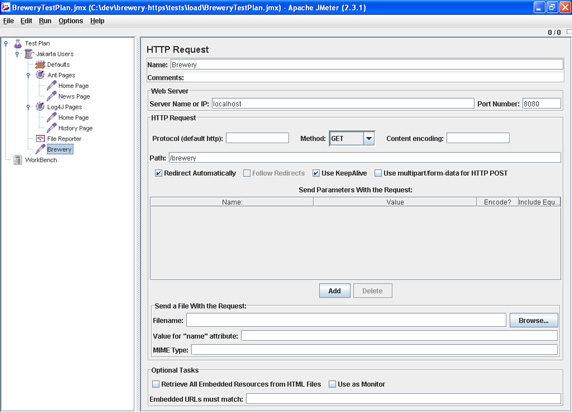
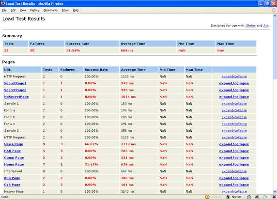

# 让开发自动化: 自动负载测试

# 让开发自动化: 自动负载测试

*使用 Apache Ant 和 Apache JMeter 频繁进行负载测试*

负载测试通常在开发周期的后期执行，但是并不一定要这样。在 [*让开发自动化*](http://www.ibm.com/developerworks/cn/java/j-ap/)的这一期，自动化专家 Paul Duvall 将向您描述如何创建一个运行 JMeter 测试的预订集成构建，发现和修复开发周期中出现的问题。

您的软件系统可供多少用户同时访问？在不引起性能下降的前提下可以加载多少数据？您的系统有多大的吞吐量需求？间隔多久测试一次这些需求？如果您每天至少可以指定并确认一次这些负载和性能需求得到了满足，又会怎样？通过将负载测试作为预定的自动构建的一部分来运行，您可以更快地确定您的系统在某些负载条件下的执行情况，并快速适应变化。

## 关于本系列

作为开发人员，我们的工作就是为终端用户实现过程自动化；然而，很多开发人员却忽略了将自己的开发过程自动化的机会。为此，我编写了 [*让开发自动化*](http://www.ibm.com/developerworks/cn/java/j-ap/)这个系列的文章，专门探讨软件开发过程自动化的实际应用，并教您 *何时*以及 *如何*成功地应用自动化。

我曾经参与过的一个项目建立了一组很好的自动化测试，可以对应用程序进行负载测试，同时它还可以运行多个事务。问题是，这些测试需要进行一些手动调节，所以开发团队无法在没有人工干预的情况下运行这些测试。这限制了测试器可用时（通常仅工作几个小时）进行测试的次数。在实践中，测试要隔好几天才进行一次 —间隔时间太长，无法及时检测问题。

在本文中，我将探讨如何使用 JMeter 创建自动化测试、将测试作为自动构建的一部分运行，以及将测试设置为每天自动运行（通常当机器的使用率低时）。将测试作为预定构建的一部分运行可以让您：

*   在任何时候执行负载测试
*   在开发过程的初期检测并解决负载和性能问题
*   监视构建服务器的最新的负载测试和性能测试报告
*   减少依靠单个人配置和运行测试时可能出现的瓶颈和错误

## 使用 JMeter 提升性能

Apache JMeter 是一个开放源码项目，您可以用来在服务器上模拟重负载（有关 JMeter 的更多信息，请参阅 参考资料）。JMeter 的文档集描述了如何使用它的很多功能，并提供了大量例子。

### 运行 JMeter

下载并解压缩 JMeter ZIP 文件（请参阅 参考资料获得下载 JMeter 的链接）之后，使用命令提示符进入您解压缩 JMeter 的位置，并键入 `cd bin`更改 bin 目录。从 bin 目录键入 `jmeter`打开 JMeter Swing 应用程序，如图 1 所示：

##### 图 1\. JMeter GUI



### 创建测试计划

## 通过示例编写测试

JMeter 附带了很多示例测试计划和脚本。不必从头创建测试计划，您可以使用 docs 目录中的例子，并随着项目的发展逐步配置测试计划。复杂之处主要在于学习编写可以有效模拟负载和性能需求的负载测试。

您可以使用 JMeter GUI 创建 *测试计划*。JMeter 中的不同测试计划类型包括：

*   Web 测试计划
*   数据库测试计划
*   FTP 测试计划
*   LDAP 测试计划
*   扩展 LDAP 测试计划
*   Web 服务测试计划
*   JMS 点对点测试计划
*   JMS 主题测试计划
*   监视器测试计划
*   侦听器

每个测试计划都以 XML 格式存储在一个后缀名为 .jmx 的文件中。这种非二进制的格式使以后编辑计划更容易。尽管您可以通过以下 JMeter XML 模式来创建测试计划，但是使用 GUI 要容易得多。稍后您将看到一个例子，该例子用参数表示 JMeter 的配置值，以自定义测试的运行方式。

* * *

## 节省劳力的负载测试

使用 GUI 运行测试，需要一个 *人*来亲自执行它们。这会增加过程瓶颈和知识筒仓的可能性。 通过自动构建（比如 Ant 构建）运行测试，您可以配置 JMeter 测试来运行，而无需打开 JMeter 应用程序。另外，该测试每次都以同样的方式运行 —不会增加额外的工作。

### 使用 Ant 操作 JMeter 测试

学习了如何使用 GUI 软件工具后，我想看看它是否可以从命令行运行某些实用工具，这样我就不需要反复执行同样的操作。例如，每次打开 JMeter 应用程序时，我喜欢选择 File > Open 来打开文件，然后运行一次或多次测试。我可以为这些组操作编写一个脚本，每次以同样的方式运行它们。幸运的是，已经有人编写了一个 Ant 任务来为 JMeter 做这件事：它执行负载测试，同时提供了一种传入可选参数和属性的方式。

## 示例构建脚本

JMeter 分区的 extras 目录包含一个示例 build.xml 脚本，说明了 JMeter Ant 任务的用法。

在清单 1 中，我使用 Ant 的 `taskdef`任务定义 JMeter 任务，我将其命名为 `jmeter`，这样我可以在该 Ant 脚本的其他地方使用它。要使用该脚本，您的 Ant 类路径中必须存在 ant-jmeter.jar 文件（请参阅 参考资料获得下载链接）。

##### 清单 1\. 在 Ant 中定义 JMeter 任务

```
 <taskdef name="jmeter" classname="org.programmerplanet.ant.taskdefs.jmeter.JMeterTask"/> 
```

清单 2 中的示例代码运行一个 JMeter 负载测试 BreweryTestPlan.jmx。要运行某个目录中的所有测试，只需输入 `*.jmx`，而不是特定的文件名。`jmeter`任务所需的属性为 `jmeterhome`、`testplan`（`s`）以及 `resultlog`或 `resultlogdir`。（清单 2 未显示 `resultlogdir`，因为它使用 `resultlog`。）

##### 清单 2\. 从 Ant 运行 JMeter

```
 <jmeter 
  jmeterhome="${jmeter.home}"
  resultlog="${basedir}/target/JMeterResults.xml"> 
  <testplans dir="${basedir}/tests/load" includes="BreweryTestPlan.jmx"/> 
 </jmeter> 
```

清单 2 中的 Ant 代码创建了一个名为 JMeterResults.xml 的输出文件，用于创建 HTML 报告。

### 使用 XSLT 呈现报告

将 JMeterResults.xml 文件作为清单 3 中的 `xslt`Ant 任务的输入，可以为清单 2 中运行的所有 JMeter 测试生成一个 HTML 报告。在 JMeter extras 目录中提供的 XSL 样式表（jmeter-results-detail-report_21.xsl）用于将 JMeterResults 文件转换为 HTML。

##### 清单 3\. 使用 XSLT 创建 JMeter HTML 报告

```
 <xslt in="${basedir}/target/JMeterResults.xml"
  out="${basedir}/target/JMeterResults.html"
  style="${jmeter.home}/extras/jmeter-results-detail-report_21.xsl"/> 
```

JMeter 也提供了一个不太详细的 XSL 样式表文件，用于总结负载测试的结果。

### 在 HTML 中显示报告

图 2 是一个使用清单 3 中的 `xslt`任务生成的 HTML 报告的例子。它显示了每个运行的负载测试，以及测试状态、时间和所有测试的聚合状态和时间。

##### 图 2\. 生成 JMeter HTML 报告



稍后我将在本文中向您展示如何从 CruiseControl Continuous Integration (CI) 服务器（请参阅 参考资料）中显示这些报告。

### 向 JMeter 传递参数

根据您运行的测试类型，您可能想要传递参数和属性，以改变单个测试或一组测试执行的方式。例如，清单 4 展示了如何增加 JVM 内存并指定线程和循环的数量：

##### 清单 4\. 向 JMeter 传递可选参数和属性

```
 <jmeter 
  jmeterhome="${jmeter.home}"
  resultlog="${basedir}/target/JMeterResults.xml"> 
  <jvmarg value="-Xincgc"/> 
  <jvmarg value="-Xmx128m"/> 
  <jvmarg value="-Dproperty=value"/> 
  <property name="request.threads" value="5"/> 
  <property name="request.loop" value="50"/> 
  <property name="jmeter.save.saveservice.assertion_results" value="all"/> 
  <property name="jmeter.save.saveservice.output_format" value="xml"/> 
  <testplans dir="${basedir}/tests/load" includes="BreweryTestPlan.jmx"/> 
 </jmeter> 
```

可以使用很多内置的其他参数和属性来修改 JMeter 测试运行的方式（有关详细信息，请参阅 参考资料）。

在执行负载测试的方式上，使用参数和属性提供了一定的灵活性，但是它不能解决如何在不同的目标环境中运行负载测试的问题，比如测试和验证环境。要向测试计划添加特定于环境的信息，您需要在 .jmx 文件中放入一些记号，以便当负载测试在自动构建脚本中运行时可以对 .jmx 文件进行过滤和修改。

* * *

## 及时负载测试

使用自动构建运行负载测试时，将其安排为按某个周期运行，比如每晚运行一次。您可以使用 CI 或构建管理服务器来实现。

### 安排 CruiseControl 每天运行负载测试

使用 CI 服务器的目的在于，只要向项目的版本控制存储库应用了更改，就运行一个自动构建。您也可以将其配置为按特定次数运行构建。由于负载测试通常需要较多的计算资源，在这些资源未被占用时运行测试（例如深夜或清早）会比较好。

在 清单 5 中，一个自动构建被安排在晚上 11:00 点 (2300) 使用 CruiseControl（请参阅 参考资料）运行。您可以修改 CruiseControl 配置文件，以使用一个特定的 Ant 目标运行一个委托构建，比如一个给定的 `run-load-tests`构建。

##### 清单 5\. 使用 CruiseControl 运行预定的负载测试

```
 ... 
  <modificationset> 
    <svn RepositoryLocation="${svnrepo.location}"/> 
    <timebuild username="admin" time="2300"/> 
  </modificationset> 
  ... 
```

通过将负载测试安排在晚上运行（如清单 5 中一样），您将不会听到有关加班、休假或忘记运行测试等借口 —它们会自动运行。

### 在 CruiseControl 中显示报告

您已经看到了如何使用 Ant 显示 JMeter 测试报告。但是，JMeter 报告只能与单个机器上的一个开发人员通信。负载测试会影响整个应用程序，所以整个团队都会希望看到结果。好处在于，您可以轻松配置您的 CI 服务器，以显示这些报告。因为已经使用 Ant 生成了这些报告，所以只需要使 JMeter HTML 报告可以从 CruiseControl 项目仪表板访问。您可以向 CruiseControl 的 config.xml 文件添加几行代码来实现这个目的，如清单 6 所示：

##### 清单 6\. 配置 CruiseControl 来显示 JMeter 报告

```
 <project name="brewery"> 
 ... 
 <log> 
  <merge dir="merge dir="projects/${project.name}/reports/jmeter" /> 
 </log>
 ... 
 </project> 
```

现在，团队中的每个人都可以（真正地）共享这些信息了。很多其他 CI 和构建管理服务器也提供类似的报告集成功能。

* * *

## 结束语

在本文中，我展示了如何向您的开发工具箱添加自动化负载测试。通过使用自动构建运行负载测试，然后将测试安排为定期运行，您可以在系统容量问题出现之前及时发现它们。这种方法使得评估架构和数据更改的影响变得更加容易。当与本文章 [系列](http://www.ibm.com/developerworks/cn/java/j-ap/)中描述的其他技术结合使用时，开发团队常常能够交付更高质量的软件。

* * *

## 下载

| 描述 | 名字 | 大小 |
| --- | --- | --- |
| 本文的示例 Ant 脚本 | [j-ap04088-jmeter-example.zip](http://www.ibm.com/developerworks/apps/download/index.jsp?contentid=310260&filename=j-ap04088-jmeter-example.zip&method=http&locale=zh_CN) | 6KB |