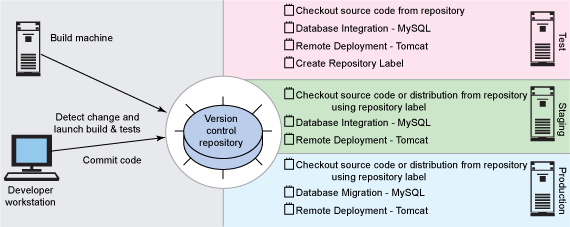

# 让开发自动化: 使用自动化加速部署

# 让开发自动化: 使用自动化加速部署

*利用自动化加速软件在不同环境间的迁移*

自动化构建不仅仅适用于开发团队 —— 在将软件从开发迁移到生产这一过程中也大有作为。在这一期 *[让开发自动化](http://www.ibm.com/developerworks/cn/java/j-ap/)*中，自动化专家 Paul Duvall 将介绍如何结合使用 Ant 和 Java™Secure Channel 将软件远程部署到多个目标环境中。

## 关于本系列

作为开发人员，我们的工作就是为终端用户实现过程自动化；然而，很多开发人员却忽略了将自己的开发过程自动化的机会。为此，我编写了 [*让开发自动化*](http://www.ibm.com/developerworks/cn/java/j-ap/)这个系列的文章，专门探讨软件开发过程自动化的实际应用，并教您 *何时*以及 *如何*成功地应用自动化。

您是否曾注意到，很多团队总是在将软件从开发环境迁移到生产环境之后才想到改善？我曾经遇到过一些团队，他们的开发周期长达几个星期甚至几个月不等 —我认为这是浪费时间。为什么不像自动化构建一样，通过自动化大幅度减少花费在部署配置问题上的时间，并因此提升基础架构的效率？

仔细想一想：软件部署流程中的低效率意味着将推迟应用程序到用户的交付。更糟糕的是，一些人认为，对于大多数项目，部署类似于撕掉创可贴（仅会产生暂时的疼痛），然而，部署问题将一再滞留，并且在每次交付时频繁出现。

除了延迟交付外，低效的部署基础架构降低了团队对软件修改的适应性，这使得他们经常将过多的功能全部填充到一个版本中（因为版本不会经常发布）。这导致了恶性循环：企业希望尽快将软件交付给用户，但是这个流程太长，因此所有人都力求设计一个全面的版本（big bang）来最大化业务机遇。

## 实现无忧部署

基本部署流程包括编译、数据修改集成（例如数据库表）、向其他计算机远程部署发行包（如 JAR 和 WAR），以及管理远程计算机中的资源。尽管如此，仍然有很多工作可以通过自动化完成，比如创建安装媒体、测试、生成用户文档等等。在本文中，我将介绍这些基本内容并演示如何将这些流程纳入到自动化构建流程中。具体来说，您将了解以下流程：

*   向远程机器部署二进制文件
*   外部化（externalize）配置属性
*   远程更新 MySQL RDBMS
*   远程配置 Jakarta 的 Tomcat Servlet 容器

通过自动化实现这些流程，您能够更迅速更顺利地向用户交付软件。

* * *

## 必要工具

实现自动化部署的核心工具是一个构建脚本；在本文中，我使用的是 Ant。我的 Ant 脚本将使用属性文件（特定于目标环境，如演示和生产环境），通过 Ant 的 `sql`任务与 MySQL 数据库交互，使用 Java Secure Channel (JSch) 将文件复制到远程机器上（通过 Secure-Copy 协议（SCP））并停止和启动 Tomcat 服务（通过 SSH）。

图 1 演示了这一流程的高级架构视图。关键的一点是，所有软件资源均存储在一个版本控制库中，因为理想的构建流程首先将对源代码（以及配置文件）进行签出，并在本地构建和打包组件，随后远程执行 SQL 语句，最后部署发行包并重新启动 Tomcat。

##### 图 1\. 实现远程部署的高级构建架构



您可以自动执行所有这些流程，这样，通过执行一条命令或单击一下鼠标就可触发部署，甚至不需要人为干涉就可对流程进行调度。是不是很令人兴奋？

* * *

## 外部化属性

对于不同的目标环境，配置值（例如文件位置、主机名、数据库名和端口号）可能各不相同，因此不能进行硬编码（例如在源代码中）。这些属性在 *.properties*文件中得到了完善的管理。通过外部化属性，可以使用同一个构建脚本在一个环境中编译，然后在另一个环境中部署，而不需要修改或重新编译源代码。

## 属性规则

在转换到不同环境时，如果需要修改某个值，那么将这个值放到外部的 .properties 文件。如果构建脚本中有多处引用该值，那么应将其转化为构建脚本（即 build.xml）的属性。如果 *始终*只存在一个引用，就没有必要将其转化为属性（但这仅仅是一个假定条件）。

清单 1 演示了在 Ant 构建脚本中定义属性的简单示例，它允许您将一个 .properties 文件作为系统参数传递（例如 `test.properties`），其中包含针对特定目标环境的所有值。`property.file.location`可解析为诸如 C:\Documents 和 Settings\patrick.henry\test.properties 这样的路径。例如，您可以在命令行输入：`ant -Dproperty.file.location=C:\Documents and Settings\patrick.henry\test.properties`。

##### 清单 1\. 外部化 property 属性

```
 <property file="${property.file.location}" /> 
```

清单 2 显示了一个示例目标环境 .properties 文件。文件中的 *values*属性在不同目标环境中应该（或者可以）是不同的，但是 *names*属性则保持不变。

##### 清单 2\. property 文件中的示例属性和对应的值

```
 db.database=brewery 
 db.username.system=root 
 db.password.system=sa 
 db.username=root 
 db.password=sa 
 db.hostname=my-hostname.domain.com 
 db.driver=com.mysql.jdbc.Driver 
 db.port=3306 
 db.url.system=jdbc:mysql://${db.hostname}:${db.port}/ 
 db.url=jdbc:mysql://${db.hostname}:${db.port}/${db.database} 
```

通过外部化 property 属性和值，我们可以创建一个更加灵活的构建和部署架构，从而支持多个目标环境。

* * *

## 以简单性为核心

向另一个环境部署软件的流程不应该过于繁杂；应尽量保持简单，就好象输入 “deploy” 一样。幸运的是，诸如 Ant 这样的构建系统使这成为了现实。通过在逻辑上定义一个工作流，按顺序执行一系列步骤，您可以创建一个简单的调用命令。

清单 3 的 `depends`属性中枚举的 Ant 目标从较高层次定义了最佳自动部署流程。首先，脚本从本地环境中删除以前生成的工件（使用 `clean`目标）、编译源代码、远程创建数据库、应用测试数据、启动数据库，最后将 WAR 文件远程部署到位于目标环境中的 Tomcat 容器中。

##### 清单 3\. 远程部署中执行的关键目标

```
 <target name="build" 
  depends="clean, compile, refresh-database, remote-tomcat-deploy" /> 
```

刷新数据库并进行远程部署并非易事；然而，通过使用一些聪明的脚本，一切都将变得简单！

* * *

## 自动化 DBA

在设置目标测试环境时，经常需要执行一些手动操作，例如配置数据库、插入测试数据、删除旧条目以及其他重复性（并且容易出错）流程。幸运的是，在部署期间处理数据库可以变得更加简单。

Data Definition Language（DDL）语句（如删除现有数据库、创建数据库和创建数据库用户）以及 Data Manipulation（DML）语句（如 `insert`语句）可以轻松地脚本化并作为 Ant 构建脚本的一部分运行。而且，还可以远程执行这些语句。

例如，通过从目标环境 .properties 文件传递一个 `db.url.system`属性（如清单 4 所示），构建环境可以针对一个远程数据库执行 SQL 语句：

##### 清单 4\. 创建数据库和插入数据的脚本

```
 <target name="refresh-database" depends="create-database,insert-data" /> 
 <target name="create-database"> 
  <sql driver="${db.driver}"
    url="${db.url.system}" 
    userid="${db.username.system}"
    password="${db.password.system}"
    src="${database.dir}/create-database.sql"> 
    <classpath> 
      <pathelement location="${mysql-connector.jar}"/> 
    </classpath> 
  </sql> 
 </target> 
 ... 
 <target name="insert-data"> 
  <sql driver="${db.driver}"
    url="${db.url}"
    userid="${db.username}"
    password="${db.password}"
    src="${database.dir}/insert-data.sql"> 
    <classpath> 
      <pathelement location="${mysql-connector.jar}"/> 
    </classpath> 
  </sql> 
 </target> 
```

清单 5 中 insert-data.sql 文件的内容是从清单 4 的 `insert-data`目标调用的。任何 SQL 语句，DDL 或 DML，都可通过 Ant 的 `sql`任务以类似方式执行。

##### 清单 5\. 执行数据插入的 SQL 语句

```
 insert into beer(id, beer_name, date_received) values 
  (1, 'Samuel Adams Lager','2006-12-09'); 
 insert into beer(id, beer_name, date_received) values 
  (2, 'Guinness Stout','2006-12-29'); 
 insert into beer(id, beer_name, date_received) values 
  (3, 'Olde Saratoga Lager','2007-02-14'); 
 insert into beer(id, beer_name, date_received) values 
  (4, 'Sierra Nevada Pale Ale','2007-05-14'); 
```

现在我已经更新了远程数据库，下一个逻辑步骤是向运行 Tomcat 的远程环境部署一些资源。

* * *

## 发行和部署

远程部署和本地部署在实现方面并非完全不同，它仅需要一个不同的通道，从而将资源安全地从一个位置复制到另一个位置（从构建机器复制到目标环境）。在大多数企业中，安全性至关重要，因此仅仅使用 FTP 和 telnet 并不能满足需求。在这种情况下，SCP 和 SSH 可以轻松完成任务。通过 Ant 可以很方便地使用这些通道；事实上，我经常使用 JSch 中的 `sshexec`和 `scp`任务远程复制文件并在远程机器上运行命令。

## 迁移到生产环境

尽管某些软件应用程序（例如，Software as a service，即 *SaaS*）可以改变部署频率，但是仍然难于迁移到生产环境中。您需要添加应用程序和数据库回滚，确保软件系统能够回滚到以前的状态。这一点至关重要，因为有可能带来数百万美元的损失或盈利。和测试软件系统本身一样，必须对自动化部署流程进行严格测试。

### 使用 SCP 安全复制文件

SCP 能够在两台机器之间安全复制资源。很多工具都支持 SCP。在 Ant 中，理论上讲，在 Ant 中，JSch 将使用 SCP 复制资源（如 JAR 文件），而 *不需要人为干预*，我喜欢将其称之为 *自动化*。

在清单 6 中，`scp`任务（JSch 提供）将构建机器中的 WAR 文件复制到远程机器上。JSch 库（jsch-0.1.36.jar）必须位于 Ant 的类路径中，以利用 `scp`任务。

##### 清单 6\. 将一个 WAR 文件从一个机器中安全复制到另一个机器

```
 <target name="copy-tomcat-dist"> 
  <scp file="${basedir}/target/brewery.war" 
  trust="true" 
  keyfile="${ssh.key.file}"
  username="${ssh.username}"
  passphrase=""
  todir="${ssh.server.username}:${ssh.server.password}@${ssh.server.hostname} 
  :${tomcat.home}/webapps" /> 
 </target> 
```

当调用 `scp`任务时，需要提供进行复制的本地文件的位置，以及本地 SSH 私钥文件的位置（清单 6 中的 `ssh.key.file`，用于安全身份验证）。最后，需要在远程机器上提供一个位置（清单 6 中的 `ssh.server.hostname`），`scp`将把（一个或多个）本地文件放在这个位置。

### 使用 SSH 远程调用流程

与使用 SCP 一样，在远程机器上运行命令通常需要某种安全机制，例如 SSH。在清单 7 中，我使用 JSch `sshexec` Ant 任务停止和重新启动位于某个远程机器上的 Tomcat 容器。构建流程刚刚将一系列资源（如 WAR 文件）复制到这台机器上。

##### 清单 7\. 停止和重新启动远程 Tomcat 实例

```
 <target name="remote-tomcat-stop> 
  <sshexec host="${ssh.hostname}"
  port="${ssh.port}"  
  keyfile="${ssh.key.file}"
  username="${ssh.username}"
  passphrase=""
  trust="true"
  command="${tomcat.home}/bin/shutdown" /> 
  <sleep seconds="${sleep.time}" /> 
 </target> 
 ... 
 <target name="remote-tomcat-start"> 
  <sshexec host="${ssh.hostname}"
  port="${ssh.port}"
  username="${ssh.username}" 
  passphrase=""
  trust="true"
  keyfile="${ssh.key.file}" 
  command="${tomcat.home}/bin/startup" /> 
  <sleep seconds="${sleep.time}" /> 
 </target> 
```

在清单 7 中，我提供了托管 Tomcat 的机器的名称，Tomcat 的端口号（通常为 8080）、私钥文件（`ssh.key.file`），这样，构建脚本可以安全地访问这个机器并执行特定命令。在本例中，可以看到，我依次调用了 `shutdown`和 `startup`命令。

理论上讲，完成这一步骤后，我已经完成了下面这些任务：配置远程数据库、将一个 Web 应用程序移至远程计算机、运行一个 Tomcat 实例。至此，人们可以正常测试甚至使用新版本的应用程序。

* * *

## 结束语

希望本文已经向您展示了如何轻松实现自动化部署流程。将软件从开发环境中交付到用户手中不能（或不应该）是一个手动流程，也不需要将它从开发团队的构建流程明确分离出来。实际上，通过本文介绍的方法，软件发行可以像按下某个按钮一样简单，当然，这必然会显著提高开发团队 *频繁*交付特性的能力。