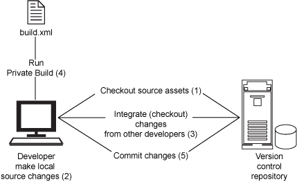

# 让开发自动化: 持续集成反模式

# 让开发自动化: 持续集成反模式

*通过避免反模式轻松实现持续集成*

尽管持续集成（Continuous Integration，CI）可以非常有效地减少项目的风险，但是它对与编程相关的日常活动提出了很高的要求。在这一期 [*让开发自动化*](http://www.ibm.com/developerworks/cn/java/j-ap/)中，自动化专家和 [*Continuous Integration: Improving Software Quality and Reducing Risk*](http://www.amazon.com/gp/product/0321336380/?tag=integratecom-20)的作者之一 Paul Duvall 列举了一系列 CI 反模式并解释了如何避免它们。

在我的职业生涯中经常发现，通过了解在特定情况下 *不应该*做什么，可以学到更多知识。例如，在我职业生涯的早期，由于需要快速发布软件，我省略了单元测试，因为我认为不值得做这些工作。幸运的是，我已经学到 *绝不应该*将未经测试的代码投入生产；因此开始坚持编写单元测试。

整个 IT 行业似乎都主要采用这种学习方式；实际上，我们甚至专门创建了 *反模式（anti-pattern）*这个词，表示在特定环境中不应该采用的做法。反模式是看起来似乎有好处，但是最终可能产生严重影响的解决方案。

## 看似真实的假象

遗憾的是，我发现当缺少经验的团队试图采用 CI 时，他们很可能错误地采用许多反模式，这最终导致他们不但没有获得预期的好处，反而遇到一大堆麻烦。不幸的是，在这种情况下，团队常常将麻烦归罪于 CI 本身。因此，我常常听到 “CI 不适合大项目” 或 “我们的项目 *太特殊*，不适合采用 CI” 这样的说法，实际上 CI 根本不是问题的原因 —是某些做法的不恰当应用或者缺少某些方法导致了这些麻烦。

## 关于本系列

作为开发人员，我们的工作就是为终端用户实现过程自动化；然而，很多开发人员却忽略了将自己的开发过程自动化的机会。为此，我编写了 [*让开发自动化*](http://www.ibm.com/developerworks/cn/java/j-ap/)这个系列的文章，专门探讨软件开发过程自动化的实际应用，并教您 *何时*以及 *如何*成功地应用自动化。

在本文中，我要描述与 CI 相关的六个反模式：

*   **签入不够频繁**，这会导致集成被延迟
*   **破碎的构建**，这使团队无法转而执行其他任务
*   **反馈太少**，这使开发人员无法采取纠正措施
*   接收 **垃圾反馈**，这使开发人员忽视反馈消息
*   所拥有的 **机器缓慢**，这导致延迟反馈
*   依赖于 **膨胀的构建**，这会降低反馈速度

如果您采用 CI 的时间足够长，那么几乎肯定体验过这些反模式的效果。这没关系，但是如果它们发生得太频繁，就会大大限制 CI 的好处。因此，如果您希望避免这些反模式并控制它们的负面影响，那么本文正适合您。

* * *

## 由于签入不够频繁导致的延迟集成

**名称：**签入不够频繁

**反模式：**由于所需的修改太多，源代码长时间签出存储库。

**解决方案：**频繁地提交比较小的代码块。

实施 CI 的前提是团队可以快速获得关于当前开发的代码的反馈；而且，与传统的集成相比，这种频繁的软件集成风格会减少集成花费的时间（和麻烦）。但是，有效的 CI 假设修改会频繁地发生（所以可以频繁地执行构建！）。如果代码长期留在开发人员的桌面（而不是存储库）中，那么就会出现糟糕的情况，因为在系统的不同部分中会出现其他修改。

## 每天提交一次，成功实现集成

一条常用的经验规则是 *至少*每天签入一次代码。我使用一种有效的技术：如果我觉得需要把工作停一下，就会先看看目前是否可以运行本地构建，然后提交代码。然后我才会暂停工作。

从本质上说，如果不频繁地提交修改，集成就会延迟；延迟越长，消除其严重影响就越困难（比如其他人的修改可能会影响您的代码）。对于使用 CI 的项目，我建议开发人员 *至少*每天签入一次代码，但是我相信最好是每天签入多次。

### 任务越小，工作越轻松

我常常听到一些开发人员抱怨说，他们要忙于修改那么多文件，哪有精力每天签入代码。实际上，这正是我要说的要点 —为了每天提交源代码修改，需要将任务划分得更小。实际上，需要将编程任务划分成小块，这样修改也会更小。

不要在一个大任务中实现一个业务对象上的所有特性，例如编写 `read()`、`write()`、`update()`和 `delete()`方法的原型；而是应该首先编写 `read()`方法（以及对应的测试），然后签入这个类，从而与整个代码基集成。接下来，可以实现另一个方法，再次执行签入，直到完成整个任务。这样的话，就可以让 CI 的好处最大化，而且会让您确信自己的代码可以与 *别人的代码*相互配合。

请记住，即使您和您的团队正确地执行许多 CI 实践，如果团队成员不坚持至少每天签入一次源代码修改，那么 CI 的好处会大打折扣。这常常会让人误以为 CI 是无效的，这种想法实在大错特错。

* * *

## 破碎的构建减慢了开发的节奏

**名称：**破碎的构建

**反模式：**构建长时间破碎，导致开发人员无法签出可运行的代码。

**解决方案：**在构建破碎时立即通知开发人员，并以最高优先级尽快修复破碎的构建。

无论您信不信，构建破碎的时间越长，就越麻烦。这是因为文件、修改和依赖项越多，隔离缺陷就越困难。因此，当通知某人构建破碎时（通过电子邮件、RSS 或其他机制），他应该优先解决这个问题；否则，构建破碎的时间越长（尤其是对于频繁修改代码的团队），就越难纠正。

破碎的构建不总是坏事。实际上，破碎的构建会让您迅速地意识到软件出了问题。当构建 *频繁地*破碎或长时间破碎时，破碎的构建就会成为问题。在构建破碎的情况下，绝不应该置之不理。

## 不存在永不破碎的构建

我曾经听到一些开发人员说，“永远不要出现破碎的构建！” 这是个糟糕的建议。我们希望避免许多常见的构建错误，比如缺少文件或破碎的测试；但是，不破碎的构建也可能反映一些问题。构建可能只做少量工作（可能只是执行一个编译和几个单元测试）。我称之为 “持续忽视（Continuous Ignorance）”，这种情况有时候比频繁的破碎构建更糟糕。

### 用私有构建减少破碎的构建

防止破碎构建的有效技术之一是，在将代码提交到存储库之前，运行 *私有构建（private build）*。执行私有构建的步骤如下：

1.  从存储库签出代码。
2.  在本地修改代码。
3.  用存储库执行更新，从而集成其他开发人员所做的修改。
4.  运行本地构建。
5.  构建成功之后，将修改提交到存储库。

图 1 说明了这种做法。注意，这个工作流强调频繁地与存储库执行同步，从而保证定期签入并限制破碎的构建 —这真是一举两得！

##### 图 1\. 运行私有构建减少破碎的集成构建



通过在签入源代码之前执行私有构建（当然是频繁地执行），可以避免许多导致构建破碎的典型错误；因此，可以节省时间和减少麻烦。

* * *

## 由于反馈太少，无法采取纠正措施

**名称：**反馈太少

**反模式：**团队没有把构建状态通知发送给团队成员；因此，开发人员不知道构建已失败。

**解决方案：**使用各种反馈机制传播构建状态信息。

在设置 CI 系统时，团队常常认为接收电子邮件是浪费时间；因此，他们决定不发布通知。但是，如果没有对构建的反馈，就无法采取纠正措施。实际上，反馈是 CI 最重要的方面之一；因此，反馈是否 *有效*也非常关键。

如果希望扩展将构建状态信息发布给团队成员的机制，那么使用视觉和声音设备可能很有帮助，对于集中工作的团队尤其如此。Ambient Orb 这样的设备可以几乎实时地反映构建的状态。例如，当构建失败时，orb 可以显示红色；当构建通过时，orb 显示绿色。另外，orb 还可以传播其他信息，例如通过改变颜色表示代码库的复杂性是增长还是下降（比如绿色表示良好，黄色表示糟糕）。

### 发挥创造力

设置 Ambient Orb 非常容易。清单 1 演示如何使用 Quality Lab 的开放源码软件 `OrbTask`在 Ant 中设置 Ambient Orb：

##### 清单 1\. 使用 Ambient Orb Ant 任务

```
 <target name="notifyOrb" > 
  <taskdef classname="org.qualitylabs.ambientorb.ant.OrbTask"
    name="orb" classpathref="orb.class.path"/> 
     <orb query="http://myambient.com:8080/java/my_devices/submitdata.jsp"
      deviceId="AAA-9A9-AA9"
      colorPass="green"
      colorFail="red"
      commentFail="Code+Duplication+Threshold+Exceeded" />    
  </target> 
```

清单 1 中的任务对于通过状态将 orb 改为绿色，对于失败状态显示红色。图 2 显示绿色的 orb，这表示最近的构建状态是成功：

##### 图 2\. 成功的构建！


团队可以创造性地使用各种反馈机制，让团队成员不会忽视构建状态消息。另外，这些技术也会让 CI 变得生动有趣，让人们更容易注意到需要采取措施的问题。

其他通知机制包括：

*   RSS feed
*   任务栏监视器，比如 CCTray（用于 CruiseControl）
*   X10 设备（比如 LavaLamps）
*   通过 Jabber 等发送的即时消息
*   SMS（Text Messages）

警告：需要在信息过多和信息过少之间找到一个平衡点。反馈机制应该随着工作环境定期调整。例如，对于集中工作的团队，声音提示可能是有效的（比如在构建失败时发出火灾警报）；但是，其他团队可能更喜欢 Ambient Orb（它不会在您陷入沉思时吓着您）。

* * *

## 垃圾反馈

**名称：**垃圾反馈

**反模式：**团队成员很快被构建状态消息淹没（成功、失败或界于这两者之间的各种消息），所以开始忽视这些消息。

**解决方案：**反馈要目标明确，使人们不会收到无关的信息。

与 “反馈太少” 反模式相反，我常常发现团队天真地认为，当 CI 服务器做任何事情时，*每个人*都应该接到反馈（比如电子邮件）。信息一旦泛滥，人们就会忽视它们；如果反馈太多，团队很快就会将 CI 反馈看做垃圾。所以，当发生真正严重的问题（比如构建真的破碎了）时，可能无法引起注意。

### 通过精确地确定反馈的目标，尽可能减少垃圾反馈

清单 2 给出一个 CruiseControl 配置文件示例，演示如何有效地使用电子邮件通知。在这个示例中，无论构建是成功还是失败，技术主管都会收到电子邮件，项目经理只在构建失败时收到电子邮件，最近向存储库提交源代码修改的开发人员也会收到通知。

##### 清单 2\. 使用 CruiseControl 发送电子邮件通知

```
 <project name="brewery"> 
 ... 
 <publishers> 
  <htmlemail 
    css="./webapps/cruisecontrol/css/cruisecontrol.css"
    mailhost="localhost"
    xsldir="./webapps/cruisecontrol/xsl"
    returnaddress="cruisecontrol@localhost"
    buildresultsurl="http://localhost:8080"
    mailport="25"
    defaultsuffix="@localhost" spamwhilebroken="false"> 
    <always address="techlead@localhost"/> 
    <failure address="pm@localhost" reportWhenFixed="true"/> 
  </htmlemail> 
 </publishers>     
 ... 
```

反馈是 CI 系统最重要的方面之一，值得好好讨论一下。*反馈太少*和 *垃圾反馈*是两个极端，要在它们之间找到一个适当的平衡点。当构建破碎时，必须及时地将反馈发送给适当的人，而且必须提供采取纠正措施所需的信息。如果构建是成功的，那么应该只向少数人发送反馈，包括最近提交修改的开发人员以及希望掌握最新情况的技术领导。如果不加区分地把所有状态消息发送给所有人，肯定会大大损害 CI 过程的效果。

* * *

## 不要让缓慢的机器导致反馈延迟

**名称：**缓慢的机器

**反模式：**用一台资源有限的工作站执行构建，导致构建时间太长。

**解决方案：**增加构建机器的磁盘速度、处理器和 RAM 资源，从而提高构建速度。

几年前，我参与了一个相当大的项目，它有超过一百万行代码，编译需要花两个小时以上。当我们试图更频繁地执行集成时，等待持续管理团队执行集成的时间越来越长，让人很不耐烦。当然，两个小时其实是最好的情况，因为构建常常失败，所以这个过程常常要花几 *天*（真是痛苦啊！）。这种情况持续几周之后，解决方案就非常明确了：必须购买一台更强大的机器，它的磁盘空间必须足以容纳所有要签出的文件和构建生成的文件，它的处理器速度更快，可以处理许多指令，RAM 数量要足以运行测试和其他需要大量内存的进程。

### 您觉得需要提高速度吗？

有了这台强大的机器，我们将构建时间从两个小时降低到了 30 分钟；所以，通过花费额外资金购买最新的机器，我们节省了大量时间和金钱，而且最终能够更快地集成软件（这意味着更快地发现问题！）。

用更强大的工作站执行集成构建总是没错的；但是，这个故事的要旨在于，如果发现构建机器在速度、内存或硬盘方面无法让人满意，就应该认真考虑进行升级；加快构建可以帮助我们更快地获得反馈，快速纠正问题，更快地转到下一个开发任务。

* * *

## 膨胀的构建导致反馈延迟

**名称：**膨胀的构建

**反模式：**把太多的任务添加到提交构建过程中，比如运行各种自动检查工具或运行负载测试，从而导致反馈被延迟。

**解决方案：**一个构建 *管道（pipeline）*可以运行不同类型的构建。

一些开发团队喜欢把能添加的所有过程都添加到自动构建中，但是他们忘了执行这些操作是要花 *时间*的。还记得吗？我遇到的那个项目的编译要花两个小时。想像一下，如果把执行测试添加到构建过程中，会怎么样呢？对于一百万行代码，您认为运行静态分析工具要花多长时间？如果您认为耗时八小时的构建过程是难以令人置信的，那么再想想吧。我经常遇到这种情况。

为了向团队成员提供更多的构建信息，团队往往会逐渐增加构建过程的内容。要向开发团队提供快速反馈，还要从 CI 构建过程提供有用的信息，必须在这两个目标之间取得平衡。

### 通过构建管道提高效率

如果发现构建过程耗时太长，而且已经实现了其他改进技术（比如改用更快的机器）并优化了测试执行时间，那么就有必要考虑创建所谓的 *构建管道（build pipeline）*。构建管道的用途是异步地执行长时间运行的过程，这样的话，开发人员签入代码之后，不需要长时间等待反馈。

例如，如果执行一个构建过程要花 10 分钟以上，那么可以创建一个构建管道，在某人将代码提交到存储库之后，它会运行一个初步的轻型构建。这个 “提交” 构建由编译和运行快速单元测试等轻型过程组成。如果这个初步构建成功了，就可以运行第二个构建，它执行长时间运行的测试、软件检查，甚至包括部署到应用服务器上。

例如，在清单 3 中，让 CruiseControl 检查存储库中的修改。当发现修改时，CruiseControl 运行一个所谓的 *委派（delegating）*构建，它调用项目的主构建文件（在使用 Ant 时是 build.xml）。但是，特殊之处是 CruiseControl 执行另一个目标，这个目标执行一些轻型过程，比如编译和细粒度的单元测试。

##### 清单 3\. 检查修改的 CruiseControl 配置

```
 <project name="brewery-commit"> 
 ... 
  <modificationset quietperiod="120"> 
    <svn RepositoryLocation="http://brewery-ci.googlecode.com/svn/trunk"/> 
  </modificationset 
 ... 
```

在清单 4 中，CruiseControl 检查对 `brewery-commit`项目的修改（这个项目不在存储库中 —它实际上查看一个日志文件）。当发现修改时，CruiseControl 运行另一个委派构建。这个构建调用相同的构建文件，但是执行另一个目标。这个目标可能执行长时间运行的过程，比如功能测试、软件检查等等。

##### 清单 4\. 执行长时间运行的构建的 CruiseControl 配置

```
 <project name="brewery-secondary"> 
 ... 
  <modificationset quietperiod="120"> 
    <buildstatus logdir="logs/brewery-commit"/> 
  </modificationset> 
 ... 
```

*膨胀的构建*反模式是导致 CI 无法实施的最常见原因。但是，正如您看到的，使用构建管道可以避免这种情况。有效的构建管道应该充分利用 “80/20” 规则：百分之 20 的构建时间花费在导致百分之 80 的构建错误（比如缺少文件、破碎的编译和测试失败）的部分上。完成这个过程之后，开发人员接到反馈，然后运行第二个构建过程，这个过程的运行时间比较长，但是只产生百分之 20 的构建错误。

* * *

## 反模式是可以纠正的

CI 反模式会妨碍团队从持续集成实践中获得最大的收益；但是，本文描述的技术有助于限制这些反模式发生的频率。这些技术包括：

*   经常提交代码，可以防止集成变得复杂。
*   在提交源代码之前运行私有构建，可以避免许多破碎的构建。
*   使用各种反馈机制避免开发人员忽视构建状态信息。
*   有针对性地向可以采取措施的人发送反馈，这是将构建问题通知团队成员的好方法。
*   花费额外资金购买更强大的构建机器，从而加快向团队成员提供反馈的速度。
*   创建构建管道来缓解构建膨胀。

本文描述了我最常遇到的一些反模式，但是还有其他反模式，包括：

*   **持续忽视（Continuous Ignorance）**，也就是构建过程只包含很少的过程，导致构建总是成功。
*   构建 **只在您的机器上执行**，这会延长引入缺陷和纠正缺陷之间的时间。
*   **瓶颈提交（Bottleneck Commits）**，这会导致破碎的构建，让团队成员无法回家。
*   运行 **间歇构建（intermittent build）**，这使反馈延迟。

明年我会讨论其他影响持续集成效果的 CI 反模式，请保持关注。