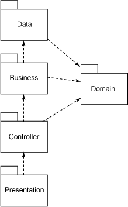
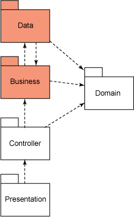

# 让开发自动化: 断言架构可靠性

*通过主动构建过程掌控架构*

您的软件架构和您所期望的一样吗？当架构落实到代码时，它并不总是 我们曾经互相讨论并预想的那个。在本期的 [*让开发自动化*](http://www.ibm.com/developerworks/cn/java/j-ap/)中，Paul Duvall 将演示如何通过使用 JUnit、JDepend 和 Ant 编写 有关测试来发现架构偏差，从而做到在发生问题之前主动发现问题。

我在曾经从事的很多软件开发项目中观察到，软件开发中一直存在这样一种现象：*您实际拥有的架构往往与想象中的不同。*

通过分析代码的度量报告，比如由 JDepend （参阅 Resources）工具生成的报告， 您可以有效地判定代码是否实现了确定的架构。有些团队对代码做反向设计，得到对应的 UML 图表，也能够达到上述效果， 还有一些团队甚至在编程时使用 IDE 生成相同的工件 —— 即实时反向设计。可是， 所有的这些方法都还是 *反应式（reactive）*的。 您必须手工审视并分析报告或图表，确定架构是否存在偏离，而有时这种 偏离可能很久之后才被发现。

设想每当某部分代码与 *期望的*架构有所违背时，您就得到一个提示 —— 比如一个 Ant 构建脚本失败 —— 如清单 1 所示：

##### 清单 1\. 违背架构导致构建失败

```
 ... 
 BUILD FAILED 
 ... 
 build.xml:35 Test ArchitecturalRulesTest failed 

 Total time: 20 seconds 
```

## 关于本系列

作为开发人员，我们的工作就是为终端用户实现过程自动化； 然而，很多开发人员却忽略了将自己的开发过程自动化的机会。 为此，我编写了 [*让开发自动化*](http://www.ibm.com/developerworks/cn/java/j-ap/)这个系列的文章，专门探讨软件开发过程自动化的实际应用，并教您 *何时*以及 *如何*成功地应用自动化。

本文所提及的技术能够使您通过实现构建自动化主动分析软件架构。 除此之外，本文的示例还演示了如何基于规则触发构建过程失败，您可以使用 JDepend 的 API 和 JUnit 定义这些规则。

当然，最重要的是，通过构建自动化，您和您的团队能够在开发周期的 *前期*发现 源代码与确定架构之间的偏离。 这就是我所说的掌控架构！

## 反应式地设置开发阶段

图 1 说明了在构建 Web 应用时一种常见的架构模式。 `presentation`层（代表一组相关的包）依赖于 `controller`层，`controller`层依赖于 `domain`和 `business`层，最后，`business`层依赖于 `data`和 `domain`层。

##### 图 1\. 典型 web 应用的一个架构分层图



至此，一切都很好，是吗？但是，我很确定您以前遇到类似的情形，那些常见的最佳实践规则会在日常的软件开发中被遗忘。事实上，这一点很容易（也很快）就会发生。

举例而言，图 2 阐明了对该示例架构的一个微小违背；在这个例子里， `data`层至少调用一次 `business`层：

##### 图 2\. Data 层正在调用 Business 层的一个对象，由此产生了架构违背



架构的微小变化产生的意外影响使代码的修改变得更加困难。实际上，现在对一个代码区域的修改 会要求其他很多区域的变动。举例而言， 如果您清除或改变 business 层中类的一些方法， 则可能需要从 data 层中清除某些引用。当更多的违背发生时， 修改代码就会更加困难。

若使用传统的监控技术，比如查看 JDepend 或 Macker 报告（参阅 参考资料）， 您能够多快地发现对期望设计的偏离呢？ 如果您和我一样，想快速地生产出能够工作的软件， 那么越快发现影响交付速度的问题越好， 难道您不这么认为吗？

* * *

## 使用简单的 JDepend

JDepend 是最方便的帮助评定架构违背的工具之一。经过几年的发展， 该开源工具能够很好地与 Ant 和 Maven 集成； 此外，它对大量的 Java™API 提供支持，具有更细化的交互性。但是， 如同我已经指出的，它生成的报告本质上是被动的。根据您实际运行（并查看）它们的频率， 架构违背可能直到很难矫正的时候才会被发觉。

## 传入耦合（Afferent coupling）与传出耦合（Efferent coupling）

JDepend 中，传入耦合表示一些包的数量，这些包依赖某个经过分析的包。比如说，如果您正在使用日志框架或一个象 Struts 一样的 Web 框架， 您会希望这些包具有高的传入耦合， 因为整个代码库的很多包都依靠这些框架。 某包的传出耦合与传入耦合相反，是指某个经过分析的包所依赖的其他包的数量，也就是说，它具有的依赖包的数量。

### 断言架构

要主动判定架构变动是否恰当，实际上就是研究某特定包的耦合。事实上，通过对软件架构内关键包的传入和传出耦合进行监控， 以及观察预期值的偏离，您能轻松地发现错误的修改。

举例而言，在图 2 所示的修改中， `data`层的新传出耦合现在大于 0，因为该层目前要 直接与 business 层通信。当然，这种耦合是通过 `data`层中一个简单的 `import`（及对引用类的使用）而引入的。幸运的是，很容易通过 JUnit、JDepend 的优秀 API 发现此类问题，还有，构建时需要一些技巧。

事实证明，在构建（如 Ant 或 Maven）上下文中，您能够运行使用 JDepend API 的 JUnit 测试主动辨别耦合值的变化； 此外，如果这些变化不正确，您就可以使构建失败。 这就实现了主动性，不是吗？

第一步是创建一个 JUnit 测试并且对 JDepend 做相应配置，如清单 2 所示：

##### 清单 2\. 在 JUnit 中设置 JDepend

```
import junit.framework.TestCase; 
import jdepend.framework.JavaPackage; 
import jdepend.framework.JDepend;

public class ArchitecturalRulesTest extends TestCase { 
  private static final String DIRECTORY_TO_ANALYZE = 
      "C:/dev/project-sandbox/brewery/classes"; 
  private JDepend jdepend; 
  private String dataLayer = "com.beer.business.data"; 
  private String businessLayer = "com.beer.business.service"; 
  private Collection dataLayerViolations = new ArrayList<String>(); 

  public ArchitecturalRulesTest(String name) { 
    super(name); 
  } 

  protected void setUp()throws IOException { 
    jdepend = new JDepend(); 
    jdepend.addDirectory(DIRECTORY_TO_ANALYZE); 
    // Calling the businessLayer from the dataLayer is a violation 
    dataLayerViolations.add(businessLayer); 
  } 
```

清单 2 很长，我们总结以下几个要点：

*   需要两个 JDepend 类：`jdepend.framework.JavaPackage`和 `jdepend.framework.JDepend`。
*   待分析的源类位置由 `DIRECTORY_TO_ANALYZE`常量定义。JDepend 通过 调用 `JDepend.addDirectory`扫描该目录，该操作通过一个 fixture 完成（即 `setUp()`方法）。
*   要分析的包由 “Layer” `String`定义。
*   `dataLayerViolations``Collection`添加了 `businessLayer``String`（表示一个包）来指明 这是对期望架构的违背。

按照这四个要点，我已经有效地设置了 JDepend，以针对特定代码库发挥其魔力。 现在，我要设定一些精确的逻辑以说明耦合值的变化。

清单 3 中的 `testDataLayer()`测试用例是架构断言的核心。 该方法可判定是否存在对 `dataLayer`的任何违背 —— 如果 `isLayeringValid()`方法（在下面的 清单 4 中定义）返回 `false`，测试用例 就被认为失败，也意味着必然存在一处架构违背。

##### 清单 3\. 使用 JDepend 测试架构违背

```
 public void testDataLayer() { 
  if (!isLayeringValid(dataLayer, dataLayerViolations)) { 
    fail("Dependency Constraint failed in Data Layer"); 
  } 
 } 
```

清单 3 中测试用例所调用的方法如清单 4 所示：

##### 清单 4\. 循环查找每个包的传入耦合

`isLayeringValid()`方法的目的确定 清单 2 中 `DIRECTORY_TO_ANALYZE`目录内所有包的传入耦合。 您可以在清单 4 底部看到，该方法遵守 `isEfferentsValid()`方法，如清单 5 所示。

这里，如果 `isEfferentsValid()`方法发现某个包不符合指定的包依赖关系（由于从一个包到另一个包的传出耦合大于 0），则使用 清单 2 中的 `dataLayerViolations`集合将该包标记为一个架构违背。这将间接导致 `testDataLayer()`测试用例（如 清单 3 所示）失败。

##### 清单 5\. 判定包依赖关系违背

```
private boolean isLayeringValid(String layer, Collection rules) {
  boolean rulesCorrect = true; 
  Collection packages = jdepend.analyze(); 
  Iterator itor = packages.iterator(); 
  JavaPackage jPackage = null; 
  String analyzedPackageName = null; 
  while (itor.hasNext()) { 
    jPackage = (JavaPackage) itor.next(); 
    analyzedPackageName = jPackage.getName(); 
    Iterator afferentItor = jPackage.getAfferents().iterator(); 
    String afferentPackageName = null; 
    while (afferentItor.hasNext()) { 
      JavaPackage afferentPackage = (JavaPackage) afferentItor.next();
      afferentPackageName = afferentPackage.getName(); 
    } 
    rulesCorrect = isEfferentsValid
        (layer, rules, rulesCorrect, jPackage, analyzedPackageName); 
  } 
  return rulesCorrect; 
} 
```

正如您所看到的，清单 2 到 5 实际上都是扫描一系列包以确定耦合变化； 如果耦合发生了变化，失败条件被触发，因此 JUnit 报告测试失败。 要让我说的话，这真是令人印象深刻！

### 别忘了自动运行测试

一旦您结合使用 JUnit 和 JDepend 编写好基于约束的测试后， 您就能够用诸如 Ant 或 Maven 这样的工具把它作为构建过程的一部分运行。 举例而言，清单 6 阐述了用 Ant 运行一系列此类测试。 `test.dependency.dir`属性 映射到 root/src/test/java/dependency 目录，其中包含了一些神奇的架构验证程序。

##### 清单 6\. 运行依赖性约束测试的 Ant 脚本

```
 <target name="run-tests" depends="compile-tests"> 
  <mkdir dir="${logs.junit.dir}" /> 
  <junit fork="yes" haltonfailure="true"dir="${basedir}" printsummary="yes"> 
    <classpath refid="test.class.path" /> 
    <classpath refid="project.class.path"/> 
    <formatter type="plain" usefile="true" /> 
    <formatter type="xml" usefile="true" /> 
    <batchtest fork="yes" todir="${logs.junit.dir}"> 
      <fileset dir="${test.dependency.dir}"> 
        <patternset refid="test.sources.pattern"/> 
      </fileset> 
    </batchtest> 
  </junit>    
 </target> 
```

要使 JUnit 测试成功执行，JDepend JAR 必须出现在 Ant 的类路径中。 `haltonfailure` 属性被设为 true，以便让构建过程在测试失败时停止。

* * *

## 阈值驱动的架构

我已经指出，使用被动的方法维持架构需要付出大量的努力， 另外，我希望我已经使您相信，开发过程中很容易发生架构违背。 通过将架构测试作为构建过程的一部分执行， 您能够使这种检查自动化并且能够重复执行。图 3 显示了在运行 Ant 后显示构建失败，这样不是很好吗？我甚至根本不需要再去看 JDepend 报告了。

##### 图 3\. 架构违背引起的构建失败


这种主动监控的优势在于，你可以在发现架构分层问题后马上解决它。 问题解决得越迅速，越有助于降低风险 —— 更不用提代价了。 本质上，您的团队不会因此收到干扰，并能够继续工作，实现快速发布可用软件的目标。

* * *

## 针对架构的自动化

## JDepend 还有哪些魔力？

存在多种方法通过 JDepend 添加主动检查。实际上，JDepend 建议使用其 `DependencyConstraint`类。尽管使用 DependencyConstraint 非常简单，但我还是不选择它，因为 它只具有使用 API 执行架构规则这么一种途径，而且不能可靠地根据我的需求工作。还有其他一些工具支持包依赖关系遵从性； 可参阅 参考资料以了解更多细节。

现在您能够用自己的构建过程主动发现与期望架构的设计违背了。 此外，我已向您展示了几个可能的示例之一 —— 您一定能够获得创造性的方法并分析类似 *Instability*包这样的度量，从而便于判定架构的整体健壮性。

我所介绍的这个方法是一种简单的方式，可以减少 为判定架构遵从性而不断反向设计代码并分析图表的需求。 如果您在使用持续集成系统（Continuous Integration system）， 您可将这些测试用作一个安全网络，确保检查版本控制系统的代码传递这些架构规则 —— *每当进行了一次改动时*。如果您改变了架构， 只要改变您的 JUnit 测试规则，就可确保 您的团队遵守了项目标准。这就是我所称的使用主动方式断言架构可靠性。