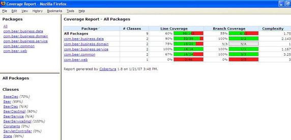

# 让开发自动化: 持续测试

*对代码基址的每一次更改都运行自动化测试*

准备好开始在您的开发人员测试活动中大获全胜吗？在本期的 [*让开发自动化*](http://www.ibm.com/developerworks/cn/java/j-ap/) 中，开发自动化专家 Paul Duvall 介绍了几种自动化的开发人员测试，每一次改变源代码都能够运行这些测试。Paul 提供了 Selenium、DbUnit 和 JUnitPerf 测试的例子，即，如果*经常* 运行这些测试可以帮助您尽早发现应用程序的问题。

在像 Eclipse 那样的 IDE 中或者比如在 Ant 构建脚本中运行单元测试是确保应用程序质量的一个很好的开始；然而，版本控制库（如 Subversion）中的源代码一改变，在单独无变动的构建机上运行单元测试就有助于检验开发生命周期中的问题。而且，运行各种类型的开发人员测试，如组件测试、功能测试和性能测试，能够在开发生命周期中*更早地* 将问题显示出来。

## 关于本系列

作为开发人员，我们的工作就是为终端用户实现过程自动化；然而，很多开发人员却忽略了将自己的开发过程自动化的机会。为此，我编写了 [*让开发自动化*](http://www.ibm.com/developerworks/cn/java/j-ap/) 这个系列的文章，专门探讨软件开发过程自动化的实际应用，并教您*何时* 以及*如何* 成功地应用自动化。

通常在持续集成（CI）环境中运行的开发人员测试有效地扮演着代码质量聚光灯的角色。这是因为如果能有效地编写这些测试，则几乎能够在问题（如缺陷）产生之时就将其发现。不经常运行测试通常就不怎么有效，因为从产生缺陷到发现该缺陷的时间相隔很长，但*持续地*（即，每一次代码改变时）运行测试能确保快速发现无意识的行为。

本文涵盖下列内容：

*   通过 Ant 运行 JUnit 测试
*   使用 JUnit 和 DbUnit 执行更长时间的运行组件测试
*   使用 JUnitPerf 确定哪些方法花费时间过久而执行失败
*   用 Selenium 运行基于 Web 的功能测试
*   用 Cobertura 访问代码覆盖率
*   用 CruiseControl 进行持续测试

我提供一个关于不同类型开发人员测试的概览，和一些可以添加到构建过程并使用 Continuous Integration 系统持续运行的例子。

## 按 JUnit 进行单元测试

## 有人称之为单元测试，有人称之为组件测试

经常提到的单元测试其实更像是一个组件级别的测试。组件测试通常验证不止一个类，并且依赖于一些东西，如数据库或其他重量级系统，如文件系统。但是更重要的是，在测试的基础上进行测试，组件测试比单元测试运行时间更长。

有时，我听到开发人员将开发人员测试这一术语与简单的单元测试相混淆；然而，我发现将单元测试这一术语提练得更加明确很有帮助。对我来说，单元测试是*快速运行的* 测试，通常测试没有大的外部依赖项（如数据库）的单独的类。例如，清单 1 定义了一个单元测试，该测试使用 JUnit 来验证一个叫做 `BeerDaoStub` 的存根数据类。针对并未真正连接到数据库的接口的测试技术是一种验证业务功能的方法，使用该方法不会导致花费昂贵的设置成本。另外，这样做可使测试保持为一个真正的单元测试。

##### 清单 1\. 一个简单的单元测试

```
public void setUp() {
  beerService = new BeerDaoStub();
}

public void testUnitGetBeer() {
  Collection beers = beerService.findAll();
  assertTrue(beers != null && beers.size() > 0);
} 
```

一旦编写了一些单元测试，就可以一直通过 IDE 运行这些测试，但您也想要将这些测试作为构建过程的一部分来运行。确保该测试通过构建过程成功运行意味着也能从 CI 构建的上下文中启动这些相同的测试。

清单 2 是一个 Ant 脚本片段，介绍了执行一批单元测试的 `junit` 任务。这项任务与 JUnit 一起运作，其妙处在于：定义过的所有测试现在都能自动运行并且如果其中任何一个测试失败，则构建也将失败 —— 通过使用 `haltonfailure` 属性实现。

##### 清单 2\. 在 Ant 中运行单元测试

```
<junit fork="yes" haltonfailure="true" dir="${basedir}" printsummary="yes">
  <classpath refid="test.class.path" />
  <classpath refid="project.class.path"/>
  <formatter type="plain" usefile="true" />
  <formatter type="xml" usefile="true" />
  <batchtest fork="yes" todir="${logs.junit.dir}">
    <fileset dir="${test.unit.dir}">
      <patternset refid="test.sources.pattern"/>
    </fileset>
  </batchtest>
</junit> 
```

注意：`test.unit.dir` 指定测试的位置。这是将这些测试（在本例中为单元测试）和其他测试隔离起来的有效方法。通过利用这项技术，可以通过定义另外的 Ant 目标来先运行较快的测试，接着运行较慢的测试（如组件测试、功能测试和系统测试）。

* * *

## 集合组件测试

由于单元测试执行得相当快，很容易将它们作为构建的一部分经常运行。但这些测试并未达到一个高的代码覆盖率 —— 其隔离的本质决定了它们只测试一部分功能。编写具有更多代码（从而可实现更多功能）的测试通常要以附属框架的形式执行更多的调查工作。一旦开始使用这些帮助框架来编写测试，这些测试就开始成为更高级别的测试，我把它们归类为组件测试。

组件测试是基本的测试，这些测试将验证不止一个类，且通常依赖于外部依赖项，如数据库。组件测试的编写方式和单元测试大体一致，只是前者并非通过模拟或存根类来强制隔离，实现这些测试可谓勉为其难，但可以利用框架来便利对外部依赖项的使用。例如，我通常使用 DbUnit 框架来帮助管理数据库，以便组件测试可验证依赖数据库数据的代码功能。

### 用 DbUnit 控制数据库状态

DbUnit 是一个框架，它使针对数据库的测试过程变得更加简单。它提供了一个标准 XML 格式，用于定义一些测试数据，以便从数据库中选择、更新、插入和删除数据。请牢记，DbUnit 并没有替换数据库；它只是提供了一种更加有效的机制来处理测试数据。您可以用 DbUnit 来编写依赖于特定数据的测试，DbUnit 保证该数据位于底层的数据库中。

可以在 JUnit 中可编程地使用 DbUnit，或者可以将它作为构建过程的一部分使用。该框架带有一个 Ant 任务，该任务提供了一种使用 XML 文件来操作、导出或比较数据库中数据的方法。例如，清单 3 演示了 `dbunit` 任务，在本文的例子中，该任务将测试数据插入到目标数据库中，然后在运行完所有组件测试后删除数据：

##### 清单 3\. 在 Ant 中运行组件测试

```
<target name="component-tests">
  <mkdir dir="${logs.junit.dir}" />
  <taskdef name="dbunit" 
    classname="org.dbunit.ant.DbUnitTask"/>
    <dbunit driver="com.mysql.jdbc.Driver"
      url="jdbc:mysql://localhost:3306/brewery"
      userid="${db.username.system}"
      classpathref="db.lib.path"
      password="${db.password.system}">
      <operation type="INSERT" 
        src="seedFile.xml"/>
    </dbunit> 
    <junit fork="yes" haltonfailure="false" 
      failureproperty="tests.failed" 
      haltonerror="true" dir="${basedir}"
      printsummary="yes">
      <classpath refid="test.class.path" />
      <classpath refid="project.class.path"/>
      <formatter type="plain" usefile="true" />
      <formatter type="xml" usefile="true" />
      <batchtest fork="yes" todir="${logs.junit.dir}">
        <fileset dir="${test.component.dir}">
          <patternset refid="test.sources.pattern"/>
        </fileset>
      </batchtest>
    </junit>     
    <mkdir dir="${reports.junit.dir}" />
    <junitreport todir="${reports.junit.dir}">
      <fileset dir="${logs.junit.dir}">
        <include name="TEST-*.xml" />
        <include name="TEST-*.txt" />
      </fileset>
      <report format="frames" todir="${reports.junit.dir}" />
    </junitreport>
    <dbunit driver="com.mysql.jdbc.Driver"
        url="jdbc:mysql://localhost:3306/brewery"
        classpathref="db.lib.path"
        userid="${db.username.system}"
        password="${db.password.system}">
      <operation type="DELETE" 
          src="seedFile.xml"/>
    </dbunit>
</target> 
```

正如清单 3 所示，现在组件测试可在执行期间依赖驻留在数据库中的特定数据。另外，由于在所有测试成功执行后删除了所有的数据，因而此过程现在可重复执行。

### 在数据库中播种

可以将 `dbunit` 任务的 `INSERT` 和 `DELETE` 操作类型和一个种子文件起使用，该文件包含表示数据库表和相关行的 XML 元素。例如，清单 4 是清单 3 中引用的 `seedFile.xml` 文件的内容。每个 `BEER` 元素表示一个也叫 `BEER` 的数据库表，`BEER` 元素的每个属性和其值都映射至相应的数据库列名称和值。

##### 清单 4\. DbUnit 种子文件

```
<?xml version='1.0' encoding='UTF-8'?>
<dataset>
  <BEER id='6' 
            beer_name='Guinness Extra Stout'            
            brewer='St.James Brewery'
            date_received='2007-02-01' />
  <BEER id='7' 
            beer_name='Smuttynose Robust Porter'            
            brewer='Smuttynose Brewery'
            date_received='2007-02-01' />
  <BEER id='8' 
            beer_name='Wolavers pale ale'    
            brewer='Wolaver Brewery'
            date_received='2007-02-01' />
</dataset> 
```

您也许已经从清单 3 中注意到，可以在不同的操作中重用 DbUnit 的种子文件。在本文的例子中，将在运行组件测试前使用清单 4 中的文件在数据库中播种，然后使用相同的文件指示测试完成时从数据库中删除哪些数据。

* * *

## 参与性能测试

开发人员完成编码后，常常要经过很长时间才执行性能测试，而事实通常是可以在开发周期中更早的时候发现（并且解决）性能问题。幸运地是，有一种方法可解决此问题：持续测试或更具体地、持续地运行 JUnitPerf 测试。

### 对性能测试来说 JUnitPerf 是完美的

JUnitPerf 是一个同 JUnit 协调工作的框架，该框架在一个预定的时间限制内执行测试用例：如果一个测试中的方法所用的时间比预期的阈值长，则认为该测试是失败的。通过将性能测试集成到自动化构建中，您能有效地监控应用程序的性能甚至能在出现性能问题时使构建失败。

但我倾向于将 JUnitPerf 用作一种发现早期性能问题的简单方法，而不是将其作为一种机制来衡量执行时间；像 profilers 这样的工具更善于提供此类衡量。在本质上，可以认为 JUnitPerf 是一个早期的警告系统。

在清单 5 中，我定义了一个 JUnit 测试，该测试使用 JUnitPef 来验证 `BeerServicePerformanceTest` 测试类中的 `testLongRunningMethod` 测试的执行时间。如果执行该测试方法所花的时间多于 1000 毫秒，则测试失败。

##### 清单 5\. 使用 JUnitPerf 的基于性能的测试

```
package com.beer.business.service;
import com.clarkware.junitperf.*;
import junit.framework.Test;

public class ExampleTimedTest {
  public static Test suite() {        
    long maxElapsedTime = 1000;        
    Test testCase = new BeerServicePerformanceTest("testLongRunningMethod");
    Test timedTest = new TimedTest(testCase, maxElapsedTime);        
    return timedTest;
  }

  public static void main(String[] args) {
    junit.textui.TestRunner.run(suite());
  }

} 
```

使用精确计时作为方法执行时间的标准时要小心；测试的建立和销毁时间包含在整个执行时间中。此外，在早期的性能测试中，精确测定执行速度在更大程度上是一门艺术而不是科学。

* * *

## 使用 Selenium 进行功能测试

可随意编写所有需要的单元测试和组件测试，但如果要编写一个提供某种类型的用户界面的应用程序（例如 Web 应用程序），则需要测试表示层。以 Web 应用程序为例，需要验证用户场景的导航，另外还要验证场景的功能是正常的。尽管如此，直到最近，这类测试都常被证明是一个负担，需要购买工具来促进开发周期晚期的测试。此外，这些工具几乎不能适合构建过程，即使测试构建得足够早也是如此。

### 深入 Selenium

但近几年来，一些着眼于功能测试的开放源码工具脱颖而出；而且，能轻易地在开发生命周期的早期使用这些工具。工具如 Selenium 和 Watir 都是开放源码的；另外，它们构建时考虑到了开发人员。除了用各种语言（例如 Java 编程和 Python）编程定义 Selenium 测试之外，Selenium 也提供了一种易于学习的表格驱动格式，此格式也能被非技术类型使用。

Selenium 框架使用 JavaScript 来执行基于 Web 的接受测试，该测试打开一个浏览器并运行表格驱动测试。例如，清单 6 展示了一个表示简单的 Selenium 测试的 HTML 表。该测试的多个步骤打开一个 Web 应用程序，然后使用有效的用户名和密码执行登录。测试结果生成到一个 HTML 表中，在 Selenium 运行完所有的测试后，能查看该表。

##### 清单 6\. 使用 Selenium 的功能测试

```
<html>
<head>
<meta http-equiv="Content-Type" content="text/html; charset=UTF-8">
<title>MyTest</title>
</head>
<body>
<table cellpadding="1" cellspacing="1" border="1">
<thead>
</thead><tbody>
<tr>
  <td>open</td>
  <td>/beer/</td>
  <td></td>
</tr>
<tr>
  <td>type</td>
  <td>username</td>
  <td>admin</td>
</tr>
<tr>
  <td>type</td>
  <td>password</td>
  <td>password</td>
</tr>
<tr>
  <td>clickAndWait</td>
  <td>//input[@value='Login']</td>
  <td></td>
</tr>
<tr>
  <td>verifyTextPresent</td>
  <td>Logged in as admin</td>
  <td></td>
</tr>
</tbody></table>
</body>
</html> 
```

使用清单 6 中基于表格的格式，可以定义多个接受测试。也可以将测试分组成*套*，一次执行一整套测试。

### 使用 Ant 驱动 Selenium

Selenium 的伟大之处在于它是在考虑了 CI 的基础上从头创建的，因为你能在像 Ant 那样的构建工具中运行 Selenium。此外，由于框架设计者的高瞻远瞩，如果任何 Selenium 接受测试失败，您也可以让整个构建失败。例如，清单 7 展示了一个 Ant 任务，该任务使用 Selenium 远程控制服务器在一个 Web 应用程序中执行一系列表格驱动测试：

##### 清单 7\. 使用 Ant 运行 Selenium

```
<?xml version="1.0" encoding="iso-8859-1"?>
<project name="functional-tests" default="run-selenium-tests" basedir=".">
  <property file="${basedir}/selenium.properties"/>
  <import file="${basedir}/common-environment.xml"/>
  <property name="acceptance.test.lib.dir"
                value="${functional.test.dir}" />
  <property name="firefox" value="*firefox" />
  <property name="base.url"
                value="http://${web.host.name}:${web.port}" />
  <property name="acceptance.test.list.dir"
                value="${functional.test.dir}" />
  <property name="acceptance.test.report.dir"
                value="${functional.test.dir}" />
  <target name="run-selenium-tests">
    <mkdir dir="${reports.dir}" />
    <java jar="${acceptance.test.lib.dir}/selenium-server.jar"
            fork="true">
      <arg line="-htmlSuite "${firefox}""/>
      <arg line=""${base.url}""/>
      <arg line=""${acceptance.test.list.dir}/${test.suite}""/>
      <arg line=""${reports.dir}/index.html""/>
      <arg line="-timeout ${timeout}"/>
    </java>
  </target>
  <target name="stop-server">
    <get taskname="selenium-shutdown" 
          src="http://${web.host.name}:
            ${selenium.rc.port}/selenium-server/driver/?cmd=shutDown"
      dest="result.txt" ignoreerrors="true" />
     <echo taskname="selenium-shutdown"
              message="Errors during shutdown are expected" />
  </target>
</project> 
```

执行 Selenium 测试时，当框架打开 Web 浏览器、闪电般执行测试，然后关闭该浏览器并生成 HTML 报告时，不要被吓到。这是一种在开发生命周期的早期更快更容易地发现问题的方法（此时它们更易处理）。

* * *

## 使用 Cobertura 报告代码覆盖率

## 是否达到 100% 就是问题所在

运行像 Cobertura 或者 Emma 这样的工具时，记住以下方面很重要：在一个特殊的方法中实现 100% 的行覆盖并不意味着该方法没有缺陷或者它已被完全测试。例如，如果您编写了一个针对 `if` 语句的测试，该测试包含逻辑 `And`，而测试针对的是表达式的左侧部分，则像 Cobertura 这样的工具将报告 100% 行覆盖，但是实际上，您仅执行了该语句的 50%；因此仅完成了 50% 的分支覆盖。

现在已经编写了一些测试，如何确定所有这些测试执行*什么* 呢？幸运的是，此问题可由像 Cobertura 这样的代码覆盖工具来解答。代码覆盖工具可报告测试覆盖率 —— 以行覆盖或分支覆盖形式表示 —— 它表示测试运行时所涉及的代码量。

清单 8 展示了一个 Ant 脚本。该脚本使用 Cobertura 生成一份关于代码覆盖率的 HTML 报告，代码覆盖率通过运行一系列 JUnit 测试获得：

##### 清单 8\. 使用 Ant 和 Cobertura 报告代码覆盖率

```
<target name="instrument-classes">
  <mkdir dir="${instrumented.dir}" />
  <delete file="cobertura.ser" />
  <cobertura-instrument todir="${instrumented.dir}">
    <ignore regex="org.apache.log4j.*" />
    <fileset dir="${classes.dir}">
      <include name="**/*.class" />
      <exclude name="**/*Test.class" />
    </fileset>
  </cobertura-instrument>
</target>

<target name="run-instrumented-tests" depends="instrument-classes">
  <mkdir dir="${logs.junit.dir}" />
  <junit fork="yes" haltonfailure="true" dir="${basedir}" printsummary="yes">
    <sysproperty key="net.sourceforge.cobertura.datafile" file="cobertura.ser" />
    <classpath location="${instrumented.dir}" />
    <classpath location="${classes.dir}" />
    <classpath refid="test.class.path" />
    <classpath refid="project.class.path"/>
    <formatter type="plain" usefile="true" />
    <formatter type="xml" usefile="true" />
    <batchtest fork="yes" todir="${logs.junit.dir}">
      <fileset dir="${test.component.dir}">
        <patternset refid="test.sources.pattern"/>
      </fileset>
    </batchtest>
  </junit>
</target> 
```

Cobertura 产生了一个如图 1 中所示的 HTML 报告。请注意行覆盖和分支覆盖的百分比是以包计算的。可单击每一个包，获得类级别的行百分比和路径百分比，甚至能看到执行的源代码行和它们执行的次数。

##### 图 1\. 使用 Cobertura 和 Ant 生成 HTML 报告



## 需要多高的代码覆盖率?

理想情况下，您可能想针对每个路径执行一次测试。也就是说，如果整个代码基址有 20,000 的循环复杂度的话，则需要 20,000 次测试。我从未遇到过具有 100% 的路径覆盖的项目，不过我曾见过具有近 100% 的行覆盖的团队。

已经介绍了多种类型的测试，甚至介绍了如何测量这些测试的覆盖率 —— 但是如何确保以正常的间隔*执行* 这些测试呢？恰好，这正是 CI 服务器（如 CruiseControl）大显身手的地方，接下来对它进行介绍。

## 持续运行测试

一旦将这些各式各样的开发人员测试类型合并到一个构建过程中时，可以将这些测试中的一些（或者全部）作为 CI 过程的一部分运行。例如，清单 9 是 CruiseControl 的 `config.xml` 文件的一个片段，我在其中定义了一些东西。首先，我让 CruiseControl 每两分钟监控一次 Subversion 库中的改变。如果发现任何改变，则 CruiseControl 将启动一个叫做 `build-${project.name}.xml` 的*委托* 构建脚本（通常，此脚本用 Ant 编写）。该委托构建脚本调用项目的构建脚本，后者执行编译并运行测试。

我也定义了一些逻辑，将所有不同类型的测试结果合并到一个 CruiseControl 日志文件中。而且，我还利用 CruiseControl 的功能将不同工具生成的报告链接（使用 `artifactspublisher` 标签）到 Build Artifacts 链接中，Build Artifacts 可以从 CruiseControl 的显示板应用程序中获得。

##### 清单 9\. 使用 CruiseControl 的 CI

```
...
<modificationset quietperiod="30">
  <svn RepositoryLocation="http://your-domain.com/trunk/brewery"
    username="bfranklin"
    password="G0Fly@Kite"/>
</modificationset>
<schedule interval="120">
  <ant anthome="apache-ant-1.6.5" buildfile="build-${project.name}.xml"/>
</schedule>
<log dir="logs/${project.name}">
  <merge dir="projects/${project.name}/_reports/unit"/>
  <merge dir="projects/${project.name}/_reports/component"/>
  <merge dir="projects/${project.name}/_reports/performance"/>
  <merge dir="projects/${project.name}/_reports/functional"/>
  <merge dir="projects/${project.name}/_reports/coverage"/>
</log>
<publishers>
  <artifactspublisher 
    dir="projects/${project.name}/_reports/" 
    dest="projects/artifacts/${project.name}"/>
</publishers>
... 
```

在将每个源变更应用到版本控制库中时，不必运行每个定义的测试。例如，可以设置 CI 系统执行构建（通常称作提交构建），该构建只在代码签入时运行单元测试。可以为提交构建补充一些更重量级的构建，例如像运行组件测试、功能测试、性能测试以及甚至执行代码检查的构建（请参阅 参考资料）。这些构建可以以更低的频率运行（如一天一次）。您也可以选择在提交构建之后立即运行这些测试和检查。

* * *

## 调用所有测试

持续测试包括了广度和频度。通过授权执行不同类型的测试，可获得更大范围的覆盖和信任。此外，通过持续运行这些测试，几乎能在问题产生就发现它们。

仅仅进行单元测试（至少我所定义的单元测试），并不能使你在项目上走得很远。取得更高的代码覆盖率并且增加团队的信心，需要通力合作并执行自动化组件测试、性能测试和功能测试。此外，使用框架和像 JUnit、Selenium 以及 Cobertura 这样的工具能轻松实现构建自动化，这也意味着在 CI 系统的帮助下，能够在每次将变更提交到版本控制库中时，有效地执行测试套件。这肯定是一种万无一失的提高平均成功率的方法，您不这么认为吗？