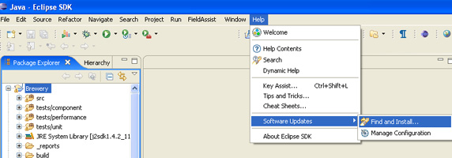
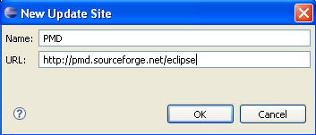
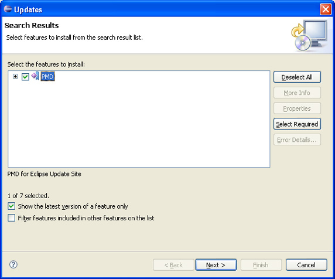
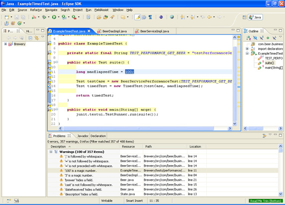
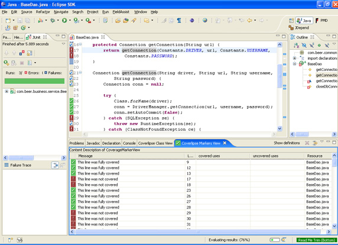
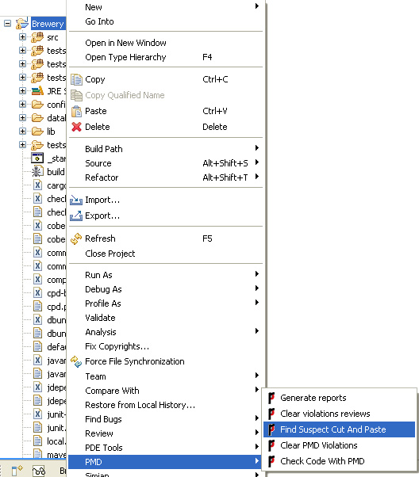
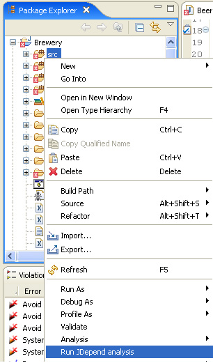
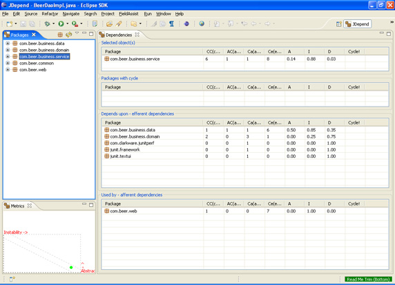
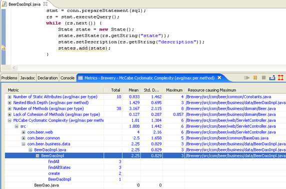

# 让开发自动化: 用 Eclipse 插件提高代码质量

*在 Eclipse 中使用 5 个有用的插件来自动化代码质量分析*

如果能在构建代码前发现代码中潜在的问题会怎么样呢？很有趣的是，Eclipse 插件中就有这样的工具，比如 JDepend 和 CheckStyle，它们能帮您在软件问题暴露前发现这些问题。在 [*让开发自动化*](http://www.ibm.com/developerworks/cn/java/j-ap/) 的本期文章中，自动化专家 Paul Duvall 将带来一些关于 Eclipse 插件的例子，您可以安装、配置和使用这些静态分析插件，以便在开发生命周期的早期预防问题。

## 关于本系列

作为一名开发人员，我们的工作就是为终端用户将过程自动化；然而，我们当中有很多人却忽视了将我们自己的开发过程自动化的机会。为此，我编写了*让开发自动化* 这个系列的文章，专门探索软件开发过程自动化的实际应用，并教您*何时* 以及*如何* 成功地应用自动化。

开发软件时，我的主要目标之一是：要么防止将缺陷引入代码库，要么限制缺陷的生存期；换言之，要尽早找到缺陷。很显然，越是了解如何编写更好的代码以及如何有效测试软件，就越能及早地捕捉到缺陷。我也很想要一张能发现潜在缺陷的安全之网。

在本系列 [八月份](http://www.ibm.com/developerworks/cn/java/j-ap08016/index.html) 的那期文章中，我得出了这样的结论：将检验工具集成到构建过程（例如，使用 Ant 或 Maven）中，能够建立起一种寻找潜在缺陷的方法。尽管这种方法使一致性成为可能并超越了 IDE，但它也有一点*反作用*。必须在本地构建软件或等待 Continuous Integration 构建的运行。如果使用 Eclipse 插件，就可以在通过 Continuous Integration 构建或集成*前* 发现一些这样的冲突。这就促成了我称为*渐进编程* 的编程方式，在这种方式下，允许在编码过程中进行一定程度的质量检验 —— 再也不能比这个更早了！

本文涵盖了我所认为的 “五大” 代码分析领域：

*   编码标准
*   代码重复
*   代码覆盖率
*   依赖项分析
*   复杂度监控

可以用接下来的几个灵活的 Eclipse 插件来揭示这些分析领域：

*   CheckStyle：用于编码标准
*   PMD 的 CPD：帮助发现代码重复
*   Coverlipse：测量代码覆盖率
*   JDepend：提供依赖项分析
*   Eclipse Metric 插件：有效地查出复杂度

## Eclipse 不是您的构建系统

使用 Eclipse 插件与您将这些检验工具用于构建过程并不矛盾。事实上，您想要确保的是：下列使用 Eclipse 插件的规则就是应用到构建过程中的规则。

## 安装 Eclipse 插件

安装 Eclipse 插件再简单不过了，只需要几个步骤。在开始之前，最好把该插件下载站点的 URL 准备好。表 1 是本文用到的插件的列表：

##### 表 1\. 代码改进插件和相应的下载站点 URL

| 工具 | 目的 | Eclipse 插件的 URL |
| --- | --- | --- |
| CheckStyle | 编码标准分析 | [`eclipse-cs.sourceforge.net/update/`](http://eclipse-cs.sourceforge.net/update/) |
| Coverlipse | 测试代码覆盖率 | [`coverlipse.sf.net/update`](http://coverlipse.sf.net/update) |
| CPD | 复制/粘贴检验 | [`pmd.sourceforge.net/eclipse/`](http://pmd.sourceforge.net/eclipse/) |
| JDepend | 包依赖项分析 | [`andrei.gmxhome.de/eclipse/`](http://andrei.gmxhome.de/eclipse/) |
| Metrics | 复杂度监控 | [`metrics.sourceforge.net/update`](http://metrics.sourceforge.net/update) |

知道了这些有用插件的下载地址后，安装插件就是一个极简单的过程。启动 Eclipse，然后遵循下列步骤：

1.  选择 **Help | Software Updates | Find and Install**，如图 1 所示：

    ##### 图 1\. 寻找并安装 Eclipse 插件

    

2.  选择 **Search for new features to install** 单选按钮,单击 **Next**。
3.  单击 **New Remote Site**，输入要安装的插件名和 URL（参见图 2），单击 **OK**，然后单击 **Finish** 来显示 Eclipse 更新管理器。

    ##### 图 2\. 配置新的远程站点

    

4.  在 Eclipse 更新管理器中，有一个查看插件各方面特性的选项。我通常选择顶级项，如图 3 所示。选择您需要的选项并单击 **Finish**。Eclipse 现在安装该插件。您需要重启 Eclipse 实例。

    ##### 图 3\. 安装 Eclipse 插件

    

请遵循上述这些步骤来安装其他的 Eclipse 插件；只需改变插件名和相应的下载位置即可。

* * *

## 用 CheckStyle 校正标准

代码库的可维护性直接影响着软件的整个成本。另外，不佳的可维护性还会让开发人员十分头痛（进而导致开发人员的缺乏）—— 代码越容易修改，就越容易添加新的产品特性。像 CheckStyle 这样的工具可以协助寻找那些可影响到可维护性、与编码标准相冲突的地方，比方说，过大的类、太长的方法和未使用的变量等等。

## 有关 PMD

另一个叫做 PMD 的开源工具提供的功能和 CheckStyle 类似。我偏爱 CheckStyle，但 PMD 也有很多执着的追随者，所以我建议您了解一下这个工具，毕竟它也颇受一些人的青睐。

使用 Eclipse 的 CheckStyle 插件的好处是能够在编码过程中了解到源代码上下文的各种编码冲突，让开发人员更可能在签入该代码前真正处理好这些冲突。您也几乎可以把 CheckStyle 插件视作一个连续的代码复查工具！

安装 CheckStyle 插件并做如下配置（参见图 4）：

1.  选择 **Project**，然后选择 Eclipse 菜单中的 **Properties** 菜单项。
2.  选择 **CheckStyle active for this project** 复选框，单击 **OK**。

    ##### 图 4\. 在 Eclipse 中配置 CheckStyle 插件

    

Eclipse 重新构建工作空间，并在 Eclipse 控制台中列示已发现的编码冲突，如图 5 所示：

##### 图 5\. Eclipse 中 CheckStyle 的代码冲突列表

使用 CheckStyle 插件在 Eclipse 内嵌入编码标准检验是一种很棒的方法，用这种方法可以*在编码时* 积极地改进代码，从而在开发周期的早期发现源代码中潜在的缺陷。这么做还有更多的好处，如节省时间、减少失败，也因此会减少项目的成本。没错，这就是一种积极主动的方式！

* * *

## 用 Coverlipse 确认覆盖率

Coverlipse 是一个用于 Cobertura 的 Eclipse 插件，Cobertura 是一个代码覆盖率工具，可以用它来评估具有相应测试的源代码的比率。Cobertura 也提供一个 Ant 任务和 Maven 插件，但用 Cobertura，您可以*在编写代码时* 评估代码覆盖率。您见过这样的模式吗？

通过选择 Eclipse 菜单项 **Run** 安装 Coverlipse 插件并将其和 JUnit 关联起来，该操作会显示一系列运行配置选项，例如 JUnit、SWT 应用程序和 Java™ 应用程序。右键单击它并选择 **JUnit w/Coverlipse** 节点中的 **New**。在这里，需要确定 JUnit 测试的位置，如图 6 所示：

##### 图 6\. 配置 Coverlipse 以获取代码覆盖率

一旦单击了 **Run**，Eclipse 会运行 Coverlipse 并在源代码（如图 7 所示）中嵌入标记，该标记显示了具有相关 JUnit 测试的代码部分：

##### 图 7\. Coverlipse 生成的具有嵌入类标记的报告

正如您所见，使用 Coverlipse Eclipse 插件可以更快地确定代码覆盖率。例如，这种实时数据功能有助于在将代码签入 CM 系统*前* 更好地进行测试。这对渐进编程来说意味着什么呢？

* * *

## 用 CPD 捕捉代码重复

Eclipse 的 PMD 插件提供了一项叫做 CPD（或复制粘贴探测器）的功能，用于寻找重复的代码。为在 Eclipse 中使用这项便利的工具，需要安装具有 PMD 的 Eclipse 插件，该插件具有 CPD 功能。

为寻找重复的代码，请用右键单击一个 Eclipse 项目并选择 **PMD | Find Suspect Cut and Paste**，如图 8 所示：

##### 图 8\. 使用 CPD 插件运行复制粘贴检验

一旦运行了 CPD，您的 Eclipse 根目录下就会创建出一个 `report` 文件夹，其中包含一个叫做 cpd.txt 的文件，文件中列示了所有重复的代码。图 9 中是一个 cpd.txt 文件的例子：

##### 图 9\. Eclipse 插件生成的 CPD 文本文件

靠人工来寻找重复的代码是一项挑战，但使用像 CPD 这样的插件却能在编码时轻松地发现重复的代码。

* * *

## 使用 JDepend 进行依赖项检查

JDepend 是个可免费获取的开源工具，它为包依赖项提供面向对象的度量值，以此指明代码库的弹性。换句话说，JDepend 可有效测量一个架构的健壮性（反之，脆弱性）。

除了 Eclipse 插件，JDepend 还提供一个 Ant 任务、Maven 插件和一个 Java 应用程序，用以获取这些度量值。对于相同的信息，它们有着不同的传递机制；但 Eclipse 插件的特别之处和相应优点是：它能以更接近源代码（即，编码时）的方式传递这条信息。

图 10 演示了使用 Eclipse JDepend 插件的方法：通过右键单击源文件夹并选择 **Run JDepend Analysis**。一定要选择一个含源代码的源文件夹；否则看不到此菜单项。

##### 图 10\. 使用 JDepend Analysis 分析代码

图 11 显示了运行 JDepend Analysis 时生成的报告。左边显示包，右边显示针对每个包的依赖项度量值。

##### 图 11\. Eclipse 项目中的包依赖项

正如您所见，JDepend 插件提供了有助于不断观察架构可维护性变化的大量信息 —— 这其中最大的好处是您可以在编码时看到这些数据。

* * *

## 用 Metrics 测量复杂度

“五大”代码分析最后的一项是测量复杂度。Eclipse 提供一种叫做 Metrics 的插件，使用该插件可以进行许多有用的代码度量，包括圈复杂度度量，它用于测量方法中惟一路径的数目。

安装 Metrics 插件并重启 Eclipse；然后遵循下列步骤：

1.  右键单击您的项目并选择 **Properties** 菜单。在结果窗口中，选择 **Enable Metrics plugin** 复选框并单击 **OK**，如图 12 所示：

    ##### 图 12\. 为项目配置 Metrics

    

2.  从 Eclipse 中选择 **Window** 菜单打开 Metrics 视图，然后选择 **Show View | Other...**。
3.  选择 **Metrics | Metrics View** 打开如图 13 中显示的窗口。您需要使用 Java 透视图并重新构建项目，从而显示这些度量值。

    ##### 图 13\. 打开 Eclipse 中的 Metrics View

    

4.  单击 **OK** 来显示如图 14 中的窗口。

    在此例中，我正在查看一个单独方法的圈复杂度。真正妙的是您可以双击 Metrics 列表中的方法，该插件会在 Eclipse 编辑器中为此方法打开源代码。这就让修正变得超级简单（如果需要的话）！

    ##### 图 14\. 查看方法的圈复杂度

    

正如我之前提到过的，Eclipse Metrics 插件还提供了许多功能强大的度量值，有助于您在开发软件的过程中改进代码 —— 可见，它是一个渐进编程意义上的插件!

* * *

## 合适的才是最好的

正如您从本文中看到的那样，将“五大”测量方法，即编码标准、代码重复、代码覆盖率、依赖项分析和复杂度监控，用于改进代码质量十分重要。但适合您的才是好的。请记住还有其他许多可用的 Eclipse 插件（比如 PMD 和 FindBugs）能够帮助您在开发周期的早期改进代码质量。不管您想要的工具或偏爱的方法是什么，重要的是：行动起来去积极改进代码质量并让手工代码检验的过程变得更加有效。我估计您使用这些插件一段时间后，就再也离不开它们了。