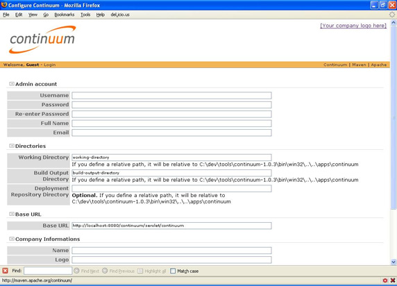
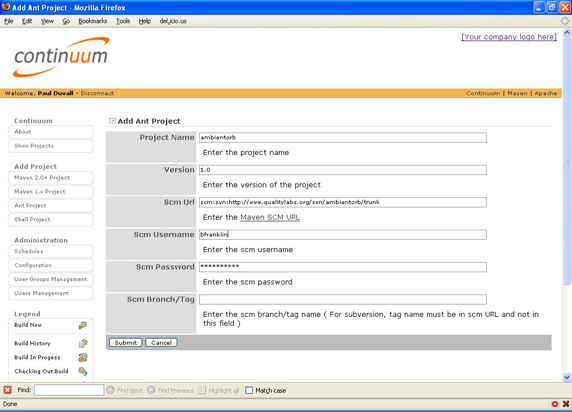
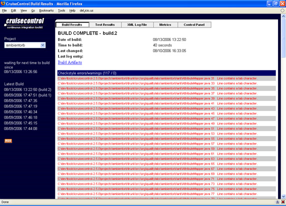
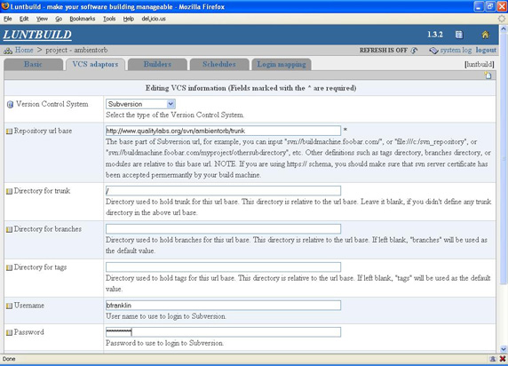
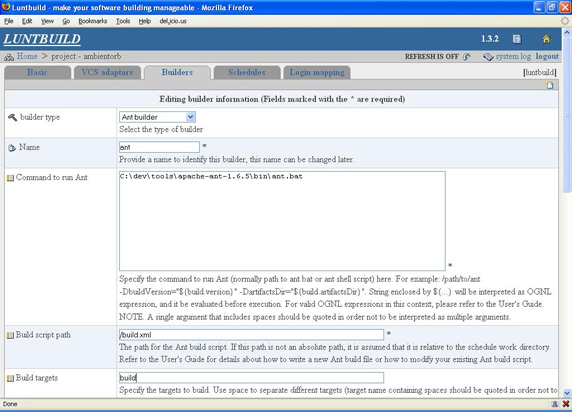
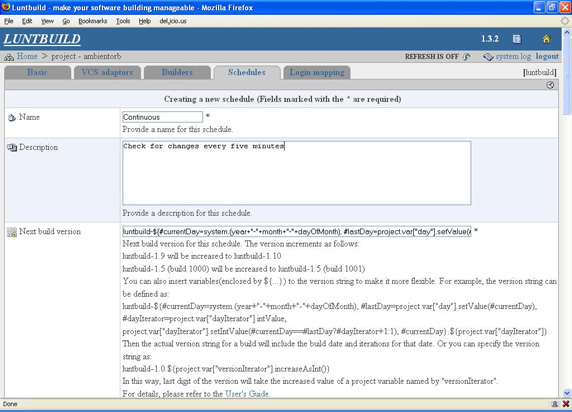
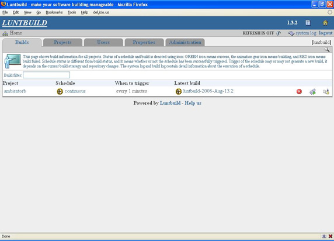

# 让开发自动化: 选择持续集成服务器

*对开源 CI 服务器：CruiseControl、Luntbuild 和 Continuum 的调查*

由于有许多持续集成服务（CI）服务器可以选择，所以很难决定哪个适应自己。在 [*让开发自动化*](http://www.ibm.com/developerworks/cn/views/java/articles.jsp?view_by=search&search_by=%E8%AE%A9%E5%BC%80%E5%8F%91%E8%87%AA%E5%8A%A8%E5%8C%96) 系列的第二篇文章中，开发自动化专家 Duvall 采用一致的评估标准和很多说明性示例，介绍了一些开源 CI 服务器，包括 Continuum、CruiseControl 和 Luntbuild。

在我脑海里，我至少能想到 12 种在当前市场上可用的 CI 服务器，包括商业的和开源的。虽然它们都试图自动进行软件构建的过程，但是都有各自的优点和不足。而且，有太多工具可供选择的不良后果就是很难决定究竟应该选择使用哪个。

在选用自动化过程的工具时，要时刻记住的就是：工具要 *确实适用*。选择错误的工具可能会限制整体的灵活性，会导致执行简单动作反而需要更长时间，或者会把人锁定在特定的支持工具或过程。

## 选择 CI 服务器的标准

通常，对一个新工具的决策分析可以归结如下：

> 我听说 Tim 在使用 Acme Inc 的工具，而且我认为 Tim 是个聪明人。所以，我也要使用 Acme Inc 的工具。现在我也是个聪明人了。

## 关于本系列

作为开发人员，我们的工作就是为用户提供自动化处理；但是，我们中的许多人却忽视了自动化自己的开发过程的机会。出于这个目的，[*让开发自动化*](http://www.ibm.com/developerworks/cn/views/java/articles.jsp?view_by=search&search_by=%E8%AE%A9%E5%BC%80%E5%8F%91%E8%87%AA%E5%8A%A8%E5%8C%96) 这一系列的文章专门研究了自动化软件开发过程的实际应用，并教您 *什么时候* 和 *如何* 成功应用自动化。

反过来，如果您问 Tim *为什么* 他选择使用 Acme Inc 的工具，您可能会发现是他的公司强制要求使用的。这就是为什么重要的是要根据 *自己的* 具体技术和政策需求对工具进行分析。如果不这么做，可能就会选择到不符合需求的工具，甚至更糟糕的是，不能带来任何帮助的工具。

在决策的时候，通常多数人都会把重点放在工具的特性上。但是要记住，虽然特性的确重要，但还有其他指标需要考虑。在我的实践中，我发现以下五个指标在评估工具时最有帮助：

## 什么是持续集成？

持续集成（CI）是一种实践，可以让团队在持续的基础 上收到反馈并进行改进，不必等到开发周期后期才寻找和修复缺陷。诸如 CruiseControl 之类的检查工具是在后台运行的，它们轮询版本控制存储库，从中寻找更改之处。当发现某一更改时，这类工具就会通过 Ant 执行预定义的构建脚本。持续检查借助持续集成的实践得以改进。

*   特性
*   可靠性
*   寿命
*   目标环境
*   易用性

而且不要忘记，*客观地* 检查这五个方面也是重要的。

### 产品特性

说到 CI 服务器的特性，应当考虑该工具与版本控制系统的集成、处理构建平台（例如 Ant 和 Maven）的能力以及提供反馈和报告的能力。而且不要忘记检查其他特性，例如构建标号和管理项目的依赖项。最后，在需要做一些特定的增强时，理解产品的可扩展性会很有帮助。

表 1 详细说明了每个特性：

##### 表 1\. 详细的 CI 服务器评估特性

| 特性 | 解释 |
| --- | --- |
| 版本控制系统集成 | 如果工具不支持您所使用的特定版本控制系统，您真的会为它编写一个定制集成么？ |
| 构建工具集成 | 在选择 CI 服务器时，需要考虑目前或将要使用哪个构建工具。对于 Java™ 编程，有两个自然的选择：Ant 和 Maven，几乎所有 CI 工具都支持它们。如果构建系统既不是 Ant 也不是 Maven，那么 CI 工具支持从命令行运行程序的功能么？ |
| 反馈和报告 | 想想老话 “如果树倒在森林中，能有人听到么？” 如果构建失败，会有人知道么？如果没人知道，那么使用 CI 工具的目的是什么？所有的 CI 工具都提供一些通知机制，但是哪个最适合您呢？电子邮件？即时消息？RSS？ |
| 标号 | 有些开发团队喜欢跟踪构建，给构建一个唯一的标号，这样日后就能找到具体的构建实例。如果这对您来说很重要，那么要注意只有少数 CI 服务器提供了这个功能。 |
| 项目依赖项 | 某些情况下，在构建了一个项目之后，可能需要构建其他依赖项目。有些 CI 服务器支持这个特性，有些不支持。 |
| 易于扩展 | 扩展工具当前的功能有多容易？是否用插件就可以实现简单的扩展，还是总得修改代码？ |

从特性的角度来说，以上提到的几点在选择所需要的正确的 CI 服务器时，至关重要。

### 产品可靠性

因为下载和使用开源 CI 服务器很简单，所以可以试用产品来判断它的可靠性。而且，在工具的可靠性和它在市场上的时间之间，通常存在一些相关性。使用新产品时，就会冒着有未发现的 bug 的风险。而且，用户群是发现工具出现的问题的优秀资源。大量的问题贴子或者过多的复杂问题，就表示用户对这个工具的意见较大。

因为我这里讨论的服务器是开源的，所以很容易发现下载的人数，这也会是产品健康程度的一个指示。用户少可能意味着反馈渠道少，可能需要换个地方看看。

### 寿命前景

在下载 CI 服务器之前，了解这个服务器未来的前景会有帮助。简单地说，使用已经死亡或正走向死亡的产品不是个好主意。可以检查该工具已经出现了多少年、在它的用户群中是否有正常数量的活动。就像可以从用户群来判断产品的可靠性一样，活跃的社区是工具未来前景良好的征兆。

### 目标环境

CI 服务器不能在 *所有* 环境下工作。需要考虑服务器支持哪个操作系统以及具体的系统需求。例如，如果工具是用最新版本的 Python 编写的，那么需要确定这个版本 Python 能够用于自己的操作系统。

### 易用性

产品的易用性可能是最主观的指标。有些人愿意手工修改配置文件，而有些人想让所有管理任务都在应用程序中执行，例如 Web 控制台。有些服务器要求从一个屏幕单击到下一个屏幕来执行简单的管理，而其他服务器则提供了直观的向导。

如果想理解 CI 服务器的具体细节，那么漂亮的管理 Web 表单就不重要了；但是，如果人手不足、工作繁忙，那么可能不会想在管理 CI 服务器上花太多时间。

记住我在这节讨论的五个方面，再来看一下三个 CI 服务器：Apache 的 Continuum、CruiseControl 和构建管理服务器 Luntbuild。

* * *

## Apache Continuum

Continuum 是最新的 CI 服务器之一，也是值得关注的一个新进入者。Continuum 的安装和配置很简单：只要下载和释放 ZIP 文件，运行命令行程序，就可以运行了。基于 Web 的界面使得配置项目很容易。而且，还不需要安装 Web 服务器，因为 Continuum 内置了 Jetty Web 服务器。并且，Continuum 可以作为 Windows 服务运行，还在应用程序的某些部分嵌入了上下文敏感的文档，从而提供了很多帮助。

## 想要更多细节信息？

面对如此之多 CI 服务器可以选择，本文可以引导您更详细地研究每个服务器，并决定哪个最合适。因为我比较了三个不同的服务器，所以我没有深入每个服务器的特定细节。我只是把重点放在了这些服务器安装后就提供的选项上。如果需要更多信息，请参考每个服务器的安装和配置指南。

### 易于使用

在使用 Continuum 时会注意到的第一件事就是它的易用性。能够在几分钟之内就把服务器运行起来并让它去查询修改。实际上，在 Windows 上启用 Continuum 只需要四步：

1.  下载 Continuum ZIP 文件（请参阅 参考资料）。
2.  把文件的内容释放到本地目录。
3.  运行 run.bat 文件，然后运行 InstallService.bat。
4.  打开浏览器指向 [`localhost:8080/。`](http://localhost:8080/。)

Continuum 内置支持五个版本控制系统：Subversion、CVS、StarTeam、Bazaar 和 Perforce。也部分地支持其他版本控制工具，例如 Visual Source Safe 和 ClearCase。 Continuum 还支持四种构建机制：Ant、Maven1、Maven2 和 Shell（命令行）。

### 配置 Continuum

在第一次访问 Continuum Web 应用程序时，默认是 *guest* 帐户。guest 提供了对所有项目的只读存取，没有管理或配置项目的能力。但是，可以很容易地创建 Administrative 用户，然后设置一些适用于所有项目的属性。

图 1 显示了管理页面，它提供了管理所有项目的 Continuum 设置的能力，包括创建 Admin 帐户、构建的输出和部署目录：

##### 图 1\. Continuum 的配置很简单



### 把项目添加到监视器

对 Continuum 进行配置让它监视项目也非常简单。简单到仅仅是选择期望的构建平台，例如 Ant 或 Maven2，然后把 Continuum 指到期望的版本控制系统。

图 2 显示了设置 Ant 项目时需要填充的字段：

##### 图 2\. 在 Continuum 中创建项目



在保存了这个信息之后，Continuum 每小时查询版本控制系统一次。可以修改项目的设置，查询得更频繁或更少些。我们在这里谈到的是 *持续* 集成，我建议每五 分钟检查修改一次，而不要每小时一次。

默认情况下，在使用 Ant 时，Continuum 在项目的根目录查找项目的 build.xml 文件。如果使用不同的名称或者这个文件不在项目的根目录，可以修改这个设置。

虽然 Continuum 还是 CI 舞台上的新人，但是它以其易用性和对当前众多流行的版本控制系统和构建工具的支持，还是给这一领域带来了巨大的冲击。我希望在未来的版本中会有添加和查看报告的功能。

* * *

## CruiseControl

CruiseControl 是 CI 服务器的老者。它已经用了有五年多了，在许多方面， CruiseControl *服务器* 已经成为持续集成实践的同义词。出于完全坦白的目的，我应当提到，我也是 CruiseControl 的多年的老用户。

### 改进的安装

如果您从最后一次使用 CruiseControl 到现在已经有段时间，而且认为它的安装和配置是个负担，那么您可以看看最新版本。现有，有许多方式安装 CruiseControl。例如，如果使用 Windows，会发现最简单的方式是下载二进制可执行文件，然后运行它。不用担心，还可以下载源代码。

安装之后，CruiseControl 预先配置了一个配置文件，轮询 CVS 存储库并执行 Ant 构建脚本。同样也不需要安装 Web 服务器，因为 CruiseControl 也内嵌了 Jetty。

### 轮询版本控制系统

比起 Luntbuild 和 Continuum，CruiseControl 提供了对超过十种不同版本控制系统的支持。而且，CruiseControl 对这些工具中的许多定制命令也提供了支持。清单 1 是一个使用 CruiseControl config.xml 脚本轮询 Subversion 存储库的示例：

##### 清单 1\. 通过 config.xml 文件轮询存储库

```
<listeners>
  <currentbuildstatuslistener file="logs/${project.name}/status.txt"/>
</listeners>
<modificationset quietperiod="30">
  <svn RepositoryLocation="http://www.qualitylabs.org/svn/ambientorb/trunk"
    username="bfranklin"
    password="G0Fly@Kite"
  />
</modificationset> 
```

### 执行构建脚本

当在版本控制系统（例如 Subversion）中发现修改时，可以很容易地配置 CruiseControl 去执行委托的构建脚本。例如，清单 2 演示了从 config.xml 调用 Ant 脚本，它指示 CruiseControl 每 60 秒钟查询 Subversion 存储库一次，并执行另一个 Ant 脚本。 委托的构建脚本（没有显示）删除旧文件，从 Subversion 签出最新的源代码，并在代码上运行项目的构建脚本。

##### 清单 2\. 执行 Ant 构建脚本

```
<schedule interval="60">
  <ant anthome="apache-ant-1.6.5" buildfile="build-${project.name}.xml"/>
</schedule> 
```

当设置了 CruiseControl 的这个方面并启动服务器之后，可以访问如图 3 所示的 CruiseControl Web 控制板：

##### 图 3\. CruiseControl 控制板



### CruiseControl 控制板

要接收最新构建的反馈，可以把 `htmlemail` 插件添加到清单 3 所示的 config.xml 脚本。可以用 config.xml 文件配置更多反馈机制，例如发送文本消息、电子设备（通过 X10）、甚至即时消息。

##### 清单 3\. 用 CruiseControl 发送电子邮件

```
...
<plugin name="htmlemail"
  buildresultsurl="http://${env.COMPUTERNAME}/cruisecontrol/buildresults/${project.name}"
  mailhost="${smtp.server}"
  username="${mail.username}"
  password="${mail.password}"
  returnaddress="${buildmaster.email}"
  returnname="${buildmaster.name}"
  subjectprefix="${project.name} build"
  xsldir="webapps/cruisecontrol/xsl"
  css="${reportdir}/cruisecontrol.css"/>
   ...
  <htmlemail>
    <always address="${buildmaster.email}"/>
    <failure address="${buildmaster.email}"/>
  </htmlemail> 
```

CruiseControl 提供了许多有用的特性，有强大的用户社区，极具扩展性。与本文中评估的其他工具相比，有些开发人员觉得 CruiseControl 不太容易使用。而另一方面，有些开发人员则发现用 XML 脚本进行修改提供了更好的控制。

* * *

## Luntbuild

从面市年头上说，Luntbuild 位于 Continuum 和 CruiseControl 之间。比起 Continuum 和 CruiseControl，Luntbuild 的目标是为并行开发和用户管理之类的事情提供支持的构建管理服务器。它的整个配置是通过 Web 应用程序管理的，所以没有配置文件需要处理。它也有商业版可以使用，叫作 QuickBuild，商业版中包含用户支持。

### Jetty 不再必需

Luntbuild 提供了几种安装方式。您可能会发现最简单的方式是通过 GUI 安装。用 Web 应用程序配置和管理 Luntbuild；所以，需要确保正在运行一个能够处理 JSP 的 Web 服务器，像 Tomcat 或 Jetty。

### 版本控制轮询

Luntbuild 提供了对八种不同版本控制系统的支持，例如 CVS、Subversion、ClearCase 和 Perforce。图 4 演示了 Luntbuild 被设置成轮询 Subversion：

##### 图 4\. Luntbuild 轮询 Subversion 存储库



### 执行构建

Luntbuild 支持五种不同的构建平台，包括 Ant、Maven、Maven2、命令行和 rake （用来构建 Ruby 应用程序）。图 5 显示了 Ant 构建器的配置页面：

##### 图 5\. 用 Luntbuild 执行 Ant 脚本



### 构建安排

通过使用 Luntbuild 中的 Schedule 标签（如图 6 所示），可以设置 Luntbuild 多久轮询一次版本控制系统来获得修改。在这个标签上，还可以指定分配给每个构建的唯一构建标号。

##### 图 6\. 在 Luntbuild 中安排构建



### 在 Luntbuild 中发布结果

配置了项目、版本控制系统适配器、构建和计划程序之后，就可以指定用户接收反馈的方式了。但是，Luntbuild 只内置了对电子邮件和即时消息的支持。另外，可以从 Luntbuild 的主页监视构建，如图 7 所示：

##### 图 7\. 从 Luntbuild Web 应用程序监视构建



Luntbuild 提供了一整套强大的功能，包括管理项目依赖项和大量的版本控制系统适配器。我认为工作流和用户界面可以简化，因为需要许多步骤来设置和配置工具。

* * *

## CI 记分卡

在不理解具体需求的情况下，就推荐哪个工具合适是非常冒失的。每个服务器都有许多优秀的特性，而且就像我在开始时所提到的，仅仅因为某个 CI 服务器最适合某人，并不意味着它必然满足您的需求。

如果寻找的是易于使用的工具，请选择 Continuum。如果扩展性、灵活性和繁荣的用户社区对您很重要，请使用 CruiseControl。如果需要 Web 管理和扩展的用户支持选项，请考虑 Luntbuild。围绕这些服务器已经形成了开发“生态”系统，所以如果遗漏了某个特性，一般都会找到适合需求的扩展。

在表 2 中，是我根据自己的使用经验为所考察的每个 CI 服务器总结的特性、可靠性、寿命、目标环境和易用性这五个核心方面：

##### 表 2\. CI 服务器五个核心方面

|  | 特性 | 可靠性 | 寿命 | 目标环境 | 易用性 |
| --- | --- | --- | --- | --- | --- |
| **Continuum** | 支持 Ant、Maven1 和 Maven2，以及 shell。 |

使用 XML-RPC 和 SOAP 的远程管理能力；支持 Maven2；用户群；期待未来有附加的报告和反馈机制——不需要修改代码。 | 在 2005 年发布。期待通过它与 Apache 的关系，得到 Continuum 的更多消息。 | 通过 Apache Maven 的良好用户社区支持产品在市场上仍很新。 | Linux、Mac OS X、Solaris 和 Win32。 | 优秀的易用性和安装。 | | **CruiseControl** | 许多版本控制集成和扩展性。通过 JMX 控制的远程访问。多种反馈机制，包括 RSS、X10、Jabber 以及其他。 | 在 2001 年发布。在三个服务器中，CruiseControl 在开发中应用得最多。 | 繁荣的用户社区；每个迹象都表示 CruiseControl 还会存在一段时间。 | Windows 和 Unix；任何能运行 Java JVM 的平台。 | 易于安装。有些人宁愿不修改 XML 配置文件。 | | **Luntbuild** | 项目依赖项、标号、安全性组和并行开发。 | 在 2004 年发布。Luntbuild 提供扩展的用户支持选项。 | 用户社区不如 CruiseControl 活跃。 | 能够运行 JVM 和 servlet 容器的系统。 | 易于安装，但用户界面/工作流需要大大改进。基于 Web 的配置（不需要修改配置文件）。 |

我在本文中只评估了三个服务器；还有许多服务器可能更适合您的需求。但是既然您理解了如何挑选 CI 服务器，那么选择工作就应当很容易了。请继续关注下个月的文章，我将介绍在开发项目中经常会遇到的构建问题。