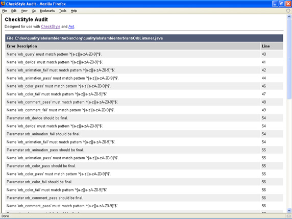
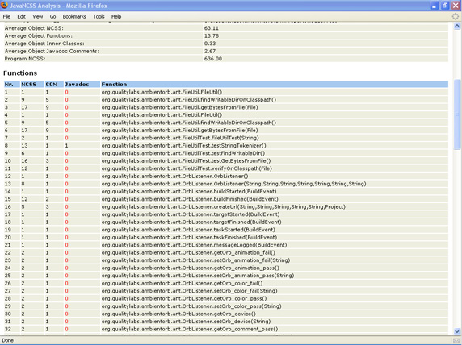
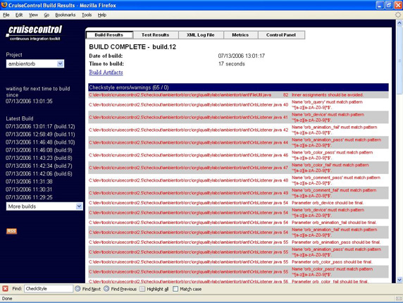

# 让开发自动化: 持续检查

*把自己从软件检查员寻常的手工检查工作中解放出来*

在开始新项目时，多数人计划在将代码投入生产发行之前审核它们；但是，当提交日程超越了其他因素时，审核常常成为第一个被抛弃的实践。如果能够自动执行其中一些审核，那么情况又会怎样呢？在新系列 “*[让开发自动化](http://www.ibm.com/developerworks/cn/views/java/articles.jsp?view_by=search&search_by=%E8%AE%A9%E5%BC%80%E5%8F%91%E8%87%AA%E5%8A%A8%E5%8C%96)*” 的第一篇文章中，开发自动化专家 Paul Duvall 首先将研究如何自动化检查器（例如 CheckStyle、JavaNCSS 和 CPD）、如何改进开发过程，以及应该什么时候使用它们。

代码检查可以采用不同的形式。有些企业使用正式的同级评审（peer review），在该评审过程中，开发人员要为代码提供同级评价，并提供改进意见；其他一些企业使用结对编程；还有一些人则考虑使用高级设计决策和推荐的代码改进。有些团队会在将代码提交到版本控制存储库之前，让其他开发人员用 “桌面检查” 的形式审查他们的代码。

不论企业采用哪种方式进行代码检查，有一件事是肯定的：*它们几乎都是手工过程*。正如我多年所观察到的，手工过程很容易出错，如果工作紧张，就会忘记自己正在做什么。但是，软件检查不必总是手工完成；实际上，有一大堆开源工具和商业工具（我称之为*软件检查器*），可以用它们很方便地对代码进行静态分析（这些工具也称为静态分析工具）。

使用软件检查器，代码检查可以通过 Ant 或 Maven 这样的构建工具来自动完成。通过使用这种自动化，一些低级的源代码细节（如编码标准、复杂性和重复程度等）的处理成为了机器的职责。这种职责转移通过将重点转向更高级的开发方面（比如设计和长期维护问题）提高了人们手工检查的效率。

## 关于本系列

作为开发人员，我们的工作就是为用户提供自动化处理；但是，我们中的许多人却忽视了自动化自己的开发过程的机会。出于这个目的，*[让开发自动化](http://www.ibm.com/developerworks/cn/views/java/articles.jsp?view_by=search&search_by=%E8%AE%A9%E5%BC%80%E5%8F%91%E8%87%AA%E5%8A%A8%E5%8C%96)* 这一系列的文章专门研究了自动化软件开发过程的实际应用，并教您*什么时候* 和*如何* 成功地应用自动化。

## 用软件检查器来解决问题

软件检查器有很多，范围从复杂的商业工具到简单的开源替代工具。但是，我发现其中三个特别有用，它们是 CheckStyle、CPD 和 JavaNCSS （请参阅 参考资料）：

*   CheckStyle 报告与项目预定的编码标准的偏离度。
*   CPD 报告代码重复。
*   JavaNCSS 可以帮助团队专注于更高级的代码复杂性领域。

所有这些工具都可以免费得到，而且易于集成到 Ant 或 Maven 这样的构建平台中，因此它们极易集成到持续集成（CI）系统中。

## 什么是持续集成？

持续集成（CI）是一种实践，可以让团队在*持续的基础* 上收到反馈并进行改进，不必等到开发周期后期才寻找和修复缺陷。诸如 CruiseControl 之类的检查工具是在后台运行的，它们轮询版本控制存储库，从中寻找更改之处。当发现某一更改时，这类工具就会通过 Ant 执行预定义的构建脚本。持续检查借助持续集成的实践得以改进。

### 检查器样式标准

我参与了几家公司的委员会，花了很多时间来定义编码标准。有一次，我们定义了几乎*没人* 遵守的 25 页的编码标准文档。结果，我们的代码审查非常痛苦，因为团队要花时间来挑错，看看开发人员是否使用了两个空格规则（与四个空格规则相对），以及是否将参数声明为 `final`。如果把这些低级检查工作交给软件检查器，我们会节省许多宝贵的时间。

使用自动的源代码检查工具（如 CheckStyle）可以提供执行可配置规则集的简单途径，规则集可以根据项目的编码标准而定。此外，可以通过 CheckStyle 插件在 IDE 中运行 CheckStyle，CheckStyle 通过它的 Ant 任务或 Maven 插件直接集成到构建脚本中。CheckStyle 发现的所有规则偏离都会以报告的形式显示，清楚地指出哪一个文件违规。除此之外，还可以将 Ant 和 Maven 配置成与 CheckStyle 相呼应，这样，在违反规则时，构建工作就会失败。

例如，清单 1 演示了 Ant 构建脚本的一个代码段，它运行 CheckStyle 生成 HTML 报告。请注意 `failOnViolation` 属性，在这里它被设为 `false`。如果将该属性设为 `true`，则在发现*任何* 源代码违规时，构建都会失败。

##### 清单 1\. 将 CheckStyle 用于 Ant

```
<taskdef resource="checkstyletask.properties" classpath="${checkstyle.jar}"/>
<checkstyle config="${basedir}/cs-rules.xml" failOnViolation="false">
  <formatter toFile="${checkstyle.data.file}" type="xml" />
  <fileset casesensitive="yes" dir="${src.dir}" includes="**/*.java" />
</checkstyle>
<xslt taskname="checkstyle"
  in="${checkstyle.data.file}"
  out="${checkstyle.report.file}"
  style="${checkstyle.xsl.file}" /> 
```

在清单 1 中，`config` 被设置成 `cs-rules.xml`，这表示将根据源代码目录（在 `fileset dir` 属性中）以递归的方式运行规则文件。`xslt` 任务接受根据 `formatter toFile` 属性生成的文件。该任务使用 XSL 文件 checkstyle.xsl 将清单 1 生成的 XML 转换成一个可读的 HTML 文件，XSL 文件 checkstyle.xsl 包含在 CheckStyle 安装文件中。

清单 2 是 CheckStyle 规则文件的示例片段。CheckStyle 可以在代码基上运行 120 多个规则。

##### 清单 2\. 在 cs-rules.xml 文件中定义的 CheckStyle 规则

```
<module name="Checker">
  <module name="TreeWalker">
    <property name="cacheFile" value="target/checkstyle.cache"/>
    <property name="tabWidth" value="4"/>
    <module name="ImportOrder">
      <property name="ordered" value="true"/>
      <property name="separated" value="true"/>
    </module>
    <module name="LineLength">
      <property name="max" value="120"/>
    </module>
    <module name="FileLength">
      <property name="max" value="400"/>
    </module>
    <module name="UnusedImports"/>
  </module>
</module> 
```

每个 CheckStyle 规则都是一个模块。例如，`LineLength` 模块建立的规则是：所有行中的字符都不得超过 120 个字符，否则 CheckStyle 就生成错误。

可以用定制规则扩展 CheckStyle，所以也可以容易地实施编码规则。而且，它是自动执行的！

图 1 显示了使用 Ant 生成的 CheckStyle 报告的一个示例，这是 清单 1 中所演示的 `xslt` 任务：

##### 图 1\. CheckStyle HTML 报告



## 用 IDE 怎么样？

我听到的一个普遍反应是这些检查可以在 IDE 中运行。尽管确实如此，*并且极力推荐这样做*，但是拥有一台对源代码运行一组公用规则集（使用 Ant 这样的工具）的单独机器的好处是：一致性更好。

### 用 CPD 进行重复性检查

面向对象编程的一个主要目的是通过创建可以适应不同上下文的可重用对象来促进重用。但是，通常使用的是 “复制-粘贴” 编程，并将它伪装成 “重用”。有时，出现这种情况是因为开发人员不知道有可重用的组件，而其他时候，则是因为提供了“快速修复”。所以，如果需要进行修改，则必须将更改应用到*所有* 副本和变体中（当然，如果没有工具很难完成）。这种手工方式带来了维护困难并很容易导致遗漏，甚至会带来缺陷。

CPD 是流行的开源静态分析工具 PMD 的一部分，它报告代码基中重复行的数量。此外，CPD 的标志阈值是可配置的，这意味着可以修改 CPD 建议的重复行数。例如，如果将阈值设置成 100 个标志，CPD 就会在*至少* 重复了 100 个标志的时候显示一个实例。不过请记住，源代码总是会包含一些重复部分；CPD 只是为团队提供了一种调查*值得考虑的代码重复* 领域的手段，在这个领域内，可以采取纠正措施，例如有目的的重构。

清单 3 演示将 CPD 用于 Ant 的实际使用。CPD 任务需要的第一个选项是 `minimumTokenCount` 属性，该属性用于指定要比较的标志的数量（最小值是一个标志）。另外，可以设置 CPD 忽略某些代码选项，例如标识符和标量。在这个示例中，Ant `fileset` 类型指定了 CPD 文件应该分析哪些文件，以及应该忽略哪些文件。

##### 清单 3\. 将 CPD 用于 Ant

```
<taskdef name="cpd" 
  classname="net.sourceforge.pmd.cpd.CPDTask" classpathref="pmd.classpath" />
  <cpd minimumTokenCount="100" 
        format="xml"
        language="java"
        ignoreIdentifiers="true"
        ignoreLiterals="true"
        outputFile="${basedir}/cpd.xml">
        <fileset dir="${src.dir}">
          <include name="**/*.java" />
          <include name="**/*.jsp" />
          <include name="**/*.xml" />
          <exclude name="**/*Test*.java" />
        </fileset>
  </cpd> 
```

如图 2 所示，cpd.xml 是用清单 3 中的 `outputFile` 属性产生的输出。以后我还将向 CPD 添加 XSL，以生成 HTML 报告。

##### 图 2\. 显示代码重复违规的 CPD XML 输出


除了最明显的复制-粘贴违规之外，在所有地方手工查找重复代码也非常具有挑战性。但是，使用诸如 CPD 之类的工具，就可以迅速找出重复代码，然后对此进行改进。

## 路径是什么？

源代码*路径* 也叫做流程控制语句，它指示在方法中更改流程的代码。这类示例包括条件语句（如 `if` 语句），或者循环构造（如 `while` 和 `for`）。

### 用 JavaNCSS 检查复杂性

许多研究已经证实，随着方法中路径数量的增加，理解和维护同一方法的难度也随之增加。结果，代码越难以理解和维护，就越容易出现缺陷。

JavaNCSS 是一个免费工具，提供了不同的代码测量，例如非注释性源代码语句（或代码行）的数量、所有分析过的方法的圈复杂度量值（cyclomatic complexity number）。清单 4 演示了 JavaNCSS 的使用，可以看到，它不是很难使用。只要将 JavaNCSS 指向一个包含源代码的目录，让它自己处理就行了！

##### 清单 4\. 将 JavaNCSS 用于 Ant

```
<path id="javancss.classpath">
  <fileset dir="${lib.dir}" />
</path>
<taskdef name="javancss" classpathref="javancss.classpath"
  classname="javancss.JavancssAntTask">
</taskdef>
<javancss srcdir="${src.dir}"
      generateReport="true"
      outputfile="${javancss.report.dir}/javancss_metrics.xml"
      format="xml"/> 
```

像多数软件检查器一样，这里生成了一个 XML 文件，可以通过 XSLT 很容易地将它转换成一个 HTML 报告，就像图 3 中所做的那样：

##### 图 3\. JavaNCSS HTML 报告



理解应用程序代码复杂性可没有那么容易。实际上，在某些情况下，复杂性的值可能会令人误解。例如，有些工具为 `switch` 语句提供较高的值。但是我发现，使用 JavaNCSS 这样的工具，有助于降低高复杂性的领域，最终提高代码的可理解性和可维护性。

* * *

## 对每个更改都进行检查，将缺陷控制在限度内

每当团队成员向版本控制存储库提交更改时，代码就会发生改变。但它是怎么改变的呢？被修改的代码是受到复制-粘贴工作的影响吗？复杂性会增加吗？了解这些的惟一方式就是在*每次签入* 时都运行软件检查器。此外，在持续的基础上接受目前为止讨论过的每种风险的反馈，这是一种*自动* 让代码基进行健康检查的一种可靠方式！

### Cruise 与 CI

CruiseControl 是 Java™ 社区使用最广的开源 CI 工具之一。这个工具被配置成在后台运行，用于检索版本控制存储库，例如 CVS。在发现源代码更改时（例如，有人签入了代码），CruiseControl 就会执行源代码签出，并运行预定义的构建脚本。

所以，*只要* 版本控制存储库中发生了变化，团队就可以运行 CheckStyle、CPD 和 JavaNCSS 这样的软件检查器。这种能力允许团队长时间地进行监视和执行检查，通过使用许多 CI 工具，团队可以使用报告、电子邮件甚至使用 Ambient Orb 这样的设备生成报告（参见 图 5）。

清单 5 演示了使用 CruiseControl 的配置文件（通常名为 config.xml）在 CruiseControl 控制板上显示 CheckStyle 报告的结果。其他软件检查器使用类似的语法将结果合并到 CruiseControl 仪表板中。

##### 清单 5\. 在 config.xml 中用 CruiseControl 记录 CheckStyle

```
<listeners>
  <currentbuildstatuslistener file="logs/${project.name}/status.txt"/>
</listeners>
<modificationset quietperiod="30">
  <svn RepositoryLocation="http://www.qualitylabs.org/svn/ambientorb"
    username="[username]"
    password="[password]"
  />
</modificationset>
<schedule interval="60">
  <ant anthome="apache-ant-1.6.5" buildfile="build-${project.name}.xml"/>
</schedule>
<log>
  <merge dir="merge dir="checkout/${project.name}/_reports/checkstyle" />
</log> 
```

图 4 显示了用 CruiseControl 和 CheckStyle 生成的示例报告。请注意，可以配置 CruiseControl，显示其他工具（像 CPD 和 JavaNCSS）的报告，而且通过*对每个源代码更改* 都运行这些报告，团队可以实时地积极改进代码，不必等到周期末期。

##### 图 4\. 与 CruiseControl 集成的 CheckStyle 报告



### Ambient 反馈

对于使用 CI 工具持续运行软件检查器而言，最酷的事就是团队有了无数任意使用的通知机制。有时，构建可能并没有失败，但是*有些事* 的变化要求早些而不是晚些采取纠正行动。例如，实际上可以很容易地配置一个设备（就像 Ambient Orb），在代码复杂度有所上升时，或者在违反一定数量的代码标准时，使用该设备改变颜色。

清单 6 使用了 Ambient Orb Ant 任务和 Ruby 脚本，在 20 个以上的类超过 300 个源代码行（SLOC）时，就改变 Orb 的颜色和动画。在这个示例中，我选择在类满足条件时将 orb 的颜色改成 `magenta`，将动画改成 `crescendo`。

##### 清单 6\. 委托 Ant 构建文件处理 CruiseControl 和 Ambient Orb

```
 <target name="checkSloc" >
    <exec dir="${basedir}" executable="cmd.exe">
      <arg line="/c ${config.dir}/javancss/SlocThreshold.rb 
          ${reports.javancss.dir}/javancss_metrics.xml 20 ${javancss.file}"/>
    </exec>
    <available file="${basedir}/${javancss.file}" property="sloc.exceeded"/>
    <antcall target="notifyOrb" />
  </target>

  <target name="notifyOrb" if="sloc.exceeded">
    <taskdef classname="org.qualitylabs.ambientorb.ant.OrbTask"
     name="orb" classpathref="orb.class.path"/>
    <orb query="http://myambient.com:8080/java/my_devices/submitdata.jsp"
      deviceId="AAA-9A9-AA9"
      colorPass="green"
      colorFail="magenta"
      animationPass="none"
      animationFail="crescendo"
      commentFail="SLOC+Exceeded" />    
  </target> 
```

图 5 演示了代码基中有太多较大的类时，orb 看起来的样子：

##### 图 5\. Ambient Orb


使用这种 Ambient Orb 通知方法，就不会收到无穷尽的电子邮件，只要看一眼 *SLOC Threshold Orb*，就可以快速了解我有多少个大型类，它们提醒我要重定向重构工作。当然，组合 ambient orb 与软件监视器（稍带些创意）也会创造无穷的可能性！

* * *

## 在合适的时候自动化

请记住，可以选择许多不同的软件检查器。虽然这里分析了三个我喜欢的软件检查器，但我还是被 JDepend、PMD 和 FindBugs 工具（后两个检查器在 developerWorks 上已详细讨论过）所打动。一旦开始持续检查过程，插入一个新的检查器只是几分钟的事而已。

持续检查不会也不应该消除手工软件检查；但是，通过对版本控制存储库中的每个更改都运行一套自动检查工具，*将要执行的* 这些手工检查会带来更高的生产率和效率。而且，持续检查带来的额外好处有：风险在每一步上都可以降低，而不必等到项目后期。

下一个月，我将深入研究一些更有趣的持续集成工具，例如 CruiseControl、Luntbuild 和 Continuum，并让您确定哪一个工具最适合您。自动化*从未* 这么有趣过！

* * *

## 下载

| 描述 | 名字 | 大小 |
| --- | --- | --- |
| Software Inspection examples in Ant | [j-ap08016.zip](http://www.ibm.com/developerworks/apps/download/index.jsp?contentid=155371&filename=j-ap08016.zip&method=http&locale=zh_CN) | 2MB |