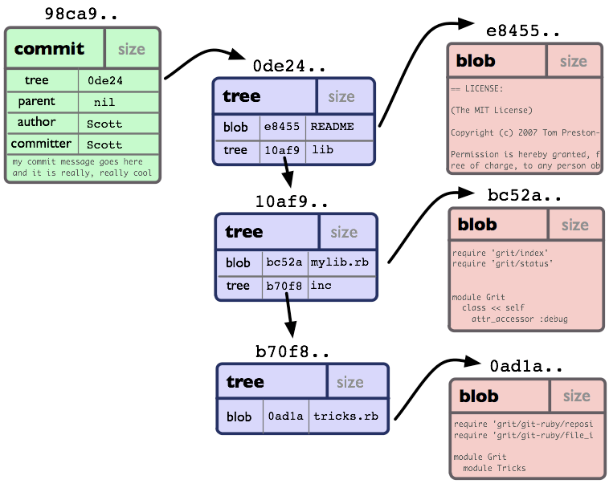

欢迎来使用 Git, 它是一个快速的分布式版本控制系统。

这本书的目的是为那些初学者尽快熟悉 Git，提供了一个良好的起点。

此书将以介绍 Git 如何存储数据做为开始，让你了解它和其它版本控制系统有什么不同的背景。这大约要花你 20 分钟的时间。

接下来，我们会讲一些 Git 的**基本用法**，那些你将在 90%的时间都在使用的命令。这些东东能给一个不错的使用的基础，也许这些命令就是你将使用的全部命令。这一节大约会你 30 分钟的时间来读。

其后，我们会讲一些稍微复杂的**Git 中级用法**，这些用法也许会替换掉前面的基本用法。在你了解前面的基本用法后, 这些看起来像魔术一样的命令，你可能会用起来很爽。

如果前面的这些东东你都掌握了，我们就会讲**Git 的高级用法**，这些高级用法也许大多数人很少使用，但是在特定的环境会非常有用。学习这些用法（命令）,你将能获得全面的日常 Git 知识； 你将能成为 Git 大师。

即然你学会了 Git, 我们将会讲**在 Git 中工作**。我们将要学习 Git 配合脚本、部署工具、编辑器和其它工具一起工作。这一节将帮助你将 Git 集成进你的工作环境。

最后我们会有一系列的文章：**low-level documentation**，这些可能对那些 Git hacker 有用，包括 Git 的内核和协议如何运作等等。

## 反馈与参与　

如果你发现本书的中任何错误，或者你想参与进此书的编写，你可以给我写 email schacon@gmail.com, 或者你也可以用 git 得到本书的原始 档案(source) [`github.com/schacon/gitbook`](http://github.com/schacon/gitbook), 然后给我发一个补丁(patch)或者一个 pull 请求

译者注:如果有哪位朋友发现中译本的错误,或者是想参加此书的翻译，也可以给我发 email liuhui998@gmail.com, 或者你也可以用 git 得到本书的原始 档案(source) [`github.com/liuhui998/gitbook`](http://github.com/liuhui998/gitbook), 然后给我发一个补丁(patch)或者一个 pull 请求

## 参考

这本书由很多不同的资料汇聚起来，如果你更愿意阅读原始的文章和资料，下面提供了它们的 url:

*   [Git User Manual](http://www.kernel.org/pub/software/scm/git/docs/user-manual.html)
*   [The Git Tutorial](http://www.kernel.org/pub/software/scm/git/docs/gittutorial.html)
*   [The Git Tutorial pt 2](http://www.kernel.org/pub/software/scm/git/docs/gittutorial-2.html)
*   ["My Git Workflow" blog post](http://osteele.com/archives/2008/05/my-git-workflow)

## SHA

所有用来表示项目历史信息的文件,是通过一个 40 个字符的（40-digit）“对象名”来索引的，对象名看起来像这样:

```
      6ff87c4664981e4397625791c8ea3bbb5f2279a3

```

你会在 Git 里到处看到这种“40 个字符”字符串。每一个“对象名”都是对“对象”内容做 SHA1 哈希计算得来的，（SHA1 是一种密码学的哈希算法）。这样就意味着两个不同内容的对象不可能有相同的“对象名”。

这样做会有几个好处：

*   Git 只要比较对象名，就可以很快的判断两个对象是否相同。
*   因为在每个仓库（repository）的“对象名”的计算方法都完全一样，如果同样的内容存在两个不同的仓库中，就会存在相同的“对象名”下。
*   Git 还可以通过检查对象内容的 SHA1 的哈希值和“对象名”是否相同，来判断对象内容是否正确。

## 对象

每个对象(object) 包括三个部分：**类型**，**大小**和**内容**。大小就是指内容的大小，内容取决于对象的类型，有四种类型的对象："blob"、"tree"、 "commit" 和"tag"。

*   **“blob”**用来存储文件数据，通常是一个文件。
*   **“tree”**有点像一个目录，它管理一些**“tree”**或是 **“blob”**（就像文件和子目录）
*   一个**“commit”**只指向一个"tree"，它用来标记项目某一个特定时间点的状态。它包括一些关于时间点的元数据，如时间戳、最近一次提交的作者、指向上次提交（commits）的指针等等。
*   一个**“tag”**是来标记某一个提交(commit) 的方法。

几乎所有的 Git 功能都是使用这四个简单的对象类型来完成的。它就像是在你本机的文件系统之上构建一个小的文件系统。

## 与 SVN 的区别

Git 与你熟悉的大部分版本控制系统的差别是很大的。也许你熟悉 Subversion、CVS、Perforce、Mercurial 等等，他们使用 *“增量文件系统”* （Delta Storage systems）, 就是说它们存储每次提交(commit)之间的差异。Git 正好与之相反，它会把你的每次提交的文件的全部内容（snapshot）都会记录下来。这会是在使用 Git 时的一个很重要的理念。

## Blob 对象

一个 blob 通常用来存储文件的内容.


你可以使用[git show](http://www.kernel.org/pub/software/scm/git/docs/git-show.html)命令来查看一个 blob 对象里的内容。假设我们现在有一个 Blob 对象的 SHA1 哈希值，我们可以通过下面的的命令来查看内容：

```
      $ git show 6ff87c4664

 Note that the only valid version of the GPL as far as this project
 is concerned is _this_ particular version of the license (ie v2, not
 v2.2 or v3.x or whatever), unless explicitly otherwise stated.
...

```

一个"blob 对象"就是一块二进制数据，它没有指向任何东西或有任何其它属性，甚至连文件名都没有.

因为 blob 对象内容全部都是数据，如两个文件在一个目录树（或是一个版本仓库）中有同样的数据内容，那么它们将会共享同一个 blob 对象。Blob 对象和其所对应的文件所在路径、文件名是否改被更改都完全没有关系。

## Tree 对象

一个 tree 对象有一串(bunch)指向 blob 对象或是其它 tree 对象的指针，它一般用来表示内容之间的目录层次关系。


[git show](http://www.kernel.org/pub/software/scm/git/docs/git-show.html)命令还可以用来查看 tree 对象，但是[git ls-tree](http://www.kernel.org/pub/software/scm/git/docs/git-ls-tree.html)能让你看到更多的细节。如果我们有一个 tree 对象的 SHA1 哈希值，我们可以像下面一样来查看它：

```
      $ git ls-tree fb3a8bdd0ce
100644 blob 63c918c667fa005ff12ad89437f2fdc80926e21c    .gitignore
100644 blob 5529b198e8d14decbe4ad99db3f7fb632de0439d    .mailmap
100644 blob 6ff87c4664981e4397625791c8ea3bbb5f2279a3    COPYING
040000 tree 2fb783e477100ce076f6bf57e4a6f026013dc745    Documentation
100755 blob 3c0032cec592a765692234f1cba47dfdcc3a9200    GIT-VERSION-GEN
100644 blob 289b046a443c0647624607d471289b2c7dcd470b    INSTALL
100644 blob 4eb463797adc693dc168b926b6932ff53f17d0b1    Makefile
100644 blob 548142c327a6790ff8821d67c2ee1eff7a656b52    README
...

```

就如同你所见，一个 tree 对象包括一串(list)条目，每一个条目包括：mode、对象类型、SHA1 值 和名字(这串条目是按名字排序的)。它用来表示一个目录树的内容。

一个 tree 对象可以指向(reference): 一个包含文件内容的 blob 对象, 也可以是其它包含某个子目录内容的其它 tree 对象. Tree 对象、blob 对象和其它所有的对象一样，都用其内容的 SHA1 哈希值来命名的；只有当两个 tree 对象的内容完全相同（包括其所指向所有子对象）时，它的名字才会一样，反之亦然。这样就能让 Git 仅仅通过比较两个相关的 tree 对象的名字是否相同，来快速的判断其内容是否不同。

> (注意：在 submodules 里，trees 对象也可以指向 commits 对象. 请参见 **Submodules** 章节)
> 
> 注意：所有的文件的 mode 位都是 644 或 755，这意味着 Git 只关心文件的可执行位.

## Commit 对象

"commit 对象"指向一个"tree 对象", 并且带有相关的描述信息.


你可以用 --pretty=raw 参数来配合 [git show](http://www.kernel.org/pub/software/scm/git/docs/git-show.html) 或 [git log](http://www.kernel.org/pub/software/scm/git/docs/git-log.html) 去查看某个提交(commit):

```
      $ git show -s --pretty=raw 2be7fcb476
commit 2be7fcb4764f2dbcee52635b91fedb1b3dcf7ab4
tree fb3a8bdd0ceddd019615af4d57a53f43d8cee2bf
parent 257a84d9d02e90447b149af58b271c19405edb6a
author Dave Watson <dwatson@mimvista.com> 1187576872 -0400
committer Junio C Hamano <gitster@pobox.com> 1187591163 -0700

    Fix misspelling of 'suppress' in docs

    Signed-off-by: Junio C Hamano <gitster@pobox.com>

```

你可以看到, 一个提交(commit)由以下的部分组成:

*   一个 **tree**　对象: tree 对象的 SHA1 签名, 代表着目录在某一时间点的内容.

*   **父对象** (parent(s)): 提交(commit)的 SHA1 签名代表着当前提交前一步的项目历史. 上面的那个例子就只有一个父对象; 合并的提交(merge commits)可能会有不只一个父对象. 如果一个提交没有父对象, 那么我们就叫它“根提交"(root commit), 它就代表着项目最初的一个版本(revision). 每个项目必须有至少有一个“根提交"(root commit). 一个项目可能有多个"根提交“，虽然这并不常见(这不是好的作法).

*   **作者** : 做了此次修改的人的名字,　还有修改日期.

*   **提交者**（committer): 实际创建提交(commit)的人的名字, 同时也带有提交日期. TA 可能会和作者不是同一个人; 例如作者写一个补丁(patch)并把它用邮件发给提交者, 由他来创建提交(commit).

－**注释** 用来描述此次提交.

> 注意: 一个提交(commit)本身并没有包括任何信息来说明其做了哪些修改; 所有的修改(changes)都是通过与父提交(parents)的内容比较而得出的. 值得一提的是, 尽管 git 可以检测到文件内容不变而路径改变的情况, 但是它不会去显式(explicitly)的记录文件的更名操作.　(你可以看一下 [git diff](http://www.kernel.org/pub/software/scm/git/docs/git-diff.html) 的 -M　参数的用法)

一般用 [git commit](http://www.kernel.org/pub/software/scm/git/docs/git-commit.html) 来创建一个提交(commit), 这个提交(commit)的父对象一般是当前分支(current HEAD),　同时把存储在当前索引(index)的内容全部提交.

## 对象模型

现在我们已经了解了 3 种主要对象类型(blob, tree 和 commit), 好现在就让我们大概了解一下它们怎么组合到一起的.

如果我们一个小项目, 有如下的目录结构:

```
      $>tree
.
|-- README
`-- lib
    |-- inc
    |   `-- tricks.rb
    `-- mylib.rb

2 directories, 3 files

```

如果我们把它提交(commit)到一个 Git 仓库中, 在 Git 中它们也许看起来就如下图:



你可以看到: 每个目录都创建了 **tree 对象** (包括根目录), 每个文件都创建了一个对应的 **blob 对象** . 最后有一个 **commit 对象** 来指向根 tree 对象(root of trees), 这样我们就可以追踪项目每一项提交内容.

## 标签对象


一个标签对象包括一个对象名(译者注:就是 SHA1 签名), 对象类型, 标签名, 标签创建人的名字("tagger"), 还有一条可能包含有签名(signature)的消息. 你可以用 [git cat-file](http://www.kernel.org/pub/software/scm/git/docs/git-cat-file.html) 命令来查看这些信息:

```
      $ git cat-file tag v1.5.0
object 437b1b20df4b356c9342dac8d38849f24ef44f27
type commit
tag v1.5.0
tagger Junio C Hamano <junkio@cox.net> 1171411200 +0000

GIT 1.5.0
-----BEGIN PGP SIGNATURE-----
Version: GnuPG v1.4.6 (GNU/Linux)

iD8DBQBF0lGqwMbZpPMRm5oRAuRiAJ9ohBLd7s2kqjkKlq1qqC57SbnmzQCdG4ui
nLE/L9aUXdWeTFPron96DLA=
=2E+0
-----END PGP SIGNATURE-----

```

点击 [git tag](http://www.kernel.org/pub/software/scm/git/docs/git-tag.html), 可以了解如何创建和验证标签对象. (注意: [git tag](http://www.kernel.org/pub/software/scm/git/docs/git-tag.html) 同样也可以用来创建 "轻量级的标签"(lightweight tags), 但它们并不是标签对象, 而只一些以 "refs/tags/" 开头的引用罢了)。

## Git 目录

'Git 目录'是为你的项目存储所有历史和元信息的目录 - 包括所有的对象(commits,trees,blobs,tags), 这些对象指向不同的分支。

每一个项目只能有一个'Git 目录'(这和 SVN,CVS 的每个子目录中都有此类目录相反),　这个叫'.git'的目录在你项目的根目录下(这是默认设置,但并不是必须的). 如果你查看这个目录的内容, 你可以看所有的重要文件:

```
      $>tree -L 1
.
|-- HEAD         # 这个 git 项目当前处在哪个分支里
|-- config       # 项目的配置信息，git config 命令会改动它
|-- description  # 项目的描述信息
|-- hooks/       # 系统默认钩子脚本目录
|-- index        # 索引文件
|-- logs/        # 各个 refs 的历史信息
|-- objects/     # Git 本地仓库的所有对象 (commits, trees, blobs, tags)
`-- refs/        # 标识你项目里的每个分支指向了哪个提交(commit)。

```

(也许现在还有其它 文件/目录 在 'Git 目录' 里面, 但是现在它们并不重要)

## 工作目录

Git 的 '工作目录' 存储着你现在签出(checkout)来用来编辑的文件. 当你在项目的不同分支间切换时, 工作目录里的文件经常会被替换和删除. 所有历史信息都保存在 'Git 目录'中 ;　工作目录只用来临时保存签出(checkout) 文件的地方, 你可以编辑工作目录的文件直到下次提交(commit)为止。

> 译者注: 'Git 目录' 一般就是指项目根目录下的'.git'目录。

Git 索引是一个在你的工作目录和项目仓库间的暂存区(staging area). 有了它, 你可以把许多内容的修改一起提交(commit). 如果你创建了一个提交(commit), 那么提交的是当前索引(index)里的内容, 而不是工作目录中的内容。

## 查看索引

使用 [git status](http://www.kernel.org/pub/software/scm/git/docs/git-status.html) 命令是查看索引内容的最简单办法。你运行 git status 命令, 就可以看到: 哪些文件被暂存了(就是在你的 Git 索引中), 哪些文件被修改了但是没有暂存, 还有哪些文件没有被跟踪(untracked)。

```
      $>git status
# On branch master
# Your branch is behind 'origin/master' by 11 commits, and can be fast-forwarded.
#
# Changes to be committed:
#   (use "git reset HEAD <file>..." to unstage)
#
#   modified:   daemon.c
#
# Changed but not updated:
#   (use "git add <file>..." to update what will be committed)
#
#   modified:   grep.c
#   modified:   grep.h
#
# Untracked files:
#   (use "git add <file>..." to include in what will be committed)
#
#   blametree
#   blametree-init
#   git-gui/git-citool

```

如果完全掌握了索引(index), 你就一般不会丢失任何信息, 只要你记得名字描述信息(name of the tree that it described)就能把它们找回来.

同时, 你最好能对 Git 一些基本功能的运作原理, 和它与其它版本控制系统的区别有一个清晰的理解. 如果你在这一章没有完全理解, 我们会在后面的章节重新回顾这些主题. 好了, 下面我们要去了解如何安装, 配置和使用 Git。