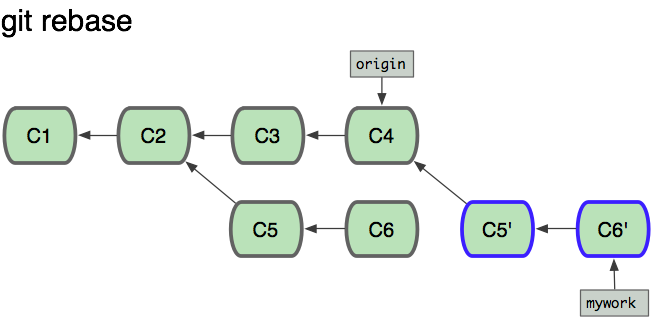

# 4\. 中级技能

# 忽略某些文件

项目中经常会生成一些 Git 系统不需要追踪(track)的文件。典型的是在编译生成过程中 产生的文件或是编程器生成的临时备份文件。当然，你不追踪(track)这些文件，可以 平时不用"git add"去把它们加到索引中。 但是这样会很快变成一件烦人的事，你发现 项目中到处有未追踪(untracked)的文件; 这样也使"`git add .`" 和"`git commit -a`" 变得实际上没有用处，同时"`git status`"命令的输出也会有它们。

你可以在你的顶层工作目录中添加一个叫".gitignore"的文件，来告诉 Git 系统要忽略 掉哪些文件，下面是文件内容的示例:

```
# 以'#' 开始的行，被视为注释.
# 忽略掉所有文件名是 foo.txt 的文件.
foo.txt
# 忽略所有生成的 html 文件,
*.html
# foo.html 是手工维护的，所以例外.
!foo.html
#  忽略所有.o 和 .a 文件.
*.[oa]

```

你可以点这里 [gitignore](http://www.kernel.org/pub/software/scm/git/docs/gitignore.html) 查看一下详细的语法解释. 你也可以把".gitignore" 这个文件放到工作树(working tree)里的其它目录中，这就会在它和它的子目录起忽略(ignore) 指定文件的作用。`.gitignor`文件同样可以像其它文件一样加到项目仓库里( 直接用`git add .gitignore` 和 `git commit`等命令), 这样项目里的其它开发者也能共享同一套忽略 文件规则。

如果你想忽略规则只对特定的仓库起作用,你可以把这些忽略规则写到你的仓库下 `.git/info/exclude`文件中，或是写在 Git 配置变量`core.excludesfile`中指定的 文件里。有些 Git 命令也可在命令行参数中指定忽略规则，你可以在这里:[gitignore](http://www.kernel.org/pub/software/scm/git/docs/gitignore.html) 查看详细的用法。

# rebase

假设你现在基于远程分支"origin"，创建一个叫"mywork"的分支。

```
$ git checkout -b mywork origin

```


现在我们在这个分支做一些修改，然后生成两个提交(commit).

```
$ vi file.txt
$ git commit
$ vi otherfile.txt
$ git commit
...

```

但是与此同时，有些人也在"origin"分支上做了一些修改并且做了提交了. 这就意味着"origin"和"mywork"这两个分支各自"前进"了，它们之间"分叉"了。


在这里，你可以用"pull"命令把"origin"分支上的修改拉下来并且和你的修改合并； 结果看起来就像一个新的"合并的提交"(merge commit):


但是，如果你想让"mywork"分支历史看起来像没有经过任何合并一样，你也许可以用 [git rebase](http://www.kernel.org/pub/software/scm/git/docs/git-rebase.html):

```
$ git checkout mywork
$ git rebase origin

```

这些命令会把你的"mywork"分支里的每个提交(commit)取消掉，并且把它们临时 保存为补丁(patch)(这些补丁放到".git/rebase"目录中),然后把"mywork"分支更新 到最新的"origin"分支，最后把保存的这些补丁应用到"mywork"分支上。



当'mywork'分支更新之后，它会指向这些新创建的提交(commit),而那些老的提交会被丢弃。 如果运行垃圾收集命令(pruning garbage collection), 这些被丢弃的提交就会删除. （请查看 [git gc](http://www.kernel.org/pub/software/scm/git/docs/git-gc.html))


现在我们可以看一下用合并(merge)和用 rebase 所产生的历史的区别：


在 rebase 的过程中，也许会出现冲突(conflict). 在这种情况，Git 会停止 rebase 并会让你去解决 冲突；在解决完冲突后，用"git-add"命令去更新这些内容的索引(index), 然后，你无需执行 git-commit,只要执行:

```
$ git rebase --continue

```

这样 git 会继续应用(apply)余下的补丁。

在任何时候，你可以用`--abort`参数来终止 rebase 的行动，并且"mywork" 分支会回到 rebase 开始前的状态。

```
$ git rebase --abort

```

# 交互式 rebase

你亦可以选择进行交互式的 rebase。这种方法通常用于在向别处推送提交之前对它们进行重写。交互式 rebase 提供了一个简单易用的途径让你在和别人分享提交之前对你的提交进行分割、合并或者重排序。在把从其他开发者处拉取的提交应用到本地时，你也可以使用交互式 rebase 对它们进行清理。

如果你想在 rebase 的过程中对一部分提交进行修改，你可以在'git rebase'命令中加入'-i'或'--interactive'参数去调用交互模式。

```
$ git rebase -i origin/master

```

这个命令会执行交互式 rebase 操作，操作对象是那些自最后一次从 origin 仓库拉取或者向 origin 推送之后的所有提交。

若想查看一下将被 rebase 的提交，可以用如下的 log 命令：

```
$ git log github/master..

```

一旦运行了'rebase -i'命令，你所预设的编辑器会被调用，其中含有如下的内容：

```
pick fc62e55 added file_size
pick 9824bf4 fixed little thing
pick 21d80a5 added number to log
pick 76b9da6 added the apply command
pick c264051 Revert "added file_size" - not implemented correctly

# Rebase f408319..b04dc3d onto f408319
#
# Commands:
#  p, pick = use commit
#  e, edit = use commit, but stop for amending
#  s, squash = use commit, but meld into previous commit
#
# If you remove a line here THAT COMMIT WILL BE LOST.
# However, if you remove everything, the rebase will be aborted.
#

```

这些信息表示从你上一次推送操作起有 5 个提交。每个提交都用一行来表示，行格式如下：

```
(action) (partial-sha) (short commit message)

```

现在你可以将操作（action）改为'edit'（使用提交，但是暂停以便进行修正）或者'squash'（使用提交，但是把它与前一提交合并），默认是'pick'（使用提交）。你可以对这些行上下移动从而对提交进行重排序。当你退出编辑器时，git 会按照你指定的顺序去应用提交，并且做出相应的操作（action）。

如果指定进行'pick'操作，git 会应用这个补丁，以同样的提交信息（commit message）保存提交。

如果指定进行'squash'操作，git 会把这个提交和前一个提交合并成为一个新的提交。这会再次调用编辑器，你在里面合并这两个提交的提交信息。所以，如果你（在上一步）以如下的内容离开编辑器：

```
pick   fc62e55 added file_size
squash 9824bf4 fixed little thing
squash 21d80a5 added number to log
squash 76b9da6 added the apply command
squash c264051 Revert "added file_size" - not implemented correctly

```

你必须基于以下的提交信息创建一个新的提交信息：

```
# This is a combination of 5 commits.
# The first commit's message is:
added file_size

# This is the 2nd commit message:

fixed little thing

# This is the 3rd commit message:

added number to log

# This is the 4th commit message:

added the apply command

# This is the 5th commit message:

Revert "added file_size" - not implemented correctly

This reverts commit fc62e5543b195f18391886b9f663d5a7eca38e84.

```

一旦你完成对提交信息的编辑并且退出编辑器，这个新的提交及提交信息会被保存起来。

如果指定进行'edit'操作，git 会完成同样的工作，但是在对下一提交进行操作之前，它会返回到命令行让你对提交进行修正，或者对提交内容进行修改。

例如你想要分割一个提交，你需要对那个提交指定'edit'操作：

```
pick   fc62e55 added file_size
pick   9824bf4 fixed little thing
edit   21d80a5 added number to log
pick   76b9da6 added the apply command
pick   c264051 Revert "added file_size" - not implemented correctly

```

你会进入到命令行，撤消（revert）该提交，然后创建两个（或者更多个）新提交。假设提交 21d80a5 修改了两个文件，file1 和 file2，你想把这两个修改放到不同的提交里。你可以在进入命令行之后进行如下的操作：

```
$ git reset HEAD^
$ git add file1
$ git commit 'first part of split commit'
$ git add file2
$ git commit 'second part of split commit'
$ git rebase --continue

```

现在你有 6 个提交了，而不是 5 个。

交互式 rebase 的最后一个作用是丢弃提交。如果把一行删除而不是指定'pick'、'squash'和'edit'中的任何一个，git 会从历史中移除该提交。

# 交互式添加

交互式添加提供友好的界面去操作 Git 索引（index），同时亦提供了可视化索引的能力。只需简单键入'git add -i'，即可使用此功能。Git 会列出所有修改过的文件及它们的状态。

```
$>git add -i
           staged     unstaged path
  1:    unchanged        +4/-0 assets/stylesheets/style.css
  2:    unchanged      +23/-11 layout/book_index_template.html
  3:    unchanged        +7/-7 layout/chapter_template.html
  4:    unchanged        +3/-3 script/pdf.rb
  5:    unchanged      +121/-0 text/14_Interactive_Rebasing/0_ Interactive_Rebasing.markdown

*** Commands ***
  1: status   2: update   3: revert   4: add untracked
  5: patch    6: diff     7: quit     8: help
What now> 

```

在这个例子中，我们可以看到有 5 个修改过的文件还没有被加入到索引中（unstaged），甚至可以看到每个文件增加和减少的行数。紧接着是一个交互式的菜单，列出了我们可以在此模式中使用的命令。

如果我们想要暂存（stage）这些文件，我们可以键入'2'或者'u'进入更新（update）模式。然后我们可以通过键入文件的范围（本例中是 1-4）来决定把哪些文件加入到索引之中。

```
What now> 2
           staged     unstaged path
  1:    unchanged        +4/-0 assets/stylesheets/style.css
  2:    unchanged      +23/-11 layout/book_index_template.html
  3:    unchanged        +7/-7 layout/chapter_template.html
  4:    unchanged        +3/-3 script/pdf.rb
  5:    unchanged      +121/-0 text/14_Interactive_Rebasing/0_ Interactive_Rebasing.markdown
Update>> 1-4
           staged     unstaged path
* 1:    unchanged        +4/-0 assets/stylesheets/style.css
* 2:    unchanged      +23/-11 layout/book_index_template.html
* 3:    unchanged        +7/-7 layout/chapter_template.html
* 4:    unchanged        +3/-3 script/pdf.rb
  5:    unchanged      +121/-0 text/14_Interactive_Rebasing/0_ Interactive_Rebasing.markdown
Update>> 

```

如果键入回车，我会回到主菜单中，同时可以看到那些指定文件的状态已经发生了改变：

```
What now> status
           staged     unstaged path
  1:        +4/-0      nothing assets/stylesheets/style.css
  2:      +23/-11      nothing layout/book_index_template.html
  3:        +7/-7      nothing layout/chapter_template.html
  4:        +3/-3      nothing script/pdf.rb
  5:    unchanged      +121/-0 text/14_Interactive_Rebasing/0_ Interactive_Rebasing.markdown

```

现在我们可以看到前 4 个文件已经被暂存，但是最后一个没有。基本上，这是一个更加紧凑的查看状态的方式，实质上的信息与我们在命令行中运行'git status'是一致的：

```
$ git status
# On branch master
# Changes to be committed:
#   (use "git reset HEAD <file>..." to unstage)
#
#   modified:   assets/stylesheets/style.css
#   modified:   layout/book_index_template.html
#   modified:   layout/chapter_template.html
#   modified:   script/pdf.rb
#
# Changed but not updated:
#   (use "git add <file>..." to update what will be committed)
#
#   modified:   text/14_Interactive_Rebasing/0_ Interactive_Rebasing.markdown
#

```

我们可以进行数个有用的操作，包括取消文件的暂存（3: revert），加入未跟踪的文件（4: add untracked）和查看差异（6: diff）。这些功能都很易懂。还有一个很“酷”的功能，就是暂存补丁（staging patches）（5: patch）。

如果你键入'5'或者'p'，git 会一个一个补丁（一块一块）地显示出差异，然后询问是否对每一块进行暂存操作。通过这个方法，你可以暂存文件修改中的一部分。如果你编辑了一个文件，只想提交其中一部分而不包括其他未完成编辑的部分，或者把文档、空白字符从大量的修改中分开提交，你可以使用'git add -i'去相对轻松地完成任务。

这里我暂存了 book_index_template.html 的部分修改，而不是全部修改：

```
         staged     unstaged path
1:        +4/-0      nothing assets/stylesheets/style.css
2:       +20/-7        +3/-4 layout/book_index_template.html
3:        +7/-7      nothing layout/chapter_template.html
4:        +3/-3      nothing script/pdf.rb
5:    unchanged      +121/-0 text/14_Interactive_Rebasing/0_ Interactive_Rebasing.markdown
6:    unchanged       +85/-0 text/15_Interactive_Adding/0_ Interactive_Adding.markdown

```

当你通过'git add -i'完成对索引的改动后，你只需要退出（7: quit），然后'git commit'去提交暂存的修改。切记**不要**运行'git commit -a'，它会忽视你刚才辛辛苦苦做的修改而把所有东西都提交到仓库中去。

# 储藏

当你正在做一项复杂的工作时, 发现了一个和当前工作不相关但是又很讨厌的 bug. 你这时想先修复 bug 再做手头的工作, 那么就可以用 [git stash](http://www.kernel.org/pub/software/scm/git/docs/git-stash.html) 来保存当前的工作状态, 等你修复完 bug 后,执行'反储藏'(unstash)操作就可以回到之前的工作里.

```
$ git stash "work in progress for foo feature"

```

上面这条命令会保存你的本地修改到`储藏`(stash)中, 然后将你的工作目录和索引里的内容全部重置, 回到你当前所在分支的上次提交时的状态.

好了, 你现在就可以开始你的修复工作了.

```
... edit and test ...
$ git commit -a -m "blorpl: typofix"

```

当你修复完 bug 后, 你可以用`git stash apply`来回复到以前的工作状态.

```
$ git stash apply

```

## 储藏队列

你也可多次使用'git stash'命令,　每执行一次就会把针对当前修改的‘储藏’(stash)添加到储藏队列中. 用'git stash list'命令可以查看你保存的'储藏'(stashes):

```
$>git stash list
stash@{0}: WIP on book: 51bea1d... fixed images
stash@{1}: WIP on master: 9705ae6... changed the browse code to the official repo

```

可以用类似'git stash apply stash@{1}'的命令来使用在队列中的任意一个'储藏'(stashes). 'git stash clear‘则是用来清空这个队列。

# Git 树名

不用 40 个字节长的 SHA 串来表示一个提交(commit)或是其它 git 对象, 有很多种名字表示方法.　在 Git 里,这些名字就叫'树名'(treeish).

译者注:我目前没有想到更好的中文名字,就先叫'树名'.

## Sha 短名

如果你的一个提交(commit)的 sha 名字是 '`980e3ccdaac54a0d4de358f3fe5d718027d96aae`', git 会把下面的串视为等价的:

```
980e3ccdaac54a0d4de358f3fe5d718027d96aae
980e3ccdaac54a0d4
980e3cc

```

只要你的‘sha 短名’(Partial Sha)是不重复的(unique)，它就不会和其它名字冲突(如果你使用了 5 个字节以上那是很难重复的)，git 也会把‘sha 短名’(Partial Sha)自动补全.

## 分支, Remote 或 标签

你可以使用分支,remote 或标签名来代替 SHA 串名, 它们只是指向某个对象的指针. 假设你的 master 分支目前在提交(commit):'980e3'上, 现在把它推送(push)到 origin 上并把它命名为标签'v1.0', 那么下面的串都会被 git 视为等价的:

```
980e3ccdaac54a0d4de358f3fe5d718027d96aae
origin/master
refs/remotes/origin/master
master
refs/heads/master
v1.0
refs/tags/v1.0

```

这意味着你执行下面的两条命令会有同样的输出:

```
$ git log master

$ git log refs/tags/v1.0

```

## 日期标识符

The Ref Log that git keeps will allow you to do some relative stuff locally, such as:

Git 的引用日志(Ref Log)可以让你做一些‘相对'查询操作:

```
master@{yesterday}

master@{1 month ago}

```

上面的第一条命令是:'master 分支的昨天状态(head)的缩写‘. 注意: 即使在两个有相同 master 分支指向的仓库上执行这条命令, 但是如果这个两个仓库在不同机器上,　那么执行结果也很可能会不一样.

译者注:因为两个不同机器上的仓库的历史一般很难相同.

## 顺序标识符

这种格式用来表达某点前面的第 N 个提交(ref).

```
master@{5}

```

上面的表达式代表着 master 前面的第 5 个提交(ref).

## 多个父对象

这能告诉你某个提交的第 N 个直接父提交(parent). 这种格式在合并提交(merge commits)时特别有用, 这样就可以使提交对象(commit object)有多于一个直接父对象(direct parent).

译者注:假设 master 是由 a 和 b 两个分支合并的,那么 `master¹` 是指分支 a, `master²` 就是指分支 b.

```
master²

```

## 波浪号

波浪号用来标识一个提交对象(commit object)的第 N 级嫡(祖)父对象(Nth grandparent). 例如:

```
master~2

```

就代表 master 所指向的提交对象的第一个父对象的第一个父对象(译者:你可以理解成是嫡系爷爷:)). 它和下面的这个表达式是等价的:

```
master^^

```

你也可以把这些‘标识符'(spec)叠加起来, 下面这个 3 个表达式都是指向同一个提交(commit):

```
master^^^^^^
master~3^~2
master~6

```

## 树对象指针

如果大家对第一章[Git 对象模型](http://gitbook.liuhui998.com/1_2.html)还有印象的话, 就记得提交对象(commit object)是指向一个树对象(tree object)的. 假如你要得到一个提交对象(commit object)指向的树对象(tree object)的 sha 串名, 你就可以在‘树名'的后面加上'{tree}'来得到它:

```
master^{tree}

```

## 二进制标识符

如果你要某个二次制对象(blob)的 sha 串名,你可以在'树名'(treeish)后添加二次制对象(blob)对应的文件路径来得到它.

```
master:/path/to/file

```

## 区间

最后, 你可以用".."来指两个提交(commit)之间的区间. 下面的命令会给出你在"7b593b5" 和"51bea1"之间除了"7b593b5 外"的所有提交(commit)(注意:51bea1 是最近的提交).

```
7b593b5..51bea1

```

这会包括所有 *从* 7b593b 开始的提交(commit). 译者注: 相当于 7b593b..HEAD

```
7b593b.. 

```

# 追踪分支

在 Git 中‘追踪分支’是用与联系本地分支和远程分支的. 如果你在’追踪分支'(Tracking Branches)上执行推送(push)或拉取(pull)时,　它会自动推送(push)或拉取(pull)到关联的远程分支上.

如果你经常要从远程仓库里拉取(pull)分支到本地,并且不想很麻烦的使用"git pull "这种格式; 那么就应当使用‘追踪分支'(Tracking Branches).

‘git clone‘命令会自动在本地建立一个'master'分支，它是'origin/master'的‘追踪分支’. 而'origin/master'就是被克隆(clone)仓库的'master'分支.

译者注: origin 一般是指原始仓库地址的别名.

你可以在使用'git branch'命令时加上'--track'参数, 来手动创建一个'追踪分支'.

```
git branch --track experimental origin/experimental

```

当你运行下命令时:

```
$ git pull experimental

```

它会自动从‘origin'抓取(fetch)内容，再把远程的'origin/experimental'分支合并进(merge)本地的'experimental'分支。

当要把修改推送(push)到 origin 时, 它会将你本地的'experimental'分支中的修改推送到 origin 的‘experimental'分支里,　而无需指定它(origin)。

# 使用 Git Grep 进行搜索

用[git grep](http://www.kernel.org/pub/software/scm/git/docs/git-grep.html) 命令查找 Git 库里面的某段文字是很方便的. 当然, 你也可以用 unix 下的'grep'命令进行搜索, 但是'git grep'命令能让你不用签出(checkout)历史文件, 就能查找它们.

例如, 你要看 git.git　这个仓库里每个使用'xmmap'函数的地方, 你可以运行下面的命令:

```
$ git grep xmmap
config.c:               contents = xmmap(NULL, contents_sz, PROT_READ,
diff.c:         s->data = xmmap(NULL, s->size, PROT_READ, MAP_PRIVATE, fd, 0);
git-compat-util.h:extern void *xmmap(void *start, size_t length, int prot, int fla
read-cache.c:   mmap = xmmap(NULL, mmap_size, PROT_READ | PROT_WRITE, MAP_PRIVATE,
refs.c: log_mapped = xmmap(NULL, mapsz, PROT_READ, MAP_PRIVATE, logfd, 0);
sha1_file.c:    map = xmmap(NULL, mapsz, PROT_READ, MAP_PRIVATE, fd, 0);
sha1_file.c:    idx_map = xmmap(NULL, idx_size, PROT_READ, MAP_PRIVATE, fd, 0);
sha1_file.c:                    win->base = xmmap(NULL, win->len,
sha1_file.c:                    map = xmmap(NULL, *size, PROT_READ, MAP_PRIVATE, f
sha1_file.c:            buf = xmmap(NULL, size, PROT_READ, MAP_PRIVATE, fd, 0);
wrapper.c:void *xmmap(void *start, size_t length,

```

如果你要显示行号, 你可以添加'-n'选项:

```
$>git grep -n xmmap
config.c:1016:          contents = xmmap(NULL, contents_sz, PROT_READ,
diff.c:1833:            s->data = xmmap(NULL, s->size, PROT_READ, MAP_PRIVATE, fd,
git-compat-util.h:291:extern void *xmmap(void *start, size_t length, int prot, int
read-cache.c:1178:      mmap = xmmap(NULL, mmap_size, PROT_READ | PROT_WRITE, MAP_
refs.c:1345:    log_mapped = xmmap(NULL, mapsz, PROT_READ, MAP_PRIVATE, logfd, 0);
sha1_file.c:377:        map = xmmap(NULL, mapsz, PROT_READ, MAP_PRIVATE, fd, 0);
sha1_file.c:479:        idx_map = xmmap(NULL, idx_size, PROT_READ, MAP_PRIVATE, fd
sha1_file.c:780:                        win->base = xmmap(NULL, win->len,
sha1_file.c:1076:                       map = xmmap(NULL, *size, PROT_READ, MAP_PR
sha1_file.c:2393:               buf = xmmap(NULL, size, PROT_READ, MAP_PRIVATE, fd
wrapper.c:89:void *xmmap(void *start, size_t length,

```

如果我们想只显示文件名, 我们可以使用'--name-onley'选项:

```
$>git grep --name-only xmmap
config.c
diff.c
git-compat-util.h
read-cache.c
refs.c
sha1_file.c
wrapper.c

```

我们可以用'-c'选项,可以查看每个文件里有多少行匹配内容(line matches):

```
$>git grep -c xmmap
config.c:1
diff.c:1
git-compat-util.h:1
read-cache.c:1
refs.c:1
sha1_file.c:5
wrapper.c:1

```

现在, 如果我们要查找 git 仓库里某个特定版本里的内容, 我们可以像下面一样在命令行末尾加上标签名(tag reference):

```
$ git grep xmmap v1.5.0
v1.5.0:config.c:                contents = xmmap(NULL, st.st_size, PROT_READ,
v1.5.0:diff.c:          s->data = xmmap(NULL, s->size, PROT_READ, MAP_PRIVATE, fd,
v1.5.0:git-compat-util.h:static inline void *xmmap(void *start, size_t length,
v1.5.0:read-cache.c:                    cache_mmap = xmmap(NULL, cache_mmap_size, 
v1.5.0:refs.c:  log_mapped = xmmap(NULL, st.st_size, PROT_READ, MAP_PRIVATE, logfd
v1.5.0:sha1_file.c:     map = xmmap(NULL, st.st_size, PROT_READ, MAP_PRIVATE, fd, 
v1.5.0:sha1_file.c:     idx_map = xmmap(NULL, idx_size, PROT_READ, MAP_PRIVATE, fd
v1.5.0:sha1_file.c:                     win->base = xmmap(NULL, win->len,
v1.5.0:sha1_file.c:     map = xmmap(NULL, st.st_size, PROT_READ, MAP_PRIVATE, fd, 
v1.5.0:sha1_file.c:             buf = xmmap(NULL, size, PROT_READ, MAP_PRIVATE, fd

```

我可以看到"1.5.0 版"和当前版本间一些区别: 在“1.5.0 版"中, xmmap 没有在 wrapper.c 中出现.

我们也可以组合一些搜索条件, 下面的命令就是查找我们在仓库的哪个地方定义了'SORT_DIRENT'.

```
$ git grep -e '#define' --and -e SORT_DIRENT
builtin-fsck.c:#define SORT_DIRENT 0
builtin-fsck.c:#define SORT_DIRENT 1

```

我不但可以进行“与"(*both*)条件搜索操作，也可以进行"或"(*either*)条件搜索操作.

```
$ git grep --all-match -e '#define' -e SORT_DIRENT
builtin-fsck.c:#define REACHABLE 0x0001
builtin-fsck.c:#define SEEN      0x0002
builtin-fsck.c:#define ERROR_OBJECT 01
builtin-fsck.c:#define ERROR_REACHABLE 02
builtin-fsck.c:#define SORT_DIRENT 0
builtin-fsck.c:#define DIRENT_SORT_HINT(de) 0
builtin-fsck.c:#define SORT_DIRENT 1
builtin-fsck.c:#define DIRENT_SORT_HINT(de) ((de)->d_ino)
builtin-fsck.c:#define MAX_SHA1_ENTRIES (1024)
builtin-fsck.c: if (SORT_DIRENT)

```

我们也可以查找出符合一个条件(term)且符合两个条件(terms)之一的文件行.　例如我们要找出名字中含有‘PATH'或是'MAX'的常量定义:

```
$ git grep -e '#define' --and \( -e PATH -e MAX \) 
abspath.c:#define MAXDEPTH 5
builtin-blame.c:#define MORE_THAN_ONE_PATH      (1u<<13)
builtin-blame.c:#define MAXSG 16
builtin-describe.c:#define MAX_TAGS     (FLAG_BITS - 1)
builtin-fetch-pack.c:#define MAX_IN_VAIN 256
builtin-fsck.c:#define MAX_SHA1_ENTRIES (1024)
...

```

> 译者注:　就是"与"条件搜索和"或"条件搜索可以组合使用。

# Git 的撤消操作 - 重置, 签出 和 撤消

Git 提供了多种修复你开发过程中的错误的方法. 方法的选择取决于你的情况: 包含有错误的文件是否提交了(commited); 如果你把它已经提交了, 那么你是否把有错误的提交已与其它人共享这也很重要。

## 修复未提交文件中的错误(重置)

如果你现在的工作目录(work tree)里搞的一团乱麻, 但是你现在还没有把它们提交; 你可以通过下面的命令, 让工作目录回到上次提交时的状态(last committed state):

```
$ git reset --hard HEAD

```

这条件命令会把你工作目录中所有未提交的内容清空(当然这不包括未置于版控制下的文件 untracked files). 从另一种角度来说, 这会让"git diff" 和"git diff --cached"命令的显示法都变为空.

如果你只是要恢复一个文件,如"hello.rb", 你就要使用 [git checkout](http://www.kernel.org/pub/software/scm/git/docs/git-checkout.html)

```
$ git checkout -- hello.rb

```

这条命令把 hello.rb 从 HEAD 中签出并且把它恢复成未修改时的样子。

> 译者:上面二行和原文有出入，经验证是原文有误,所以我据正确的重写了。

## 修复已提交文件中的错误

如果你已经做了一个提交(commit),但是你马上后悔了, 这里有两种截然不同的方法去处理这个问题:

1.  创建一个新的提交(commit), 在新的提交里撤消老的提交所作的修改. 这种作法在你已经把代码发布的情况下十分正确。

2　你也可以去修改你的老提交(old commit). 但是如果你已经把代码发布了,那么千万别这么做; git 不会处理项目的历史会改变的情况,如果一个分支的历史被改变了那以后就不能正常的合并。

### 创建新提交来修复错误

创建一个新的，撤消(revert)了前期修改的提交(commit)是很容易的; 只要把出错的提交(commit)的名字(reference)做为参数传给命令: [git revert](http://www.kernel.org/pub/software/scm/git/docs/git-revert.html)就可以了; 下面这条命令就演示了如何撤消最近的一个提交:

```
$ git revert HEAD

```

这样就创建了一个撤消了上次提交(HEAD)的新提交, 你就有机会来修改新提交(new commit)里的提交注释信息。

你也可撤消更早期的修改, 下面这条命令就是撤消“上上次”(next-to-last)的提交:

```
$ git revert HEAD^

```

在这种情况下,git 尝试去撤消老的提交,然后留下完整的老提交前的版本.　如果你最近的修改和要撤消的修改有重叠(overlap),那么就会被要求手工解决冲突(conflicts),　就像解决合并(merge)时出现的冲突一样。

> 译者注: git revert 其实不会直接创建一个提交(commit), 把撤消后的文件内容放到索引(index)里,你需要再执行 git commit 命令，它们才会成为真正的提交(commit)。

### 修改提交来修复错误

如果你刚刚做了某个提交(commit), 但是你又想马上修改这个提交; [git commit](http://www.kernel.org/pub/software/scm/git/docs/git-commit.html) 现在支持一个叫**--amend**的参数，它能让你修改刚才的这个提交(HEAD commit)。 这项机制能让你在代码发布前,添加一些新的文件或是修改你的提交注释(commit message)。

如果你在老提交(older commit)里发现一个错误, 但是现在还没有发布到代码服务器上. 你可以使用 [git rebase](http://www.kernel.org/pub/software/scm/git/docs/git-rebase.html)命令的交互模式, "git rebase -i"会提示你在编辑中做相关的修改. 这样其实就是让你在 rebase 的过程来修改提交。

# 维护 Git

## 保证良好的性能

在大的仓库中, git 靠压缩历史信息来节约磁盘和内存空间。

压缩操作并不是自动进行的, 你需要手动执行 [git gc](http://www.kernel.org/pub/software/scm/git/docs/git-gc.html):

```
$ git gc

```

压缩操作比较耗时, 你运行[git gc](http://www.kernel.org/pub/software/scm/git/docs/git-gc.html)命令最好是在你没有其它工作的时候。

## 保持可靠性

[git fsck](http://www.kernel.org/pub/software/scm/git/docs/git-fsck.html) 运行一些仓库的一致性检查, 如果有任何问题就会报告. 这项操作也有点耗时, 通常报的警告就是“悬空对象"(dangling objects)。

```
$ git fsck
dangling commit 7281251ddd2a61e38657c827739c57015671a6b3
dangling commit 2706a059f258c6b245f298dc4ff2ccd30ec21a63
dangling commit 13472b7c4b80851a1bc551779171dcb03655e9b5
dangling blob 218761f9d90712d37a9c5e36f406f92202db07eb
dangling commit bf093535a34a4d35731aa2bd90fe6b176302f14f
dangling commit 8e4bec7f2ddaa268bef999853c25755452100f8e
dangling tree d50bb86186bf27b681d25af89d3b5b68382e4085
dangling tree b24c2473f1fd3d91352a624795be026d64c8841f
...

```

“悬空对象"(dangling objects)并不是问题, 最坏的情况只是它们多占了一些磁盘空间. 有时候它们是找回丢失的工作的最后一丝希望。

# 建立一个公共仓库

假设你个人的仓库在目录 ~/proj. 我们先克隆一个新的“裸仓库“,并且创建一个标志文件告诉 git-daemon 这是个公共仓库。

```
$ git clone --bare ~/proj proj.git
$ touch proj.git/git-daemon-export-ok

```

上面的命令创建了一个 proj.git 目录, 这个目录里有一个“裸 git 仓库" -- 即只有'.git'目录里的内容,没有任何签出(checked out)的文件。

下一步就是你把这个 proj.git　目录拷到你打算用来托管公共仓库的主机上. 你可以用 scp, rsync 或其它任何方式。

## 通过 git 协议导出 git 仓库

用 git 协议导出 git 仓库, 这是推荐的方法。

如果这台服务器上有管理员，TA 们要告诉你把仓库放在哪一个目录中, 并且“git:// URL”除仓库目录部分外是什么.

你现在要做的是启动 [git daemon](http://www.kernel.org/pub/software/scm/git/docs/git-daemon.html); 它会监听在 9418 端口. 默认情况下它会允许你访问所有的 git 目录(看目录中是否有 git-daemon-export-ok 文件). 如果以某些目录做为 git-daemon 的参数, 那么 git-daemon 会限制用户通过 git 协议只能访问这些目录。

你可以在 inetd service 模式下运行 git-daemon; 点击 [git daemon](http://www.kernel.org/pub/software/scm/git/docs/git-daemon.html)　可以查看帮助信息。

## 通过 http 协议导出 git 仓库

git 协议有不错的性能和可靠性, 但是如果主机上已经配好了一台 web 服务器,使用 http 协议(git over http)可能会更容易配置一些。

你需要把新建的"裸仓库"放到 Web 服务器的可访问目录里, 同时做一些调整,以便让 web 客户端获得它们所需的额外信息。

```
$ mv proj.git /home/you/public_html/proj.git
$ cd proj.git
$ git --bare update-server-info
$ chmod a+x hooks/post-update

```

(最后两行命令的解释可以点击这里查看: [git update-server-info](http://www.kernel.org/pub/software/scm/git/docs/git-update-server-info.html) & [githooks](http://www.kernel.org/pub/software/scm/git/docs/githooks.html).)

拼好了 proj.git 的 web URL, 任何人都可以从这个地址来克隆(clone)或拉取(pull) git 仓库内容. 下面这个命令就是例子:

```
$ git clone http://yourserver.com/~you/proj.git

```

# 建立一个私有仓库

如果不使用第三方的代码托管服务,而是要自己在服务器上建一个网上可访问的私有代码仓库, 你有几种选择:

## 通过 SSH 协议来访问仓库　

通常最简单的办法是通 ssh 协议访问 Git(Git Over SSH). 如果你在一台机器上有了一个 ssh 帐号, 你只要把“git 祼仓库"放到任何一个可以通过 ssh 访问的目录, 然后可以像 ssh 登录一样简单的使用它. 假设你现在有一个仓库，并且你要把它建成可以在网上可访问的私有仓库. 你可以用下面的命令, 导出一个"祼仓库", 然后用 scp 命令把它们拷到你的服务器上:

```
$ git clone --bare /home/user/myrepo/.git /tmp/myrepo.git
$ scp -r /tmp/myrepo.git myserver.com:/opt/git/myrepo.git

```

如果其它人也在 myserver.com　这台服务器上有 ssh 帐号，那么 TA 也可以从这台服务器上克隆(clone)代码:

```
$ git clone myserver.com:/opt/git/myrepo.git

```

上面的命令会提示你输入 ssh 密码或是使用公钥(public key)。

译者注 1:配置 ssh 公钥的方法可以参考[这里](http://help.github.com/linux-key-setup/),这样在 ssh 访问时就可以不要输入命令。

译者注 2:git over ssh 方式对仓库有读写权限, git://协议只能读仓库。

## 使用 Gitosis 的多用户访问

如果你不想为每个用户配置不同的帐号,你可以用一个叫 Gitosis 的工具. 在 gitosis 中, 有一个叫 authorized_keys 的文件，里面包括了所有授权可以访问仓库的用户的公钥(public key), 这样每个用户就可以直接使用'git'用户来推送(push)和拉(pull)代码。

[安装与配置 Gitosis(英文)](http://www.urbanpuddle.com/articles/2008/07/11/installing-git-on-a-server-ubuntu-or-debian)

> 译者注 1: [github.com](http://help.github.com/linux-key-setup/)就是采用这种方式来配置私有(仓库)访问。
> 
> 译者注２: [Gitosis 配置(中文)](http://progit.chunzi.me/zh/ch4-7.html)