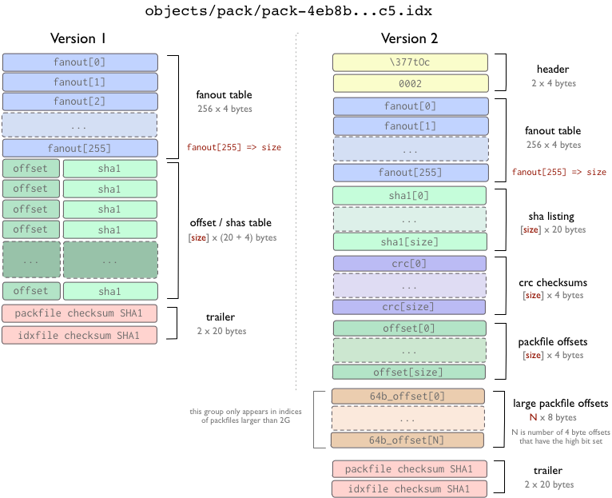
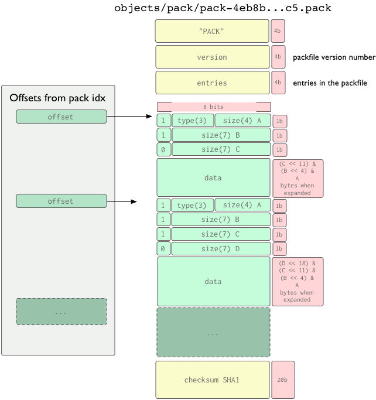
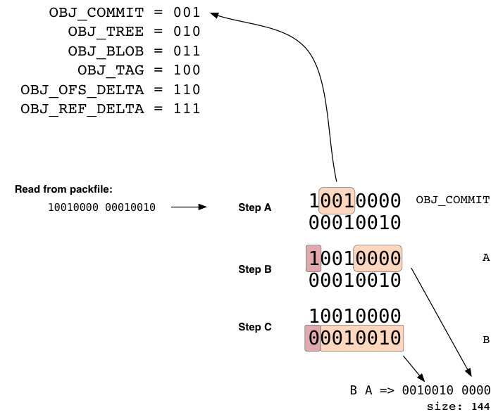

这一章会详细讲解 Git 如何物理存储各对象。

所有的对象都以 SHA 值为索引用 gzip 格式压缩存储, 每个对象都包含了对象类型, 大小和内容.

Git 中存在两种对象 - 松散对象(loose object)和打包对象(packed object)。

## 松散对象

松散对象是一种比较简单格式. 它就是磁盘上的一个存储压缩数据的文件. 每一个对象都被写入一个单独文件中.

如果你对象的 SHA 值是`ab04d884140f7b0cf8bbf86d6883869f16a46f65`, 那么对应的文件会被存储在:

```
      GIT_DIR/objects/ab/04d884140f7b0cf8bbf86d6883869f16a46f65

```

Git 使用 SHA 值的前两个字符作为子目录名字, 所以一个目录中永远不会包含过多的对象. 文件名则是余下的 38 个字符.

可以用下面的 Ruby 代码说明对象数据是如何存储的:

```
      def put_raw_object(content, type)
  size = content.length.to_s

  header = "#{type} #{size}\0" # type(space)size(null byte)
  store = header + content

  sha1 = Digest::SHA1.hexdigest(store)
  path = @git_dir + '/' + sha1[0...2] + '/' + sha1[2..40]

  if !File.exists?(path)
    content = Zlib::Deflate.deflate(store)

    FileUtils.mkdir_p(@directory+'/'+sha1[0...2])
    File.open(path, 'w') do |f|
      f.write content
    end
  end
  return sha1
end

```

## 打包对象

另外一种对象存储方式是使用打包文件(packfile). 由于 Git 把每个文件的每个版本都作为一个单独的对象, 它的效率可能会十分的低. 设想一下在一个数千行的文件中改动一行, Git 会把修改后的文件整个存储下来, 很浪费空间。

Git 使用打包文件(packfile)去节省空间. 在这个格式中, Git 只会保存第二个文件中改变了的部分, 然后用一个指针指向相似的那个文件(译注: 即第一个文件)。

对象通常是以松散格式写到磁盘上, 因为这个格式的访问代价比较低. 然后, 你最终会需要把对象存放到打包格式中去节省磁盘空间 - 这个工作可以通过[git gc](http://www.kernel.org/pub/software/scm/git/docs/git-gc.html)来完成. 它使用一个相当复杂的启发式算法去决定哪些文件是最相似的, 然后基于此分析去计算差异. 可以存在多个打包文件, 在必要情况下, 它们可被解包([git unpack-objects](http://www.kernel.org/pub/software/scm/git/docs/git-unpack-objects.html))成为松散对象或者重新打包([git repack](http://www.kernel.org/pub/software/scm/git/docs/git-repack.html)).

Git 会为每一个打包文件创建一个较小的索引文件. 索引文件中包含了对象在打包文件中的偏移, 以便于通过 SHA 值来快速找到特定的对象。

打包文件的实现细节会在稍后的"打包文件"(Packfile)一章中讲述。

我们可以使用 cat-file 命令去查询特定对象的信息. 注意下面只键入了 SHA 值的一部分, 不必把 40 个字符全部键入:

```
      $ git-cat-file -t 54196cc2
commit
$ git-cat-file commit 54196cc2
tree 92b8b694ffb1675e5975148e1121810081dbdffe
author J. Bruce Fields <bfields@puzzle.fieldses.org> 1143414668 -0500
committer J. Bruce Fields <bfields@puzzle.fieldses.org> 1143414668 -0500

initial commit

```

一个树(tree)对象可以引用一个或多个块(blob)对象, 每个块对象都对应一个文件. 更进一步, 树对象亦可以引用其他的树对象, 从而构成一个目录层次结构. 你可以使用 ls-tree 去查看树的内容:

```
      $ git ls-tree 92b8b694
100644 blob 3b18e512dba79e4c8300dd08aeb37f8e728b8dad    file.txt

```

我们可以看到树中包含了一个文件. SHA 值是文件内容的一个引用(译者注: 相当于指针指向对应的块对象).

```
      $ git cat-file -t 3b18e512
blob

```

一个"块"(blob)即是文件的数据, 我们可以用 cat-file 查看其内容:

```
      $ git cat-file blob 3b18e512
hello world

```

注意到文件中的数据是旧的. 初始树其实是第一次提交时记录的目录状态快照.

所有的对象都使用 SHA1 值作为索引存储在 git 目录之下:

```
      $ find .git/objects/
.git/objects/
.git/objects/pack
.git/objects/info
.git/objects/3b
.git/objects/3b/18e512dba79e4c8300dd08aeb37f8e728b8dad
.git/objects/92
.git/objects/92/b8b694ffb1675e5975148e1121810081dbdffe
.git/objects/54
.git/objects/54/196cc2703dc165cbd373a65a4dcf22d50ae7f7
.git/objects/a0
.git/objects/a0/423896973644771497bdc03eb99d5281615b51
.git/objects/d0
.git/objects/d0/492b368b66bdabf2ac1fd8c92b39d3db916e59
.git/objects/c4
.git/objects/c4/d59f390b9cfd4318117afde11d601c1085f241

```

这些文件的内容其实是压缩的数据外加一个标注类型和长度的头. 类型可以是块(blob), 树(tree), 提交(commit)或者标签(tag).

最容易找到提交是 HEAD 提交, 我们可以在.git/HEAD 中找到:

```
      $ cat .git/HEAD
ref: refs/heads/master

```

如你所见, 上面的输出告诉了我们现在在哪个分支之上工作. Git 通过创建.git 目录下的文件去标识分支(译注: 即 refs/heads 下面的文件, 多个分支会有多个文件). 每个文件中包含了一个提交的 SHA1 值, 我们可以用 cat-file 去查看此提交的内容(译注: 此提交即为该分支的头):

```
      $ cat .git/refs/heads/master
c4d59f390b9cfd4318117afde11d601c1085f241
$ git cat-file -t c4d59f39
commit
$ git cat-file commit c4d59f39
tree d0492b368b66bdabf2ac1fd8c92b39d3db916e59
parent 54196cc2703dc165cbd373a65a4dcf22d50ae7f7
author J. Bruce Fields <bfields@puzzle.fieldses.org> 1143418702 -0500
committer J. Bruce Fields <bfields@puzzle.fieldses.org> 1143418702 -0500

add emphasis

```

这里的树对象指向了这棵树的新状态:

```
      $ git ls-tree d0492b36
100644 blob a0423896973644771497bdc03eb99d5281615b51    file.txt
$ git cat-file blob a0423896
hello world!

```

父对象指向了前一个提交:

```
      $ git-cat-file commit 54196cc2
tree 92b8b694ffb1675e5975148e1121810081dbdffe
author J. Bruce Fields <bfields@puzzle.fieldses.org> 1143414668 -0500
committer J. Bruce Fields <bfields@puzzle.fieldses.org> 1143414668 -0500

```

分支(branch), 远程跟踪分支(remote-tracking branch)以及标签(tag)都是对提交的引用. 所有的引用是用"refs"开头, 以斜杠分割的路径. 到目前为此, 我们用到的引用名称其实是它们的简写版本:

```
      - 分支"test"是"refs/heads/test"的简写.
- 标签"v2.6.18"是"refs/tags/v2.6.18"的简写.
- "origin/master"是"refs/remotes/origin/master"的简写.

```

偶尔的情况下全名会比较有用, 例如你的标签和分支重名了, 你应该用全名去区分它们.

(新创建的引用会依据它们的名字存放在.git/refs 目录中. 然而, 为了提高效率, 它们也可能被打包到一个文件中, 参见[git pack-refs](http://www.kernel.org/pub/software/scm/git/docs/git-pack-refs.html)).

另一个有用的技巧是, 仓库的名字可以代表该仓库的 HEAD. 例如, "origin"是访问"origin"中的 HEAD 分支的一个捷径.

要了解 Git 查找引用路径的完全列表, 以及多个同名简写引用的优先级关系, 请参见[git rev-parse](http://www.kernel.org/pub/software/scm/git/docs/git-rev-parse.html)中的"SPECIFYING REVISIONS".

## 显示某分支特有的提交

假设你想要查看在"master"分支可达(reachable)但其他任何分支不可达的提交.

我们可以使用[git show-ref](http://www.kernel.org/pub/software/scm/git/docs/git-show-ref.html)列出仓库中所有的头:

```
      $ git show-ref --heads
bf62196b5e363d73353a9dcf094c59595f3153b7 refs/heads/core-tutorial
db768d5504c1bb46f63ee9d6e1772bd047e05bf9 refs/heads/maint
a07157ac624b2524a059a3414e99f6f44bebc1e7 refs/heads/master
24dbc180ea14dc1aebe09f14c8ecf32010690627 refs/heads/tutorial-2
1e87486ae06626c2f31eaa63d26fc0fd646c8af2 refs/heads/tutorial-fixes

```

我们可以使用 cut 和 grep 得到"分支-头"(branch-head)部分, 不需要"master":

```
      $ git show-ref --heads | cut -d' ' -f2 | grep -v '^refs/heads/master'
refs/heads/core-tutorial
refs/heads/maint
refs/heads/tutorial-2
refs/heads/tutorial-fixes

```

然后我们就可以查看 master 中特有的提交:

```
      $ gitk master --not $( git show-ref --heads | cut -d' ' -f2 |
                grep -v '^refs/heads/master' )

```

很明显上面的命令可以有无数种变种; 例如你想查看仓库中所有的分支可达但标签不可达的提交:

```
      $ gitk $( git show-ref --heads ) --not  $( git show-ref --tags )

```

([git rev-parse](http://www.kernel.org/pub/software/scm/git/docs/git-rev-parse.html)提供了像"--not"之类的"选择提交"语法的解释.)

(!!update-ref!!)

索引(index)是一个存放了排好序的路径的二进制文件(通常是.git/index), 每一个条目都附带有一个块对象的 SHA1 值以及访问权限;[git ls-files](http://www.kernel.org/pub/software/scm/git/docs/git-ls-files.html)可以显示出索引的内容:

```
      $ git ls-files --stage
100644 63c918c667fa005ff12ad89437f2fdc80926e21c 0   .gitignore
100644 5529b198e8d14decbe4ad99db3f7fb632de0439d 0   .mailmap
100644 6ff87c4664981e4397625791c8ea3bbb5f2279a3 0   COPYING
100644 a37b2152bd26be2c2289e1f57a292534a51a93c7 0   Documentation/.gitignore
100644 fbefe9a45b00a54b58d94d06eca48b03d40a50e0 0   Documentation/Makefile
...
100644 2511aef8d89ab52be5ec6a5e46236b4b6bcd07ea 0   xdiff/xtypes.h
100644 2ade97b2574a9f77e7ae4002a4e07a6a38e46d07 0   xdiff/xutils.c
100644 d5de8292e05e7c36c4b68857c1cf9855e3d2f70a 0   xdiff/xutils.h

```

请注意, 在一些旧的文档中, 索引可能被称为"当前目录缓存(current directory cache)"或者"缓存(cache)"。 它有三个重要的属性:

1.  索引存储了生成一个(独一无二的)树对象所需要的所有信息.

    例如, 运行[git commit](http://www.kernel.org/pub/software/scm/git/docs/git-commit.html)会从索引中生成一个树对象, 把这个树对象存储在对象数据库(object database)中, 然后把它与这个提交关联起来。 (译注: 回忆"查看 Git 对象"一章, 每一个提交都对应一个树对象.)

2.  索引使得对索引生成的树对象和工作树进行快速比较成为可能。

    索引通过存储每个对象的一些额外信息(比如说最后修改时间)来完成这个工作. 这些数据没有在上面显示出来, 也没有存储在创建出来的树对象中, 但是它们可以用于快速找出当时工作目录中的文件与索引的差异, 从而让 Git 不必将文件的内容全部读出。

3.  索引可以有效地表示树对象合并时的冲突信息, 使得每一个路径名都有足够的信息与树对象联系起来, 从而可以对它们进行三路合并。

    在合并期间, 索引可能存储一个文件的多个版本(称为"stages"). 上面[git ls-files](http://www.kernel.org/pub/software/scm/git/docs/git-ls-files.html)的第三栏输出就是 stage 号. 在出现合并冲突时, 这个号码会是其他值, 而不是 0。

因此索引实际上是一种暂存区域(temporary staging area), 它装载了你正在使用的树对象。

这一章将详细描述打包文件(packfile)和打包文件索引(packfile index)的格式。

## 打包文件索引

首先, 我们来看一下打包文件索引, 基本上它只是一系列指向打包文件内位置的书签。

打包文件索引有两个版本. 版本 1 的格式用于 Git 1.6 版本之前, 版本 2 的格式用于 Git 1.6 及以后的版本. 但是版本 2 可以被 Git 1.5.2 及以上的 Git 读取, 同时也被后向移植(backport)到了 1.4.4.5 版本。

版本 2 包含了每个对象的 CRC 校验值, 因此在重打包的过程中, 压缩过的对象可以直接进行包间拷贝(from pack to pack)而不用担心数据损坏. 版本 2 的打包文件索引同时亦支持大于 4G 的打包文件。



在两个版本格式中, fanout(展开)表用于更快地查找某特定的 SHA 值在索引文件中的位置. offset/sha1 表使用 SHA1 值进行排序(以便于对这个表进行二分搜索), fanout 表用一种特殊的方法指向 offset/sha1 表(因此后一个表中包含某一特定字节开头的所有 Hash 的那一部分可以被轻易找到, 而不必经过二分搜索的 8 次迭代)。

在第 1 版中, offset(偏移)和 SHA 值存在在同一位置. 但是在第 2 版中, SHA 值, CRC 值和 offset 被放在不同的表中. 两个版本的文件最后都是索引文件以及指向的打包文件的 CRC 校验值。

很重要的一点是, 要从打包文件中提取(extract)出一个对象, 索引文件 _ 不是 _ 必不可少的. 索引文件的作用是帮助用户 _ 快速地 _ 从打包文件中提取对象. 那些"上传打包"(upload-pack)和"取回打包"(receive-pack)程序(译注: 实现 push 和 fetch 协议的程序)使用打包文件格式(packfile format)去传输对象, 但是没有使用索引 - 索引可以在上传或者取回打包文件之后通过扫描打包文件重新建立。

## 打包文件格式

打包文件格式是很简单的. 它有一个头部(header)和一系列打包过的对象(每个都有自己的 header 和 body), 还有一个校验尾部(trailer). 前 4 个字节是字符串'PACK', 它用于确保你找到了打包文件的起始位置. 紧接着是 4 个字节的打包文件版本号, 之后的 4 个字节指出了此文件中入口(entry)的个数. 你可以用下面 Ruby 程序读出打包文件的头部:

```
      def read_pack_header
  sig = @session.recv(4)
  ver = @session.recv(4).unpack("N")[0]
  entries = @session.recv(4).unpack("N")[0]
  [sig, ver, entries]
end

```

头部之后是一系列按照 SHA 值排序的打包对象, 每一个打包对象包含了头部和内容. 打包文件的尾部是该文件中所有(已排序)SHA 值的 SHA1 校验值(20 字节长)(译注: 即按照排序好的顺序进行迭代 SHA1 运算)。



对象头部(object header)由 1 个或以上的字节按序组成, 它指出了后面所跟数据的类型及展开后的尺寸. 头部的每一个字节有 7 位用于数据, 第 1 位用于说明头部是否还有后续字节. 如果第 1 位是'1', 你需要再读入 1 个字节(译注: 即下一字节仍属于头部), 否则下一字节就是数据. 第一个字节的前 3 位指定了数据的类型, 具体含义参见下表。

(3 个位可以组合成为 8 个数. 在当前的使用中, 0(000)是'未定义', 5(101)目前未被使用.)

这里我们举一个由两个字节组成的头部的例子. 第 1 个字节的前 3 位说明了数据的类型是提交(commit), 余下的 4 位和第 2 个字节的 7 位组成的数字是 144, 说明数据展开后的长度是 144 字节。



值得注意的一点是, 对象头部中包含的'尺寸'不是后面跟着的数据的长度, 而是数据 _ 展开之后 _ 的长度. 因此, 打包索引文件中的偏移是很有用的, 有了它你不必展开每一个对象就可以得到下一个头部的起始位置。

对于非 delta 对象, 数据部分就只是 zlib 压缩后的数据流. 对于那两种 delta 对象, 数据部分包含了它所依赖的基对象(base object)以及用于重构对象的 delta(差异)数据. 数据的前 20 个字节称为`ref-delta`, 它是基对象 SHA 值的前 20 个字节. `ofs-delta`存储了基对象在同一打包文件中的偏移。 任何情况下, 有两个约束必须严格遵守:

*   delta 对象和基对象必须位于同一打包文件;

*   delta 对象和基对象的类型必须一致(即 tree 对 tree, blob 对 blob, 等等).

这一章我们会学习如何在更低的层次操作 Git, 以防你需要自己写一个新工具去人工生成 blob(块), tree(树)或者 commit(提交)对象. 如果你想使用更加底层的 Git 命令去写脚本, 你会需要用到以下的命令.

## 创建 blob 对象

在你的 Git 仓库中创建一个 blob 对象并且得到它的 SHA 值是很容易的, 使用[git hash-object](http://www.kernel.org/pub/software/scm/git/docs/git-hash-object.html)就足够了. 要使用一个现有的文件去创建新 blob, 使用'-w'选项去运行前面提到的命令('-w'选项告诉 Git 要生成 blob, 而不是仅仅计算 SHA 值).

```
      $ git hash-object -w myfile.txt
6ff87c4664981e4397625791c8ea3bbb5f2279a3

$ git hash-object -w myfile2.txt
3bb0e8592a41ae3185ee32266c860714980dbed7

```

标准输出中显示的值就是创建的 blob 的 SHA 值.

## 创建 tree 对象

假设你要使用你创建的一些对象去组建一棵树, 按照[git ls-tree](http://www.kernel.org/pub/software/scm/git/docs/git-ls-tree.html)的格式组织好输入, [git mktree](http://www.kernel.org/pub/software/scm/git/docs/git-mktree.html)就可以为你生成需要的 tree 对象. 例如, 如果你把下面的信息写入到'/tmp/tree.txt'中:

```
      100644 blob 6ff87c4664981e4397625791c8ea3bbb5f2279a3    file1
100644 blob 3bb0e8592a41ae3185ee32266c860714980dbed7    file2

```

然后通过管道把这些信息输入到[git mktree](http://www.kernel.org/pub/software/scm/git/docs/git-mktree.html)中, Git 会生成一个新的 tree 对象, 把它写入到对象数据库(object database)中, 然后返回 tree 对象的 SHA 值.

```
      $ cat /tmp/tree.txt | git mk-tree
f66a66ab6a7bfe86d52a66516ace212efa00fe1f

```

然后, 我们可以把刚才生成的 tree 作为另外一个 tree 的子目录, 等等等等. 如果我们需要创建一个带子树的树对象(这个子树就是前面生成的 tree 对象), 只需创建一个新文件(/tmp/newtree.txt), 把前面的 tree 对象的 SHA 值写入:

```
      100644 blob 6ff87c4664981e4397625791c8ea3bbb5f2279a3    file1-copy
040000 tree f66a66ab6a7bfe86d52a66516ace212efa00fe1f    our_files

```

然后再次调用[git mk-tree](http://www.kernel.org/pub/software/scm/git/docs/git-mk-tree.html):

```
      $ cat /tmp/newtree.txt | git mk-tree
5bac6559179bd543a024d6d187692343e2d8ae83

```

现在我们有了一个人工创建的目录结构:

```
      .
|-- file1-copy
`-- our_files
    |-- file1
    `-- file2

1 directory, 3 files

```

但是上面的结构并不在磁盘上存在. 另外, 我们使用 SHA 值去指向它(`5bac6559`).

## 重新组织树

我们也可以使用索引文件把树嵌入到新的结构中. 举个简单的例子, 我们使用一个临时索引文件创建一棵新的树, 其中包含了`5bac6559`这棵树的两个副本. (设置 GIT_INDEX_FILE 环境变量使之指向临时索引文件)

首先, 用[git read-tree](http://www.kernel.org/pub/software/scm/git/docs/git-read-tree.html)把树对象读入到临时索引文件中, 并给每个副本一个新的前缀; 然后再用[git write-tree](http://www.kernel.org/pub/software/scm/git/docs/git-write-tree.html)把索引中的内容生成一棵新的树:

```
      $ export GIT_INDEX_FILE=/tmp/index
$ git read-tree --prefix=copy1/  5bac6559
$ git read-tree --prefix=copy2/  5bac6559
$ git write-tree 
bb2fa6de7625322322382215d9ea78cfe76508c1

$>git ls-tree bb2fa
040000 tree 5bac6559179bd543a024d6d187692343e2d8ae83    copy1
040000 tree 5bac6559179bd543a024d6d187692343e2d8ae83    copy2

```

现在我们可以看到, 通过操纵索引文件可以得到一棵新的树. 你也可以在临时索引文件中做合并等操作 - 请参见[git read-tree](http://www.kernel.org/pub/software/scm/git/docs/git-read-tree.html)取得更多信息.

## 创建 commit 对象

现在我们有了一棵树的 SHA 值, 我们可以使用[git commit-tree](http://www.kernel.org/pub/software/scm/git/docs/git-commit-tree.html)命令创建一个指向它的 commit 对象. 大部分 commit 对象的数据都是通过环境变量来设定的, 你需要设置下面的环境变量:

```
      GIT_AUTHOR_NAME
GIT_AUTHOR_EMAIL
GIT_AUTHOR_DATE
GIT_COMMITTER_NAME
GIT_COMMITTER_EMAIL
GIT_COMMITTER_DATE

```

然后你把你的提交信息写入到一个文件中并且通过管道传送给[git commit-tree](http://www.kernel.org/pub/software/scm/git/docs/git-commit-tree.html), 即可得到一个 commit 对象.

```
      $ git commit-tree bb2fa < /tmp/message
a5f85ba5875917319471dfd98dfc636c1dc65650

```

如果你需要指定一个或多个父 commit 对象, 只需要使用'-p'参数一个一个指定父 commit 对象. 同样的, 新对象的 SHA 值通过 STDOUT 返回.

## 更新分支的引用

现在我得拿到了新的 commit 对象的 SHA 值, 如有需要, 我们可以使用一个分支指向它. 比如说我们需要更新'master'分支的引用, 使其指向刚刚创建的新对象, 我们可以使用[git update-ref](http://www.kernel.org/pub/software/scm/git/docs/git-update-ref.html)去完成这个工作:

```
      $ git update-ref refs/heads/master a5f85ba5875917319471dfd98dfc636c1dc65650

```

这里我们要看一下: Git 的客户端和服务器如何交互传输数据.

## 通过 HTTP 协议抓取

通过 http 协议的 url 进行的 git 数据抓取, 使用了一个比较傻瓜化(dumber)的协议.

使用 http 协议, 所有的逻辑计算(logic)都是在客户端进行. 服务器不需要特别的设置, 你只要把 git 目录放到一个可以访问的 web 目录即可.

为了能通过 http 访问, 当你的仓库有任何更新时, 需要运行一个命令: [git update-server-info](http://www.kernel.org/pub/software/scm/git/docs/git-update-server-info.html). 因为 web 服务器一般不允许执行列出目录中文件的操作, 所以[git update-server-info](http://www.kernel.org/pub/software/scm/git/docs/git-update-server-info.html)命令把可用的打包文件(packfile)和引用(refs)列表更新到“objects/info/packs","info/refs"这个两个文件中. 当 [git update-server-info](http://www.kernel.org/pub/software/scm/git/docs/git-update-server-info.html) 执行后,"objects/info/packs"文件看起来就会像下面一样:

```
      P pack-ce2bd34abc3d8ebc5922dc81b2e1f30bf17c10cc.pack
P pack-7ad5f5d05f5e20025898c95296fe4b9c861246d8.pack

```

如果在通过 http 协议拉取数据的过程中找不到松散文件(loose file), git 就会去尝试查找打包文件(packfiles). "info/refs" 文件的内容看起来就下面这样:

```
      184063c9b594f8968d61a686b2f6052779551613    refs/heads/development
32aae7aef7a412d62192f710f2130302997ec883    refs/heads/master

```

当你从这个仓库开始抓取(fetch)数据时, git 就会从这些引用(refs)开始遍历查找所有的提交对象(commit objects), 直到客户端得到了它所有需要的所有对象为止.

例如, 你要抓取到(fetch)服务器上的"master"分支; git 看到服务器上的"master"分支指向`32aae7ae`, 而你当前的"master"分支是指向`ab04d88`. 那么很明显, 你需要得到`32aae7ae`这个对象.

下面就是抓取时的交互过程(http 协议层):

```
      CONNECT http://myserver.com
GET /git/myproject.git/objects/32/aae7aef7a412d62192f710f2130302997ec883 - 200

```

然后返回信息看起来就像下面这样:

```
      tree aa176fb83a47d00386be237b450fb9dfb5be251a
parent bd71cad2d597d0f1827d4a3f67bb96a646f02889
author Scott Chacon <schacon@gmail.com> 1220463037 -0700
committer Scott Chacon <schacon@gmail.com> 1220463037 -0700

added chapters on private repo setup, scm migration, raw git

```

好的那么现在它就是开始抓取树对象(tree) `aa176fb8`: 译者注:`32aae7ae`提交对象(commit object)指向的树对象(tree)是:`aa176fb8`.

```
      GET /git/myproject.git/objects/aa/176fb83a47d00386be237b450fb9dfb5be251a - 200

```

下面这些是返回的树对象(tree)信息:

```
      100644 blob 6ff87c4664981e4397625791c8ea3bbb5f2279a3    COPYING
100644 blob 97b51a6d3685b093cfb345c9e79516e5099a13fb    README
100644 blob 9d1b23b8660817e4a74006f15fae86e2a508c573    Rakefile

```

很明显, 树对象(tree)里有 3 个文件(blob). 好的, 我们就把它们抓下来吧:

```
      GET /git/myproject.git/objects/6f/f87c4664981e4397625791c8ea3bbb5f2279a3 - 200
GET /git/myproject.git/objects/97/b51a6d3685b093cfb345c9e79516e5099a13fb - 200
GET /git/myproject.git/objects/9d/1b23b8660817e4a74006f15fae86e2a508c573 - 200

```

这些 http 下载操作实际上是由 curl 来完成的, 我们可以开多个并行的线程来加快下载速度. Git 遍历完提交对象(commit)所指向的树对象(tree)后, 就会开始抓取提交对象(commit)的父对象(next parent).

```
      GET /git/myproject.git/objects/bd/71cad2d597d0f1827d4a3f67bb96a646f02889 - 200

```

返回的父对象(parent commit object)信息就如下面所示:

```
      tree b4cc00cf8546edd4fcf29defc3aec14de53e6cf8
parent ab04d884140f7b0cf8bbf86d6883869f16a46f65
author Scott Chacon <schacon@gmail.com> 1220421161 -0700
committer Scott Chacon <schacon@gmail.com> 1220421161 -0700

added chapters on the packfile and how git stores objects

```

我们现在可以看到`ab04d88`是返回的对象(commit)的父对象, 而`ab04d88`(commit)就是我们当前的"master"分支. 那么我们只需要得到树对象(tree):`b4cc00c`就可以了, 因为之前的所以的提交(commit)我们都有了. 为了保险起见, 你也可以加上'--recover'参数, 强制 git 反复检查我们是否拥有所有的对象. 你可以点这里: [git http-fetch](http://www.kernel.org/pub/software/scm/git/docs/git-http-fetch.html) 查看更多信息:

如果有一个松散对象(loose object)下载失败了, git 会下载打包文件索引(packfile indexes), 通过它来查找对应的 sha 串值，然后再下载对应的打包文件(packfile).

你一定要在 git 服务器的仓库里添一个"post-receive"钩子(hook), 这个钩子(hook)会在仓库更新后执行'git update-server-info; 否则仓库的相关信息就得不到更新.

## 通过 Upload Pack 抓取数据

对于一个聪明的协议, 抓取对象的过程(fetching objects)应当更加高效. 不管是用通过 ssh 协议还是 git 协议(git:// 协议，在 9418 端口上运行), 当客户端和服务器建立了一个 socket 连接后，客户端开始运行:[git fetch-pack 命令, 和服务器创建(fork)的 linkgit:git update-pack](http://www.kernel.org/pub/software/scm/git/docs/git-fetch-pack%E5%91%BD%E4%BB%A4,%20%E5%92%8C%E6%9C%8D%E5%8A%A1%E5%99%A8%E5%88%9B%E5%BB%BA(fork)%E7%9A%84%20linkgit:git-update-pack.html)进行通讯.

服务器会告诉客户端它每个引用(ref)所有拥有的 SHA 串值, 而客户端会以它所需要的和所拥有 SHA 串值作为回应.

这里, 服务器会把客户端需要的所有对象打一个包(packfile), 然后再传送给客户端.

让我们来看一个例子.

客户端连接并且发送请求头(request header). 例如，克隆命令:

```
      $ git clone git://myserver.com/project.git

```

上面的命令会产生下面的请求:

```
      0032git-upload-pack /project.git\000host=myserver.com\000 

```

每行的最前面的 4 个字节表示此行的 16 进行制长度(hex length) (包括这个 4 个字节,但不包括换行符). 下面接着的是命令和参数, 这之后是一个 null 字节(#body00)和主机信息. 请求的结尾是以 null 字节(\000)结束的.

这个请求被服务器接收并且转换成对"git-upload-pack"的命令调用.

```
      $ git-upload-pack /path/to/repos/project.git

```

这条命令会马上返回仓库的信息:

```
      007c74730d410fcb6603ace96f1dc55ea6196122532d HEAD\000multi_ack thin-pack side-band side-band-64k ofs-delta shallow no-progress
003e7d1665144a3a975c05f1f43902ddaf084e784dbe refs/heads/debug
003d5a3f6be755bbb7deae50065988cbfa1ffa9ab68a refs/heads/dist
003e7e47fe2bd8d01d481f44d7af0531bd93d3b21c01 refs/heads/local
003f74730d410fcb6603ace96f1dc55ea6196122532d refs/heads/master
0000

```

每一行开始的头 4 个字节表示此行的长度(以 16 进制表示). 这块(section)信息以一行“0000”为结束标识符.

上面这些服务器产生的数据被发送回客户端. 然后客户端用另外一个请求做为响应:

```
      0054want 74730d410fcb6603ace96f1dc55ea6196122532d multi_ack side-band-64k ofs-delta

```

p 0032want 7d1665144a3a975c05f1f43902ddaf084e784dbe

```
      0032want 5a3f6be755bbb7deae50065988cbfa1ffa9ab68a
0032want 7e47fe2bd8d01d481f44d7af0531bd93d3b21c01
0032want 74730d410fcb6603ace96f1dc55ea6196122532d
00000009done

```

上面这些客户端的请求会被发送到的"git-upload-pack"进程, 这个进程会返回(streams out)最终的结果(final response):

```
      "0008NAK\n"
"0023\002Counting objects: 2797, done.\n"
"002b\002Compressing objects:   0% (1/1177)   \r"
"002c\002Compressing objects:   1% (12/1177)   \r"
"002c\002Compressing objects:   2% (24/1177)   \r"
"002c\002Compressing objects:   3% (36/1177)   \r"
"002c\002Compressing objects:   4% (48/1177)   \r"
"002c\002Compressing objects:   5% (59/1177)   \r"
"002c\002Compressing objects:   6% (71/1177)   \r"
"0053\002Compressing objects:   7% (83/1177)   \rCompressing objects:   8% (95/1177)   \r"
...
"005b\002Compressing objects: 100% (1177/1177)   \rCompressing objects: 100% (1177/1177), done.\n"
"2004\001PACK\000\000\000\002\000\000\n\355\225\017x\234\235\216K\n\302"...
"2005\001\360\204{\225\376\330\345]z2673"...
...
"0037\002Total 2797 (delta 1799), reused 2360 (delta 1529)\n"
...
"<\276\255L\273s\005\001w0006\001[0000"

```

你可以查看"打包文件"(packfile)这一章, 了解响应内容中的打包文件(packfile)的格式.

## 推送数据

通过 git 和 ssh 协议推送数据(pushing data)是相似的, 但是更简单. 基本上是, 客户端发出一个"receive-pack"的请求, 如果客户端有访问权限, 那么服务器就返回所有引用"头"的 SHA 串值(all ref head shas). 客户端收到响应后, 计算出服务器需要的所有数据或对象, 再做成一个打包文件(packfile)传送给服务器. 服务器收到后要么就把它们存储到硬盘上再建立索引, 要么只把它解压(如果里面的对象不多的话).

在这整个推送数据的过程中, 客户端通过 [git push](http://www.kernel.org/pub/software/scm/git/docs/git-push.html) 命令调用:[git sendpack](http://www.kernel.org/pub/software/scm/git/docs/git-sendpack.html)命令, 服务器端通过"ssh 连接进程"或是"git 服务器"来调用:linkgit:git-receive-pack 命令来完成整个操作.

我们把在 Git 里常用的一些名词做了解释列在这里。这些名词(terms)全部来自[Git Glossary](http://www.kernel.org/pub/software/scm/git/docs/gitglossary.html)。

*alternate object database*

> Via the alternates mechanism, a repository
> 
> ```
>         can inherit part of its object database
> from another object database, which is called "alternate". 
>       
> ```

*bare repository*

> A bare repository is normally an appropriately
> 
> ```
>         named directory with a `.git` suffix that does not
> have a locally checked-out copy of any of the files under
> revision control. That is, all of the `git`
> administrative and control files that would normally be present in the
> hidden `.git` sub-directory are directly present in the
> `repository.git` directory instead,
> and no other files are present and checked out. Usually publishers of
> public repositories make bare repositories available. 
>       
> ```

*祼仓库*

> ```
>         A bare repository is normally an appropriately
> named directory with a `.git` suffix that does not
> have a locally checked-out copy of any of the files under
> revision control. That is, all of the `git`
> administrative and control files that would normally be present in the
> hidden `.git` sub-directory are directly present in the
> `repository.git` directory instead,
> and no other files are present and checked out. Usually publishers of
> public repositories make bare repositories available. 
>       
> ```

*blob object（二进制对象）*

> 没有类型的数据对象。例如：一个文件的内容。

*branch*

> A "branch" is an active line of development. The most recent
> 
> ```
>         commit on a branch is referred to as the tip of
> that branch.  The tip of the branch is referenced by a branch
> head, which moves forward as additional development
> is done on the branch.  A single git
> repository can track an arbitrary number of
> branches, but your working tree is
> associated with just one of them (the "current" or "checked out"
> branch), and HEAD points to that branch. 
>       
> ```

*分支*

> ```
>         一个“分支”是开发过程中的(active line)。。。。 
>       
> ```

*cache（缓存）*

> 索引(index)的旧称(obsolete).

*chain（链表）*

> 一串对象，其中每个对象都有指向其后继对象的引用(reference to its successor)。例如：一个提交(commit)的后继对象就是它的父对象。

*changeset（修改集）*

> BitKeeper/cvsps 里对于提交(commit)的说法。但是 git 只存储快照(states)，不存储修改；所以这个词用在 git 里有点不大合适。

*checkout（签出）*

> ```
>         用对象仓库(object database)里的一个树对象(tree object)更新当前整个工作树(worktree)，或者一个二进制对象(blob object)更新工作树的一部分；如果工作树指向了一个新的分支，那么就会更新索引(index)和 HEAD。 
>       
> ```

*cherry-picking*

> In SCM jargon, "cherry pick" means to choose a subset of
> 
> ```
>         changes out of a series of changes (typically commits) and record them
> as a new series of changes on top of a different codebase. In GIT, this is
> performed by the "git cherry-pick" command to extract the change introduced
> by an existing commit and to record it based on the tip
> of the current branch as a new commit. 
>       
> ```

*cherry-picking*

> 在 SCM 的行话里，“cherry pick“ 意味着从一系列的修改中选出一部分修改(通常是提交)，应用到当前代码中。()

*clean（干净）*

> 如果一个工作树(working tree)中所有的修改都已提交到了当前分支里(current head)，那么就说它是干净的(clean)，反之它就是脏的(dirty)。

*commit*

> As a verb: The action of storing a new snapshot of the project's
> 
> ```
>         state in the git history, by creating a new commit representing the current
> state of the index and advancing HEAD
> to point at the new commit. 
>       
> ```

*commit（提交）*

> 作为名词：指向 git 历史的某一点的指针；整个项目的历史就由一组相互关联的提交组成的。提交(commit)在其它版本控制系统中也做"revision"或"version"。同时做为提交对象(commit object)的缩写。
> 
> 作为动词：创建一新的提交(commit)来表示当前索引(index)的状态的行为，把 HEAD 指向新创建的提交，这一系列把项目在某一时间上的快照(snapshot)保存在 git 历史中的操作。

*提交对象*

> 一个关于特定版本信息(particular revision)的对象。包括父对象名，提交者，作者，日期和存储了此版本内容的树对象名(tree object)。

*core git*

> Git 的基本数据结构和工具，它只对外提供简单的代码管理工具。

*DAG*

> 有向无环图。众多提交对象(commit objects)组成了一个有向无环图；因为它们都有直接父对象(direct parent)，且没有一条提交线路(chain)的起点和终点都是同一个对象。

*dangling object（悬空对象）*

> 一个甚至从其它不可达对象也不可达的对象(unreachable object)；仓库里的一个悬空对象没有任何引用(reference)或是对象(object)引用它。

*detached HEAD（分离的 HEAD）*

> 通常情况下 HEAD 里是存放当前分支的名字。然而 git 有时也允许你签出任意的一个提交(commit)，而不一定是某分支的最近的提交(the tip of any particular branch)；在这种情况下，HEAD 就是处于分离的状态(detached)。 译者注：这时`.git/HEAD`中存储的就是签出的提交的 SHA 串值。

*dircache*

> 请参见索引(index)。

*directory（目录）*

> 执行"ls"命令所显示的结果 :-)

*dirty（脏）*

> 一个工作树里有没有提交到当前分支里修改，那么我就说它是脏的(dirty)。

*ent*

> 某些人给树名(tree-ish)起的另外一个别名，这里`http://en.wikipedia.org/wiki/Ent_(Middle-earth)`有更详细的解释。最好不要使用这个名词，以免让大家糊涂。

*evil merge（坏的合并）*

> 如果一次合并引入一些不存在于任何父对象(parent)中的修改，那么就称它是一个坏的合并(evil merge)。

*fast forward*

> A fast-forward is a special type of merge where you have a
> 
> ```
>         revision and you are "merging" another
> branch's changes that happen to be a descendant of what
> you have. In such these cases, you do not make a new merge
> commit but instead just update to his
> revision. This will happen frequently on a
> tracking branch of a remote
> repository. 
>       
> ```

*快速向前*

> “fast-forward”是一种特殊的合并,()。 在这种情况下，并没有创建一个合并提交(merge commit)，只是更新了版本信息。 当本地分支是远端仓库(remote repository)的跟踪分支时，这种情况经常出现。

*fetch（抓取）*

> 抓取一个分支意味着：得到远端仓库(remote repository)分支的 head ref，找出本地对象数据库所缺少的对象，并把它们下载下来。你可以参考一下 [git fetch](http://www.kernel.org/pub/software/scm/git/docs/git-fetch.html)。

*file system（文件系统）*

> Linus Torvalds 最初设计 git 时，是把它设计成一个在用户空间(user space)运行的文件系统；也就是一个用来保存文件和目录的 infrastructure，这样就保证了 git 的速度和效率。

*git archive*

> 对玩架构的人来说，这就是仓库的同义词。

*grafts*

> Grafts enables two otherwise different lines of development to be joined
> 
> ```
>         together by recording fake ancestry information for commits. This way
> you can make git pretend the set of parents a commit has
> is different from what was recorded when the commit was
> created. Configured via the `.git/info/grafts` file. 
>       
> ```

*hash（哈希）*

> 在 git 里，这就是对象名(object name)的同义词。

*head*

> 指向一个分支最新提交的命名引用(named reference)。除非使用了打包引用(packed refs)，heads 一般存储在`$GIT_DIR/refs/heads/`。 参见: [git pack-refs](http://www.kernel.org/pub/software/scm/git/docs/git-pack-refs.html)

*HEAD*

> 当前分支。详细的讲是：你的工作树(working tree)通是从 HEAD 所指向的 tree 所派生的来的。 HEAD 必须是指向一个你仓库里的 head，除非你使用分离的 HEAD(detached HEAD)。

*head ref*

> head 的同义词。

*hook*

> During the normal execution of several git commands, call-outs are made
> 
> ```
>         to optional scripts that allow a developer to add functionality or
> checking. Typically, the hooks allow for a command to be pre-verified
> and potentially aborted, and allow for a post-notification after the
> operation is done. The hook scripts are found in the
> `$GIT_DIR/hooks/` directory, and are enabled by simply
> removing the `.sample` suffix from the filename. In earlier versions
> of git you had to make them executable. 
>       
> ```

*钩子*

> 在一些 git 命令的执行过程中, () 允许开发人员调用特别的脚本来添加功能或检查。
> 
> ```
>         () 
>       
> ```

```
      Typically，钩子允许对一个命令做 pre-verified 并且可以中止此命令的运行；同时也可在这个命令执行完后做后继的通知工作。这些钩子脚本放在`$GIT_DIR/hooks/`目录下，你只要把这它们文件名的`.sample`后缀删掉就可以了。不过在 git 的早期版本，你需要为这些钩子脚本加上可执行属性。 

```

*index*

> A collection of files with stat information, whose contents are stored
> 
> ```
>         as objects. The index is a stored version of your
> working tree. Truth be told, it can also contain a second, and even
> a third version of a working tree, which are used
> when merging. 
>       
> ```

*索引*

> 描述项目状态信息的文件，。索引里保存的是你的工作树的版本记录。()

*index entry*

> The information regarding a particular file, stored in the
> 
> ```
>         index. An index entry can be unmerged, if a
> merge was started, but not yet finished (i.e. if
> the index contains multiple versions of that file). 
>       
> ```

*索引条目*

*主分支 (master)*

> 默认的开发分支。当你创建了一个 git 仓库，一个叫"master"的分支就被创建并且成为当前活动分支(active branch)。在多数情况下，这个分支里就包含有本地的开发内容。

*merge*

> As a verb: To bring the contents of another
> 
> ```
>         branch (possibly from an external
> repository) into the current branch.  In the
> case where the merged-in branch is from a different repository,
> this is done by first fetching the remote branch
> and then merging the result into the current branch.  This
> combination of fetch and merge operations is called a
> pull.  Merging is performed by an automatic process
> that identifies changes made since the branches diverged, and
> then applies all those changes together.  In cases where changes
> conflict, manual intervention may be required to complete the
> merge. 
>       
> ```

*merge（合并）*

> 作为动词：把另外一个分支(也许来自另外一个仓库)的内容合并进当前的分支。()
> 
> 作为名词：除非合并的结果是 fast forward；那么一次成功的合并会创建一个新的提交(commit)来表示这次合并，并且把合并了的分支做为此提交(commit)的父对象。这个提交(commit)也可以表述为“合并提交”(merge commit)，或者就是"合并"(merge 名词)。

*object（对象）*

> Git 的存储单位，它以对象内容的 SHA1 值做为唯一对象名；因此对象内容是不能被修改的。

*object database（对象仓库）*

> 用来存储一组对象(objects)，每个对象通过对象名来区别。对象(objects)通常保存在 `$GIT_DIR/objects/`。

*object identifier（对象标识符）*

> 对象名(object name)的同义词。

*object name（对象名）*

> 一个对象的唯一标识符(unique identifier)。它是使用 SHA1 算法(Secure Hash Algorithm 1)给对象内容进行哈希(hash)计算，产生的一个 40 个字节长的 16 进制编码的串。

*object type（对象类型）*

> Git 有 4 种对象类型：提交(commit)，树(tree)，标签(tag)和二进制块(blob)。

*octopus（章鱼）*

> 一次多于两个分支的合并(merge)。也用来表示聪明的肉食动物。

*origin*

> 默认的上游仓库(upstream repository)。每个项目至少有一个它追踪(track)的上游(upstream)仓库，通常情况 origin 就是用来表示它。你可以用 ”｀git branch -r`“ 命令查看上游仓库(upstream repository)里所有的分支，再用 origin/name-of-upstream-branch 的名字来抓取(fetch)远程追踪分支里的内容。

*pack（包）*

> 一个文件，里面有一些压缩了的对象。(用以节约空间或是提高传输效率)。

*pack index（包索引）*

> 包(pack)里的一些标识符和其它相关信息，用于帮助 git 快速的访问包(pack)里面的对象。

*parent*

> A commit object contains a (possibly empty) list
> 
> ```
>         of the logical predecessor(s) in the line of development, i.e. its
> parents. 
>       
> ```

*父对象*

> 一个提交对象(commit object)，()。

*pickaxe*

> The term pickaxe refers to an option to the diffcore
> 
> ```
>         routines that help select changes that add or delete a given text
> string. With the `--pickaxe-all` option, it can be used to view the full
> changeset that introduced or removed, say, a
> particular line of text. See git diff. 
>       
> ```

*plumbing*

> core git 的别名(cute name)。

*porcelain*

> Cute name for programs and program suites depending on
> 
> ```
>         core git, presenting a high level access to
> core git. Porcelains expose more of a SCM
> interface than the plumbing. 
>       
> ```

*pull（拉）*

> 拉(pull)一个分支意味着，把它抓取(fetch)下来并合并(merge)进当前的分支。可以参考 [git pull](http://www.kernel.org/pub/software/scm/git/docs/git-pull.html).

*push*

> Pushing a branch means to get the branch's
> 
> ```
>         head ref from a remote repository,
> find out if it is a direct ancestor to the branch's local
> head ref, and in that case, putting all
> objects, which are reachable from the local
> head ref, and which are missing from the remote
> repository, into the remote
> object database, and updating the remote
> head ref. If the remote head is not an
> ancestor to the local head, the push fails. 
>       
> ```

*推*

> ()

*reachable*

> All of the ancestors of a given commit are said to be
> 
> ```
>         "reachable" from that commit. More
> generally, one object is reachable from
> another if we can reach the one from the other by a chain
> that follows tags to whatever they tag,
> commits to their parents or trees, and
> trees to the trees or blobs
> that they contain. 
>       
> ```
> 
> *可达的*

*rebase*

> 重新应用(reapply)当前点(branch)和另一个点(base)间的修改；并且根据 rebase 的结果重置当前分支的 head。 译者注：这个功能可以修改历史提交。

*ref（引用）*

> 一个 40 字节长的 SHA1 串或是表示某个对象的名字。它们可能存储在 `$GIT_DIR/refs/`。

*reflog*

> reflog 用以表示本地的 ref 的历史记录。从另外一角度也可以说，它能行告诉你这个仓库最近的第 3 个版本(revision)是什么，还可以告诉你昨天晚上 9 点 14 分时你是在这个仓库的哪个分支下工作。可以参见:[git reflog](http://www.kernel.org/pub/software/scm/git/docs/git-reflog.html)。

*refspec*

> "refspec"用于描述在抓取和推的过程中，远程 ref 和本地 ref 之间的映射关系。它用冒号连接：:，前面也可以加一个加号：“+“。 例如：`git fetch $URL refs/heads/master:refs/heads/origin` 意味着：从$URL 抓取主分支的 head 并把它保存到本地的 origin 分支的 head 中。`git push $URL refs/heads/master:refs/heads/to-upstream` 意味着：把我本地主分支 head 推到$URL 上的 to-upstream 分支里。具体可以参见： [git push](http://www.kernel.org/pub/software/scm/git/docs/git-push.html)。

*repository*

> A collection of refs together with an
> 
> ```
>         object database containing all objects
> which are reachable from the refs, possibly
> accompanied by meta data from one or more porcelains. A
> repository can share an object database with other repositories
> via alternates mechanism. 
>       
> ```

*resolve*

> 在自动合并失败后，手工修复合并冲突的行为。

*revision（版本）*

> 对象仓库(object database)保存的文件和目录在某一特定时间点的状态；它会被一个提交对象(commit object)所引用。

*rewind*

> 丢弃某一部分开发成果。例如：把 head 指向早期的版本。

*SCM*

> 源代码管理工作。

*SHA1*

> 对象名(object name)的同义词。

*shallow repository*

> A shallow repository has an incomplete
> 
> ```
>         history some of whose commits have parents cauterized away (in other
> words, git is told to pretend that these commits do not have the
> parents, even though they are recorded in the commit
> object). This is sometimes useful when you are interested only in the
> recent history of a project even though the real history recorded in the
> upstream is much larger. A shallow repository
> is created by giving the `--depth` option to git clone, and
> its history can be later deepened with git fetch. 
>       
> ```

*symref*

> Symbolic reference: instead of containing the SHA1
> 
> ```
>         id itself, it is of the format 'ref: refs/some/thing' and when
> referenced, it recursively dereferences to this reference.
> 'HEAD' is a prime example of a symref. Symbolic
> references are manipulated with the git symbolic-ref
> command. 
>       
> ```

*tag（标签）*

> 一个 ref 指向一个标签或提交对象。与 head 相反，标签并不会在一次提交操作后改变。标签(不是标签对象)存储在`$GIT_DIR/refs/tags/`。 一个标签通常是用来标识提交家族链(commit ancerstry chain)里的某一点。

*tag object（标签对象）*

> 一个含有指向其它对象的引用(ref)的对象，对象里包括注释消息。如果它里面可以含有一个 PGP 签名，那么就称为一个“签名标签对象”(signed tag object)。

*topic branch*

> A regular git branch that is used by a developer to
> 
> ```
>         identify a conceptual line of development. Since branches are very easy
> and inexpensive, it is often desirable to have several small branches
> that each contain very well defined concepts or small incremental yet
> related changes. 
>       
> ```

*tracking branch*

> A regular git branch that is used to follow changes from
> 
> ```
>         another repository. A tracking
> branch should not contain direct modifications or have local commits
> made to it. A tracking branch can usually be
> identified as the right-hand-side ref in a Pull: 
>       
> ```

```
      refspec. 

```

*追踪分支*

> 一个用以追踪(follow)另外一个仓库的修改的 git 分支。()

*tree（树）*

> 可以是一个工作树(working tree)，也可以是一个树对象(tree object)。

*tree object（树对象）*

> 包含有一串(list)文件名和模式(mode)，并且指向与之相关的二进制对象(blob object)和树对象(tree object)。一个树(tree)等价于一个目录。

*tree-ish（树名）*

> 一个指向的提交对象(commit object)，树对象(tree object)或是标签对象(tag object)的引用(ref)。

*unmerged index（未合并索引）*

> 一个索引中包含有未合并的索引条目(index entries)。

*unreachable object（不可达对象）*

> 从任何一个分支、标签或是其它引用(reference)做为起点都无法到达的一个对象。

*working tree（工作树）*

> 签出(checkout)用于编辑的文件目录树。 工作树一般等价于 HEAD 加本地没有提交的修改。