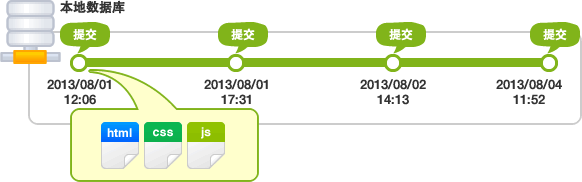
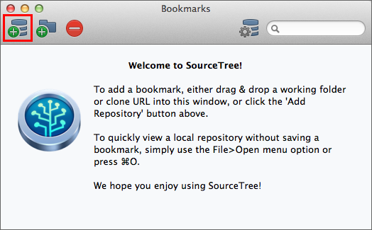
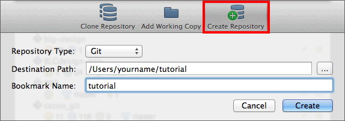
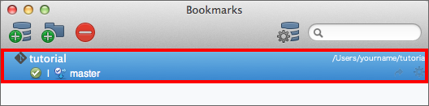
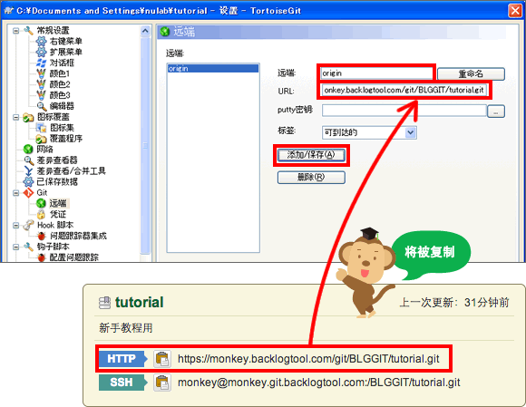
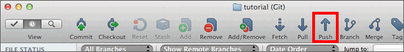

# 入门篇

# Git 的基础

# 首先

初次见面，请多多关照。我是生在博多，成长在 Git 社区的「猴子老师」。今天我们要来一起学习版本管理系统「Git」哦。

要把文档还原到编辑前的状态，大家都是怎么做的呢？

最简单的方法就是先备份编辑前的文档。使用这个方法时，我们通常都会在备份的文档名或目录名上添加编辑的日期。但是，每次编辑文档都要事先复制，这样非常麻烦，也很容易出错。


再加上，如果像上图那样毫无命名规则的话，就无法区分哪一个文档是最新的了。而且，如果是共享文件的话，应该加上编辑者的名字。还有，那些文档名字没有体现修改内容。

另外，如果两个人同时编辑某个共享文件，先进行编辑的人所做的修改内容会被覆盖，相信大家都有这样的经历。


Git 版本管理系统就是为了解决这些问题应运而生的。

## 使用 Git 进行版本管理

Git 是一个分布式版本管理系统，是为了更好地管理 Linux 内核开发而创立的。

Git 可以在任何时间点，把文档的状态作为更新记录保存起来。因此可以把编辑过的文档复原到以前的状态，也可以显示编辑前后的内容差异。

而且，编辑旧文件后，试图覆盖较新的文件的时候（即上传文件到服务器时），系统会发出警告，因此可以避免在无意中覆盖了他人的编辑内容。


用 Git 管理文件的话，更新的历史会保存在 Git，所以不需要备份文件啦。非常方便吧！

# 管理历史记录的数据库

数据库是记录文件或目录状态的地方，存储着内容修改的历史记录。在数据库的管理下，把文件和目录修改的历史记录放在对应的目录下。


## 远程数据库和本地数据库

首先，Git 的数据库分为远程数据库和本地数据库的两种。

*   远程数据库: 配有专用的服务器，为了多人共享而建立的数据库。
*   本地数据库: 为了方便用户个人使用，在自己的机器上配置的数据库。

数据库分为远程和本地两种。平时用手头上的机器在本地数据库上操作就可以了。如果想要公开在本地数据库中修改的内容，把内容上传到远程数据库就可以了。另外，通过远程数据库还可以取得其他人修改的内容。


## 创建数据库

创建本地数据库的方法有两种：一种是创建全新的数据库，另一种是复制远程数据库。


下一页将对提交进行说明哦！

# 修改记录的提交

若要把文件或目录的添加和变更保存到数据库，就需要进行提交。

执行提交后，数据库中会生成上次提交的状态与当前状态的差异记录（也被称为 revision）。

如下图，提交是以时间顺序排列状态被保存到数据库中的。凭借该提交和最新的文件状态，就可以知道过去的修改记录以及内容。



系统会根据修改的内容计算出没有重复的 40 位英文及数字来给提交命名。指定这个命名，就可以在数据库中找到对应的提交。

> Tips（小贴士 ）
> 
> 不同类别的修改 (如：Bug 修复和功能添加) 要尽量分开提交，以方便以后从历史记录里查找特定的修改内容。

执行提交时，系统会要求输入提交信息。请务必输入提交信息，因为在空白的状态下执行提交会失败的。

> Tips（小贴士 ）
> 
> 查看其他人提交的修改内容或自己的历史记录的时候，提交信息是需要用到的重要资料。所以请用心填写修改内容的提交信息，以方便别人理解。
> 以下是 Git 的标准注解：
> 
> 第 1 行：提交修改内容的摘要
> 第 2 行：空行
> 第 3 行以后：修改的理由
> 
> 请以这种格式填写提交信息。

# 工作树和索引

在 Git 管理下，大家实际操作的目录被称为工作树。

在数据库和工作树之间有索引，索引是为了向数据库提交作准备的区域。


Git 在执行提交的时候，不是直接将工作树的状态保存到数据库，而是将设置在中间索引区域的状态保存到数据库。因此，要提交文件，首先需要把文件加入到索引区域中。

所以，凭借中间的索引，可以避免工作树中不必要的文件提交，还可以将文件修改内容的一部分加入索引区域并提交。

下一页是上述内容的具体教程哦! 请安装 Git, 试试实操提交吧！

# 教程 1 Git 的基础

# 安装 Git

在安装之前，首先需要搭建使用 Git 的环境。您可以选择 Windows(GUI)、Mac(GUI)、或命令行(主控台)作为安装 Git 的环境。

下面将根据各个环境进行讲解。

如果您是开发人员或者习惯了使用命令行，可以试着用命令行来操作 Git。

## Windows

先介绍开放源代码的 Git 客户端“TortoiseGit”，然后再介绍可以把菜单等汉化的语言包。
[`code.google.com/p/tortoisegit/`](http://code.google.com/p/tortoisegit/)

> Tips
> 
> 要使用 TortoiseGit，首先要安装 msysgit。请从以下的网站下载并安装。
> [`msysgit.github.io/`](http://msysgit.github.io/)
> 
> 显示概要‘Full installer for official Git for Windows [版本号码]’的就是安装程序。请选择并下载最新的版本。

接着从下面的网站下载 TortoiseGit 的安装程序和语言包。请选择与您的 Windows OS 匹配的 32bit 或 64bit 的版本下载。


双击已下载的安装程序文件，然后在下一个画面点击 Next。


再点击 Next。


选择 TortoisePLink，然后点击 Next。


继续点击 Next。


点击 Install。


安装开始了。如果需要 Windows 用户认证，请点击“接受”，然后继续安装。


安装完毕，请点击 Finish 以退出。


接下来进行汉化。
请从 Language Packs 下载 Chinese (simplified), 并双击以启动安装，然后点击 Next。


安装开始了。如果需要 Windows 用户认证，请点击“接受”，然后继续安装。


安装完毕，请点击 Finish 以退出。


右击桌面的任意空白地方以显示右击菜单。菜单里会显示 Git 的选项，请选择 TortoiseGit > Settings。


将显示设定画面，请在 General 画面的 Language 里选择中文后点击 OK。


这样安装和汉化就完成了。

## Mac

下面链接的网页介绍免费的 SourceTree 客户端。
[`www.sourcetreeapp.com/`](http://www.sourcetreeapp.com/)

双击已下载的 dmg 文件，然后把 SourceTree 拖到 Applications。

这样就完成安装了。


## 命令行

若您选择命令行，请从 Git 网站下载 Git 的安装程序并安装。
[`git-scm.com/`](http://git-scm.com/)

> Note
> 
> 如果您使用 Mac，也可以使用套件管理工具 MacPorts 或 Homebrew 来安装。

### Windows

安装之后，从开始菜单 > 所有程序 > Git > Git Bash 启动程序。

### Mac

安装之后，启动 应用/设备中的终端。

请执行 version 命令，如果显示 Git 的版本就说明安装成功了。
请注意: 显示的文字会因所安装的系统或版本的不同而有所差异。

```
$ git --version
git version 1.7.7.5 (Apple Git-26)

```


# 初期设定

安装 Git 之后，请输入您的用户名和电子邮件地址。该设置操作在安装 Git 后进行一次就够了。这些信息将作为提交者信息显示在更新历史中。

## Windows

从右击菜单中选择 TorotiseGit > 设置


将显示设置的画面。请在 Git 的画面中输入您名字和电子邮件地址。


## Mac

启动已安装的 SourceTree，会出现设置向导。请在以下画面输入您的名字和电子邮件地址后点击“下一步”。


不需要在以下画面输入任何资料，请直接点击“下一步”。


不需要在以下画面输入任何资料，请直接点击“完成”。


## 命令行

Git 的设定被存放在用户本地目录的.gitconfig 档案里。虽然可以直接编辑配置文件，但在这个教程里我们使用 config 命令。

```
$ git config --global user.name "<用户名>"
$ git config --global user.email "<电子邮件>"

```

以下命令能让 Git 以彩色显示。

```
$ git config --global color.ui auto

```

您可以为 Git 命令设定别名。例如：把「checkout」缩略为「co」，然后就使用「co」来执行命令。

```
$ git config --global alias.co checkout

```

> Note
> 
> 如果在 Windows 使用命令行 (Git Bash), 含非 ASCII 字符的文件名会显示为 "\346\226\260\350\246..."。若设定如下，就可以让含非 ASCII 字符的文件名正确显示了。

```
$ git config --global core.quotepath off

```

若在 Windows 使用命令行，您只能输入 ASCII 字符。所以，如果您的提交信息包含非 ASCII 字符，请不要使用-m 选项，而要用外部编辑器输入。

外部编辑器必须能与字符编码 UTF-8 和换行码 LF 兼容。

```
git config --global core.editor "\"[使用编辑区的路径]\""

```

设置完成喽！在下一页创建数据库吧！

# 新建数据库

接下来要在本地新建数据库，创建一个名称为「tutorial」的空目录，并把它放在 Git 管理之下。

下面将以这个目录进行教程讲解。

## Mac

首先在任意一个地方创建 tutorial 目录。
然后启动 SourceTree。

点击收藏夹列表的左上角画面的 Add Repository，或从菜单栏选择 文件 > 新建



点击 Create Repository。
输入收藏夹的名称，这个名称跟设定在本地数据库的目录和 SourceTree 显示的名称要一致，再点击 Create。



然后在收藏夹列表里会显示刚添加的数据库。



## Windows

首先在任意一个地方创建 tutorial 目录。若要把 tutorial 目录放在 Git 的管理之下，请右击后从菜单中选择「Git 在这里创建版本库」。


接着会显示以下画面。不要勾选‘制作纯版本库’，请直接点击’确定‘。


若创建数据库成功，将显示以下画面。请点击‘OK’以关闭窗口。


tutorial 目录的图示显示如下。如果图示没有变化，请从右击菜单选择「刷新到最新的状态」。


## 命令行

首先在任意一个地方创建 tutorial 目录。然后使用 init 命令把该 tutorial 目录移动到本地 Git 数据库。

```
$ git init

```

按照以下步骤把新创建的 tutorial 目录设置到 Git 数据库。

```
$ mkdir tutorial
$ cd tutorial
$ git init
Initialized empty Git repository in /Users/yourname/Desktop/tutorial/.git/

```

接下来，把文件提交到这个数据库里吧！

# 提交文件

在 tutorial 目录新建一个文件，然后将文件添加到数据库。

首先在 tutorial 目录里新建一个名为「sample.txt」的文本文件，请在文件中输入以下的内容：

```
连猴子都懂的 Git 命令

```

## Mac

在 SourceTree 的收藏夹列表画面，双击先前添加的数据库，将显示 tutorial 数据库的操作画面。在已建立的数据库目录中，新建或者编辑过的文档会显示于左下角的工作树的文件一览中。

这里显示我们刚添加的 sample.txt 文件。

右击要添加到提交的文件，点击 Index。然后选中的文件会被移动到索引区域的文件列表中。


在这个状态下，点击工具栏的“提交”键，将显示以下画面。请输入提交信息后点击“Commit"。


如果提交成功，点击分支的 master 就会看到刚才的提交。


## Windows

打开 tutorial 目录，右击任意空白地方，然后从右击菜单选择‘Git 提交’。

显示以下画面后，请点选‘变更列表’里的 sample.txt，然后在日志信息方框中输入提交信息，再点击‘确定’键。


将显示以下进度条画面。如果显示成功，请点击‘关闭’键结束画面。


从右击菜单选择 TortoiseGit > 记录。您会看到刚才的提交已添加在历史记录里。我们成功提交文件啦！


## 命令行

请使用 status 命令确认工作树和索引的状态。

```
$ git status

```

执行 status 命令以确认 tutorial 目录的状态。

```
$ git status
# On branch master
#
# Initial commit
#
# Untracked files:
#   (use "git add ..." to include in what will be committed)
#
#     sample.txt
nothing added to commit but untracked files present (use "git add" to track)

```

从 status 响应我们可以看到‘sample.txt’目前不是历史记录对象。请首先把‘sample.txt’加入到索引，就可以追踪它的变更了。

将文件加入到索引，要使用 add 命令。在指定加入索引的文件。用空格分割可以指定多个文件。

```
$ git add ..

```

> Tips（小撇步 ）
> 
> 指定参数「.」，可以把所有的文件加入到索引。
> 
> ```
>         $ git add .
>       
> ```

现在，我们把 sample.txt 加入到索引然后确认一下。

```
$ git add sample.txt
$ git status
# On branch master
#
# Initial commit
#
# Changes to be committed:
#   (use "git rm --cached ..." to unstage)
#
#     new file:   sample.txt
#

```

既然 sample.txt 已加入到索引，我们就可以提交文件了。请执行如下显示的 commit 命令。

```
$ git commit -m ""

```

执行 commit 命令之后确认状态。

```
$ git commit -m "first commit"
[master (root-commit) 116a286] first commit
 0 files changed, 0 insertions(+), 0 deletions(-)
 create mode 100644 sample.txt

$ git status
# On branch master
nothing to commit (working directory clean)

```

从 status 响应我们可以看到没有新的变更要提交。

使用 log 命令，我们可以在数据库的提交记录看到新的提交。

```
$ git log
commit ac56e474afbbe1eab9ebce5b3ab48ac4c73ad60e
Author: eguchi 
Date:   Thu Jul 12 18:00:21 2012 +0900

    first commit

```

> Note
> 
> 安装 git 的同时会安装名为 gitk 的工具。使用这个工具，可以在 GUI 下确认提交记录。
> 
> ```
>         $ gitk
>       
> ```
> 
> 

接下来，为大家讲解共享数据库的方法。

# 共享数据库

# push 到远程数据库

前面我们为大家介绍了本地数据库的基本使用方法。下面，我们接着为大家讲解如何在远程数据库上共享本地数据库的修改记录。

## 推送

为了将本地数据库的修改记录共享到远程数据库，必须上传本地数据库中存储的修改记录。

为此，需要在 Git 执行推送(Push)操作。执行 Push 之后，本地的修改记录会被上传到远程数据库。所以远程数据库的修改记录就会和本地数据库的修改记录保持同步。


# 克隆远程数据库

## 克隆

进行克隆（Clone）操作就可以复制远程数据库。

执行克隆后，远程数据库的全部内容都会被下载。之后您在另一台机器的本地数据库上进行操作。

> Note
> 
> 克隆后的本地数据库的变更履历也会被复制，所以可以像原始的数据库一样进行查看记录或其他操作。

# 从远程数据库 pull

若是共享的远程数据库由多人同时作业，那么作业完毕后所有人都要把修改推送到远程数据库。然后，自己的本地数据库也需要更新其他人推送的变更内容。

## Pull

进行拉取(Pull) 操作就可以把远程数据库的内容更新到本地数据库。

进行拉取(Pull) 操作，就是从远程数据库下载最近的变更日志，并覆盖自己本地数据库的相关内容。


接下来就是新手教程哦！学习一下怎样使用贝格乐远程数据库来共享数据库吧！

# 教程 2 共享数据库

# 在贝格乐建立远程数据库

首先在贝格乐创建远程数据库。

> Tips
> 
> 在贝格乐，您的帐户需要具有管理员的权限才能创建 Git 数据库。如果您的帐户没有管理员的权限，可以委托有此权限的人来创建数据库。友情提示：您可以使用免费方案的贝格乐空间哟。
> 
> [从这里获取空间](http://backlogtool.com/cn/pricing/)

请登录到贝格乐，然后，从创建数据库的项目菜单中点击“Git”。如果您的空间还没有任何项目，请先创建一个项目。


如果页面没有显示“Git”标签，请先激活 Git 功能。“项目设置” > 在 “Git 设置”里激活 Git 功能。


激活 Git 功能后，在同一个 Git 设置页面中点击“增加 repository”。


请输入数据库的名字及其描述说明，然后点击“建立 repository”按钮。这里我们在名字栏输入了“tutorial”，在描述说明栏输入了“新手教程用”。


请看下图，我们成功地添加了新的数据库。


接下来就把修改推送到这个远程数据库吧！

# push 到远程数据库

## Windows

请右击“tutorial”目录，然后选择“推送”。


在以下画面点击‘管理’。


将出现以下画面，在"远端"输入"origin"，在"URL"输入上一页中生成的远程数据库的 URL，然后点击"添加/保存"。这样，"origin"将被添加到远程列表，然后点击"OK"。



> Tips
> 
> 执行推送或者拉取的时候，如果省略了远程数据库的名称，则默认使用名为”origin“的远程数据库。因此一般都会把远程数据库命名为 origin。

在“推送”画面的“远程”项目中，选择刚才追加的“origin”，点击“OK”按钮。

当被要求输入用户名，请使用您的贝格乐用户名。


当被要求输入密码，请使用您的贝格乐密码。


若下一个画面显示“成功”字样，就意味着您推送成功了。


请打开贝格乐的 Git 页面。在‘最近更新’处您会看到刚刚推送到远程数据库的项目。


被推送的文件已添加到数据库的文件列表中。


## Mac

启动 SourceTree（原始树），然后选择"tutorial"数据库。


点击数据库操作画面的工具栏右端的"设定"按钮。


画面显示如下，点击"添加"按钮。


请在 “远程名称” 栏输入“origin”，在 “URL/路径” 栏输入上个页面中创建的远程数据库的 URL，然后点击“OK”按钮。


由于需要认证，请输入您的贝格乐用户名和密码。


远程列表中已添加了刚才创建的“origin”。这样，推送到 Backlog 的资料库的准备工作就完成了。


> Tips
> 
> 请看，远程列表中已添加了刚才创建的“origin”。就这样，推送到贝格乐数据库的准备工作完成了。

接下来就试试 push 吧，请点击 tutorial 数据库操作画面工具栏的“推送”按钮。



马上出现以下对话框，请勾选“master”，然后点击“OK”按钮。


推送完成后，代表远程数据库的“origin/master”就会被添加到完成项目中。


请打开贝格乐的 Git 页面，我们看到系统已追加了最近更新的推送项目。


推送的文件已添加到远程数据库的文件列表中。


## 命令行

向远程数据库推送本地数据库的修改记录吧。

您可以给远程数据库取一个别名。这样，下次推送的时候就不需要输入长串的远程数据库地址了。在这个教程里，我们的远程数据库命名为“origin”。

请使用 remote 指令添加远程数据库。在处输入远程数据库名称，在处指定远程数据库的 URL。

```
$ git remote add 

```

通过运行以下指令，将创建于上一个页面的远程数据库的 URL 命名为“origin”。

```
$ git remote add origin _https://[your_space_id].backlogtool.com/git/[your_project_key]/tutorial.git_

```

> Tips
> 
> 执行推送或者拉取的时候，如果省略了远程数据库的名称，则默认使用名为”origin“的远程数据库。因此一般都会把远程数据库命名为 origin。

使用 push 命令向数据库推送更改内容。处输入目标地址，处指定推送的分支。我们将在高级篇详细地对分支进行说明。

```
$ git push  ...

```

运行以下命令便可向远程数据库‘origin’进行推送。当执行命令时，如果您指定了-u 选项，那么下一次推送时就可以省略分支名称了。但是，首次运行指令向空的远程数据库推送时，必须指定远程数据库名称和分支名称。

当被要求输入用户名和密码，请使用您的贝格乐用户名和密码。

```
$ git push -u origin master
Username: <用户名>
Password: <密码>
Counting objects: 3, done.
Writing objects: 100% (3/3), 245 bytes, done.
Total 3 (delta 0), reused 0 (delta 0)
To https://nulab.backlog.jp/git/BLG/tutorial.git
 * [new branch]      master -> master

```

请打开贝格乐的 Git 页面。在‘最近更新’处您会看到刚刚推送到远程数据库的项目。


已推送的文件已添加到远程数据库的文件列表中。


下次把这个远端仓库复制到本地吧！

# 克隆远程数据库

假设您是其中一位团队成员，把现有的远程数据库克隆到另一个目录( tutorial2 )。

## Mac

点击 SourceTree 的书签列表左上方的“Add Repository”按钮。或者，在菜单栏中点击“文件” >“新建”。

点击“Clone Repository" 按钮，再输入远程数据库的 URL 和要保存的本地数据库的目录，然后点击“Clone”。

这样就把上一页面中创建的数据库，以“tutorial2”的名称进行了克隆。

克隆的数据库已添加到书签列表。

## Windows

请双击桌面上的任意地方，然后从右击菜单中选择“Git 克隆”。

点击“Clone Repository" 按钮，再输入要克隆的远程数据库的 URL 和要保存的本地数据库的目录，然后点击“确定”。

这样就把上一页面中创建的数据库，以“tutorial2”的名称进行了克隆。

克隆将在以下画面开始进行。完成克隆后请点击“关闭”以退出画面。

已创建“tutorial2”目录。

## 命令行

使用 clone 指令可以复制数据库，在`<repository>`指定远程数据库的 URL，
在`<directory>`指定新目录的名称。

```
$ git clone <repository> <directory>

```

执行以下指令后，会在目录(tutorial2) 复制远程数据库。

```
$ git clone https://nulab.backlog.jp/git/BLG/tutorial.git tutorial2
Cloning into 'tutorial2'...
Username: <用户名>
Password: <密码>
remote: Counting objects: 3, done.
remote: Total 3 (delta 0), reused 0 (delta 0)
Unpacking objects: 100% (3/3), done.

```

若要验证克隆是否成功，请看在复制的目录“tutorial2”中的 sample.txt 是否含有以下文字。

```
连猴子都懂的 Git 命令

```

# 从克隆的数据库进行 push

## Windows

首先，在之前克隆的数据库目录里的 sample.txt 添加以下黑体字，并提交。

连猴子都懂的 Git 命令**add 把变更录入到索引中**

用 tutorial2 进行的操作
我们可以看到本地数据库分支的历史记录已更新，并位于远程数据库分支的前面。

用 tutorial2 进行的操作
接着，让我们推送新提交到远程数据库。请右击目录"tutorial2"并选择“推送”。

用 tutorial2 进行的操作
在以下画面点击“确定”。

用 tutorial2 进行的操作
推送将在以下画面开始进行。完成推送后请点击“关闭”以退出画面。

用 tutorial2 进行的操作
从右击菜单选择 TortoiseGit > 表示 log。现在"master" 和 "origin/master"在同一水平上，意味着远程数据库已完成更新，并且跟本地数据库同步。

## Mac

用 tutorial2 进行的操作
首先，在之前克隆数据库目录内的 sample.txt 中，添加并提交黑体字部分的内容。

连猴子都懂的 Git 命令
**add 把变更录入到索引中**

用 tutorial2 进行的操作
已更新本地数据库。

用 tutorial2 进行的操作
下面，推送这个提交。请点击工具栏中的“push”。

用 tutorial2 进行的操作
将显示下列画面，确认选中 master 后，点击“OK”按钮。

用 tutorial2 进行的操作
远程数据库的“origin/master”已更新完毕。

> Tips
> 
> 复习一下关于提交的位置吧。
> 
> *   **origin/master**
>     表示远程数据库“origin”的分支“master”的位置。
> *   **origin/HEAD**
>     表示远程数据库“origin”当前提交的位置。
>     通常，克隆本地数据库时指向与“origin/master”相同的位置。
> *   **master**
>     表示本地数据库分支“master”的位置。
> 
> 我们将在高级篇中对分支进行详细说明。

请打开贝格乐的 Git 页面，我们看到 push 的内容已被添加到“最近更新”处。

## 命令行

首先，在之前克隆的数据库目录里的 sample.txt 添加以下黑体字，并提交。

连猴子都懂的 Git 命令

```
add 把变更录入到索引中

$ git add sample.txt
$ git commit -m "添加 add 的说明"
[master 1ef5c8c] 添加 add 的说明
 1 files changed, 1 insertions(+), 1 deletions(-)

```

用 tutorial2 进行的操作
然后，推送此次变更，更新远程数据库。

当在克隆的数据库目录执行推送时，您可以省略数据库和分支名称。

```
$ git push
Username: <用户名>
Password: <密码>
Counting objects: 5, done.
Delta compression using up to 4 threads.
Compressing objects: 100% (2/2), done.
Writing objects: 100% (3/3), 351 bytes, done.
Total 3 (delta 0), reused 0 (delta 0)
To https://nulab.backlog.jp/git/BLG/tutorial.git
   486789c..1ef5c8c  master -> master

```

请打开贝格乐的 Git 页面。在‘最近更新’处您会看到刚刚推送的提交。


# 从远程数据库 pull

## Windows

我们把在上一页面中从“tutorial2”推送到远程数据库的内容拉取到数据库目录“tutorial”吧。

用 tutorial 进行的操作
右击 tutorial 目录，然后从右击菜单中选择’拉取‘，即可执行 pull 操作。

用 tutorial 进行的操作
在以下画面点击“确定”。

用 tutorial 进行的操作
pull 操作将在以下画面开始进行。完成 pull 后请点击“关闭”以退出画面。

用 tutorial 进行的操作
从右击菜单选择 TortoiseGit > 日志。现在"master" 和 "origin/master"在同一水平上，意味着本地数据库已完成更新。

## Mac

我们把在上一页面中从“tutorial2”推送到远程数据库的内容导入到“tutorial”吧。

用 tutorial 进行的操作
请点击工具栏中的“pull”，以执行 pull。

用 tutorial 进行的操作
请在这个画面直接点击“OK”。

用 tutorial 进行的操作
本地数据库中的 master 已更新到同远程数据库 origin/master 相同的位置。

## 命令行

我们把在上一页面中从“tutorial2”推送到远程数据库的内容拉取到数据库目录“tutorial”吧。

使用 pull 指令进行拉取操作。省略数据库名称的话，会在名为 origin 的数据库进行 pull。

```
$ git pull <repository> <refspec>...

```

用 tutorial 进行的操作
请执行以下指令。

```
$ git pull origin master
Username: <用户名>
Password: <密码>
From https://nulab.backlog.jp/git/BLG/tutorial
 * branch            master     -> FETCH_HEAD
Updating ac56e47..3da09c1
Fast-forward
 sample.txt |    1 +
 1 files changed, 1 insertions(+), 0 deletions(-)

```

sample.txt 文档的内容已更新。

用 tutorial 进行的操作
我们使用 log 指令来确认历史记录是否已更新。

```
$ git log
commit 3da09c1134a41f2bee854a413916e4ebcae7318d
Author: eguchi <eguchi@nulab.co.jp>
Date:   Thu Jul 12 18:02:45 2012 +0900

    添加 add 的说明

commit ac56e474afbbe1eab9ebce5b3ab48ac4c73ad60e
Author: eguchi <eguchi@nulab.co.jp>
Date:   Thu Jul 12 18:00:21 2012 +0900

    first commit

```

太好了，我们可以看到在“tutorial2”的更新内容“添加 add 的说明”已列在这个数据库历史记录里了。

用 tutorial 进行的操作
打开 sample.txt 文件来确认一下内容吧。

```
连猴子都懂的 Git 命令
add 把变更录入到索引中

```

我们可以看到新增内容“add 把变更录入到索引中”。

# 整合修改记录

# 合并修改记录

# 解决冲突

# 教程 3 整合修改记录

# push 冲突的状态

# 解决冲突