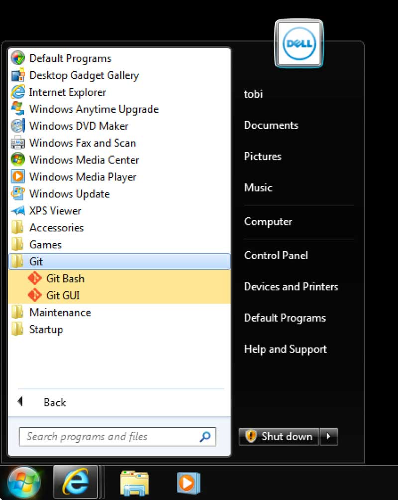
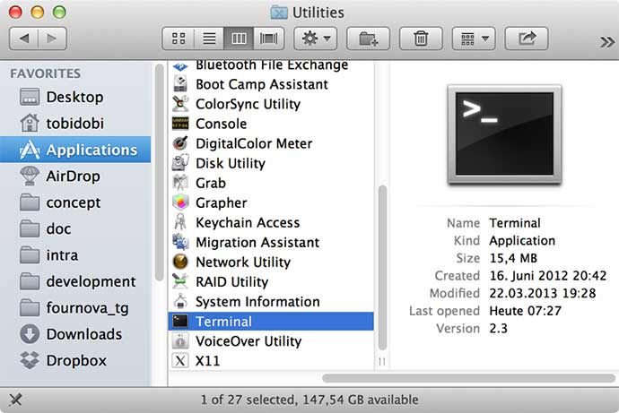
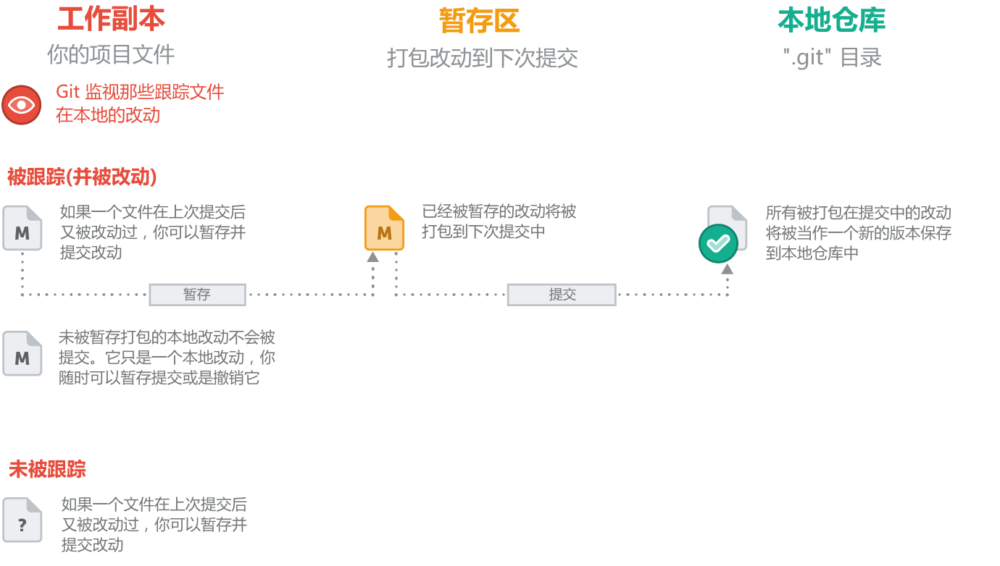

# Part 1 - 基础知识

# 什么是版本控制？

你可以把一个版本控制系统（缩写 VCS）理解为一个“数据库”，在需要的时候，它可以帮你完整地保存一个项目的快照。当你需要查看一个之前的快照（称之为“版本”）时，版本控制系统可以显示出当前版本与上一个版本之间的所有改动的细节。


版本控制与项目的种类，使用的技术和基础框架并无关系：

*   无论是设计开发一个 HTML 网站或者是一个苹果应用，它的工作原理都是一样的。
*   你可以选择任何你喜欢的工具来工作，它并不关心你用什么样的文本编辑器，绘图程序，文件管理器或其他工具。

因此不要混淆版本控制的备份系统和一般的部署系统。当你开始尝试在你的项目中使用版本控制，你不需要替换和改变开发过程中使用的那些常用工具。

版本控制系统会记录所有对项目文件的更改。这就是版本控制，听起来很简单。

# 为什么要使用版本控制系统？

在开发项目中使用版本控制系统有很多好处。本章节将向你介绍其中的一些细节。

## 协同合作

试想一下，如果没有版本控制系统，当你需要处理那些共享文件夹中的文件时，你必须告知办公室里的所有人，你正在对哪些文件进行编辑；与此同时，其他人必须要避免与操作相同的文件。这是一个不现实和完全错误的流程。当你花了很长时间完成你的编辑后，可能这些文件早已经被团队里的其他开发成员修改或者删除了。

如果使用了版本控制系统，每一个团队成员都可以在任何时间对任何文件毫无顾虑的进行修改，版本控制系统可以把之后所有的改动合并成一个共同的版本，不论是一个文件还是整个项目。这个共同的中心平台就是我们的版本控制系统。

使用版本控制还有更多优点，这就要取决于你自己或者你的开发团队了。

## 版本存储（正确地）

经常性地保存项目的改动是一个非常重要的习惯。但是如果没有版本控制系统这个操作将是非常困难的，并且非常容易出错的：

*   你到底改动了什么？仅仅是针对一些特定文件的改动还是整个项目？首先你必须及时并小心地审查整个项目的每一个可能的改动细节，然后你需要付出大量且并不必要的时间来整理它。
*   你如何命名这些版本？如果你是一个思维很有条理的人，你也许会定义一个比较容易理解的通用命名规则（比如这样 “acme-inc-redesign-2013-11-12-v23”）。然而一旦涉及到一个多样性的改变（比如：在一次版本改动中，一些改动了标题区而另一些却没有被改动它），仅仅通过名字是很难追踪和判断这些改动的。
*   最重要的问题可能就是你如何知道在第一个版本和第二个版本之间到底进行了哪些改动？只有很少人会真正地去花时间来仔细记录和观察每一个重要的变化，例如在项目文件夹的每一个 README 文件。

每一个版本控制系统仅仅对应一个项目。因此，在你的本地只存在一个版本，那就是这个项目的当前工作版本。除此之外，而其它所有之前的版本和改动都已经被有序地存储在版本控制系统中了。当你需要时，你可以随时来查看之前的任何一个版本，而且还可以得到整个项目的快照。

## 恢复之前的版本

要把一些文件恢复到上次改动之前的版本（甚至整个项目恢复到之前的版本）。这可能意味着你发现了一些严重的问题！如果你确定那些改动是错误的或者是没有必要的，那轻松的点几下你就可以简单地撤销它。在项目的每一个重要阶段，认识和正确地使用撤销这个功能会让你的工作变得非常轻松。

## 了解发生了什么

每当你提交一次对项目新的改动时，你的版本管理系统会要求你添加一个对这次改动的简短描述。除此之外（如果是一个代码或者文本文件），你还可以看到一个改动前和改动后的内容的详细对照。这样也可以帮助你很好地了解版本与版本之间的发展关系。

## 备份

备份是一个分布式版本控制系统（例如 Git）提供的非常好的附带功能。每一个团队成员都会在他的本地有一个完整的项目副本，包括整个项目的历史记录。如果你所依赖的服务器宕机了，或者是你的存储硬盘坏，所有你需要的恢复文件都可以在另外的团队成员的 Git 本地仓库中得到。

# 准备工作

## 命令行界面还是图形界面？

Git 提供两种主要的工作环境： “命令行界面” 或者一个 “GUI” 应用程序。使用哪一种界面都无所谓正确或错误。

在一方面，使用 GUI 应用程序会让你更有效和方便地使用一些复杂或者先进的功能。但这些复杂操作在命令行界面就显得过于复杂了。

在另一方面，我还是建议你首先来学习 Git 的命令，这样可以帮助你更进一步地了解一些重要的基础工作原理，而且不需要倚赖于任何一个图形界面的帮助。

##### 参考

如果你完全不懂那些命令行，我准备了 [“命令 101”](https://www.git-tower.com/learn/git/ebook/cn/command-line/appendix/command-line-101) 这个附录会提供给你一些最重要的基础知识。

当你已经具备了一定的基础知识后，你应该考虑一下使用一个具有图形界面的应用程序，使得你每一天的开发工作变得更轻松，更有效。 Windows 用户可能需要看看这个 [**Tortoise Git**](http://code.google.com/p/tortoisegit/)，而 Mac OS 的用户应该看看这个 [**Tower**](http://www.git-tower.com/?utm_source=learn-git&utm_medium=ebook-commandline&utm_campaign=learn-git)。你也会在这本书中找到一些图形界面应用程序的更为详细的介绍 (see "[Part 5: 工具与服务](https://www.git-tower.com/learn/git/ebook/cn/command-line/tools-services/desktop-guis)")。

## 在你的计算机上安装 Git

安装 Git 是非常简单的，并且面向 Mac 和 Windows 用户还提供了一键安装方式。

### 在 Windows 上安装 Git

在 Windows 电脑上 “msysgit” 是一个非常强大的 Git 工具包。你可以从下面给出的地址下载它： [msysgit.github.io](http://msysgit.github.io/)

双击安装文件，在安装的过程中你可以一直选择默认设置，一直点击继续直到安装结束。当安装完成后你就可以使用 “Git Bash” 这个应用开始工作了。你可以在 “Windows” 开始菜单里的 “Git”目录找到这个应用。



### 在 Mac OS 上安装

在 Mac OS X 中，你可以从下面的地址下载它，然后单击进行安装： [code.google.com/p/git-osx-installer/downloads/list?can=3](https://code.google.com/p/git-osx-installer/downloads/list?can=3)

一但安装结束，你可以通过 Mac 提供的 “Terminal.app” 应用直接打开它。你也可以在你的 "Applications" 目录中的子目录 "Utilities" 中找到这个应用：



## 设置 Git

在打开 Git 之前，你需要完成一些最基本的设置。例如你的用户名，你的邮箱地址以及在命令行界面中的一些重要的显示设置：

```
$ git config --global user.name "John Doe"
$ git config --global user.email "john@doe.org"
$ git config --global color.ui auto 
```

##### 注释

和其他的专业书籍一样，在这本书中 “$” 符号就代表着这是一个在命令行界面中的命令。（输入命令时你不需要键入这个符号！）。因此，任何时候你一旦看到一行以 “$” 符号开始的代码，这就表示它是一个在 “Terminal” or “Git Bash” 里能被执行的命令。

除此之外，我建议你把这个 [命令速查表](http://www.git-tower.com/blog/git-cheat-sheet-cn/) 放在你的桌面上。这样你就不需要把每一个命令都记在心里了。

# 版本控制的基本工作流程

在我们开始搞明白 Git 命令之前，你有必要先了解一下版本控制的基本流程。这本书会向你一步步地详细阐述各种不同的工作流程。但是首先还是让我们先来一起了解一下版本控制的最基本的流程。

版本控制中的最基本的模块就是 “仓库（Repository）”。

##### 名词解释

#### 仓库（Repository）

你可以把一个仓库想象成一个数据库，在那里你的版本控制系统存储了项目积攒的所有版本和元数据（metadata）。在 Git 中，仓库只是一个在你项目的根目录下名为 “.git” 的隐藏文件夹。你只要知道有这个文件夹存在就足够了。你没有必要也不需要去接触或是搞明白这个文件夹。

你有两种方法可以来获取一个本地仓库到你的计算机上：

*   (a) 如果在本地计算机中已经存在了一个项目，但是尚未纳入版本控制系统中，你可以为这个项目初始化一个新的仓库。
*   (b) 如果你需要得到一个已经纳入版本控制系统中的项目，而且它已经存放在一个远程服务器中 （比如在互联网或者是你的局域网中）。你只需要知道这个仓库的 URL 地址，然后克隆 （下载/拷贝） 到你的本地计算机中就可以了。

**(1)** 只要你有了一个本地仓库，你就可以在任何一个你常用的应用程序中 （例如：你最经常使用的编辑器，文件浏览器……） 开始你的工作了：修改、删除、添加、拷贝、重命名或者是移动文件。在这里你不须要考虑任何其它的事情，完成项目所要求的改动就行了。

**(2)** 当你已经确定完成了这次改动或者操作，你就需要开始来再次考虑版本控制了。因为是时候打包并提交你的这些改动了。

##### 名词解释

#### 提交（Commit）

一次提交包含了一组特定的变化。提交的作者必须为这个变化做一个简短的 "注释（commit message）"。这将有助于别人或者改动者本人在以后的时间里很好地了解和明白这次提交的意图，以及什么时间做了什么改动。

对于每组这样的更改，版本控制系统都会为你的项目缺省的创建一个新的版本。也就是说，会为每次提交创建一个单独的版本。这就是项目在这个特定时间点的快照（snapshot），版本控制系统会很有效的把这信息记录下来，而不是简单地对整个项目进行一次备份。并且提交也能非常准确的知道你的文件以及目录的状态和关系，并对它们进行有效的操作，例如：恢复项目到某些状态。

**(3)** 然而在提交之前，如果你需要一个到目前这个时间点的详细改动概况，那么在 Git 中，你可以使用 “status” 命令来得到一个与上一次提交对比之后的改动列表，比如哪些文件你做了改动，是否新建了一些新的文件，或者删除了一些已存在的文件。

**(4)** 下一步，你需要告诉 Git ，在本地项目中你想打包哪些被改动的文件到下次的提交中。一个文件被改动了之后，并不意味着它会被自动打包在下次提交中。相反，你必须明确地指出你需要打包哪些文件。这就是说你必须要把它们添加到所谓的 “暂存区（Staging Area）”。

**(5)** 现在，在暂存区（Staging Area）中已经存在了一些改动过的文件，现在是时间真正的提交它们了。但是在这之前你还必须为它添加一个既简短又明确的注释（commit message），用来描述这次改动到底做了什么。提交完成后本地仓库会被更新，然后为这个项目建立一个新的版本。

**(6)** 如果你想要查看一下整个项目的开发状况（特别是处于团队开发中），使用 "log" 命令就能看到按时间顺序列出的所有提交的改动。这时你就可以看到有哪些改动以及那些改动的一些细节，从而更好的帮助你了解你的项目的发展状况。

**(7)** 此外，当你处于团队协作开发时，你需要和其它的开发团队成员共享你的改动，同时也想了解其它成员所作的改动，这时一个在服务端的远程仓库（remote repository） 就可以用来进行这些数据交换。

##### 名词解释

#### 本地和远程仓库（Local & Remote Repositories）

两种不同的仓库类型：

*   "本地" 仓库（local repository） 是放置在你的本地计算机中的，它以一个隐藏文件夹的形式存储在项目的根目录（root folder） 中。你是唯一个有权通过提交改动来操作这个仓库的用户。
*   "远程" 仓库（remote" repository）则相反，它通常是位于一个远程服务器上的，比如在互联网上或在你的局域网络上。没有任何工作文件与远程仓库相关联：它没有工作目录（working directory），而是完全由 “.git”仓库目录组成的。开发团队使用远程仓库进行数据共享和交换，远程仓库是协作开发时的一个共同基础，每个项目成员都可以发布自己的改动，同样也都可以接收到其他成员的改动。

# 从一个未被纳入版本控制的项目开始

你现在正在着手在一个项目开发上，但是它还未被纳入版本控制系统的管理中，那就让我们从这个项目开始吧！在命令行界面中跳转到这个项目的根目录（root folder），然后键入 **“git init”** 命令来建立一个 Git 项目：

```
$ cd path/to/project/folder
$ git init 
```

现在我们来看看在这个目录下都有哪些文件（也包括所有的隐藏文件）：

```
$ ls -la 
```

你将会看到其中有一个新建的并且名字为 “.git” 的隐藏目录。为什么有这么一个新的目录呢？其实这是 Git 给我们创建的一个空的本地仓库（local repository）。为什么是　“空”　呢？开始时 Git 并不会自动地把当前项目中的所有的内容当作　“初始版本（initial version）”　添加到本地仓库中的，因此现在这个本地仓库还不包含任何你的项目文件。

##### 名词解释

#### 工作副本（Working Copy）

项目的根目录我们通常称之为 “工作副本” 或者叫做 “工作目录（working directory）”。这个文件夹包括项目所有的内容并且存放在你的本地计算机中。 你需要经常的询问版本控制系统来同步你的工作副本。一定要记住，在你的本地计算机中只存在**唯一一个**和项目版本所对应的工作副本，多重并行的工作副本是不被允许的。

## 忽略文件

通常情况下在很多项目或者开发平台中都会有一些你并不想要纳入版本控制系统的文件，例如在　Mac OS　中，哪些 “.DS_Store” 文件，它并不需要纳入版本控制中去。在其他的项目里，通常也会存在一些编译文件和临时的缓存文件。把它们纳入版本控制系统中其实是毫无意义的。因此当你使用版本控制时，你就必须决定哪些项目文件需要被纳入版本控制系统中，而哪些不需要。

##### 概念

#### 哪些文件不需要纳入版本控制中？

哪些文件需要被忽略呢？一个最简单分辨方法就是，那些在你开发项目过程中自动生成的文件。例如，临时文件，日志和缓存文件等等。 还有其他的例子，比如那些为编译代码所提供的密码或者个人设置文件。

下面这个连接：[github.com/github/gitignore](https://github.com/github/gitignore)　可以帮助你更好地了解在不同的项目和开发平台上哪些内容不需要纳入版本控制中去。

忽略文件列表被存放在项目根目录中一个被称之为　“.gitignore” 的文件中。在这里强烈的建议你，在做第一次提交之前，首先应该定义好这个忽略文件列表。因为一旦这些文件被提交了，要想再次把它们清除出版本控制系统就很麻烦。

现在，让我们使用你最常用的编辑器来建立一个空的文件，命名为“.gitignore”，然后保存在项目的根目录下。如果你是在 Mac OS 中，你就可以直接在这个文件中加上如下的内容：

```
.DS_Store 
```

如果还想忽略其它文件，很简单，在文件中为每一个需要忽略的内容添加一行。你也可以定义一个非常复杂的规则。 为了简单起见，在这个理列出一些在你定义忽略文件时最经常用到的例子：

*   **忽略一个特定的文件**：给出从项目根目录开始的路径和文件名，例如：path/to/file.ext 。
*   **忽略项目下所有这个名字的文件**：只要给出文件的全名，不要包括任何路径，例如 filename.ext 。
*   **忽略项目下所有这个类型的文件**：例如 *.ext 。
*   **忽略一个特定目录下的所用文件**：例如　path/to/folder/* 。

## 完成你的第一次提交

当你定义好了你的忽略规则后，现在是时间来为你的项目进行第一次提交了。在本书之后的章节里我们将继续深入细致地探讨提交的工作原理和详细流程。就现在而言，只须要执行如下的命令就可以了：

```
$ git add -A
$ git commit -m "Initial commit" 
```

# 从一个已被纳入版本控制的项目开始

如果你要得到一个存放在远程服务器中的并且已经被纳入版本控制系统中的项目，你只需要给出项目远程仓库（remote repository） 的 URL 地址。这个 URL 可能采用如下形式：

*   ssh://user@server/git-repo.git
*   user@server:git-repo.git
*   [`example.com/git-repo.git`](http://example.com/git-repo.git)
*   [`example.com/git-repo.git`](https://example.com/git-repo.git)
*   git://example.com/git-repo.git

URL 的形式并不重要，你只需要在命令行界面中键入 “git clone” 命令和 URL。当然，你必须明确知道你要下载到你本地计算机的那个位置，首先跳转到这个目录中：

```
$ cd your/development/folder/
$ git clone https://github.com/gittower/git-crash-course.git 
```

##### 注释

你不需要自己去准备一个远程仓库，也无需把它克隆到你的本地计算机上，使用上面给出的远程仓库的 URL 就可以了。在本书接下来的部分将会使用这个仓库 （repository） 作为例子。

接下来 Git 将会完整地克隆这个仓库到你的本地计算机上，克隆完成后你就可以访问这个仓库了。

*   对于　“http” and “git” 协议，你不需要任何权限。
*   对于　“https” URLs，你可能需要输入用户名以及密码。
*   对于　“ssh” URLs （无论是以 “ssh://” 开头的或者是一个简易格式，“user@server...”），你必须要通过一个 “SSH 公钥（SSH Public Key）” 的认证。虽然它需要你做一点点额外的设置工作，但是这是一个被广泛使用的安全有效的模式。在本书稍后的章节中会专门来介绍这个方面的详细内容。“[使用 SSH 公钥验证](https://www.git-tower.com/learn/git/ebook/cn/command-line/advanced-topics/ssh-public-keys)”

# 工作在你的项目上

无论是建立一个全新的本地仓库（local repository）或是克隆一个远程仓库（remote repository）到本地计算机，这两者并没有多大的区别。现在在你的计算机上已经拥有了一个 Git 本地仓库了。这也就意味着你可以在这个项目上开始你的工作了，使用任何一个你常用的编辑器来完成对项目文件的修改、创建、删除、移动、拷贝或者是重命名。

##### 概念

#### 文件的状态

一般情况下在 Git 中文件有两种状态：

*   **未被追踪的文件（untracked）**： 如果这个文件还未被纳入版本控制系统中，我们称之为“未被追踪的文件”。这就表示版本控制系统不能监视或者追踪它的改动。一般情况下未被追踪的文件会是那些新建的文件，或者是那些没有被纳入版本控制系统中的忽略文件。
*   **已追踪的文件（tracked）**： 所有那些已经被纳入版本控制系统的项目文件我们称之为“已被追踪的文件”。 Git 会监视它的任何改动，并且你可以提交或放弃对它修改。

## 暂存区（Staging Area）

当你完成了对项目文件的改动后，你想要保存这个改动到你的项目中去。换句话说，你想要提交你在这些已追踪文件 （tracked files）上的改动。

##### 黄金法则

#### #1: 一次提交只对映一个相关的改动

当你想要进行提交时，非常重要的一点就是，它只能包含一个相关的改动。也就是说，不要在一次提交中包含一些和提交目的无关的改动，每一种不同的改动要打包在不同的提交中。比如，在一次提交中既添加了一个新的功能（例如：用户注册功能），又包括了对一些错误的修复（例如：修复了 Bug#122）：

*   理解这些复杂的提交对于开发团队里的其他成员来说是非常困难的。可能过了一段时间连你自己也糊涂了。你的队友不得不先要搞明白这个错误，弄清楚你为什么要同时修复它，之后才能试图了解这个新添加的用户注册功能。
*   不可能复原或者撤销其中一个改动。试想一下，那个新添加的用户注册功能可能存在很严重的错误，你想撤销它但是你又不想撤销那个修复错误的改动。你该怎么办呢？

也就是说，一次提交一定要包括一个且仅仅只能包括一个和提交目的相对映的改动：修复两个错误（最起码的）你要进行两次不同的提交。或者当开发一个新的非常庞大的功能时，你必须要把它分成几个小的并且在逻辑上有意义的提交，这样做可以有效地减少产生错误的可能性。 这种小的提交可以让开发团队的其他成员更好地理解这个改动。一旦发现这个改动有问题，就可以非常简单地撤销，而不会影响到其它的功能。

然而，当你专注于在你的项目开发中时，你不可能保证你的每次改动都只对应一个目的，因为你总是在多个方面同时工作的。

这就须要引入一个新的概念 “暂存区（Staging Area）”，这是一个 Git 中最强大的功能，而且也非常好用。它可以让你来确定哪些修改将被打包在下次提交中。因为在 Git 中并不是简单的把每一个改动后的文件都自动打包起来的。相反，每一次提交打包都要 “手动完成”，哪些改动需要被打包在下次提交中都需要你自己决定，是否需要 “添加到暂存区域” 或者简单的说 “被暂存”。



## 得到所有的改动的详情

让我们来看看到目前为止都已经完成了什么。为了得到你在上一次提交后的所有改动详情，你可以简单地使用这个命令 “git status”：

```
$ git status
# On branch master
# Changes not staged for commit:
#   (use "git add/rm <file>... " to update what will be committed)
#   (use "git checkout -- <file>..." to discard changes in working
#    directory)
#
#       modified:   css/about.css
#       modified:   css/general.css
#       deleted:    error.html
#       modified:   imprint.html
#       modified:   index.html
#
# Untracked files:
#    (use "git add <file>..." to include in what will be committed)
#       new-page.html
no changes added to commit (use "git add" and/or "git commit -a") 
```

值得庆幸的是，Git 给我们提供了一个相当详细的总结，其中包括了三个主类别：

*   “Changes not staged for commit” 改动的文件，但没有打包在下次提交中。
*   “Changes to be committed” 改动的文件，并且已打包在下次提交中。
*   “Untracked files” 未被追踪的文件。

## 准备开始提交

现在是时候来提交那些改动到暂存区（Staging Area）里去了，使用 “git add” 命令：

```
$ git add new-page.html index.html css/* 
```

以上命名表示，我们添加一个新的文件　“new-page.html”，并且提交对文件　“index.html”　和在目录　“css”　下所有的改动到暂存区。如果我们想把文件　“error.html”　从版本控制中移除掉，我们必须使用　“git rm”　来完成它：

```
$ git rm error.html 
```

让我们再次使用 “git status” 命令来查看一下详情列表：

```
$ git status
# On branch master
# Changes to be committed:
#   (use "git reset HEAD <file>..." to unstage)
#
#       modified:   css/about.css
#       modified:   css/general.css
#       deleted:    error.html
#       modified:   index.html
#       new file:   new-page.html
#
# Changes not staged for commit:
#   (use "git add <file>..." to update what will be committed)
#   (use "git checkout -- <file>..." to discard changes in working 
#    directory)
#
#       modified:   imprint.html
# 
```

假设对文件 “imprint.html” 的改动和其他的改动没有任何联系，我们有意地不把这个文件添加到暂存区域中，那就表示，它不会被打包在下次提交中。对它来说现在仅仅是一个本地修改。我们可以继续对它进行工作，可能在以后的某个时间再去提交它。

## 提交你的工作

有了精心准备好的暂存区后，在提交之前还剩下一件事，那就是注释这次提交。

##### 黄金法则

#### #2: 高质量的提交注释

花一点时间写一个好的提交注释是非常值得的，这样可以让开发团队的其他成员非常容易地明白你做这次提交的目的和你的改动（过了一段时间对你自己也有帮助）。 针对你的改动写一个简短的注释标题（原则上不要超过 50 个字符），然后使用一个空行来分隔注释的内容。注释的内容要尽可能的详细并且要能回答以下几个问题：为什么要做这次修改？与上一个版本相比你到底改动了什么？

“git commit” 命令将提交你的修改：

```
$ git commit -m "Implement the new login box" 
```

如果你有一个很长的提交注释，并且注释中包含很多段落，那你就不需要使用 “-m” 参数了，Git 会为你打开一个文本编辑器（具体打开哪个文本编辑器，你可以在 “core.editor” 设置它）。

##### 概念

#### 什么才是一个好的提交

一个高质量的手动提交对你的项目和你自己是非常有意义的。什么才是一个好的提交呢？在这里有一些基本的原则：

1.  提交要仅仅对应一个相关的改动 首先，一次提交应该仅仅只对应一个相关的改动。不要把那些互相毫无关联的改动打包在同一次提交中。如果这次提交出现了什么问题，解决和撤销它将是非常困难的。
2.  完整的提交 千万不要提交那些没有完全完成的改动。如果你想要临时保存一下你当前的工作，例如一个类似于剪贴板 （clipboard） 的功能，你可以使用 Git 提供的 “Stash” 功能（这个功能我们将在本书之后的章节为大家介绍）。但是一定不要直接提交它。
3.  提交前测试 当你提交你的改动时，不要理所当然地认为你的改动永远正确。在你提交你的改动到你的仓库前，进行有效的测试是非常重要的。
4.  高质量的提交注释 一次高质量的提交需要一个好注释。请参考本章之前的章节 “高质量的提交注释”。

最后，你须要养成一个**频繁地**进行提交的习惯。这样做将自然而然的让你避免一个很庞大的提交，并且使这些提交可以更好只对映一个相关的改动。

## 检查的提交历史

Git 会记录对项目改动的所有提交。特别是当与其他团队开发人员协同开发时。及时地查看那些最新的提交并理解它是非常重要的。

##### 注释

在本书之后的章节 “[通过远程仓库共享工作](https://www.git-tower.com/learn/git/ebook/cn/command-line/remote-repositories)”，我们将向你详细介绍如何同团队的其他开发人员进行数据交换。

显示在项目中所有的提交历史记录可以使用 “git log” 命令：

```
$ git log 
```

所有在这个项目中的提交将按时间顺序显示出来，最新的提交会出现在最上面。如果说所有的提交历史记录不能完全显示在一个屏幕中，在命名行界面的最下方会显示一个冒号 （“:”）。这时你可以使用空格键来跳转到下一页，或是使用 “q” 键退出这个界面。

```
commit 2dfe283e6c81ca48d6edc1574b1f2d4d84ae7fa1
Author: Tobias Günther <support@learn-git.com>
Date: Fri Jul 26 10:52:04 2013 +0200

    Implement the new login box

commit 2b504bee4083a20e0ef1e037eea0bd913a4d56b6
Author: Tobias Günther <support@learn-git.com>
Date: Fri Jul 26 10:05:48 2013 +0200

    Change headlines for about and imprint

commit 0023cdddf42d916bd7e3d0a279c1f36bfc8a051b
Author: Tobias Günther <support@learn-git.com>
Date: Fri Jul 26 10:04:16 2013 +0200

    Add simple robots.txt 
```

每个提交记录都包括（除其他事项外）如下的元数据（metadata）：

*   Commit Hash
*   Author Name & Email （提交人的姓名和电子邮箱）
*   Date （日期）
*   Commit Message （提交注释）

##### 名词解释

#### The Commit Hash

每一个提交都拥有一个唯一的 ID ：这个 40 位字符的校验码我们称之为 “commit hash”。在那些集中式的版本控制系统中（例如： Subversion， CVS...）会使用一个依次递加的版本号码。这样虽然简单，但是它却不能被使用在 Git 这样的分布式版本控制系统中。原因就是在于，在 Git 中每个人的工作都是并行的，改动的 **提交** 都是 **离线的** ，也就是说提交时并不需要连接到远程仓库。在这种情况下，远程仓库就不能确定哪个是第 5 次提交， 而哪个是在它之后的第 6 次提交。

在大多数项目中，这个哈希编码的前七位字符就已经能足够代表一个唯一的提交 ID 了，一般我们都会用这个简短的 7 位 ID 来代表一个提交。

除了这些元数据（metadata），Git 也可以显示出提交的更详细的内容。在 “git log” 命令后使用 “-p” 参数来显示一些更多的提交记录详情：

```
$ git log -p
commit 2dfe283e6c81ca48d6edc1574b1f2d4d84ae7fa1
Author: Tobias Günther <support@learn-git.com>
Date: Fri Jul 26 10:52:04 2013 +0200

    Implement the new login box

diff --git a/css/about.css b/css/about.css
index e69de29..4b5800f 100644
--- a/css/about.css
+++ b/css/about.css
@@ -0,0 +1,2 @@
+h1 {
+  line-height:30px; }
\ No newline at end of file
di.ff --git a/css/general.css b/css/general.css
index a3b8935..d472b7f 100644
--- a/css/general.css
+++ b/css/general.css
@@ -21,7 +21,8 @@ body {

 h1, h2, h3, h4, h5 {
   color:#ffd84c;
-  font-family: "Trebuchet MS", "Trebuchet"; }
+  font-family: "Trebuchet MS", "Trebuchet";
+  margin-bottom:0px; }

 p {
   margin-bottom:6px;}
diff --git a/error.html b/error.html
deleted file mode 100644
index 78alc33..0000000
--- a/error.html
+++ /dev/null
@@ -1,43 +0,0 @@
- <html>
- 
-   <head>
-     <title>Tower :: Imprint</title>
-     <link rel="shortcut icon" href="img/favicon.ico" />
-     <link type="text/css" href="css/general.css" />
-   </head>
- 
```

在本书之后的章节 "[使用 diffs 检查改动的详情](https://www.git-tower.com/learn/git/ebook/cn/command-line/advanced-topics/diffs)", 我们将会来一起学习这些输出内容的具体含义。

## 值得庆祝的时刻

祝贺你！你刚刚掌握了 Git 版本控制系统中的最基本步骤！休息一下，在我们开始下一步的学习之前先来干杯啤酒。