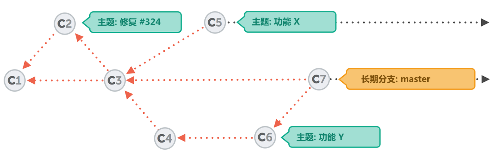

# Part 2 - 分支与合并

# 分支可以改变你的生命

这个标题的确有点让人震撼，不过，至少我是这样认为的。事实上这并不夸张，有效地使用分支功能（branching）真的可以帮助你改善每一天的工作，让你成为一个更专业的程序员或者设计师。

首先，如果你已经拥有了一些在其他版本控制系统上的使用经验，那么我诚恳地请求你忘记那些你以前对分支（branching）和合并（merging）的认识。其实， Git 并没有做出什么新的发明，和其他很多版本控制系统一样都使用了分支这个理念。然而， Git 的分支概念在这个领域中的确是独一无二的，特别是在易用性和效率方面。

现在，让我们来看看为什么分支功能是如此重要。

## 工作在不同的背景中

在每一个项目中，我们要完成的所有工作都拥有有它不同的主题，并且它们都处在一个特定的上下文（context）背景环境下。开发每个功能，修复每一个错误，进行每一个设计上的尝试，甚至于你所开发的产品自身它们都应该被看作一个个独立的主题，并且在它所处的上下文环境中，这个主题与其他主题都毫无关系。 这样就有了在每个上下文环境中所对应的独立主题。但是，最起码你至少应该拥有一个最主要的主题，那就是你要给客户开发的产品本身，其次就是一些其他的开发主题，比如添加新的功能，修复错误，改动尝试等等。

在真实的项目中，所有的开发工作总是同时进行的，并且其每一个主题都处于一个特定的上下文环境下：

*   当你为了完成一个新的用户需求，你对这个页面准备了 2 套设计方案（主题 1，主题 2）……
*   同时你也想尝试的去修复一些错误（主题 3）。
*   另一方面，你还想升级一下你的 FAQ 页面（主题 4），或者……
*   团队中的另外一些开发人员正在为在线购物车添加一些新的功能（主题 5）……
*   还有其他一些同事正在尝试开发一种新的用户登录功能（主题 6）。

## 一个没有分支的世界

如果不清楚地区分在不同工作主题中每一个特定的上下文环境，那么就会产生一系列的问题：

*   如果你的客户只喜欢第二种设计方案，但是在你完成这个方案的同时，另外那个方案的改动也被实施了，那么你该如何保留你的这个有用的改动，并且撤销掉那些没有被采纳方案的改动呢？
*   如果客户改变了他的需求，我们不得不把那个为在线购物车添加的新功能删除掉，我们要如何清除这些代码呢？
*   如果那个新的用户登录功能已被证明不能被运用到真正的产品中去，而可能在这时它已经夹杂着很多其它不相干的改动了，那么我们该如何把这个功能剔除出我们的项目呢？
*   在不影响到其他的团队开发人员和开发主题的同时，你该如何去跟踪你的改动呢？

当你尝试着在一个单一上下文背景环境中同时进行多个主题的开发时，事情只会变得越来越糟糕：


作为一个临时的解决方案，你可以为每一个主题建立一个目录，并且拷贝整个项目到这些目录中去。但是这样又会产生很多其它的问题：

*   你绕过了版本管理系统，因为这些新的目录没有被纳入版本管理系统中。
*   没有了版本控制，你就不能简单地共享你的改动给其它人了，并且不能进行有效的团队协作了。
*   进行完成后的整合（特别是在整合这些改动回到项目中去）就会非常困难，而且非常容易出现错误。

简单来说，如果你想要进行更为专业的操作，你就必须找到一种专业的方法来解决这种多主题并行开发时带来的麻烦。

## 用分支来解决

你可能已经猜到了吧，利用分支功能就是来解决这些所有问题的最好方法。因为一个分支就代表了一个项目开发过程中的一个主题，并且它们之间是相对独立的。


你在任何时间的所有的更改只适用于你所工作的*当前活动（currently active）*分支，所有其他的分支都不会受到影响。这样一来整个团队就有了很多自由空间来对不同主题进行同步开发，更重要的就是那些带有实验性质的改动，当然你不想为此把整个项目搞砸！如果出了问题，你可以随时重新来过，也可以放弃它或者切换到另一个主题。

非常幸运的是分支功能（branching）在 Git 中被设计得非常简单和方便。当你要开始一个新的主题时，无论这个主题是大是小，你都必须为它创建一个新的分支。

##### 黄金法则

#### #3: 使用分支功能

分支是 Git 一个非常强大的功能，当然不是偶然的，自始至终， Git 的宗旨就是提供一个即快速又简单的的分支功能。它是一个优秀的工具，并且可以帮助解决开发人员在日常团队开发中存在的代码冲突的问题。因此分支功能应该被广泛地运用在不同的开发主题中。比如添加新功能，修复错误，尝试新的想法等等。

# 在分支上工作

到目前为止,我们还没有在我们项目上使用过分支。然而你并不知道，我们实际已经工作在了一个分支上了。这是因为在 Git 上的分支功能并不是可选的，你永远会工作在一个分支中的（当前的 “**active**”，或者 “**checked out**”，或者 “**HEAD**”分支）。

那么 Git 是如何知道你当前在哪个分支上工作的呢？ “git status” 命令输出的第一行会向我们显示出 “在主分支（branch master）上”。 这个 “master” 分支是 Git 在建立项目的同时自动为我们建立的。尽管可以删除或者是为它重命名，但是你很少能看到一个没有 “master” 分支的项目，因为基本上大家都会保留它。在这里不要觉得这个 “master” 代表一个很特殊的含义，或者是它是一个与众不同的分支，它其实就是一个和别的分支一样普通的分支而已！

现在让我们来在项目上开始开发一个新的功能吧！在当前的项目状态下，我们建立一个新的分支，并且命名为 “contact-form”：

```
$ git branch contact-form 
```

使用 “git branch” 命令来显示出所有在项目中已经存在的分支，而且可以使用参数 “-v” 来显示出很多的信息：

```
$ git branch -v
  contact-form 3de33cc Implement the new login box
* master       3de33cc [ahead 1] Implement the new login box 
```

你可以看到那个我们新建立的分支 “contact-form”，而且它是基于相同版本的 “master” 分支。除此之外，那个星号（*）旁边的 “master” 代表了这个分支是我们当前的 HEAD 分支。必须强调一下 "git branch" 命令仅仅“建立”了一个新的分支，但不会“自动切换”到这个分支上去。在我们切换到那个新的分支之前，最好我们使用一个 “git status” 命令来看看当前项目的状态：

```
$ git status
# On branch master
# Changes not staged for commit:
#   (use "git add <file>..." to update what will be committed)
#   (use "git checkout -- <file>..." to discard changes in working 
#    directory)
#
#       modified:   imprint.html
#
no changes added to commit (use "git add" and/or "git commit -a") 
```

虽然现在仍然还有一些对文件 “imprint.html” 的改动在工作副本（working copy）中，但是现在我们必须马上切换到那个新的 “contact-form” 分支上进行新功能的开发了。但这个改动并不属于这个新定义的功能，我们该怎么做呢？一种方法就是，提交这个还未完成的工作，以后继续来完成它。但是提交一个还未完成的工作是个很不好的习惯。

##### 黄金法则

#### #4: 不要提交一个还未完成的工作

不要提交一个还未完成的工作，但这也并不意味着在提交前你必须要完成这个功能定义的所有需求。恰恰相反，对于一个很大的功能模块来说，要把它正确分割成小的完整的逻辑块，用来进行频繁的提交。但是，千万不要为了得到一个干净的工作副本（working copy）而提交一些不完整的改动。在这种情况下，你可以考虑使用 Git 提供的 “Stash” 功能。

# 暂时保存更改

一个被提交了的改动会被永久地保存在仓库（repository）中。然而，在你日常工作中你经常需要“暂时地”保存一下你的一些本地改动。例如，如果你正在开发一个新的功能，但是与此同时又得到了一个错误报告，并且需要马上修复它，而你现在的本地改动又和这个错误毫无关系，因此你必须暂时地停止新功能的开发，来开始着手修复这个错误。并且你还想要保存那些已完成的开发工作，以便之后能继续来完成它。

像这样的情况会随时发生，比如你必须要开始一个新的工作，而在你的当前工作版本中还有一些并不想立即提交的本地改动。在处理好这些本地改动的同时，我们还需要把当前的工作副本（working copy）清理出来，Git 提供的 “储藏（Stash）” 功能可以非常好地解决这个问题。

##### 概念

#### 储藏（Stash）

可以把储藏想象成一种剪贴板，它会获取你工作副本（working copy）中的所有改动，并且保存到一个新的剪贴板上。然后你就会得到一个“干净”的工作副本，也就是说一个不存在任何改动的工作目录。

之后你随时都可以重新调回那些保存在剪贴板中的改动到你的工作副本中来，从而继续你之前没有完成的工作。

你可以建立多个储藏单元，不仅仅局限于存储一组变化。同样，储藏也会不绑定在你所处的当前分支或是任何其它分支上，如果你想要调回任意一个储藏单元，它的改动将会被应用在你当前的 HEAD 分支上。

来让我们先把本地的改动储藏起来，这样在开始这个新功能开发前我们就可以得到了一个干净的工作副本：

```
$ git stash
Saved working directory and index state WIP on master: 
   2dfe283 Implement the new login box
HEAD is now at 2dfe283 Implement the new login box 
```

```
$ git status
# On branch master
nothing to commit (working directory clean) 
```

现在，这个本地文件 “imprint.html” 的改动已经被安全地保存在一个剪贴板上了。当我们希望继续对它们进行工作时，我们都可以随时轻松地调回它。

你可以很容易地得到你当前的储物箱的状态：

```
$ git stash list
stash@{0}: WIP on master: 2d6e283 Implement the new login box 
```

最新建立的储藏单元会被显示在列表的最上面，被命名为 named “stash@{0}” 。早前建立的储藏单元会拥有一个更高的数字。

当你想要调回一个之前建立的储藏单元，有两种方法：

*   (a) 使用 “git stash pop” 命令，它将调回最新的一个储藏单元，并且把它从剪贴板中删除掉。
*   (b) 使用 “git stash apply <stashname>” 命令，它将调回那个你所给出的储藏单元，而这个储藏单元还会保留在剪贴板中。你可以随时使用 “git stash drop <stashname>” 来删除它。

当你使用这些命令时，你不必给出特定的储藏单元名称。 Git 将会自动地处理最新的那个储藏单元（永远是 “stash@{0}”）。

##### 概念

#### 储藏的时机

储藏功能可以帮助我们得到一个干净的工作副本。当然，它还可以应用在很多不同的流程中，强烈推荐你在下列情况中储藏你的本地改动：

*   ……在切换到不同分支之前。
*   ……在获取（pulling）远程改动之前。
*   ……在合并（merging）或者衍合（rebasing）一个分支之前。

终于，是时候开始着手开始开发我们的新功能了！

# 切换一个本地分支

现在我们得到了一个干净的工作副本，第一件事就是要切换到，或者说 “签出（check out）” 那个新建的分支上去：

```
$ git checkout contact-form 
```

##### 概念

#### 签出（Checkout)，HEAD，和你的工作副本（Working Copy)

分支会自动指向最后一次的提交。而且，一个提交也对应项目中的一个特定版本，Git 总是非常地清楚定位哪些文件属于该分行。


在这个时间点，仅仅有**一个**分支被指向 HEAD，或者说仅仅有**一个**被签出（checked out）的活动分支。在你的工作副本上的文件都会被关联在这个分支上。所有其它的分支以及它们的关联文件都被安全地保存在 Git 的数据库中了。

指定另外一个分支为活动分支（比如我们之前建立的 “contact-form” ），可以使用 “git checkout” 命令。 这个命令会为我们完成两件事：

*   （a） 它会让 HEAD 指针指向这个 “contact-form” 分支。
*   （b） 它会替换你工作目录（working directory）中的所有文件，并且完全匹配它们的版本到 “contact-form”。

再执行一下 “git status” 命令，你将看到我们现在已经切换到分支 “contact-form” 上了。从现在开始我们所有的改动和提交都将只适用于这个分支，直到我们再次使用 “checkout” 命令切换到其它分支上去。

让我们来验证一下。建立一个新的文件并且命名为 “contact.html” 然后提交它：

```
$ git add contact.html
$ git commit -m "Add new contact form page"
$ git log
commit 56eddd14cf034f4bcb8dc9cbf847b33309fa5180
Author: Tobias Günther <support@learn-git.com>
Date: Fri Jul 26 10:56:16 2013 +0200

    Add new contact form page

commit 2dfe283e6c81ca48d6edc1574b1f2d4d84ae7f1
Author: Tobias Günther <support@learn-git.com>
Date: Fri Jul 26 10:52:04 2013 +0200

    Implement the new login box

commit 2b504bee4083a20e0ef1e037eea0bd913a4d56b6
Author: Tobias Günther <support@learn-git.com>
Date: Fri Jul 26 10:05:48 2013 +0200

    Change headlines for about and imprint 
```

注意观察这个日志信息，你会看到那个新提交的文件被正确保存下来了，到目前为止这并没有什么特别的。但是现在让我们切换回 “master” 分支，并且再来观察下一个它的日志信息：

```
$ git checkout master
$ git log
commit 2dfe283e6c81ca48d6edc1574b1f2d4d84ae7f1
Author: Tobias Günther <support@learn-git.com>
Date: Fri Jul 26 10:52:04 2013 +0200

    Implement the new login box

commit 2b504bee4083a20e0ef1e037eea0bd913a4d56b6
Author: Tobias Günther <support@learn-git.com>
Date: Fri Jul 26 10:05:48 2013 +0200

    Change headlines for about and imprint 
```

你会发现到那个注释为 “Add new contact form page” 的提交并不在这里，这是因为我们操作仅仅只针对于当时的那个 HEAD 分支（当时的 HEAD 分支应该是 “contact-form”，而不是 “master" )。这正是我们想要的结果，我们的改动应该仅仅保持在它对应的分支环境中，并不会影响其他的分支环境。

# 合并改动

保持你的提交只在独立分支环境下是很有意义的。但是当你想要将这个提交的改动整合到别的分支中去时，就会需要一些额外的工作。例如，你完成了一个新功能的开发，你想要把这个功能整合到你的 “产品” 分支中去。或者相反的流程，你正在一个分支中开发这个新的功能，同时在你所开发项目中发生了一些改变（比如一些严重的错误被修复了），你很需要这些改动也能被整合到你正在使用的分支中。

无论是哪一种情况我们都称这种整合叫做 “合并（merging）”。在 Git 中我们使用 “git merge” 命令来进行合并的操作。

##### 概念

#### 整合分支-不是单独提交

在开始准备合并时，你不必（当然也不能）把那些要整合的改动打包为一个*单独的提交*。相反，你要告诉 Git ，你想要和那个*分支（branch）*进行整合，Git 会从那个分支中判断出哪些提交还没有被整合到你当前工作的 HEAD 分支中。只有这些提交才会被整合进来。

此外，你不需要去考虑这些改动最终会到了哪里，整合的目标永远是你的当前的 HEAD 分支，也就是你的工作副本。


在 Git 中，进行合并是非常简单方便的。它只需要两个步骤：

*   （1） 切换到那个需要接收改动的分支上。
*   （2） 执行 “git merge” 命令，并且在后面加上那个将要合并进来的分支的名称。

来让我们把 “contact-form” 分支的改动合并到 “master” 中去：

```
$ git checkout master
$ git merge contact-form 
```

现在如果你执行 “git log” 命令，你会看到那个提交 “Add new contact form page” 已经被成功地合并到 master 分支中来了！

```
$ git log
commit 56eddd14cf034f4bcb8dc9cbf847b33309fa5180
Author: Tobias Günther <support@learn-git.com>
Date: Fri Jul 26 10:56:16 2013 +0200

    Add new contact form page

commit 2dfe283e6c81ca48d6edc1574b1f2d4d84ae7f1
Author: Tobias Günther <support@learn-git.com>
Date: Fri Jul 26 10:52:04 2013 +0200

    Implement the new login box

commit 2b504bee4083a20e0ef1e037eea0bd913a4d56b6
Author: Tobias Günther <support@learn-git.com>
Date: Fri Jul 26 10:05:48 2013 +0200

    Change headlines for about and imprint 
```

然而，合并操作的结果并不是都能很清楚地被显示出来。 Git 并不是简单地将那些需要的提交整合到你的 HEAD 分支中去，它经常会结合出一个新的改动，然后执行 “merge commit” 进行一次单独的提交。你可以把这种提交想象成连接两个分支的节点。


你可以随时经常性地合并两个分支。每次 Git 都会检查那个将要合并进来的分支上的提交，并且只整合那些还没有合并过的提交。

##### 参考

有时进行合并操作会产生一个或多个 “合并冲突（merge conflicts）”，在这种情况下 Git 就不能自动地连接那些改动。例如，在两个分支中都修改了同一个文件的同一行，这时你要自己来决定哪些改动是你想要最终保留的。我们将在本书之后的章节里会为你介绍这方面的操作 [处理合并冲突](https://www.git-tower.com/learn/git/ebook/cn/command-line/advanced-topics/merge-conflicts)。

# 分支的工作流程

分支的工作流程要取决于它的使用背景，我们可以将它分为两个主要的方面。

##### 注释

请记住，在这里它只是一个语义层面上的划分。在技术和实用层面上，一个分支就是一个分支，它们的原理都是一样的。

## (A) 短期分支（Short-Lived）/主题分支（Topic Branches）

在本书前面的章节中已经提到了我对建立分支的一些建议，例如：*对应新功能的分支*，*修复错误的分支* 以及 *进行代码尝试所建立的分支*。这些分支都有两个重要共同特征：

*   它们只涉及一个**单一主题**，而且它包含的代码要和它的主题相对应。例如，你不应该建立一个关于购物车功能的分支，并且再在这个分支上去提交一些有关于邮件订阅功能和错误修复的改动。
*   它们都只有非常短暂的生命周期。通常情况下，这个生命周期只维持到这个开发主题的结束之后（例如当错误被修复，新功能被完成……），这个分支的改动就会被整合到项目的大环境中去，并且这个分支也会被随之删除掉。



## (B) 长期分支 Long-Running Branches

相对于那些基于一个单一开发主题或是一个错误修复的短期分支来说，这类分支被定义在更高的层面上。它们代表了在整个项目生命周期的一种状态（比如：“产品”，“测试”，“研发”状态）。它们在项目中保存的时间比较长，甚至可能是整个项目的生命周期。这类分支有如下一些典型特点：

*   你不应该直接在这个分支上工作。但是你可以整合其他的分支（例如功能分支或是其他的长期分支）到这类分支中来，尽量不要对它直接进行提交。
*   一般来说，在长期分支之间也存在不同的等级。例如 “master” 分支一般被定义为最高等级。它应该只保存产品代码（production code）。在它之下应该存在一个 “开发（development）” 分支。它会被用来进行真正的开发和测试工作，然后整合入 “master” 分支……

我们应该为项目建立哪些长期分支呢？该如何使用它呢？这并不能一概而论。这在很大程度上取决于开发团队的规模，开发风格和项目的需求，甚至于不同的客户。这个规则必须被很清楚的定义出来，并且要得到整个开发团队的认同和遵守。

## 一个简单通用的分支策略

我们已经讲到了，不同的开发团队必须定义合适自己的分支策略。然而，还是有一种简单通用的流程，它应该适用于大多数的开发团队。

### 仅仅使用一个长期分支

虽然你可以在你的开发流程中引入多个长期分支，但是这样也会存在很多不利因素。最为显著的是会让你开发流程变得非常复杂！在你的工作流程中仅仅定义和使用一个单一的长期分支可以避免很多不必要工作，并且使项目的开发变得比较简单。

##### 概念

在一般的情况下， “master” 分支可以有效地代表你的产品代码。然而一个重要的前提就是，**所有被合并到 “master” 分支的代码都必须保证正确！** 你必须保证它们的质量。因此它们必须经过测试，它们的代码必须被检验过和确认过。

这也意味着，开发工作不应该直接在 “master” 分支上进行，这也是一个最基本的准则。因此当你使用了 “git checkout master” 命令切换到 “master” 分支后并提交改动时，你就要问问自己，这样是否符合流程？这些改动是否能保证正确？

### 主题分支

每当你开始着手开发一个新的功能的或是修复错误时，你都应该对应不同的主题建立一个新的分支。这是一种很通用的做法，并且也要成为你的一种习惯。

如果在你的项目仓库中只存在一个长期分支，那么所有的主题分支都必须基于这个 “master” 分支。当你所开发的功能完成后，或者是错误被修复后，这些所对应的改动就理所当然的要被合并回 “master” 分支。

在你开发你的新功能的同时，团队的其他开发人员已经把各自完成的改动整合回了 “master” 分支。在这种情况下，你就必须经常性地把那些在 “master” 分支上的改动合并到你的工作分支上来。这就确保了你的工作分支一直处于最新的状态,并且当你要把已完成的改动整合回 “master” 分支上时，可以减少可能出现的冲突和风险。

请不要忘记这个简单的黄金法则：只有正确和稳定的代码才能被整合到 “master” 分支上来！如何确保这些代码正确性呢？这就依靠你和你的团队了。例如使用单元测试（unit tests），代码审查（code reviews）等等。

### 保持远程同步

在 Git 中，远程和本地仓库可能彼此毫无依赖关系。不管怎样，本地和远程的分支必须被一致对待。

但是这样也并不代表你必须要发布你的 *每一个* 本地分支，拥有一些完全属于你的私有分支也是非常必要和有意义的。例如当你单独的研究一些新功能，或是尝试调试一些新的技术时。 不管怎样，当你要发布你的一个本地分支时，你就应该给它对应的远程分支一个相同的名称。例如，如果你有一个本地分支被命名为 “login-ui”，当你要发布它时，在远程仓库上它也必须拥有 “login-ui” 这个名字。

### 频繁推送

保持与远程分支的同步并不是只停留在结构层面上，经常性地通过 “git push” 命令发布你的改动可以有助于团队里的其他的开发人员看到和使用你的最新开发成果。附带的还有一个最大的好处是，它可以作为你的远程备份。

## 其他分支策略

上述策略是最适用于小型的开发团队。而一个较大的开发团队可能会需要更多的规则和更复杂的结构。 在网络上搜索其他开发团队的策略将为你提供更多的选择。这是其中一个非常流行并且可能是值得尝试的一种工作流程 “[git-flow](https://www.git-tower.com/learn/git/ebook/cn/command-line/advanced-topics/git-flow)”。

##### 注释

我个人认为 git-flow 有些过于强大了：

*   它拥有自己的脚本来诠释 Git 和拥有自己独有的命令。这使得它很难在一个 GUI 应用程序中被使用。
*   在它竭尽全力地简化 Git 的同时， 它又需要让使用者去学习一种几乎是全新语言定义的命令。

通过正确的学习 Git 的基本知识，并且在开发团队中确定一个专属的共同工作流程后，你可能会认为类似 git-flow 所定义的扩展有些过于束缚。