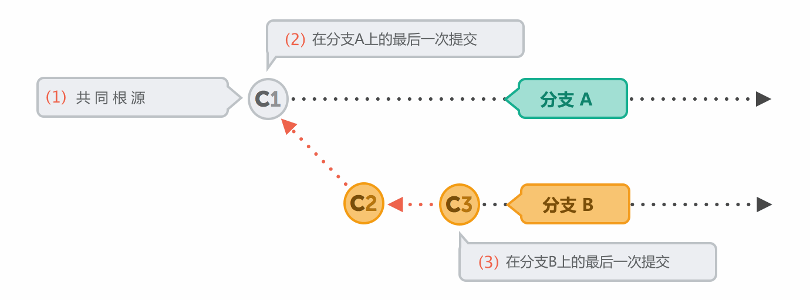
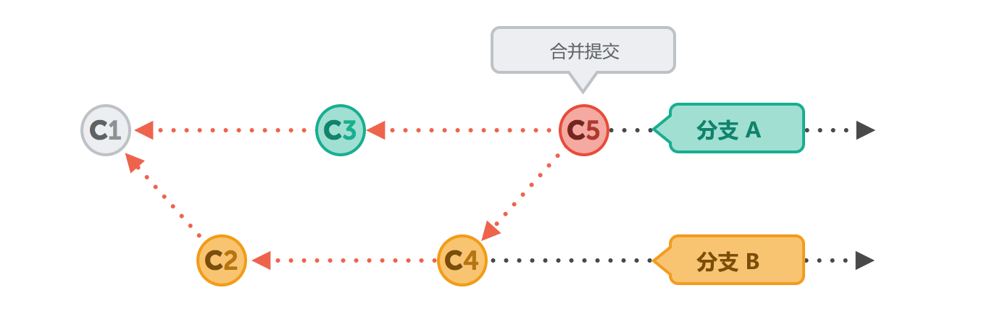
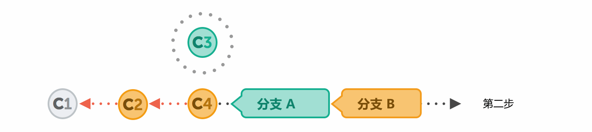
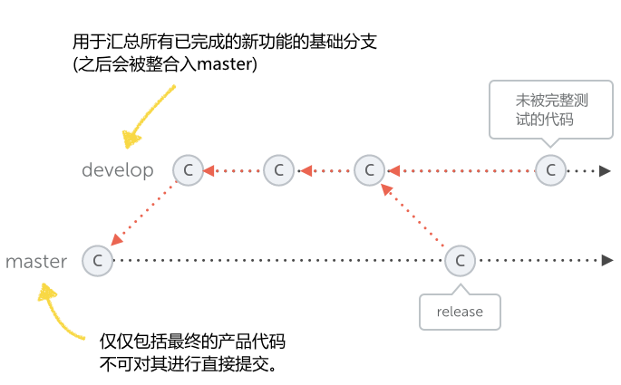

# Part 4 - 高级应用

# Part 4 - 高级应用

# 撤销操作

# 撤销操作

撤销是 Git 提供的一个非常优秀的功能，它可以允许你撤消刚刚所做的操作。这就意味着你不必害怕搞砸你正在工作的项目： Git 一直会让你的项目处于一个安全的状态。

## 修改最后一次提交

无论你如何精心地推敲你的提交，你总是有可能出错的。比如忘记了把一个改动过的文件添加到提交中，或者是输入了错误的提交注释等等。当你认为提交有问题时，你都可以使用 “git commit” 命令，并附带上 “--amend” 参数，这个操作可以非常轻松地来修改你的*最后一次*提交。 如果你仅仅是想修改上一次的提交注释，你并不需要操作暂存区，简单地再次输入 “git commit --amend” 并附带上正确的注释就可以了：

```
$ git commit --amend -m "This is the correct message" 
```

如果你想要添加更多的改动到上一次提交中，你可以像平常一样把这些新的改动添加到暂存区。然后再次使用 “--amend” 参数进行提交：

```
$ git add some/changed/file.ext
$ git commit --amend -m "commit message" 
```

##### 黄金法则

#### #5: 不要修改已经被发布的提交

“amend” 操作是一个非常强大的小帮手，这点你会很快地领会到。但是在你使用它的同时，你一定要考虑到以下一些方面：

*   (a) 你只能使用它来修正你的**上一次**提交。更早的提交是不能使用 “amend” 来进行操作的。
*   (b) 你不要对一个已经在远程仓库上被发布，或者说已经被共享的提交进行 “amend” 操作！这是因为 “amend” 操作实际上在后台打包了一个全新的提交来替换旧的提交。如果在这个远程仓库里仅仅只有你一个人在工作，那么这种操作是没有问题的。但是在团队工作中，如果开发团队的其他人员已经得到了你所发布的改动，并且在此基础之上进行了他自己的改动，再次整合一个被修改过的（amended）提交就会出现很多麻烦。

## 撤销本地改动

当改动还没有被提交之前，它们仍然被称之为 “本地” 改动。这些在你的工作目录（working directory）的修改还仍然在本地，它们属于未被提交的改动（uncommitted changes）。 有时候你对代码进行了一些修改，但是发现这些改动带来的问题比之前还要多。在这种情况下，你可能想要放弃你刚刚的改动，让代码恢复到你改动之前的版本，也就是上次提交之后的状态。

恢复一个文件到上次提交之后的状态，你可以使用 “git checkout” 命令：

```
$ git checkout -- file/to/restore.ext 
```

我们已经知道了 “checkout” 命令主要是用来切换分支用的。但是你同样可以给这个命令附带上 “--” 参数，并加上用一个空格来分隔的文件路径。这个操作将撤销在特定文件上所有的未提交的改动。

如果你想要放弃你在工作副本（working copy）中的所有本地改动，并让你的本地副本恢复到上次提交之后的版本，你可以使用 “git reset” 命令：

```
$ git reset --hard HEAD 
```

上面这个操作会通知 Git 将你本地副本上的所有文件替换到和 “HEAD” 分支一致的版本(也就是上次提交之后的版本状态)上，并放弃所有的本地改动。

##### 注释

放弃本地未被提交的改动是不能被撤销的。这是因为这些改动还没有保存在你的仓库中。因此，Git 也就没有任何机会来挽回这种操作带来的改动。 请在你撤销本地改动时始终牢记这一点。

## 撤销已提交的改动

有时你也许想撤销某一个之前的提交。例如当你发现你的改动存在错误，或是整个改动就是错误的，又或者你的客户决定不需要这个改动了等等。

使用 “git revert” 命令可以撤销某个之前的提交。但是这个命令并不是删除那个提交，相反的，它是恢复那个提交的改动，这只是看起来像是撤销而已。这个操作实际上会自动产生一个新的提交。在提交中包括了你想要撤销的那个提交的所有反向改动。例如在原始提交中，你在某一个位置添加一些字符，那么这个恢复提交（reverting commit）就会把这些字符删除掉。


如果想要撤销已提交的改动，你只需要简单地给出这个提交的 commit hash：

```
$ git revert 2b504be
[master 364d412] Revert "Change headlines for about and imprint"
 2 files changed, 2 insertions(+), 2 deletions (-)

$ git log
commit 364d412a25ddce997ce76230598aaa7b9759f434
Author: Tobias Günther <support@learn-git.com>
Date: Tue Aug 6 10:23:57 2013 +0200

    Revert "Change headlines for about and imprint"

    This reverts commit 2b504bee4083a20e0ef1e037eea0bd913a4d56b6. 
```

另外一种撤销提交的方法是使用 “git reset” 命令。这个操作不会自动产生一个新的提交，或是删除你要撤销的提交，它会重置你当前的 HEAD 分支到一个特定旧的版本，也被称作 “回滚（rolling back）” 到旧的版本：

```
$ git reset --hard 2be18d9 
```

在执行了这个操作之后，你当前签出的分支将被重置为版本 2be18d9。在这个版本之后的一个或者多个版本将被真正的放弃，它们也不会显示在分支的历史记录中。


如果在这个命令上使用 “--hard” 参数则一定要小心，Git 将会丢弃所有你当前可能拥有的本地改动。整个项目将会被恢复成一个之前的旧版本。 如果你使用 “--keep” 参数来替代 “--hard” 参数，那么在 “回滚” 到的版本之后的所有改动将会转换成本地改动，并保留在你的工作目录中。

##### 注释

和 “revert” 命令一样， “reset” 命令也不会删除任何已存在的提交。这些操作仅仅是做得好像这个提交不存在似的，并从历史记录中删除它们。无论如何，提交会被保存在 Git 的数据库中至少 30 天。因此，如果你发现你曾经不小心删除了一个仍然有用的提交，任何一个精通 Git 的同事都能为你恢复它们。

这两个命令（revert and reset）只是工作于当前 HEAD 分支上。因此在你执行这些操作之前，你必须要切换到正确的分支上去。

# 用 diff 来检查改动

# 用 diff 来检查改动

项目的开发是由无数个微小的改动组成的。了解项目开发过程的关键就是要搞清楚每一个改动。 当然你可以使用 “git status” 命令或更简单的 “git log” 命令来打印出项目的状态和历史记录，但是这些命令仅仅只能为你提供一个非常简单的信息概要，想要显示一个详细的修改信息就必须使用另外一个命令。

## 读懂 Diffs

在版本控制系统中用来显示两个版本之间差别的操作我们称之为 “diff”，或者 “patch”。现在就让我们来详细地学习一下这个操作吧！首先要学习如何读懂 diff 信息。


### 比较文件 a/b

这个 diff 操作会对两个对象进行相互比较。比如对象 A 和对象 B 。在大多数情况下 A 和 B 会是项目中的同一个文件，但它们是基于不同的版本。当然 diff 操作也可以比较两个完全没有关联的文件，并显示出它们之间的差别，但是这种操作并不会被经常使用到。 为了清楚地显示比较信息， diff 操作总是会把要比较的文件定义成 “A” 和 “B”。

### 文件的元数据 （Metadata）

这所说的文件元数据是非常技术性的，在实践中你可能永远不需要搞明白它。最开始的两串数字表示两个文件的 hashes（简单点说就是它们的 “ID”）。不仅仅是整个项目，Git 还会把每一个文件当作对象来保存。这个 hash ID 就代表了一个文件对象的特定版本。最后的一串数字代表了一个文件的模式（100644 代表它是一个普通的文件，100755 表示一个可执行文件，120000 仅仅是一符号链接）。

### 标记 a/b

继续向下观察这些输出信息，A 与 B 的真正差别会被显示在这里。为了区分它们，A 和 B 都被赋予了它们特有的符号：对于版本 A，它的符号是一个减号（“-”）；而对于版本 B ，它会使用一个加号（“+”）。

### 区块（Chunk）

diff 操作不会显示完整的文件内容。如果两个版本仅仅存在两行代码的差别，你也不会想要去逐行地审视这个拥有上万行代码的文件吧。因此，Git 在这里只会标记出那些实际上修改的部分，在这里一段连续的改动被称之为区块（chunk 或者 hunk）。除了包括实际更改的代码行，一个区块还包括一个特定的 “上下文环境”，例如那些改变之前和之后的差别，能让你更容易地明白在特定的上下文环境中这个改变的具体含义。

### 区块标头（Chunk Header）

每个这样的区块都有一个标头，它被显示在两个 “@@” 符号中。在这里 Git 会告诉你哪些行存在差异。在我们的例子里这些行被标记成为第一个改动区块：

*   来自文件 A （标记为 “-”），从第 34 行开始之后的 6 行代码。
*   来自文件 B （标记为 “+”），从第 34 行开始之后的 8 行代码。

在那个 “@@” 结束符号之后的信息是用来表明上下文环境的，例如 Git 会尝试着为这个区块赋予一个方法名称或是其他的上下文信息。然而 Git 不能支持所有的文件内容，这很大程度上都要取决于项目所使用的开发语言。

### 改动

在每一个被改动过的代码行之前都会前置一个 “+” 或是 “-” 符号。就像前面所讲到的，这些符号可以帮助你准确了解版本 A 和 版本 B 。例如前置了 “-” 符号的行就代表来自版本 A，反之带有符号 “+” 的行就代表来自于版本 B。 大多数情况下，在 Git 中都使用 A 和 B 这样的方式，你可以认为 A/- 代表老的内容，而 B/+ 代表新的内容。

现在就让我们来看一下我们的例子：

*   改动 #1 包括两行 “+” ，而在相对应的版本 A 中却不存在这些行（没有任何被前置 “-” 的行），这就表示这两行是新被添加的。
*   改动 #2 则恰恰相反。在版本 A 中，可以看到有两行被前置上了符号 “-”。然而版本 B 却不存在对应的行（没有 “+” 行），这就表明这两行被删除了。
*   在改动 #3 中，这些代码行发生了一些改动，前置上符号 “-” 的两行被修改了，新的改动就是在它的下面被标记了符号 “+” 的内容。

现在我们知道了如何读懂 diff 的输出信息了，来做一些练习吧！

## 检查本地改动

在之前的章节里，我们经常会使用 “git status” 命令来查看在本地副本（working copy）中有哪些文件被改动了。如果要想清楚地了解这些改动的细节，我们就必须使用 “ git diff” 命令：

```
$ git diff
diff --git a/about.html b/about.html
index d09ab79..0c20c33 100644
--- a/about.html
+++ b/about.html
@@ -19,7 +19,7 @@
   </div>

   <div id="headerContainer">
-    <h1>About</h1>
+    <h1>About This Project</h1>
   </div>

   <div id="contentContainer">
diff --git a/imprint.html b/imprint.html
index 1932d95..d34d56a 100644
--- a/imprint.html
+++ b/imprint.html
@@ -19,7 +19,7 @@
   </div>

   <div id="headerContainer">
-    <h1>Imprint</h1>
+    <h1>Imprint / Disclaimer</h1>
   </div>

   <div id="contentContainer"> 
```

在不带任何参数的情况下，“git diff” 会为我们给所有在本地副本中还未被打包（unstaged）的变化做个比较，并显示出来。 如果你仅仅是想要查看那些对于已被打包的改动的比较结果，你可以选择使用 “git diff --staged” 命令。

## 检查已提交的改动

你已经学习过了 “git log” 命令，它会打印出那些最新提交的概要。但是它仅仅显示一些最基础的信息（hash，作者，时间，注释）。如果你想要查看那些改动的细节，你就可以加上 “-p” 参数来得到一个更详细的修改信息。

## 比较分支和版本

最后，你可能想要知道如何比较两个分支，或是两个特定项目版本。来让我们看看在 “contact-form” 分支的哪些改动并不存在于 “master” 上：

```
$ git diff master..contact-form 
```

相反，这些比较信息仅仅是在分支层面上的，你也可以比较任意的两个项目版本之间的内容：

```
$ git diff 0023cdd..fcd6199 
```

# 处理合并冲突

# 处理合并冲突

对于很多人来说，合并时出现冲突是非常可怕的事，这就好像一不小心格式化了自己的硬盘一样。在这一章节里我将为你消除这种恐惧。

## 你不会把事情搞砸

首先你应该记住，你总是可以撤销一个合并操作，并且返回到冲突发生之前的状态。也就是说，你永远有机会放弃并重新开始。

如果你已经掌握了一些关于其它的版本控制系统的使用经验，例如 Subversion ，你可能会很难过。因为在 Subversion 中处理冲突是被大家公认极为复杂而繁琐的。这也就是为什么我们要使用 Git 的原因。简单地说，它在这方面的工作原理是完全不同于 Subversion 的。Git 能够在合并过程中顾及到很多方方面面的东西，从而为你创造一个比较简单的方案来解决可能出现的冲突。

当然，冲突只会妨碍你自己的工作，它是不会涉及到整个团队的项目仓库。这是因为在 Git 中，冲突只可能发生在开发人员的本地计算机上，而不是在远程服务器上。

## 什么是一个合并冲突

在 Git 中，“合并（merging）” 是在形式上整合别的分支到你当前的工作分支的操作。你需要得到在另外一个上下文背景下的改动（这就也就是我们所提到过的，一个有效的分支应该是建立在一个上下文工作背景上的），并且合并它们到你的当前的工作文件中来。

作为你的版本管理系统，Git 所带来的最伟大的改善就是它让合并操作变得非常轻松简单。在大多数情况下，Git 会自己弄清楚该如何整合这些新来的变化。

当然，也存在极少数的情况，你必须自己手动地告诉 Git 该怎么做。最为常见的就是大家都改动了同一个文件。即便在这种情况下，Git 还是有可能自动地发现并解决掉这些冲突。但是，如果两个人同时更改了同一个文件的同一行代码，或者一个人改动了那些被另一个人删除了的代码，Git 就不能简单地确定到底谁的改动才是正确的。这时 Git 会把这些地方标记为一个冲突，你必须首先解决掉这些冲突，然后再继续你的工作。

## 如何解决合并冲突

当面对一个合并冲突时，我们首先要搞明白发生了什么。例如是不是你和你的同事都同时编辑了同一个文件的同一行代码呢？是不是他删除了一个你正在编辑的文件呢？是不是你们同时添加了一个相同文件名的文件呢？ 当你使用 “git status” 时， Git 会告诉你存在一个 “未合并的路径（unmerged paths）”，这只是用另外一个方式告诉你，存在一个或多个冲突：

```
$ git status
# On branch contact-form
# You have unmerged paths.
#   (fix conflicts and run "git commit")
#
# Unmerged paths:
#   (use "git add <file>..." to mark resolution)
#
#       both modified:   contact.html
#
no changes added to commit (use "git add" and/or "git commit -a") 
```

就让我们来深入地探讨一下，如何去解决这些最常见的冲突。 当两个改动发生在同一个文件的同一些行上，我们就要看看发生冲突的文件的内容了。Git 会非常友好地把文件中那些有问题的区域在 “<<<<<<< HEAD” 和 “>>>>>>> [other/branch/name]” 之间标记出来。


第一个标记后的内容源于当前分支。在尖括号之后，Git 会告诉我们这些改动是从哪里（哪个分支）来的。然后有冲突的改动会被 “=======” 分割起来。

现在我们的工作是要清理这些问题行。当我们完成这些清理后，这个文件应该看起来和我们预期的完全一样。在过程中你也可能需要咨询一下那个和你的代码发生冲突的同事，从而更好地决定哪些改动才是最终正确的，哪些改动是需要被放弃掉的。可能是你的改动，也可能是他的，或者可能是你们两个改动的组合。

打开一个比较原始的文件编辑器来清理这些冲突看起来是可行的，但是这样并不简单。使用一个专门的合并工具可以使这个操作变得更容易（如果你已经安装了一个在你的本地计算机上……）。你可以通过 “git config” 命令来设置这个合并工具给 Git。更详细的内容你就要查看这个工具的文档说明了。 之后当发生合并冲突时，你可以使用 “git mergetool” 命令来调用这个工具。

例如，我在 Mac 上使用 “Kaleidoscope.app”：


在左边和右边的窗口会标记出那些改动的冲突。比起那些用符号 “<<<<<<<” 和 “>>>>>>>” 来标记冲突的方法来说，这是一个更加优雅的可视化环境。你可以非常方便地选择哪个改动是需要被保留的。位于中间的窗口会显示出处理后的结果，并且你也可以进一步手动编辑它。

现在，当清理文件并得到最终代码后，所有剩下的工作就是将这个结果保存起来，并且马上退出这个合并工具。这样 Git 就会知道你已经完成了这个操作。Git 会在后台对那个文件自动地执行 “git add” 命令。这也标志着冲突已经解决了。如果你*不*使用合并工具，而是手动在文本编辑器中清理这些冲突，你必须手动地将文件标记为已解决状态（通过执行命令 “git add <filename>”）。

最终，当所有的冲突被解决后，你必须通过一个正常的提交操作来完成这个清理合并冲突的工作。

## 如何撤销一个合并

你应该始终牢记，你可以在任何时间执行撤销操作，并返回到你开始合并之前的状态。要对自己有信心，你不会破坏项目中的任何东西。只要在命令行界面中键入 “git merge --abort” 命令，你的合并操作就会被安全的撤销。

当你解决完冲突，并且在合并完成后发现一个错误，你仍然还是有机会来简单地撤销它。你只须要键入 “git reset --hard <commit-hash>” 命令，系统就会回滚到那个合并开始前的状态，然后重新开始吧！</commit-hash>

# Rebase 代替合并

# Rebase 代替合并

虽然合并（merge）操作可以用来简单和方便地整合改动，但是它却不是唯一的方法。“Rebase” 就是另一种替代手段。

##### 注释

虽然 rebase 相对于我们已知的整合操作来说有着比较显著的优点，但是这也是在很大程度上取决于个人的喜好。一些团队喜欢使用 rebase，而另一些可能倾向于使用合并。

Rebase 相对于合并来说是比较复杂的。我建议你可以跳过这一章，除非你和你的团队确定会用到 rebase 操作。当你积累了 Git 的一些基本使用流程的实践经验后，你也可以在以后的时间再回来学习本章的内容。

## 深入了解合并操作

在你进入 rebase 这个主题前，我们有必要来再次探讨一下更多关于合并操作的细节。当 Git 执行一个合并时，它实际上会查找三个提交：

*   (1)共同的原始提交 如果你在项目中查看两个分支的历史，它们总是会出自于一次共同的提交，那么在当时的时间点上，这两个分支还是拥有相同的内容。之后它们就开始有了差别。
*   (2) + (3) 两个分支的最终点 合并操作的目的就是把两个分支的最新状态结合起来。因此他们各自的最新版本是有特殊含义的。

结合这三个提交后得到的结果就是我们整合的目标。

## 快进或合并提交

一种最简单的情况是，在其中的一个分支上没有任何一个新的改动提交发生。那么在它之前的最后一次提交就仍然还是那个共同的原始提交。



在这种情况下，执行整合操作就非常简单了。 Git 仅仅需要添加所有那些在另外一个分支上的新提交就可以了。在 Git 中，这种最简单的整合操作我们称之为 “快进（fast-forward）”合并。之后两个分支就拥有了完全相同的历史。


但是在大多数情况下，两个分支都会有自己不同的发展轨迹。


为了完成整合，Git 会需要创建一个新的提交来含括它们之间的差异，这就是整合提交（merge commit）。



## 手工提交与合并提交

通常情况下，提交都是由手工精心创建的。这样也就能更好地保证一次提交只涉及一个关联改动，并且能更好地注释这个提交。

一个合并提交就不同了，它不是由开发人员手动创建的，而是由 Git 自动生成的。它也不涉及一个关联改动，其目的只是连接两个分支，就像节点一样。如果之后想要了解某个合并操作，你只需要查看这两个分支的历史记录和它们相应的提交树（version tree）。

## Rebase 整合

有些人并不喜欢使用这种自动合并提交。相反，他们希望项目拥有一个单一的历史发展轨迹。比如一条直线。在历史纪录上没有迹象表明在某些时间它被分成过多个分支。


现在就让我们一步一步地了解一下 rebase 操作吧！仍然来使用前面的例子：我们想合并分支 B 到 分支 A 中，但是这次使用 rebase 操作。


使用下面这个非常的简单的命令：

```
$ git rebase branch-B 
```

首先，Git 会 “撤销” 所有在分支 A 上的那些在与分支 B 的共同提交之后发生的提交。当然，Git 不会真的放弃这些提交，其实你可以把这些撤销的提交想像成 “*被暂时地存储*” 到另外的一个地方去了。


接下来它会整合那些在分支 B（这个我们想要整合的分支）上的还未整合的提交到分支 A 中。在这个时间点，这两个分支看起来会是一模一样的。



最后，那些在分支 A 的新的提交（也就是第一步中自动撤销掉的那些提交）会被重新应用到这个分支上，但是在不同的位置上，在那些从分支 B 被整合过来的提交之后，它们就被 *re-based* 了。 整个项目开发轨迹看起来就像发生在一条直线上。相对于一个合并提交，rebase 包括了所有的组合变化，最原始的提交结构会被保留下来。


## Rebase 存在的陷阱

当然，使用 rebase 操作不会是永远一帆风顺的。很有可能会搬起石头砸自己的脚，因此你不能忽视一个重要的事实：**rebase 会改写历史记录**。

你有可能已经注意到了，在被 rebase 操作之后的版本中，提交 “C3*” 存在一个新添加的星号。这是因为，尽管这个提交的内容和 “C3” 完全一样，但是它实际上是一个不同的提交。这样做的原因是，它现在有一个新的源提交 C4（在最初创建 C3 时的源提交是 C1）。

一个提交仅仅包括很少的属性，比如作者，日期，变动和谁是它的父提交。如果改变其中任何一个信息，就必须创建一个全新的提交。当然，新的提交也会拥有一个新的 hash ID 。

如果还仅仅只是操作那些尚未发布的提交，重写历史记录本身也没有什么很大的问题。但是如果你重写了已经发布到公共服务器上的提交历史，这样做就非常危险了。其他的开发人员可能这时已经在最原始的提交 C3 上开始工作，并使它成为了一些新提交中不可或缺的部分，而现在你却把 C3 的改动设置到了另一个时间点（就是那个新的 C3*）。除此之外，通过 rebase 操作，这个原始的 C3 还被删除掉了，这将是非常可怕的……

因此你应该只使用 rebase 来清理你的本地工作，千万不要尝试着对那些已经被发布的提交进行这个操作。

# 子模块

# 子模块

在项目开发时，你有可能经常性地想要去引用一些库文件或其它资源文件。手动的方法就是直接下载那些必要的代码文件，然后拷贝到你的项目中，最后将这些新的文件提交到你的 Git 仓库中去。

虽然这是一种有效的方法，但是这种操作并不是最简单有效的。如果只是任意地将这些库文件提交到你的项目中，将带来一系列的问题：

*   外部代码和自己开发的代码会被合并保存在一个项目中。其实那些库文件自身就应该是一个项目，并且也应该独立于我们的工作之外。在我们当前项目的版本控制系统中，它们并不需要被保存。
*   如果库文件发生了变化（可能因为修复错误或是添加新的功能），更新这些库文件的代码对我们来说会是很繁琐的事。我们需要再次下载它的原代码文件，并且替换掉在仓库中已有的文件。

由于这些都是在日常项目开发时非常普遍存在的问题，所以 Git 也提供了一个解决方案：子模块（Submodule）。

## 仓库包含其它的仓库

一个 “子模块” 其实就是一个标准的 Git 仓库。不同的是，它被包含在另一个主项目的仓库中。一般情况下，它包含一些库文件和其它资源文件，你可以简单地把这些库文件作为一个子模块添加到你的主项目中。

一个子模块也是一个功能齐全的 Git 仓库，就内部而言它和别的仓库没有什么区别，你可以对它进行修改、提交、抓取、推送等等操作。

让我们来看看在实际操作中子模块是如何工作的吧。

## 添加一个子模块

在这个简单的项目中，我们建立一个新的 “lib” 文件目录用来存放一些库文件。

```
$ mkdir lib
$ cd lib 
```

使用 “git submodule add” 命令，我们会从 GitHub 中添加一个小的 Javascript 库：

```
$ git submodule add https://github.com/djyde/ToProgress 
```

来让我们来看看现在发生了什么：

*   (1) 这个命令将对一个指定的 Git 仓库进行了一个简单地克隆操作：

```
Cloning into 'lib/ToProgress'...
remote: Counting objects: 180, done.
remote: Compressing objects: 100% (89/89), done.
remote: Total 180 (delta 51), reused 0 (delta 0), pack-reused 91
Receiving objects: 100% (180/180), 29.99 KiB | 0 bytes/s, done.
Resolving deltas: 100% (90/90), done.
Checking connectivity... done. 
```

*   (2) 当然这一切也都会反映在我们当前项目的文件结构上。在项目中的 “lib” 目录中包括了一个新的 “ToProgess” 文件目录。通过这个文件目录所包含的 “.git” 子文件夹我们就能确认，这就是一个标准的 Git 仓库。

    <figure></figure>

##### 概念

必须要再次阐述一下：一个子模块的内容并**不保存**在它的父仓库中。其实只有它的远程 URL 会被记录在父仓库中，以及它在主项目中的本地路径和签出的版本。

当然，子模块的工作文件都放置在你项目的指定的目录中。最后当你要使用这些库文件时，你会发现它们并不是主项目的版本控制的一部分。

*   (3) 一个新的 “.gitmodules” 文件会被创建。这个文件就是 Git 用来跟踪我们的子模块并保存它的配置信息的：

```
[submodule "lib/ToProgress"]
    path = lib/ToProgress
    url = https://github.com/djyde/ToProgress 
```

*   (4) 你可能会对 Git 的内部工作原理感兴趣。除了 “.gitmodules” 配置文件，Git 也会在你本地的 “.git/config” 文件中保存对子模块的记录。最终它也会在它的 “.git/modules” 目录中保存每一个子模块的 “.git” 仓库。

##### 概念

Git 内部对子模块的管理是非常复杂的，就像你已经看到的那些 “.gitmodules”，“.git/config”，和 “.git/modules” 等等的条目那样。因此，这里强烈**不建议**你去手动地修改这些配置文件。为了安全起见，一定要使用适当的 Git 命令来操作子模块。

现在让我们来看看当前的项目状态：

```
$ git status
On branch master
Changes to be committed:
    (use "git reset HEAD <file>..." to unstage)

    new file:   .gitmodules
    new file:   lib/ToProgress</file> 
```

像任何其他修改一样， Git 添加了一个子模块，并且要求你提交这个改动到仓库中：

```
$ git commit -m "Add 'ToProgress' Javascript library as Submodule" 
```

现在，我们已经成功地添加了一个子模块到我们主项目中来了！在了解几个不同的案例之前，让我们先来看看如何克隆一个已经包括了若干子模块的项目。

## 克隆一个项目和它的子模块

你已经知道了，一个项目仓库并*不*包含子模块的文件。主项目仓库仅仅保存子模块的*配置信息*来作为版本管理的一部分。 这就表示，当你要克隆一个带有子模块的项目时，在默认的情况下 “git clone” 命令仅仅接收这个项目本身。我们的 “lib” 只是一个空目录，里面没有任何文件。

你有两个选择去设置这个 “lib” 目录（或者是任何一个你保存的其他子模块，“lib” 在这里只是一个例子)：

*   (a) 你可以通过将 “--recurse-submodules” 参数加在 “git clone” 上，从而让 Git 知道，当克隆完成的时候要去初始化所有的子模块。

*   (b) 如果你仅仅只是简单地使用了 “git clone” 命令，并没有附带任何参数，你就需要在完成之后通过 “git submodule update --init --recursive” 命令来初始化那些子模块。

## 签出一个版本

一个 Git 仓库可以保存无限多个提交版本，但是仅仅只有一个文件版本能保存在你当前的工作副本中。就像任何其他的 Git 仓库一样，你必须自己来决定在子模块上的哪一个版本应该被签出到你的工作副本中。

##### 概念

和一个普通的 Git 仓库不一样的是，子模块永远指向一个特定的提交，而不是分支。这是因为一个分支的内容可以在任何时间通过新的提交来改变。所以指向一个特定的提交版本就能始终保证代码的正确。

比方说，我们希望在我们项目中使用一个旧版本的 “ToProgress” 库。首先，我需要看一下这个库的提交历史记录。我们需要切换到这个子模块的根目录下，然后执行 “log” 命令：

```
$ cd lib/ToProgress/
$ git log --oneline --decorate 
```

在我们来检查实际的历史记录之前，有一点我想强调一下：Git 命令是对上下文环境很敏感的！也就是说，通过命令行来切换到子模块的目录后，我们执行的所有 Git 命令仅仅只会对子模块有效，而不是对它的父仓库。

现在历史记录被打印出来了，我们会发现这个提交被标记成了 “0.1.1”：

```
83298f7 (HEAD, master) update .gitignore
a3b6186 remove page
ed693b7 update doc
3557a0e (tag: 0.1.1) change version code
2421796 update readme 
```

这就是我们希望在我们的项目使用的版本。首先我们可以来简单地看看这个提交：

```
$ git checkout 0.1.1 
```

再让我们来看看父仓库。在主项目的目录中执行下面的命令：

```
$ git submodule status
+3557a0e0f7280fb3aba18fb9035d204c7de6344f   lib/ToProgress (0.1.1) 
```

通过使用 “git submodule status”，我们可以查看子模块的哪一个版本在当前被签出了。在 hash 之前的 “+” 符号是非常重要的，它表明该子模块在它父仓库的官方记录中存在一个**不同**的版本。这是合理的，因为我们的确修改并签出了版本标记为 “0.1.1” 的提交。

如果在父仓库上执行 “git status” 命令，我们就会发现像任何其他的变化一样，Git 移动了指向这个子模块的指针：

```
$ git status
On branch master
Changes not staged for commit:
    (use "git add <file>..." to update what will be committed)
    (use "git checkout -- <file>..." to discard changes in working directory)

    modified:   lib/ToProgress (new commits)</file> </file> 
```

为了使这个改动生效，我们现在需要提交它到仓库中：

```
$ git commit -a -m "Moved Submodule pointer to version 1.1.0" 
```

## 更新一个子模块，当指向它的指针发生了变化之后

我们看到了如何签出一个子模块的特定版本。但是，如果是开发团队的其他成员在项目中改变了对子模块的指针呢？当他移动了指向子模块的指针到另一个版本之后，我们就要整合他的改动，例如通过抓取，合并，或是 rebase ：

```
$ git pull
Updating 43d0c47..3919c52
Fast-forward
 lib/ToProgress | 2 +-
 1 file changed, 1 insertion(+), 1 deletion(-) 
```

Git 会以一个相当含蓄的方式告诉我们，“lib/ToProgress” 发生了变化。再次使用 “git submodule” 命令来索取更多和更细节的信息：

```
$ git submodule status
+83298f72c975c29f727c846579c297938492b245 lib/ToProgress (0.1.1-8-g83298f7) 
```

还记得那个小的 “+” 符号吗？这表明子模块发生了变化，我们当前签出的子模块版本不是主项目使用的中的 “官方” 版本。

使用 “update” 命令可以帮助我们修正它：

```
$ git submodule update lib/ToProgress
Submodule path 'lib/ToProgress': checked out '3557a0e0f7280fb3aba18fb9035d204c7de6344f' 
```

##### 注释

在大多数情况下，使用 “git submodule” 家族的命令是不需要指定一个特定子模块的。但是正如上面的例子一样，如果我们给出一个子模块的路径，这个操作就只会针对那个给定的子模块。

现在我们签出了相同版本的子模块，这就是之前另一个团队成员提交到项目中的那个。

值得注意的是，“update” 命令会为你下载子模块的改动。设想一下，你的队友在你之前已经改变了指向子模块版本的指针。在这种情况下，Git 会为你获取在子模块的相应版本，并且签出这个子模块的版本，非常方便。

## 检查子模块的最新变化

正常情况下，你是不会经常改变库文件的代码的。如果这个子模块被真正地测试过，并且你也知道它非常匹配你的开发项目时，你才会使用它。 无论如何，子模块功能最大优点之一就是你可以很方便地与最新的发行版本同步（也许只是同步一个小小的优化）。

让我们来看看子模块是否提供了新的代码版本：

```
 $ cd lib/ToProgress
    $ git fetch
    remote: Counting objects: 3, done.
    remote: Compressing objects: 100% (3/3), done.
    remote: Total 3 (delta 0), reused 0 (delta 0), pack-reused 0
    Unpacking objects: 100% (3/3), done.
    From https://github.com/djyde/ToProgress
        83298f7..3e20bc2  master     -> origin/master 
```

请注意！现在我们切换到了子模块的文件夹，之后的操作就像对待任何一个普通的项目仓库一样（因为它就是一个普通的 Git 仓库）。 现在 “git fetch” 命令显示，当前的确存在一些新的改动在子模块的远程上。

##### 概念

在我们准备整合这些改动之前，我想再次重申一下。当检查这个子模块的状态时，我们会发现我们正处在一个**detached HEAD**上：

```
$ git status
    HEAD detached at 3557a0e
    nothing to commit, working directory clean 
```

一般情况下，在 Git 中你总是会签出某个分支。然而你也*可以*选择签出一个特定的**提交**（而**不是**一个分支）。这是一种比较罕见的情况，在 Git 中通常应该避免。

然而在子模块上工作时，签出某个提交的情况是非常正常的。你要确保在你的项目中，签出一个确切的静态的提交（不是一个分支），并转移到一个较新的提交上。

现在让我们通过拉取操作来整合那些新的改动到你的本地子模块仓库中吧。请注意！你不能使用那个简写的 “git pull” 命令语法，而是需要指定特定的远程和分支。

这是因为我们正处于 “detached HEAD” 状态。因为在这个时刻你不是在本地分支上，你需要告诉 Git，你想要把拉取出来的改动整合到哪一个分支上去。

```
$ git pull origin master 
```

如果你现在已经执行过一遍 “git status” 命令了，你会发现我们的状态仍然处于 detached HEAD，并且在同一个提交上，当前被签出的内容并没有发生改变。如果我们在项目中想要使用这个升级后的子模块的代码，我们必须明确地将 HEAD 指针移动到分支上：

```
$ git checkout master 
```

我们已经完成了在子模块上的工作，现在让我们切换回我们主项目吧：

```
$ cd ../..
$ git submodule status
+3e20bc25457aa56bdb243c0e5c77549ea0a6a927 lib/ToProgress (0.1.1-9-g3e20bc2) 
```

由于我们刚刚移动了子模块的指针到了一个不同的版本，我们需要将这个改动提交到父仓库中去，从而让它成为主项目当前正式引用的 “官方” 版本。

## 在子模块中工作

有些时候，你可能会想要在子模块中作一些自己的改动。你已经知道了在子模块中工作就和在一个普通的 Git 仓库中工作一样，你在子模块目录中执行的所有的 Git 命令只会对这个子模块仓库有效。

比方说，你想对子模块进行一个小小的改动，你编辑了相关的文件，把它们添加到暂存区，并且提交它。

现在你可能会踩到第一块香蕉皮。因为如果当前你正处于一个 detached HEAD 状态，你的提交会迷失方向，它并没有关联到任何一个分支。一旦你签出了其他的东西，它的内容就会丢失。所以你应该在提交之前确保，你当前已经在子模块中签出了一个分支。

除此之外，你已经学到的其它一切 Git 操作都仍然适用。在主项目中 “git submodule status” 会告诉你指向该子模块的指针被移动了，你必须提交这个改动。

顺便提一下，如果你的子模块中还有*未提交*的改动，Git 也会在主项目中提醒你：

```
$ git status
...
    modified:   lib/ToProgress (modified content) 
```

请务必始终保持子模块有一个干净的状态。

## 删除一个子模块

尽管很少会从项目中删除一个子模块，但是如果你确定想要这么做，也请不要手动地删除它，一旦所的有配置文件被打乱，将会不可避免地导致出现一系列问题。

```
$ git submodule deinit lib/ToProgress
$ git rm lib/ToPogress
$ git status
...
    modified:   .gitmodules
    deleted:    lib/ToProgress 
```

使用 “git submodule deinit”，我们可以确保从配置文件中完全地删除一个子模块。 使用 “git rm” ，我们可以最终删除这个子模块的文件，包括一些其它废弃的部分。

提交这些改动，这个子模块就会从你的项目中被彻底地删除了。

# git-flow 的工作流程

# git-flow 的工作流程

当在团队开发中使用版本控制系统时，商定一个统一的工作流程是至关重要的。Git 的确可以在各个方面做很多事情，然而，如果在你的团队中还没有能形成一个特定有效的工作流程，那么混乱就将是不可避免的。

基本上你可以定义一个完全适合你自己项目的工作流程，或者使用一个别人定义好的。

在这章节中我们将一起学习一个当前非常流行的工作流程 git-flow。

## 什么是 git-flow？

一旦安装安装 git-flow，你将会拥有一些扩展命令。这些命令会在一个预定义的顺序下自动执行多个操作。是的，这就是我们的工作流程！

git-flow 并不是要替代 Git，它仅仅是非常聪明有效地把标准的 Git 命令用脚本组合了起来。

严格来讲，你并不需要安装什么特别的东西就可以使用 git-flow 工作流程。你只需要了解，哪些工作流程是由哪些单独的任务所组成的，并且附带上正确的参数，以及在一个正确的顺序下简单执行那些对应的 Git 命令就可以了。当然，如果你使用 git-flow 脚本就会更加方便了，你就不需要把这些命令和顺序都记在脑子里。

## 安装 git-flow

近些年来出现了很多不同的安装方法。在本章节中我们会使用当前最流行的一种： [AVH Edition](https://github.com/petervanderdoes/gitflow/)。

要了解安装 git-flow 细节，请阅读下面这个文档 [official documentation](https://github.com/petervanderdoes/gitflow/wiki#installing-git-flow)。

## 在项目中设置 git-flow

当你想把你的项目 “切换” 到 git-flow 上后，Git 还是可以像往常一样工作的。这完全是取决于你在仓库上使用特殊的 git-flow 命令或是普通的 Git 命令。换句话说，git-flow 它不会以任何一种戏剧性的方式来改变你的仓库。

话虽如此，git-flow 却存在一些限制。让我们开始在一个新的项目上初始化它吧，之后我们就会有所发现：

```
$ git flow init
Initialized empty Git repository in /Users/tobi/acme-website/.git/
Branch name for production releases: [master] 
Branch name for "next release" development: [develop] 

How to name your supporting branch prefixes?
Feature branches? [feature/] 
Release branches? [release/] 
Hotfix branches? [hotfix/] 
```

当在项目的根目录执行 “git flow init” 命令时（它是否已经包括了一个 Git 仓库并不重要），一个交互式安装助手将引导您完成这个初始化操作。听起来是不是有点炫，但实际上它只是在你的分支上配置了一些命名规则。 尽管如此，这个安装助手还是允许你使用自己喜欢的名字。我强烈建议你使用默认的命名机制，并且一步一步地确定下去。

## 分支的模式

git-flow 模式会预设两个主分支在仓库中：

*   **master** 只能用来包括产品代码。你不能直接工作在这个 master 分支上，而是在其他指定的，独立的特性分支中（这方面我们会马上谈到）。不直接提交改动到 *master* 分支上也是很多工作流程的一个共同的规则。
*   **develop** 是你进行任何新的开发的基础分支。当你开始一个新的功能分支时，它将是*开发*的基础。另外，该分支也汇集所有已经完成的功能，并等待被整合到 *master* 分支中。



这两个分支被称作为 [长期分支](https://www.git-tower.com/learn/git/ebook/cn/command-line/branching-merging/branching-workflows)。它们会存活在项目的整个生命周期中。而其他的分支，例如针对功能的分支，针对发行的分支，仅仅只是临时存在的。它们是根据需要来创建的，当它们完成了自己的任务之后就会被删除掉。


让我们开始探索一些在现实应用中可能遇到的案例吧！

## 功能开发

对于一个开发人员来说，最平常的工作可能就是功能的开发。这就是为什么 git-flow 定义了很多对于功能开发的工作流程，从而来帮助你有组织地完成它。

### 开始新功能

让我们开始开发一个新功能 “rss-feed”：

```
$ git flow feature start rss-feed
Switched to a new branch 'feature/rss-feed'

Summary of actions:
- A new branch 'feature/rss-feed' was created, based on 'develop'
- You are now on branch 'feature/rss-feed' 
```

##### 概念

在这些命令的输出文本中，git-flow 会对刚刚完成的操作打印出一个很有帮助的概述。 当你需要帮助的时候，你可以随时请求帮助。例如：

```
$ git flow feature help 
```

正如上面这个新功能一样，git-flow 会创建一个名为 “feature/rss-feed” 的分支（这个 “feature/” 前缀 是一个可配置的选项设置）。你已经知道了，在你做新功能开发时使用一个独立的分支是版本控制中最重要的规则之一。 git-flow 也会直接签出这个新的分支，这样你就可以直接进行工作了。

### 完成一个功能

经过一段时间艰苦地工作和一系列的聪明提交，我们的新功能终于完成了：

```
$ git flow feature finish rss-feed
Switched to branch 'develop'
Updating 6bcf266..41748ad
Fast-forward
    feed.xml | 0
    1 file changed, 0 insertions(+), 0 deletions(-)
    create mode 100644 feed.xml
Deleted branch feature/rss-feed (was 41748ad). 
```

最重要的是，这个 “feature finish” 命令会把我们的工作整合到主 “develop” 分支中去。在这里它需要等待：

1.  一个在更广泛的 “开发” 背景下的全面测试。
2.  稍后和所有积攒在 “develop” 分支中的其它功能一起进行发布。

之后，git-flow 也会进行清理操作。它会删除这个当下已经完成的功能分支，并且换到 “develop” 分支。

## 管理 releases

Release 管理是版本控制处理中的另外一个非常重要的话题。让我们来看看如何利用 git-flow 创建和发布 release。

### 创建 release

当你认为现在在 “develop” 分支的代码已经是一个成熟的 release 版本时，这意味着：第一，它包括所有新的功能和必要的修复；第二，它已经被彻底的测试过了。如果上述两点都满足，那就是时候开始生成一个新的 release 了：

```
$ git flow release start 1.1.5
Switched to a new branch 'release/1.1.5' 
```

请注意，release 分支是使用版本号命名的。这是一个明智的选择，这个命名方案还有一个很好的附带功能，那就是当我们完成了 release 后，git-flow 会适当地*自动*去标记那些 release 提交。

有了一个 release 分支，再完成针对 release 版本号的最后准备工作（如果项目里的某些文件需要记录版本号），并且进行最后的编辑。

### 完成 release

现在是时候按下那个危险的红色按钮来完成我们的 release 了：

```
git flow release finish 1.1.5 
```

这个命令会完成如下一系列的操作：

1.  首先，git-flow 会拉取远程仓库，以确保目前是最新的版本。
2.  然后，release 的内容会被合并到 “master” 和 “develop” 两个分支中去，这样不仅产品代码为最新的版本，而且新的功能分支也将基于最新代码。
3.  为便于识别和做历史参考，release 提交会被标记上这个 release 的名字（在我们的例子里是 “1.1.5”）。
4.  清理操作，版本分支会被删除，并且回到 “develop”。

从 Git 的角度来看，release 版本现在已经完成。依据你的设置，对 “master” 的提交可能已经触发了你所定义的部署流程，或者你可以通过手动部署，来让你的软件产品进入你的用户手中。

## hotfix

很多时候，仅仅在几个小时或几天之后，当对 release 版本作做全面测试时，可能就会发现一些小错误。 在这种情况下，git-flow 提供一个特定的 “hotfix” 工作流程（因为在这里不管使用 “功能” 分支流程，还是 “release” 分支流程都是不恰当的）。

### 创建 Hotfixes

```
$ git flow hotfix start missing-link 
```

这个命令会创建一个名为 “hotfix/missing-link” 的分支。因为这是对产品代码进行修复，所以这个 hotfix 分支是基于 “master” 分支。 这也是和 release 分支最明显的区别，release 分支都是基于 “develop” 分支的。因为你不应该在一个还不完全稳定的开发分支上对产品代码进行地修复。

就像 release 一样，修复这个错误当然也会直接影响到项目的版本号！

### 完成 Hotfixes

在把我们的修复提交到 hotfix 分支之后，就该去完成它了：

```
$ git flow hotfix finish missing-link 
```

这个过程非常类似于发布一个 release 版本：

*   完成的改动会被合并到 “master” 中，同样也会合并到 “develop” 分支中，这样就可以确保这个错误不会再次出现在下一个 release 中。
*   这个 hotfix 程序将被标记起来以便于参考。
*   这个 hotfix 分支将被删除，然后切换到 “develop” 分支上去。

还是和产生 release 的流程一样，现在需要编译和部署你的产品（如果这些操作不是自动被触发的话）。

## 回顾一下

最后，在结束这个章节之前，我要再次强调几个重点。 首先，git-flow 并不会为 Git 扩展任何新的功能，它仅仅使用了脚本来捆绑了一系列 Git 命令来完成一些特定的工作流程。 其次，定义一个固定的工作流程会使得团队协作更加简单容易。无论是一个 “版本控制的新手” 还是 “Git 专家”，每一个人都知道如何来正确地完成某个任务。

记住，使用 git-flow 并不是必须的。当积攒了一定的使用经验后，很多团队会不再需要它了。当你能正确地理解工作流程的基本组成部分和目标的之后，你完全可以定义一个属于你自己的工作流程。

# 使用 SSH 公钥验证

# 使用 SSH 公钥验证

通常情况下，访问远程服务器上的 Git 仓库要受到限制。你可能不希望任何人都能读取文件，或者至少不能改动文件吧。在这种情况下，进行有效的认证就是非常必要地。

你可能已经通过你所使用的浏览器了解了 “HTTPS” 协议，尽管它使用起来很简单，但是很多系统管理员还是会出于各种原因去选择使用更为普遍的 “SSH” 协议。在这种协议之下，当涉及到身份验证时，你就很可能需要 “SSH 公钥”。 对于这种类型的验证需要一对密钥：一个公钥和一个私钥。私钥，顾名思义就是必须在任何情况下都保持绝对私有。它所对应的公钥则相反，应该是被安装到那些你需要登陆的服务器上。 当通过 SSH 试图建立连接时，如果客户端提供的私钥能和在服务器上所安装的公钥相匹配，那么这个客户端才会被授予访问权限。


## 创建一个公钥

在创建公共密钥前，你应该检查一下是否已经存在了一个：

```
$ ls ~/.ssh 
```

如果在输出列表里已经存在了一个名为 “id_rsa.pub” 或是 “id_dsa.pub” 的文件，这就代表你已经有了一个密钥。在这种情况下，你可以把这个文件发给你的服务器管理员。如果你使用的是像 GitHub 或 Beanstalk 这样的托管服务，那就要把它上传到你的帐户中。

如果还没有任何密钥，你只须要执行下面这个命令来创建一个：

```
$ ssh-keygen -t rsa -C "john@example.com" 
```

在 “-t” 参数之后，我们请求建立一个 “RSA” 类型的密钥。RSA 是当前最新并且最安全的一种形式。在 “-C” 参数之后，我们提供了一个注释，你可以把它想象为对这个密钥的一种描述或标签。例如使用你的 email 地址。总之，一个能让你之后更容易识别的注释。 在确认此命令后，您会被询问一些信息：

*   (1) 给这个新的密钥输入一个名称，保留默认的名字和设置。
*   (2) 提供一个密码。虽然 SSH 公钥可以确保在没有任何密码的情况下安全地使用，但是你还是应该设置一个密码，用来进一步提高安全性。

```
$ ssh-keygen -t rsa -C "john@example.com"
Generating public/private rsa key pair.
Enter file in which to save the key (/Users/tobidobi/.ssh/id_rsa):
Enter passphrase (empty for no passphrase):
Enter same passphrase again:
Your identification has been saved in /Users/tobidobi/.ssh/id_rsa.
Your public key has been saved in /Users/tobidobi/.ssh/id_rsa.pub.
The key fingerprint is:
87:23:34:de:35:d0:f2:78:05:a4:78:1b:f1:6a:7e:be john@example.com
The key's randomart image is:
+--[ RSA 2048]----+
|    . = o        |
|   ..o..         |
|  . o S .        |
| . .      . o    |
|  . + + . o      |
|   . S = + o.    |
|    . . + + . o  |
|       o .       |
|              o .|
|              .Eo|
+-----------------+ 
```

现在，两个密钥文件被创建出来了：“**id_rsa.pub**”（你的公钥）和 “**id_rsa**”（你的私钥）。如果你使用的是 Mac，你可以在你 home 目录下的 “.ssh” 目录中找到它们（~./ssh/）。在 Windows 中，它们应该存放在 C:\Documents and Settings\your-username.ssh\ 或是 C:\Users\your-username.ssh 中。

如果你想看看你的公钥文件的实际内容，你将会看到这些内容：

```
$ cat ~/.ssh/id_rsa.pub
ssh-rsa AAAB3nZaC1aycAAEU+/ZdulUJoeuchOUU02/j18L7fo+ltQ0f322+Au/9yy9oaABBRCrHN/yo88BC0AB3nZaC1aycAAEU+/ZdulUJoeuchOUU02/j18L7fo+ltQ0f322AB3nZaC1aycAAEU+/ZdulUJoeuchOUU02/j18L7fo+ltQ0f322AB3nZaC1aycAAEU+/ZdulUJoeuchOUU02/j18L7fo+ltQ0f322AB3nZaC1aycAAEU+/ZdulUJoeuchOUU02/j18L7fo+ltQ0f322klCi0/aEBBc02N+JJP john@example.com 
```

这就是公钥的内容，你需要把它安装在你所需要登陆的远程服务器上。如果你的项目开发团队拥有自己的服务器，那么你只需要把它提供给你的服务器管理员就可以了。如果你使用的是像 GitHub 或 Beanstalk 这样的托管服务，你则必须把它上传到你的帐户上。

你要把公钥的内容完全一模一样地复制出来，你可以使用下面的命令来安全方便地复制这些内容到你的剪贴板上：

```
$ pbcopy < ~/.ssh/id_rsa.pub            [on Mac]
$ clip < ~/.ssh/id_rsa.pub              [on Windows] 
```