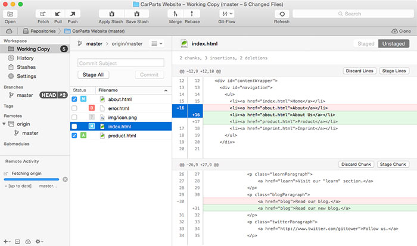
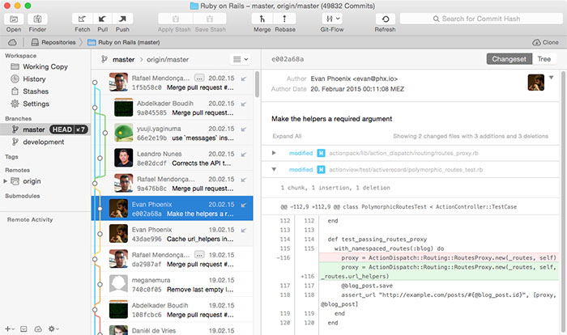
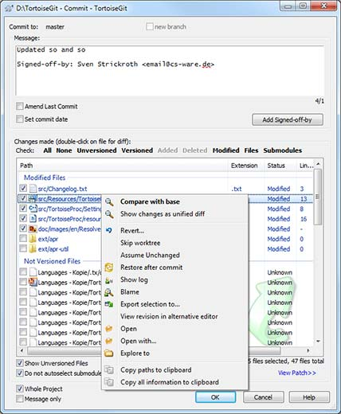
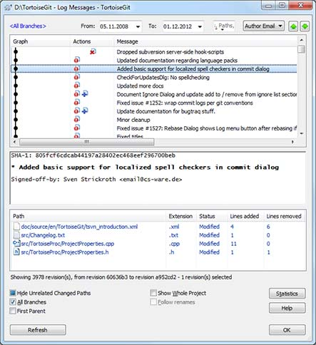
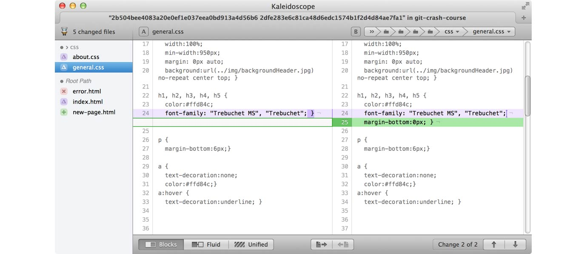

# Part 5 - 工具与服务

# Part 5 - 工具与服务

# 桌面应用程序

# 桌面应用程序

在学习这本书的过程中，你已经掌握了很多关于 Git 的命令。虽然这些是在学习过程中不可缺少的，但是版本控制的核心并不是让你学习所有的命令和参数。

当你掌握一些基本的概念，再加上一个带有用户图形界面的应用程序的帮助，就可以让你的日常工作变得更加简单。一个最大的好处就是它会为你提供了一个可视化的用户操作界面。 在桌面应用程序中，很多任务使用起来会更加容易和更方便。并且你也不需要记住那几十个繁琐的 Git 命令，包括它的语法和参数。

一个优秀的桌面应用程序会让你的工作更有效率，并且能够使你更有把握地运用所有 Git 提供的优秀功能。

## Mac OS X

Mac 用户应该尝试一下这个程序 [**Tower**](http://www.git-tower.com/?utm_source=learn-git&utm_medium=ebook-commandline&utm_campaign=learn-git)。这个桌面应用程序得到了很多个人软件开发者，甚至也包括和像苹果、谷歌、亚马逊、eBay 和 Twitter 等公司的青睐。 凭借它易于使用的用户界面，大大地降低了使用 Git 的复杂性。同时它还能更为完善地展现 Git 所有的先进功能。



状态视图（Status View）会为你显示出所有改动过的文件，它们发生了一个什么样的改动，以及哪些文件被暂存到下一个提交中了。



历史视图（history view）使用了一个经典的 “邮箱列表形式” 为你呈现出所有的提交。界面的下半部分同时也会为你显示出这个提交的详细信息，例如那些被整合文件的差异信息。

## Windows

Mac 用户可以看一下这个 [**Tortoise Git**](http://code.google.com/p/tortoisegit/)。



那些使用过 “Tortoise SVN” 的用户应该会熟悉这个应用程序。



所有的基本功能都可以很快速地上手。

# 比较和整合工具

# 比较和整合工具

要了解在项目中都发生了什么，你就需要检查发生的改动。由于改动过的文件会被表示为 “diff”，所以关键就是在于更好地理解这些改动差异。

尽管在命令行界面中可以非常简单地输出这些差异信息，但是要读懂这些信息还是很有难度的。

```
$ git diff
diff --git a/css/about.css b/css/about.css
index e69de29..4b5800f 100644
--- a/css/about.css
+++ b/css/about.css
@@ -0,0 +1,2 @@
+h1 {
+  line-height:30px; }
\ No newline at end of file
diff --git a/css/general.css b/css/general.css
index a3b8935..d472b7f 100644
--- a/css/general.css
+++ b/css/general.css
@@ -21,7 +21,8 @@ body {

 h1, h2, h3, h4, h5 {
   color:#ffd84c;
-  font-family: "Trebuchet MS", "Trebuchet"; }
+  font-family: "Trebuchet MS", "Trebuchet";
+  margin-bottom:0px; }

 p {
   margin-bottom:6px;}
diff --git a/error.html b/error.html
deleted file mode 100644
index 78alc33..0000000
--- a/error.html
+++ /dev/null
@@ -1,43 +0,0 @@
- <html>
- 
-   <head>
-     <title>Tower :: Imprint</title>
-     <link rel="shortcut icon" href="img/favicon.ico" />
-     <link type="text/css" href="css/general.css" />
-   </head>
- 
```

比较工具仅仅致力于一个单一的工作，那就是帮助你来更容易地理解这些差异。它会使用不同的颜色，特殊的格式，甚至是不同的布局（并排，组合单个列等等）来展现出不同文件中差异：



其中一些工具甚至还可以帮助你解决合并冲突。特别是在这种情况下，你很快就能体会到，它可以非常有效地帮助降低操作的复杂性并避免错误的产生。

今天，我们可以找到很多强大的比较工具。下面这个列表就为你列出了一些：

## Mac OS X

*   Kaleidoscope [www.kaleidoscopeapp.com](http://www.kaleidoscopeapp.com)
*   Araxis Merge: [www.araxis.com](http://www.araxis.com/merge)
*   DeltaWalker: [www.deltopia.com](http://www.deltopia.com/compare-merge-sync/macosx)

## Windows

*   Beyond Compare: [www.scootersoftware.com](http://www.scootersoftware.com)
*   Araxis Merge: [www.araxis.com](http://www.araxis.com/merge)
*   P4Merge: [www.perforce.com](http://www.perforce.com/product/components/perforce-visual-merge-and-diff-tools)

# 代码托管服务

# 代码托管服务

当你想要分享你代码给其他人，或者是你需要在另外一台电脑上工作时，托管代码就会是一个非常重要的话题。基本上代码托管有两种不同的形式： do-it-yourself（建立一个自己的）或者 leave-me-in-peace（使用第三方提供的平台，不麻烦自己)。

## (A) Do-It-Yourself

把你的 Git 仓库托管在你自己的服务器上会有很多的优点：

*   可以节省你花在代码托管服务上的费用。
*   你的代码只保存在你自己的服务器内部。
*   你会有很多自由发挥的空间。

当然这里也存在一些缺点：

*   你必须要保证服务器的正常的运行时间，用以确保它的可用性。
*   你必须要负责进行备份工作（这是一个非常重要且繁琐的工作）。
*   你必须要负责它的安全维护和更新。

最后，托管代码的最艰巨的任务并不是去管理那些 Git 仓库，而是对服务器本身的管理和维护。不要误会我的意思，我的本意并不是 “不要自己托管自己代码，而去使用一个现成代码托管服务”。我的本意是 “让你明白代码托管的真正含义”。 如果你有足够的经验和能力去完成它，那么托管你的代码仓库到你自己的服务器上会是最好的选择！

## (B) Leave-Me-In-Peace

对于大多数人来说，他们并不具备维护服务器的能力。虽然很多人都或多或少的地掌握一些理论上的知识，但是这还远远谈不上精通。 现在你可以找到几十个专门的代码托管服务供应商，它们可以为你提供比如服务器管理，备份，安全维护等等全方位的服务。为了让你能快速地了解这方面的信息，我们为你整理出了一个简短的列表。

### GitHub [www.github.com](http://www.github.com)

GitHub 是在 Git 的世界中最流行的代码托管服务。特别是对于开源项目， GitHub 是最值得推荐的平台。

### Beanstalk [www.beanstalkapp.com](http://www.beanstalkapp.com)

Beanstalk 不仅仅提供 Git 仓库的托管，而且它还支持 Subversion 项目。作为一个非常精简和可靠的服务供应商，Beanstalk 是企业级用户的最佳选择。

### Bitbucket [www.bitbucket.com](http://www.bitbucket.com)

除了对 Git 仓库支持外， Bitbucket 也同时支持对 Mercurial VCS 的托管。它有着和 GitHub 平台很类似的功能，但是在开放源代码世界中它并不像 GitHub 那样受欢迎。

### Plan.io [www.plan.io](http://www.plan.io)

Plan.io 提供了一个完整的项目管理平台。除了支持对 Git 和 Subversion 的代码托管之外，它还提供了模块化的任务管理，客户服务支持，甚至还集成了 Wiki。

# 更多学习资源

# 更多学习资源

近些年来出现了大量的关于 Git 的文档，教程和文章。我建议你浏览一下这些在线资源：

*   [命令速查表](https://www.git-tower.com/blog/git-cheat-sheet-cn)
*   ["Git - the Simple Guide"](http://rogerdudler.github.io/git-guide/)
*   ["Pro Git" ebook](http://git-scm.com/book)