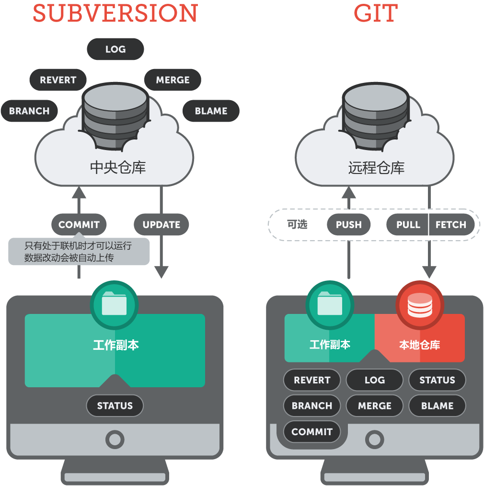

# 附录

# 附录

# 版本控制的最佳实践

# 版本控制的最佳实践

## 提交对映改动

一次提交要包括一个相关改动。例如，对于两个错误的修复应该进行两次不同的提交。精简的提交可以让其他的开发团队人员更简单地明白其改动的用义。如果其中一次提交的改动出现了问题，也可以方便地回滚到改动之前的状态。借助暂存功能来标记相关的改动文件，Git 可以为你打造出非常精准的提交。

## 频繁地提交改动

经常性地提交改动可以确保不会出现特别庞大的提交，同时也可以比较精准地对应到所需要的改动上。此外，通过频繁地提交也可以比较快速地和其他开发人员来共享你的改动。同样也会避免在整合代码时出现过多的合并冲突。相反的，非常庞大的提交会加大整合代码时出现冲突的风险，解决这些冲突也会非常复杂。

## 不要提交不完整的改动

虽然原则上来说不要提交一些还没有完成的改动，但是对于一个非常庞大的新功能来说，也并不意味着你必须整体完成这个功能后才可以提交。恰恰相反，你必须把那些改动正确地分割成一些有意义的逻辑模块来进行频繁地提交。如果你仅仅是因为急着想要下班，或者是想要得到一个干净的工作副本（比如想要切换到另一个分支上），你可以利用 Git 所提供的储藏（Stash）功能来解决这些问题。切记不要把那些不完整的改动提交到仓库中。

## 提交前测试那些改动

不要理所当然地认为自己完成的改动都是正确的。所有的改动一定要通过彻底地测试才表示它真正地被完成了。尽管这些改动可能仅仅是提交到了你的本地仓库中，只有你自己才能看到，但完整的测试同样是非常重要的，因为这些代码可能之后会被推送和共享到远程给其他的开发人员。

## 高质量的提交注释

提交注释的标题需要一个少于 50 个字符的简短说明。在一个空白的分割行之后要对改动的细节进行一个详细地描述。例如尝试着回答两个问题：出于什么原因需要进行这次修改？具体改动了些什么？为了和自动生成的提交注释保持一致（例如 git merge 可能会自动生成提交），一定要使用现在时祈使句（例如要使用 change ，而不要使用 changed 和 changes）。

## 版本控制不是备份系统

版本控制系统具有一个很强大的附带功能，那就是服务器端的备份功能。但是千万不要把 VCS 仅仅当成一个备份系统。特别需要注意的是，只能提交那些有意义的改动。VCS 不是用来备份文件用的。（请参阅 <提交对映改动>）

## 使用分支功能

分支是 Git 一个非常强大的功能，当然这不是偶然的。自始至终，Git 的宗旨就是提供一个即快速又简单的分支功能。它是一个优秀的工具，并且可以帮助解决开发人员在日常工作中存在的代码冲突的问题，因此分支功能应该广泛地被运用在不同的开发主题中。比如添加新功能，修复错误，尝试新的想法等等。

## 遵循一个工作流程

Git 可以支持很多不同的工作流程：长期分支、功能分支、合并以及 rebase、git-flow 等等。选择什么样的开发流程要取决如下一些因素：项目开发的类型，部署模式和（可能是最重要的）开发团队成员的个人习惯。不管怎样，选择什么样的流程都需要得到所有开发成员的一致认可，并且一直遵循它。

# 命令 101

# 命令 101

对于很多非专业人士来说，命令行界面（ CLI 、 Terminal、 bash 或者 shell）是高不可攀的，不敢轻易地染指。但是在能掌握一些最基本的操作之后，对这一领域的认识就会完全改变了。

## 打开命令行界面

在 Mac 上，最常见的应用命令行就是 “Terminal.app”。它会预装在每一个 Mac OS X 系统中。你可以在你的 “Applications” 目录中的子目录 “Utilities” 中启动它。

在 Windows 上，就是本书之前的安装指南中所提到应用程序 “Git Bash”。你可以在 windows 的开始菜单里的 “Git” 目录中找到它。

## 找到你自己的方法

顾名思义，命令行界面是用来执行各种命令的终端界面。你可以键入一些命令然后通过回车键来运行它。很多的命令都默认地依靠在你当前所处的位置，这里所说的 “位置” 就是指当前你所在的目录。 好的，让我们来执行一个命令来找出我们当前的位置吧：

```
$ pwd 
```

你可以很容易地记住这个命令，它代就表：“**p**rint（打印） **w**orking（工作） **d**irectory（目录）”。它将会返回给你当前你所位于的本地文件夹的路径。

对于切换当前的工作目录，你可以使用 “cd” 命令（这里的 “cd” 代表了 “**c**hange（切换）**d**irectory（目录）”）。例如向上移动一个目录（进入当前目录的上一层目录），你只需要执行：

```
$ cd .. 
```

移动到它下层的一个子目录，你可以执行：

```
$ cd name-of-subfolder/sub-subfolder/ 
```

你经常会看到一种特殊的路径符号：“~”。这个标志代表你的用户帐户的主文件目录。其实你并不需要每次都键入繁琐的用户名路径，比如 “cd /Users/your-username/projects/”，你可以简单地执行下面这个命令：

```
$ cd ~/projects/ 
```

另一个非常重要的命令就是 “ls”，它可以显示出当前目录中的内容。我建议你在使用这个命令时永远加上两个参数：“-l” 结构化的列表格式来输出内容；“-a” 显示出隐含文件 （这在版本控制系统中非常重要的）。显示当前目录的内容：

```
$ ls -la 
```

## 对文件的操作

很多重要的文件操作都可以非常方便地用命令来完成。

让我们来删除一个文件：

```
$ rm path/to/file.ext 
```

如果想要删除一个文件夹，你应该加上 “-r” 参数 （ r 代表了 “recursive（递归）”）：

```
$ rm -r path/to/folder 
```

移动一个文件是很简单的：

```
$ mv path/to/file.ext different/path/file.ext 
```

“mv” 命令也可以用来对一个文件进行重命名：

```
$ mv old-filename.ext new-filename.ext 
```

假如你不是要移动这个文件而是复制它，用 “cp” 命令来替换那个 “mv” 命令就可以了。

最后，你可以使用 “make directory” 命令来创建一个目录：

```
$ mkdir new-folder 
```

## 生成输出

命令行是无所不能的。它可以显示一个文件的内容，但是它却不可能像一个专业的文本编辑器那样方便。尽管如此，在某些时候它还是非常实用的。例如当你仅仅是想要进行一个快速的预览，或者当你正在远程服务器上工作时，GUI 应用程序并不支持的情况之下。

“cat” 命令会输出完整的文件内容：

```
$ cat file.ext 
```

同样的，“head” 命令只会显示文件的前 10 行，“tail” 会显示文件的后 10 行。和其它其他应用程序一样，你可以通过简单地滚动鼠标来继续显示。

“less” 命令在这方面就有点不同了。

```
$ less file.ext 
```

尽管它也可以用来显示文件内容，但是它能够控制页面流本身。也就是说，它只显示一个整页面的内容，然后等待你的明确指令。当显示的文件并不完整时，你会发现在屏幕的最后一行会显示出该文件的名称或者仅仅显示一个冒号（“:”），它会等待你的指令。敲击空格键可以向下翻页，“b” 可以向上翻页，“q” 可以退出 “less” 程序。

## 命令行让你的生活更容易

在用命令行工作时有一些小窍门可以让你使用起来更方便容易。

### TAB 键

当你输入文件或者目录（包括它的路径），利用 TAB 键就会非常方便。它会自动地把你的输入补全，这是非常有效率的。例如，如果你想要切换到一个不同的目录，你可以键入整个路径的每个字符：

```
$ cd ~/projects/acmedesign/documentation/ 
```

或者你也可以利用 TAB 键（自己尝试一下吧！）：

```
$ cd ~/pr[TAB]ojects/ac[TAB]medesign/doc[TAB]umentation/ 
```

如果你键入的字符是不明确的（因为 “dev” 可能是 “development” 或者是 “developers” 目录……），命令行应用就不可能自动补全你的输入。在这种情况下，你可以再一次敲击 TAB 来得到所有匹配的内容，并且借此可以再键入更多的字符。

### 方向键

命令行界面可以保存一些你最新执行过的命令。使用键盘上的向上键，你可以一个一个地调出你刚刚使用过的命令（从最近使用过开始）。使用键盘的向下键则反之。

### CTRL 键

在键入命令时使用 CTRL+A 可以移动光标到行首，使用 CTRL+E 可以移动光标到行末。 然而，并不是所有的命令都是通过简单的回车就可以完成的，有些需要你的进一步的指令。如果你被卡在一个命令的中间而你希望终止它时，可以使用 CTRL+C 强行终止这个命令。在大多数情况下这是安全的。但是还是要小心，中止某些命令可能会让系统处于不稳定的状态。

# 从 Subversion 过渡到 Git

# 从 Subversion 过渡到 Git

目前，想从 Subversion 过渡到 Git 其实并不困难，只要你不把 Git 和 Subversion 混淆就行。一旦你明白了两者在概念上的区别，这个改变的过程就会变得容易。

## 分布式与集中式

Subversion 是一个*集中式（centralized）*的版本控制系统。所有的开发团队成员都工作在单一的远程中央仓库上，当在这个中央仓库上进行 “签出（checkout）” 操作时，它就会在你的本地计算机上设置一个 “工作副本（working copy）”。这就是一个存储在你本地计算机上的一个特定版本的快照。



Git 是一个*分部式（distributed）*的版本控制系统，它有着一个不同的工作方式。相对于 Subversion 的 “签出（checkout）”，每一个 Git 用户会从远程仓库 “克隆（clone）” 出一个本地仓库。反过来说，一个用户会得到一个完整的仓库，而不仅仅只是一个工作副本。用户在本地计算机上拥有自己的仓库，并且包含所有的项目历史记录。 用户可以在自己的本地计算机上做任何想要操作，例如提交（commit），历史检查（inspect history），恢复到一个旧的版本等等。只有当你想要共享你的工作结果时，你才需要连接到远程服务器上。

## 仓库结构和 URLs

一个 Subversion 的仓库通常都是由几个目录组织起来的。“trunk” 目录对应你的开发主线，“branches” 目录对应那些特定的工作背景下的开发，而 “tags” 目录则用来标记一个特定的版本。它们都要通过自己的 URL 来指向到它在中央仓库中的具体位置：

```
svn+ssh://svn@example.com/svn/trunk 
```

Git 仓库就完全不一样了，它的组成完全就是一个在项目根目录下的 “.git” 文件夹。对分支和标记的查找完全依靠命令，而不是通过 URLs。Git 的 URL 只指向仓库的位置。

```
ssh://git@example.com/path/to/git-repo.git 
```

## 分支

正如刚才提到的， Subversion 的分支仅仅是一些有特殊含义的目录。在创建一个新的分支时，你只是把项目的当前状态完完整整地拷贝到这个新的分支目录中。

Git 的分支技术是它的设计核心，因此它拥有一个完全不同的概念。一个在 Git 中的分支就是一个指向一个特定版本的指针：不拷贝任何文件；不创建任何目录；没有任何额外的操作。 在 Git 中你 *永远* 工作在一个分支上，至少工作在那个系统默认创建的 “master” 分支上。在你的工作副本上只包括你当前的活动分支中的文件（ Git 称之为 “HEAD”）。 所有其他的版本和分支都被保存在你的本地仓库中， 并且随时都可以非常快速地恢复到一个旧的版本。 一定要记住 Git 的分布式特性：分支可以被发布到在远程服务器上，但是本地上的分支对于日常的工作更加重要。

## 提交

当你想要在 Subversion 中提交一个改动，有如下的一些规则：

*   你必须确保与中央仓库的连接。你不能进行离线提交。
*   提交的内容要立即存储在中央仓库中。
*   它会被分配一个递增版本号。

提交在 Git 中就是完全另外一种情况：

*   你没有必要连接到任何一个 “中央” 仓库，因为在你的计算机中就拥有一个完整的本地仓库。因此提交仅仅只记录在本地仓库上。它们不会自动地传递到远程仓库中，除非你自己决定共享这个改动。
*   文件的改动并不意味着它会被自动地包含在下一次提交中。你必须指明哪些改动你想要提交，并把它添加的所谓的 “暂存区（Staging Area）”中。你甚至可以只对文件的部分修改或是特定的几行代码进行提交，而其他部分则稍后提交。
*   “commit hashes” 替代了版本号码。由于提交都发生在开发人员的本地计算机上，你不可能给某个提交分配一个号码 #5，而另外一个分配 #6，这就产生了个问题，在分布式系统下谁是第一个提交呢？在 Git 中，每一个提交必须拥有一个唯一的 ID，因此一个哈希字符串就代替了那个依次递增的版本号。

## 分享工作

在 Subversion 中，在提交之后，你的工作会被自动地转移到中央仓库上去。只有在你连接到这个中央服务器时你才可以进行提交。

Git 不会自动上传任何东西。你可以自己决定，你的那些分支（也可能是所有分支）需要共享给你其他的团队成员。除此之外共享工作也是十分安全的。冲突只会出现在你的本地上，它决不可能发生在远程服务器上。这会让你有信心来解决冲突，因为你不会破坏远程仓库。

# 为什么选择 Git

# 为什么选择 Git

虽然市场上有几十种不同的版本控制系统，一些世界上最著名的项目（例如 Linux 内核， Ruby on Rails，或是 jQuery）都选择了使用 Git 作为它们的版本控制系统。为什么它们都选择 Git 呢？

## 节省时间

Git 运行快速。尽管我们在这里讨论的只是运行一个命令所需要的几秒钟，但是把它累积在你的日常工作中就是一个不小的飞跃了。它可以节省那些不必要的等待时间，并且去完成其它一些有意义的工作。

## 离线工作

当你不能联机远程中央仓库时你该怎么工作呢？对于一个像 Subversion 或者 CVS 的集中式版本控制系统来说，如果你没有连接到中央仓库，你就不能很好的工作。如果使用 Git ，几乎所有的东西都可以简单地在你的本地机器上完成。例如进行提交，查看你的项目历史，合并或者创建分支等等。至于在哪里工作？什么时候工作？ Git 不会给你施加任何限制。

## 撤销错误操作

每个人都会犯错，而使用 Git 的最大好处就在于，几乎在所有的情况下你都能 “撤消” 你的错误操作。比如如果你忘记了把一个小小的改动包含进来，因此你要改正你的上个提交。又或者你想要撤销一个完整的提交，因为这个功能有可能是不必要的。当发生了很严重的错误时，你甚至可以通过恢复引用日志来让一个提交不可见。你可以放心，Git 几乎很少真正地删除数据。

## 可靠性高

不用担忧，你不会在 Git 中搞砸任何东西，这种感觉是不是非常好？在你的 Git 项目中的每一个团队成员都克隆了整个项目在他们的本地计算机，这个本地克隆也可以看作一个完整的项目备份。除此之外， Git 上的操作几乎都是进行数据添加，几乎从不删除数据。这意味着丢失数据或是仓库损坏的情况几乎不可能发生。

## 让提交更有意义

只有包含了相关的改动的提交才有意义。想象一下，如果一个提交中包括一个新添加的功能 A ，还包括功能 B 的一部分改动，并且还存在一个对错误 C 的修复。这样其他的团队成员就很难理解这个提交的意图，而且当其中的一个改动出现了错误，撤销起来也非常麻烦。利用它独一无二的 “暂存区（staging area）” 概念，Git 可以帮助你打造很细微和精准的提交。你可以准确地判断哪些更改将被包含在你的下一个提交中，即使只是一行改动。Git 真正提高了对版本控制的实用性。

## 更高的自由度

当使用 Git 工作时，你可以定义一个对项目和团队有意义的工作流程。使用 Git 也不需要其它的要求。你可以连接多个远程仓库，使用 rebase 来替代合并，或者在需要时可以使用子模块。当然，你也可以简单地像 Subversion 那样仅仅使用一个远程的集中式仓库。无论你使用什么样的工作流程，它都有各种各样的优点。

## 避免混乱

关注点分离可以更明确地了解事情的进程。当你工作在功能 A 上时，不应该有任何人受到你未完成的代码的影响。如果那个功能是完全没有必要的话呢？或是完成了对它的一些改动提交后，你注意到你完全错了呢？分支功能就可以解决这些问题。当然其他版本控制系统也都有分支，但是 Git 真正的把它改进地更快速，更简单了。

## 顺应潮流

聪明的开发人员应该顺应潮流。Git 正在被越来越多的知名公司和开源项目所使用，如 Ruby On Rails，jQuery，Perl，Debian，Linux 内核等等。拥有一个大型的用户群体是一个很大优势，因为往往会存在很多系统去推动他的发展。大量的教程，工具和服务，这让 Git 更加具有吸引力。