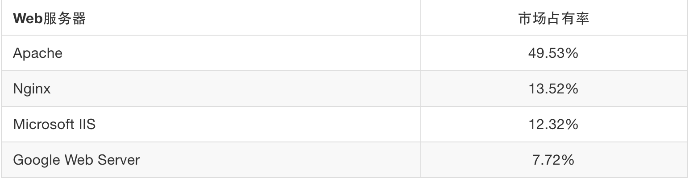
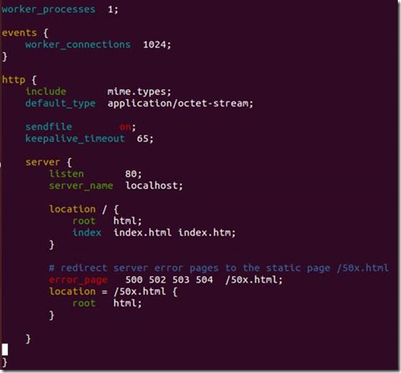
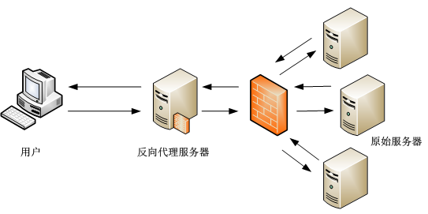
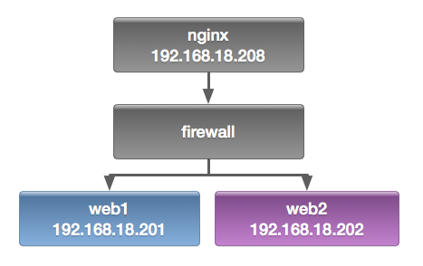
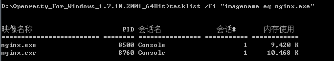
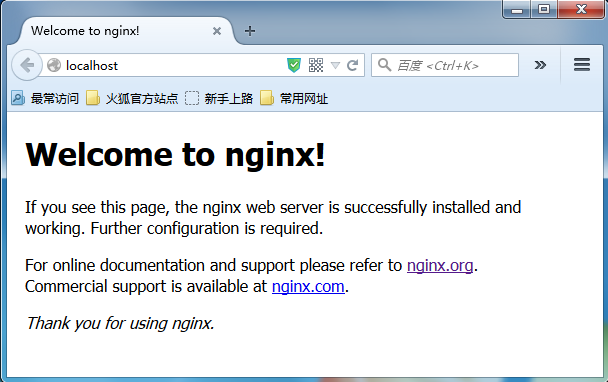
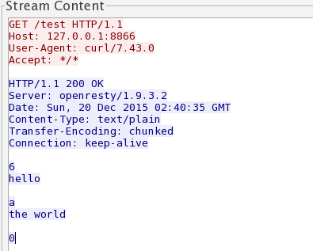
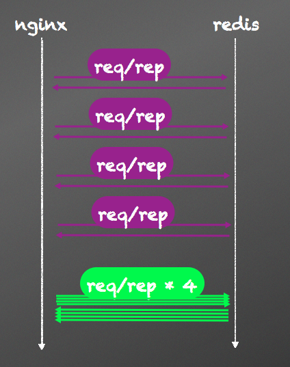

# Nginx

# Nginx

Nginx (“engine x”) 是一个高性能的 HTTP 和反向代理服务器，也是一个 IMAP/POP3/SMTP 代理服务器。Nginx 是由 Igor Sysoev 为俄罗斯著名的 Rambler.ru 站点开发的，第一个公开版本 0.1.0 发布于 2004 年 10 月 4 日。其将源代码以类 BSD 许可证的形式发布，因它的稳定性、丰富的功能集、示例配置文件和低系统资源的消耗而闻名。

由于 Nginx 使用基于事件驱动的架构，能够并发处理百万级别的 TCP 连接，高度模块化的设计和自由的许可证使得扩展 Nginx 功能的第三方模块层出不穷。因此其作为 web 服务器被广泛应用到大流量的网站上，包括淘宝、腾讯、新浪、京东等访问量巨大的网站。

2015 年 6 月，Netcraft 收到的调查网站有 8 亿多家，主流 Web 服务器市场份额（前四名）如下表： 

其中在访问量最多的一万个网站中，Nginx 的占有率已超过 Apache。

# Nginx 新手起步

# Nginx 新手起步

#### 为什选择 Nginx

为什么选择 Nginx？因为它具有以下特点：

1、处理响应请求很快

在正常的情况下，单次请求会得到更快的响应。在高峰期，Nginx 可以比其它的 Web 服务器更快的响应请求。

2、高并发连接

在互联网快速发展，互联网用户数量不断增加的今天，一些大公司、网站都需要面对高并发请求，如果有一个能够在峰值顶住 10 万以上并发请求的 Server，肯定会得到大家的青睐。理论上，Nginx 支持的并发连接上限取决于你的内存，10 万远未封顶。

3、低的内存消耗

在一般的情况下，10000 个非活跃的 HTTP Keep-Alive 连接在 Nginx 中仅消耗 2.5MB 的内存，这也是 Nginx 支持高并发连接的基础。

4、具有很高的可靠性：

Nginx 是一个高可靠性的 Web 服务器，这也是我们为什么选择 Nginx 的基本条件，现在很多的网站都在使用 Nginx，足以说明 Nginx 的可靠性。高可靠性来自其核心框架代码的优秀设计、模块设计的简单性，并且这些模块都非常的稳定。

5、高扩展性

Nginx 的设计极具扩展性，它完全是由多个不同功能、不同层次、不同类型且耦合度极低的模块组成。这种设计造就了 Nginx 庞大的第三方模块。

6、热部署

master 管理进程与 worker 工作进程的分离设计，使得 Nginx 具有热部署的功能，可以在 7×24 小时不间断服务的前提下，升级 Nginx 的可执行文件。也可以在不停止服务的情况下修改配置文件，更换日志文件等功能。

7、自由的 BSD 许可协议

BSD 许可协议不只是允许用户免费使用 Nginx，也允许用户修改 Nginx 源码，还允许用户用于商业用途。

#### 如何使用 Nginx

Nginx 安装：

不同系统依赖包可能不同，例如 pcre，zlib，openssl 等。

1.  获取 Nginx，在 [`nginx.org/en/download.html`](http://nginx.org/en/download.html) 上可以获取当前最新的版本。
2.  解压缩 nginx-xx.tar.gz 包。
3.  进入解压缩目录，执行 ./configure
4.  make & make install

若安装时找不到上述依赖模块，使用 --with-openssl=`<openssl_dir>`、--with-pcre=`<pcre_dir>`、--with-zlib=`<zlib_dir>` 指定依赖的模块目录。如已安装过，此处的路径为安装目录；若未安装，则此路径为编译安装包路径，nginx 将执行模块的默认编译安装。

启动 nginx 之后，浏览器中输入 [`localhost`](http://localhost) 可以验证是否安装启动成功。


Nginx 配置示例:

安装完成之后，配置目录 conf 下有以下配置文件，过滤掉了 xx.default 配置：

```
ubuntu: /opt/nginx-1.7.7/conf$ tree |grep -v default
.
├── fastcgi.conf
├── fastcgi_params
├── koi-utf
├── koi-win
├── mime.types
├── nginx.conf
├── scgi_params
├── uwsgi_params
└── win-utf 
```

除了 `nginx.conf`，其余配置文件，一般只需要使用默认提供即可。

nginx.conf 是主配置文件，默认配置去掉注释之后的内容如下图所示：

```
worker_process      # 表示工作进程的数量，一般设置为 cpu 的核数

worker_connections  # 表示每个工作进程的最大连接数

server{}            # 块定义了虚拟主机

    listen          # 监听端口

    server_name     # 监听域名

    location {}     # 是用来为匹配的 URI 进行配置，URI 即语法中的“/uri/”

    location /{}    # 匹配任何查询，因为所有请求都以 / 开头

        root        # 指定对应 uri 的资源查找路径，这里 html 为相对路径，完整路径为
                    # /opt/nginx-1.7.7/html/

        index       # 指定首页 index 文件的名称，可以配置多个，以空格分开。如有多
                    # 个，按配置顺序查找。 
```

> 真实用例



从配置可以看出，nginx 监听了 80 端口、域名为 localhost、根路径为 html 文件夹（我的安装路径为 /opt/nginx-1.7.7，所以 /opt/nginx-1.7.7/html）、默认 index 文件为 index.html，index.htm 服务器错误重定向到 50x.html 页面。

可以看到 /opt/nginx-1.7.7/html/ 有以下文件：

```
ubuntu:/opt/nginx-1.7.7/html$ ls
50x.html  index.html 
```

这也是上面在浏览器中输入 `http://localhost`，能够显示欢迎页面的原因。实际上访问的是 `/opt/nginx-1.7.7/html/index.html` 文件。

# location 匹配规则

# location 匹配规则

#### 语法规则

> location [=|~|~*|^~] /uri/ { … }

| 符号 | 含义 |
| --- | --- |
| = | 开头表示精确匹配 |
| ^~ | 开头表示 uri 以某个常规字符串开头，理解为匹配 url 路径即可。nginx 不对 url 做编码，因此请求为`/static/20%/aa`，可以被规则`^~ /static/ /aa`匹配到（注意是空格） |
| ~ | 开头表示区分大小写的正则匹配 |
| ~* | 开头表示不区分大小写的正则匹配 |
| / | 通用匹配，任何请求都会匹配到 |

多个 location 配置的情况下匹配顺序为（参考资料而来，还未实际验证，试试就知道了，不必拘泥，仅供参考）:

*   首先匹配 `=`
*   其次匹配 `^~`
*   其次是按文件中顺序的正则匹配
*   最后是交给 `/` 通用匹配
*   当有匹配成功时候，停止匹配，按当前匹配规则处理请求

例子，有如下匹配规则：

```
location = / {
   #规则 A
}
location = /login {
   #规则 B
}
location ^~ /static/ {
   #规则 C
}
location ~ \.(gif|jpg|png|js|css)$ {
   #规则 D
}
location ~* \.png$ {
   #规则 E
}
location / {
   #规则 F
} 
```

那么产生的效果如下：

*   访问根目录 `/`， 比如 `http://localhost/` 将匹配规则 A
*   访问 `http://localhost/login` 将匹配规则 B，`http://localhost/register` 则匹配规则 F
*   访问 `http://localhost/static/a.html` 将匹配规则 C
*   访问 `http://localhost/a.gif`, `http://localhost/b.jpg` 将匹配规则 D 和规则 E，但是规则 D 顺序优先，规则 E 不起作用，而 `http://localhost/static/c.png` 则优先匹配到规则 C
*   访问 `http://localhost/a.PNG` 则匹配规则 E，而不会匹配规则 D，因为规则 E 不区分大小写。

访问 `http://localhost/category/id/1111` 则最终匹配到规则 F，因为以上规则都不匹配，这个时候应该是 nginx 转发请求给后端应用服务器，比如 FastCGI（php），tomcat（jsp），nginx 作为反向代理服务器存在。

所以实际使用中，笔者觉得至少有三个匹配规则定义，如下：

```
# 直接匹配网站根，通过域名访问网站首页比较频繁，使用这个会加速处理，官网如是说。
# 这里是直接转发给后端应用服务器了，也可以是一个静态首页
# 第一个必选规则
location = / {
    proxy_pass http://tomcat:8080/index
}

# 第二个必选规则是处理静态文件请求，这是 nginx 作为 http 服务器的强项
# 有两种配置模式，目录匹配或后缀匹配，任选其一或搭配使用
location ^~ /static/ {
    root /webroot/static/;
}
location ~* \.(gif|jpg|jpeg|png|css|js|ico)$ {
    root /webroot/res/;
}

# 第三个规则就是通用规则，用来转发动态请求到后端应用服务器
# 非静态文件请求就默认是动态请求，自己根据实际把握
# 毕竟目前的一些框架的流行，带.php、.jsp 后缀的情况很少了
location / {
    proxy_pass http://tomcat:8080/
} 
```

#### ReWrite 语法

*   last – 基本上都用这个 Flag
*   break – 中止 Rewirte，不在继续匹配
*   redirect – 返回临时重定向的 HTTP 状态 302
*   permanent – 返回永久重定向的 HTTP 状态 301

1、下面是可以用来判断的表达式：

```
-f 和 !-f 用来判断是否存在文件
-d 和 !-d 用来判断是否存在目录
-e 和 !-e 用来判断是否存在文件或目录
-x 和 !-x 用来判断文件是否可执行 
```

2、下面是可以用作判断的全局变量

```
例：http://localhost:88/test1/test2/test.php?k=v
$host：localhost
$server_port：88
$request_uri：/test1/test2/test.php?k=v
$document_uri：/test1/test2/test.php
$document_root：D:\nginx/html
$request_filename：D:\nginx/html/test1/test2/test.php 
```

#### Redirect 语法

```
server {
    listen 80;
    server_name start.igrow.cn;
    index index.html index.php;
    root html;
    if ($http_host !~ “^star\.igrow\.cn$") {
        rewrite ^(.*) http://star.igrow.cn$1 redirect;
    }
} 
```

#### 防盗链

```
location ~* \.(gif|jpg|swf)$ {
    valid_referers none blocked start.igrow.cn sta.igrow.cn;
    if ($invalid_referer) {
       rewrite ^/ http://$host/logo.png;
    }
} 
```

#### 根据文件类型设置过期时间

```
location ~* \.(js|css|jpg|jpeg|gif|png|swf)$ {
    if (-f $request_filename) {
        expires 1h;
        break;
    }
} 
```

#### 禁止访问某个目录

```
location ~* \.(txt|doc)${
    root /data/www/wwwroot/linuxtone/test;
    deny all;
} 
```

一些可用的全局变量，可以参考获取 Nginx 内置绑定变量章节。

# if 是邪恶的

# if 是邪恶的

当在 location 区块中使用 if 指令的时候会有一些问题, 在某些情况下它并不按照你的预期运行而是做一些完全不同的事情。 而在另一些情况下他甚至会出现段错误。 一般来说避免使用 if 指令是个好主意。

在 location 区块里 if 指令下唯一 100% 安全的指令应该只有:

> return …; rewrite … last;

除此以外的指令都可能导致不可预期的行为, 包括诡异的发出段错误信号 (SIGSEGV)。

要着重注意的是 if 的行为不是反复无常的, 给出两个条件完全一致的请求, Nginx 并不会出现一个正常工作而一个请求失败的随机情况, 在明晰的测试和理解下 if 是完全可用的。尽管如此, 在这里还是建议使用其他指令。

总有一些情况你无法避免去使用 if 指令, 比如你需要测试一个变量, 而它没有相应的配置指令。

```
if ($request_method = POST) {
    return 405;
}
if ($args ~ post=140){
    rewrite ^ http://example.com/ permanent;
} 
```

#### 如何替换掉 if

使用 try_files 如果他适合你的需求。 在其他的情况下使用 `return …` 或者 `rewrite … last`。 还有一些情况可能要把 if 移动到 server 区块下(只有当其他的 rewrite 模块指令也允许放在的地方才是安全的)。

如下可以安全地改变用于处理请求的 location。

```
location / {
    error_page 418 = @other;
    recursive_error_pages on;

    if ($something) {
        return 418;
    }

    # some configuration
    # ...
}

location @other {
    # some other configuration
    # ...
} 
```

在某些情况下使用嵌入脚本模块(嵌入 perl 或者其他一些第三方模块)处理这些脚本更佳。

以下是一些例子用来解释为什么 if 是邪恶的。 非专业人士, 请勿模仿!

```
# 这里收集了一些出人意料的坑爹配置来展示 location 中的 if 指令是万恶的

# 只有第二个 header 才会在响应中展示
# 这不是 Bug, 只是他的处理流程如此

location /only-one-if {
    set $true 1;

    if ($true) {
        add_header X-First 1;
    }

    if ($true) {
        add_header X-Second 2;
    }

    return 204;
}

# 因为 if, 请求会在未改变 uri 的情况下下发送到后台的 '/'

location /proxy-pass-uri {
    proxy_pass http://127.0.0.1:8080/;

    set $true 1;

    if ($true) {
        # nothing
    }
}

# 因为 if, try_files 失效

location /if-try-files {
    try_files  /file  @fallback;

    set $true 1;

    if ($true) {
        # nothing
    }
}

# nginx 将会发出段错误信号(SIGSEGV)

location /crash {

    set $true 1;

    if ($true) {
        # fastcgi_pass here
        fastcgi_pass  127.0.0.1:9000;
    }

    if ($true) {
        # no handler here
    }
}

# alias with captures isn't correcly inherited into implicit nested location created by if
# alias with captures 不能正确的继承到由 if 创建的隐式嵌入的 location

location ~* ^/if-and-alias/(?<file>.*) {
    alias /tmp/$file;

    set $true 1;

    if ($true) {
        # nothing
    }
} 
```

#### 为什么会这样且到现在都没修复这些问题?

if 指令是 rewrite 模块中的一部分, 是实时生效的指令。另一方面来说, nginx 配置大体上是陈述式的。在某些时候用户出于特殊是需求的尝试, 会在 if 里写入一些非 rewrite 指令, 这直接导致了我们现处的情况。 大多数情况下他可以工作, 但是…看看上面。 看起来唯一正确的修复方式是完全禁用 if 中的非 rewrite 指令。 但是这将破坏很多现有可用的配置, 所以还没有修复。

#### 如果你还是想知道该如何使用 if

如果你看完了上面所有内容还是想使用 if，请确认你确实理解了该怎么用它。一些比较基本的用法可以在[这里](http://agentzh.blogspot.jp/2011/03/how-nginx-location-if-works.html)找到。

##### 做适当的测试

我已经警告过你了!

> 文章选自：[`xwsoul.com/posts/761`](http://xwsoul.com/posts/761) TODO:这个文章后面需要自己翻译，可能有版权问题：[`www.nginx.com/resources/wiki/start/topics/depth/ifisevil/`](https://www.nginx.com/resources/wiki/start/topics/depth/ifisevil/)

# 静态文件服务

# Nginx 静态文件服务

我们先来看看最简单的本地静态文件服务配置示例：

```
server {
        listen       80;
        server_name www.test.com;
        charset utf-8;
        root   /data/www.test.com;
        index  index.html index.htm;
       } 
```

就这些？恩，就这些！如果只是提供简单的对外静态文件，它真的就可以用了。可是他不完美，远远没有发挥 Nginx 的半成功力，为什么这么说呢，看看下面的配置吧，为了大家看着方便，我们把每一项的作用都做了注释。

```
http {
    # 这个将为打开文件指定缓存，默认是没有启用的，max 指定缓存数量，
    # 建议和打开文件数一致，inactive 是指经过多长时间文件没被请求后删除缓存。
    open_file_cache max=204800 inactive=20s;

    # open_file_cache 指令中的 inactive 参数时间内文件的最少使用次数，
    # 如果超过这个数字，文件描述符一直是在缓存中打开的，如上例，如果有一个
    # 文件在 inactive 时间内一次没被使用，它将被移除。
    open_file_cache_min_uses 1;

    # 这个是指多长时间检查一次缓存的有效信息
    open_file_cache_valid 30s;

    # 默认情况下，Nginx 的 gzip 压缩是关闭的， gzip 压缩功能就是可以让你节省不
    # 少带宽，但是会增加服务器 CPU 的开销哦，Nginx 默认只对 text/html 进行压缩 ，
    # 如果要对 html 之外的内容进行压缩传输，我们需要手动来设置。
    gzip on;
    gzip_min_length 1k;
    gzip_buffers 4 16k;
    gzip_http_version 1.0;
    gzip_comp_level 2;
    gzip_types text/plain application/x-javascript text/css application/xml;

    server {
            listen       80;
            server_name www.test.com;
            charset utf-8;
            root   /data/www.test.com;
            index  index.html index.htm;
           }
} 
```

我们都知道，应用程序和网站一样，其性能关乎生存。但如何使你的应用程序或者网站性能更好，并没有一个明确的答案。代码质量和架构是其中的一个原因，但是在很多例子中我们看到，你可以通过关注一些十分基础的应用内容分发技术（basic application delivery techniques），来提高终端用户的体验。其中一个例子就是实现和调整应用栈（application stack）的缓存。

#### 文件缓存漫谈

一个 web 缓存坐落于客户端和原始服务器（origin server）中间，它保留了所有可见内容的拷贝。如果一个客户端请求的内容在缓存中存储，则可以直接在缓存中获得该内容而不需要与服务器通信。这样一来，由于 web 缓存距离客户端“更近”，就可以提高响应性能，并更有效率的使用应用服务器，因为服务器不用每次请求都进行页面生成工作。

在浏览器和应用服务器之间，存在多种潜在缓存，如：客户端浏览器缓存、中间缓存、内容分发网络（CDN）和服务器上的负载平衡和反向代理。缓存，仅在反向代理和负载均衡的层面，就对性能提高有很大的帮助。

举个例子说明，去年，我接手了一项任务，这项任务的内容是对一个加载缓慢的网站进行性能优化。首先引起我注意的事情是，这个网站差不多花费了超过 1 秒钟才生成了主页。经过一系列调试，我发现加载缓慢的原因在于页面被标记为不可缓存，即为了响应每一个请求，页面都是动态生成的。由于页面本身并不需要经常性的变更，并且不涉及个性化，那么这样做其实并没有必要。为了验证一下我的结论，我将页面标记为每 5 秒缓存一次，仅仅做了这一个调整，就能明显的感受到性能的提升。第一个字节到达的时间降低到几毫秒，同时页面的加载明显要更快。

并不是只有大规模的内容分发网络（CDN）可以在使用缓存中受益——缓存还可以提高负载平衡器、反向代理和应用服务器前端 web 服务的性能。通过上面的例子，我们看到，缓存内容结果，可以更高效的使用应用服务器，因为不需要每次都去做重复的页面生成工作。此外，Web 缓存还可以用来提高网站可靠性。当服务器宕机或者繁忙时，比起返回错误信息给用户，不如通过配置 Nginx 将已经缓存下来的内容发送给用户。这意味着，网站在应用服务器或者数据库故障的情况下，可以保持部分甚至全部的功能运转。

下面讨论如何安装和配置 Nginx 的基础缓存（Basic Caching）。

#### 如何安装和配置基础缓存

我们只需要两个命令就可以启用基础缓存： [proxy_cache_path](http://nginx.org/en/docs/http/ngx_http_proxy_module.html#proxy_cache_path) 和 [proxy_cache](http://nginx.org/en/docs/http/ngx_http_proxy_module.html#proxy_cache) 。proxy_cache_path 用来设置缓存的路径和配置，proxy_cache 用来启用缓存。

```
proxy_cache_path/path/to/cache levels=1:2 keys_zone=my_cache:10m max_size=10g inactive=60m
use_temp_path=off;

server {
    ...
    location / {
        proxy_cache my_cache;
        proxy_pass http://my_upstream;
    }

} 
```

proxy_cache_path 命令中的参数及对应配置说明如下：

1.  用于缓存的本地磁盘目录是 /path/to/cache/
2.  levels 在 /path/to/cache/ 设置了一个两级层次结构的目录。将大量的文件放置在单个目录中会导致文件访问缓慢，所以针对大多数部署，我们推荐使用两级目录层次结构。如果 levels 参数没有配置，则 Nginx 会将所有的文件放到同一个目录中。
3.  keys_zone 设置一个共享内存区，该内存区用于存储缓存键和元数据，有些类似计时器的用途。将键的拷贝放入内存可以使 Nginx 在不检索磁盘的情况下快速决定一个请求是`HIT`还是`MISS`，这样大大提高了检索速度。一个 1MB 的内存空间可以存储大约 8000 个 key，那么上面配置的 10MB 内存空间可以存储差不多 80000 个 key。
4.  max_size 设置了缓存的上限（在上面的例子中是 10G）。这是一个可选项；如果不指定具体值，那就是允许缓存不断增长，占用所有可用的磁盘空间。当缓存达到这个上线，处理器便调用 cache manager 来移除最近最少被使用的文件，这样把缓存的空间降低至这个限制之下。
5.  inactive 指定了项目在不被访问的情况下能够在内存中保持的时间。在上面的例子中，如果一个文件在 60 分钟之内没有被请求，则缓存管理将会自动将其在内存中删除，不管该文件是否过期。该参数默认值为 10 分钟（10m）。注意，非活动内容有别于过期内容。 Nginx 不会自动删除由缓存控制头部指定的过期内容（本例中 Cache-Control:max-age=120）。过期内容只有在 inactive 指定时间内没有被访问的情况下才会被删除。如果过期内容被访问了，那么 Nginx 就会将其从原服务器上刷新，并更新对应的 inactive 计时器。
6.  Nginx 最初会将注定写入缓存的文件先放入一个临时存储区域，use_temp_path=off 命令指示 Nginx 将在缓存这些文件时将它们写入同一个目录下。我们强烈建议你将参数设置为 off 来避免在文件系统中不必要的数据拷贝。use_temp_path 在 Nginx 1.7 版本和 Nginx Plus R6 中有所介绍。

最终，proxy_cache 命令启动缓存那些 URL 与 location 部分匹配的内容（本例中，为`/`）。你同样可以将 proxy_cache 命令添加到 server 部分，这将会将缓存应用到所有的那些 location 中未指定自己的 proxy_cache 命令的服务中。

#### 陈旧总比没有强

Nginx 内容缓存的一个非常强大的特性是：当无法从原始服务器获取最新的内容时， Nginx 可以分发缓存中的陈旧（stale，编者注：即过期内容）内容。这种情况一般发生在关联缓存内容的原始服务器宕机或者繁忙时。比起对客户端传达错误信息， Nginx 可发送在其内存中的陈旧的文件。 Nginx 的这种代理方式，为服务器提供额外级别的容错能力，并确保了在服务器故障或流量峰值的情况下的正常运行。为了开启该功能，只需要添加 [proxy_cache_use_stale](http://nginx.org/en/docs/http/ngx_http_proxy_module.html?&_ga=1.14624247.1568941527.1438257987#proxy_cache_use_stale) 命令即可：

```
location / {
    ...
    proxy_cache_use_stale error timeout http_500 http_502 http_503 http_504;
} 
```

按照上面例子中的配置，当 Nginx 收到服务器返回的 error，timeout 或者其他指定的 5xx 错误，并且在其缓存中有请求文件的陈旧版本，则会将这些陈旧版本的文件而不是错误信息发送给客户端。

#### 缓存微调

Nginx 提供了丰富的可选项配置用于缓存性能的微调。下面是使用了几个配置的例子：

```
proxy_cache_path /path/to/cache levels=1:2 keys_zone=my_cache:10m max_size=10g inactive=60m
use_temp_path=off;
server {
    ...
    location / {
        proxy_cache my_cache;
        proxy_cache_revalidate on;
        proxy_cache_min_uses 3;
        proxy_cache_use_stale error timeout updating http_500 http_502 http_503 http_504;
        proxy_cache_lock on;
        proxy_pass http://my_upstream;
    }
} 
```

这些命令配置了下列的行为：

1.  [proxy_cache_revalidate](http://nginx.org/r/proxy_cache_revalidate?_ga=1.80437143.1235345339.1438303904) 指示 Nginx 在刷新来自服务器的内容时使用 GET 请求。如果客户端的请求项已经被缓存过了，但是在缓存控制头部中定义为过期，那么 Nginx 就会在 GET 请求中包含 If-Modified-Since 字段，发送至服务器端。这项配置可以节约带宽，因为对于 Nginx 已经缓存过的文件，服务器只会在该文件请求头中 Last-Modified 记录的时间内被修改时才将全部文件一起发送。
2.  [proxy_cache_min_uses](http://nginx.org/r/proxy_cache_min_uses?_ga=1.82886422.1235345339.1438303904) 该指令设置同一链接请求达到几次即被缓存，默认值为 1 。当缓存不断被填满时，这项设置便十分有用，因为这确保了只有那些被经常访问的内容会被缓存。
3.  [proxy_cache_use_stale](http://nginx.org/en/docs/http/ngx_http_proxy_module.html?&_ga=1.13131319.1235345339.1438303904#proxy_cache_use_stale) 中的 updating 参数告知 Nginx 在客户端请求的项目的更新正在原服务器中下载时发送旧内容，而不是向服务器转发重复的请求。第一个请求陈旧文件的用户不得不等待文件在原服务器中更新完毕。陈旧的文件会返回给随后的请求直到更新后的文件被全部下载。 4.当 [proxy_cache_lock](http://nginx.org/en/docs/http/ngx_http_proxy_module.html?&_ga=1.86844376.1568941527.1438257987#proxy_cache_lock) 被启用时，当多个客户端请求一个缓存中不存在的文件（或称之为一个 MISS），只有这些请求中的第一个被允许发送至服务器。其他请求在第一个请求得到满意结果之后在缓存中得到文件。如果不启用 proxy_cache_lock，则所有在缓存中找不到文件的请求都会直接与服务器通信。

#### 跨多硬盘分割缓存

使用 Nginx 不需要建立一个 RAID（磁盘阵列）。如果有多个硬盘， Nginx 可以用来在多个硬盘之间分割缓存。下面是一个基于请求 URI 跨越两个硬盘之间均分缓存的例子：

```
proxy_cache_path /path/to/hdd1 levels=1:2 keys_zone=my_cache_hdd1:10m max_size=10g

inactive=60m use_temp_path=off;
proxy_cache_path /path/to/hdd2 levels=1:2 keys_zone=my_cache_hdd2:10m max_size=10g inactive=60m use_temp_path=off;
split_clients $request_uri $my_cache {
    50% "my_cache_hdd1";
    50% "my_cache_hdd2";
}

server {
    ...
    location / {
        proxy_cache $my_cache;
        proxy_pass http://my_upstream;
    }
} 
```

# 日志

# 日志

Nginx 日志主要有两种：access_log(访问日志) 和 error_log(错误日志)。

### access_log 访问日志

access_log 主要记录客户端访问 Nginx 的每一个请求，格式可以自定义。通过 access_log 你可以得到用户地域来源、跳转来源、使用终端、某个 URL 访问量等相关信息。

log_format 指令用于定义日志的格式，语法: `log_format name string;` 其中 name 表示格式名称，string 表示定义的格式字符串。log_format 有一个默认的无需设置的组合日志格式。

> 默认的无需设置的组合日志格式

```
log_format combined '$remote_addr - $remote_user  [$time_local]  '
                    ' "$request"  $status  $body_bytes_sent  '
                    ' "$http_referer"  "$http_user_agent" '; 
```

access_log 指令用来指定访问日志文件的存放路径（包含日志文件名）、格式和缓存大小，语法：`access_log path [format_name [buffer=size | off]];` 其中 path 表示访问日志存放路径，format_name 表示访问日志格式名称，buffer 表示缓存大小，off 表示关闭访问日志。

> log_format 使用事例：在 access.log 中记录客户端 IP 地址、请求状态和请求时间

```
log_format myformat '$remote_addr  $status  $time_local';
access_log logs/access.log  myformat; 
```

需要注意的是：log_format 配置必须放在 http 内，否则会出现警告。Nginx 进程设置的用户和组必须对日志路径有创建文件的权限，否则，会报错。

定义日志使用的字段及其作用：

| 字段 | 作用 |
| --- | --- |
| $remote_addr 与$http_x_forwarded_for | 记录客户端 IP 地址 |
| $remote_user | 记录客户端用户名称 |
| $request | 记录请求的 URI 和 HTTP 协议 |
| $status | 记录请求状态 |
| $body_bytes_sent | 发送给客户端的字节数，不包括响应头的大小 |
| $bytes_sent | 发送给客户端的总字节数 |
| $connection | 连接的序列号 |
| $connection_requests | 当前通过一个连接获得的请求数量 |
| $msec | 日志写入时间。单位为秒，精度是毫秒 |
| $pipe | 如果请求是通过 HTTP 流水线(pipelined)发送，pipe 值为“p”，否则为“.” |
| $http_referer | 记录从哪个页面链接访问过来的 |
| $http_user_agent | 记录客户端浏览器相关信息 |
| $request_length | 请求的长度（包括请求行，请求头和请求正文） |
| $request_time | 请求处理时间，单位为秒，精度毫秒 |
| $time_iso8601 | ISO8601 标准格式下的本地时间 |
| $time_local | 记录访问时间与时区 |

## error_log 错误日志

error_log 主要记录客户端访问 Nginx 出错时的日志，格式不支持自定义。通过查看错误日志，你可以得到系统某个服务或 server 的性能瓶颈等。因此，将日志利用好，你可以得到很多有价值的信息。

error_log 指令用来指定错误日志，语法: `error_log path level`; 其中 path 表示错误日志存放路径，level 表示错误日志等级，日志等级包括 debug、info、notice、warn、error、crit，从左至右，日志详细程度逐级递减，即 debug 最详细，crit 最少，默认为 crit。

注意：`error_log off` 并不能关闭错误日志记录，此时日志信息会被写入到文件名为 off 的文件当中。如果要关闭错误日志记录，可以使用如下配置：

> Linux 系统把存储位置设置为空设备

```
 error_log /dev/null;

http {
    # ...
} 
```

> Windows 系统把存储位置设置为空设备

```
 error_log nul;

http {
    # ...
} 
```

另外 Linux 系统可以使用 tail 命令方便的查阅正在改变的文件,`tail -f filename`会把 filename 里最尾部的内容显示在屏幕上,并且不断刷新,使你看到最新的文件内容。Windows 系统没有这个命令，你可以在网上找到动态查看文件的工具。

# 反向代理

# 反向代理

#### 什么是反向代理

**反向代理**（Reverse Proxy）方式是指用代理服务器来接受 internet 上的连接请求，然后将请求转发给内部网络上的服务器，并将从服务器上得到的结果返回给 internet 上请求连接的客户端，此时代理服务器对外就表现为一个反向代理服务器。

举个例子，一个用户访问 [`www.example.com/readme`](http://www.example.com/readme)，但是 www.example.com 上并不存在 readme 页面，它是偷偷从另外一台服务器上取回来，然后作为自己的内容返回给用户。但是用户并不知情这个过程。对用户来说，就像是直接从 www.example.com 获取 readme 页面一样。这里所提到的 www.example.com 这个域名对应的服务器就设置了反向代理功能。

反向代理服务器，对于客户端而言它就像是原始服务器，并且客户端不需要进行任何特别的设置。客户端向反向代理的命名空间(name-space)中的内容发送普通请求，接着反向代理将判断向何处(原始服务器)转交请求，并将获得的内容返回给客户端，就像这些内容原本就是它自己的一样。如下图所示：



#### 反向代理典型应用场景

反向代理的典型用途是将防火墙后面的服务器提供给 Internet 用户访问，加强安全防护。反向代理还可以为后端的多台服务器提供负载均衡，或为后端较慢的服务器提供 **缓冲** 服务。另外，反向代理还可以启用高级 URL 策略和管理技术，从而使处于不同 web 服务器系统的 web 页面同时存在于同一个 URL 空间下。

Nginx 的其中一个用途是做 HTTP 反向代理，下面简单介绍 Nginx 作为反向代理服务器的方法。

> 场景描述：访问本地服务器上的 README.md 文件 [`localhost/README.md`](http://localhost/README.md)，本地服务器进行反向代理，从 [`github.com/moonbingbing/openresty-best-practices/blob/master/README.md`](https://github.com/moonbingbing/openresty-best-practices/blob/master/README.md) 获取页面内容。

nginx.conf 配置示例：

```
worker_processes 1;

pid logs/nginx.pid;
error_log logs/error.log warn;

events {
    worker_connections 3000;
}

http {
    include mime.types;
    server_tokens off;

    ## 下面配置反向代理的参数
    server {
        listen    80;

        ## 1\. 用户访问 http://ip:port，则反向代理到 https://github.com
        location / {
            proxy_pass  https://github.com;
            proxy_redirect     off;
            proxy_set_header   Host             $host;
            proxy_set_header   X-Real-IP        $remote_addr;
            proxy_set_header   X-Forwarded-For  $proxy_add_x_forwarded_for;
        }

        ## 2.用户访问 http://ip:port/README.md，则反向代理到
        ##   https://github.com/.../README.md
        location /README.md {
            proxy_set_header  X-Real-IP  $remote_addr;
            proxy_set_header X-Forwarded-For $proxy_add_x_forwarded_for;
            proxy_pass https://github.com/moonbingbing/openresty-best-practices/blob/master/README.md;
        }
    }
} 
```

成功启动 nginx 后，我们打开浏览器，验证下反向代理的效果。在浏览器地址栏中输入 `localhost/README.md`，返回的结果是我们 github 源代码的 README 页面。如下图：


我们只需要配置一下 nginx.conf 文件，不用写任何 web 页面，就可以偷偷地从别的服务器上读取一个页面返回给用户。

下面我们来看一下 nginx.conf 里用到的配置项：

（1）location

location 项对请求 URI 进行匹配，location 后面配置了匹配规则。例如上面的例子中，如果请求的 URI 是 `localhost/`，则会匹配 `location /` 这一项；如果请求的 URI 是 `localhost/README.md`，则会比配 `location /README.md` 这项。

上面这个例子只是针对一个确定的 URI 做了反向代理，有的读者会有疑惑：如果对每个页面都进行这样的配置，那将会大量重复，能否做 **批量** 配置呢？此时需要配合使用 location 的正则匹配功能。具体实现方法可参考本书的 URL 匹配章节。

（2）proxy_pass

proxy_pass 后面跟着一个 URL，用来将请求反向代理到 URL 参数指定的服务器上。例如我们上面例子中的 `proxy_pass https://github.com`，则将匹配的请求反向代理到 `https://github.com`。

（3）proxy_set_header

默认情况下，反向代理不会转发原始请求中的 Host 头部，如果需要转发，就需要加上这句：`proxy_set_header Host $host;`

除了上面提到的常用配置项，还有 proxy_redirect、proxy_set_body、proxy_limit_rate 等参数，具体用法可以到[Nginx 官网](http://nginx.org/en/docs/http/ngx_http_proxy_module.html)查看。

#### 正向代理

既然有反向代理，自然也有正向代理。简单来说，正向代理就像一个跳板，例如一个用户访问不了某网站（例如 `www.google.com`），但是他能访问一个代理服务器，这个代理服务器能访问 `www.google.com`，于是用户可以先连上代理服务器，告诉它需要访问的内容，代理服务器去取回来返回给用户。例如一些常见的翻墙工具、游戏代理就是利用正向代理的原理工作的，我们需要在这些正向代理工具上配置服务器的 IP 地址等信息。

# 负载均衡

# 负载均衡

负载均衡（Load balancing）是一种计算机网络技术，用来在多个计算机（计算机集群）、网络连接、CPU、磁盘驱动器或其他资源中分配负载，以达到最佳化资源使用、最大化吞吐率、最小化响应时间、同时避免过载的目的。

使用带有负载均衡的多个服务器组件，取代单一的组件，可以通过冗余提高可靠性。负载均衡服务通常是由专用软体和硬件来完成。

负载均衡最重要的一个应用是利用多台服务器提供单一服务，这种方案有时也称之为服务器农场。通常，负载均衡主要应用于 Web 网站，大型的 Internet Relay Chat 网络，高流量的文件下载网站，NNTP（Network News Transfer Protocol）服务和 DNS 服务。现在负载均衡器也开始支持数据库服务，称之为数据库负载均衡器。

对于互联网服务，负载均衡器通常是一个软体程序，这个程序侦听一个外部端口，互联网用户可以通过这个端口来访问服务，而作为负载均衡器的软体会将用户的请求转发给后台内网服务器，内网服务器将请求的响应返回给负载均衡器，负载均衡器再将响应发送到用户，这样就向互联网用户隐藏了内网结构，阻止了用户直接访问后台（内网）服务器，使得服务器更加安全，可以阻止对核心网络栈和运行在其它端口服务的攻击。

当所有后台服务器出现故障时，有些负载均衡器会提供一些特殊的功能来处理这种情况。例如转发请求到一个备用的负载均衡器、显示一条关于服务中断的消息等。负载均衡器使得 IT 团队可以显著提高容错能力。它可以自动提供大量的容量以处理任何应用程序流量的增加或减少。

负载均衡在互联网世界中的作用如此重要，本章我们一起了解一下 Nginx 是如何帮我们完成 HTTP 协议负载均衡的。

#### upstream 负载均衡概要

配置示例，如下：

```
upstream test.net{
    ip_hash;
    server 192.168.10.13:80;
    server 192.168.10.14:80  down;
    server 192.168.10.15:8009  max_fails=3  fail_timeout=20s;
    server 192.168.10.16:8080;
}
server {
    location / {
        proxy_pass  http://test.net;
    }
} 
```

upstream 是 Nginx 的 HTTP Upstream 模块，这个模块通过一个简单的调度算法来实现客户端 IP 到后端服务器的负载均衡。在上面的设定中，通过 upstream 指令指定了一个负载均衡器的名称 test.net。这个名称可以任意指定，在后面需要用到的地方直接调用即可。

##### upstream 支持的负载均衡算法

Nginx 的负载均衡模块目前支持 6 种调度算法，下面进行分别介绍，其中后两项属于第三方调度算法。

*   轮询（默认）：每个请求按时间顺序逐一分配到不同的后端服务器，如果后端某台服务器宕机，故障系统被自动剔除，使用户访问不受影响。Weight 指定轮询权值，Weight 值越大，分配到的访问机率越高，主要用于后端每个服务器性能不均的情况下。
*   ip_hash：每个请求按访问 IP 的 hash 结果分配，这样来自同一个 IP 的访客固定访问一个后端服务器，有效解决了动态网页存在的 session 共享问题。
*   fair：这是比上面两个更加智能的负载均衡算法。此种算法可以依据页面大小和加载时间长短智能地进行负载均衡，也就是根据后端服务器的响应时间来分配请求，响应时间短的优先分配。Nginx 本身是不支持 fair 的，如果需要使用这种调度算法，必须下载 Nginx 的 upstream_fair 模块。
*   url_hash：此方法按访问 url 的 hash 结果来分配请求，使每个 url 定向到同一个后端服务器，可以进一步提高后端缓存服务器的效率。Nginx 本身是不支持 url_hash 的，如果需要使用这种调度算法，必须安装 Nginx 的 hash 软件包。
*   least_conn：最少连接负载均衡算法，简单来说就是每次选择的后端都是当前最少连接的一个 server(这个最少连接不是共享的，是每个 worker 都有自己的一个数组进行记录后端 server 的连接数)。
*   hash：这个 hash 模块又支持两种模式 hash, 一种是普通的 hash, 另一种是一致性 hash(consistent)。

##### upstream 支持的状态参数

在 HTTP Upstream 模块中，可以通过 server 指令指定后端服务器的 IP 地址和端口，同时还可以设定每个后端服务器在负载均衡调度中的状态。常用的状态有：

*   down：表示当前的 server 暂时不参与负载均衡。
*   backup：预留的备份机器。当其他所有的非 backup 机器出现故障或者忙的时候，才会请求 backup 机器，因此这台机器的压力最轻。
*   max_fails：允许请求失败的次数，默认为 1。当超过最大次数时，返回 proxy_next_upstream 模块定义的错误。
*   fail_timeout：在经历了 max_fails 次失败后，暂停服务的时间。max_fails 可以和 fail_timeout 一起使用。

当负载调度算法为 ip_hash 时，后端服务器在负载均衡调度中的状态不能是 backup。

##### 配置 nginx 负载均衡



> Nginx 配置负载均衡

```
upstream webservers {
    server 192.168.18.201 weight=1;
    server 192.168.18.202 weight=1;
}
server {
    listen       80;
    server_name  localhost;
    #charset koi8-r;
    #access_log  logs/host.access.log  main;
    location / {
        proxy_pass      http://webservers;
        proxy_set_header  X-Real-IP  $remote_addr;
    }
} 
```

注，upstream 是定义在 `server{ }` 之外的，不能定义在 `server{ }` 内部。定义好 upstream 之后，用 proxy_pass 引用一下即可。

> 重新加载一下配置文件

```
# service nginx reload
nginx: the configuration file /etc/nginx/nginx.conf syntax is ok
nginx: configuration file /etc/nginx/nginx.conf test is successful 
```

```
# curl http://192.168.18.208
web1.test.com
# curl http://192.168.18.208
web2.test.com
# curl http://192.168.18.208
web1.test.com
# curl http://192.168.18.208
web2.test.com 
```

注，大家可以不断的刷新浏览的内容，可以发现 web1 与 web2 是交替出现的，达到了负载均衡的效果。

> 查看一下 Web 访问服务器日志

Web1:

```
# tail /var/log/nginx/access_log
192.168.18.138 - - [04/Sep/2013:09:41:58 +0800] "GET / HTTP/1.0" 200 23 "-"
192.168.18.138 - - [04/Sep/2013:09:41:58 +0800] "GET / HTTP/1.0" 200 23 "-"
192.168.18.138 - - [04/Sep/2013:09:41:59 +0800] "GET / HTTP/1.0" 200 23 "-"
192.168.18.138 - - [04/Sep/2013:09:41:59 +0800] "GET / HTTP/1.0" 200 23 "-"
192.168.18.138 - - [04/Sep/2013:09:42:00 +0800] "GET / HTTP/1.0" 200 23 "-"
192.168.18.138 - - [04/Sep/2013:09:42:00 +0800] "GET / HTTP/1.0" 200 23 "-"
192.168.18.138 - - [04/Sep/2013:09:42:00 +0800] "GET / HTTP/1.0" 200 23 "-"
192.168.18.138 - - [04/Sep/2013:09:44:21 +0800] "GET / HTTP/1.0" 200 23 "-"
192.168.18.138 - - [04/Sep/2013:09:44:22 +0800] "GET / HTTP/1.0" 200 23 "-"
192.168.18.138 - - [04/Sep/2013:09:44:22 +0800] "GET / HTTP/1.0" 200 23 "-" 
```

Web2:

先修改一下，Web 服务器记录日志的格式。

```
# LogFormat "%{X-Real-IP}i %l %u %t \"%r\" %>s %b \"%{Referer}i\" \"%{User-Agent}i\"" combined
# tail /var/log/nginx/access_log
192.168.18.138 - - [04/Sep/2013:09:50:28 +0800] "GET / HTTP/1.0" 200 23 "-"
192.168.18.138 - - [04/Sep/2013:09:50:28 +0800] "GET / HTTP/1.0" 200 23 "-"
192.168.18.138 - - [04/Sep/2013:09:50:28 +0800] "GET / HTTP/1.0" 200 23 "-"
192.168.18.138 - - [04/Sep/2013:09:50:28 +0800] "GET / HTTP/1.0" 200 23 "-"
192.168.18.138 - - [04/Sep/2013:09:50:28 +0800] "GET / HTTP/1.0" 200 23 "-"
192.168.18.138 - - [04/Sep/2013:09:50:28 +0800] "GET / HTTP/1.0" 200 23 "-"
192.168.18.138 - - [04/Sep/2013:09:50:28 +0800] "GET / HTTP/1.0" 200 23 "-"
192.168.18.138 - - [04/Sep/2013:09:50:28 +0800] "GET / HTTP/1.0" 200 23 "-"
192.168.18.138 - - [04/Sep/2013:09:50:29 +0800] "GET / HTTP/1.0" 200 23 "-"
192.168.18.138 - - [04/Sep/2013:09:50:29 +0800] "GET / HTTP/1.0" 200 23 "-" 
```

注，大家可以看到，两台服务器日志都记录是 192.168.18.138 访问的日志，也说明了负载均衡配置成功。

##### 配置 nginx 进行健康状态检查

利用 max_fails、fail_timeout 参数，控制异常情况，示例配置如下：

```
upstream webservers {
    server 192.168.18.201 weight=1 max_fails=2 fail_timeout=2;
    server 192.168.18.202 weight=1 max_fails=2 fail_timeout=2;
} 
```

重新加载一下配置文件:

```
# service nginx reload
nginx: the configuration file /etc/nginx/nginx.conf syntax is ok
nginx: configuration file /etc/nginx/nginx.conf test is successful
重新载入 nginx：                                           [确定] 
```

先停止 Web1，进行测试：

```
# service nginx stop
停止 nginx：                                               [确定] 
```

```
# curl http://192.168.18.208
web2.test.com
# curl http://192.168.18.208
web2.test.com
# curl http://192.168.18.208
web2.test.com 
```

注，大家可以看到，现在只能访问 Web2，再重新启动 Web1，再次访问一下。

```
# service nginx start
正在启动 nginx：                                           [确定] 
```

```
# curl http://192.168.18.208
web1.test.com
# curl http://192.168.18.208
web2.test.com
# curl http://192.168.18.208
web1.test.com
# curl http://192.168.18.208
web2.test.com 
```

PS：大家可以看到，现在又可以重新访问，说明 nginx 的健康状态查检配置成功。但大家想一下，如果不幸的是所有服务器都不能提供服务了怎么办，用户打开页面就会出现出错页面，那么会带来用户体验的降低，所以我们能不能像配置 LVS 是配置 sorry_server 呢，答案是可以的，但这里不是配置 sorry_server 而是配置 backup。

##### 配置 backup 服务器

> 备份服务器配置：

```
server {
    listen 8080;
    server_name localhost;
    root /data/www/errorpage;
    index index.html;
} 
```

> index.html 文件内容：

```
# cat index.html

# Sorry...... 
```

> 负载均衡配置：

```
upstream webservers {
    server 192.168.18.201 weight=1 max_fails=2 fail_timeout=2;
    server 192.168.18.202 weight=1 max_fails=2 fail_timeout=2;
    server 127.0.0.1:8080 backup;
} 
```

重新加载配置文件：

```
# service nginx reload
nginx: the configuration file /etc/nginx/nginx.conf syntax is ok
nginx: configuration file /etc/nginx/nginx.conf test is successful
重新载入 nginx：                                           [确定] 
```

关闭 Web 服务器并进行测试：

```
# service nginx stop
停止 nginx：                                               [确定] 
```

进行测试：

```
# curl http://192.168.18.208

# Sorry......

# curl http://192.168.18.208

# Sorry......

# curl http://192.168.18.208

# Sorry...... 
```

注，大家可以看到，当所有服务器都不能工作时，就会启动备份服务器。好了，backup 服务器就配置到这里，下面我们来配置 ip_hash 负载均衡。

##### 配置 ip_hash 负载均衡

ip_hash：每个请求按访问 IP 的 hash 结果分配，这样来自同一个 IP 的访客固定访问一个后端服务器，有效解决了动态网页存在的 session 共享问题，电子商务网站用的比较多。

```
# vim /etc/nginx/nginx.conf
upstream webservers {
    ip_hash;
    server 192.168.18.201 weight=1 max_fails=2 fail_timeout=2;
    server 192.168.18.202 weight=1 max_fails=2 fail_timeout=2;
    #server 127.0.0.1:8080 backup;
} 
```

注，当负载调度算法为 ip_hash 时，后端服务器在负载均衡调度中的状态不能有 backup。有人可能会问，为什么呢？大家想啊，如果负载均衡把你分配到 backup 服务器上，你能访问到页面吗？不能，所以了不能配置 backup 服务器。

重新加载一下服务器：

```
# service nginx reload
nginx: the configuration file /etc/nginx/nginx.conf syntax is ok
nginx: configuration file /etc/nginx/nginx.conf test is successful
重新载入 nginx：                                           [确定] 
```

测试一下：

```
# curl http://192.168.18.208
web2.test.com
# curl http://192.168.18.208
web2.test.com
# curl http://192.168.18.208
web2.test.com 
```

注，大家可以看到，你不断的刷新页面一直会显示 Web2，说明 ip_hash 负载均衡配置成功。

# 陷阱和常见错误

# Nginx 陷阱和常见错误

翻译自：[`www.Nginx.com/resources/wiki/start/topics/tutorials/config_pitfalls/`](https://www.Nginx.com/resources/wiki/start/topics/tutorials/config_pitfalls/)

> ### 警告：
> 
> **请阅读下面所有的内容！是所有的！**

不管是新手还是老用户，都可能会掉到一个陷阱中去。下面我们会列出一些我们经常看到，和 经常需要解释如何解决的问题。在 Freenode 的 Nginx IRC 频道中，我们频繁的看到这些问题出现。

### 本指南说

最经常看到的是，有人从一些其他的指南中，尝试拷贝、粘贴一个配置片段。并不是说其他所有的指南都是错的，但是里面错误的比例很可怕。即使是在 Linode 库中也有质量较差的信息，一些 Nginx 社区成员曾经徒劳的试图去纠正。

本指南的文档，是社区成员所创建和审查，他们直接和所有类型的 Nginx 用户在一起工作。 这个特定的文档之所以存在，是因为社区成员看到有大量普遍和重复出现的问题。

### 我的问题没有被列出来

在这里你没有看到和你具体问题相关的东西。也许我们并没有解决你经历的具体问题。 不要只是大概浏览下这个网页，也不要假设你是无意才找到这里的。你找到这里，是因为这里列出了你做错的一些东西。

在许多问题上，当涉及到支持很多用户，社区成员不希望去支持破碎的配置。所以在提问求助前，先修复你的配置。 通读这个文档来修复你的配置，不要只是走马观花。

### chmod 777

**永远不要** 使用 777，这可能是一个漂亮的数字，有时候可以懒惰的解决权限问题， 但是它同样也表示你没有线索去解决权限问题，你只是在碰运气。 你应该检查整个路径的权限，并思考发生了什么事情。

要轻松的显示一个路径的所有权限，你可以使用：

```
 namei -om /path/to/check 
```

### 把 root 放在 location 区块内

糟糕的配置：

```
server {
    server_name www.example.com;
    location / {
        root /var/www/Nginx -default/;
        # [...]
      }
    location /foo {
        root /var/www/Nginx -default/;
        # [...]
    }
    location /bar {
        root /var/www/Nginx -default/;
        # [...]
    }
} 
```

这个是能工作的。把 root 放在 location 区块里面会工作，但并不是完全有效的。 错就错在只要你开始增加其他的 location 区块，就需要给每一个 location 区块增加一个 root 。 如果没有添加，就会没有 root 。让我们看下正确的配置。

推荐的配置：

```
server {
    server_name www.example.com;
    root /var/www/Nginx -default/;
    location / {
        # [...]
    }
    location /foo {
        # [...]
    }
    location /bar {
        # [...]
    }
} 
```

### 重复的 index 指令

糟糕的配置：

```
http {
    index index.php index.htm index.html;
    server {
        server_name www.example.com;
        location / {
            index index.php index.htm index.html;
            # [...]
        }
    }
    server {
        server_name example.com;
        location / {
            index index.php index.htm index.html;
            # [...]
        }
        location /foo {
            index index.php;
            # [...]
        }
    }
} 
```

为什么重复了这么多行不需要的配置呢？简单的使用“index”指令一次就够了。只需要把它放到 `http {}` 区块里面，下面的就会继承这个配置。

推荐的配置：

```
http {
    index index.php index.htm index.html;
    server {
        server_name www.example.com;
        location / {
            # [...]
        }
    }
    server {
        server_name example.com;
        location / {
            # [...]
        }
        location /foo {
            # [...]
        }
    }
} 
```

### 使用 if

这里篇幅有限，只介绍一部分使用 if 指令的陷阱。更多陷阱你应该点击看看邪恶的 if 指令。 我们看下 if 指令的几个邪恶的用法。

> **注意看这里**：
> 
> 邪恶的 if 指令

#### 用 if 判断 Server Name

糟糕的配置：

```
server {
    server_name example.com *.example.com;
        if ($host ~* ^www\.(.+)) {
            set $raw_domain $1;
            rewrite ^/(.*)$ $raw_domain/$1 permanent;
        }
        # [...]
    }
} 
```

这个配置有三个问题。首先是 if 的使用, 为啥它这么糟糕呢? 你有阅读邪恶的 if 指令吗? 当 Nginx 收到无论来自哪个子域名的何种请求, 不管域名是 www.example.com 还是 example.com，这个 if 指令 **总是** 会被执行。 因此 Nginx 会检查 **每个请求** 的 Host header，这是十分低效的。 你应该避免这种情况，而是使用下面配置里面的两个 server 指令。

推荐的配置：

```
 server {
    server_name www.example.com;
    return 301 $scheme://example.com$request_uri;
}
server {
    server_name example.com;
    # [...]
} 
```

除了增强了配置的可读性，这种方法还降低了 Nginx 的处理要求；我们摆脱了不必要的 if 指令； 我们用了 $scheme 来表示 URI 中是 http 还是 https 协议，避免了硬编码。

#### 用 if 检查文件是否存在

使用 if 指令来判断文件是否存在是很可怕的，如果你在使用新版本的 Nginx ， 你应该看看 try_files，这会让你的生活变得更轻松。

糟糕的配置：

```
server {
    root /var/www/example.com;
    location / {
        if (!-f $request_filename) {
            break;
        }
    }
} 
```

推荐的配置：

```
server {
    root /var/www/example.com;
    location / {
        try_files $uri $uri/ /index.html;
    }
} 
```

我们不再尝试使用 if 来判断$uri 是否存在，用 try_files 意味着你可以测试一个序列。 如果 $uri 不存在，就会尝试 $uri/ ，还不存在的话，在尝试一个回调 location 。

在上面配置的例子里面，如果 $uri 这个文件存在，就正常服务； 如果不存在就检测 $uri/ 这个目录是否存在；如果不存在就按照 index.html 来处理，你需要保证 index.html 是存在的。 try_files 的加载是如此简单。这是另外一个你可以完全的消除 if 指令的实例。

### 前端控制器模式的 web 应用

“前端控制器模式”是流行的设计，被用在很多非常流行的 PHP 软件包里面。 里面的很多示例配置都过于复杂。想要 Drupal, Joomla 等运行起来，只用这样做就可以了：

```
try_files $uri $uri/ /index.php?q=$uri&$args; 
```

注意：你实际使用的软件包，在参数名字上会有差异。比如：

*   "q"参数用在 Drupal, Joomla, WordPress
*   "page"用在 CMS Made Simple

一些软件甚至不需要查询字符串，它们可以从 REQUEST_URI 中读取。 比如 WordPress 就支持这样的配置：

```
try_files $uri $uri/ /index.php; 
```

当然在你的开发中可能会有变化，你可能需要基于你的需要设置更复杂的配置。 但是对于一个基础的网站来说，这个配置可以工作得很完美。 你应该永远从简单开始来搭建你的系统。

如果你不关心目录是否存在这个检测的话，你也可以决定忽略这个目录的检测，去掉 “$uri/” 这个配置。

### 把不可控制的请求发给 PHP

很多网络上面推荐的和 PHP 相关的 Nginx 配置，都是把每一个 .php 结尾的 URI 传递给 PHP 解释器。 请注意，大部分这样的 PHP 设置都有严重的安全问题，因为它可能允许执行任意第三方代码。

有问题的配置通常如下：

```
location ~* \.php$ {
    fastcgi_pass backend;
    # [...]
} 
```

在这里，每一个.php 结尾的请求，都会传递给 FastCGI 的后台处理程序。 这样做的问题是，当完整的路径未能指向文件系统里面一个确切的文件时， 默认的 PHP 配置试图是猜测你想执行的是哪个文件。

举个例子，如果一个请求中的 `/forum/avatar/1232.jpg/file.php` 文件不存在， 但是`/forum/avatar/1232.jpg`存在，那么 PHP 解释器就会取而代之， 使用`/forum/avatar/1232.jpg`来解释。如果这里面嵌入了 PHP 代码， 这段代码就会被执行起来。

有几个避免这种情况的选择：

*   在`php.ini`中设置`cgi.fix_pathinfo=0`。 这会让 PHP 解释器只尝试给定的文件路径，如果没有找到这个文件就停止处理。

*   确保 Nginx 只传递指定的 PHP 文件去执行

```
location ~* (file_a|file_b|file_c)\.php$ {
    fastcgi_pass backend;
    # [...]
} 
```

*   对于任何用户可以上传的目录，特别的关闭 PHP 文件的执行权限

```
location /uploaddir {
    location ~ \.php$ {return 403;}
    # [...]
} 
```

*   使用 *try_files* 指令过滤出文件不存在的情况

```
location ~* \.php$ {
    try_files $uri =404;
    fastcgi_pass backend;
    # [...]
} 
```

*   使用嵌套的 location 过滤出文件不存在的情况

```
location ~* \.php$ {
    location ~ \..*/.*\.php$ {return 404;}
    fastcgi_pass backend;
    # [...]
} 
```

### 脚本文件名里面的 FastCGI 路径

很多外部指南喜欢依赖绝对路径来获取你的信息。这在 PHP 的配置块里面很常见。 当你从仓库安装 Nginx ，通常都是以在配置里面折腾好“include fastcgi_params;”来收尾。 这个配置文件位于你的 Nginx 根目录下，通常在 `/etc/Nginx/` 里面。

推荐的配置：

```
fastcgi_param  SCRIPT_FILENAME    $document_root$fastcgi_script_name; 
```

糟糕的配置：

```
fastcgi_param  SCRIPT_FILENAME    /var/www/yoursite.com/$fastcgi_script_name; 
```

$document_root$ 在哪里设置呢？它是 server 块里面的 root 指令来设置的。 你的 root 指令不在 server 块内？请看前面关于 root 指令的陷阱。

### 费力的 rewrites

不要知难而退， rewrite 很容易和正则表达式混为一谈。 实际上， rewrite 是很容易的，我们应该努力去保持它们的整洁。 很简单，不添加冗余代码就行了。

糟糕的配置：

```
rewrite ^/(.*)$ http://example.com/$1 permanent; 
```

好点儿的配置：

```
rewrite ^ http://example.com$request_uri? permanent; 
```

更好的配置：

```
return 301 http://example.com$request_uri; 
```

反复对比下这几个配置。 第一个 rewrite 捕获不包含第一个斜杠的完整 URI 。 使用内置的变量 $request_uri ，我们可以有效的完全避免任何捕获和匹配。

### 忽略 http:// 的 rewrite

这个非常简单， rewrites 是用相对路径的，除非你告诉 Nginx 不是相对路径。 生成绝对路径的 rewrite 也很简单，加上 scheme 就行了。

糟糕的配置：

```
rewrite ^ example.com permanent; 
```

推荐的配置：

```
rewrite ^ http://example.com permanent; 
```

你可以看到我们做的只是在 rewrite 里面增加了 `http://`。这个很简单而且有效。

### 代理所有东西

糟糕的配置：

```
server {
    server_name _;
    root /var/www/site;
    location / {
        include fastcgi_params;
        fastcgi_param SCRIPT_FILENAME $document_root$fastcgi_script_name;
        fastcgi_pass unix:/tmp/phpcgi.socket;
    }
} 
```

这个是令人讨厌的配置，你把 **所有东西** 都丢给了 PHP 。 为什么呢？ Apache 可能要这样做，但在 Nginx 里你不必这样。 换个思路，try_files 有一个神奇之处，它是按照特定顺序去尝试文件的。 这意味着 Nginx 可以先尝试下静态文件，如果没有才继续往后走。 这样 PHP 就不用参与到这个处理中，会快很多。 特别是如果你提供一个 1MB 图片数千次请求的服务，通过 PHP 处理还是直接返回静态文件呢？ 让我们看下怎么做到吧。

推荐的配置：

```
server {
    server_name _;
    root /var/www/site;
    location / {
        try_files $uri $uri/ @proxy;
    }
    location @proxy {
        include fastcgi_params;
        fastcgi_param SCRIPT_FILENAME $document_root$fastcgi_script_name;
        fastcgi_pass unix:/tmp/phpcgi.socket;
    }
} 
```

另外一个推荐的配置：

```
server {
    server_name _;
    root /var/www/site;
    location / {
        try_files $uri $uri/ /index.php;
    }
    location ~ \.php$ {
        include fastcgi_params;
        fastcgi_param SCRIPT_FILENAME $document_root$fastcgi_script_name;
        fastcgi_pass unix:/tmp/phpcgi.socket;
    }
} 
```

这个很容易，不是吗？你看，如果请求的 URI 存在， Nginx 会处理掉； 如果不存在，检查下目录是不是存在，是的话也可以被 Nginx 处理； 只有在 Nginx 不能直接处理请求的 URI 的时候，才会进入 proxy 这个 location 来处理。

现在，考虑下你的请求中有多少静态内容，比如图片、css、javascript 等。这可能会帮你节省很多开销。

### 配置的修改没有起效

浏览器缓存。你的配置可能是对的，但怎么尝试结果总是不对，百思不得其解。 罪魁祸首是你的浏览器缓存。当你下载东西的时候，浏览器做了缓存。

怎么修复：

*   在 Firefox 里面 Ctrl+Shift+Delete ，检查缓存，点击立即清理。可以用你喜欢的搜索引擎找到其他浏览器清理缓存的方法。 每次更改配置后，都需要清理下缓存（除非你知道这个不必要），这会省很多事儿。

*   使用 curl 。

### VirtualBox

如果你在 VirtualBox 的虚拟机中运行 Nginx ，而它不工作，可能是因为 sendfile() 引起的麻烦。 只用简单的注释掉 sendfile 指令，或者设置为 off。 该指令大都会写在 Nginx .conf 文件中：

```
 sendfile off; 
```

### 丢失（消失）的 HTTP 头

如果你没有明确的设置 underscores_in_headers on; , Nginx 将会自动丢弃带有下划线的 HTTP 头(根据 HTTP 标准，这样做是完全正当的). 这样做是为了防止头信息映射到 CGI 变量时产生歧义，因为破折号和下划线都会被映射为下划线。

### 没有使用标准的 Document Root Location

在所有的文件系统中，一些目录永远也不应该被用做数据的托管。这些目录包括 / 和 /root 。 你永远不应该使用这些目录作为你的 document root。

使用这些目录的话，等于打开了潘多拉魔盒，请求会超出你的预期获取到隐私的数据。

**永远也不要这样做！！！** ( 对，我们还是要看下飞蛾扑火的配置长什么样子)

```
server {
    root /;

    location / {
        try_files /web/$uri $uri @php;
    }

    location @php {
        [...]
    }
} 
```

当一个对 /foo 的请求，会传递给 PHP 处理，因为文件没有找到。 这可能没有问题，直到遇到 /etc/passwd 这个请求。没错，你刚才给了我们这台服务器的所有用户列表。 在某些情况下， Nginx 的 workers 甚至是 root 用户运行的。那么，我们现在有你的用户列表， 以及密码哈希值，我们也知道哈希的方法。这台服务器已经变成我们的肉鸡了。

Filesystem Hierarchy Standard (FHS) 定义了数据应该如何存在。你一定要去阅读下。 简单点儿说，你应该把 web 的内容 **放在 /var/www/ , /srv 或者 /usr/share/www 里面**。

### 使用默认的 Document Root

在 Ubuntu、 Debian 等操作系统中， Nginx 会被封装成一个易于安装的包， 里面通常会提供一个“默认”的配置文件作为范例，也通常包含一个 document root 来保存基础的 HTML 文件。

大部分这些打包系统，并没有检查默认的 document root 里面的文件是否修改或者存在。 在包升级的时候，可能会导致代码失效。有经验的系统管理员都知道，不要假设默认的 document root 里面的数据在升级的时候会原封不动。

你不应该使用默认的 document root 做网站的任何关键文件的目录。 并没有默认的 document root 目录会保持不变这样的约定，你网站的关键数据， 很可能在更新和升级系统提供的 Nginx 包时丢失。

### 使用主机名来解析地址

糟糕的配置：

```
upstream {
    server http://someserver;
}

server {
    listen myhostname:80;
    # [...]
} 
```

你不应该在 listen 指令里面使用使用主机名。 虽然这样可能是有效的，但它会带来层出不穷的问题。 其中一个问题是，这个主机名在启动时或者服务重启中不能解析。 这会导致 Nginx 不能绑定所需的 TCP socket 而启动失败。

一个更安全的做法是使用主机名对应 IP 地址，而不是主机名。 这可以防止 Nginx 去查找 IP 地址，也去掉了去内部、外部解析程序的依赖。

例子中的 upstream location 也有同样的问题，虽然有时候在 upstream 里面不可避免要使用到主机名， 但这是一个不好的实践，需要仔细考虑以防出现问题。

推荐的配置：

```
upstream {
    server http://10.48.41.12;
}

server {
    listen 127.0.0.16:80;
    # [...]
} 
```

### 在 HTTPS 中使用 SSLv3

由于 SSLv3 的 [POODLE 漏洞](https://www.openssl.org/~bodo/ssl-poodle.pdf)， 建议不要在开启 SSL 的网站使用 SSLv3。 你可以简单粗暴的直接禁止 SSLv3， 用 TLS 来替代：

```
ssl_protocols TLSv1 TLSv1.1 TLSv1.2; 
```

# 环境搭建

# 环境搭建

实践的前提是搭建环境，本节的几个小节将介绍在几种常见操作平台上 OpenResty 的安装。

为了降低用户安装门槛，对于不同系统安装，部分章节存在比较大的重复内容。读者只需要选择自己需要的平台并尝试安装即可。除了 windows 版本是以二进制发行，其他平台由于系统自身的兼容性，推荐的都是源码编译方式。

在 OpenResty 的规划路线中，准备发行独立的 `opm` 安装工具（截止到目前，目前还没完成，名称可能依然会变），帮会我们完成从环境到周边库的下载、更新。

# Windows 平台

# Windows 平台安装

1、下载 Windows 版的 OpenResty 压缩包，这里我下载的是 openresty_for_windows_1.7.10.2001_64bit ，你也可以选择 32bit 的版本。如果你对源码感兴趣，下面是源码地址 [`github.com/LomoX-Offical/nginx-openresty-windows`](https://github.com/LomoX-Offical/nginx-openresty-windows)。

2、解压到要安装的目录，这里我选择 D 盘根目录，你可以根据自己的喜好选择位置。

3、进入到 openresty_for_windows_1.7.10.2001_64bit 目录，双击执行 nginx.exe 或者使用命令 start nginx 启动 nginx，如果没有错误现在 nginx 已经开始运行了。

4、验证 nginx 是否成功启动：

*   使用 `tasklist /fi "imagename eq nginx.exe"` 命令查看 nginx 进程，其中一个是 master 进程，另一个是 worker 进程，如下图：

    

*   在浏览器的地址栏输入 localhost，加载 nginx 的欢迎页面。成功加载说明 nginx 正在运行。如下图：

    

另外当 nginx 成功启动后，master 进程的 pid 存放在 `logs\nginx.pid` 文件中。

PS：OpenResty 当前也发布了 windows 版本，两个版本编译方式还是有区别的，这里更推荐这个版本。

# CentOS 平台

# CentOS 平台安装

#### 源码包准备

我们首先要在[官网](http://openresty.org/)下载 OpenResty 的源码包。官网上会提供很多的版本，各个版本有什么不同也会有说明，我们可以按需选择下载。 笔者选择下载的源码包为 ngx_openresty-1.9.7.1.tar.gz（请大家跟进使用最新版本，这里只是个例子）。

#### 依赖库安装

将这些相关的库`perl 5.6.1+,libreadline, libpcre, libssl`安装在系统中。 按照以下步骤：

1.  输入以下命令`yum install readline-devel pcre-devel openssl-devel perl`，一次性安装需要的库。
2.  相关库安装成功。安装成功后会有 “Complete！” 字样。

#### OpenResty 安装

1.  在命令行中切换到源码包所在目录。
2.  解压源码包，`tar xzvf ngx_openresty-1.9.7.1.tar.gz`。若你下载的源码包版本不一样，将相应的版本号改为你所下载的即可。
3.  切换工作目录到 `cd ngx_openresty-1.9.7.1`。
4.  了解默认激活的组件。[OpenResty 官网](http://openresty.org/)有组件列表,我们可以参考，列表中大部分组件默认激活，也有部分默认不激活。 默认不激活的组件，我们可以在编译的时激活，后面步骤详说明。
5.  配置安装目录及需要激活的组件。使用选项 --prefix=install_path，指定安装目录（默认为/usr/local/openresty）。

    使用选项 --with-Components 激活组件，--without 则是禁止组件。 你可以根据自己实际需要选择 with 或 without。如下命令，OpenResty 将配置安装在 /opt/openresty 目录下（注意使用 root 用户）,并激活`luajit`、`http_iconv_module` 并禁止 `http_redis2_module` 组件。

    ```
     # ./configure --prefix=/opt/openresty\
                 --with-luajit\
                 --without-http_redis2_module \
                 --with-http_iconv_module 
    ```

6.  在上一步中，最后没有什么 error 的提示就是最好的。若有错误，最后会显示 具体原因可以看源码包目录下的 `build/nginx-VERSION/objs/autoconf.err`文件查看。若没有错误，则会出现如下信息：

    ```
     Type the following commands to build and install:
          gmake
          gmake install 
    ```

7.  编译：根据上一步命令提示，输入`gmake`。

8.  安装：输入`gmake install`。
9.  上面的步骤顺利完成之后，安装已经完成。可以在你指定的安装目录下看到一些相关目录及文件。

#### 设置环境变量

为了后面启动 OpenResty 的命令简单一些，不用在 OpenResty 的安装目录下进行启动，我们设置环境变量来简化操作。 将 nginx 目录添加到 PATH 中。打开文件 /etc/profile， 在文件末尾加入`export PATH=$PATH:/opt/openresty/nginx/sbin`，若你的安装目录不一样，则做相应修改。 注意：这一步操作需要重新加载环境变量才会生效，可通过命令`source /etc/profile`或者重启服务器等方式实现。

接下来，我们就可以进入到后面的章节 HelloWorld 学习。

# Ubuntu 平台

# Ubuntu 平台安装

#### 源码包准备

我们首先要在[官网](http://openresty.org/)下载 OpenResty 的源码包。官网上会提供很多的版本，各个版本有什么不同也会有说明，我们可以按需选择下载。 笔者选择下载的源码包为 ngx_openresty-1.9.7.1.tar.gz。

#### 相关依赖包的安装

首先你要安装 OpenResty 需要的多个库 请先配置好你的 apt 源，配置源的过程在这就不阐述了，然后执行以下命令安装 OpenResty 编译或运行时所需要的软件包。

```
# apt-get install libreadline-dev libncurses5-dev libpcre3-dev \
    libssl-dev perl make build-essential 
```

如果你只是想测试一下 OpenResty，并不想实际使用，那么你也可以不必去配置源和安装这些依赖库，请直接往下看。

#### OpenResty 安装

1.  在命令行中切换到源码包所在目录。
2.  解压源码包，`tar xzvf ngx_openresty-1.9.7.1.tar.gz`。若你下载的源码包版本不一样，将相应的版本号改为你所下载的即可。
3.  切换工作目录到 `cd ngx_openresty-1.9.7.1`。
4.  了解默认激活的组件。[OpenResty 官网](http://openresty.org/)有组件列表,我们可以参考，列表中大部分组件默认激活，也有部分默认不激活。 默认不激活的组件，我们可以在编译的时激活，后面步骤详说明。
5.  配置安装目录及需要激活的组件。使用选项 --prefix=install_path，指定安装目录（默认为/usr/local/openresty）。

    使用选项 --with-Components 激活组件，--without 则是禁止组件。 你可以根据自己实际需要选择 with 或 without。如下命令，OpenResty 将配置安装在 /opt/openresty 目录下（注意使用 root 用户）,并激活`luajit`、`http_iconv_module` 并禁止 `http_redis2_module` 组件。

    ```
     # ./configure --prefix=/opt/openresty\
                 --with-luajit\
                 --without-http_redis2_module \
                 --with-http_iconv_module 
    ```

6.  在上一步中，最后没有什么 error 的提示就是最好的。若有错误，最后会显示 具体原因可以看源码包目录下的 `build/nginx-VERSION/objs/autoconf.err`文件查看。若没有错误，则会出现如下信息：

    ```
     Type the following commands to build and install:
          gmake
          gmake install 
    ```

7.  编译：根据上一步命令提示，输入`gmake`。

8.  安装：输入`gmake install`。
9.  上面的步骤顺利完成之后，安装已经完成。可以在你指定的安装目录下看到一些相关目录及文件。

#### 设置环境变量

为了后面启动 OpenResty 的命令简单一些，不用在 OpenResty 的安装目录下进行启动，我们设置环境变量来简化操作。 将 nginx 目录添加到 PATH 中。打开文件 /etc/profile， 在文件末尾加入`export PATH=$PATH:/opt/openresty/nginx/sbin`，若你的安装目录不一样，则做相应修改。 注意：这一步操作需要重新加载环境变量才会生效，可通过命令`source /etc/profile`或者重启服务器等方式实现。

接下来，我们就可以进入到后面的章节 HelloWorld 学习。

# Mac OS X 平台

# Mac OS X 平台安装

#### 源码包准备

我们首先要在[官网](http://openresty.org/)下载`OpenResty`的源码包。官网上会提供很多的版本，各个版本有什么不同也会有说明，我们可以按需选择下载。笔者选择下载的源码包 [ngx_openresty-1.9.7.1.tar.gz](https://openresty.org/download/ngx_openresty-1.9.7.1.tar.gz)。

#### 相关库的安装

将这些相关库安装到系统中，推荐如 Homebrew 这类包管理方式完成包管理：

```
$ brew update
$ brew install pcre openssl 
```

#### OpenResty 安装

1.  在命令行中切换到源码包所在目录。
2.  输入命令`tar xzvf ngx_openresty-1.9.7.1.tar.gz`，按回车键解压源码包。若你下载的源码包版本不一样， 将相应的版本号改为你所下载的即可，或者直接拷贝源码包的名字到命令中。 此时当前目录下会出现一个`ngx_openresty-1.9.7.1`文件夹。
3.  在命令行中切换工作目录到`ngx_openresty-1.9.7.1`。输入命令`cd ngx_openresty-1.9.7.1`。
4.  配置安装目录及需要激活的组件。使用选项 --prefix=install_path ，指定其安装目录（默认为/usr/local/openresty）。 使用选项 --with-Components 激活组件， --without 则是禁止组件，你可以根据自己实际需要选择 with 及 without 。 输入如下命令，OpenResty 将配置安装在 /opt/openresty 目录下（注意使用 root 用户），激活 LuaJIT、HTTP_iconv_module 并禁止 http_redis2_module 组件。

    ```
     ./configure --prefix=/opt/openresty\
                 --with-cc-opt="-I/usr/local/include"\
                 --with-luajit\
                 --without-http_redis2_module \
                 --with-ld-opt="-L/usr/local/lib" 
    ```

5.  在上一步中，最后没有什么 error 的提示就是最好的。若有错误，最后会显示 error 字样， 具体原因可以看源码包目录下的 build/nginx-VERSION/objs/autoconf.err 文件查看。 若没有错误，则会出现如下信息，提示下一步操作：

    ```
     Type the following commands to build and install:
      gmake
      gmake install 
    ```

6.  编译。根据上一步命令提示，输入`gmake`。

7.  安装。输入`gmake install`，这里可能需要输入你的管理员密码。
8.  上面的步骤顺利完成之后，安装已经完成。可以在你指定的安装目录下看到一些相关目录及文件。

#### 设置环境变量

为了后面启动`OpenResty`的命令简单一些，不用在`OpenResty`的安装目录下进行启动，我们通过设置环境变量来简化操作。 将`OpenResty`目录下的 nginx/sbin 目录添加到 PATH 中。

接下来，我们就可以进入到后面的章节 Hello World 学习。

# Hello World

# HelloWorld

`HelloWorld` 是我们亘古不变的第一个入门程序。但是 `OpenResty` 不是一门编程语言，跟其他编程语言的 `HelloWorld` 不一样，让我们看看都有哪些不一样吧。

#### 创建工作目录

OpenResty 安装之后就有配置文件及相关的目录的，为了工作目录与安装目录互不干扰，并顺便学下简单的配置文件编写，我们另外创建一个 OpenResty 的工作目录来练习，并且另写一个配置文件。我选择在当前用户目录下创建 openresty-test 目录，并在该目录下创建 logs 和 conf 子目录分别用于存放日志和配置文件。

```
$ mkdir ~/openresty-test ~/openresty-test/logs/ ~/openresty-test/conf/
$
$ tree ~/openresty-test
/Users/yuansheng/openresty-test
├── conf
└── logs

2 directories, 0 files 
```

#### 创建配置文件

在 conf 目录下创建一个文本文件作为配置文件，命名为 nginx.conf，文件内容如下:

```
worker_processes  1;        #nginx worker 数量
error_log logs/error.log;   #指定错误日志文件路径
events {
    worker_connections 1024;
}

http {
    server {
        #监听端口，若你的 6699 端口已经被占用，则需要修改
        listen 6699;
        location / {
            default_type text/html;

            content_by_lua_block {
                ngx.say("HelloWorld")
            }
        }
    }
} 
```

提示：openresty 1.9.3.1 及以下版本，请使用 content_by_lua 命令；在 openresty 1.9.3.2 以上，content_by_lua 改成了 content_by_lua_block。可使用 nginx -V 命令查看版本号。

#### 万事俱备只欠东风

我们启动 nginx 即可，输入命令形式为：`nginx -p ~/openresty-test`，如果没有提示错误。如果提示 nginx 不存在，则需要在环境变量中加入安装路径，可以根据你的操作平台，参考前面的安装章节（一般需要重启生效）。

启动成功后，我们可以查看 nginx 进程是否存在，并通过访问 HTTP 页面查看应答内容。操作提示如下：

```
➜  ~ nginx -p ~/openresty-test
➜  ~ ps -ef | grep nginx
  501 88620     1   0 10:58AM ?? 0:00.00 nginx: master process nginx -p
                                    /Users/yuansheng/openresty-test
  501 88622 88620   0 10:58AM ?? 0:00.00 nginx: worker process
➜  ~ curl http://localhost:6699 -i
HTTP/1.1 200 OK
Server: openresty/1.9.7.3
Date: Sun, 20 Mar 2016 03:01:35 GMT
Content-Type: text/html
Transfer-Encoding: chunked
Connection: keep-alive

HelloWorld 
```

在浏览器中完成同样的访问：


# 与其他 location 配合

# 与其他 location 配合

nginx 世界的 location 是异常强大的，毕竟 nginx 的主要应用场景是在负载均衡、API server，在不同 server、location 之间跳转更是家常便饭。利用不同 location 的功能组合，我们可以完成内部调用、流水线方式跳转、外部重定向等几大不同方式，下面将给大家介绍几个主要应用，就当抛砖引玉。

## 内部调用

例如对数据库、内部公共函数的统一接口，可以把它们放到统一的 location 中。通常情况下，为了保护这些内部接口，都会把这些接口设置为 internal 。这么做的最主要好处就是可以让这个内部接口相对独立，不受外界干扰。

示例代码：

```
location = /sum {
    # 只允许内部调用
    internal;

    # 这里做了一个求和运算只是一个例子，可以在这里完成一些数据库、
    # 缓存服务器的操作，达到基础模块和业务逻辑分离目的
    content_by_lua_block {
        local args = ngx.req.get_uri_args()
        ngx.say(tonumber(args.a) + tonumber(args.b))
    }
}

location = /app/test {
    content_by_lua_block {
        local res = ngx.location.capture(
                        "/sum", {args={a=3, b=8}}
                        )
        ngx.say("status:", res.status, " response:", res.body)
    }
} 
```

紧接着，稍微扩充一下，并行请求的效果，示例如下：

```
location = /sum {
    internal;
    content_by_lua_block {
        ngx.sleep(0.1)
        local args = ngx.req.get_uri_args()
        ngx.print(tonumber(args.a) + tonumber(args.b))
    }
}

location = /subduction {
    internal;
    content_by_lua_block {
        ngx.sleep(0.1)
        local args = ngx.req.get_uri_args()
        ngx.print(tonumber(args.a) - tonumber(args.b))
    }
}

location = /app/test_parallels {
    content_by_lua_block {
        local start_time = ngx.now()
        local res1, res2 = ngx.location.capture_multi( {
                        {"/sum", {args={a=3, b=8}}},
                        {"/subduction", {args={a=3, b=8}}}
                    })
        ngx.say("status:", res1.status, " response:", res1.body)
        ngx.say("status:", res2.status, " response:", res2.body)
        ngx.say("time used:", ngx.now() - start_time)
    }
}

location = /app/test_queue {
    content_by_lua_block {
        local start_time = ngx.now()
        local res1 = ngx.location.capture_multi( {
                        {"/sum", {args={a=3, b=8}}}
                    })
        local res2 = ngx.location.capture_multi( {
                        {"/subduction", {args={a=3, b=8}}}
                    })
        ngx.say("status:", res1.status, " response:", res1.body)
        ngx.say("status:", res2.status, " response:", res2.body)
        ngx.say("time used:", ngx.now() - start_time)
    }
} 
```

测试结果：

```
➜  ~ curl 127.0.0.1/app/test_parallels
status:200 response:11
status:200 response:-5
time used:0.10099983215332
➜  ~ curl 127.0.0.1/app/test_queue
status:200 response:11
status:200 response:-5
time used:0.20199990272522 
```

利用 `ngx.location.capture_multi` 函数，直接完成了两个子请求并行执行。当两个请求没有相互依赖，这种方法可以极大提高查询效率。两个无依赖请求，各自是 100ms，顺序执行需要 200ms，但通过并行执行可以在 100ms 完成两个请求。实际生产中查询时间可能没这么规整，但思想大同小异，这个特性是很有用的。


该方法，可以被广泛应用于广告系统（1：N 模型，一个请求，后端从 N 家供应商中获取条件最优广告）、高并发前端页面展示（并行无依赖界面、降级开关等）。

## 流水线方式跳转

现在的网络请求，已经变得越来越拥挤。各种不同 API 、下载请求混杂在一起，就要求不同厂商对下载的动态调整有各种不同的定制策略，而这些策略在一天的不同时间段，规则可能还不一样。这时候我们还可以效仿工厂的流水线模式，逐层过滤、处理。

示例代码：

```
location ~ ^/static/([-_a-zA-Z0-9/]+).jpg {
    set $image_name $1;
    content_by_lua_block {
        ngx.exec("/download_internal/images/"
                .. ngx.var.image_name .. ".jpg");
    };
}

location /download_internal {
    internal;
    # 这里还可以有其他统一的 download 下载设置，例如限速等
    alias ../download;
} 
```

注意，ngx.exec 方法与 ngx.redirect 是完全不同的，前者是个纯粹的内部跳转并且没有引入任何额外 HTTP 信号。 这里的两个 location 更像是流水线上工人之间的协作关系。第一环节的工人对完成自己处理部分后，直接交给第二环节处理人（实际上可以有更多环节），它们之间的数据流是定向的。


## 外部重定向

不知道大家什么时候开始注意的，百度的首页已经不再是 HTTP 协议，它已经全面修改到了 HTTPS 协议上。但是对于大家的输入习惯，估计还是在地址栏里面输入 `baidu.com` ，回车后发现它会自动跳转到 `https://www.baidu.com` ，这时候就需要的外部重定向了。

```
location = /foo {
    content_by_lua_block {
        ngx.say([[I am foo]])
    }
}

location = / {
    rewrite_by_lua_block {
        return ngx.redirect('/foo');
    }
} 
```

执行测试，结果如下：

```
➜  ~  curl 127.0.0.1 -i
HTTP/1.1 302 Moved Temporarily
Server: openresty/1.9.3.2rc3
Date: Sun, 22 Nov 2015 11:04:03 GMT
Content-Type: text/html
Content-Length: 169
Connection: keep-alive
Location: /foo

<title class="calibre36">302 Found</title>

# 302 Found

* * *

openresty/1.9.3.2rc3

➜  ~  curl 127.0.0.1/foo -i
HTTP/1.1 200 OK
Server: openresty/1.9.3.2rc3
Date: Sun, 22 Nov 2015 10:43:51 GMT
Content-Type: text/html
Transfer-Encoding: chunked
Connection: keep-alive

I am foo 
```

当我们使用浏览器访问页面 `http://127.0.0.1` 就可以发现浏览器会自动跳转到 `http://127.0.0.1/foo` 。

与之前两个应用实例不同的，外部重定向是可以跨域名的。例如从 A 网站跳转到 B 网站是绝对允许的。在 CDN 场景的大量下载应用中，一般分为调度、存储两个重要环节。调度就是通过根据请求方 IP 、下载文件等信息寻找最近、最快节点，应答跳转给请求方完成下载。

# 获取 uri 参数

# 获取 uri 参数

上一章节，主要介绍了一下如何使用不同 location 进行协作，对 location 进行柔和，往往都是要需要参数的二次调整。如何正确获取传递参数、设置参数，就是你的必修课了。本章目的是给出在 OpenResty 的世界中，我们如何正确获取、设置 uri 参数。

### 获取请求 uri 参数

首先看一下官方 API 文档，获取一个 uri 有两个方法：`ngx.req.get_uri_args`、`ngx.req.get_post_args`，二者主要的区别是参数来源有区别。

参考下面例子：

```
server {
   listen    80;
   server_name  localhost;

   location /print_param {
       content_by_lua_block {
           local arg = ngx.req.get_uri_args()
           for k,v in pairs(arg) do
               ngx.say("[GET ] key:", k, " v:", v)
           end

           ngx.req.read_body() -- 解析 body 参数之前一定要先读取 body
           local arg = ngx.req.get_post_args()
           for k,v in pairs(arg) do
               ngx.say("[POST] key:", k, " v:", v)
           end
       }
   }
} 
```

输出结果：

```
➜  ~  curl '127.0.0.1/print_param?a=1&b=2%26' -d 'c=3&d=4%26'
[GET ] key:b v:2&
[GET ] key:a v:1
[POST] key:d v:4&
[POST] key:c v:3 
```

从这个例子中，我们可以很明显看到两个函数 `ngx.req.get_uri_args`、`ngx.req.get_post_args` 获取数据来源是有明显区别的，前者来自 uri 请求参数，而后者来自 post 请求内容。

### 传递请求 uri 参数

当我们可以获取到请求参数，自然是需要这些参数来完成业务控制目的。大家都知道，URI 内容传递过程中是需要调用 ngx.encode_args 进行规则转义。

参看下面例子：

```
 location /test {
       content_by_lua_block {
           local res = ngx.location.capture(
                    '/print_param',
                    {
                       method = ngx.HTTP_POST,
                       args = ngx.encode_args({a = 1, b = '2&'}),
                       body = ngx.encode_args({c = 3, d = '4&'})
                   }
                )
           ngx.say(res.body)
       }
   } 
```

输出结果：

```
➜  ~  curl '127.0.0.1/test'
[GET]  key:b v:2&
[GET]  key:a v:1
[POST] key:d v:4&
[POST] key:c v:3 
```

与我们预期是一样的。

如果这里不调用`ngx.encode_args` ，可能就会比较丑了，看下面例子：

```
local res = ngx.location.capture('/print_param',
         {
            method = ngx.HTTP_POST,
            args = 'a=1&b=2%26',  -- 注意这里的 %26 ,代表的是 & 字符
            body = 'c=3&d=4%26'
        }
     )
ngx.say(res.body) 
```

PS：对于 ngx.location.capture 这里有个小技巧，args 参数可以接受字符串或 Lua 表的，这样我们的代码就更加简洁直观。

```
local res = ngx.location.capture('/print_param',
         {
            method = ngx.HTTP_POST,
            args = {a = 1, b = '2&'},
            body = 'c=3&d=4%26'
        }
     )
ngx.say(res.body) 
```

# 获取请求 body

# 获取请求 body

在 Nginx 的典型应用场景中，几乎都是只读取 HTTP 头即可，例如负载均衡、正反向代理等场景。但是对于 API Server 或者 Web Application ，对 body 可以说就比较敏感了。由于 OpenResty 基于 Nginx ，所以天然的对请求 body 的读取细节与其他成熟 Web 框架有些不同。

### 最简单的 “Hello ****”

我们先来构造最简单的一个请求，POST 一个名字给服务端，服务端应答一个 “Hello ****”。

```
http {
    server {
        listen    80;

        location /test {
            content_by_lua_block {
                local data = ngx.req.get_body_data()
                ngx.say("hello ", data)
            }
        }
    }
} 
```

测试结果：

```
➜  ~  curl 127.0.0.1/test -d jack
hello nil 
```

大家可以看到 data 部分获取为空，如果你熟悉其他 web 开发框架，估计立刻就觉得 OpenResty 弱爆了。查阅一下官方 wiki 我们很快知道，原来我们还需要添加指令 lua_need_request_body 。究其原因，主要是 Nginx 诞生之初主要是为了解决负载均衡情况，而这种情况，是不需要读取 body 就可以决定负载策略的，所以这个点对于 API Server 和 Web Application 开发的同学有点怪。

参看下面例子：

```
http {
    server {
        listen    80;

        # 默认读取 body
        lua_need_request_body on;

        location /test {
            content_by_lua_block {
                local data = ngx.req.get_body_data()
                ngx.say("hello ", data)
            }
        }
    }
} 
```

再次测试，符合我们预期：

```
➜  ~  curl 127.0.0.1/test -d jack
hello jack 
```

如果你只是某个接口需要读取 body（并非全局行为），那么这时候也可以显示调用 ngx.req.read_body() 接口，参看下面示例：

```
http {
    server {
        listen    80;

        location /test {
            content_by_lua_block {
                ngx.req.read_body()
                local data = ngx.req.get_body_data()
                ngx.say("hello ", data)
            }
        }
    }
} 
```

### body 偶尔读取不到？

ngx.req.get_body_data() 读请求体，会偶尔出现读取不到直接返回 nil 的情况。

如果请求体尚未被读取，请先调用 ngx.req.read_body (或打开 lua_need_request_body 选项强制本模块读取请求体，此方法不推荐）。

如果请求体已经被存入临时文件，请使用 ngx.req.get_body_file 函数代替。

如需要强制在内存中保存请求体，请设置 [client_body_buffer_size](http://nginx.org/en/docs/http/ngx_http_core_module.html#client_body_buffer_size) 和 [client_max_body_size](http://nginx.org/en/docs/http/ngx_http_core_module.html#client_max_body_size) 为同样大小。

参考下面代码：

```
http {
    server {
        listen    80;

        # 强制请求 body 到临时文件中（仅仅为了演示）
        client_body_in_file_only on;

        location /test {
            content_by_lua_block {
                function getFile(file_name)
                    local f = assert(io.open(file_name, 'r'))
                    local string = f:read("*all")
                    f:close()
                    return string
                end

                ngx.req.read_body()
                local data = ngx.req.get_body_data()
                if nil == data then
                    local file_name = ngx.req.get_body_file()
                    ngx.say(">> temp file: ", file_name)
                    if file_name then
                        data = getFile(file_name)
                    end
                end

                ngx.say("hello ", data)
            }
        }
    }
} 
```

测试结果：

```
➜  ~  curl 127.0.0.1/test -d jack
>> temp file: /Users/rain/Downloads/nginx/client_body_temp/0000000018
hello jack 
```

由于 Nginx 是为了解决负载均衡场景诞生的，所以它默认是不读取 body 的行为，会对 API Server 和 Web Application 场景造成一些影响。根据需要正确读取、丢弃 body 对 OpenResty 开发是至关重要的。

# 输出响应体

# 输出响应体

HTTP 响应报文分为三个部分：

1.  响应行
2.  响应头
3.  响应体


对于 HTTP 响应体的输出，在 OpenResty 中调用 `ngx.say` 或 `ngx.print` 即可。经过查看官方 wiki ，这两者都是输出响应体，区别是 `ngx.say` 会对输出响应体多输出一个 `\n` 。如果你用的是浏览器完成的功能调试，使用这两着是没有区别的。但是如果使用各种终端工具，这时候使用 `ngx.say` 明显就更方便了。

### `ngx.say` 与 `ngx.print` 均为异步输出

首先需要明确一下的，是这两个函数都是异步输出的，也就是说当调用 `ngx.say` 后并不会立刻输出响应体。参考下面的例子：

```
 server {
        listen    80;

        location /test {
            content_by_lua_block {
                ngx.say("hello")
                ngx.sleep(3)
                ngx.say("the world")
            }
        }

        location /test2 {
            content_by_lua_block {
                ngx.say("hello")
                ngx.flush() -- 显式的向客户端刷新响应输出
                ngx.sleep(3)
                ngx.say("the world")
            }
        }
    } 
```

测试接口可以观察到， `/test` 响应内容实在触发请求 3s 后一起接收到响应体，而 `/test2` 则是先收到一个 `hello` 停顿 3s 后又接收到后面的 `the world`。

再看下面的例子：

```
 server {
        listen    80;
        lua_code_cache off;

        location /test {
            content_by_lua_block {
                ngx.say(string.rep("hello", 1000))
                ngx.sleep(3)
                ngx.say("the world")
            }
        }
    } 
```

执行测试，可以发现首先收到了所有的 "hello" ，停顿大约 3 秒后，接着又收到了 "the world" 。

通过两个例子对比，可以知道，因为是异步输出，两个响应体的输出时机是 *不一样* 的。

### 如何优雅处理响应体过大的输出

如果响应体比较小，这时候相对就比较随意。但是如果响应体过大（例如超过 2G），是不能直接调用 API 完成响应体输出的。响应体过大，分两种情况：

1.  输出内容本身体积很大，例如超过 2G 的文件下载
2.  输出内容本身是由各种碎片拼凑的，碎片数量庞大，例如应答数据是某地区所有人的姓名

第①个情况，要利用 HTTP 1.1 特性 CHUNKED 编码来完成，一起来看看 CHUNKED 编码格式样例：



可以利用 CHUNKED 格式，把一个大的响应体拆分成多个小的应答体，分批、有节制的响应给请求方。

参考下面的例子：

```
location /test {
    content_by_lua_block {
        -- ngx.var.limit_rate = 1024*1024
        local file, err = io.open(ngx.config.prefix() .. "data.db","r")
        if not file then
            ngx.log(ngx.ERR, "open file error:", err)
            ngx.exit(ngx.HTTP_SERVICE_UNAVAILABLE)
        end

        local data
        while true do
            data = file:read(1024)
            if nil == data then
                break
            end
            ngx.print(data)
            ngx.flush(true)
        end
        file:close()
    }
} 
```

按块读取本地文件内容（每次 1KB），并以流式方式进行响应。笔者本地文件 `data.db` 大小是 4G ， Nginx 服务可以稳定运行，并维持内存占用在 几 MB 范畴。

注：其实 nginx 自带的静态文件解析能力已经非常好了。这里只是一个例子，实际中过大响应体都是后端服务生成的，为了演示环境相对封闭，所以这里选择本地文件。

第②个情况，其实就是要利用 `ngx.print` 的特性了，它的输入参数可以是单个或多个字符串参数，也可以是 table 对象。

参考官方示例代码：

```
local table = {
     "hello, ",
     {"world: ", true, " or ", false,
         {": ", nil}}
 }
 ngx.print(table) 
```

将输出：

```
 hello, world: true or false: nil 
```

也就是说当有非常多碎片数据时，没有必要一定连接成字符串后再进行输出。完全可以直接存放在 table 中，用数组的方式把这些碎片数据统一起来，直接调用 `ngx.print(table)` 即可。这种方式效率更高，并且更容易被优化。

# 日志输出

# 日志输出

你如何测试和调试你的代码呢？Lua 的两个主力作者是这样回复的：

Luiz Henrique de Figueiredo：我主要是一块一块的构建，分块测试。我很少使用调试器。即使用调试器，也只是调试 C 代码。我从不用调试器调试 Lua 代码。对于 Lua 来说，在适当的位置放几条打印语句通常就可以胜任了。

Roberto Ierusalimschy：我差不多也是这样。当我使用调试器时，通常只是用来查找代码在哪里崩溃了。对于 C 代码，有个像 Valgrind 或者 Purify 这样的工具是必要的。

摘自《编程之魂 -- 采访 Lua 发明人的一篇文章》。

由此可见掌握日志输出是多么重要，下至入门同学，上至 Lua 作者，使用日志输出来确定问题，是很必要的基本手段。

### 标准日志输出

OpenResty 的标准日志输出原句为 `ngx.log(log_level, ...)` ，几乎可以在任何 ngx_lua 阶段进行日志的输出。

请看下面的示例：

```
#user  nobody;
worker_processes  1;

error_log  logs/error.log error;    # 日志级别
#pid        logs/nginx.pid;

events {
    worker_connections  1024;
}

http {
    server {
        listen    80;
        location / {
            content_by_lua_block {
                local num = 55
                local str = "string"
                local obj
                ngx.log(ngx.ERR, "num:", num)
                ngx.log(ngx.INFO, " string:", str)
                print([[i am print]])
                ngx.log(ngx.ERR, " object:", obj)
            }
        }
    }
} 
```

访问网页，生成日志（logs/error.log 文件）结果如下：

```
2016/01/22 16:43:34 [error] 61610#0: *10 [lua] content_by_lua(nginx.conf:26):5:
 num:55, client: 127.0.0.1, server: , request: "GET /hello HTTP/1.1",
 host: "127.0.0.1"
2016/01/22 16:43:34 [error] 61610#0: *10 [lua] content_by_lua(nginx.conf:26):7:
 object:nil, client: 127.0.0.1, server: , request: "GET /hello HTTP/1.1",
 host: "127.0.0.1" 
```

大家可以在单行日志中获取很多有用的信息，例如：时间、日志级别、请求 ID、错误代码位置、内容、客户端 IP 、请求参数等等，这些信息都是环境信息，可以用来辅助完成更多其他操作。当然我们也可以根据自己需要定义日志格式，具体可以参考 nginx 的 [log_format](http://nginx.org/en/docs/http/ngx_http_log_module.html#log_format) 章节。

细心的读者发现了，中间的两行日志哪里去了？这里不卖关子，其实是日志输出级别的原因。上面的例子，日志输出级别使用的 error，只有等于或大于这个级别的日志才会输出。这里还有一个知识点就是 OpenResty 里面的 `print` 语句是 INFO 级别。

有关 Nginx 的日志级别，请看下表：

```
ngx.STDERR     -- 标准输出
ngx.EMERG      -- 紧急报错
ngx.ALERT      -- 报警
ngx.CRIT       -- 严重，系统故障，触发运维告警系统
ngx.ERR        -- 错误，业务不可恢复性错误
ngx.WARN       -- 告警，业务中可忽略错误
ngx.NOTICE     -- 提醒，业务比较重要信息
ngx.INFO       -- 信息，业务琐碎日志信息，包含不同情况判断等
ngx.DEBUG      -- 调试 
```

他们是一些常量，越往上等级越高。读者朋友可以尝试把 error log 日志级别修改为 info，然后重新执行一下测试用例，就可以看到全部日志输出结果了。

对于应用开发，一般使用 ngx.INFO 到 ngx.CRIT 就够了。生产中错误日志开启到 error 级别就够了。如何正确使用这些级别呢？可能不同的人、不同的公司可能有不同见解。

### 网络日志输出

如果你的日志需要归集，并且对时效性要求比较高那么这里要推荐的库可能就让你很喜欢了。 [lua-resty-logger-socket](https://github.com/cloudflare/lua-resty-logger-socket) ，可以说很好的解决了上面提及的几个特性。

[lua-resty-logger-socket](https://github.com/cloudflare/lua-resty-logger-socket) 的目标是替代 Nginx 标准的 [ngx_http_log_module](http://nginx.org/en/docs/http/ngx_http_log_module.html) 以非阻塞 IO 方式推送 access log 到远程服务器上。对远程服务器的要求是支持 [syslog-ng](http://www.balabit.com/network-security/syslog-ng) 的日志服务。

引用官方示例：

```
lua_package_path "/path/to/lua-resty-logger-socket/lib/?.lua;;";

    server {
        location / {
            log_by_lua '
                local logger = require "resty.logger.socket"
                if not logger.initted() then
                    local ok, err = logger.init{
                        host = 'xxx',
                        port = 1234,
                        flush_limit = 1234,
                        drop_limit = 5678,
                    }
                    if not ok then
                        ngx.log(ngx.ERR, "failed to initialize the logger: ",
                                err)
                        return
                    end
                end

                -- construct the custom access log message in
                -- the Lua variable "msg"

                local bytes, err = logger.log(msg)
                if err then
                    ngx.log(ngx.ERR, "failed to log message: ", err)
                    return
                end
            ';
        }
    } 
```

例举几个好处：

*   基于 cosocket 非阻塞 IO 实现
*   日志累计到一定量，集体提交，增加网络传输利用率
*   短时间的网络抖动，自动容错
*   日志累计到一定量，如果没有传输完毕，直接丢弃
*   日志传输过程完全不落地，没有任何磁盘 IO 消耗

# 简单 API Server 框架

# 简单 API Server 框架

实现一个最最简单的数学计算：加、减、乘、除，给大家演示如何搭建简单的 API Server。

按照前面几章的写法，先来看看加法、减法示例代码：

```
worker_processes  1;        #nginx worker 数量
error_log logs/error.log;   #指定错误日志文件路径
events {
    worker_connections 1024;
}
http {
    server {
        listen 80;

        # 加法
        location /addition {
           content_by_lua_block {
                local args = ngx.req.get_uri_args()
                ngx.say(args.a + args.b)
            }
        }

        # 减法
        location /subtraction {
            content_by_lua_block {
                local args = ngx.req.get_uri_args()
                ngx.say(args.a - args.b)
            }
        }

        # 乘法
        location /multiplication {
            content_by_lua_block {
                local args = ngx.req.get_uri_args()
                ngx.say(args.a * args.b)
            }
        }

        # 除法
        location /division {
            content_by_lua_block {
                local args = ngx.req.get_uri_args()
                ngx.say(args.a / args.b)
            }
        }
    }
} 
```

代码写多了一眼就可以看出来，这么简单的加减乘除，居然写了这么长，而且还要对每个 API 都写一个 location ，作为有追求的人士，怎能容忍这种代码风格？

*   首先是需要把这些 location 合并；
*   其次是这些接口的实现放到独立文件中，保持 nginx 配置文件的简洁；

基于这两点要求，可以改成下面的版本，看上去有那么几分模样的样子：

> nginx.conf 内容：

```
worker_processes  1;        #nginx worker 数量
error_log logs/error.log;   #指定错误日志文件路径
events {
    worker_connections 1024;
}

http {
    # 设置默认 lua 搜索路径，添加 lua 路径
    lua_package_path 'lua/?.lua;/blah/?.lua;;';

    # 对于开发研究，可以对代码 cache 进行关闭，这样不必每次都重新加载 nginx。
    lua_code_cache off;

    server {
        listen 80;

        # 在代码路径中使用 nginx 变量
        # 注意： nginx var 的变量一定要谨慎，否则将会带来非常大的风险
        location ~ ^/api/([-_a-zA-Z0-9/]+) {
            # 准入阶段完成参数验证
            access_by_lua_file  lua/access_check.lua;

            #内容生成阶段
            content_by_lua_file lua/$1.lua;
        }
    }
} 
```

> 其他文件内容：

```
--========== {$prefix}/lua/addition.lua
local args = ngx.req.get_uri_args()
ngx.say(args.a + args.b)

--========== {$prefix}/lua/subtraction.lua
local args = ngx.req.get_uri_args()
ngx.say(args.a - args.b)

--========== {$prefix}/lua/multiplication.lua
local args = ngx.req.get_uri_args()
ngx.say(args.a * args.b)

--========== {$prefix}/lua/division.lua
local args = ngx.req.get_uri_args()
ngx.say(args.a / args.b) 
```

既然对外提供的是 API Server，作为一个服务端程序员，怎么可以容忍输入参数不检查呢？万一对方送过来的不是数字或者为空，这些都要过滤掉嘛。参数检查过滤的方法是统一，在这几个 API 中如何共享这个方法呢？这时候就需要 Lua 模块来完成了。

*   使用统一的公共模块，完成参数验证；
*   验证入口最好也统一，不要分散在不同地方；

> nginx.conf 内容：

```
worker_processes  1;        #nginx worker 数量
error_log logs/error.log;   #指定错误日志文件路径
events {
    worker_connections 1024;
}
http {
    server {
        listen 80;

        # 在代码路径中使用 nginx 变量
        # 注意： nginx var 的变量一定要谨慎，否则将会带来非常大的风险
        location ~ ^/api/([-_a-zA-Z0-9/]+) {
            access_by_lua_file  /path/to/lua/access_check.lua;
            content_by_lua_file /path/to/lua/$1.lua;
        }
    }
} 
```

> 新增文件内容：

```
--========== {$prefix}/lua/comm/param.lua
local _M = {}

-- 对输入参数逐个进行校验，只要有一个不是数字类型，则返回 false
function _M.is_number(...)
    local arg = {...}

    local num
    for _,v in ipairs(arg) do
        num = tonumber(v)
        if nil == num then
            return false
        end
    end

    return true
end

return _M

--========== {$prefix}/lua/access_check.lua
local param= require("comm.param")
local args = ngx.req.get_uri_args()

if not param.is_number(args.a, args.b) then
    ngx.exit(ngx.HTTP_BAD_REQUEST)
    return
end 
```

看看 curl 测试结果吧：

```
$  nginx  curl '127.0.0.1:80/api/addition?a=1'

<title class="calibre36">400 Bad Request</title>

# 400 Bad Request

* * *

openresty/1.9.3.1

$  nginx  curl '127.0.0.1:80/api/addition?a=1&b=3'
4 
```

基本是按照预期执行的。参数不全、错误时，会提示 400 错误。正常处理，可以返回预期结果。

来整体看一下目前的目录关系：

```
.
├── conf
│   ├── nginx.conf
├── logs
│   ├── error.log
│   └── nginx.pid
├── lua
│   ├── access_check.lua
│   ├── addition.lua
│   ├── subtraction.lua
│   ├── multiplication.lua
│   ├── division.lua
│   └── comm
│       └── param.lua
└── sbin
    └── nginx 
```

怎么样，有点 magic 的味道不？其实你的接口越是规范，有固定规律可寻，那么 OpenResty 就总是很容易能找到适合你的位置。当然这里你也可以把 `access_check.lua` 内容分别复制到加、减、乘、除实现的四个 Lua 文件中，肯定也是能用的。这里只是为了给大家提供更多的玩法，需要的时候可以有更多的选择。

本章目的是搭建一个简单 API Server，记住这绝对不是终极版本。这里面还有很多需要进一步去考虑的地方，但是作为最基本的框架已经有了。

# 使用 Nginx 内置绑定变量

# 使用 Nginx 内置绑定变量

`Nginx`作为一个成熟、久经考验的负载均衡软件，与其提供丰富、完整的内置变量是分不开的，它极大增加了对`Nginx`网络行为的控制细度。这些变量大部分都是在请求进入时解析的，并把他们缓存到请求`cycle`中，方便下一次获取使用。首先来看看`Nginx`对都开放了那些`API`。

参看下表：

| 名称 | 说明 |
| --- | --- |
| $arg_name | 请求中的 name 参数 |
| $args | 请求中的参数 |
| $binary_remote_addr | 远程地址的二进制表示 |
| $body_bytes_sent | 已发送的消息体字节数 |
| $content_length | HTTP 请求信息里的"Content-Length" |
| $content_type | 请求信息里的"Content-Type" |
| $document_root | 针对当前请求的根路径设置值 |
| $document_uri | 与$uri 相同; 比如 /test2/test.php |
| $host | 请求信息中的"Host"，如果请求中没有 Host 行，则等于设置的服务器名 |
| $hostname | 机器名使用 gethostname 系统调用的值 |
| $http_cookie | cookie 信息 |
| $http_referer | 引用地址 |
| $http_user_agent | 客户端代理信息 |
| $http_via | 最后一个访问服务器的 Ip 地址。 |
| $http_x_forwarded_for | 相当于网络访问路径 |
| $is_args | 如果请求行带有参数，返回“?”，否则返回空字符串 |
| $limit_rate | 对连接速率的限制 |
| $nginx_version | 当前运行的 nginx 版本号 |
| $pid | worker 进程的 PID |
| $query_string | 与$args 相同 |
| $realpath_root | 按 root 指令或 alias 指令算出的当前请求的绝对路径。其中的符号链接都会解析成真是文件路径 |
| $remote_addr | 客户端 IP 地址 |
| $remote_port | 客户端端口号 |
| $remote_user | 客户端用户名，认证用 |
| $request | 用户请求 |
| $request_body | 这个变量（0.7.58+）包含请求的主要信息。在使用 proxy_pass 或 fastcgi_pass 指令的 location 中比较有意义 |
| $request_body_file | 客户端请求主体信息的临时文件名 |
| $request_completion | 如果请求成功，设为"OK"；如果请求未完成或者不是一系列请求中最后一部分则设为空 |
| $request_filename | 当前请求的文件路径名，比如/opt/nginx/www/test.php |
| $request_method | 请求的方法，比如"GET"、"POST"等 |
| $request_uri | 请求的 URI，带参数 |
| $scheme | 所用的协议，比如 http 或者是 https |
| $server_addr | 服务器地址，如果没有用 listen 指明服务器地址，使用这个变量将发起一次系统调用以取得地址(造成资源浪费) |
| $server_name | 请求到达的服务器名 |
| $server_port | 请求到达的服务器端口号 |
| $server_protocol | 请求的协议版本，"HTTP/1.0"或"HTTP/1.1" |
| $uri | 请求的 URI，可能和最初的值有不同，比如经过重定向之类的 |

其实这还不是全部，`Nginx`在不停迭代更新是一个原因，还有一个是有些变量太冷门，借助它们，会有很多玩法。

首先，在`OpenResty`中如何引用这些变量呢？参考 [ngx.var.VARIABLE](https://github.com/openresty/lua-nginx-module#ngxvarvariable) 小节。

利用这些内置变量，来做一个简单的数学求和运算例子：

```
 server {
        listen    80;
        server_name  localhost;

        location /sum {
            #处理业务
           content_by_lua_block {
                local a = tonumber(ngx.var.arg_a) or 0
                local b = tonumber(ngx.var.arg_b) or 0
                ngx.say("sum: ", a + b )
            }
        }
    } 
```

验证一下：

```
➜  ~  curl 'http://127.0.0.1/sum?a=11&b=12'
sum: 23 
```

也许你笑了，这个`API`太简单没有实际意义。我们做个简易防火墙，看看如何开始玩耍。

参看下面示例代码：

```
 server {
        listen    80;
        server_name  localhost;

        location /sum {
            # 使用 access 阶段完成准入阶段处理
            access_by_lua_block {
                local black_ips = {["127.0.0.1"]=true}

                local ip = ngx.var.remote_addr
                if true == black_ips[ip] then
                    ngx.exit(ngx.HTTP_FORBIDDEN)
                end
            };

            #处理业务
           content_by_lua_block {
                local a = tonumber(ngx.var.arg_a) or 0
                local b = tonumber(ngx.var.arg_b) or 0
                ngx.say("sum:", a + b )
            }
        }
    } 
```

运行测试：

```
➜  ~  curl '192.168.1.104/sum?a=11&b=12'
sum:23
➜  ~
➜  ~
➜  ~  curl '127.0.0.1/sum?a=11&b=12'

<title class="calibre36">403 Forbidden</title>

# 403 Forbidden

* * *

openresty/1.9.3.1 
```

通过测试结果看到，提取了终端的`IP`地址后进行限制。扩充一下，就可以支持 IP 地址段，如果再与系统`iptables`进行配合，那么就足以达到软防火墙的目的。

目前为止，所有的例子都是对`Nginx`内置变量的获取，是否可以对其进行设置呢？其实大多数内容都是不允许写入的，例如刚刚的终端`IP`地址，在请求中是不允许对其进行更新的。对于可写的变量中的`limit_rate`，值得一提，它能完成传输速率限制，并且它的影响是单个请求级别。

参看下面示例：

```
 location /download {
            access_by_lua_block {
                ngx.var.limit_rate = 1000
            };
        } 
```

下载测试：

```
➜  ~  wget '127.0.0.1/download/1.cab'
--2015-09-13 13:59:51--  http://127.0.0.1/download/1.cab
Connecting to 127.0.0.1... connected.
HTTP request sent, awaiting response... 200 OK
Length: 135802 (133K) [application/octet-stream]
Saving to: '1.cab'

1.cab                6%[===>             ]   8.00K  1.01KB/s   eta 1m 53s 
```

# 子查询

# 子查询

Nginx 子请求是一种非常强有力的方式，它可以发起非阻塞的内部请求访问目标 location。目标 location 可以是配置文件中其他文件目录，或 *任何* 其他 nginx C 模块，包括 `ngx_proxy`、`ngx_fastcgi`、`ngx_memc`、`ngx_postgres`、`ngx_drizzle`，甚至 ngx_lua 自身等等 。

需要注意的是，子请求只是模拟 HTTP 接口的形式， *没有* 额外的 HTTP/TCP 流量，也 *没有* IPC (进程间通信) 调用。所有工作在内部高效地在 C 语言级别完成。

子请求与 HTTP 301/302 重定向指令 (通过 [ngx.redirect](https://github.com/openresty/lua-nginx-module#ngxredirect)) 完全不同，也与内部重定向 ((通过 [ngx.exec](https://github.com/openresty/lua-nginx-module#ngxexec)) 完全不同。

在发起子请求前，用户程序应总是读取完整的 HTTP 请求体 (通过调用 [ngx.req.read_body](https://github.com/openresty/lua-nginx-module#ngxreqread_body) 或设置 [lua_need_request_body](https://github.com/openresty/lua-nginx-module#lua_need_request_body) 指令为 on).

该 API 方法（[ngx.location.capture_multi](https://github.com/openresty/lua-nginx-module#ngxlocationcapture_multi) 也一样）总是缓冲整个请求体到内存中。因此，当需要处理一个大的子请求响应，用户程序应使用 [cosockets](https://github.com/openresty/lua-nginx-module#ngxsockettcp) 进行流式处理，

下面是一个简单例子：

```
 res = ngx.location.capture(uri) 
```

返回一个包含四个元素的 Lua 表 (`res.status`, `res.header`, `res.body`, 和 `res.truncated`)。

`res.status` (状态) 保存子请求的响应状态码。

`res.header` (头) 用一个标准 Lua 表储子请求响应的所有头信息。如果是“多值”响应头，这些值将使用 Lua (数组) 表顺序存储。例如，如果子请求响应头包含下面的行：

```
 Set-Cookie: a=3
 Set-Cookie: foo=bar
 Set-Cookie: baz=blah 
```

则 `res.header["Set-Cookie"]` 将存储 Lua 表 `{"a=3", "foo=bar", "baz=blah"}`。

`res.body` (体) 保存子请求的响应体数据，它可能被截断。用户需要检测 `res.truncated` (截断) 布尔值标记来判断 `res.body` 是否包含截断的数据。这种数据截断的原因只可能是因为子请求发生了不可恢复的错误，例如远端在发送响应体时过早中断了连接，或子请求在接收远端响应体时超时。

URI 请求串可以与 URI 本身连在一起，例如，

```
 res = ngx.location.capture('/foo/bar?a=3&b=4') 
```

因为 Nginx 内核限制，子请求不允许类似 `@foo` 命名 location。请使用标准 location，并设置 `internal` 指令，仅服务内部请求。

例如，发送一个 POST 子请求，可以这样做：

```
 res = ngx.location.capture(
     '/foo/bar',
     { method = ngx.HTTP_POST, body = 'hello, world' }
 ) 
```

除了 POST 的其他 HTTP 请求方法请参考 [HTTP method constants](https://github.com/openresty/lua-nginx-module#http-method-constants)。 `method` 选项默认值是 `ngx.HTTP_GET`。

`args` 选项可以设置附加的 URI 参数，例如：

```
 ngx.location.capture('/foo?a=1',
     { args = { b = 3, c = ':' } }
 ) 
```

等同于

```
 ngx.location.capture('/foo?a=1&b=3&c=%3a') 
```

也就是说，这个方法将根据 URI 规则转义参数键和值，并将它们拼接在一起组成一个完整的请求串。`args` 选项要求的 Lua 表的格式与 [ngx.encode_args](https://github.com/openresty/lua-nginx-module#ngxencode_args) 方法中使用的完全相同。

`args` 选项也可以直接包含 (转义过的) 请求串：

```
 ngx.location.capture('/foo?a=1',
     { args = 'b=3&c=%3a' } }
 ) 
```

这个例子与上个例子的功能相同。

请注意，通过 [ngx.location.capture](https://github.com/openresty/lua-nginx-module#ngxlocationcapture) 创建的子请求默认继承当前请求的所有请求头信息，这有可能导致子请求响应中不可预测的副作用。例如，当使用标准的 `ngx_proxy` 模块服务子请求时，如果主请求头中包含 "Accept-Encoding: gzip"，可能导致子请求返回 Lua 代码无法正确处理的 gzip 压缩过的结果。通过设置 [proxy_pass_request_headers](http://nginx.org/en/docs/http/ngx_http_proxy_module.html#proxy_pass_request_headers) 为 `off` ，在子请求 location 中忽略原始请求头。

注：[ngx.location.capture](https://github.com/openresty/lua-nginx-module#ngxlocationcapture) 和 [ngx.location.capture_multi](https://github.com/openresty/lua-nginx-module#ngxlocationcapture_multi) 指令无法抓取包含以下指令的 location： [add_before_body](http://nginx.org/en/docs/http/ngx_http_addition_module.html#add_before_body), [add_after_body](http://nginx.org/en/docs/http/ngx_http_addition_module.html#add_after_body), [auth_request](http://nginx.org/en/docs/http/ngx_http_auth_request_module.html#auth_request), [echo_location](http://github.com/openresty/echo-nginx-module#echo_location), [echo_location_async](http://github.com/openresty/echo-nginx-module#echo_location_async), [echo_subrequest](http://github.com/openresty/echo-nginx-module#echo_subrequest), 或 [echo_subrequest_async](http://github.com/openresty/echo-nginx-module#echo_subrequest_async) 。

```
 location /foo {
     content_by_lua '
         res = ngx.location.capture("/bar")
     ';
 }
 location /bar {
     echo_location /blah;
 }
 location /blah {
     echo "Success!";
 } 
```

```
 $ curl -i http://example.com/foo 
```

他们将不会按照预期工作。

# 不同阶段共享变量

# 不同阶段共享变量

在 OpenResty 的体系中，可以通过共享内存的方式完成不同工作进程的数据共享，可以通过 Lua 模块方式完成单个进程内不同请求的数据共享。如何完成单个请求内不同阶段的数据共享呢？最典型的例子，估计就是在 log 阶段记录一些请求的特殊变量。

ngx.ctx 表就是为了解决这类问题而设计的。参考下面例子：

```
location /test {
     rewrite_by_lua '
         ngx.ctx.foo = 76
     ';
     access_by_lua '
         ngx.ctx.foo = ngx.ctx.foo + 3
     ';
     content_by_lua '
         ngx.say(ngx.ctx.foo)
     ';
 } 
```

首先 ngx.ctx 是一个表，所以我们可以对他添加、修改。它用来存储基于请求的 Lua 环境数据，其生存周期与当前请求相同 (类似 Nginx 变量)。它有一个最重要的特性：单个请求内的 rewrite (重写)，access (访问)，和 content (内容) 等各处理阶段是保持一致的。

额外注意，每个请求，包括子请求，都有一份自己的 ngx.ctx 表。例如：

```
 location /sub {
     content_by_lua '
         ngx.say("sub pre: ", ngx.ctx.blah)
         ngx.ctx.blah = 32
         ngx.say("sub post: ", ngx.ctx.blah)
     ';
 }

 location /main {
     content_by_lua '
         ngx.ctx.blah = 73
         ngx.say("main pre: ", ngx.ctx.blah)
         local res = ngx.location.capture("/sub")
         ngx.print(res.body)
         ngx.say("main post: ", ngx.ctx.blah)
     ';
 } 
```

访问 GET /main 输出

```
 main pre: 73
 sub pre: nil
 sub post: 32
 main post: 73 
```

任意数据值，包括 Lua 闭包与嵌套表，都可以被插入这个“魔法”表，也允许注册自定义元方法。

也可以将 ngx.ctx 覆盖为一个新 Lua 表，例如，

```
 ngx.ctx = { foo = 32, bar = 54 } 
```

`ngx.ctx` 表查询需要相对昂贵的元方法调用，这比通过用户自己的函数参数直接传递基于请求的数据要慢得多。所以不要为了节约用户函数参数而滥用此 API，因为它可能对性能有明显影响。

由于 ngx.ctx 保存的是指定请求资源，所以这个变量是不能直接共享给其他请求使用的。

# 防止 SQL 注入

# 防止 SQL 注入

所谓 SQL 注入，就是通过把 SQL 命令插入到 Web 表单提交或输入域名或页面请求的查询字符串，最终达到欺骗服务器执行恶意的 SQL 命令。具体来说，它是利用现有应用程序，将（恶意）的 SQL 命令注入到后台数据库引擎执行的能力，它可以通过在 Web 表单中输入（恶意）SQL 语句得到一个存在安全漏洞的网站上的数据库，而不是按照设计者意图去执行 SQL 语句。比如先前的很多影视网站泄露 VIP 会员密码大多就是通过 Web 表单递交查询字符暴出的，这类表单特别容易受到 SQL 注入式攻击。

### SQL 注入例子

下面给了一个完整的可复现的 SQL 注入例子，实际上注入的 SQL 语句写法有很多，下例是比较简单的。

```
location /test {
    content_by_lua_block {
        local mysql = require "resty.mysql"
        local db, err = mysql:new()
        if not db then
            ngx.say("failed to instantiate mysql: ", err)
            return
        end

        db:set_timeout(1000) -- 1 sec

        local ok, err, errno, sqlstate = db:connect{
            host = "127.0.0.1",
            port = 3306,
            database = "ngx_test",
            user = "ngx_test",
            password = "ngx_test",
            max_packet_size = 1024 * 1024 }

        if not ok then
            ngx.say("failed to connect: ", err, ": ", errno, " ", sqlstate)
            return
        end

        ngx.say("connected to mysql.")

        local res, err, errno, sqlstate =
            db:query("drop table if exists cats")
        if not res then
            ngx.say("bad result: ", err, ": ", errno, ": ", sqlstate, ".")
            return
        end

        res, err, errno, sqlstate =
            db:query("create table cats "
                     .. "(id serial primary key, "
                     .. "name varchar(5))")
        if not res then
            ngx.say("bad result: ", err, ": ", errno, ": ", sqlstate, ".")
            return
        end

        ngx.say("table cats created.")

        res, err, errno, sqlstate =
            db:query("insert into cats (name) "
                     .. "values (\'Bob\'),(\'\'),(null)")
        if not res then
            ngx.say("bad result: ", err, ": ", errno, ": ", sqlstate, ".")
            return
        end

        ngx.say(res.affected_rows, " rows inserted into table cats ",
                "(last insert id: ", res.insert_id, ")")

        -- 这里有 SQL 注入（后面的 drop 操作）
        local req_id = [[1'; drop table cats;--]]
        res, err, errno, sqlstate =
            db:query(string.format([[select * from cats where id = '%s']], req_id))
        if not res then
            ngx.say("bad result: ", err, ": ", errno, ": ", sqlstate, ".")
            return
        end

        local cjson = require "cjson"
        ngx.say("result: ", cjson.encode(res))

        -- 再次查询，table 被删
        res, err, errno, sqlstate =
            db:query([[select * from cats where id = 1]])
        if not res then
            ngx.say("bad result: ", err, ": ", errno, ": ", sqlstate, ".")
            return
        end

        db:set_keepalive(10000, 100)
    }
} 
```

其他变种，大家可以自行爬行搜索引擎了解。

### OpenResty 中如何规避

其实大家可以大概网络爬行一下看看如何解决 SQL 注入，可以发现实现放法很多，比如替换各种关键字等。在 OpenResty 中，其实就简单很多了，只需要对输入参数进行一层过滤即可。

对于 MySQL ，可以调用 `ndk.set_var.set_quote_sql_str` ，进行一次过滤即可。

```
-- for MySQL
local req_id = [[1'; drop table cats;--]]
res, err, errno, sqlstate =
    db:query(string.format([[select * from cats where id = '%s']],
    ndk.set_var.set_quote_sql_str(req_id)))
if not res then
    ngx.say("bad result: ", err, ": ", errno, ": ", sqlstate, ".")
    return
end 
```

如果恰巧你使用的是 PostgreSQL ，调用 `ndk.set_var.set_quote_pgsql_str` 过滤输入变量。读者这时候可以再次把这段代码放到刚刚的示例代码中，如果您可以得到下面的错误，恭喜您，以正确的姿势防止 SQL 注入。

```
bad result: You have an error in your SQL syntax; check the manual that
corresponds to your MySQL server version for the right syntax to use near
'1\'; drop table cats;--''' at line 1: 1064: 42000. 
```

# 如何发起新 HTTP 请求

# 如何发起新 HTTP 请求

OpenResty 最主要的应用场景之一是 API Server，有别于传统 Nginx 的代理转发应用场景，API Server 中心内部有各种复杂的交易流程和判断逻辑，学会高效的与其他 HTTP Server 调用是必备基础。本文将介绍 OpenResty 中两个最常见 HTTP 接口调用方法。

我们先来模拟一个接口场景，一个公共服务专门用来对外提供加了“盐” md5 计算，业务系统调用这个公共服务完成业务逻辑，用来判断请求本身是否合法。

### 利用 proxy_pass

参考下面示例，利用 proxy_pass 完成 HTTP 接口访问的成熟配置+调用方法。

```
http {
    upstream md5_server{
        server 127.0.0.1:81;        # ①
        keepalive 20;               # ②
    }

    server {
        listen    80;

        location /test {
            content_by_lua_block {
                ngx.req.read_body()
                local args, err = ngx.req.get_uri_args()

                -- ③
                local res = ngx.location.capture('/spe_md5',
                    {
                        method = ngx.HTTP_POST,
                        body = args.data
                    }
                )

                if 200 ~= res.status then
                    ngx.exit(res.status)
                end

                if args.key == res.body then
                    ngx.say("valid request")
                else
                    ngx.say("invalid request")
                end
            }
        }

        location /spe_md5 {
            proxy_pass http://md5_server;   -- ④
        }
    }

    server {
        listen    81;           -- ⑤

        location /spe_md5 {
            content_by_lua_block {
                ngx.req.read_body()
                local data = ngx.req.get_body_data()
                ngx.print(ngx.md5(data .. "*&^%$#$^&kjtrKUYG"))
            }
        }
    }
} 
```

重点说明： ① 上游访问地址清单(可以按需配置不同的权重规则)； ② 上游访问长连接，是否开启长连接，对整体性能影响比较大（大家可以实测一下）； ③ 接口访问通过 `ngx.location.capture` 的子查询方式发起； ④ 由于 `ngx.location.capture` 方式只能是 nginx 自身的子查询，需要借助 proxy_pass 发出 HTTP 连接信号； ⑤ 公共 API 输出服务；

这里大家可以看到，借用 nginx 周边成熟组件力量，为了发起一个 HTTP 请求，我们需要绕好几个弯子，甚至还有可能踩到坑（upstream 中长连接的细节处理），显然没有足够优雅，所以我们继续看下一章节。

### 利用 cosocket

立马开始我们的新篇章，给大家展示优雅的解决方式。

```
http {
    server {
        listen    80;

        location /test {
            content_by_lua_block {
                ngx.req.read_body()
                local args, err = ngx.req.get_uri_args()

                local http = require "resty.http"   -- ①
                local httpc = http.new()
                local res, err = httpc:request_uri( -- ②
                    "http://127.0.0.1:81/spe_md5",
                        {
                        method = "POST",
                        body = args.data,
                      }
                )

                if 200 ~= res.status then
                    ngx.exit(res.status)
                end

                if args.key == res.body then
                    ngx.say("valid request")
                else
                    ngx.say("invalid request")
                end
            }
        }
    }

    server {
        listen    81;

        location /spe_md5 {
            content_by_lua_block {
                ngx.req.read_body()
                local data = ngx.req.get_body_data()
                ngx.print(ngx.md5(data .. "*&^%$#$^&kjtrKUYG"))
            }
        }
    }
} 
```

重点解释： ① 引用 `resty.http` 库资源，它来自 github [`github.com/pintsized/lua-resty-http`](https://github.com/pintsized/lua-resty-http)。 ② 参考 `resty-http` 官方 wiki 说明，我们可以知道 request_uri 函数完成了连接池、HTTP 请求等一系列动作。

题外话，为什么这么简单的方法我们还要求助外部开源组件呢？其实我也觉得这个功能太基础了，真的应该集成到 OpenResty 官方包里面，只不过目前官方默认包里还没有。

如果你的内部请求比较少，使用 `ngx.location.capture`+`proxy_pass` 的方式还没什么问题。但如果你的请求数量比较多，或者需要频繁的修改上游地址，那么 `resty.http`就更适合你。

另外 `ngx.thread.*` 与 `resty.http` 相互结合也是很不错的玩法，推荐大家有时间研究一下。

# 访问有授权验证的 Redis

# 访问有授权验证的 Redis

对于有授权验证的 redis ，正确的认证方法，请参考下面例子：

```
server {
    location /test {
        content_by_lua_block {
            local redis = require "resty.redis"
            local red = redis:new()

            red:set_timeout(1000) -- 1 sec

            local ok, err = red:connect("127.0.0.1", 6379)
            if not ok then
                ngx.say("failed to connect: ", err)
                return
            end

            -- 请注意这里 auth 的调用过程
            local count
            count, err = red:get_reused_times()
            if 0 == count then
                ok, err = red:auth("password")
                if not ok then
                    ngx.say("failed to auth: ", err)
                    return
                end
            elseif err then
                ngx.say("failed to get reused times: ", err)
                return
            end

            ok, err = red:set("dog", "an animal")
            if not ok then
                ngx.say("failed to set dog: ", err)
                return
            end

            ngx.say("set result: ", ok)

            -- 连接池大小是 100 个，并且设置最大的空闲时间是 10 秒
            local ok, err = red:set_keepalive(10000, 100)
            if not ok then
                ngx.say("failed to set keepalive: ", err)
                return
            end
        }
    }
} 
```

这里解释一下 `tcpsock:getreusedtimes()` 方法，如果当前连接不是从内建连接池中获取的，该方法总是返回 0 ，也就是说，该连接还没有被使用过。如果连接来自连接池，那么返回值永远都是非零。所以这个方法可以用来确认当前连接是否来自池子。

对于 Redis 授权，实际上只需要建立连接后，首次认证一下，后面只需直接使用即可。换句话说，从连接池中获取的连接都是经过授权认证的，只有新创建的连接才需要进行授权认证。所以大家就看到了 `count, err = red:get_reused_times()` 这段代码，并有了下面 `if 0 == count then` 的判断逻辑。

# select+set_keepalive 组合操作引起的数据读写错误

# select+set_keepalive 组合操作引起的数据读写错误

在高并发编程中，必须要使用连接池技术，通过减少建连、拆连次数来提高通讯速度。

错误示例代码：

```
local redis = require "resty.redis"
local red = redis:new()

red:set_timeout(1000) -- 1 sec

-- or connect to a unix domain socket file listened
-- by a redis server:
--     local ok, err = red:connect("unix:/path/to/redis.sock")

local ok, err = red:connect("127.0.0.1", 6379)
if not ok then
    ngx.say("failed to connect: ", err)
    return
end

ok, err = red:select(1)
if not ok then
    ngx.say("failed to select db: ", err)
    return
end

ngx.say("select result: ", ok)

ok, err = red:set("dog", "an animal")
if not ok then
    ngx.say("failed to set dog: ", err)
    return
end

ngx.say("set result: ", ok)

-- put it into the connection pool of size 100,
-- with 10 seconds max idle time
local ok, err = red:set_keepalive(10000, 100)
if not ok then
    ngx.say("failed to set keepalive: ", err)
    return
end 
```

如果单独执行这个用例，没有任何问题，用例是成功的。但是这段“没问题”的代码，却导致了诡异的现象。

大部分 redis 请求的代码应该是类似这样的：

```
local redis = require "resty.redis"
local red = redis:new()

red:set_timeout(1000) -- 1 sec

-- or connect to a unix domain socket file listened
-- by a redis server:
--     local ok, err = red:connect("unix:/path/to/redis.sock")

local ok, err = red:connect("127.0.0.1", 6379)
if not ok then
    ngx.say("failed to connect: ", err)
    return
end

ok, err = red:set("cat", "an animal too")
if not ok then
    ngx.say("failed to set cat: ", err)
    return
end

ngx.say("set result: ", ok)

-- put it into the connection pool of size 100,
-- with 10 seconds max idle time
local ok, err = red:set_keepalive(10000, 100)
if not ok then
    ngx.say("failed to set keepalive: ", err)
    return
end 
```

这时候第二个示例代码在生产运行中，会出现 cat 偶会被写入到数据库 1 上，且几率大约 1% 左右。出错的原因在于错误示例代码使用了`select(1)`操作，并且使用了长连接，并潜伏在连接池中。当下一个请求刚好从连接池中把他选出来，又没有重置`select(0)`操作，后面所有的数据操作就都会默认触发在数据库 1 上了。

怎么解决这个问题？

1.  谁制造问题，谁把问题遗留尾巴擦干净；
2.  处理业务前，先把`前辈`的尾巴擦干净；

这里明显是第一个好，对吧。

# redis 接口的二次封装（简化建连、拆连等细节）

# redis 接口的二次封装

> 先看一下官方的调用示例代码：

```
local redis = require "resty.redis"
local red = redis:new()

red:set_timeout(1000) -- 1 sec

local ok, err = red:connect("127.0.0.1", 6379)
if not ok then
    ngx.say("failed to connect: ", err)
    return
end

ok, err = red:set("dog", "an animal")
if not ok then
    ngx.say("failed to set dog: ", err)
    return
end

ngx.say("set result: ", ok)

-- put it into the connection pool of size 100,
-- with 10 seconds max idle time
local ok, err = red:set_keepalive(10000, 100)
if not ok then
    ngx.say("failed to set keepalive: ", err)
    return
end 
```

这是一个标准的 redis 接口调用，如果你的代码中 redis 被调用频率不高，那么这段代码不会有任何问题。但如果你的项目重度依赖 redis，工程中有大量的代码在重复创建连接-->数据操作-->关闭连接（或放到连接池）这个完整的链路调用完毕，甚至还要考虑不同的 return 情况做不同处理，就很快发现代码中有大量的重复。

`Lua`是不支持面向对象的。很多人用尽各种招术利用元表来模拟。可是，`Lua`的发明者似乎不想看到这样的情形，因为他们把取长度的`__len`方法以及析构函数`__gc`留给了 C API，纯 Lua 只能望洋兴叹。

> 我们期望的代码应该是这样的：

```
local red = redis:new()
local ok, err = red:set("dog", "an animal")
if not ok then
    ngx.say("failed to set dog: ", err)
    return
end

ngx.say("set result: ", ok)

local res, err = red:get("dog")
if not res then
    ngx.say("failed to get dog: ", err)
    return
end

if res == ngx.null then
    ngx.say("dog not found.")
    return
end

ngx.say("dog: ", res) 
```

期望它自身具备以下几个特征：

*   new、connect 函数合体，使用时只负责申请，尽量少关心什么时候具体连接、释放；
*   默认 redis 数据库连接地址，但是允许自定义；
*   每次 redis 使用完毕，自动释放 redis 连接到连接池供其他请求复用；
*   要支持 redis 的重要优化手段 pipeline；

> 不卖关子，只要干货，我们最后是这样干的，可以这里看到 [gist 代码](https://gist.github.com/moonbingbing/9915c66346e8fddcefb5)

```
-- file name: resty/redis_iresty.lua
local redis_c = require "resty.redis"

local ok, new_tab = pcall(require, "table.new")
if not ok or type(new_tab) ~= "function" then
    new_tab = function (narr, nrec) return {} end
end

local _M = new_tab(0, 155)
_M._VERSION = '0.01'

local commands = {
    "append",            "auth",              "bgrewriteaof",
    "bgsave",            "bitcount",          "bitop",
    "blpop",             "brpop",
    "brpoplpush",        "client",            "config",
    "dbsize",
    "debug",             "decr",              "decrby",
    "del",               "discard",           "dump",
    "echo",
    "eval",              "exec",              "exists",
    "expire",            "expireat",          "flushall",
    "flushdb",           "get",               "getbit",
    "getrange",          "getset",            "hdel",
    "hexists",           "hget",              "hgetall",
    "hincrby",           "hincrbyfloat",      "hkeys",
    "hlen",
    "hmget",              "hmset",      "hscan",
    "hset",
    "hsetnx",            "hvals",             "incr",
    "incrby",            "incrbyfloat",       "info",
    "keys",
    "lastsave",          "lindex",            "linsert",
    "llen",              "lpop",              "lpush",
    "lpushx",            "lrange",            "lrem",
    "lset",              "ltrim",             "mget",
    "migrate",
    "monitor",           "move",              "mset",
    "msetnx",            "multi",             "object",
    "persist",           "pexpire",           "pexpireat",
    "ping",              "psetex",            "psubscribe",
    "pttl",
    "publish",      --[[ "punsubscribe", ]]   "pubsub",
    "quit",
    "randomkey",         "rename",            "renamenx",
    "restore",
    "rpop",              "rpoplpush",         "rpush",
    "rpushx",            "sadd",              "save",
    "scan",              "scard",             "script",
    "sdiff",             "sdiffstore",
    "select",            "set",               "setbit",
    "setex",             "setnx",             "setrange",
    "shutdown",          "sinter",            "sinterstore",
    "sismember",         "slaveof",           "slowlog",
    "smembers",          "smove",             "sort",
    "spop",              "srandmember",       "srem",
    "sscan",
    "strlen",       --[[ "subscribe",  ]]     "sunion",
    "sunionstore",       "sync",              "time",
    "ttl",
    "type",         --[[ "unsubscribe", ]]    "unwatch",
    "watch",             "zadd",              "zcard",
    "zcount",            "zincrby",           "zinterstore",
    "zrange",            "zrangebyscore",     "zrank",
    "zrem",              "zremrangebyrank",   "zremrangebyscore",
    "zrevrange",         "zrevrangebyscore",  "zrevrank",
    "zscan",
    "zscore",            "zunionstore",       "evalsha"
}

local mt = { __index = _M }

local function is_redis_null( res )
    if type(res) == "table" then
        for k,v in pairs(res) do
            if v ~= ngx.null then
                return false
            end
        end
        return true
    elseif res == ngx.null then
        return true
    elseif res == nil then
        return true
    end

    return false
end

-- change connect address as you need
function _M.connect_mod( self, redis )
    redis:set_timeout(self.timeout)
    return redis:connect("127.0.0.1", 6379)
end

function _M.set_keepalive_mod( redis )
    -- put it into the connection pool of size 100, with 60 seconds max idle time
    return redis:set_keepalive(60000, 1000)
end

function _M.init_pipeline( self )
    self._reqs = {}
end

function _M.commit_pipeline( self )
    local reqs = self._reqs

    if nil == reqs or 0 == #reqs then
        return {}, "no pipeline"
    else
        self._reqs = nil
    end

    local redis, err = redis_c:new()
    if not redis then
        return nil, err
    end

    local ok, err = self:connect_mod(redis)
    if not ok then
        return {}, err
    end

    redis:init_pipeline()
    for _, vals in ipairs(reqs) do
        local fun = redis[vals[1]]
        table.remove(vals , 1)

        fun(redis, unpack(vals))
    end

    local results, err = redis:commit_pipeline()
    if not results or err then
        return {}, err
    end

    if is_redis_null(results) then
        results = {}
        ngx.log(ngx.WARN, "is null")
    end
    -- table.remove (results , 1)

    self.set_keepalive_mod(redis)

    for i,value in ipairs(results) do
        if is_redis_null(value) then
            results[i] = nil
        end
    end

    return results, err
end

function _M.subscribe( self, channel )
    local redis, err = redis_c:new()
    if not redis then
        return nil, err
    end

    local ok, err = self:connect_mod(redis)
    if not ok or err then
        return nil, err
    end

    local res, err = redis:subscribe(channel)
    if not res then
        return nil, err
    end

    res, err = redis:read_reply()
    if not res then
        return nil, err
    end

    redis:unsubscribe(channel)
    self.set_keepalive_mod(redis)

    return res, err
end

local function do_command(self, cmd, ... )
    if self._reqs then
        table.insert(self._reqs, {cmd, ...})
        return
    end

    local redis, err = redis_c:new()
    if not redis then
        return nil, err
    end

    local ok, err = self:connect_mod(redis)
    if not ok or err then
        return nil, err
    end

    local fun = redis[cmd]
    local result, err = fun(redis, ...)
    if not result or err then
        -- ngx.log(ngx.ERR, "pipeline result:", result, " err:", err)
        return nil, err
    end

    if is_redis_null(result) then
        result = nil
    end

    self.set_keepalive_mod(redis)

    return result, err
end

for i = 1, #commands do
    local cmd = commands[i]
    _M[cmd] =
            function (self, ...)
                return do_command(self, cmd, ...)
            end
end

function _M.new(self, opts)
    opts = opts or {}
    local timeout = (opts.timeout and opts.timeout * 1000) or 1000
    local db_index= opts.db_index or 0

    return setmetatable({
            timeout = timeout,
            db_index = db_index,
            _reqs = nil }, mt)
end

return _M 
```

> 调用示例代码：

```
local redis = require "resty.redis_iresty"
local red = redis:new()

local ok, err = red:set("dog", "an animal")
if not ok then
    ngx.say("failed to set dog: ", err)
    return
end

ngx.say("set result: ", ok) 
```

在最终的示例代码中看到，所有的连接创建、销毁连接、连接池部分，都被完美隐藏了，我们只需要业务就可以了。妈妈再也不用担心我把 redis 搞垮了。

Todo list： 目前`resty.redis`并没有对 redis 3.0 的集群 API 做支持，既然统一了 redis 的入口、出口，那么对这个 `redis_iresty` 版本做适当调整完善，就可以支持 redis 3.0 的集群协议。由于我们目前还没引入 redis 集群，这里也希望有使用的同学贡献自己的补丁或文章。

# redis 接口的二次封装（发布订阅）

# redis 接口的二次封装（发布订阅）

其实这一小节完全可以放到上一个小结，只是这里用了完全不同的玩法，所以我还是决定单拿出来分享一下这个小细节。

上一小结有关订阅部分的代码，请看：

```
function _M.subscribe( self, channel )
    local redis, err = redis_c:new()
    if not redis then
        return nil, err
    end

    local ok, err = self:connect_mod(redis)
    if not ok or err then
        return nil, err
    end

    local res, err = redis:subscribe(channel)
    if not res then
        return nil, err
    end

    res, err = redis:read_reply()
    if not res then
        return nil, err
    end

    redis:unsubscribe(channel)
    self.set_keepalive_mod(redis)

    return res, err
end 
```

其实这里的实现是有问题的，各位看官，你能发现这段代码的问题么？给个提示，在高并发订阅场景下，极有可能存在漏掉部分订阅信息。原因在与每次订阅到内容后，都会把 redis 对象进行释放，处理完订阅信息后再次去连接 redis，在这个时间差里面，很可能有消息已经漏掉了。

正确的代码应该是这样的：

```
function _M.subscribe( self, channel )
    local redis, err = redis_c:new()
    if not redis then
        return nil, err
    end

    local ok, err = self:connect_mod(redis)
    if not ok or err then
        return nil, err
    end

    local res, err = redis:subscribe(channel)
    if not res then
        return nil, err
    end

    local function do_read_func ( do_read )
        if do_read == nil or do_read == true then
            res, err = redis:read_reply()
            if not res then
                return nil, err
            end
            return res
        end

        redis:unsubscribe(channel)
        self.set_keepalive_mod(redis)
        return 
    end

    return do_read_func
end 
```

调用示例代码：

```
local red     = redis:new({timeout=1000})  
local func  = red:subscribe( "channel" )
if not func then
  return nil
end

while true do
    local res, err = func()
    if err then
        func(false)
    end
    ... ...
end

return cbfunc 
```

# pipeline 压缩请求数量

# pipeline 压缩请求数量

通常情况下，我们每个操作 redis 的命令都以一个 TCP 请求发送给 redis，这样的做法简单直观。然而，当我们有连续多个命令需要发送给 redis 时，如果每个命令都以一个数据包发送给 redis，将会降低服务端的并发能力。

为什么呢？大家知道每发送一个 TCP 报文，会存在网络延时及操作系统的处理延时。大部分情况下，网络延时要远大于 CPU 的处理延时。如果一个简单的命令就以一个 TCP 报文发出，网络延时将成为系统性能瓶颈，使得服务端的并发数量上不去。

首先检查你的代码，是否明确完整使用了 redis 的长连接机制。作为一个服务端程序员，要对长连接的使用有一定了解，在条件允许的情况下，一定要开启长连接。验证方式也比较简单，直接用 tcpdump 或 wireshark 抓包分析一下网络数据即可。

> set_keepalive 的参数：按照业务正常运转的并发数量设置，不建议使用峰值情况设置。

如果我们确定开启了长连接，发现这时候 Redis 的 CPU 的占用率还是不高，在这种情况下，就要从 Redis 的使用方法上进行优化。

如果我们可以把所有单次请求，压缩到一起，如下图：



很庆幸 Redis 早就为我们准备好了这道菜，就等着我们吃了，这道菜就叫`pipeline`。pipeline 机制将多个命令汇聚到一个请求中，可以有效减少请求数量，减少网络延时。下面是对比使用 pipeline 的一个例子：

```
# you do not need the following line if you are using
    # the ngx_openresty bundle:
    lua_package_path "/path/to/lua-resty-redis/lib/?.lua;;";

    server {
        location /withoutpipeline {
           content_by_lua_block {
                local redis = require "resty.redis"
                local red = redis:new()

                red:set_timeout(1000) -- 1 sec

                -- or connect to a unix domain socket file listened
                -- by a redis server:
                --     local ok, err = red:connect("unix:/path/to/redis.sock")

                local ok, err = red:connect("127.0.0.1", 6379)
                if not ok then
                    ngx.say("failed to connect: ", err)
                    return
                end

                local ok, err = red:set("cat", "Marry")
                ngx.say("set result: ", ok)
                local res, err = red:get("cat")
                ngx.say("cat: ", res)

                ok, err = red:set("horse", "Bob")
                ngx.say("set result: ", ok)
                res, err = red:get("horse")
                ngx.say("horse: ", res)

                -- put it into the connection pool of size 100,
                -- with 10 seconds max idle time
                local ok, err = red:set_keepalive(10000, 100)
                if not ok then
                    ngx.say("failed to set keepalive: ", err)
                    return
                end
            }
        }

        location /withpipeline {
            content_by_lua_block {
                local redis = require "resty.redis"
                local red = redis:new()

                red:set_timeout(1000) -- 1 sec

                -- or connect to a unix domain socket file listened
                -- by a redis server:
                --     local ok, err = red:connect("unix:/path/to/redis.sock")

                local ok, err = red:connect("127.0.0.1", 6379)
                if not ok then
                    ngx.say("failed to connect: ", err)
                    return
                end

                red:init_pipeline()
                red:set("cat", "Marry")
                red:set("horse", "Bob")
                red:get("cat")
                red:get("horse")
                local results, err = red:commit_pipeline()
                if not results then
                    ngx.say("failed to commit the pipelined requests: ", err)
                    return
                end

                for i, res in ipairs(results) do
                    if type(res) == "table" then
                        if not res[1] then
                            ngx.say("failed to run command ", i, ": ", res[2])
                        else
                            -- process the table value
                        end
                    else
                        -- process the scalar value
                    end
                end

                -- put it into the connection pool of size 100,
                -- with 10 seconds max idle time
                local ok, err = red:set_keepalive(10000, 100)
                if not ok then
                    ngx.say("failed to set keepalive: ", err)
                    return
                end
            }
        }
    } 
```

在我们实际应用场景中，正确使用 pipeline 对性能的提升十分明显。我们曾经某个后台应用，逐个处理大约 100 万条记录需要几十分钟，经过 pileline 压缩请求数量后，最后时间缩小到 20 秒左右。做之前能预计提升性能，但是没想到提升如此巨大。

在 360 企业安全目前的应用中，Redis 的使用瓶颈依然停留在网络上，不得不承认 Redis 的处理效率相当赞。

# script 压缩复杂请求

# script 压缩复杂请求

从[pipeline](https://github.com/moonbingbing/openresty-best-practices/blob/master/redis/pipeline.md)章节，我们知道对于多个简单的 redis 命令可以汇聚到一个请求中，提升服务端的并发能力。然而，在有些场景下，我们每次命令的输入需要引用上个命令的输出，甚至可能还要对第一个命令的输出做一些加工，再把加工结果当成第二个命令的输入。pipeline 难以处理这样的场景。庆幸的是，我们可以用 redis 里的 script 来压缩这些复杂命令。

script 的核心思想是在 redis 命令里嵌入 Lua 脚本，来实现一些复杂操作。Redis 中和脚本相关的命令有：

```
- EVAL
- EVALSHA
- SCRIPT EXISTS
- SCRIPT FLUSH
- SCRIPT KILL
- SCRIPT LOAD 
```

官网上给出了这些命令的基本语法，感兴趣的同学可以到[这里](http://redis.io/commands/eval)查阅。其中 EVAL 的基本语法如下：

> EVAL script numkeys key [key ...] arg [arg ...]

EVAL 的第一个参数*script*是一段 Lua 脚本程序。 这段 Lua 脚本不需要（也不应该）定义函数。它运行在 Redis 服务器中。 EVAL 的第二个参数*numkeys*是参数的个数，后面的参数*key*（从第三个参数），表示在脚本中所用到的那些 Redis 键(key)，这些键名参数可以在 Lua 中通过全局变量 KEYS 数组，用 1 为基址的形式访问( KEYS[1] ， KEYS[2] ，以此类推)。 在命令的最后，那些不是键名参数的附加参数*arg [arg ...]* ，可以在 Lua 中通过全局变量 ARGV 数组访问，访问的形式和 KEYS 变量类似( ARGV[1] 、 ARGV[2] ，诸如此类)。下面是执行 eval 命令的简单例子：

```
eval "return {KEYS[1],KEYS[2],ARGV[1],ARGV[2]}" 2 key1 key2 first second
1) "key1"
2) "key2"
3) "first"
4) "second" 
```

openresty 中已经对 redis 的所有原语操作进行了封装。下面我们以 EVAL 为例，来看一下 openresty 中如何利用 script 来压缩请求：

```
# you do not need the following line if you are using
    # the ngx_openresty bundle:
    lua_package_path "/path/to/lua-resty-redis/lib/?.lua;;";

    server {
        location /usescript {
            content_by_lua_block {
            local redis = require "resty.redis"
            local red = redis:new()

            red:set_timeout(1000) -- 1 sec

            -- or connect to a unix domain socket file listened
            -- by a redis server:
            --     local ok, err = red:connect("unix:/path/to/redis.sock")

            local ok, err = red:connect("127.0.0.1", 6379)
            if not ok then
                ngx.say("failed to connect: ", err)
                return
            end

            --- use scripts in eval cmd
            local id = "1"
            ok, err = red:eval([[
                local info = redis.call('get', KEYS[1])
                info = json.decode(info)
                local g_id = info.gid

                local g_info = redis.call('get', g_id)
                return g_info
                ]], 1, id)

            if not ok then
               ngx.say("failed to get the group info: ", err)
               return
            end

            -- put it into the connection pool of size 100,
            -- with 10 seconds max idle time
            local ok, err = red:set_keepalive(10000, 100)
            if not ok then
                ngx.say("failed to set keepalive: ", err)
                return
            end

            -- or just close the connection right away:
            -- local ok, err = red:close()
            -- if not ok then
            --     ngx.say("failed to close: ", err)
            --     return
            -- end
            }
        }
      } 
```

从上面的例子可以看到，我们要根据一个对象的 id 来查询该 id 所属 gourp 的信息时，我们的第一个命令是从 redis 中读取 id 为 1（id 的值可以通过参数的方式传递到 script 中）的对象的信息（由于这些信息一般 json 格式存在 redis 中，因此我们要做一个解码操作，将 info 转换成 Lua 对象）。然后提取信息中的 groupid 字段，以 groupid 作为 key 查询 groupinfo。这样我们就可以把两个 get 放到一个 TCP 请求中，做到减少 TCP 请求数量，减少网络延时的效果啦。