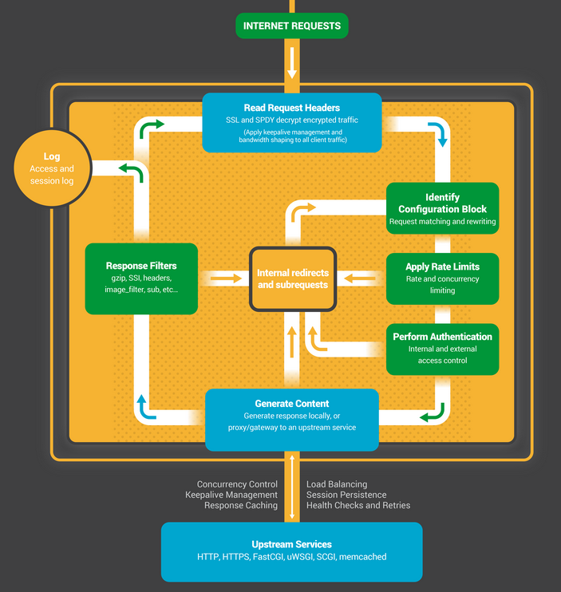

# LuaNginxModule

# 执行阶段概念

`Nginx`处理一个请求，它的处理流程请参考下图：



我们 OpenResty 做个测试，示例代码如下：

```
location /mixed {
    set_by_lua $a 'ngx.log(ngx.ERR, "set_by_lua")';
    rewrite_by_lua 'ngx.log(ngx.ERR, "rewrite_by_lua")';
    access_by_lua 'ngx.log(ngx.ERR, "access_by_lua")';
    header_filter_by_lua 'ngx.log(ngx.ERR, "header_filter_by_lua")';
    body_filter_by_lua 'ngx.log(ngx.ERR, "body_filter_by_lua")';
    log_by_lua 'ngx.log(ngx.ERR, "log_by_lua")';
    content_by_lua 'ngx.log(ngx.ERR, "content_by_lua")';
} 
```

执行结果日志(截取了一下)：

```
set_by_lua
rewrite_by_lua
access_by_lua
content_by_lua
header_filter_by_lua
body_filter_by_lua
log_by_lua 
```

这几个阶段的存在，应该是 openresty 不同于其他多数 Web server 编程的最明显特征了。由于 nginx 把一个请求分成了很多阶段，这样第三方模块就可以根据自己行为，挂载到不同阶段进行处理达到目的。

这样我们就可以根据我们的需要，在不同的阶段直接完成大部分典型处理了。

*   set_by_lua: 流程分支处理判断变量初始化
*   rewrite_by_lua: 转发、重定向、缓存等功能(例如特定请求代理到外网)
*   access_by_lua: IP 准入、接口权限等情况集中处理(例如配合 iptable 完成简单防火墙)
*   content_by_lua: 内容生成
*   header_filter_by_lua: 应答 HTTP 过滤处理(例如添加头部信息)
*   body_filter_by_lua: 应答 BODY 过滤处理(例如完成应答内容统一成大写)
*   log_by_lua: 回话完成后本地异步完成日志记录(日志可以记录在本地，还可以同步到其他机器)

实际上我们只使用其中一个阶段 content_by_lua，也可以完成所有的处理。但这样做，会让我们的代码比较臃肿，越到后期越发难以维护。把我们的逻辑放在不同阶段，分工明确，代码独立，后期发力可以有很多有意思的玩法。

举一个例子，如果在最开始的开发中，使用的是 http 明文协议，后面需要修改为 aes 加密协议，利用不同的执行阶段，我们可以非常简单的实现：

```
# 明文协议版本
location /mixed {
    content_by_lua '...';       # 请求处理
}

# 加密协议版本
location /mixed {
    access_by_lua '...';        # 请求加密解码
    content_by_lua '...';       # 请求处理，不需要关心通信协议
    body_filter_by_lua '...';   # 应答加密编码
} 
```

内容处理部分都是在 content_by_lua 阶段完成，第一版本 API 接口开发都是基于明文。为了传输体积、安全等要求，我们设计了支持压缩、加密的密文协议(上下行)，痛点就来了，我们要更改所有 API 的入口、出口么？

最后我们是在 access_by_lua 完成密文协议解码，body_filter_by_lua 完成应答加密编码。如此一来世界都宁静了，我们没有更改已实现功能的一行代码，只是利用 ngx-lua 的阶段处理特性，非常优雅的解决了这个问题。

前两天看到春哥的微博，里面说到 github 的某个应用里面也使用了 openresty 做了一些东西。发现他们也是利用阶段特性+Lua 脚本处理了很多用户证书方面的东东。最终在性能、稳定性都十分让人满意。使用者选型很准，不愧是 github 的工程师。

不同的阶段，有不同的处理行为，这是 openresty 的一大特色。学会他，适应他，会给你打开新的一扇门。这些东西不是 openresty 自身所创，而是 nginx c module 对外开放的处理阶段。理解了他，也能更好的理解 nginx 的设计思维。

# 正确的记录日志

看过本章第一节的同学应该还记得，log_by_lua 是一个请求阶段最后发生的，文件操作是阻塞的（FreeBSD 直接无视），nginx 为了实时高效的给请求方应答后，日志记录是在应答后异步记录完成的。由此可见如果我们有日志输出的情况，最好统一到 log_by_lua 阶段。如果我们自定义放在 content_by_lua 阶段，那么将线性的增加请求处理时间。

在公司某个定制化项目中，nginx 上的日志内容都要输送到 syslog 日志服务器。我们使用了[lua-resty-logger-socket](https://github.com/cloudflare/lua-resty-logger-socket)这个库。

> 调用示例代码如下（有问题的）：

```
-- lua_package_path "/path/to/lua-resty-logger-socket/lib/?.lua;;";
--
--    server {
--        location / {
--            content_by_lua_file lua/log.lua;
--        }
--    }

-- lua/log.lua
local logger = require "resty.logger.socket"
if not logger.initted() then
    local ok, err = logger.init{
        host = 'xxx',
        port = 1234,
        flush_limit = 1,   --日志长度大于 flush_limit 的时候会将 msg 信息推送一次
        drop_limit = 99999,
    }
    if not ok then
        ngx.log(ngx.ERR, "failed to initialize the logger: ",err)
        return
    end
end

local msg = string.format(.....)
local bytes, err = logger.log(msg)
if err then
    ngx.log(ngx.ERR, "failed to log message: ", err)
    return
end 
```

在实测过程中我们发现了些问题：

*   缓存无效：如果 flush_limit 的值稍大一些（例如 2000），会导致某些体积比较小的日志出现莫名其妙的丢失，所以我们只能把 flush_limit 调整的很小
*   自己拼写 msg 所有内容，比较辛苦

那么我们来看[lua-resty-logger-socket](https://github.com/cloudflare/lua-resty-logger-socket)这个库的 log 函数是如何实现的呢，代码如下：

```
function _M.log(msg)  
   ...

    if (debug) then
        ngx.update_time()
        ngx_log(DEBUG, ngx.now(), ":log message length: " .. #msg)
    end

    local msg_len = #msg

    if (is_exiting()) then
        exiting = true
        _write_buffer(msg)
        _flush_buffer()
        if (debug) then
            ngx_log(DEBUG, "Nginx worker is exiting")
        end
        bytes = 0
    elseif (msg_len + buffer_size < flush_limit) then  -- 历史日志大小+本地日志大小小于推送上限
        _write_buffer(msg)
        bytes = msg_len
    elseif (msg_len + buffer_size <= drop_limit) then
        _write_buffer(msg)
        _flush_buffer()
        bytes = msg_len
    else
        _flush_buffer()
        if (debug) then
            ngx_log(DEBUG, "logger buffer is full, this log message will be "
                    .. "dropped")
        end
        bytes = 0
        --- this log message doesn't fit in buffer, drop it 

        ... 
```

由于在 content_by_lua 阶段变量的生命周期会随着请求的终结而终结，所以当日志量小于 flush_limit 的情况下这些日志就不能被累积，也不会触发 _flush_buffer 函数，所以小日志会丢失。

这些坑回头看来这么明显，所有的问题都是因为我们把 lua/log.lua 用错阶段了，应该放到 log_by_lua 阶段，所有的问题都不复存在。

> 修正后：

```
 lua_package_path "/path/to/lua-resty-logger-socket/lib/?.lua;;";

    server {
        location / {
            content_by_lua_file lua/content.lua;
            log_by_lua lua/log.lua;
        }
    } 
```

这里有个新问题，如果我的 log 里面需要输出一些 content 的临时变量，两阶段之间如何传递参数呢？

> 方法肯定有，推荐下面这个：

```
 location /test {
        rewrite_by_lua '
            ngx.say("foo = ", ngx.ctx.foo)
            ngx.ctx.foo = 76
        ';
        access_by_lua '
            ngx.ctx.foo = ngx.ctx.foo + 3
        ';
        content_by_lua_block {
            ngx.say(ngx.ctx.foo)
        }
    } 
```

更多有关 ngx.ctx 信息，请看[这里](https://github.com/openresty/lua-nginx-module#ngxctx)。

# 热装载代码

在 Openresty 中，提及热加载代码，估计大家的第一反应是 [lua_code_cache](https://github.com/openresty/lua-nginx-module#lua_code_cache) 这个开关。在开发阶段我们把它配置成 lua_code_cache off，是很方便、有必要的，修改完代码，肯定都希望自动加载最新的代码（否则我们就要噩梦般的 reload 服务，然后再测试脚本）。

禁用 Lua 代码缓存（即配置 lua_code_cache off）只是为了开发便利，一般不应以高于 1 并发来访问，否则可能会有 race condition 等等问题。同时因为它会有带来严重的性能衰退，所以不应在生产上使用此种模式。生产上应当总是启用 Lua 代码缓存，即配置 lua_code_cache on。

那么我们是否可以在生产环境中完成热加载呢？

*   代码有变动时，自动加载最新 Lua 代码，但是 nginx 本身，不做任何 reload
*   自动加载后的代码，享用 lua_code_cache on 带来的高效特性

这里有多种玩法（[引自 Openresty 讨论组](https://groups.google.com/forum/#!searchin/openresty/package.loaded/openresty/-MZ9AzXaaG8/TeXTyLCuoYUJ)）：

*   使用 HUP reload 或者 binary upgrade 方式动态加载 nginx 配置或重启 nginx。这不会导致中间有请求被 drop 掉。
*   当 content_by_lua_file 里使用 nginx 变量时，是可以动态加载新的 Lua 脚本的，不过要记得对 nginx 变量的值进行基本的合法性验证，以免被注入攻击。

```
 location ~ '^/lua/(\w+(?:\/\w+)*)$' { 
        content_by_lua_file $1; 
    } 
```

*   自己从外部数据源（包括文件系统）加载 Lua 源码或字节码，然后使用 loadstring() “eval”进 Lua VM. 可以通过 package.loaded 自己来做缓存，毕竟频繁地加载源码和调用 loadstring()，以及频繁地 JIT 编译还是很昂贵的（类似 lua_code_cache off 的情形）。 比如 CloudFlare 公司采用的方法是从 modsecurity 规则编译出来的 Lua 代码就是通过 KyotoTycoon 动态分发到全球网络中的每一个 nginx 服务器的。无需 reload 或者 binary upgrade.

## 自定义 module 的动态装载

对于已经装载的 module，我们可以通过 package.loaded.* = nil 的方式卸载（注意：如果对应模块是通过本地文件 require 加载的，该方式失效，ngx_lua_module 里面对以文件加载模块的方式做了特殊处理）。

不过，值得提醒的是，因为 require 这个内建函数在标准 Lua 5.1 解释器和 LuaJIT 2 中都被实现为 C 函数，所以你在自己的 loader 里可能并不能调用 ngx_lua 那些涉及非阻塞 IO 的 Lua 函数。因为这些 Lua 函数需要 yield 当前的 Lua 协程，而 yield 是无法跨越 Lua 调用栈上的 C 函数帧的。细节见

[`github.com/openresty/lua-nginx-module#lua-coroutine-yieldingresuming`](https://github.com/openresty/lua-nginx-module#lua-coroutine-yieldingresuming)

所以直接操纵 package.loaded 是最简单和最有效的做法。CloudFlare 的 Lua WAF 系统中就是这么做的。

不过，值得提醒的是，从 package.loaded 解注册的 Lua 模块会被 GC 掉。而那些使用下列某一个或某几个特性的 Lua 模块是不能被安全的解注册的：

*   使用 FFI 加载了外部动态库
*   使用 FFI 定义了新的 C 类型
*   使用 FFI 定义了新的 C 函数原型

这个限制对于所有的 Lua 上下文都是适用的。

这样的 Lua 模块应避免手动从 package.loaded 卸载。当然，如果你永不手工卸载这样的模块，只是动态加载的话，倒也无所谓了。但在我们的 Lua WAF 的场景，已动态加载的一些 Lua 模块还需要被热替换掉（但不重新创建 Lua VM）。

## 自定义 Lua script 的动态装载实现

> [引自 Openresty 讨论组](https://groups.google.com/forum/#!searchin/openresty/%E5%8A%A8%E6%80%81%E5%8A%A0%E8%BD%BDlua%E8%84%9A%E6%9C%AC/openresty/-MZ9AzXaaG8/TeXTyLCuoYUJ)

一方面使用自定义的环境表 [1]，以白名单的形式提供用户脚本能访问的 API；另一方面，（只）为用户脚本禁用 JIT 编译，同时使用 Lua 的 debug hooks [2] 作脚本 CPU 超时保护（debug hooks 对于 JIT 编译的代码是不会执行的，主要是出于性能方面的考虑）。

下面这个小例子演示了这种玩法：

```
local user_script = [[ 
    local a = 0 
    local rand = math.random 
    for i = 1, 200 do 
        a = a + rand(i) 
    end 
    ngx.say("hi") 
]] 

local function handle_timeout(typ) 
    return error("user script too hot") 
end 

local function handle_error(err) 
    return string.format("%s: %s", err or "", debug.traceback()) 
end 

-- disable JIT in the user script to ensure debug hooks always work: 
user_script = [[jit.off(true, true) ]] .. user_script 

local f, err = loadstring(user_script, "=user script") 
if not f then 
    ngx.say("ERROR: failed to load user script: ", err) 
    return 
end 

-- only enable math.*, and ngx.say in our sandbox: 
local env = { 
    math = math, 
    ngx = { say = ngx.say }, 
    jit = { off = jit.off }, 
} 
setfenv(f, env) 

local instruction_limit = 1000 
debug.sethook(handle_timeout, "", instruction_limit) 
local ok, err = xpcall(f, handle_error) 
if not ok then 
    ngx.say("failed to run user script: ", err) 
end 
debug.sethook()  -- turn off the hooks 
```

这个例子中我们只允许用户脚本调用 math 模块的所有函数、ngx.say() 以及 jit.off(). 其中 jit.off()是必需引用的，为的是在用户脚本内部禁用 JIT 编译，否则我们注册的 debug hooks 可能不会被调用。

另外，这个例子中我们设置了脚本最多只能执行 1000 条 VM 指令。你可以根据你自己的场景进行调整。

这里很重要的是，不能向用户脚本暴露 pcall 和 xpcall 这两个 Lua 指令，否则恶意用户会利用它故意拦截掉我们在 debug hook 里为中断脚本执行而抛出的 Lua 异常。

另外，require()、loadstring()、loadfile()、dofile()、io.*、os.* 等等 API 是一定不能暴露给不被信任的 Lua 脚本的。

# 阻塞操作

Openresty 的诞生，一直对外宣传是非阻塞(100% noblock)的。基于事件通知的 Nginx 给我们带来了足够强悍的高并发支持，但是也对我们的编码有特殊要求。这个特殊要求就是我们的代码，也必须是非阻塞的。如果你的服务端编程生涯一开始就是从异步框架开始的，恭喜你了。但如果你的编程生涯是从同步框架过来的，而且又是刚刚开始深入了解异步框架，那你就要小心了。

Nginx 为了减少系统上下文切换，它的 worker 是用单进程单线程设计的，事实证明这种做法运行效率很高。Nginx 要么是在等待网络讯号，要么就是在处理业务（请求数据解析、过滤、内容应答等），没有任何额外资源消耗。

## 常见语言代表异步框架

*   Golang ：使用协程技术实现
*   Python ：gevent 基于协程的 Python 网络库
*   Rust ：用的少，只知道语言完备支持异步框架
*   Openresty：基于 Nginx，使用事件通知机制
*   Java ：Netty，使用网络事件通知机制

## 异步编程的噩梦

异步编程，如果从零开始，难度是非常大的。一个完整的请求，由于网络传输的非连续性，这个请求要被多次挂起、恢复、运行，一旦网络有新数据到达，都需要立刻唤醒恢复原始请求处于运行状态。开发人员不仅仅要考虑异步 api 接口本身的使用规范，还要考虑业务请求的完整处理，稍有不慎，全盘皆输。

最最重要的噩梦是，我们好不容易搞定异步框架和业务请求完整性，但是却在我们的业务请求上使用了阻塞函数。一开始没有任何感知，只有做压力测试的时候才发现我们的并发量上不去，各种卡顿，甚至开始怀疑人生：异步世界也就这样。

## Openresty 中的阻塞函数

官方有明确说明，Openresty 的官方 API 绝对 100% noblock，所以我们只能在她的外面寻找了。我这里大致归纳总结了一下，包含下面几种情况：

*   高 CPU 的调用（压缩、解压缩、加解密等）
*   高磁盘的调用（所有文件操作）
*   非 Openresty 提供的网络操作（luasocket 等）
*   系统命令行调用（os.execute 等）

这些都应该是我们尽量要避免的。理想丰满，现实骨感，谁能保证我们的应用中不使用这些类型的 API？没人保证，我们能做的就是把他们的调用数量、频率降低再降低，如果还是不能满足我们需要，那么就考虑把他们封装成独立服务，对外提供 TCP/HTTP 级别的接口调用，这样我们的 Openresty 就可以同时享受异步编程的好处又能达到我们的目的。

# 缓存

### 缓存的原则

缓存是一个大型系统中非常重要的一个组成部分。在硬件层面，大部分的计算机硬件都会用缓存来提高速度，比如 CPU 会有多级缓存、RAID 卡也有读写缓存。在软件层面，我们用的数据库就是一个缓存设计非常好的例子，在 SQL 语句的优化、索引设计、磁盘读写的各个地方，都有缓存，建议大家在设计自己的缓存之前，先去了解下 MySQL 里面的各种缓存机制，感兴趣的可以去看下[High Permance MySQL](http://www.highperfmysql.com/)这本非常有价值的书。

一个生产环境的缓存系统，需要根据自己的业务场景和系统瓶颈，来找出最好的方案，这是一门平衡的艺术。

一般来说，缓存有两个原则。**一是越靠近用户的请求越好**，比如能用本地缓存的就不要发送 HTTP 请求，能用 CDN 缓存的就不要打到 Web 服务器，能用 nginx 缓存的就不要用数据库的缓存；**二是尽量使用本进程和本机的缓存解决**，因为跨了进程和机器甚至机房，缓存的网络开销就会非常大，在高并发的时候会非常明显。

### OpenResty 的缓存

我们介绍下在 OpenResty 里面，有哪些缓存的方法。

#### 使用 [Lua shared dict](https://github.com/openresty/lua-nginx-module#ngxshareddict)

我们看下面这段代码：

```
function get_from_cache(key)
    local cache_ngx = ngx.shared.my_cache
    local value = cache_ngx:get(key)
    return value
end

function set_to_cache(key, value, exptime)
    if not exptime then
        exptime = 0
    end

    local cache_ngx = ngx.shared.my_cache
    local succ, err, forcible = cache_ngx:set(key, value, exptime)
    return succ
end 
```

这里面用的就是 ngx shared dict cache。你可能会奇怪，ngx.shared.my_cache 是从哪里冒出来的？没错，少贴了 nginx.conf 里面的修改：

```
lua_shared_dict my_cache 128m; 
```

如同它的名字一样，这个 cache 是 nginx 所有 worker 之间共享的，内部使用的 LRU 算法（最近最少使用）来判断缓存是否在内存占满时被清除。

#### 使用[Lua LRU cache](https://github.com/openresty/lua-resty-lrucache)

直接复制下春哥的示例代码：

```
local _M = {}

-- alternatively: local lrucache = require "resty.lrucache.pureffi"
local lrucache = require "resty.lrucache"

-- we need to initialize the cache on the Lua module level so that
-- it can be shared by all the requests served by each nginx worker process:
local c = lrucache.new(200)  -- allow up to 200 items in the cache
if not c then
    return error("failed to create the cache: " .. (err or "unknown"))
end

function _M.go()
    c:set("dog", 32)
    c:set("cat", 56)
    ngx.say("dog: ", c:get("dog"))
    ngx.say("cat: ", c:get("cat"))

    c:set("dog", { age = 10 }, 0.1)  -- expire in 0.1 sec
    c:delete("dog")
end

return _M 
```

可以看出来，这个 cache 是 worker 级别的，不会在 nginx wokers 之间共享。并且，它是预先分配好 key 的数量，而 shared dcit 需要自己用 key 和 value 的大小和数量，来估算需要把内存设置为多少。

#### 如何选择？

shared.dict 使用的是共享内存，每次操作都是全局锁，如果高并发环境，不同 worker 之间容易引起竞争。所以单个 shared.dict 的体积不能过大。lrucache 是 worker 内使用的，由于 nginx 是单进程方式存在，所以永远不会触发锁，效率上有优势，并且没有 shared.dict 的体积限制，内存上也更弹性，但不同 worker 之间数据不同享，同一缓存数据可能被冗余存储。

你需要考虑的，一个是 Lua lru cache 提供的 API 比较少，现在只有 get、set 和 delete，而 ngx shared dict 还可以 add、replace、incr、get_stale（在 key 过期时也可以返回之前的值）、get_keys（获取所有 key，虽然不推荐，但说不定你的业务需要呢）；第二个是内存的占用，由于 ngx shared dict 是 workers 之间共享的，所以在多 worker 的情况下，内存占用比较少。

# sleep

这是一个比较常见的功能，你会怎么做呢？Google 一下，你会找到[Lua 的官方指南](http://lua-users.org/wiki/SleepFunction)，

里面介绍了 10 种 sleep 不同的方法（操作系统不一样，方法还有区别），选择一个用，然后你就杯具了:( 你会发现 nginx 高并发的特性不见了！

在 OpenResty 里面选择使用库的时候，有一个基本的原则：***尽量使用 ngx Lua 的库函数，尽量不用 Lua 的库函数，因为 Lua 的库都是同步阻塞的。***

```
# you do not need the following line if you are using
# the ngx_openresty bundle:
lua_package_path "/path/to/lua-resty-redis/lib/?.lua;;";

server {
    location /non_block {
        content_by_lua_block {
            ngx.sleep(0.1)
        }
    }
} 
```

本章节内容好少，只是想通过一个真实的例子，来提醒大家，做 OpenResty 开发，[ngx-lua 的文档](https://github.com/openresty/lua-nginx-module)是你的首选，Lua 语言的库都是同步阻塞的，用的时候要三思。

再来一个例子来说明阻塞 API 的调用对 nginx 并发性能的影响

```
location /sleep_1 {
    default_type 'text/plain';
    content_by_lua_block {
        ngx.sleep(0.01)
        ngx.say("ok")
    }
}

location /sleep_2 {
    default_type 'text/plain';
    content_by_lua_block {
        function sleep(n)
            os.execute("sleep " .. n)
        end
        sleep(0.01)
        ngx.say("ok")
    }
} 
```

ab 测试一下

```
➜  nginx git:(master) ab -c 10 -n 20  http://127.0.0.1/sleep_1
...
Requests per second:    860.33 [#/sec] (mean)
...
➜  nginx git:(master) ab -c 10 -n 20  http://127.0.0.1/sleep_2
...
Requests per second:    56.87 [#/sec] (mean)
... 
```

可以看到，如果不使用 ngx_lua 提供的 sleep 函数，nginx 并发处理性能会下降 15 倍左右。

## 为什么会这样？

原因是 sleep_1 接口使用了 ngx_lua 提供的非阻塞 API，而 sleep_2 使用了系统自带的阻塞 API。前者只会引起(进程内)协程的切换，但进程还是处于运行状态(其他协程还在运行)，而后者却会触发进程切换，当前进程会变成睡眠状态, 结果 CPU 就进入空闲状态。很明显，非阻塞的 API 的性能会更高。

# 定时任务

在请求返回后继续执行章节中，我们介绍了一种实现的方法，这里我们 介绍一种更优雅更通用的方法：[ngx.timer.at()](https://github.com/openresty/lua-nginx-module#ngxtimerat)。 这个函数是在后台用 nginx 轻线程（light thread），在指定的延时后，调用指定的函数。 有了这种机制，ngx_lua 的功能得到了非常大的扩展，我们有机会做一些更有想象力的功能出来。比如 批量提交和 cron 任务。

需要特别注意的是：有一些 ngx_lua 的 API 不能在这里调用，比如子请求、ngx.req.*和向下游输出的 API(ngx.print、ngx.flush 之类)，原因是这些请求都需要绑定某个请求，但是对于 `ngx.timer.at` 自身的运行，是与当前任何请求都没关系的。

比较典型的用法，如下示例：

```
 local delay = 5
 local handler
 handler = function (premature)
     -- do some routine job in Lua just like a cron job
     if premature then
         return
     end
     local ok, err = ngx.timer.at(delay, handler)
     if not ok then
         ngx.log(ngx.ERR, "failed to create the timer: ", err)
         return
     end
 end

 local ok, err = ngx.timer.at(delay, handler)
 if not ok then
     ngx.log(ngx.ERR, "failed to create the timer: ", err)
     return
 end 
```

# 禁止某些终端访问

不同的业务应用场景，会有完全不同的非法终端控制策略，常见的限制策略有终端 IP、访问域名端口，这些可以通过防火墙等很多成熟手段完成。可也有一些特定限制策略，例如特定 cookie、url、location，甚至请求 body 包含有特殊内容，这种情况下普通防火墙就比较难限制。

Nginx 的是 HTTP 7 层协议的实现着，相对普通防火墙从通讯协议有自己的弱势，同等的配置下的性能表现绝对远不如防火墙，但它的优势胜在价格便宜、调整方便，还可以完成 HTTP 协议上一些更具体的控制策略，与 iptable 的联合使用，让 Nginx 玩出更多花样。

## 列举几个限制策略来源

*   IP 地址
*   域名、端口
*   Cookie 特定标识
*   location
*   body 中特定标识

> 示例配置（allow、deny）

```
location / {
    deny  192.168.1.1;
    allow 192.168.1.0/24;
    allow 10.1.1.0/16;
    allow 2001:0db8::/32;
    deny  all;
} 
```

这些规则都是按照顺序解析执行直到某一条匹配成功。在这里示例中，10.1.1.0/16 and 192.168.1.0/24 都是用来限制 IPv4 的，2001:0db8::/32 的配置是用来限制 IPv6。具体有关 allow、deny 配置，请参考[这里](http://nginx.org/en/docs/http/ngx_http_access_module.html)。

> 示例配置（geo）

```
Example:

geo $country {
    default        ZZ;
    proxy          192.168.100.0/24;

    127.0.0.0/24   US;
    127.0.0.1/32   RU;
    10.1.0.0/16    RU;
    192.168.1.0/24 UK;
}

if ($country == ZZ){
    return 403;
} 
```

使用 geo，让我们有更多的分支条件。注意：在 Nginx 的配置中，尽量少用或者不用 if，因为"if is evil"。[点击查看](http://wiki.nginx.org/IfIsEvil)

目前为止所有的控制，都是用 Nginx 模块完成，执行效率、配置明确是它的优点。缺点也比较明显，修改配置代价比较高（reload 服务）。并且无法完成与第三方服务的对接功能交互（例如调用 iptable）。

在 Openresty 里面，这些问题就都容易解决，还记得 access_by_lua 么？推荐一个第三方库[lua-resty-iputils](https://github.com/hamishforbes/lua-resty-iputils)。

> 示例代码：

```
init_by_lua '
  local iputils = require("resty.iputils")
  iputils.enable_lrucache()
  local whitelist_ips = {
      "127.0.0.1",
      "10.10.10.0/24",
      "192.168.0.0/16",
  }

  -- WARNING: Global variable, recommend this is cached at the module level
  -- https://github.com/openresty/lua-nginx-module#data-sharing-within-an-nginx-worker
  whitelist = iputils.parse_cidrs(whitelist_ips)
';

access_by_lua '
    local iputils = require("resty.iputils")
    if not iputils.ip_in_cidrs(ngx.var.remote_addr, whitelist) then
      return ngx.exit(ngx.HTTP_FORBIDDEN)
    end
'; 
```

以次类推，我们想要完成域名、Cookie、location、特定 body 的准入控制，甚至可以做到与本地 iptable 防火墙联动。 我们可以把 IP 规则存到数据库中，这样我们就再也不用 reload nginx，在有规则变动的时候，刷新下 nginx 的缓存就行了。

思路打开，大家后面多尝试各种玩法吧。

# 请求返回后继续执行

在一些请求中，我们会做一些日志的推送、用户数据的统计等和返回给终端数据无关的操作。而这些操作，即使你用异步非阻塞的方式，在终端看来，也是会影响速度的。这个和我们的原则：***终端请求，需要用最快的速度返回给终端***，是冲突的。

这时候，最理想的是，获取完给终端返回的数据后，就断开连接，后面的日志和统计等动作，在断开连接后，后台继续完成即可。

怎么做到呢？我们先看其中的一种方法：

```
local response, user_stat = logic_func.get_response(request)
ngx.say(response)
ngx.eof()

if user_stat then
   local ret = db_redis.update_user_data(user_stat)
end 
```

没错，最关键的一行代码就是[ngx.eof()](https://github.com/openresty/lua-nginx-module#ngxeof)， 它可以即时关闭连接，把数据返回给终端，后面的数据库操作还会运行。比如上面代码中的

```
local response, user_stat = logic_func.get_response(request) 
```

运行了 0.1 秒，而

```
db_redis.update_user_data(user_stat) 
```

运行了 0.2 秒，在没有使用 ngx.eof()之前，终端感知到的是 0.3 秒，而加上 ngx.eof()之后，终端感知到的只有 0.1 秒。

需要注意的是，***你不能任性的把阻塞的操作加入代码，即使在 ngx.eof()之后。*** 虽然已经返回了终端的请求，但是，nginx 的 worker 还在被你占用。所以在 keep alive 的情况下，本次请求的总时间，会把上一次 eof()之后的时间加上。 如果你加入了阻塞的代码，nginx 的高并发就是空谈。

有没有其他的方法来解决这个问题呢？我们会在 ngx.timer.at 里面给大家介绍更优雅的方案。

# 调试

调试是一个程序猿非常重要的能力，人写的程序总会有 bug，所以需要 debug。***如何方便和快速的定位 bug***，是我们讨论的重点，只要 bug 能定位，解决就不是问题。

对于熟悉用 Visual Studio 和 Eclipse 这些强大的集成开发环境的来做 C++和 Java 的同学来说，OpenResty 的 debug 要原始很多，但是对于习惯 Python 开发的同学来说，又是那么的熟悉。 张银奎有本[《软件调试》](http://book.douban.com/subject/3088353/)的书，windows 客户端程序猿应该都看过，大家可以去试读下，看看里面有多复杂:(

对于 OpenResty，坏消息是，没有单步调试这些玩意儿（我们尝试搞出来过 ngx Lua 的单步调试，但是没人用...）;好消息是，它像 Python 一样，非常简单，不用复杂的技术，只靠 print 和 log 就能定位绝大部分问题，难题有火焰图这个神器。

*   #### 关闭 code cache

    这个选项在调试的时候最好关闭。

    ```
    lua_code_cache off; 
    ```

    这样，你修改完代码后，不用 reload nginx 就可以生效了。在生产环境下记得打开这个选项。

*   #### 记录日志

这个看上去谁都会的东西，要想做好也不容易。

你有遇到这样的情况吗？QA 发现了一个 bug，开发说我修改代码加个日志看看，然后 QA 重现这个问题，发现日志不够详细，需要再加，反复几次，然后再给 QA 一个没有日志的版本，继续测试其他功能。

如果产品已经发布到用户那里了呢？如果用户那里是隔离网，不能远程怎么办？

***你在写代码的时候，就需要考虑到调试日志。*** 比如这个代码：

```
local response, err = redis_op.finish_client_task(client_mid, task_id)
if response then
    put_job(client_mid, result)
    ngx.log(ngx.WARN, "put job:", common.json_encode({channel="task_status", mid=client_mid, data=result}))
end 
```

我们在做一个操作后，就把结果记录到 nginx 的 error.log 里面，等级是 warn。在生产环境下，日志等级默认为 error，在我们需要详细日志的时候，把等级调整为 warn 即可。在我们的实际使用中，我们会把一些很少发生的重要事件，做为 error 级别记录下来，即使它并不是 nginx 的错误。

与日志配套的，你需要[logrotate](http://linuxcommand.org/man_pages/logrotate8.html)来做日志的切分和备份。

# 调用其他 C 函数动态库

Linux 下的动态库一般都以 .so 结束命名，而 Windows 下一般都以 .dll 结束命名。Lua 作为一种嵌入式语言，和 C 具有非常好的亲缘性，这也是 LUA 赖以生存、发展的根本，所以 Nginx+Lua=Openresty，魔法就这么神奇的发生了。

NgxLuaModule 里面尽管提供了十分丰富的 API，但他一定不可能满足我们的形形色色的需求。我们总是要和各种组件、算法等形形色色的第三方库进行协作。那么如何在 Lua 中加载动态加载第三方库，就显得非常有用。

扯一些额外话题，Lua 解释器目前有两个最主流分支。

*   Lua 官方发布的标准版[Lua](http://lua.org/)
*   Google 开发维护的[LuaJIT](http://luajit.org/index.html)

LuaJIT 中加入了 Just In Time 等编译技术，是的 Lua 的解释、执行效率有非常大的提升。除此以外，还提供了[FFI](http://luajit.org/ext_ffi.html)。

> 什么是 FFI？

```
The FFI library allows calling external C functions and using C data 
structures from pure Lua code. 
```

通过 FFI 的方式加载其他 C 接口动态库，这样我们就可以有很多有意思的玩法。

当我们碰到 CPU 密集运算部分，我们可以把他用 C 的方式实现一个效率最高的版本，对外到处 API，打包成动态库，通过 FFI 来完成 API 调用。这样我们就可以兼顾程序灵活、执行高效，大大弥补了 LuaJIT 自身的不足。

> 使用 FFI 判断操作系统

```
local ffi = require("ffi")
if ffi.os == "Windows" then
    print("windows")
elseif ffi.os == "OSX" then
    print("MAC OS X")
else
    print(ffi.os)
end 
```

> 调用 zlib 压缩库

```
local ffi = require("ffi")
ffi.cdef[[
unsigned long compressBound(unsigned long sourceLen);
int compress2(uint8_t *dest, unsigned long *destLen,
          const uint8_t *source, unsigned long sourceLen, int level);
int uncompress(uint8_t *dest, unsigned long *destLen,
           const uint8_t *source, unsigned long sourceLen);
]]
local zlib = ffi.load(ffi.os == "Windows" and "zlib1" or "z")

local function compress(txt)
  local n = zlib.compressBound(#txt)
  local buf = ffi.new("uint8_t[?]", n)
  local buflen = ffi.new("unsigned long[1]", n)
  local res = zlib.compress2(buf, buflen, txt, #txt, 9)
  assert(res == 0)
  return ffi.string(buf, buflen[0])
end

local function uncompress(comp, n)
  local buf = ffi.new("uint8_t[?]", n)
  local buflen = ffi.new("unsigned long[1]", n)
  local res = zlib.uncompress(buf, buflen, comp, #comp)
  assert(res == 0)
  return ffi.string(buf, buflen[0])
end

-- Simple test code.
local txt = string.rep("abcd", 1000)
print("Uncompressed size: ", #txt)
local c = compress(txt)
print("Compressed size: ", #c)
local txt2 = uncompress(c, #txt)
assert(txt2 == txt) 
```

> 自定义定义 C 类型的方法

```
local ffi = require("ffi")
ffi.cdef[[
typedef struct { double x, y; } point_t;
]]

local point
local mt = {
  __add = function(a, b) return point(a.x+b.x, a.y+b.y) end,
  __len = function(a) return math.sqrt(a.x*a.x + a.y*a.y) end,
  __index = {
    area = function(a) return a.x*a.x + a.y*a.y end,
  },
}
point = ffi.metatype("point_t", mt)

local a = point(3, 4)
print(a.x, a.y)  --> 3  4
print(#a)        --> 5
print(a:area())  --> 25
local b = a + point(0.5, 8)
print(#b)        --> 12.5 
```

> Lua 和 LuaJIT 对比

可以这么说，LuaJIT 应该是全面胜出，无论是功能、效率都是标准 Lua 不能比的。目前最新版 Openresty 默认也都使用 LuaJIT。

世界为我所用，总是有惊喜等着你，如果那天你发现自己站在了顶峰，那我们就静下心来改善一下顶峰，把他推到更高吧。

# 请求中断后的处理

# 我的 lua 代码需要调优么

# 网上有大量对 Lua 调优的推荐，我们应该如何看待？

Lua 的解析器有官方的 standard Lua 和 LuaJIT，需要明确一点的是目前大量的优化文章都比较陈旧，而且都是针对 standard Lua 解析器的，standard Lua 解析器在性能上需要书写着自己规避，才能写出高性能来。需要各位看官注意的是，ngx-lua 最新版默认已经绑定 LuaJIT，优化手段和方法已经略有不同。我们现在的做法是：代码易读是首位，目前还没有碰到同样代码换个写法就有质的提升，如果我们对某个单点功能有性能要求，那么建议用 LuaJIT 的 FFI 方法直接调用 C 接口更直接一点。

代码出处：[`www.cnblogs.com/lovevivi/p/3284643.html`](http://www.cnblogs.com/lovevivi/p/3284643.html)

```
3.0 避免使用 table.insert()

下面来看看 4 个实现表插入的方法。在 4 个方法之中 table.insert()在效率上不如其他方法，是应该避免使用的。
使用 table.insert
local a = {}
local table_insert = table.insert
for i = 1,100 do
   table_insert( a, i )
end

使用循环的计数

local a = {}
for i = 1,100 do
   a[i] = i
end
使用 table 的 size

local a = {}
for i = 1,100 do
   a[#a+1] = i
end
使用计数器

local a = {}
local index = 1
for i = 1,100 do
   a[index] = i
   index = index+1
end

4.0 减少使用 unpack()函数
Lua 的 unpack()函数不是一个效率很高的函数。你完全可以写一个循环来代替它的作用。

使用 unpack()

local a = { 100, 200, 300, 400 }
for i = 1,100 do
   print( unpack(a) )
end
代替方法

local a = { 100, 200, 300, 400 }
for i = 1,100 do
   print( a[1],a[2],a[3],a[4] )
end 
```

针对这篇文章内容写了一些测试代码：

```
local start = os.clock()

local function sum( ... )
    local args = {...}
    local a = 0
    for k,v in pairs(args) do
        a = a + v
    end
    return a
end

local function test_unit(  )
    -- t1: 0.340182 s
    -- local a = {}
    -- for i = 1,1000 do
    --    table.insert( a, i )
    -- end

    -- t2: 0.332668 s
    -- local a = {}
    -- for i = 1,1000 do
    --    a[#a+1] = i
    -- end

    -- t3: 0.054166 s
    -- local a = {}
    -- local index = 1
    -- for i = 1,1000 do
    --    a[index] = i
    --    index = index+1
    -- end

    -- p1: 0.708012 s
    -- local a = 0
    -- for i=1,1000 do
    --     local t = { 1, 2, 3, 4 }
    --     for i,v in ipairs( t ) do
    --        a = a + v
    --     end
    -- end

    -- p2: 0.660426 s
    -- local a = 0
    -- for i=1,1000 do
    --     local t = { 1, 2, 3, 4 }
    --     for i = 1,#t do
    --        a = a + t[i]
    --     end
    -- end

    -- u1: 2.121722 s
    -- local a = { 100, 200, 300, 400 }
    -- local b = 1
    -- for i = 1,1000 do
    --    b = sum(unpack(a))
    -- end

    -- u2: 1.701365 s
    -- local a = { 100, 200, 300, 400 }
    -- local b = 1
    -- for i = 1,1000 do
    --    b = sum(a[1], a[2], a[3], a[4])
    -- end

    return b
end

for i=1,10 do
    for j=1,1000 do
        test_unit()
    end
end

print(os.clock()-start) 
```

从运行结果来看，除了 t3 有本质上的性能提升（六倍性能差距，但是 t3 写法相当丑陋），其他不同的写法都在一个数量级上。你是愿意让代码更易懂还是更牛逼，就看各位看官自己的抉择了。不要盲信，也不要不信，各位要睁开眼自己多做测试。

另外说明：文章提及的使用局部变量、缓存 table 元素，在 LuaJIT 中还是很有用的。

todo：优化测试用例，让他更直观，自己先备注一下。

# 变量的共享范围

> 本章内容来自 openresty 讨论组 [这里](https://groups.google.com/forum/#!topic/openresty/3ylMdtvUJqg)

先看两段代码：

```
-- index.lua
local uri_args = ngx.req.get_uri_args()
local mo = require('mo')
mo.args = uri_args 
```

```
-- mo.lua

local showJs = function(callback, data)
    local cjson = require('cjson')
    ngx.say(callback .. '(' .. cjson.encode(data) .. ')')
end
local self.jsonp = self.args.jsonp
local keyList = string.split(self.args.key_list, ',')
for i=1, #keyList do
    -- do something
    ngx.say(self.args.kind)
end
showJs(self.jsonp, valList) 
```

大概代码逻辑如上，然后出现这种情况：

生产服务器中，如果没有用户访问，自己几个人测试，一切正常。

同样生产服务器，我将大量的用户请求接入后，我不停刷新页面的时候会出现部分情况（概率也不低，几分之一，大于 10%），输出的 callback（也就是来源于 self.jsonp，即 URL 参数中的 jsonp 变量）和 url 地址中不一致（我自己测试的值是?jsonp=jsonp1435220570933，而用户的请求基本上都是?jsonp=jquery....)错误的情况都是会出现用户请求才会有的 jquery....这种字符串。另外 URL 参数中的 kind 是 1，我在循环中输出会有“1”或“nil”的情况。不仅这两种参数，几乎所有 url 中传递的参数，都有可能变成其他请求链接中的参数。

基于以上情况，个人判断会不会是在生产服务器大量用户请求中，不同请求参数串掉了，但是如果这样，是否应该会出现我本次的获取参数是某个其他用户的值，那么 for 循环中的值也应该固定的，而不会是一会儿是我自己请求中的参数值，一会儿是其他用户请求中的参数值。

### 问题在哪里？

Lua module 是 VM 级别共享的，见[这里](https://github.com/openresty/lua-nginx-module#data-sharing-within-an-nginx-worker)。

self.jsonp 变量一不留神全局共享了，而这肯定不是作者期望的。所以导致了高并发应用场景下偶尔出现异常错误的情况。

每请求的数据在传递和存储时须特别小心，只应通过你自己的函数参数来传递，或者通过 ngx.ctx 表。前者是推荐的玩法，因为效率高得多。

贴一个 ngx.ctx 的例子：

```
 location /test {
        rewrite_by_lua '
            ngx.ctx.foo = 76
        ';
        access_by_lua '
            ngx.ctx.foo = ngx.ctx.foo + 3
        ';
        content_by_lua_block {
            ngx.say(ngx.ctx.foo)
        }
    } 
```

Then GET /test will yield the output

### NGX_LUA 的三种变量范围

##### 进程间

所有 Nginx 的工作进程共享变量，使用指令 lua_shared_dict 定义

##### 进程内

Lua 源码中声明为全局变量，就是声明变量的时候不使用 local 关键字，这样的变量在同一个进程内的所有请求都是共享的

##### 每请求

Lua 源码中声明变量的时候使用 local 关键字，和 ngx.ctx 类似，变量的生命周期只存在同一个请求中

关于进程的变量，有两个前提条件，一是 ngx_lua 使用 LuaJIT 编译，二是声明全局变量的模块是 require 引用。LuaJIT 会缓存模块中的全局变量，下面用一个例子来说明这个问题。

nginx.conf

```
location /index {
    content_by_lua_file conf/lua/web/index.lua;
} 
```

index.lua

```
local ngx = require "ngx"
local var = require "var"

if var.calc() == 100 then
    ngx.say("ok")
else
    ngx.status = ngx.HTTP_INTERNAL_SERVER_ERROR
    ngx.say("error")
end 
```

var.lua

```
local ngx = require "ngx"

count = 100

local _M = {}

local function add()
    count = count + 1
end

local function sub()
    ngx.update_time()
    ngx.sleep(ngx.time()%0.003) --模拟后端阻塞时间
    count = count - 1
end

function _M.calc()
    add()
    sub()
    return count
end

return _M 
```

测试结果

```
➜  web git:(master) ab -c 1 -n 10 http://127.0.0.1:/index
...
HTML transferred:       30 bytes
...
➜  web git:(master) ab -c 3 -n 10 http://127.0.0.1:10982/index
...
HTML transferred:       48 bytes
... 
```

并发请求等于 1 的时候，返回的 html 文件的大小为 3*10bytes，并发等于 3 的时候，返回的 html 文件的大小为 48bytes，说明 30 次请求中有多次请求失败，返回了“error”。这个例子可以说明，如果在模块中使用了全局变量，在高并发的情况下可能发生不可知的结果。

建议不要使用模块中的全局变量，最好使用 ngx.ctx 或 share dict 替代。如果由于业务需求，非要使用的话，建议该变量的值在也是在一个有限集合内，比方说只有 ture 和 false 两个状态。

> 79

# 动态限速

> 内容来源于 openresty 讨论组，点击[这里](https://groups.google.com/forum/#!forum/openresty)

在我们的应用场景中，有大量的限制并发、下载传输速率这类要求。突发性的网络峰值会对企业用户的网络环境带来难以预计的网络灾难。

nginx 示例配置：

```
location /download_internal/ {
    internal;
    send_timeout 10s;
    limit_conn perserver 100;
    limit_rate 0k;

    chunked_transfer_encoding off;
    default_type application/octet-stream;

    alias ../download/;
} 
```

我们从一开始，就想把速度值做成变量，但是发现 limit_rate 不接受变量。我们就临时的修改配置文件限速值，然后给 nginx 信号做 reload。只是没想到这一临时，我们就用了一年多。

直到刚刚，讨论组有人问起网络限速如何实现的问题，春哥给出了大家都喜欢的办法：

> 地址：[`groups.google.com/forum/#!topic/openresty/aespbrRvWOU`](https://groups.google.com/forum/#!topic/openresty/aespbrRvWOU)

```
可以在 Lua 里面（比如 access_by_lua 里面）动态读取当前的 URL 参数，然后设置 nginx 的内建变量$limit_rate（在 Lua 里访问就是 ngx.var.limit_rate）。

http://nginx.org/en/docs/http/ngx_http_core_module.html#var_limit_rate 
```

改良后的限速代码：

```
location /download_internal/ {
    internal;
    send_timeout 10s;
    access_by_lua 'ngx.var.limit_rate = "300K"';

    chunked_transfer_encoding off;
    default_type application/octet-stream;

    alias ../download/;
} 
```

经过测试，绝对达到要求。有了这个东东，我们就可以在 Lua 上直接操作限速变量实时生效。再也不用之前笨拙的 reload 方式了。

PS: ngx.var.limit_rate 限速是基于请求的，如果相同终端发起两个连接，那么终端的最大速度将是 limit_rate 的两倍，原文如下：

```
Syntax: limit_rate rate;
Default:    
limit_rate 0;
Context: http, server, location, if in location    

Limits the rate of response transmission to a client. The rate is specified in bytes per second. The zero value disables rate limiting. The limit is set per a request, and so if a client simultaneously opens two connections, the overall rate will be twice as much as the specified limit. 
```

# shared.dict 非队列性质

# ngx.shared.DICT 非队列性质

===========

执行阶段和主要函数请参考[维基百科 HttpLuaModule#ngx.shared.DICT](https://github.com/openresty/lua-nginx-module#ngxshareddict)

## 非队列性质

ngx.shared.DICT 的实现是采用红黑树实现，当申请的缓存被占用完后如果有新数据需要存储则采用 LRU 算法淘汰掉“多余”数据。

这样数据结构的在带有队列性质的业务逻辑下会出现的一些问题：

我们用 shared 作为缓存，接纳终端输入并存储，然后在另外一个线程中按照固定的速度去处理这些输入，代码如下:

```
 -- [ngx.thread.spawn](https://github.com/openresty/lua-nginx-module#ngxthreadspawn) #1 存储线程 理解为生产者

    ....
    local cache_str = string.format([[%s&%s&%s&%s&%s&%s&%s]], net, name, ip,
                    mac, ngx.var.remote_addr, method, md5)
    local ok, err = ngx_nf_data:safe_set(mac, cache_str, 60*60)  --这些是缓存数据
    if not ok then
        ngx.log(ngx.ERR, "stored nf report data error: "..err)
    end
    ....

-- [ngx.thread.spawn](https://github.com/openresty/lua-nginx-module#ngxthreadspawn) #2 取线程 理解为消费者

    while not ngx.worker.exiting() do
        local keys = ngx_share:get_keys(50)  -- 一秒处理 50 个数据

        for index, key in pairs(keys) do
            str = ((nil ~= str) and str..[[#]]..ngx_share:get(key)) or ngx_share:get(key)
            ngx_share:delete(key)  --干掉这个 key
        end
        .... --一些消费过程，看官不要在意
        ngx.sleep(1)
    end 
```

在上述业务逻辑下会出现由生产者生产的某些 key-val 对永远不会被消费者取出并消费，原因就是 shared.DICT 不是队列，ngx_shared:get_keys(n)函数不能保证返回的 n 个键值对是满足 FIFO 规则的，从而导致问题发生。

## 问题解决

问题的原因已经找到，解决方案有如下几种： 1.修改暂存机制，采用 redis 的队列来做暂存； 2.调整消费者的消费速度，使其远远大于生产者的速度； 3.修改 ngx_shared:get_keys()的使用方法，即是不带参数；

方法 3 和 2 本质上都是一样的，由于业务已经上线，方法 1 周期太长，于是采用方法 2 解决，在后续的业务中不再使用 shared.DICT 来暂存队列性质的数据

# 正确使用长链接

# KeepAlive

在 OpenResty 中，连接池在使用上如果不加以注意，容易产生数据写错地方，或者得到的应答数据异常以及类似的问题，当然使用短连接可以规避这样的问题，但是在一些企业用户环境下，短连接+高并发对企业内部的防火墙是一个巨大的考验，因此，长连接自有其勇武之地，使用它的时候要记住，长连接一定要保持其连接池中所有连接的正确性。

```
-- 错误的代码
local function send()
    for i = 1, count do
        local ssdb_db, err = ssdb:new()
        local ok, err = ssdb_db:connect(SSDB_HOST, SSDB_PORT)
        if not ok then
            ngx.log(ngx.ERR, "create new ssdb failed!")
        else
               local key,err = ssdb_db:qpop(something)
             if not key then
                   ngx.log(ngx.ERR, "ssdb qpop err:", err)
               else
                   local data, err = ssdb_db:get(key[1])
                   -- other operations
               end
        end 
    end
    ssdb_db:set_keepalive(SSDB_KEEP_TIMEOUT, SSDB_KEEP_COUNT)
end  
-- 调用
while true do
    local ths = {}
    for i=1,THREADS do
        ths[i] = ngx.thread.spawn(send)       ----创建线程
    end 
    for i = 1, #ths do 
        ngx.thread.wait(ths[i])               ----等待线程执行
    end  
    ngx.sleep(0.020)
end 
```

以上代码在测试中发现，应该得到 get(key)的返回值有一定几率为 key。

原因即是在 ssdb 创建连接时可能会失败，但是当得到失败的结果后依然调用 ssdb_db：set_keepalive 将此连接并入连接池中。

正确地做法是如果连接池出现错误，则不要将该连接加入连接池。

```
local function send()
    for i = 1, count do
        local ssdb_db, err = ssdb:new()
        local ok, err = ssdb_db:connect(SSDB_HOST, SSDB_PORT)
        if not ok then
            ngx.log(ngx.ERR, "create new ssdb failed!")
            return
        else
               local key,err = ssdb_db:qpop(something)
             if not key then
                   ngx.log(ngx.ERR, "ssdb qpop err:", err)
               else
                   local data, err = ssdb_db:get(key[1])
                   -- other operations
               end
               ssdb_db:set_keepalive(SSDB_KEEP_TIMEOUT, SSDB_KEEP_COUNT)
        end 
    end
end 
```

所以，当你使用长连接操作 db 出现结果错乱现象时，首先应该检查下是否存在长连接使用不当的情况。

# 如何引用第三方 resty 库

# body 在 location 中的传递

# 典型应用场景

可以这样说，任何一个开发语言、开发框架，都有它存在的明确目的，重心是为了解决什么问题。没有说我们学习一门语言或技术，就可以解决所有的问题。同样的，`OpenResty`的存在也有其自身适用的应用场景。

其实官网 wiki 已经列了出来：

*   在 lua 中混合处理不同 nginx 模块输出（proxy, drizzle, postgres, redis, memcached 等）。
*   在请求真正到达上游服务之前，lua 中处理复杂的准入控制和安全检查。
*   比较随意的控制应答头（通过 Lua）。
*   从外部存储中获取后端信息，并用这些信息来实时选择哪一个后端来完成业务访问。
*   在内容 handler 中随意编写复杂的 web 应用，同步编写异步访问后端数据库和其他存储。
*   在 rewrite 阶段，通过 Lua 完成非常复杂的处理。
*   在 Nginx 子查询、location 调用中，通过 Lua 实现高级缓存机制。
*   对外暴露强劲的 Lua 语言，允许使用各种 Nginx 模块，自由拼合没有任何限制。该模块的脚本有充分的灵活性，同时提供的性能水平与本地 C 语言程序无论是在 CPU 时间方面以及内存占用差距非常小。所有这些都要求 LuaJIT 2.x 是启用的。其他脚本语言实现通常很难满足这一性能水平。

#### 不擅长的应用场景

前面的章节，我们是从它适合的场景出发，`OpenResty`不适合的场景又有哪些？以及我们在使用中如何规避这些问题呢？

这里官网并没有给出答案，我根据我们的应用场景给大家列举，并简单描述一下原因：

*   有长时间阻塞调用的过程
    *   例如通过 `Lua` 完成系统命令行调用
    *   使用阻塞的`Lua API`完成相应操作
*   单个请求处理逻辑复杂，尤其是需要和请求方多次交互的长连接场景
    *   `Nginx`的内存池 pool 是每次新申请内存存放数据
    *   所有的内存释放都是在请求退出的时候统一释放
    *   如果单个请求处理过于复杂，将会有过多内存无法及时释放
*   内存占用高的处理
    *   受制于`Lua VM`的最大使用内存 1G 的限制
    *   这个限制是单个`Lua VM`，也就是单个`Nginx worker`
*   两个请求之间有交流的场景
    *   例如你做个在线聊天，要完成两个用户之间信息的传递
    *   当前`OpenResty`还不具备这个通讯能力（后面可能会有所完善）
*   与行业专用的组件对接
    *   最好是 TCP 协议对接，不要是 API 方式对接，防止里面有阻塞 TCP 处理
    *   由于`OpenResty`必须要使用非阻塞 API ，所以传统的阻塞 API ，我们是没法直接使用的
    *   获取 TCP 协议，使用 cosocket 重写（重写后的效率还是很赞的）
*   每请求开启的 `light thread` 过多的场景
    *   虽然已经是`light thread`，但它对系统资源的占用相对是比较大的

这些适合、不适合信息可能在后面随着 `OpenResty` 的发展都会有新的变化，大家拭目以待。

# 怎样理解 cosocket

笔者认为，cosocket 是 OpenResty 世界中技术、实用价值最高的部分。让我们可以用非常低廉的成本，优雅的姿势，比传统 socket 编程效率高好几倍的方式进行网络编程。无论资源占用、执行效率、并发数等都非常出色。

鲁迅有句名言“其实世界上本没有路，走的人多了便有了路”，其实对于 cosocket 的中文翻译貌似我也碰到了类似的问题。当我想给大家一个正面解释，爬过了官方 wiki 发现，原来作者本人（章亦春）也没有先给出 cosocket 定义。

看来只能通过一些侧面信息，从而让这条路逐渐的清晰起来。

> cosocket = coroutine + socket coroutine：协同程序（后面简称：协程） socket：网络套接字

OpenResty 中的 cosocket 不仅需要协程特性支撑，它还需 nginx 非常最重要的一部分“事件循环回调机制”，两部分拼在一起才达到了最后的 cosocket 效果，再结合 nginx 自身对各种资源的“小气”，使得整体加分不少。在 Lua 世界中调用任何一个有关 cosocket 网络函数内部关键调用如图所示：


从该图中我们可以看到，用户的 Lua 脚本每触发一个网络操作，都会触发一个协程的 yield 以及 resume，因为每请求的 Lua 脚本实际上都运行在独享协程之上，可以在任何需要的时候暂停自己（yield），也可以在任何需要的时候被唤醒（resume）。

暂停自己，把网络事件注册到 Nginx 监听列表中，并把运行权限交给 Nginx。当有 Nginx 注册网络事件达到触发条件时，唤醒对应的协程继续处理。

依此为蓝板，封装实现 connect、read、recieve 等操作，形成了大家目前所看到的 cosocket API。

可以看到，cosocket 是依赖 Lua 协程 + nginx 事件通知两个重要特性拼的。

从 0.9.9 版本开始，cosocket 对象是全双工的，也就是说，一个专门读取的 "light thread"，一个专门写入的 "light thread"，它们可以同时对同一个 cosocket 对象进行操作（两个 "light threads" 必须运行在同一个 Lua 环境中，原因见上）。但是你不能让两个 "light threads" 对同一个 cosocket 对象都进行读（或者写入、或者连接）操作，否则当调用 cosocket 对象时，你将得到一个类似 "socket busy reading" 的错误。

所以东西总结下来，到底什么是 cosocket，中文应该怎么翻译，笔者本人都开始纠结了。我们不妨从另外一个角度来审视它，它到底给我们带来了什么。

*   它是异步的；
*   它是非阻塞的；
*   它是全双工的；

> 同步与异步解释： 同步：做完一件事再去做另一件； 异步：同时做多件事情，某个事情有结果了再去处理。
> 
> 阻塞与非阻塞解释： 阻塞：不等到想要的结果我就不走了； 非阻塞：有结果我就带走，没结果我就空手而回，总之一句话：爷等不起。

异步／同步是做事派发方式，阻塞／非阻塞是如何处理事情，两组概念不在同一个层面。

无论 ngx.socket.tcp()、ngx.socket.udp()、ngx.socket.stream()、ngx.req.socket()，它们基本流程都是一样的，只是一些细节参数上有区别（比如 TCP 和 UDP 的区别）。下面这些函数，都是用来辅助完成更高级的 socket 行为控制：

*   connect
*   sslhandshake
*   send
*   receive
*   close
*   settimeout
*   setoption
*   receiveuntil
*   setkeepalive
*   getreusedtimes

它们不仅完整兼容 LuaSocket 库的 TCP API，而且还是 100% 非阻塞的。

这里给大家 show 一个例子，对 cosocket 使用有一个整体认识。

```
location /test {
    resolver 114.114.114.114;

    content_by_lua_block {
        local sock = ngx.socket.tcp()
        local ok, err = sock:connect("www.baidu.com", 80)
        if not ok then
            ngx.say("failed to connect to baidu: ", err)
            return
        end

        local req_data = "GET / HTTP/1.1\r\nHost: www.baidu.com\r\n\r\n"
        local bytes, err = sock:send(req_data)
        if err then
            ngx.say("failed to send to baidu: ", err)
            return
        end

        local data, err, partial = sock:receive()
        if err then
            ngx.say("failed to recieve to baidu: ", err)
            return
        end

        sock:close()
        ngx.say("successfully talk to baidu! response first line: ", data)
    }
} 
```

可以看到，这里的 socket 操作都是异步非阻塞的，完全不像 node.js 那样充满各种回调，整体看上去非常简洁优雅，效率还非常棒。

对 cosocket 做了这么多铺垫，到底他有多么重要呢？直接看一下官方默认绑定包有多少是基于 cosocket 的：

*   [ngx_stream_lua_module](https://github.com/openresty/stream-lua-nginx-module#readme) Nginx "stream" 子系统的官方模块版本（通用的下游 TCP 对话）。
*   [lua-resty-memcached](https://github.com/openresty/lua-resty-memcached) 基于 ngx_lua cosocket 的库。
*   [lua-resty-redis](https://github.com/openresty/lua-resty-redis) 基于 ngx_lua cosocket 的库。
*   [lua-resty-mysql](https://github.com/openresty/lua-resty-mysql) 基于 ngx_lua cosocket 的库。
*   [lua-resty-upload](https://github.com/openresty/lua-resty-upload) 基于 ngx_lua cosocket 的库。
*   [lua-resty-dns](https://github.com/openresty/lua-resty-dns) 基于 ngx_lua cosocket 的库。
*   [lua-resty-websocket](https://github.com/openresty/lua-resty-websocket) 提供 WebSocket 的客户端、服务端，基于 ngx_lua cosocket 的库。

效仿这些基础库的封装方法，可以很容易完成不同系统或组件的对接，例如 syslog、beanstalkd、mongodb 等，直接 copy 这些组件的通讯协议即可。