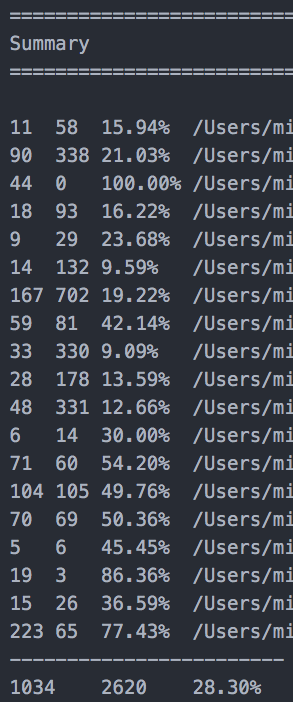

# 测试

# 测试

# 单元测试

# 单元测试

单元测试（unit testing），是指对软件中的最小可测试单元进行检查和验证。对于单元测试中单元的含义，一般来说，要根据实际情况去判定其具体含义，如 C 语言中单元指一个函数，Java 里单元指一个类，图形化的软件中可以指一个窗口或一个菜单等。总的来说，单元就是人为规定的最小的被测功能模块。单元测试是在软件开发过程中要进行的最低级别的测试活动，软件的独立单元将在与程序的其他部分相隔离的情况下进行测试。

单元测试的书写、验证，互联网公司几乎都是研发自己完成的，我们要保证代码出手时可交付、符合预期。如果连自己的预期都没达到，后面所有的工作，都将是额外无用功。

Lua 中我们没有找到比较好的测试库，参考了 Golang、Python 等语言的单元测试书写方法以及调用规则，我们编写了[lua-resty-test](https://github.com/membphis/lua-resty-test)测试库，这里给自己的库推广一下，希望这东东也是你们的真爱。

> nginx 示例配置

```
 #you do not need the following line if you are using
    #the ngx_openresty bundle:

    lua_package_path "/path/to/lua-resty-redis/lib/?.lua;;";

    server {
        location /test {
            content_by_lua_file test_case_lua/unit/test_example.lua;
        }
    } 
```

> test_case_lua/unit/test_example.lua:

```
local tb    = require "resty.iresty_test"
local test = tb.new({unit_name="bench_example"})

function tb:init(  )
    self:log("init complete")
end

function tb:test_00001(  )
    error("invalid input")
end

function tb:atest_00002()
    self:log("never be called")
end

function tb:test_00003(  )
   self:log("ok")
end

-- units test
test:run()

-- bench test(total_count, micro_count, parallels)
test:bench_run(100000, 25, 20) 
```

*   init 里面我们可以完成一些基础、公共变量的初始化，例如特定的 url 等
*   test_*****函数中添加我们的单元测试代码
*   搞定测试代码，它即是单元测试，也是成压力测试

> 输出日志：

```
TIME   Name            Log
0.000  [bench_example] unit test start
0.000  [bench_example] init complete
0.000    \_[test_00001] fail ...de/nginx/test_case_lua/unit/test_example.lua:9: invalid input
0.000    \_[test_00003] ↓ ok
0.000    \_[test_00003] PASS
0.000  [bench_example] unit test complete

0.000  [bench_example] !!!BENCH TEST START!!
0.484  [bench_example] succ count:   100001     QPS:     206613.65
0.484  [bench_example] fail count:   100001     QPS:     206613.65
0.484  [bench_example] loop count:   100000     QPS:     206611.58
0.484  [bench_example] !!!BENCH TEST ALL DONE!!! 
```

埋个伏笔：在压力测试例子中，测试到的 QPS 大约 21 万的，这是我本机一台 Mac Mini 压测的结果。构架好，姿势正确，我们可以很轻松做出好产品。

后面会详细说一下用这个工具进行压力测试的独到魅力，做出一个 NB 的网络处理应用，这个测试库应该是你的利器。

# 代码覆盖率

# 代码覆盖率

这是一个重要的可量化指标，如果代码覆盖率很高，你就可以放心的修改代码，在发版本的时候也能睡个安稳觉。否则就是拆东墙补西墙，陷入无尽的 bug 诅咒中。

那么在 OpenResty 里面如何看到代码覆盖率呢？其实很简单，使用 [LuaCov](https://keplerproject.github.io/luacov/) 可以很方便的实现。

我们先了解下 LuaCov，这是一个针对 Lua 脚本的代码覆盖率工具，通过 luarocks 来安装：

```
luarocks install luacov 
```

当然，你也可以通过 [github 上的源码](https://github.com/keplerproject/luacov) 编译来安装。这个方式你可以修改 LuaCov 的一些默认配置。

比如 LuaCov 的分析文件是按照 100 条一批来写入的，如果你的代码量不大，可能就会不准确。你可以修改 /src/luacov/defaults.lua 里面的 savestepsize，改为 2，来适应你的应用场景。

在 OPenResty 里面使用 LuaCov，只用在 nginx.conf 中增加 init_by_lua_block（只能放在 http 上下文中） 既可。

```
init_by_lua_block {
    require 'luacov.tick'
    jit.off()
} 
```

这个 *_bolck 语法在较新的 OpenResty 版本中新引入，如果提示指令不存在，请使用最新的来版本来测试。

重新启动 OpenResty 后，LuaCov 就已经生效了。你可以跑下单元测试，或者访问下 API 接口，在当前工作目录下，就会生成 `luacov.stats.out` 这个统计文件。然后 cd 到这个目录下，运行：

```
luacov 
```

就会生成 `luacov.report.out` 这个可读性比较好的覆盖率报告。需要注意的是，luacov 这个命令后面不用加任何的参数，这个在官方文档里面有说明，只是比较隐晦。

我们看下 `luacov.report.out` 里面的一个片段：

```
1    function get_config(mid, args)
13      local configs = {}
13      local res, err = red:hmget("client_".. mid, "tpl_id", "gid")
13      if err then
****0     return nil, err
        end
      end 
```

代码前面的数字，代表的是运行的次数。而 `****0` 很明确的指出这行代码没有被测试案例覆盖到。

在 `luacov.report.out` 的最后会有一个汇总的覆盖率报告：



可以看到，在我的这个单元测试里面，一共涉及到近 20 个代码文件。其中倒数第三个是我测试的 API 接口， 覆盖到的代码有 19 行，没有覆盖的有 3 行，所以代码覆盖率是 86.36% （19.0 / (19 + 3)）。

最后有一个总的代码覆盖率是 28.3%，这个值在跑完所有单元测试后是有意义的，单跑一个是没有参考价值的，因为很多基础函数可能并没有运行到。

# API 测试

# API 测试

API（Application Programming Interface）测试的自动化是软件测试最基本的一种类型。从本质上来说，API 测试是用来验证组成软件的那些单个方法的正确性，而不是测试整个系统本身。API 测试也称为单元测试（Unit Testing）、模块测试（Module Testing）、组件测试（Component Testing）以及元件测试（Element Testing）。从技术上来说，这些术语是有很大的差别的，但是在日常应用中，你可以认为它们大致相同的意思。它们背后的思想就是，必须确定系统中每个单独的模块工作正常，否则，这个系统作为一个整体不可能是正确的。毫无疑问，API 测试对于任何重要的软件系统来说都是必不可少的。

我们对 API 测试的定位是服务对外输出的 API 接口测试，属于黑盒、偏重业务的测试步骤。

看过上一章内容的朋友还记得[lua-resty-test](https://github.com/membphis/lua-resty-test)，我们的 API 测试同样是需要它来完成。get_client_tasks 是终端用来获取当前可执行任务清单的 API，我们用它当做例子给大家做个介绍。

> nginx conf:

```
location ~* /api/([\w_]+?)\.json {
    content_by_lua_file lua/$1.lua;
}

location ~* /unit_test/([\w_]+?)\.json {
    lua_check_client_abort on;
    content_by_lua_file test_case_lua/unit/$1.lua;
} 
```

> API 测试代码：

```
-- unit test for /api/get_client_tasks.json 
local tb = require "resty.iresty_test"
local json   = require("cjson")
local test = tb.new({unit_name="get_client_tasks"})

function tb:init(  )
    self.mid = string.rep('0',32)
end

function tb:test_0000()
    -- 正常请求
    local res = ngx.location.capture(
        '/api/get_client_tasks.json?mid='..self.mid,
        { method = ngx.HTTP_POST, body=[[{"type":[1600,1700]}]] }
    )

    if 200 ~= res.status then
        error("failed code:" .. res.status)
    end
end

function tb:test_0001()
    -- 缺少 body
    local res = ngx.location.capture(
        '/api/get_client_tasks.json?mid='..self.mid,
        { method = ngx.HTTP_POST }
    )

    if 400 ~= res.status then
        error("failed code:" .. res.status)
    end
end

function tb:test_0002()
    -- 错误的 json 内容
    local res = ngx.location.capture(
        '/api/get_client_tasks.json?mid='..self.mid,
        { method = ngx.HTTP_POST, body=[[{"type":"[1600,1700]}]] }
    )

    if 400 ~= res.status then
        error("failed code:" .. res.status)
    end
end

function tb:test_0003()
    -- 错误的 json 格式
    local res = ngx.location.capture(
        '/api/get_client_tasks.json?mid='..self.mid,
        { method = ngx.HTTP_POST, body=[[{"type":"[1600,1700]"}]] }
    )

    if 400 ~= res.status then
        error("failed code:" .. res.status)
    end
end

test:run() 
```

nginx output:

```
0.000  [get_client_tasks] unit test start
0.001    \_[test_0000] PASS
0.001    \_[test_0001] PASS
0.001    \_[test_0002] PASS
0.001    \_[test_0003] PASS
0.001  [get_client_tasks] unit test complete 
```

使用 capture 来模拟请求，其实是不靠谱的。如果我们要完全 100%模拟客户请求，这时候就要使用第三方 cosocket 库，例如[lua-resty-http](https://github.com/pintsized/lua-resty-http)，这样我们才可以完全指定 http 参数。

# 性能测试

# 性能测试

性能测试应该有两个方向：

*   单接口压力测试
*   生产环境模拟用户操作高压力测试

生产环境模拟测试，目前我们都是交给公司的 QA 团队专门完成的。这块我只能粗略列举一下：

*   获取 1000 用户以上生产用户的访问日志（统计学要求 1000 是最小集合）
*   计算指定时间内（例如 10 分钟），所有接口的触发频率
*   使用测试工具（loadrunner, jmeter 等）模拟用户请求接口
*   适当放大压力，就可以模拟 2000、5000 等用户数的情况

#### ab 压测

单接口压力测试，我们都是由研发团队自己完成的。传统一点的方法，我们可以使用 ab(apache bench)这样的工具。

```
#ab -n10 -c2 http://haosou.com/

-- output:
...
Complete requests:      10
Failed requests:        0
Non-2xx responses:      10
Total transferred:      3620 bytes
HTML transferred:       1780 bytes
Requests per second:    22.00 [#/sec] (mean)
Time per request:       90.923 [ms] (mean)
Time per request:       45.461 [ms] (mean, across all concurrent requests)
Transfer rate:          7.78 [Kbytes/sec] received
... 
```

大家可以看到 ab 的使用超级简单，简单的有点弱了。在上面的例子中，我们发起了 10 个请求，每个请求都是一样的，如果每个请求有差异，ab 就无能为力。

#### wrk 压测

单接口压力测试，为了满足每个请求或部分请求有差异，我们试用过很多不同的工具。最后找到了这个和我们距离最近、表现优异的测试工具[wrk](https://github.com/wg/wrk)，这里我们重点介绍一下。

wrk 如果要完成和 ab 一样的压力测试，区别不大，只是命令行参数略有调整。下面给大家举例每个请求都有差异的例子，供大家参考。

> scripts/counter.lua

```
-- example dynamic request script which demonstrates changing
-- the request path and a header for each request
-------------------------------------------------------------
-- NOTE: each wrk thread has an independent Lua scripting
-- context and thus there will be one counter per thread

counter = 0

request = function()
   path = "/" .. counter
   wrk.headers["X-Counter"] = counter
   counter = counter + 1
   return wrk.format(nil, path)
end 
```

> shell 执行

```
# ./wrk -c10 -d1 -s scripts/counter.lua http://baidu.com
Running 1s test @ http://baidu.com
  2 threads and 10 connections
  Thread Stats   Avg      Stdev     Max   +/- Stdev
    Latency    20.44ms    3.74ms  34.87ms   77.48%
    Req/Sec   226.05     42.13   270.00     70.00%
  453 requests in 1.01s, 200.17KB read
  Socket errors: connect 0, read 9, write 0, timeout 0
Requests/sec:    449.85
Transfer/sec:    198.78KB 
```

> WireShark 抓包印证一下

```
GET /228 HTTP/1.1
Host: baidu.com
X-Counter: 228

...(应答包 省略)

GET /232 HTTP/1.1
Host: baidu.com
X-Counter: 232

...(应答包 省略) 
```

wrk 是个非常成功的作品，它的实现更是从多个开源作品中挖掘牛 X 东西融入自身，如果你每天还在用 C/C++，那么 wrk 的成功，对你应该有绝对的借鉴意义，多抬头，多看牛 X 代码，我们绝对可以创造奇迹。

引用[wrk](https://github.com/wg/wrk)官方结尾：

```
wrk contains code from a number of open source projects including the 'ae'
 event loop from redis, the nginx/joyent/node.js 'http-parser', and Mike
 Pall's LuaJIT. 
```

# 持续集成

# 持续集成

我们做的还不够好，先占个坑。

欢迎贡献章节。

# 灰度发布

# 灰度发布

我们做的还不够好，先占个坑。

欢迎贡献章节。