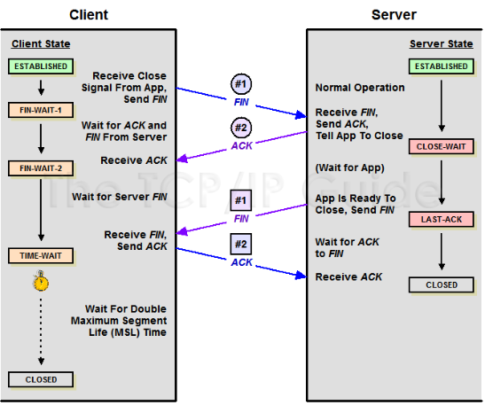

# Web 服务

# API 的设计

OpenResty，最擅长的应用场景之一就是 API Server。如果我们只有简单的几个 API 出口、入口，那么我们可以相对随意简单一些。

> 举例几个简单 API 接口输出：

```
server {
    listen       80;
    server_name  localhost;

    location /app/set {
        content_by_lua_block {
             ngx.say('set data')
        }
    }

    location /app/get {
        content_by_lua_block {
            ngx.say('get data')
        }
    }

    location /app/del {
        content_by_lua_block {
            ngx.say('del data')
        }
    }
} 
```

当你的 API Server 接口服务比较多，那么上面的方法显然不适合我们（太啰嗦）。这里推荐一下 REST 风格。

#### 什么是 REST

从资源的角度来观察整个网络，分布在各处的资源由 URI 确定，而客户端的应用通过 URI 来获取资源的表示方式。获得这些表徵致使这些应用程序转变了其状态。随着不断获取资源的表示方式，客户端应用不断地在转变着其状态，所谓表述性状态转移（Representational State Transfer）。

这一观点不是凭空臆造的，而是通过观察当前 Web 互联网的运作方式而抽象出来的。Roy Fielding 认为，

```
设计良好的网络应用表现为一系列的网页，这些网页可以看作的虚拟的状态机，用户选择这些链接
导致下一网页传输到用户端展现给使用的人，而这正代表了状态的转变。 
```

> REST 是设计风格而不是标准。

REST 通常基于使用 HTTP，URI，和 XML 以及 HTML 这些现有的广泛流行的协议和标准。

*   资源是由 URI 来指定。
*   对资源的操作包括获取、创建、修改和删除资源，这些操作正好对应 HTTP 协议提供的 GET、POST、PUT 和 DELETE 方法。
*   通过操作资源的表现形式来操作资源。
*   资源的表现形式则是 XML 或者 HTML，取决于读者是机器还是人，是消费 Web 服务的客户软件还是 Web 浏览器。当然也可以是任何其他的格式。

> REST 的要求

*   客户端和服务器结构
*   连接协议具有无状态性
*   能够利用 Cache 机制增进性能
*   层次化的系统

#### REST 使用举例

按照 REST 的风格引导，我们有关数据的 API Server 就可以变成这样。

```
server {
    listen       80;
    server_name  localhost;

    location /app/task01 {
        content_by_lua_block {
            ngx.say(ngx.req.get_method() .. ' task01')
        }
    }
    location /app/task02 {
        content_by_lua_block {
            ngx.say(ngx.req.get_method() .. ' task02')
        }
    }
    location /app/task03 {
        content_by_lua_block {
            ngx.say(ngx.req.get_method() .. ' task03')
        }
    }
} 
```

对于`/app/task01`接口，这时候我们可以用下面的方法，完成对应的方法调用。

```
# curl -X GET http://127.0.0.1/app/task01
# curl -X PUT http://127.0.0.1/app/task01
# curl -X DELETE http://127.0.0.1/app/task01 
```

#### 还有办法压缩不？

上一个章节，如果 task 类型非常多，那么后面这个配置依然会随着业务调整而调整。其实每个程序员都有一定的洁癖，是否可以以后直接写业务，而不用每次都修改主配置，万一改错了，服务就起不来了。

引用一下 HttpLuaModule 官方示例代码。

```
# use nginx var in code path
# WARNING: contents in nginx var must be carefully filtered,
# otherwise there'll be great security risk!
location ~ ^/app/([-_a-zA-Z0-9/]+) {
    set $path $1;
    content_by_lua_file /path/to/lua/app/root/$path.lua;
} 
```

这下世界宁静了，每天写 Lua 代码的同学，再也不用去每次修改 Nginx 主配置了。有新业务，直接开工。顺路还强制了入口文件命名规则。对于后期检查维护更容易。

#### REST 风格的缺点

需要一定的学习成本，如果你的接口是暴露给运维、售后、测试等不同团队，那么他们经常不去确定当时的`method`。当他们查看、模拟的时候，具有一定学习难度。

REST 推崇使用 HTTP 返回码来区分返回结果, 但最大的问题在于 HTTP 的错误返回码 (4xx 系列为主) 不够多，而且订得很随意。比如用 API 创建一个用户，那么错误可能有：

*   调用格式错误(一般返回 400,405)
*   授权错误(一般返回 403)
*   "运行期"错误
    *   用户名冲突
    *   用户名不合法
    *   email 冲突
    *   email 不合法

# 数据合法性检测

对用户输入的数据进行合法性检查，避免错误非法的数据进入服务，这是业务系统最常见的需求。很可惜 Lua 目前没有特别好的数据合法性检查库。

坦诚我们自己做的也不够好，这里只能抛砖引玉，看看大家是否有更好办法。

我们有这么几个主要的合法性检查场景：

*   JSON 数据格式
*   关键字段编码为 HEX（0-9，a-f，A-F），长度不定
*   TABLE 内部字段类型

#### JSON 数据格式

这里主要是`JSON DECODE`时，可能存在 Crash 的问题。我们已经在 JSON 解析的异常捕获 一章中详细说明了问题本身以及解决方法，这里就不再重复。

#### 关键字段编码为 HEX，长度不定

HEX 编码，最常见的存在有 MD5 值等。他们是由 0-9，A-F（或 a-f）组成。笔者把使用过的代码版本逐一罗列，并进行性能测试。通过这个测试，我们不仅仅可以收获参数校验的正确写法，以及可以再次印证一下效率最高的匹配，应该注意什么。

```
-- 纯 lua 版本，优点是兼容性好，可以使用任何 lua 语言环境
function check_hex_lua( str, correct_len )
    if "string" ~= type(str) then
        return false
    end

    for i=1, #str do
        local c = str:sub(i, i)
        if (c >= 'A' and c <= 'F') or
         (c >= 'a' and c <= 'f') or
         (c >= '0' and c <= '9')
         then
            -- print(c)
        else
            return false
        end
    end

    if correct_len and correct_len ~= #str then
      return false
    end

    return true
end

-- 使用 ngx.re.* 完成，没有使用任何调优参数
function check_hex_default( str )
    if "string" ~= type(str) then
        return false
    end

    return ngx.re.find(str, "([⁰-9^a-f^A-F])")
end

-- 使用 ngx.re.* 完成，使用调优参数 "jo"
function check_hex_jo( str )
    if "string" ~= type(str) then
        return false
    end

    return ngx.re.find(str, "([⁰-9^a-f^A-F])", "jo")
end

-- 下面就是测试用例部分代码
function do_test( name, fun )
    ngx.update_time()
    local start = ngx.now()

    local t = "012345678901234567890123456789abcdefABCDEF"
    for i=1,10000*300 do
        fun(t)
    end

    ngx.update_time()
    print(name, "\ttimes:", ngx.now() - start)
end

do_test("check_hex_lua", check_hex_lua)
do_test("check_hex_default", check_hex_default)
do_test("check_hex_jo", check_hex_jo) 
```

把上面的源码在 OpenResty 环境中运行，输出结果如下：

```
➜  resty test.lua
check_hex_lua   times:2.8619999885559
check_hex_default   times:4.1790001392365
check_hex_jo    times:0.91899991035461 
```

不知道这个结果大家是否有些意外，`check_hex_default` 的运行效率居然比 `check_hex_lua` 要差。不过所幸的是我们对正则开启了 `jo` 参数优化后，速度上有明显提升。

引用一下 ngx.re.* 官方 wiki 的原文：在优化性能时，o 选项非常有用，因为正则表达式模板将仅仅被编译一次，之后缓存在 worker 级的缓存中，并被此 nginx worker 处理的所有请求共享。缓存数量上限可以通过 lua_regex_cache_max_entries 指令调整。

> 课后小作业：为什么测试用例中要使用 ngx.update_time() 呢？好好想一想。

#### TABLE 内部字段类型

当我们接收客户端请求，除了指定字段的特殊校验外，我们最常见的需求就是对指定字段的类型做限制了。比如用户注册接口，我们就要求对方姓名、邮箱等是个字符串，手机号、电话号码等是个数字类型，详细信息可能是个图片又或者是个嵌套的 TABLE 。

例如我们接受用户的注册请求，注册接口示例请求 body 如下：

```
{
    "username":"myname",
    "age":8,
    "tel":88888888,
    "mobile_no":13888888888,
    "email":"***@**.com",
    "love_things":["football", "music"]
} 
```

这时候可以用一个简单的字段描述格式来表达限制关系，如下：

```
{
    "username":"",
    "age":0,
    "tel":0,
    "mobile_no":0,
    "email":"",
    "love_things":[]
} 
```

对于有效字段描述格式，数据值是不敏感的，但是数据类型是敏感的，只要数据类型能匹配，就可以让我们轻松不少。

来看下面的参数校验代码以及基本的测试用例：

```
function check_args_template(args, template)
    if type(args) ~= type(template) then
      return false
    elseif "table" ~= type(args) then
      return true
    end

    for k,v in pairs(template) do
      if type(v) ~= type(args[k]) then
        return false
      elseif "table" == type(v) then
        if not check_args_template(args[k], v) then
          return false
        end
      end
    end

    return true
end

local args = {name="myname", tel=888888, age=18,
    mobile_no=13888888888, love_things = ["football", "music"]}

print("valid   check: ", check_args_template(args, {name="", tel=0, love_things=[]}))
print("unvalid check: ", check_args_template(args, {name="", tel=0, love_things=[], email=""})) 
```

运行一下上面的代码，结果如下：

```
➜  resty test.lua
valid   check: true
unvalid check: false 
```

可以看到，当我们业务层面需要有 email 地址但是请求方没有上送，这时候就能检测出来了。大家看到这里也许会笑，尤其是从其他成熟 web 框架中过来的同学，我们这里的校验可以说是比较粗糙简陋的，很多开源框架中的参数限制，都可以做到更加精确的限制。

如果你有更好更优雅的解决办法，欢迎与我们联系。

# 协议无痛升级

使用度最高的通讯协议，一定是`HTTP`了。优点有多少，相信大家肯定有切身体会。我相信每家公司对`HTTP`的使用都有自己的规则，甚至偏好。这东西没有谁对谁错，符合业务需求、量体裁衣是王道。这里我们想通过亲身体会，告诉大家利用好`OpenResty`的一些特性，会给我们带来惊喜。

在产品初期，由于产品初期存在极大不确定性、不稳定性，所以要暴露给开发团队、测试团队完全透明的传输协议，所以我们 1.0 版本就是一个没有任何处理的明文版本`HTTP+JSON`。但随着产品功能的丰富，质量的逐步提高，具备一定的交付能力，这时候通讯协议必须要升级了。

为了更好的安全、效率控制，我们需要支持压缩、防篡改、防重复、简单加密等特性，为此我们设计了全新 2.0 通讯协议。如何让这个协议升级无感知、改动少，并且简单呢？

> 1.0 明文协议配置

```
location ~ ^/api/([-_a-zA-Z0-9/]+).json {
    content_by_lua_file /path/to/lua/api/$1.lua;
} 
```

> 1.0 明文协议引用示例：

```
# curl http://ip:port/api/hearbeat.json?key=value -d '...' 
```

> 2.0 密文协议引用示例：

```
# curl http://ip:port/api/hearbeat.json?key=value&ver=2.0 -d '...' 
```

从引用示例中看到，我们的密文协议主要都是在请求`body`中做的处理。最生硬的办法就是我们在每个业务入口、出口分别做协议的解析、编码处理。如果你只有几个 API 接口，那么直来直去的修改所有 API 接口源码，最为直接，容易理解。但如果你需要修改几十个 API 入口，那就要静下来考虑一下，修改的代价是否完全可控。

最后我们使用了`OpenResty`阶段的概念完成协议的转换。

```
location ~ ^/api/([-_a-zA-Z0-9/]+).json {
    access_by_lua_file  /path/to/lua/api/protocal_decode.lua;
    content_by_lua_file /path/to/lua/api/$1.lua;
    body_filter_by_lua_file  /path/to/lua/api/protocal_encode.lua;
} 
```

> 内部处理流程说明

*   `Nginx`中这三个阶段的执行顺序：access --> content --> body_filter；
*   access_by_lua_file：获取协议版本 --> 获取 body 数据 --> 协议解码 --> 设置 body 数据；
*   content_by_lua_file：正常业务逻辑处理，零修改；
*   body_filter_by_lua_file：判断协议版本 --> 协议编码。

刚好前些日子春哥公开了一篇`Github`中引入了`OpenResty`解决 SSL 证书的问题，他们的解决思路和我们差不多。都是利用 access 阶段做一些非标准 HTTP(S)上的自定义修改，但对于已有业务是不需要任何感知的。

我们这个通讯协议的无痛升级，实际上是有很多玩法可以实现，如果我们的业务从一开始有个相对稳定的框架，可能完全不需要操这个心。没有引入框架，一来是现在没有哪个框架比较成熟，而来是从基础开始更容易摸到细节。对于目前`OpenResty`可参考资料少的情况下，我们更倾向于从最小工作集开始，减少不确定性、复杂度。

也许在后面，我们会推出我们的开发框架，用来统一规避现在碰到的问题，提供完整、可靠、高效的解决方法，我们正在努力 ing，请大家拭目以待。

# 代码规范

其实选择`OpenResty`的同学，应该都是对执行性能、开发效率比较在乎的，而对于代码风格、规范等这些`小事`不太在意。作为一个从 Linux C/C++转过来的研发，脚本语言的开发速度，接近 C/C++的执行速度，在我轻视了代码规范后，一个 BUG 的发生告诉我，没规矩不成方圆。

既然我们玩的是`OpenResty`，那么很自然的联想到，`OpenResty`自身组件代码风格是怎样的呢？

> lua-resty-string 的 string.lua

```
local ffi = require "ffi"
local ffi_new = ffi.new
local ffi_str = ffi.string
local C = ffi.C
local setmetatable = setmetatable
local error = error
local tonumber = tonumber

local _M = { _VERSION = '0.09' }

ffi.cdef[[
typedef unsigned char u_char;

u_char * ngx_hex_dump(u_char *dst, const u_char *src, size_t len);

intptr_t ngx_atoi(const unsigned char *line, size_t n);
]]

local str_type = ffi.typeof("uint8_t[?]")

function _M.to_hex(s)
    local len = #s * 2
    local buf = ffi_new(str_type, len)
    C.ngx_hex_dump(buf, s, #s)
    return ffi_str(buf, len)
end

function _M.atoi(s)
    return tonumber(C.ngx_atoi(s, #s))
end

return _M 
```

代码虽短，但我们可以从中获取很多信息：

1.  没有全局变量，所有的变量均使用`local`限制作用域
2.  提取公共函数到本地变量，使用本地变量缓存函数指针，加速下次使用
3.  函数名称全部小写，使用下划线进行分割
4.  两个函数之间距离两个空行

这里的第 2 条，是有争议的。当你按照这个方式写业务的时候，会有些痛苦。因为我们总是把标准 API 命名成自己的别名，不同开发协作人员，命名结果一定不一样，最后导致同一个标准 API 在不同地方变成不同别名，会给开发造成极大困惑。

因为这个可预期的麻烦，我们没有遵循第 2 条标准，尤其是具体业务上游模块。但对于被调用的次数比较多基础模块，可以使用这个方式进行调优。其实这里最好最完美的方法，应该是 Lua 编译成 Luac 的时候，直接做 Lua Byte Code 的调优，直接隐藏这个简单的处理逻辑。

有关更多代码细节，其实我觉得主要还是多看写的漂亮的代码，一旦看他们看的顺眼、形成习惯，那么就很自然能写出风格一致的代码。规定的条条框框死记硬背总是很不爽的，所以多去看看春哥开源的`resty`系列代码，顺手品一品一下不同组件的玩法也别有一番心得。

说说我上面提及的因为风格问题造出来的坑吧。

```
local 
function test()
    -- do something
end

function test2()
    -- do something
end 
```

这是我当时不记得从哪里看到的一个`Lua`风格，在被引入项目初期，自我感觉良好。可突然从某个时间点开始，新合并进来的代码无法正常工作。查看最后的代码发现原来是`test()`函数作废，被删掉，手抖没有把上面的`local`也删掉。这个隐形的`local`就作用到了下一个函数，最终导致异常。

# 连接池

作为一个专业的服务端开发工程师，我们必须要对连接池、线程池、内存池等有较深理解，并且有自己熟悉的库函数可以让我们轻松驾驭这些不同的`池子`。既然他们都叫某某池，那么他们从基础概念上讲，原理和目的几乎是一样的，那就是`复用`。

以连接池做引子，我们说说服务端工程师基础必修课。

从我们应用最多的 HTTP 连接、数据库连接、消息推送、日志存储等，所有点到点之间，都需要花样繁多的各色连接。为了传输数据，我们需要完成创建连接、收发数据、拆除连接。对并发量不高的场景，我们为每个请求都完整走这三步（短连接），开发工作基本只考虑业务即可，基本上也不会有什么问题。一旦挪到高并发应用场景，那么可能我们就要郁闷了。

你将会碰到下面几个常见问题：

*   性能普遍上不去
*   CPU 大量资源被系统消耗
*   网络一旦抖动，会有大量 TIME_WAIT 产生，不得不定期重启服务或定期重启机器
*   服务器工作不稳定，QPS 忽高忽低

这时候我们可以优化的第一件事情就是把短链接改成长连接。也就是改成创建连接、收发数据、收发数据...拆除连接，这样我们就可以减少大量创建连接、拆除连接的时间。从性能上来说肯定要比短连接好很多。但这里还是有比较大的浪费。

举例：请求进入时，直接分配数据库长连接资源，假设有 80% 时间在与关系型数据库通讯，20% 时间是在与 Nosql 数据库通讯。当有 50K 个并行请求时，后端要分配 50K*2=100K 的长连接支撑请求。无疑这时候系统压力是非常大的。数据库再牛也抵不住滥用不是？

连接池终于要出场了，它的解决思路是先把所有长连接存起来，谁需要使用，从这里取走，干完活立马放回来。那么按照这个思路，刚刚的 50K 的并发请求，最多占用后端 50K 的长连接就够了。省了一半啊有木有？

在 OpenResty 中，所有具备 set_keepalive 的类、库函数，说明他都是支持连接池的。

来点代码，给大家提提神，看看连接池使用时的一些注意点，麻雀虽小，五脏俱全。

```
server {
    location /test {
        content_by_lua_block {
            local redis = require "resty.redis"
            local red = redis:new()

            local ok, err = red:connect("127.0.0.1", 6379)
            if not ok then
                ngx.say("failed to connect: ", err)
                return
            end

            -- red:set_keepalive(10000, 100)       -- 坑①

            ok, err = red:set("dog", "an animal")
            if not ok then
                -- red:set_keepalive(10000, 100)   -- 坑②
                return
            end

            -- 坑③
            red:set_keepalive(10000, 100)
        }
    }
} 
```

*   坑①：只有数据传输完毕了，才能放到池子里，系统无法帮你自动做这个事情
*   坑②：不能把状态未知的连接放回池子里，设想另一个请求如果获取到一个不能用的连接，他不得哭死啊
*   坑③：逗你玩，这个不是坑，是正确的

尤其是掉进了第二个坑，你一定会莫名抓狂。不信的话，你就自己模拟试试，老带劲了。

理解了连接池，那么线程池、内存池，就应该都明白了，只是存放的东西不一样，思想没有任何区别。

# C10K 编程

比较传统的服务端程序（PHP、FAST CGI 等），大多都是通过每产生一个请求，都会有一个进程与之相对应，请求处理完毕后相关进程自动释放。由于进程创建、销毁对资源占用比较高，所以很多语言都通过常驻进程、线程等方式降低资源开销。即使是资源占用最小的线程，当并发数量超过 1k 的时候，操作系统的处理能力就开始出现明显下降，因为有太多的 CPU 时间都消耗在系统上下文切换。

由此催生了 C10K 编程，指的是服务器同时支持成千上万个连接，也就是 concurrent 10 000 connection（这也是 C10K 这个名字的由来）。由于硬件成本的大幅度降低和硬件技术的进步，加上一台服务器同时能够服务更多的客户端，就意味着服务每一个客户端的成本大幅度降低，从这个角度来看，C10K 问题显得非常有意义。

理想情况下，具备 C10K 能力的服务端处理能力是 c1k 的十倍，返回来说我们可以减少 90%的服务器资源，多么诱人的结果。

C10K 解决了这几个主要问题：

*   单个进程或线程可以服务于多个客户端请求
*   事件触发替代业务轮询
*   IO 采用非阻塞方式，减少额外不必要性能损耗

C10K 编程的世界，一定是异步编程的世界，他俩绝对是一对儿好基友。服务端一直都不缺乏新秀，各种语言、框架层出不穷。笔者了解的就有 OpenResty，Golang，Node.js，Rust，Python(gevent)等。每个语言或解决方案，都有自己完全不同的定位和表现，甚至设计哲学。但是他们从系统底层 API 应用、基本结构，都是相差不大。这些语言自身的实现机理、运行方式可能差别很大，但只要没有严重的代码错误，他们的性能指标都应该是在同一个级别的。

如果你用了这些解决方案，发现自己的性能非常低，就要好好看看自己是不是姿势有问题。

> c1k --> C10K --> c100k --> ???

人类前进的步伐，没有尽头的，总是在不停的往前跑。C10K 的问题，早就被解决，而且方法还不止一个。目前方案优化手段给力，做到 c100k 也是可以达到的。后面还有世界么？我们还能走么？

告诉你肯定是有的，那就是 c10m。推荐大家了解一下[dpdk](http://www.dpdk.eu)这个项目，并搜索一些相关领域的知识。要做到 c10m，可以说系统网络内核、内存管理，都成为瓶颈了。所以要揭竿起义，统统推到重来。直接操作网卡绕过内核对网络的封装，直接使用用户态内存，再次绕过系统内核。

c10m 这个动作比较大，而且还需要特定的硬件型号支持（主要是网卡，网络处理嘛），所以目前这个项目进展还比较缓慢。不过对于有追求的人，可能就要两眼放光了。

前些日子 dpdk 组织国内 CDN 厂商开了一个小会，阿里的朋友说已经用这个开发出了 c10m 级别的产品。小伙伴们，你们怎么看？心动了，行动不？

# TIME_WAIT 问题

# TIME_WAIT

这个是高并发服务端常见的一个问题，一般的做法是修改 sysctl 的参数来解决。 但是，做为一个有追求的程序猿，你需要多问几个为什么，为什么会出现 TIME_WAIT？出现这个合理吗？

我们需要先回顾下 tcp 的知识，请看下面的状态转换图（图片来自[「The TCP/IP Guide」](http://www.tcpipguide.com/)）：



因为 TCP 连接是双向的，所以在关闭连接的时候，两个方向各自都需要关闭。 先发 FIN 包的一方执行的是主动关闭；后发 FIN 包的一方执行的是被动关闭。 ***主动关闭的一方会进入 TIME_WAIT 状态，并且在此状态停留两倍的 MSL 时长。***

修改 sysctl 的参数，只是控制 TIME_WAIT 的数量。你需要很明确的知道，在你的应用场景里面，你预期是服务端还是客户端来主动关闭连接的。一般来说，都是客户端来主动关闭的。

nginx 在某些情况下，会主动关闭客户端的请求，这个时候，返回值的 connection 为 close。我们看两个例子：

*   #### http 1.0 协议

请求包：

```
GET /hello HTTP/1.0
User-Agent: curl/7.37.1
Host: 127.0.0.1
Accept: */*
Accept-Encoding: deflate, gzip 
```

应答包：

```
HTTP/1.1 200 OK
Date: Wed, 08 Jul 2015 02:53:54 GMT
Content-Type: text/plain
Connection: close
Server: 360 Web server

hello world 
```

对于 http 1.0 协议，如果请求头里面没有包含 connection，那么应答默认是返回 Connection: close， 也就是说 nginx 会主动关闭连接。

*   #### user agent

    请求包：

```
POST /api/heartbeat.json HTTP/1.1

Content-Type: application/x-www-form-urlencoded
Cache-Control: no-cache
User-Agent: Mozilla/4.0 (compatible; MSIE 6.0; Windows NT)
Accept-Encoding: gzip, deflate
Accept: */*
Connection: Keep-Alive
Content-Length: 0 
```

应答包：

```
HTTP/1.1 200 OK
Date: Mon, 06 Jul 2015 09:35:34 GMT
Content-Type: text/plain
Transfer-Encoding: chunked
Connection: close
Server: 360 Web server
Content-Encoding: gzip 
```

这个请求包是 http1.1 的协议，也声明了 Connection: Keep-Alive，为什么还会被 nginx 主动关闭呢？ ***问题出在 User-Agent***，nginx 认为终端的浏览器版本太低，不支持 keep alive，所以直接 close 了。

在我们应用的场景下，终端不是通过浏览器而是后台请求的， 而我们也没法控制终端的 User-Agent，那有什么方法不让 nginx 主动去关闭连接呢？ 可以用[keepalive_disable](http://nginx.org/en/docs/http/ngx_http_core_module.html#keepalive_disable)这个参数来解决。这个参数并不是字面的意思，用来关闭 keepalive， 而是用来定义哪些古代的浏览器不支持 keepalive 的，默认值是 MSIE6。

```
keepalive_disable none; 
```

修改为 none，就是认为不再通过 User-Agent 中的浏览器信息，来决定是否 keepalive。

注：本文内容参考了[火丁笔记](http://huoding.com/2013/12/31/316)和[Nginx 开发从入门到精通](http://tengine.taobao.org/book/chapter_02.html)，感谢大牛的分享。

# 与 Docker 使用的网络瓶颈

Docker 是一个开源的应用容器引擎，让开发者可以打包他们的应用以及依赖包到一个可移植的容器中，然后发布到任何流行的 Linux 机器上，也可以实现虚拟化。容器是完全使用沙箱机制，相互之间不会有任何接口（类似 iPhone 的 app）。几乎没有性能开销,可以很容易地在机器和数据中心中运行。最重要的是,他们不依赖于任何语言、框架包括系统。

Docker 自 2013 年以来非常火热，无论是从 github 上的代码活跃度，还是 Redhat 在 RHEL6.5 中集成对 Docker 的支持, 就连 Google 的 Compute Engine 也支持 docker 在其之上运行。

在 360 企业版安全中，我们使用 Docker 的原因和目的，可能与其他公司不太一样。我们一直存在比较特殊的"分发"需求，Docker 主要是用来屏蔽企业用户平台的不一致性。我们的企业用户使用的系统比较杂，仅仅主流系统就有 Ubuntu, Centos，RedHat，AIX，还有一些定制裁减系统等，百花齐放。

虽然 OpenResty 具有良好的跨平台特性，无奈我们的安全项目比较重，组件比较多，是不可能逐一适配不同平台的，工作量、稳定性等，难度和后期维护复杂度是难以想象的。如果您的应用和我们一样需要二次分发，非常建议考虑使用 docker。这个年代是云的时代，二次分发其实成本很高，后期维护成本也很高，所以尽量做到云端。

说说 Docker 与 OpenResty 之间的"坑"吧，你们肯定对这个更感兴趣。

我们刚开始使用的时候，是这样启动的：

```
docker run -d -p 80:80 openresty 
```

首次压测过程中发现 Docker 进程 CPU 占用率 100%，单机接口 4-5 万的 QPS 就上不去了。经过我们多方探讨交流，终于明白原来是网络瓶颈所致（OpenResty 太彪悍，Docker 默认的虚拟网卡受不了了 ^_^）。

最终我们绕过这个默认的桥接网卡，使用`--net`参数即可完成。

```
docker run -d -p --net=host 80:80 openresty 
```

多么简单，就这么一个参数，居然困扰了我们好几天。一度怀疑我们是否要忍受引入 docker 带来的低效率网络。所以有时候多出来交流、学习，真的可以让我们学到好多。虽然这个点是我们自己挖出来的，但是在交流过程中还学到了很多好东西。

> Docker Network settings，引自：[`www.lupaworld.com/article-250439-1.html`](http://www.lupaworld.com/article-250439-1.html)

```
默认情况下，所有的容器都开启了网络接口，同时可以接受任何外部的数据请求。
--dns=[]         : Set custom dns servers for the container
--net="bridge"   : Set the Network mode for the container
                          'bridge': creates a new network stack for the container on the docker bridge
                          'none': no networking for this container
                          'container:<name|id>': reuses another container network stack
                          'host': use the host network stack inside the container
--add-host=""    : Add a line to /etc/hosts (host:IP)
--mac-address="" : Sets the container's Ethernet device's MAC address 
```

你可以通过`docker run --net none`来关闭网络接口，此时将关闭所有网络数据的输入输出，你只能通过 STDIN、STDOUT 或者 files 来完成 I/O 操作。默认情况下，容器使用主机的 DNS 设置，你也可以通过`--dns`来覆盖容器内的 DNS 设置。同时 Docker 为容器默认生成一个 MAC 地址，你可以通过`--mac-address 12:34:56:78:9a:bc`来设置你自己的 MAC 地址。

Docker 支持的网络模式有：

*   none。关闭容器内的网络连接
*   bridge。通过 veth 接口来连接容器，默认配置。
*   host。允许容器使用 host 的网络堆栈信息。 注意：这种方式将允许容器访问 host 中类似 D-BUS 之类的系统服务，所以认为是不安全的。
*   container。使用另外一个容器的网络堆栈信息。 　　

#### None 模式

将网络模式设置为 none 时，这个容器将不允许访问任何外部 router。这个容器内部只会有一个 loopback 接口，而且不存在任何可以访问外部网络的 router。

#### Bridge 模式

Docker 默认会将容器设置为 bridge 模式。此时在主机上面将会存在一个 docker0 的网络接口，同时会针对容器创建一对 veth 接口。其中一个 veth 接口是在主机充当网卡桥接作用，另外一个 veth 接口存在于容器的命名空间中，并且指向容器的 loopback。Docker 会自动给这个容器分配一个 IP，并且将容器内的数据通过桥接转发到外部。

#### Host 模式

当网络模式设置为 host 时，这个容器将完全共享 host 的网络堆栈。host 所有的网络接口将完全对容器开放。容器的主机名也会存在于主机的 hostname 中。这时，容器所有对外暴露的端口和对其它容器的连接，将完全失效。

#### Container 模式

当网络模式设置为 Container 时，这个容器将完全复用另外一个容器的网络堆栈。同时使用时这个容器的名称必须要符合下面的格式：--net container:<nameu0007cid class="hljs-url">.</nameu0007cid>

比如当前有一个绑定了本地地址 localhost 的 Redis 容器。如果另外一个容器需要复用这个网络堆栈，则需要如下操作：

```
$ sudo docker run -d --name redis example/redis --bind 127.0.0.1
$ # use the redis container's network stack to access localhost
$ sudo docker run --rm -ti --net container:redis example/redis-cli -h 127.0.0.1 
```