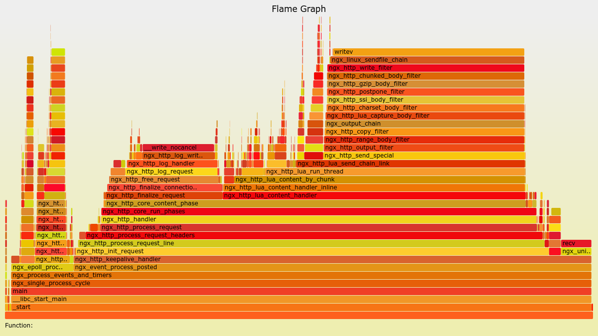
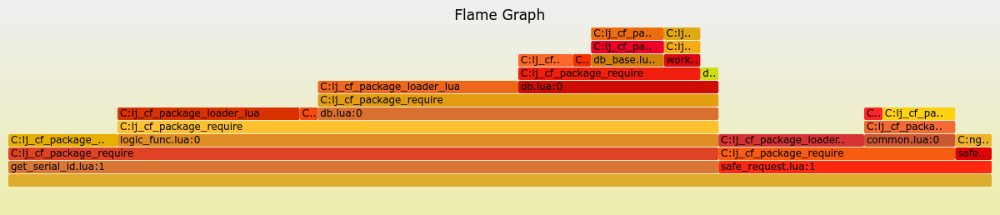

# 火焰图

# 火焰图

火焰图是定位疑难杂症的神器，比如 CPU 占用高、内存泄漏等问题。特别是 Lua 级别的火焰图，可以定位到函数和代码级别。

下图来自 openresty 的[官网](http://openresty.org/download/user-flamegraph.svg)，显示的是一个正常运行的 openresty 应用的火焰图，先不用了解细节，有一个直观的了解。



里面的颜色是随机选取的，并没有特殊含义。火焰图的数据来源，是通过[systemtap](https://sourceware.org/systemtap/)定期收集。

# 什么时候使用

# 什么时候使用

一般来说，当发现 CPU 的占用率和实际业务应该出现的占用率不相符，或者对 nginx worker 的资源使用率（CPU，内存，磁盘 IO）出现怀疑的情况下，都可以使用火焰图进行抓取。另外，对 CPU 占用率低、吐吞量低的情况也可以使用火焰图的方式排查程序中是否有阻塞调用导致整个架构的吞吐量低下。

关于[Github](https://github.com/openresty/nginx-systemtap-toolkit)上提供的由 perl 脚本完成的栈抓取的程序是一个傻瓜化的 stap 脚本，如果有需要可以自行使用 stap 进行栈的抓取并生成火焰图，各位看官可以自行尝试。

# 显示的是什么

# 显示的是什么

# 如何安装火焰图生成工具

# 如何安装火焰图生成工具

#### 安装 SystemTap

> 环境 CentOS 6.5 2.6.32-504.23.4.el6.x86_64

SystemTap 是一个诊断 Linux 系统性能或功能问题的开源软件，为了诊断系统问题或性能，开发者或调试人员只需要写一些脚本，然后通过 SystemTap 提供的命令行接口就可以对正在运行的内核进行诊断调试。

首先需要安装内核开发包和调试包（这一步非常重要并且最为繁琐）：

```
# #Installaion:
# rpm -ivh kernel-debuginfo-($version).rpm
# rpm -ivh kernel-debuginfo-common-($version).rpm
# rpm -ivh kernel-devel-($version).rpm 
```

其中$version 使用 linux 命令 uname -r 查看，需要保证内核版本和上述开发包版本一致才能使用 systemtap。([下载](http://debuginfo.centos.org))

安装 systemtap：

```
# yum install systemtap
# ...
# 测试 systemtap 安装成功否：
# stap -v -e 'probe vfs.read {printf("read performed\n"); exit()}'

Pass 1: parsed user script and 103 library script(s) using 201628virt/29508res/3144shr/26860data kb, in 10usr/190sys/219real ms.
Pass 2: analyzed script: 1 probe(s), 1 function(s), 3 embed(s), 0 global(s) using 296120virt/124876res/4120shr/121352data kb, in 660usr/1020sys/1889real ms.
Pass 3: translated to C into "/tmp/stapffFP7E/stap_82c0f95e47d351a956e1587c4dd4cee1_1459_src.c" using 296120virt/125204res/4448shr/121352data kb, in 10usr/50sys/56real ms.
Pass 4: compiled C into "stap_82c0f95e47d351a956e1587c4dd4cee1_1459.ko" in 620usr/620sys/1379real ms.
Pass 5: starting run.
read performed
Pass 5: run completed in 20usr/30sys/354real ms. 
```

如果出现如上输出表示安装成功。

> 在 Ubuntu 14.04 Desktop 上的安装方法

打开 Systemtap Ubuntu 系统安装官方 [wiki](https://sourceware.org/systemtap/wiki/SystemtapOnUbuntu) 地址，获取 systemtap 安装包：

```
sudo apt-get install systemtap 
```

其次我们还需要内核支持（具有 CONFIG_DEBUG_FS, CONFIG_DEBUG_KERNEL, CONFIG_DEBUG_INFO 和 CONFIG_KPROBES 标识的内核，不需要重新编译内核）。对于 `Ubuntu Gutsy` (或更老的版本)，必须重新编译内核。

生成 ddeb repository 配置：

```
# cat > /etc/apt/sources.list.d/ddebs.list << EOF
deb http://ddebs.ubuntu.com/ precise main restricted universe multiverse
EOF

etc.

# apt-key adv --keyserver keyserver.ubuntu.com --recv-keys ECDCAD72428D7C01
# apt-get update 
```

针对 Ubuntu 14.04 版本（其他版本，只要不太老，相差不大），我们按照下面顺序尝试重新编译内核：

```
# uname -r
3.13.0-34-generic
# dpkg --list | grep linux | grep 3.13.0-34-generic
ii  linux-headers-3.13.0-34-generic                       3.13.0-34.60
amd64        Linux kernel headers for version 3.13.0 on 64 bit x86 SMP
ii  linux-image-3.13.0-34-generic                         3.13.0-34.60
amd64        Linux kernel image for version 3.13.0 on 64 bit x86 SMP
ii  linux-image-extra-3.13.0-34-generic                   3.13.0-34.60
amd64        Linux kernel extra modules for version 3.13.0 on 64 bit x86 SMP
# apt-get install linux-image-3.13.0-34-generic 
```

上面的输出比较乱，大家要跟紧一条主线，`3.13.0-34-generic` 也就是 `uname -r` 的输出结果（如果您的系统和这个不一样，请自行更改），结合刚刚给出的 systemtap 官方 wiki 我们可以知道，正确的安装包地址应当是 `linux-image-**` 开头。这样我们，就可以很容易找到 `linux-image-3.13.0-34-generic` 是我们需要的。

#### 火焰图绘制

首先，需要下载 ngx 工具包：[Github 地址](https://github.com/openresty/nginx-systemtap-toolkit)，该工具包即是用 perl 生成 stap 探测脚本并运行的脚本，如果是要抓 Lua 级别的情况，请使用工具 ngx-sample-lua-bt

```
# ps -ef | grep nginx  （ps：得到类似这样的输出，其中 15010 即使 worker 进程的 pid，后面需要用到）
hippo    14857     1  0 Jul01 ?        00:00:00 nginx: master process /opt/openresty/nginx/sbin/nginx -p /home/hippo/skylar_server_code/nginx/main_server/ -c conf/nginx.conf
hippo    15010 14857  0 Jul01 ?        00:00:12 nginx: worker process
# ./ngx-sample-lua-bt -p 15010 --luajit20 -t 5 > tmp.bt （-p 是要抓的进程的 pid --luajit20|--luajit51 是 LuaJIT 的版本 -t 是探测的时间，单位是秒， 探测结果输出到 tmp.bt）
# ./fix-lua-bt tmp.bt > flame.bt  (处理 ngx-sample-lua-bt 的输出，使其可读性更佳) 
```

其次，下载 Flame-Graphic 生成包：[Github 地址](https://github.com/brendangregg/FlameGraph),该工具包中包含多个火焰图生成工具，其中，stackcollapse-stap.pl 才是为 SystemTap 抓取的栈信息的生成工具

```
# stackcollapse-stap.pl flame.bt > flame.cbt
# flamegraph.pl flame.cbt > flame.svg 
```

如果一切正常，那么会生成 flame.svg，这便是火焰图，用浏览器打开即可。

#### 问题回顾

在整个安装部署过程中，遇到的最大问题便是内核开发包和调试信息包的安装，找不到和内核版本对应的，好不容易找到了又不能下载，@！￥#@……%@#，于是升级了内核，在后面的过程便没遇到什么问题。 ps：如果在执行 ngx-sample-lua-bt 的时间周期内（上面的命令是 5 秒）,抓取的 worker 没有任何业务在跑，那么生成的火焰图便没有业务内容，不要惊讶哦~~~~~

# 如何定位问题

# 如何定位问题

一个正常的火焰图，应该呈现出如[官网](http://openresty.org/download/user-flamegraph.svg)给出的样例（官网的火焰图是抓 C 级别函数）： 

从上图可以看出，正常业务下的火焰图形状类似的“山脉”，“山脉”的“海拔”表示 worker 中业务函数的调用深度，“山脉”的“长度”表示 worker 中业务函数占用 cpu 的比例。

下面将用一个实际应用中遇到问题抽象出来的示例（CPU 占用过高）来说明如何通过火焰图定位问题。

问题表现，nginx worker 运行一段时间后出现 CPU 占用 100% 的情况，reload 后一段时间后复现，当出现 CPU 占用率高情况的时候是某个 worker 占用率高。

问题分析，单 worker cpu 高的情况一定是某个 input 中包含的信息不能被 Lua 函数以正确地方式处理导致的，因此上火焰图找出具体的函数，抓取的过程需要抓取 C 级别的函数和 Lua 级别的函数，抓取相同的时间，两张图一起分析才能得到准确的结果。

抓取步骤：

1.  安装 SystemTap;
2.  获取 CPU 异常的 worker 的进程 ID；

    > ps -ef | grep nginx

3.  使用 [ngx-sample-lua-bt](https://github.com/openresty/nginx-systemtap-toolkit)抓取栈信息,并用 fix-lua-bt 工具处理；

    > ./ngx-sample-lua-bt -p 9768 --luajit20 -t 5 > tmp.bt
    > ./fix-lua-bt tmp.bt > a.bt

4.  使用 [stackcollapse-stap.pl 和 flamegraph.pl](https://github.com/brendangregg/FlameGraph)；

    > ./stackcollapse-stap.pl a.bt > a.cbt
    > ./flamegraph.pl a.cbt > a.svg

5.  a.svg 即是火焰图，拖入浏览器即可：



1.  从上图可以清楚的看到 get_serial_id 这个函数占用了绝大部分的 CPU 比例，问题的排查可以从这里入手，找到其调用栈中异常的函数。

PS：一般来说一个正常的火焰图看起来像一座座连绵起伏的“山峰”，而一个异常的火焰图看起来像一座“平顶山”。

# Vanilla/香草

# Vanilla 介绍

Vanilla 是新浪移动事业部系统架构组的同学基于 OpenResty 自主研发的一个 Web 开发框架，目前服务于新浪移动后端多条产品线及核心接口池。

## 当前版本

V0.1.0-rc4.0

## 项目地址

Github：[`github.com/idevz/vanilla`](https://github.com/idevz/vanilla)

GitOSC：[`git.oschina.net/idevz/vanilla`](http://git.oschina.net/idevz/vanilla)

# 如何添加自己的 lua api

# 如何对 nginx Lua module 添加新 api

本文真正的目的，绝对不是告诉大家如何在 nginx Lua module 添加新 api 这么点东西。而是以此为例，告诉大家 nginx 模块开发环境搭建、码字编译、编写测试用例、代码提交、申请代码合并等。给大家顺路普及一下 git 的使用。

目前有个应用场景，需要获取当前 nginx worker 数量的需要，所以添加一个新的接口 ngx.config.workers()。由于这个功能实现简单，非常适合大家当做例子。废话不多说，let's fly now！

> 获取 openresty 默认安装包（辅助搭建基础环境）：

```
$ wget http://openresty.org/download/ngx_openresty-1.7.10.1.tar.gz
$ tar -xvf ngx_openresty-1.7.10.1.tar.gz
$ cd ngx_openresty-1.7.10.1 
```

> 从 github 上 fork 代码

*   进入[lua-nginx-module](https://github.com/openresty/lua-nginx-module)，点击右侧的 Fork 按钮
*   Fork 完毕后，进入自己的项目，点击 Clone in Desktop 把项目 clone 到本地

> 预编译，本步骤参考[这里](http://openresty.com/#Installation)：

```
$ ./configure
$ make 
```

`注意这里不需要 make install`

> 修改自己的源码文件

```
# ngx_lua-0.9.15/src/ngx_http_lua_config.c 
```

> 编译变化文件

```
$ rm ./nginx-1.7.10/objs/addon/src/ngx_http_lua_config.o
$ make 
```

# 搭建测试模块

> 安装 perl cpan [点击查看](http://www.cnblogs.com/itech/archive/2009/08/10/1542832.html)

```
$ cpan
cpan[2]> install Test::Nginx::Socket::Lua 
```

> 书写测试单元

```
$ cat 131-config-workers.t
# vim:set ft= ts=4 sw=4 et fdm=marker:
use lib 'lib';
use Test::Nginx::Socket::Lua;

#worker_connections(1014);
#master_on();
#workers(2);
#log_level('warn');

repeat_each(2);
#repeat_each(1);

plan tests => repeat_each() * (blocks() * 3);

#no_diff();
#no_long_string();
run_tests();

__DATA__

=== TEST 1: content_by_lua
--- config
    location /lua {
        content_by_lua_block {
            ngx.say("workers: ", ngx.config.workers())
        }
    }
--- request
GET /lua
--- response_body_like chop
^workers: 1$
--- no_error_log
[error] 
```

```
$ cat 132-config-workers_5.t
# vim:set ft= ts=4 sw=4 et fdm=marker:
use lib 'lib';
use Test::Nginx::Socket::Lua;

#worker_connections(1014);
#master_on();
workers(5);
#log_level('warn');

repeat_each(2);
#repeat_each(1);

plan tests => repeat_each() * (blocks() * 3);

#no_diff();
#no_long_string();
run_tests();

__DATA__

=== TEST 1: content_by_lua
--- config
    location /lua {
        content_by_lua_block {
            ngx.say("workers: ", ngx.config.workers())
        }
    }
--- request
GET /lua
--- response_body_like chop
^workers: 5$
--- no_error_log
[error] 
```

# 单元测试

```
$ export PATH=/path/to/your/nginx/sbin:$PATH    #设置 nginx 查找路径
$ cd ngx_lua-0.9.15                     # 进入你修改的模块
$ prove t/131-config-workers.t          # 测试指定脚本
t/131-config-workers.t .. ok
All tests successful.
Files=1, Tests=6,  1 wallclock secs ( 0.04 usr  0.00 sys +  0.18 cusr  0.05 csys =  0.27 CPU)
Result: PASS
$
$ prove t/132-config-workers_5.t        # 测试指定脚本
t/132-config-workers_5.t .. ok
All tests successful.
Files=1, Tests=6,  0 wallclock secs ( 0.03 usr  0.00 sys +  0.17 cusr  0.04 csys =  0.24 CPU)
Result: PASS 
```

# 提交代码，推动我们的修改被官方合并

*   首先把代码 commit 到 github
*   commit 成功后，以次点击 github 右上角的 Pull request -> New pull request
*   这时候 github 会弹出一个自己与官方版本对比结果的页面，里面包含有我们所有的修改，确定我们的修改都被包含其中，点击 Create pull request 按钮
*   输入标题、内容（you'd better write in english）,点击 Create pull request 按钮
*   提交完成，就可以等待官方作者是否会被采纳了（代码+测试用例，必不可少）

来看看我们的成果吧：

pull request : [点击查看](https://github.com/openresty/lua-nginx-module/pull/531) commit detail: [点击查看](https://github.com/membphis/lua-nginx-module/commit/9d991677c090e1f86fa5840b19e02e56a4a17f86)