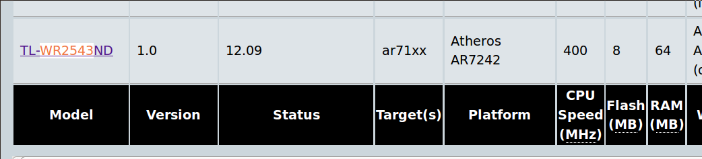
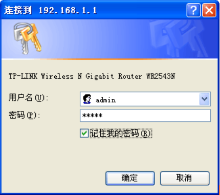

# 无线路由器刷 OpenWrt 固件的准备工作

# 无线路由器刷 OpenWrt 固件的准备工作

在给你的路由器刷新固件之前，有必要先了解：

1.  什么是无线路由器固件
2.  准备支持 OpenWrt 路由器
3.  如何备份路由器配置

* * *

#### 最简单的路由器刷 OpenWrt 固件翻墙教程:

[`github.com/softwaredownload/openwrt-fanqiang`](https://github.com/softwaredownload/openwrt-fanqiang "最简单的路由器刷 OpenWrt 固件翻墙教程")

#### 在线阅读 OpenWrt 翻墙路由器教程:

[`www.gitbook.com/book/softwaredownload/openwrt-fanqiang/details`](https://www.gitbook.com/book/softwaredownload/openwrt-fanqiang/details)

# 什么是无线路由器固件

# 什么是无线路由器固件

网络的本质是知识的开放与共享。人类社会进步速度，如果原来是自行车速，加上网络后，就坐上了火箭。

一个热爱学习的人，必然要查找一些英文学习资料，在某个国家的某个阶段必然会遇到一个问题：怎么 Google 搜索这么烂，经常打不开，YouTube 真差劲,加载半天还在打转...

后来，可能会发现，不是人家烂，而是有人故意为之。

怎么办呢？有很多种办法解决这个问题，其中一个较好的方案是从家用无线路由器上解决，然后全部有线和无线设备都可以无障碍上网了。

路由器的原厂固件限制了用户自行开发功能，我们必须要给路由器刷上特定的固件，并进行一些设置才可以翻墙。

无线路由器就好比是一台小电脑。电脑上安装了 Windows XP, Windows 7, Windows 8，或者 Ubuntu 等操作系统就可以使用了。固件就是给路由器使用的操作系统，是固化在路由器芯片内的操作系统。

## 常用的开源第三方无线路由器固件

1.  开源 OpenWRT 路由器固件：部署复杂、灵活性高
    这也是本文系列所用的固件。发展成熟，支持的硬件多。

2.  开源 DD-WRT 路由器固件：支持广泛、功能全面 DD-WRT 比较实用，通过网页对固件进行配置的功能强大，但是定制和扩展比较困难。

3.  开源 Tomato 路由器固件：衍生版本众多 原始版本固件代码自 2010 年后就再没有更新。

本系列教程使用 OpenWrt 来讲解路由器翻墙方法。

# 支持 OpenWrt 的路由器

# 支持 OpenWrt 的路由器

现在 3G 手持设备已经普及，一般情况下读者家里都已经有无线路由器了，到底能不能刷上 OpenWrt 固件呢？到 OpenWrt 官方网站查一下就知道了。

打开 [支持 OpenWrt 无线路由器列表](http://wiki.openwrt.org/toh/start) 这个页面，搜索一下。比如我家原来的无线路由器型号是 TP-LINK TL-WR2543N, 同时按下 Ctrl+F, 输入 **WR2543** 就可以找到,如下图：

从上图可以看出，OpenWrt 支持 WR2543N 无线路由器版本 1。此外，还可以看出更多信息，比如芯片类型是 ar71xx, 芯片型号是 Atheros AR7242，CPU 频率是 400 MHz，原厂带 8MB Flash, 64MB RAM 内存。

目前 WR2543N 已经比较少见。如果你购买其他品牌，建议 Flash 在 8 MB 或以上, RAM 在 64MB 以上。

如果你准备买新路由器，可以在上面列表中查找 OpenWrt 推荐路由器型号，能买到的话，再以关键词 **型号 OpenWrt** 在搜索引擎搜索相关信息，确保你想购买的型号能比较容易地刷上 OpenWrt 固件。

作为新手来说，推荐使用　D-Link DIR-505, 可能是最便宜的适合学习 OpenWrt 的路由器，如果你的应用场景要求不高，也可以用来作为日常使用的路由器。

# 备份原厂路由器配置文件

# 怎样备份原厂路由器配置文件

提示，刷机有风险，如果不当操作，或者有其他意外发生，路由器可能变成砖头，本文系列旨在提供参考，刷机风险由读者自负，作者不承担任何责任，也没有义务提供个别指导。

本文作者给 WR2543N 刷 OpenWrt 固件不下 10 次，因为完全没有经验，有几次刷了后不能进入管理界面，只能用手机 3G 上网查找解决方案，还好 WR2543N 非常容易进入安全模式，然后重新刷固件，解决了问题。作为初学者，一定要购买容易进入安全模式的路由器。

对于本文作者来说，现在已经不需要原厂固件了，但是在第一次刷 OpenWrt 前，我还是把原厂固件的配置文件作备份，建议读者也是如此。

怎样备份原厂固件，WR2543N 的原厂说明书说得很详细，建议找出来详细阅读。

## LAN 和 WAN 的区别

什么是 LAN 和 WAN,第一次听到这种专业名词容易让人头大。

LAN 并不是一个单词，而是三个英文单词的缩写：Local Area Network，查出这三个单词的意思，就比较好理解了，就是 **本地区域网络** 的意思。**本地**，比如是室内，公司内，办公室内都是本地，也就是 LAN 是用来连接本地电脑的。

WAN，Wide Area Network，广泛区域网络，也就是连向更广泛的外部的网络，一般家用就是通向 ADSL modem，再通过 ADSL modem 连接互联网。

路由器通常有多个 LAN 口，一个 WAN 口。

在 WR2543N 路由器的后背，有并排 4 个的网线插口，叫 LAN 口，单独的一个网线插口叫 WAN 口，WAN 口旁边还有个 USB 插口。把 ADSL 的线插在 WAN 口。备好一根网线，一头插路由器的任意一个 LAN 口，另一头插电脑。

## 设置电脑 LAN 口 IP 地址

路由器和电脑都处在本地网络里面，为了互相区分，本地网络的每台设备都需要有不同的 IP 地址。

本路由器默认 LAN 口 IP 地址是 192.168.1.1， 默认子网掩码是 255.255.255.0

电脑的 IP 地址要和路由器的不同，我们可以设置电脑的本地 IP 地址为动态获取。如果手动设置 IP 地址，那么计算机 IP 地址必须为 192.168.1.X （X）是 2 到 254 之间的任意整数），子网掩码须设置为 255.255.255.0，默认网关须设置为 192.168.1.1

以 Windows XP 系统为例，介绍计算机参数的设置步骤。

右键单击桌面上的 **网上邻居** 图标，选择 **属性**，在打开的 **网络连接**页面中，右键单击“本地连接”，选择状态，打开“本地连接状态”进行操作。详细步骤请见购机时附带的手册。

## 登录路由器管理界面

打开网页浏览器，在浏览器的地址栏中输入路由器的 IP 地址：192.168.1.1，可以看到下图:

所示登录界面，输入用户名和密码（用户名和密码的出厂默认值均为 admin），单击确定按钮。

## 备份原厂路由器固件配置文件

登录路由器管理界面后，选择菜单，系统工具→备份和载入配置，可以在如下图所示备份或载入路由器配置文件。

配置备份功能可以将路由器的设置以文件形式保存到电脑中，以备下次使用；在升级路由器软件或在载入新的配置文件前备份路由器的原有配置，可以有效防止升级软件或载入新配置文件过程中丢失原有配置的问题。

配置载入功能则可以将先前保存的或已编辑好的配置文件重新载入。
