# 路由器怎样刷 OpenWrt 固件 (WR2543N 为例)

# 怎样刷第三方路由器固件 OpenWrt

经过前面的准备，终于要给亲自给路由器刷 OpenWrt 固件了。有可能失败，有可能成功。一连嘴里念叨 FGW (=fuck great wall),一边给自己打气。

有几个问题有必要提一下：

## OpenWrt 有必要装中文管理界面吗?

我认为不需要。网上最新最全面的信息都是英文的。GFW 在不断进步，我们也要不停地学习。我们要感谢 GFW，让我们每天多记几个单词。一些步骤的操作，我特意截图并加上了步骤标识，实在记不住就每次打开这个教程照着图示来。

## 在开源的 Linux 类操作系统里连接 OpenWrt 进行操作

我认为有必要从现在开始切换到 Linux 类操作系统了。Windows 已经开始走向没落，开源操作系统渐渐赶上闭源商业操作系统。

为什么呢？随着技术的不断进化，开源的技术合作越来越方便。我打个比方，如果佛教老大释珈牟尼，基督教创始人耶稣，不开源恐怕也会穷途末路。

再说 OpenWrt 就是微型的 Linux 操作系统，熟悉了 Linux，学习 OpenWrt 就很容易了。

在以后的教程里，都是在 Ubuntu 下对 OpenWrt 进行管理。如果有两台电脑，建议一台装 Ubuntu，如果只有一台电脑，可以装 Ubuntu 和 Windows 双启动。

* * *

#### 最简单的路由器刷 OpenWrt 固件翻墙教程:

[`github.com/softwaredownload/openwrt-fanqiang`](https://github.com/softwaredownload/openwrt-fanqiang "最简单的路由器刷 OpenWrt 固件翻墙教程")

#### 在线阅读 OpenWrt 翻墙路由器教程:

[`www.gitbook.com/book/softwaredownload/openwrt-fanqiang/details`](https://www.gitbook.com/book/softwaredownload/openwrt-fanqiang/details)

# 怎样下载 OpenWrt 固件

# 怎样下载适合自己路由器的 OpenWrt 固件

## 下载最新版的 OpenWRT 固件

*   进入 OpenWrt 固件下载主页面：

    [`downloads.openwrt.org/`](http://downloads.openwrt.org/)

    Binary Releasesy 就是最后的稳定发行版，如目前是

    ```
     Chaos Calmer 15.05
      Released: Fri, 11 Sep 2015 
    ```

    Development Snapshots 是开发版，包含最新的功能，但可能不够稳定。

    [`downloads.openwrt.org/snapshots/trunk/`](http://downloads.openwrt.org/snapshots/trunk/)

    如果使用 Snapshots 没有什么问题，当然是最好的选择，否则可以尝试一下稳定发行版。

    下面以 snapshots，和 WR2543 举例。

*   选择 CPU 类型

    打开页面后，选择你的路由器的芯片型号进入，很多是 ar71xx 系列，于是进入了：

    [`downloads.openwrt.org/snapshots/trunk/ar71xx/`](http://downloads.openwrt.org/snapshots/trunk/ar71xx/)

*   选择 Flash 类型

    再选择 Flash 类型，比如 WR2543 是 generic，网件 WNDR4300 路由器是 nand。

    [`downloads.openwrt.org/snapshots/trunk/ar71xx/generic/`](http://downloads.openwrt.org/snapshots/trunk/ar71xx/generic/)

    再选择你的路由器型号，页面搜索 wr2543，找到了吗。有两个文字供下载，一个文件结尾是 factory.bin,适合原厂固件下刷，另一个文件名结尾是 sysupgrade.bin,适合已经是 OpenWrt 系统下刷。

## OpenWrt 官方 wiki 下载 OpenWrt 固件 for WR2543

OpenWrt 官方网页上有 WR2543N 的专页,详细介绍了刷机步骤及注意事项.

打开官方 Wiki 页面 [TP-Link TL-WR2543ND](http://wiki.openwrt.org/toh/tp-link/tl-wr2543nd)

上面列出了支持的版本: v1.0 和 v1.2。我的路由器是 v1.0 的，可以刷，你的版本如果不是这两个，不能确保能刷成功。

这两个固件都带 LuCI 网页管理界面。有时候，如果你升级了不带 LuCI 的固件，命令行方式又无法搞定 OpenWRT 上网参数设置,就需要先在电脑里下载带 LuCI 的固件，scp 复制到路由器升级，再通过网页设置。

有两个固件供下载:

*   [openwrt-ar71xx-generic-tl-wr2543n-v1-squashfs-factory.bin](http://downloads.openwrt.org/attitude_adjustment/12.09/ar71xx/generic/openwrt-ar71xx-generic-tl-wr2543-v1-squashfs-factory.bin) - Installing OpenWRT from factory

*   [openwrt-ar71xx-generic-tl-wr2543n-v1-squashfs-sysupgrade.bin](http://downloads.openwrt.org/attitude_adjustment/12.09/ar71xx/generic/openwrt-ar71xx-generic-tl-wr2543-v1-squashfs-sysupgrade.bin) - Upgrading an existing OpenWRT install

一定要注意:

*   在原厂固件上刷 OpenWrt, 要用固件文件名带 **factory** 的.bin 文件.
*   已经刷了 OpenWrt 固件, 再升级 OpenWrt 固件时就要用文件名带 **sysupgrade** 的 .bin 文件.

现在我们是在原厂固件基础上刷 OpenWrt, 自然是下载第一个文件,也就是 openwrt-ar71xx-generic-tl-wr2543-v1-squashfs-factory.bin

要确保下载下来的文件完整,下载过程没有中断,如果下载下来的文件不完整,并把这个不完整的文件刷进机器,恢复起来很麻烦,有可能变砖.

### 下载预编译的翻墙固件 for WR2543

*   [`software-download.name/2014/openwrt-ar71xx-generic-tl-wr2543-v1-squashfs-sysupgrade-bin-with-shadowsocks/`](https://software-download.name/2014/openwrt-ar71xx-generic-tl-wr2543-v1-squashfs-sysupgrade-bin-with-shadowsocks/)

# 网页界面刷 OpenWrt 教程

# 通过网页界面 WR2543 刷 OpenWrt 教程

## 通过有线或无线连上 WR2543 路由器

## 打开浏览器,输入路由器的 IP 地址: [192.168.1.1](http://192.168.1.1)

回车,在密码验证框,输入用户名: **admin** 密码也是 **admin**

## 路由器固件升级

选择菜单系统工具→ 软件升级
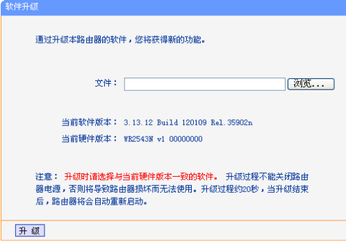

点击 **浏览** 按钮选择下载的文件 **openwrt-ar71xx-generic-tl-wr2543-v1-squashfs-factory.bin**

注意，文件名必须是...factory.bin。

再单击 **升级** 进行软件升级。要注意，在刷固件过程中不可停电或其他原因造成中断，否则路由器就变砖了。

等待几分钟

等锁形的指示灯不闪了，在浏览器输入地址: [192.168.1.1](http://192.168.1.1) 回车,如果正常的话,就进入了 OpenWrt 的 LuCI 网页管理界面了. 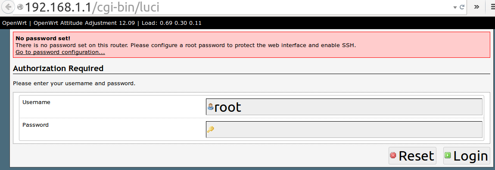

默认用户名是 root,默认密码是空。点 **Login** 直接登录。

# 网页界面 OpenWrt 拨号上网设置教程

# 网页界面 OpenWrt 拨号上网设置教程

见面界面登录路由器后，就可以设置上网参数了。

## 编辑 OpenWrt WAN 设置

选择上面的 Network，在 Interface 里，WAN 右边，选择 Edit。WAN 和 ADSL　moderm 相连，设置拨号上网自然是在 WAN 而不是 LAN.

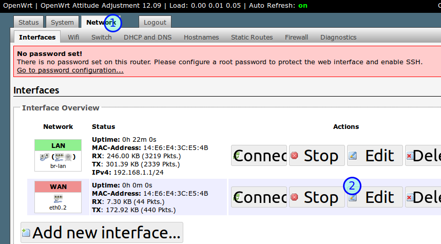

## 配置 OpenWrt 拨号上网密码

进去后，在协议 Protocol 下拉列框里，选择拨号上网的协议，也就是 PPPoE, 再点击下面的 Switch Protocol 切换协议。

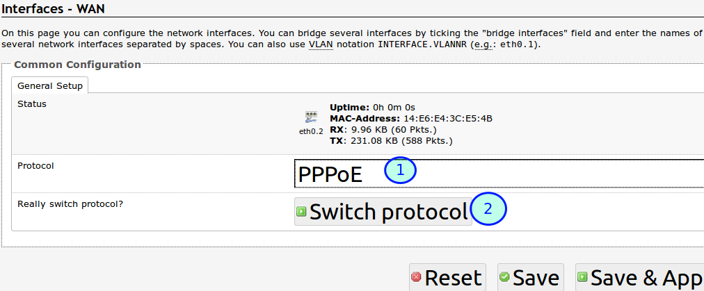

## OpenWrt 拨号上网用户名密码设置

1.  PAP/CHAP username: 拨号上网用户名
2.  PAP/CHAP password:　拨号上网密码
3.  点击 **Save & Apply** 保存并应用设置

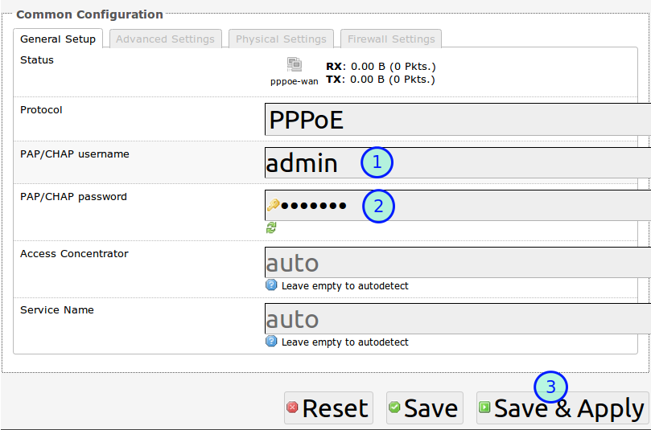

这时，连接 LAN 的电脑应该已经可以上网了，但无线设备还不行。

# 网页界面 OpenWrt 无线(Wifi)设置图文教程

# 网页界面 OpenWrt 无线(Wifi)设置图文教程

登录 OpenWrt 路由器后：

## 选择 Network, Wifi, Edit

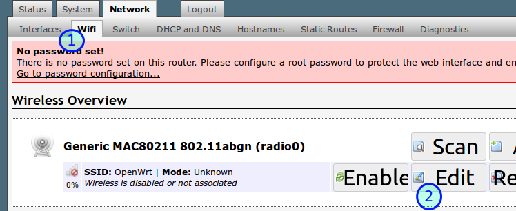

## 点击 Enable 按钮，这时无线设备已经可以连上 Wifi

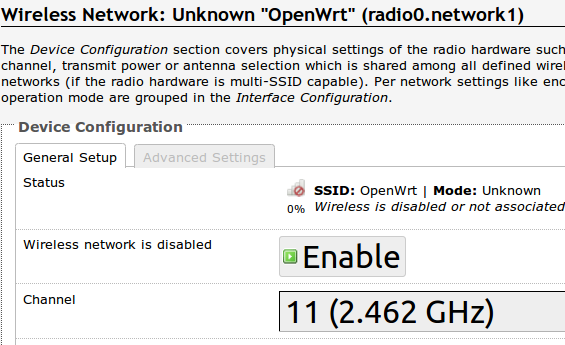

默认 ESSID 就是 OpenWrt，没有密码。不想做活雷锋的加个密码吧。

## OpenWrt Wifi 密码设置

把 ESSID 改成 eastking-wr2543,然后：

*   点击 Wireless Security 进入 OpenWrt 无线安全设置
*   Encryption 加密方式，WPA2-PSK
*   Key 密码：killgfw
*   Save & Apply　保存并应用设置

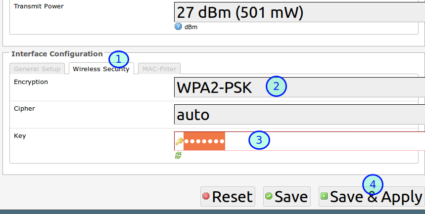

这时，所有无线设备都可以通过 OpenWrt 路由器上网了。

## OpenWrt 管理界面登录密码设置

你注意到没有， 网页上方有一个红色的框框(No password set!)一直在提示我们： **小人不得不防，OpenWrt 叫你设一个路由器管理界面登录密码呢!**

1.  点击最上面的 System 进入系统设置
2.  再点击 Administration 进入管理员设置
3.  密码 Password: fanqiang
4.  确认密码 Confirmation: fanqiang
    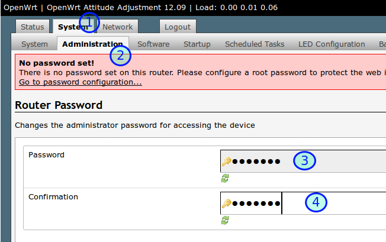
5.  其他设置：下面的： Gateway ports，勾选 **Allow remote hosts to connect to local SSH forwarded ports**（允许远程主机连接本地 SSH 转发端口）,这样我们就可以用 SSH 命令行的方式管理路由器。最后点击右下角 Save & Apply 保存并应用设置。

# 网页界面怎样备份 OpenWrt 设置

# 网页界面怎样备份 OpenWrt 设置

现在有线和无线上网都正常了。应该把现有的 OpenWrt 设置备份一下，因为我们还要经常折腾 OpenWrt，有时一个设置错误，可能就上不了网，有了备份，就可以快速恢复。

### 选择 System 系统设置

### 选择 Backup / Flash Firmware 备份恢复固件

### Actions 动作

### Generate 生成备份文件并保存到电脑

### 如果以后你要恢复备份，就点击 Browse...浏览并选择先前备份的文件来恢复

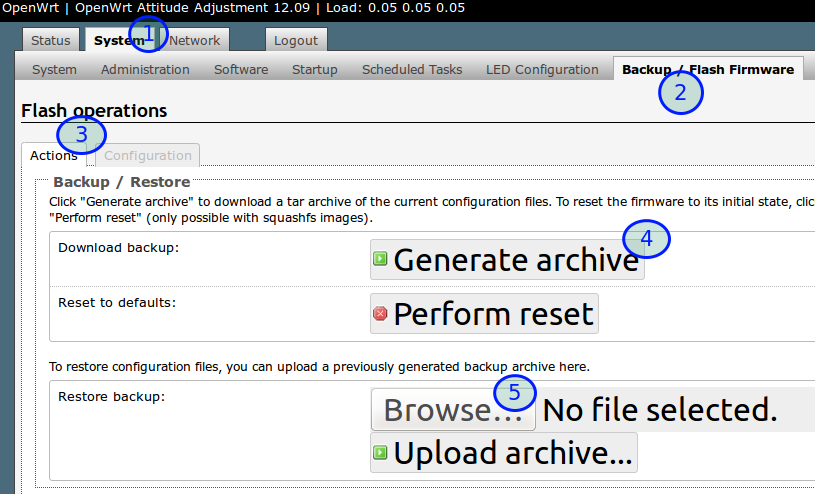

# 网页界面升级 OpenWrt 固件

# 通过 LuCI 网页界面升级 OpenWrt 固件

我们现在已经给 TP-Link WR2543N 刷上了 OpenWrt 固件，并且可以正常上网了。如果要升级 OpenWrt 固件，又该怎么做呢？

有两个途径升级固件：

*   LuCI web 界面升级
*   SSH 命令行登录路由器升级

本节就讲 web 界面升级固件的方法。

## 下载 OpenWrt 升级用固件 sysupgrade.bin

下载用于 WR2543N 路由器的升级固件，升级用固件文件名中有 sysupgrade 字样。

还是到 OpenWrt Wiki 页面 [TP-Link TL-WR2543ND](http://wiki.openwrt.org/toh/tp-link/tl-wr2543nd)

点击 [openwrt-ar71xx-generic-tl-wr2543n-v1-squashfs-sysupgrade.bin](http://downloads.openwrt.org/attitude_adjustment/12.09/ar71xx/generic/openwrt-ar71xx-generic-tl-wr2543-v1-squashfs-sysupgrade.bin) 下载。

其实这个固件的核心和我们先前安装的...factory.bin 一样，我们是出于实验目的，演示升级固件的方法，

## 用前文讲过的方法从网页登录 OpenWrt 路由器

## 开始升级 OpenWrt 固件

1.  System 系统
2.  Backup / Flash Firmware 备份或刷新固件
3.  Flash new firmware, Browse...选择我们刚下载下来的固件
4.  Flash image...刷新固件
    注：如果 Keep settings 保持勾选，升级固件后，原来的设置就会保留，不用重新设置拨号上网参数。
    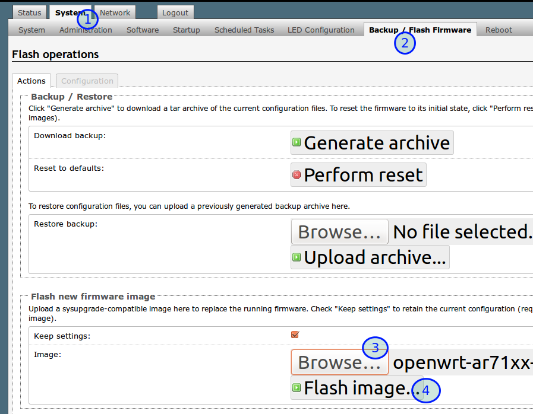

# 怎样进入 OpenWrt 安全恢复模式

# 怎样进入 OpenWrt 安全恢复模式(WR2543N 为例)

有时候，我们可能操作失误，无法进入 LuCI 网页界面管理恢复固件，这时就需要进入安全模式来恢复了。

不同的路由器，进入安全模式的方法可能有所差别，本文系列适用于 TP-LINK WR2543N。

安全模式是玩 OpenWrt 的救命仙丹。能熟练进入安全模式来恢复设置，是 OpenWrt 已经上手的一个标志。

进入安全模式时，没有无线连接可用，所以我们要有线的方式登录 OpenWrt。OpenWrt 默认的 IP 地址是 192.168.1.1，我们要设置电脑有线连接的 IP 地址类似于 192.168.1.x, 其中 x 是 2 至 255 的数字。

WR2543N 无线路由器进入 OpenWrt 安全模式的方法：

1.  用网线把路由器和电脑连接起来，设置电脑网卡的 IPv4 地址

    以 Ubuntu 为例，点击桌面右上角连接符号，选择 **Edit Connections**, 再选择 Ethernet 连接，点击　Edit 按钮，在弹出的窗口中选择 IPv4 Settings, Method 选择 Manual，Address 栏点击 Add，设置如下：

    *   Address: 192.168.1.90
    *   Netmask: 255.255.255.0
    *   Gateway: 192.168.1.1

        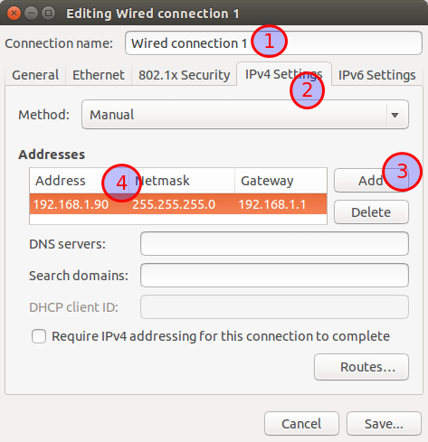

2.  在 Ubuntu 运行命令：

    ```
     sudo tcpdump -Ani eth0 port 4919 and udp 
    ```

3.  重启路由器,当 WR2543N 的锁形指示灯刚一开始闪烁时，立即按路由器背面的 wps 按钮 3 次

4.  Ubuntu 命令行界面出现：

    > Please press button now to enter failsafe

    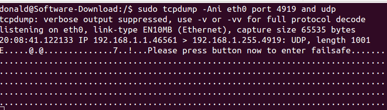

5.  Ubuntu 命令行执行(有时可以不需 tcpdump 直接 telnet)：

    ```
     telnet 192.168.1.1 
    ```

    这时就成功登录了 OpenWrt，如下图:
    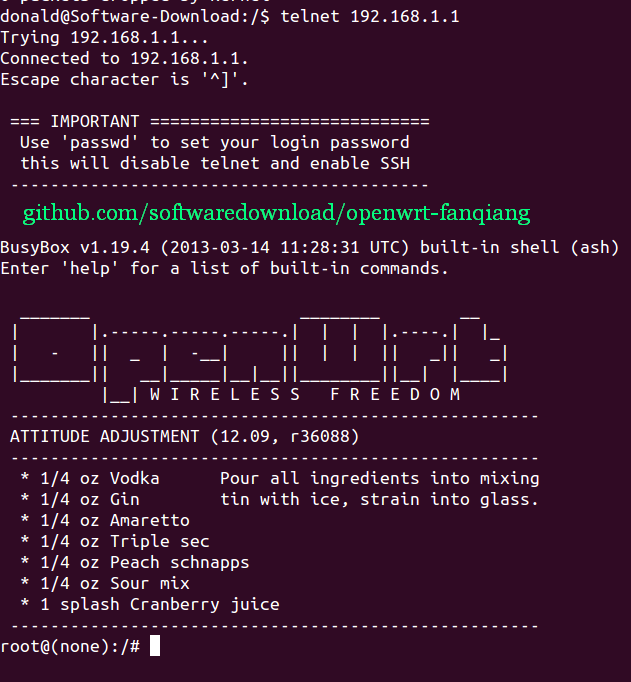

1.  设置登录 OpenWrt SSH 登录密码:

    ```
     passwd
     #输入密码 fanqiang 
    ```

    如果出现：

    ```
     passwd: /etc/passwd: Read-only file system
     passwd: can't update passwd file /etc/passwd 
    ```

    就输入 `mount_root` 再重新 passwd 设置管理员密码。如下图：
    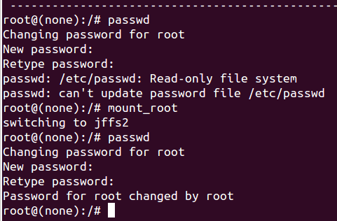

telnet 登录路由器后，可以用 vi 命令修改设置。

这时如果你试图用浏览器登录 192.168.1.1 进入管理界面的话，可能失败。

重启路由器，路由器锁形指示灯先是慢闪，到变成常亮时，你又可以登录 192.168.1.1 管理界面。一切恢复正常。

# 命令行 OpenWrt sysupgrade 更新固件

# OpenWrt sysupgrade 命令行更新固件到最新版

下面我们要使用 sysupgrade 更新固件到 snapshot 最新版。

要注意的是，trunk 包含试验的功能，可能不稳定，刷机风险自己承担。

在浏览器里登录 192.168.1.1 进行固件升级是比较简单的。今天我们要尝试的的是命令行刷机升级。命令行的方式更强大。

## SSH 登录路由器

在 Ubuntu 里，按 Ctrl+Alt+T 打开命令行终端，输入：

```
ssh root@192.168.1.1 
```

输入密码，登录成功。

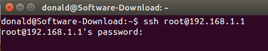

## 进入 OpenWrt /tmp 目录

```
cd /tmp 
```

## 检查 OpenWrt 路由器是否有足够的内存

```
df -h 
```

可以看出， **/tmp** 还有 29.5MB 可用空间，而升级固件在 3MB 左右，足够了。
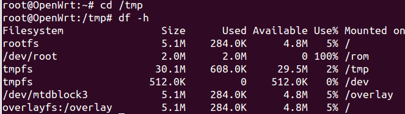

## 下载 OpenWrt 最新 trunk 版本固件

1.  在 Ubuntu 里浏览器打开 [`downloads.openwrt.org/snapshots/trunk/`](http://downloads.openwrt.org/snapshots/trunk/)

2.  TP-LINK WR2543N 路由器的芯片类型是 ar71xx，就点击 [ar71xx](http://downloads.openwrt.org/snapshots/trunk/ar71xx/) 目录进入。要注意，路由器的芯片类型千万不能搞错，不同路由器很可能是不同的。
    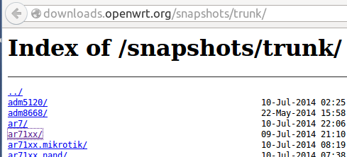

3.  TP-LINK WR2543 路由器的 Flash 类型为 generic，于是进入了 [`downloads.openwrt.org/snapshots/trunk/ar71xx/generic/`](http://downloads.openwrt.org/snapshots/trunk/ar71xx/generic/)

4.  按 Ctrl+F 查找自己的路由器型号。比如我输入的是 **wr2543**, 有两个固件，升级用的是 **sysupgrade.bin**文件。右键点击该链接，复制下载地址。在 FireFox 里是 **Copy Link Location**复制链接地址。

5.  回到 Ubuntu 命令行终端， 下载固件到 **/tmp** 目录。TP-LINK wr2543 路由器是这样的:

    ```
     root@OpenWrt:/tmp# wget http://downloads.openwrt.org/snapshots/trunk/ar71xx/generic/openwrt-ar71xx-generic-tl-wr2543-v1-squashfs-sysupgrade.bin 
    ```

## md5 校验，确保下载的固件完整:

```
 root@OpenWrt:/tmp# wget http://downloads.openwrt.org/snapshots/trunk/ar71xx/generic/md5sums  
    root@OpenWrt:/tmp# md5sum -c md5sums 2> /dev/null | grep OK  
    openwrt-ar71xx-generic-tl-wr2543-v1-squashfs-sysupgrade.bin: OK 
```

输出结尾是 OK，说明固件是完整的。

## OpenWrt sysupgrade 命令升级 OpenWrt 固件

```
 root@OpenWrt:/tmp# sysupgrade -v openwrt-ar71xx-generic-tl-wr2543-v1-squashfs-sysupgrade.bin 
    ... 
    Upgrade completed
    Rebooting system... 
```

过约 2 分钟，等路由器重启成功，如果没有意外，会发现有线和无线上网都正常。但浏览器 192.168.1.1 无法登录，因为 snapshots 版本固件是不带 LuCI 网页管理界面的。没有也好，可以节省路由器的存储空间，也可以学习一下命令行管理 OpenWrt 路由器。

#### 参考：

*   [generic.sysupgrade](http://wiki.openwrt.org/doc/howto/generic.sysupgrade)
*   [sysupgrade source code](https://dev.openwrt.org/browser/trunk/package/base-files/files/sbin/sysupgrade)
*   [sysupgrade doc](http://wiki.openwrt.org/doc/techref/sysupgrade)

# 命令行 uci 设置 OpenWrt 上网参数

# 命令行 uci 设置 OpenWrt 上网参数

如果路由器可以正常上网的前提，我们可以 ssh 登录路由器，直接在路由器的/tmp 目录 wget 下载最新版固件并 sysupgrade 命令进行固件升级。

有时候，路由器无法上网，这时候，可以在电脑里下载好固件，再把固件复制到路由器，再 sysupgrade 升级或设置其他参数。

只要能进入路由器的安全模式，并 ssh 登录路由器，一切都不是问题。

## Ubuntu 下载 OpenWrt for TP-LINK wr2543N trunk 版固件

```
cd ~/Downloads
wget http://downloads.openwrt.org/snapshots/trunk/ar71xx/generic/openwrt-ar71xx-generic-tl-wr2543-v1-squashfs-sysupgrade.bin 
```

## scp 复制固件到 OpenWrt 路由器 /tmp 目录

```
scp openwrt-ar71xx-generic-tl-wr2543-v1-squashfs-sysupgrade.bin root@192.168.1.1:/tmp/ 
```

## ssh 登录 OpenWrt 路由器

```
ssh root@192.168.1.1
cd /tmp 
```

## sysupgrade 升级固件并取消保留原来配置文件

注意，升级后将无法上网，也没有 LuCI 网页界面可以设置，必须以命令行方式设置好上网参数。

如果在下面的实验中，命令行方式无法搞定路由器上网，就只能在电脑里下载好带 luCI 的固件，scp 复制固件到路由器升级固件，然后以网页方式设置上网。

在进行这一步前，确保你熟练掌握以前部分教程。

```
root@OpenWrt:/tmp# sysupgrade -n openwrt-ar71xx-generic-tl-wr2543-v1-squashfs-sysupgrade.bin 
```

参数 `-n` 表示升级时不保留原来的配置文件。固件刷好后会自动重启，这时要用前文教程讲过的方法进入 OpenWrt 安全模式，登录路由器并重新设置 root 密码。

下面假设你已经登录了路由器并设好了 root 密码。

## OpenWrt uci 命令行设置拨号上网：

```
root@OpenWrt: uci set network.wan.proto='pppoe'
root@OpenWrt: uci set network.wan.username='wan-username'
root@OpenWrt: uci set network.wan.password='wan-password'
root@OpenWrt: uci set network.wan.peerdns=0 
```

wan-username 替换成你自己的拨号上网用户名，wan-password 替换成你自己的密码。

## OpenWrt uci 命令行设置无线上网：

```
root@OpenWrt: uci set wireless.@wifi-device[0].channel=11
root@OpenWrt: uci set wireless.@wifi-device[0].txpower=17
root@OpenWrt: uci set wireless.@wifi-device[0].disabled=0
root@OpenWrt: uci set wireless.@wifi-device[0].country='CN'
root@OpenWrt: uci set wireless.@wifi-iface[0].mode='ap'
root@OpenWrt: uci set wireless.@wifi-iface[0].ssid='eastking-tlwr2543'
root@OpenWrt: uci set wireless.@wifi-iface[0].encryption='psk2'
root@OpenWrt: uci set wireless.@wifi-iface[0].key='icanfly9876' 
```

### uci 设置说明：

*   channel 信道
*   txpower 功率
*   disabled 是否启用无线，0 表示启用
*   ssid 名称，推荐后面以路由器型号结尾，这样调试多个路由器时不会混淆。
*   encryption 加密方式
*   key 无线密码，如果你照上文的设置不动，好处是忘记密码时可以上 [`www.github.com/softwaredownload/openwrt-fanqiang`](http://www.github.com/softwaredownload/openwrt-fanqiang) 来查看。

## 允许远程主机用 ssh 的方式登录路由器及设置时区

```
root@OpenWrt: uci set dropbear.@dropbear[0].GatewayPorts='on'
root@OpenWrt: uci set system.@system[0].zonename='Asia/Shanghai'
root@OpenWrt: uci set system.@system[0].timezone='CST-8' 
```

## ssh 登录 OpenWrt 相关高级设置（你可能暂时用不到)

```
root@OpenWrt: uci set dropbear.@dropbear[0].Port=22
root@OpenWrt: uci set dropbear.@dropbear[0].PasswordAuth=off
root@OpenWrt: uci set dropbear.@dropbear[0].RootPasswordAuth=off 
```

### 说明（不懂千万别乱设）：

*   Port ssh 默认端口就是 22,可以改成其他的提高安全性
*   PasswordAuth ssh 是否启用密钥登录。如果你改成 off，又没有设置好 ssh 私钥和安装好 LuCI，你将无法 ssh 方式登录路由器，唯一的办法就是安全恢复模式登录重新开始设置。
*   RootPasswordAuth 是否允许 root 用密码登录，如果已经设置好了 ssh 私钥就可以改成 off 增加安全性。

## 启用新的网络和无线设置

```
root@OpenWrt: /etc/init.d/dropbear restart
root@OpenWrt: /etc/init.d/system restart
root@OpenWrt: /etc/init.d/network restart 
```

怎么样，有线和无线上网又都回来了吧！

注意，有的人在网上贴出了他的完整配置文件/etc/config/network 和/etc/config/wireless，　如果你复制他的文件覆盖你的文件，再修改用户名和密码，可能会出问题，因为不同路由器的硬件配置可能不同。

# 让 openwrt 能正常安装软件

# 给初始不具备翻墙能力的路由器配置软件源

当我们刚给路由器刷上 OPENWRT 后，其只具备基本的上网功能。 这里如果我们使用 opkg update 安装软件时，发现其根本不能 update,因为它要连接的 download.operwrt.org 本身也在被墙列表中。（或未被墙，但速度奇慢。）

方法有几种

## 方法 1，为 opkg 配置代理

1.  在路由配置文件中，为 openwrt 的 opkg 配置代理。 [来源 openwrt wiki](https://wiki.openwrt.org/zh-cn/doc/techref/opkg)

    进入路由器菜单，选择系统-软件，点击“配置”页签，输入：

    option http_proxy [`proxy.example.org:8080/`](http://proxy.example.org:8080/)

    option ftp_proxy ftp://proxy.example.org:2121/

2.  也可以直接 vi /etc/opkg.conf 去修改。

    option http_proxy [`proxy.example.org:8080/`](http://proxy.example.org:8080/)

    option ftp_proxy ftp://proxy.example.org:2121/

## 方法 2， 架设一个不需代理就可访问的软件源。

1.  建立 OPENWRT 的镜象文件。

    到

    [`downloads.openwrt.org`](https://downloads.openwrt.org)

    下载你所需要的芯片对应的文件夹内的目录及文件拖到本地。 比如我的是：ar71xx/nand/packages/ 下的 base luci management 等文件夹。使用 wget 命令可以整站拖。

    `wget -m -np https://downloads.openwrt.org/chaos_calmer/15.05/ar71xx/nand/packages/`

    如果是旧版的路由，请自行到找到对应的版本去下载，比如

    `wget -m -np https://downloads.openwrt.org/barrier_breaker/14.07/ar71xx/nand/packages/`

2.  使用任一建站软件，比如 Nignx 建立简单的 http 服务器.

3.  将 opkg-config 内的软件源改成自己的 http 服务器

    ```
     - src/gz chaos_calmer_base http://192.168.1.121:8008/base

     - src/gz chaos_calmer_luci http://192.168.1.121:8008/luci

     - src/gz chaos_calmer_packages http://192.168.1.121:8008/packages

     - src/gz chaos_calmer_routing http://192.168.1.121:8008/routing

     - src/gz chaos_calmer_telephony http://192.168.1.121:8008/telephony

     - src/gz chaos_calmer_management http://192.168.1.121:8008/management 
    ```

Done.