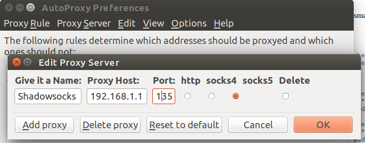
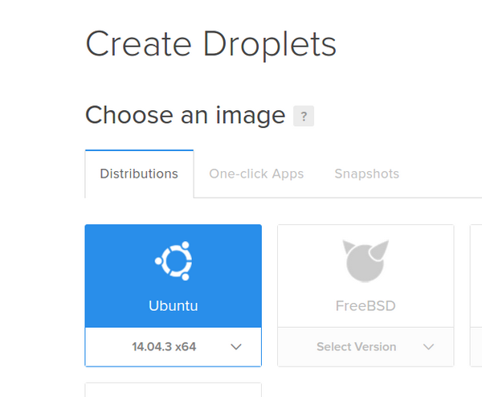
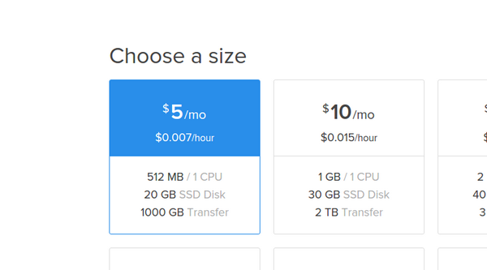
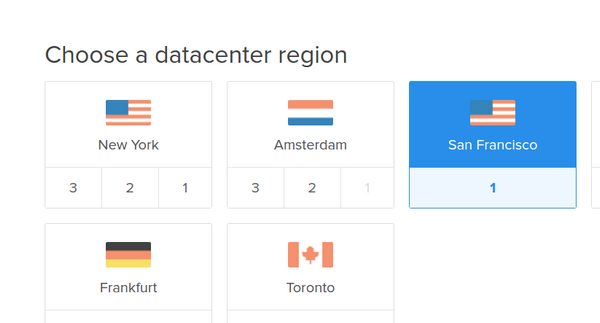
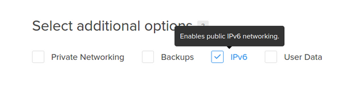
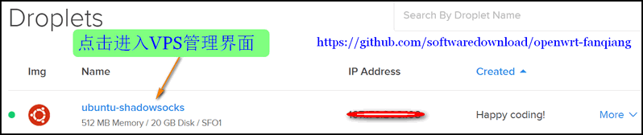
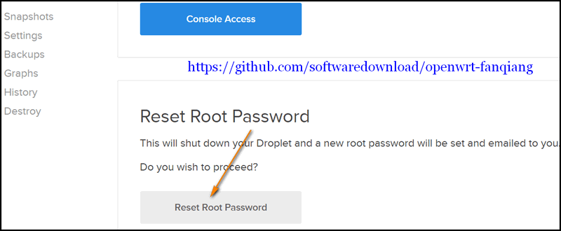
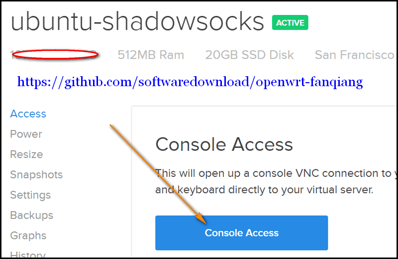

# OpenWrt＋shadowsocks-libev 自动🪜🧱

# OpenWrt＋shadowsocks-libev 实现路由器自动🪜🧱

相信经过前面的教程，大家对 OpenWrt 和 Linux Ubuntu 有一定的熟悉了。如果还不熟悉 Ubuntu，就安装 Ubuntu，实际使用一个月。

前面的文章都是技术准备，有基础的读者可以略过。在本章中，我们要 OpenWrt 路由器安装 shadowsocks-libev 来实践🪜🧱。

* * *

#### 最简单的路由器刷 OpenWrt 固件🪜🧱教程:

[`github.com/softwaredownload/openwrt-fanqiang`](https://github.com/softwaredownload/openwrt-fanqiang "最简单的路由器刷 OpenWrt 固件🪜🧱教程")

#### 在线阅读 OpenWrt 🪜🧱路由器教程:

[`www.gitbook.com/book/softwaredownload/openwrt-fanqiang/details`](https://www.gitbook.com/book/softwaredownload/openwrt-fanqiang/details)

# 什么是 shadowsocks-libev 🪜🧱软件

shadowsocks-libev 是一个 shadowsocks 协议的轻量级实现，是 shadowsocks-android, shadowsocks-ios 以及 shadowsocks-openwrt 的上游项目。其具有以下特点：

1.  体积小巧。静态编译并打包后只有 100 KB。
2.  高并发。基于 libev 实现的异步 I/O，以及基于线程池的异步 DNS，同时连接数可上万。
3.  低资源占用。几乎不占用 CPU 资源，服务器端内存占用一般在 3MB 左右。
4.  跨平台。适用于所有常见硬件平台，已测试通过的包括 x86，ARM 和 MIPS。也适用于大部分 POSIX 的操作系统或平台，包括 Linux，OS X 和 Cygwin 等。
5.  协议及配置兼容。完全兼容 shadowsocks 协议，且兼容标准实现中的 JSON 风格配置文件，可与任意实现的 shadowsocks 客户端或服务端搭配使用。

shadowsocks-libev 包括服务端和客户端两部分，一共三个模块。

1.  ss-server：服务器端，部署在远程服务器，提供 shadowsocks 服务。
2.  ss-local：客户端，提供本地 socks5 协议代理。
3.  ss-redir：客户端，提供本地透明代理，需要与 NAT 配合使用
4.  ss-tunnel: 客户端，本地端口转发

官网地址：

[`github.com/shadowsocks/shadowsocks-libev`](https://github.com/shadowsocks/shadowsocks-libev)

# 🪜🧱软件 Shadowsocks-libev 服务端设置

要利用 shadowsocks-libev 🪜🧱，首先要有一台国外的服务器安装并运行 shadowsocks 服务端。如果还没有服务器,可以到 [digitalocean](https://m.do.co/c/89497bd485e0) 购买一台 SSD 虚拟服务器 VPS。

## Ubuntu 安装 shadowsocks-libev 服务端

```
#Add GPG public key:
wget -O- http://shadowsocks.org/debian/1D27208A.gpg | sudo apt-key add -

# Ubuntu 14.04 or above
sudo add-apt-repository "deb http://shadowsocks.org/ubuntu trusty main"

# Debian Wheezy, Ubuntu 12.04 or any distribution with libssl > 1.0.1
sudo add-apt-repository "deb http://shadowsocks.org/debian wheezy main"

sudo apt-get update
sudo apt-get install shadowsocks-libev 
```

上述命令的效果：

*   把　deb [`shadowsocks.org/ubuntu`](http://shadowsocks.org/ubuntu) trusty main　加到　/etc/apt/sources.list
*   安装 ss-local ss-redir ss-server ss-tunnel 到 /usr/bin
*   启动文件　/etc/init.d/shadowsocks-libev
*   配置文件 /etc/shadowsocks-libev/config.json (旧版是/etc/shadowsocks/config.json)
*   一些默认启动配置 /etc/default/shadowsocks-libev （旧版是/etc/default/shadowsocks）

## 编辑 shadowsocks-libev 配置文件

```
sudo vi /etc/shadowsocks-libev/config.json 
```

改成类似如下：

```
{
    "server":"1.0.9.8",
    "server_port":1098,
    "password":"killgfw",
    "method":"aes-256-cfb"        
} 
```

必须把 server `1.0.9.8` 改成你自己的，或者改成 `0.0.0.0` 表示监听本机，其他可以不改。如果访问变慢，时断时续，这可能是受到干扰了，可以尝试改变加密方式，如改成 bf-cfb。

## 控制 shadowsocks-libev 的方法

```
sudo service shadowsocks-libev start
sudo service shadowsocks-libev stop

#设置随机启动 Shadowsocks-libev. 新版已经不需要手动设置随机启动
#sudo update-rc.d shadowsocks-libev defaults 99

#取消 shadowsocks-libev 随机启动    
#sudo update-rc.d -f shadowsocks-libev remove 
```

## 查看 ss-server 是否已经启动并且带有 -u 启动参数

```
ps ax | grep ss-server 
```

如果启动正常，返回结果类似如下：

```
/usr/bin/ss-server -c /etc/shadowsocks-libev/config.json -a root -u -f /var/run/shadowsocks-libev/shadowsocks-libev.pid 
```

注意其中有-u。如果 shadowsocks 客户端启用了 udp relay, 而服务端启动时不带-u 参数，🪜🧱自然就失败了。

## 启动 shadowsocks-libev 服务端

```
sudo service shadowsocks-libev start 
```

#### 参考：

*   [shadows-libev on github](https://github.com/shadowsocks/shadowsocks-libev)
*   [create a simple linux daemon](http://xiaoxia.org/2011/11/15/create-a-simple-linux-daemon/)

# OpenWrt 路由器运行 shadowsocks-libev 客户端

shadowsocks-libev for OpenWrt 要和 OpenWrt 一致，否则可能无法安装，或者安装了不能启动。

下面地址可以下载：

[`sourceforge.net/projects/openwrt-dist/files/shadowsocks-libev/`](http://sourceforge.net/projects/openwrt-dist/files/shadowsocks-libev/)

请自行测试是否适用于你的 OpenWrt。

如果自行编译🪜🧱固件，最好按照教程自己编译 shadowsocks-libev for OpenWrt。

## shadowsocks-libev 选择 OpenSSL 版还是 PolarSSL 版

根据依赖的 SSL 库可分为 OpenSSL 和 PolarSSL 两种版本 OpenSSL 版依赖 libopenssl, 支持加密方式多, 体积大 PolarSSL 版依赖 libpolarssl, 体积小, 加密方式少。

如果内存大就选 OpenSSL 版，反之则选 PolarSSL 版。

## 安装 shadowsocks-libev 客户端到 OpenWrt 路由器（星号替换成实际的字符）

```
~/Downloads$ scp shadowsocks-libev-polarssl_*_ar71xx.ipk root@192.168.1.1:/tmp/
~/Downloads$ ssh root@192.168.1.1
root@OpenWrt:~# cd /tmp
root@OpenWrt:~# opkg install shadowsocks-libev-polarssl_1.*.*_ar71xx.ipk 
```

## 修改 shadowsocks-libev 客户端配置

```
root@OpenWrt:~# vi /etc/shadowsocks.json 
```

改成类似如下：

```
{
    "server":"1.0.9.8",
    "server_port":1098,
    "local_port":7654,
    "password":"killgfw",
    "method": "aes-256-cfb"
} 
```

注意，server IP 必须修改你的实际 IP。其他可以保持默认。

## shadowsocks 代理上网测试

*   启动 shadowsocks 客户端:

    root@OpenWrt:~# ss-local -c /etc/shadowsocks.json

*   Ubuntu 浏览器代理上网设置，以 FireFox 配合 AutoProxy 为例，增加 Proxy Server, Proxy Host 填 192.168.1.1,Port 是 7654,　勾选 Sock5.如下图：

    

Ubuntu 设置 AutoProxy 的默认代理是 shadowsocks,就可以打开被🧱的网站如[YouTube.com](http://www.youtube.com)

以前我在每台电脑上都运行一个 shadowsocks 客户端，每台电脑都要像上面这样配置浏览器代理上网🪜🧱。

现在路由器里安装了 shadowsocks，所有有线和无线上网设备都不用分别安装 shadowsocks 了，非常方便了。但是还是太复杂，如果家里有十台上网设备，所有要连国外网站的软件都可能要配置代理访问，有些软件还根本没有设置代理的接口。有没有更简单的方法呢？

# 史上最通俗易懂的 OpenWrt 🪜🧱路由器解释

## 什么是域名和 IP 地址

每个网站都可以有两个唯一标识：域名和 IP 地址。域名相当于人的名字，IP 地址相当于该人使用的电话号码。（不同之处：域名是唯一的，人的名字会有重名）

网站为什么要有两个标识？域名是为了方便人类记忆的，比如[YouTube.com](https://www.youtube.com)，而电脑处理却喜欢处理数字，纯数字格式的 IP 地址就是为了让电脑查找计算方便些。

## 通过域名查询 IP 的那些事情

我们在浏览器地址栏里输入 [www.youtube.com](https://www.youtube.com)　并回车，到底会发生哪些不可思议的事情呢：

1.  浏览器问就近的某台电脑（叫域名服务器）：Hi, youtube.com 的 IP 地址是什么？
2.  域名服务器：不就是 74.125.239.98
3.  浏览器：谢谢。我就到你给我的地址去找内容了

还有种情况，浏览器第一次问的域名服务器不知道某域名的 IP 地址：

1.  浏览器问就近的域名服务器：Hi, youtube.com 的 IP 地址是什么？
2.  域名服务器：这个我不知道哇，我帮你问问我的上线
3.  上线服务器：我也不知道哇，我也只好问我的上线，等等，别挂掉
4.  某域名服务器：这么简单还来问我，不就是　74.125.239.98
5.  浏览器：谢谢。我就到你给我的地址　74.125.239.98　去找内容

## 白脸很忙，不看 YouTube(看不懂？)

在中国，YouTube 为什么被封？YouTube 有几千万，上亿个视频，如果某几个视频让某些人看了不爽，就来个宁可错杀百万，不可放过一个，把整个 YouTube 给封了，全国人民都无法正常访问 YouTube 了。

这个时候，又发生了哪些不可告人的事情呢？

1.  浏览器问就近的域名服务器：喂, youtube.com 的 IP 地址是什么？
2.  中国的某域名服务器：这我知道，44.44.44.44，（心里嘀咕，我给你的是太平洋海底的地址，你能找到内容才怪呢，白脸（领导）很忙，天朝很好，访问这种破网站干啥，满屏洋文，我怎么看得懂，哼）
3.  浏览器：谢谢。我这就去找主人需要的内容。。。找了好久，还是什么也没找到,我的命怎么这么苦。。。

阳光底下，每时每刻每秒，这样龌龊的事情在发生千次，万次，亿次...

## 白脸不知道 TCP?

人民要学习新知识，不能容忍这样的事情，于是想到了一些办法， 国内的域名服务器要说谎，那我直接就问国外的服务器比如 google 的 8.8.8.8 或 8.8.4.4，人家才不会这么卑鄙无耻下流无底线。直接问 google 的域名服务器的办法存活了一段时间，后来白脸（领导不晒太阳的）又知道了，又不高兴了，于是 google 的域名服务器 IP 地址也被封了。

网民的力量是无穷的，有人又发现了，查询域名 IP 地址的方式有 udp 和 tcp 两种，领导暂时只知道 udp，我用 tcp 的方式去问国外域名服务器，就可以得到网站域名对应的真实 IP 了。

写这篇文章的时候,tcp 的方式依然有效。但我怀疑，白难迟早又会不高兴。8.8.8.8 或 8.8.4.4 树大招风，而且白脸最容易记住的就是 8 和 4 这两个数字，白脸要发，白脸怕死。所以，我们索性不用 8 和 4 了，我们用加密的方式(shadowsockss ss-tunnel)向自己的服务器查询，领导这下该满意了吧！

## 太阳要升起，网民要雄起

但是，还有问题没有解决：

网站有两种，国内的和国外的。如果不分国内国外全部都到国外去查询域名的 IP，访问国内的网站就会变慢。虽然有心逃离，还是无法割断哪。

有几种解决方案：

1.  建国外重要网站名单，简称外单（黑名单，gfwlist），外单上的域名都到国外去查询 IP，其他就在国内查询。

    如果 IP 地址在外单上，就加密访问，领导不知道我访问了这个地址，这样领导的心情可能会好些。

2.  同样是建立外单。不同的是，我不想花费精力去区分某个 IP 是不是在外单上，IP 地址可能经常在变，这样做不怕累吗。我的办法是，不是中国的 IP，全部加密访问。

3.  每个人的用途不同，谁有本事建立通用的外单？

    即使有人建立了包含很多域名的外单，网站内容往往是互相引用的，某外单上网站引用了不在外单上的被封网站，导致打网站贼慢，这个该怎么办？难道要手动查看网页源代码，一个个地搜索查找，逐个测试？

    最简单有交的方法，是给国内重要网站建立名单，简称内单。内单上的网站都在国内 dns，其他网站全部到国外 dns。访问非中国的 IP 都流量加密。

我曾经用过第一种方案，试图用网友整理的外单(ChinaDNS)，但是，在实际使用过程中，经常需要临时增加外单域名并重启路由器，有时一天要重复好多次，不胜其烦.

第三种方案，就是本教程使用的方案，是目前来说比较好的方案。

### OpenWrt 🪜🧱路由器内部发生的故事(千万别告诉白脸)：

1.  浏览器：喂，谁知道 YouTube.com 的 IP，主人要用
2.  路由器：稍等，我查下主人设置的内单，稍等。。。不在内单，我通过秘密通道查
3.  浏览器：喂，告诉我 baidu.com 的 IP
4.  路由器：哇，内单，马上就给你
5.  浏览器：请给我 IP 地址 60.188.5.6 的内容
6.  路由器：等下，立即就好。。。中国 IP，该那就那去取内容。不是中国 IP，借道主人的秘密通道去取内容

# 配置 OpenWrt 路由器智能自动🪜🧱

# 配置 OpenWrt shadowsocks 路由器智能自动🪜🧱

## OpenWrt 路由器用 dnsmasq 转发国内重要域名查询

OpenWrt 默认自带 dnsmasq，我们只要配置一下就好了。ssh 登录 OpenWrt 路由器后:

*   建立 dnsmasq.d 目录：

    ```
     root@OpenWrt:~# mkdir /etc/dnsmasq.d
      root@OpenWrt:~# echo "conf-dir=/etc/dnsmasq.d" >> /etc/dnsmasq.conf 
    ```

*   OpenWrt 安装 GNU wget 以支持 https 下载，下载国内重要网站名单，用国内域名服务器查询 iP 地址

    ```
     root@OpenWrt:~# cd /etc/dnsmasq.d
      root@OpenWrt:/etc/dnsmasq.d# opkg install wget
      root@OpenWrt:/etc/dnsmasq.d# wget -4 --no-check-certificate -O /etc/dnsmasq.d/accelerated-domains.china.conf https://github.com/felixonmars/dnsmasq-china-list/raw/master/accelerated-domains.china.conf
      root@OpenWrt:/etc/dnsmasq.d# wget -4 --no-check-certificate -O /etc/dnsmasq.d/bogus-nxdomain.china.conf https://github.com/felixonmars/dnsmasq-china-list/raw/master/bogus-nxdomain.china.conf 
    ```

    注：[accelerated-domains.china.conf](https://github.com/softwaredownload/openwrt-fanqiang/blob/master/openwrt/default/etc/dnsmasq.d/accelerated-domains.china.conf) 文件中的条目举例：

    ```
     server=/10010.com/114.114.114.114
      server=/115.com/114.114.114.114 
    ```

    意思是，访问 10010.com 这个结尾的域名时，dnsmasq 会转发到国内的域名服务器 114.114.114.114 进行 dns 查询。

## [gfwlist.conf](https://github.com/softwaredownload/openwrt-fanqiang/blob/master/openwrt/default/etc/dnsmasq.d/gfwlist.conf): 其他域名，转发到 shdowsocks-libev ss-tunnel 指定的端口 dns 查询

```
root@OpenWrt:/etc/dnsmasq.d# echo "server=/#/127.0.0.1#3210" > gfwlist.conf 
```

上面#是通配符，代表泛匹配所有域名。dnsmasq 匹配域名的特点是详细特征优先匹配，因此会先匹配 accelerated-domains.china.conf 上的域名，如果不匹配，再匹配这条规则：转发到本地端口 3210 进行域名查询。

后面我们会配置 shdowsocks-libev 的本地客户端 ss-tunnel 转发本地端口 3210 的查询到远程自建服务器。

## 配置 shdowsocks 本地客户端 ss-redir 启动和停止函数

```
root@OpenWrt:/etc/dnsmasq.d# vi /etc/init.d/shadowsocks 
```

#### [/etc/init.d/shadowsocks](https://github.com/softwaredownload/openwrt-fanqiang/blob/master/openwrt/default/etc/init.d/shadowsocks):

```
#!/bin/sh /etc/rc.common

# Author: https://github.com/softwaredownload/openwrt-fanqiang
# Date: 2015-12 

START=95

SERVICE_USE_PID=1
SERVICE_WRITE_PID=1
SERVICE_DAEMONIZE=1

start() {
    sed -i 's/114.114.114.114/127.0.0.1#3210/' /etc/dnsmasq.d/gfwlist.conf
    /etc/init.d/dnsmasq restart

    service_start /usr/bin/ss-redir -b 0.0.0.0 -c /etc/shadowsocks.json -f /var/run/shadowsocks.pid
    service_start /usr/bin/ss-tunnel -b 0.0.0.0 -c /etc/shadowsocks.json -l 3210 -L 8.8.8.8:53 -u 
    /usr/bin/shadowsocks-firewall
}

stop() {
    sed -i 's/127.0.0.1#3210/114.114.114.114/' /etc/dnsmasq.d/gfwlist.conf
    /etc/init.d/dnsmasq restart

    service_stop /usr/bin/ss-redir
    service_stop /usr/bin/ss-tunnel
    killall ss-redir
    killall ss-tunnel
    /etc/init.d/firewall restart
} 
```

#### shadowsocks 本地客户端配置文件 start stop 函数说明：

*   **sed -i 's/127.0.0.1#3210/114.114.114.114/' /etc/dnsmasq.d/gfwlist.conf**
    停止 shadowsocks 🪜🧱服务时,要把泛匹配域名的解析转发到国内的 dns 服务器,这里是 114
*   **sed -i 's/114.114.114.114/127.0.0.1#3210/' /etc/dnsmasq.d/gfwlist.conf**
    开启🪜🧱服务时，如果以前停止过 shadowsocks 🪜🧱服务,要把泛匹配域名的解析改成通过 ss-tunnel 3210 端口转发
*   **service_start /usr/bin/ss-tunnel -b 0.0.0.0 -c /etc/shadowsocks.json -l 3210 -L 8.8.8.8:53 -u**
    监听本地 3210 端口，转发到自己的服务器的 53 端口向 8.8.8.8 查询 DNS
*   **/usr/bin/shadowsocks-firewall**
    dnsmasq 只是负责域名查询分配转发，查询到 IP 地址后，是否需要通过 shdowsocks 加密请求内容，要在 shdowsocks-firewall 里进行设置
*   运行 `/etc/init.d/shadowsocks stop` 有时并没有结束 ss-redir 或 ss-tunnel 进程，这会导致修改 `shadowsocks.conf` 后需要重启路由器才能生效。加上 `killall` 强制杀掉进程避免重启。(2016-01-19)
    （注：即使加了 killall，有时还是不能杀掉进程，这种情况就只能重启路由器了。也就是说，修改了🪜🧱配置，有时必须重启路由器才能生效）

## 配置 iptables 防火🧱转发 IP 和端口

```
root@OpenWrt:~# cd /usr/bin
root@OpenWrt:~# touch shadowsocks-firewall
root@OpenWrt:~# chmod +x shadowsocks-firewall
root@OpenWrt:~# vi shadowsocks-firewall 
```

#### [/usr/bin/shdowsocks-firewall](https://github.com/softwaredownload/openwrt-fanqiang/blob/master/openwrt/default/usr/bin/shadowsocks-firewall):

```
#!/bin/sh

# Author:    https://github.com/softwaredownload/openwrt-fanqiang
# Date:        2015-12-23

#create a new chain named SHADOWSOCKS
iptables -t nat -N SHADOWSOCKS
iptables -t nat -N SHADOWSOCKS_WHITELIST

# Ignore your shadowsocks server's addresses
# It's very IMPORTANT, just be careful.

iptables -t nat -A SHADOWSOCKS -d 1.0.9.8 -j RETURN

#for hulu.com
iptables -t nat -A SHADOWSOCKS -p tcp --dport 1935 -j REDIRECT --to-ports 7654
iptables -t nat -A SHADOWSOCKS -p udp --dport 1935 -j REDIRECT --to-ports 7654

# Ignore LANs IP address
iptables -t nat -A SHADOWSOCKS -d 0.0.0.0/8 -j RETURN
iptables -t nat -A SHADOWSOCKS -d 10.0.0.0/8 -j RETURN
iptables -t nat -A SHADOWSOCKS -d 127.0.0.0/8 -j RETURN
iptables -t nat -A SHADOWSOCKS -d 169.254.0.0/16 -j RETURN
iptables -t nat -A SHADOWSOCKS -d 172.16.0.0/12 -j RETURN
iptables -t nat -A SHADOWSOCKS -d 192.168.0.0/16 -j RETURN
iptables -t nat -A SHADOWSOCKS -d 224.0.0.0/4 -j RETURN
iptables -t nat -A SHADOWSOCKS -d 240.0.0.0/4 -j RETURN

# Check whitelist
iptables -t nat -A SHADOWSOCKS -j SHADOWSOCKS_WHITELIST
iptables -t nat -A SHADOWSOCKS -m mark --mark 1 -j RETURN

# Anything else should be redirected to shadowsocks's local port
iptables -t nat -A SHADOWSOCKS -p tcp -j REDIRECT --to-ports 7654
# Apply the rules
iptables -t nat -A PREROUTING -p tcp -j SHADOWSOCKS

# Ignore China IP address
for white_ip in `cat /etc/chinadns_chnroute.txt`;
do
    iptables -t nat -A SHADOWSOCKS_WHITELIST -d "${white_ip}" -j MARK --set-mark 1
done

# Ignore Asia IP address
#iptables -t nat -A SHADOWSOCKS_WHITELIST -d 1.0.0.0/8 -j MARK --set-mark 1
#iptables -t nat -A SHADOWSOCKS_WHITELIST -d 14.0.0.0/8 -j MARK --set-mark 1
#iptables -t nat -A SHADOWSOCKS_WHITELIST -d 27.0.0.0/8 -j MARK --set-mark 1
#iptables -t nat -A SHADOWSOCKS_WHITELIST -d 36.0.0.0/8 -j MARK --set-mark 1
#iptables -t nat -A SHADOWSOCKS_WHITELIST -d 39.0.0.0/8 -j MARK --set-mark 1
#iptables -t nat -A SHADOWSOCKS_WHITELIST -d 42.0.0.0/8 -j MARK --set-mark 1
#iptables -t nat -A SHADOWSOCKS_WHITELIST -d 49.0.0.0/8 -j MARK --set-mark 1
#iptables -t nat -A SHADOWSOCKS_WHITELIST -d 58.0.0.0/8 -j MARK --set-mark 1
#iptables -t nat -A SHADOWSOCKS_WHITELIST -d 59.0.0.0/8 -j MARK --set-mark 1
#iptables -t nat -A SHADOWSOCKS_WHITELIST -d 60.0.0.0/8 -j MARK --set-mark 1
#iptables -t nat -A SHADOWSOCKS_WHITELIST -d 61.0.0.0/8 -j MARK --set-mark 1
#iptables -t nat -A SHADOWSOCKS_WHITELIST -d 101.0.0.0/8 -j MARK --set-mark 1
#iptables -t nat -A SHADOWSOCKS_WHITELIST -d 103.0.0.0/8 -j MARK --set-mark 1
#iptables -t nat -A SHADOWSOCKS_WHITELIST -d 106.0.0.0/8 -j MARK --set-mark 1
#iptables -t nat -A SHADOWSOCKS_WHITELIST -d 110.0.0.0/8 -j MARK --set-mark 1
#iptables -t nat -A SHADOWSOCKS_WHITELIST -d 111.0.0.0/8 -j MARK --set-mark 1
#iptables -t nat -A SHADOWSOCKS_WHITELIST -d 112.0.0.0/8 -j MARK --set-mark 1
#iptables -t nat -A SHADOWSOCKS_WHITELIST -d 113.0.0.0/8 -j MARK --set-mark 1
#iptables -t nat -A SHADOWSOCKS_WHITELIST -d 114.0.0.0/8 -j MARK --set-mark 1
#iptables -t nat -A SHADOWSOCKS_WHITELIST -d 115.0.0.0/8 -j MARK --set-mark 1
#iptables -t nat -A SHADOWSOCKS_WHITELIST -d 116.0.0.0/8 -j MARK --set-mark 1
#iptables -t nat -A SHADOWSOCKS_WHITELIST -d 117.0.0.0/8 -j MARK --set-mark 1
#iptables -t nat -A SHADOWSOCKS_WHITELIST -d 118.0.0.0/8 -j MARK --set-mark 1
#iptables -t nat -A SHADOWSOCKS_WHITELIST -d 119.0.0.0/8 -j MARK --set-mark 1
#iptables -t nat -A SHADOWSOCKS_WHITELIST -d 120.0.0.0/8 -j MARK --set-mark 1
#iptables -t nat -A SHADOWSOCKS_WHITELIST -d 121.0.0.0/8 -j MARK --set-mark 1
#iptables -t nat -A SHADOWSOCKS_WHITELIST -d 122.0.0.0/8 -j MARK --set-mark 1
#iptables -t nat -A SHADOWSOCKS_WHITELIST -d 123.0.0.0/8 -j MARK --set-mark 1
#iptables -t nat -A SHADOWSOCKS_WHITELIST -d 124.0.0.0/8 -j MARK --set-mark 1
#iptables -t nat -A SHADOWSOCKS_WHITELIST -d 125.0.0.0/8 -j MARK --set-mark 1
#iptables -t nat -A SHADOWSOCKS_WHITELIST -d 126.0.0.0/8 -j MARK --set-mark 1
#iptables -t nat -A SHADOWSOCKS_WHITELIST -d 169.0.0.0/8 -j MARK --set-mark 1
#iptables -t nat -A SHADOWSOCKS_WHITELIST -d 175.0.0.0/8 -j MARK --set-mark 1
#iptables -t nat -A SHADOWSOCKS_WHITELIST -d 180.0.0.0/8 -j MARK --set-mark 1
#iptables -t nat -A SHADOWSOCKS_WHITELIST -d 182.0.0.0/8 -j MARK --set-mark 1
#iptables -t nat -A SHADOWSOCKS_WHITELIST -d 183.0.0.0/8 -j MARK --set-mark 1
#iptables -t nat -A SHADOWSOCKS_WHITELIST -d 202.0.0.0/8 -j MARK --set-mark 1
#iptables -t nat -A SHADOWSOCKS_WHITELIST -d 203.0.0.0/8 -j MARK --set-mark 1
#iptables -t nat -A SHADOWSOCKS_WHITELIST -d 210.0.0.0/8 -j MARK --set-mark 1
#iptables -t nat -A SHADOWSOCKS_WHITELIST -d 211.0.0.0/8 -j MARK --set-mark 1
#iptables -t nat -A SHADOWSOCKS_WHITELIST -d 218.0.0.0/8 -j MARK --set-mark 1
#iptables -t nat -A SHADOWSOCKS_WHITELIST -d 219.0.0.0/8 -j MARK --set-mark 1
#iptables -t nat -A SHADOWSOCKS_WHITELIST -d 220.0.0.0/8 -j MARK --set-mark 1
#iptables -t nat -A SHADOWSOCKS_WHITELIST -d 221.0.0.0/8 -j MARK --set-mark 1
#iptables -t nat -A SHADOWSOCKS_WHITELIST -d 222.0.0.0/8 -j MARK --set-mark 1
#iptables -t nat -A SHADOWSOCKS_WHITELIST -d 223.0.0.0/8 -j MARK --set-mark 1 
```

### OpenWrt 路由器 iptables 防火🧱设置含义

*   如果本地发出请求到 shadowsocks 服务端所在的服务器,就返回，不作任何特殊处理。
*   如果本地发出请求到局域网，也立即返回
*   如果发出请求到中国的 IP 地址，也立即返回
    chinadns_chnroute.txt 是中国 IP 地址，见 [`github.com/softwaredownload/openwrt-fanqiang/blob/master/openwrt/default/etc/chinadns_chnroute.txt`](https://github.com/softwaredownload/openwrt-fanqiang/blob/master/openwrt/default/etc/chinadns_chnroute.txt)
    预编译🪜🧱固件都带了这个文件。这个文件很长，因此配置不高的路由器 DIR-505，预编译固件里改成了“发出请求到亚洲的 IP 地址就立即返回”，见文件 [`github.com/softwaredownload/openwrt-fanqiang/blob/master/openwrt/dir505/usr/bin/shadowsocks-firewall`](https://github.com/softwaredownload/openwrt-fanqiang/blob/master/openwrt/dir505/usr/bin/shadowsocks-firewall)
*   剩下的 IP 内容请求，全部转发到 shdowsocks-libev 本地客户端 ss-redir 监听的端口，由 ss-redir 负责和服务端进行加密通讯。（手下报告访问 youtube 的屁民为个位数，领导心里那个高兴啊。可惜经过加密，内容传输速度会有下降）
*   首先运行全代理模式，然后再执行白名单。在白名单比较长时冷启动的速度会比较快。（Thanks Phoeagon)
*   中国的 IP 列表比较长，如果你的路由器硬件配置不是太好，可以把 Ignore China IP address 段注释掉，启用 Ignore Asia IP address 段

### OpenWrt 路由器防火🧱设置重要说明：

*   你必须把上面的 1.0.9.8 换成你服务器真实的 IP 地址
*   *iptables -t nat -A SHADOWSOCKS -p tcp -j REDIRECT --to-ports 7654* 这里的 7654 必须和 OpenWrt 路由器 /etc/shadowsocks.json 里的 *local_port*一样，也就是说，如果 /etc/shadowsocks.json 里 *"local_port":1090,* 那这里的 7654 也要改成 1090
*   其他可以保持默认

## 控制 shadowsocks 本地客户端的方法

```
root@OpenWrt:~# /etc/init.d/shadowsocks stop
root@OpenWrt:~# /etc/init.d/shadowsocks start
root@OpenWrt:~# /etc/init.d/shadowsocks enable
root@OpenWrt:~# /etc/init.d/shadowsocks disable 
```

### 说明：

*   stop: 停止 shdowsocks
*   start: 运行 shadowsocks
*   enable: 设置 shadowsocks 在 OpenWrt 路由器启动时自动启动
*   disable: 取消 shadowsocks 随机启动

## 启动并测试 shadowsocks-libev 本地客户端

确保所有设置无误后，可以启动测试一下：

```
root@OpenWrt:~# /etc/init.d/dnsmasq restart
root@OpenWrt:~# /etc/init.d/shadowsocks stop
root@OpenWrt:~# /etc/init.d/shadowsocks start
root@OpenWrt:~# /etc/init.d/shadowsocks enable 
```

然后在 Ubuntu 电脑，手机等设备上打开[youtube.com](https://youtube.com)，[twitter.com](https://twitter.com)

## 下载配置文件的最新版

```
git clone https://github.com/softwaredownload/openwrt-fanqiang 
```

git clone 项目到本地后，可以进入 openwrt 目录查看文件。

如果所有设置都正确，应该可以较快速度打开被🧱网站。

# OpenWrt 自动更新设置和屏蔽广告

## OpenWrt 路由器自动更新国内重要网站名单

登录路由器后：

```
root@OpenWrt:~# cd /usr/bin
root@OpenWrt:~# touch chinalist
root@OpenWrt:~# chmod +x chinalist
root@OpenWrt:~# vi chinalist 
```

#### [/usr/bin/chinalist](https://github.com/softwaredownload/openwrt-fanqiang/blob/master/openwrt/default/usr/bin/chinalist)：

```
#!/bin/sh                                                                                                                                                               

wget -4 --no-check-certificate -O /etc/dnsmasq.d/accelerated-domains.china.conf https://github.com/felixonmars/dnsmasq-china-list/raw/master/accelerated-domains.china.conf
wget -4 --no-check-certificate -O /etc/dnsmasq.d/bogus-nxdomain.china.conf https://github.com/felixonmars/dnsmasq-china-list/raw/master/bogus-nxdomain.china.conf 
```

## OpenWrt 路由器自动屏蔽广告

[/etc/dnsmasq.d](https://github.com/softwaredownload/openwrt-fanqiang/tree/master/openwrt/default/etc/dnsmasq.d)下有个 [blockad.conf](https://github.com/softwaredownload/openwrt-fanqiang/blob/master/openwrt/default/etc/dnsmasq.d/blockad.conf) 文件，内容类似如下：

```
server=/.mobads.baidu.com/127.0.0.0
server=/.mobads-logs.baidu.com/127.0.0.0
server=/.media.admob.com/127.0.0.0
... 
```

意思是.mobads.baidu.com 的域名解析转发到 127.0.0.0，这个地址不具备域名解析的功能，于是就达到了屏蔽广告的功能。

运行命令：

```
root@OpenWrt:~# cd /usr/bin
root@OpenWrt:~# touch blockad
root@OpenWrt:~# chmod +x blockad
root@OpenWrt:~# vi blockad 
```

#### [/usr/bin/blockad](https://github.com/softwaredownload/openwrt-fanqiang/blob/master/openwrt/default/usr/bin/blockad)：

```
#!/bin/sh

# Author:    https://github.com/softwaredownload/openwrt-fanqiang
# Date:        2016-01-09

TMP_HOSTS=/tmp/block.hosts.unsorted
HOSTS=/etc/dnsmasq.d/blockad.conf

# remove any old TMP_HOSTS that might have stuck around
rm ${TMP_HOSTS} 2> /dev/null

for URL in \
    "https://raw.githubusercontent.com/vokins/simpleu/master/hosts" \
    "http://adaway.org/hosts.txt"
do
    # filter out comment lines, empty lines, localhost... 
    # remove trailing comments, space( ,tab), empty line
    # replace line to dnsmasq format
    # remove carriage returns
    # append the results to TMP_HOSTS
    wget -4 --no-check-certificate -qO- "${URL}" | grep -v -e "^#" -e "^\s*$" -e "localhost" -e "^;" -e "^@" -e "^:" -e "^[a-zA-Z]" \
    | sed -E -e "s/#.*$//" -e "s/[[:space:]]*//g" -e "/^$/d" \
    -e "s/¹²⁷.0.0.1/server=\/./" -e "s/0.0.0.0/server=\/./" -e "/^[0-9].*$/d" -e "s/$/\/127.0.0.0/" \
    | tr -d "\r" >> ${TMP_HOSTS}

done

# remove duplicate hosts and save the real hosts file
sort ${TMP_HOSTS} | uniq > ${HOSTS}

rm ${TMP_HOSTS} 2> /dev/null 
```

### OpenWrt 自动生成广告屏蔽列表说明：

*   第一个 URL 主要用于国内，下面几个 URL 是屏蔽国外广告
*   运行上面命令产生的广告屏蔽列表比较长，如果路由器性能比较低，dnsmasq 匹配域名负荷会太大，可以用直接用下面这个简化版的文件，不要用上面的脚本：
    [`github.com/softwaredownload/openwrt-fanqiang/blob/master/openwrt/dir505/etc/dnsmasq.d/blockad.conf`](https://github.com/softwaredownload/openwrt-fanqiang/blob/master/openwrt/dir505/etc/dnsmasq.d/blockad.conf)
*   如果 dnsmasq 超负荷工作，可能会失去响应，导致打不开网页，这时需要登录路由器运行命令：
    /etc/init.d/dnsmasq restart
*   所以，还是尽量用性能好点的路由器吧

路由器性能比电脑差很多，如果屏蔽列表很长，那么短时间内快速打开数个网页就可能导致 dnsmasq 失去响应。最好是看完一个网页就关闭一个，再打开新的网页。

在路由器里屏蔽的好处是所有接入路由器的设备都全部起作用。

通常的做法，在路由器里屏蔽部分域名，然后在电脑里设置更广泛、精确的屏蔽，主要是设置 host 文件屏蔽和浏览器插件屏蔽。

浏览器插件屏蔽，可以装这些 Chrome 浏览器插件：uBlock Origin，ADfree.Player.Online。其中 uBlock Origin 的作用和 Adblock Plus 类似，但是设置更加丰富。

## 计划任务：定时更新 dnsmasq 配置文件和自动重启 shadowsocks

```
root@OpenWrt:~# crontab -e 
```

输入以下内容：

```
*/30 * * * * isfound=$(ps | grep "ss-redir" | grep -v "grep"); if [ -z "$isfound" ]; then echo "$(date): restart ss-redir...">>/tmp/log/ss-monitor.log && /etc/init.d/shadowsocks restart; fi
* 12 * * * /usr/bin/chinalist
* 12 * * * /usr/bin/blockad 
```

### OpenWrt 计划任务说明：

*   每半小时检查 shadowsocks-libev 客户端，如果退出就自动重启
*   每天中午 12 点运行 chinalist
*   每天中午 12 点运行 blockad

2014-09-24 版的 dir505, wr2543 预编译固件是启用了计划任务的，这会有潜在的不确定性，如果更新时下载的文件如 accelerated-domains.china.conf 存在错误，导致 dnsmasq 无法启动，🪜🧱功能自然失效。

如果你启用了计划任务，某一天突然不能🪜🧱了，这时设置客户端的 IP 地址为和路由器同网段，登录路由器，用 ps 命令查看 dnsmasq 进程是否启动了，如果没有启动，就重刷固件或者用
[`github.com/softwaredownload/openwrt-fanqiang/tree/master/openwrt/default/etc/dnsmasq.d`](https://github.com/softwaredownload/openwrt-fanqiang/tree/master/openwrt/default/etc/dnsmasq.d)
下面的文件代替 路由器里/etc/dnsmasq.d/下的文件。

### 附录：计划任务定时关闭路由器 OpenWrt

人类的本性是目光短浅，玩得一时兴趣就会忘记定时休息的重要性。解决办法是在路由器里设置计划任务，禁止夜里某个时间段里使用路由器。下面的例子中，每 20 分钟检测一次，如果迟于 20 点 30 或者早于 7 点就自动关闭 OpenWrt。这对小孩子特别有用，现在很多孩子使用电子设备上瘾，一个人睡的话甚至半夜在被窝里偷偷上网，现在好了，除非孩子强大到会登陆路由器修改设置，否则半夜重启路由器都无法上网了。

```
*/20 * * * * TIME=$(date +"%H%M"); if [ $TIME -ge 2030 ] || [ $TIME -le 700 ]; then poweroff; fi 
```

#### 参考：

*   [`github.com/vokins/simpleu`](https://github.com/vokins/simpleu)
*   [`github.com/jjack/openwrt-adblock`](https://github.com/jjack/openwrt-adblock)
*   [`github.com/felixonmars/dnsmasq-china-list`](https://github.com/felixonmars/dnsmasq-china-list)
*   [install-shadowsocks-on-hg255d-openwrt-and-config-nat](http://www.shuyz.com/install-shadowsocks-on-hg255d-openwrt-and-config-nat.html)

# OpenWrt 路由器🪜🧱为什么会失败

# OpenWrt 路由器为什么会🪜🧱失败或不稳定

给路由器刷上 OpenWrt，并按照 [本教程](https://www.gitbook.com/book/softwaredownload/openwrt-fanqiang/details/ "OpenWrt 路由器🪜🧱教程")设置了服务端和客户端，但还是不能🪜🧱，或者不稳定，有时能翻，有时不能翻，怎么办？

## ping 服务器的 ip 看看速度怎么样

```
ping 1.0.9.8 
```

## 检查 shadowsocks 服务端启动时有没有带上 -u 参数

> -u enable udprelay mode
> TPROXY is required in redir mode

本教程使用的，也就是官方的[shadowsocs-libev](https://github.com/shadowsocks/shadowsocks-libev)服务端是默认启动带上 -u 参数的。但有的朋友可能使用其他版本的服务端，如 Python 版，就不能保证服务端启动时默认就带 -u 参数。

可以这样查询服务端是否启动，及启动参数：

```
$ ps -aux | grep ss-server
#.../usr/bin/ss-server -c /etc/shadowsocks-libev/config.json -a root -u -f /var/run/shadowsocks-libev/shadowsocks-libev.pid 
```

可见上面启动时已经带了 -u 参数。

## 登录 OpenWrt 路由器查询🪜🧱相关进程有没有启动

```
root@eastking:~# ps | grep ss-
#.../usr/bin/ss-redir -b 0.0.0.0 -c /etc/shadowsocks.json -f /var/run/shadowsocks.pid
#.../usr/bin/ss-tunnel -b 0.0.0.0 -c /etc/shadowsocks.json -l 3210 -L 8.8.8.8:53 -u

root@eastking:~# ps | grep dnsmasq
#.../usr/sbin/dnsmasq -C /var/etc/dnsmasq.conf -k -x /var/run/dnsmasq/dnsmasq.pid 
```

上面的查询显示，ss-redir ss-tunnel dnsmasq 都已经正常启动。

有时虽然 ss-redir ss-tunnel dnsmasq 等进程都在，但已经失去响应了，这就需要：

## 重启 shadowsocks，登录路由器，运行命令：

```
/etc/init.d/shadowsocks restart 
```

`restart` 内部分 `stop` 和 `start` 两步执行，实际测试发现，少数时候 `stop` 并不能关闭 shadowsocks 相关进程，那么只能：

## 重启 OpenWrt 路由器

## 🪜🧱不稳定，有时能连上被🧱网站，有时连不上

shadowsocks-libev 加密🪜🧱的方式加大了🧱的辨识难度，但不是不可能被辨识。因此，还是有可能受到干扰的。解决方法：更换加密方式，如改成 `bf-cfb`

一般情况下这样就能解决问题。

## 登录路由器用 dig 查询被🧱域名

本教程预编译的🪜🧱固件都安装了 bind-dig，方便调试。

注：本教程默认的 tunnel 转发端口都是 3210

正常的结果类似如下：

```
root@eastking:~# dig @localhost -p 3210 google.com

; <<>> DiG 9.9.7-P3 <<>> @localhost -p 3210 google.com
; (2 servers found)
;; global options: +cmd
;; Got answer:
;; ->>HEADER<<- opcode: QUERY, status: NOERROR, id: 38460
;; flags: qr rd ra; QUERY: 1, ANSWER: 11, AUTHORITY: 0, ADDITIONAL: 1

;; OPT PSEUDOSECTION:
; EDNS: version: 0, flags:; udp: 512
;; QUESTION SECTION:
;google.com.                    IN      A

;; ANSWER SECTION:
google.com.             299     IN      A       74.125.226.33
google.com.             299     IN      A       74.125.226.36
google.com.             299     IN      A       74.125.226.32
google.com.             299     IN      A       74.125.226.38
google.com.             299     IN      A       74.125.226.41
google.com.             299     IN      A       74.125.226.39
google.com.             299     IN      A       74.125.226.35
google.com.             299     IN      A       74.125.226.46
google.com.             299     IN      A       74.125.226.37
google.com.             299     IN      A       74.125.226.40
google.com.             299     IN      A       74.125.226.34

;; Query time: 290 msec
;; SERVER: 127.0.0.1#3210(127.0.0.1)
;; WHEN: Mon Dec 28 11:55:30 CST 2015
;; MSG SIZE  rcvd: 215 
```

### 延伸阅读：

#### [ShadowSocks 教程:shadowsocks 是否支持 udp 转发是什么来的](http://shadowsocks8.info/shadowsocks-jiao-cheng/shadowsocks-udp.html)

udp 是什么：UDP 是 User Datagram Protocol 的简称， 中文名是用户数据报协议，是 OSI（Open System Interconnection，开放式系统互联） 参考模型中一种无连接的传输层协议，提供面向事务的简单不可靠信息传送服务，IETF RFC 768 是 UDP 的正式规范。UDP 在 IP 报文的协议号是 17。 UDP 协议全称是用户数据报协议[1] ，在网络中它与 TCP 协议一样用于处理数据包，是一种无连接的协议。在 OSI 模型中，在第四层——传输层，处于 IP 协议的上一层。UDP 有不提供数据包分组、组装和不能对数据包进行排序的缺点，也就是说，当报文发送之后，是无法得知其是否安全完整到达的。UDP 用来支持那些需要在计算机之间传输数据的网络应用。包括网络视频会议系统在内的众多的客户/服务器模式的网络应用都需要使用 UDP 协议。UDP 协议从问世至今已经被使用了很多年，虽然其最初的光彩已经被一些类似协议所掩盖，但是即使是在今天 UDP 仍然不失为一项非常实用和可行的网络传输层协议。 与所熟知的 TCP（传输控制协议）协议一样，UDP 协议直接位于 IP（网际协议）协议的顶层。根据 OSI（开放系统互连）参考模型，UDP 和 TCP 都属于传输层协议。UDP 协议的主要作用是将网络数据流量压缩成数据包的形式。一个典型的数据包就是一个二进制数据的传输单位。每一个数据包的前 8 个字节用来包含报头信息，剩余字节则用来包含具体的传输数据。

shadowsocks-android 的 DNS (UDP) 转发功能

从 2.1.2 开始，shadowsocks-android 开始支持透明的 DNS (UDP) 转发功能。这项功能包括两个部分：

1.  NAT（ROOT）模式下，仅支持转发 DNS 的 UDP 数据包。
2.  VPN 模式下，支持转发所有的 UDP 数据包。

限制：

1.  当前只有 1.4 以上的 libev 或 nodejs 实现的服务器端才支持此项功能。
2.  libev 服务器端还需要在命令行中加上 -u 的参数。
3.  此项功能默认关闭，依然由 pdnsd 负责转发 TCP 的 DNS 查询。

网友提出的几个问题：

问题一：shadowsocks-libev 默认启用了 udp relay 吗？

请问 udp relay 功能是否有必要打开？我看 shadowsocks-android 是有这个选项支持该功能的，但 shadowsocks-qt5 貌似不支持。 另外，config.json 里面是不是不支持写明是否需要打开 udp relay，而必须要 ss-server -c /etc/shadowsocks/config.json -u 这么写吗？

debian 下文件在/etc/init.d/shadowsocks-libev，找到

```
start-stop-daemon –start –quiet –pidfile $PIDFILE –chuid $USER:$GROUP –exec $DAEMON — \
-c “$CONFFILE” -a “$USER” -u -f $PIDFILE $DAEMON_ARGS \ 
```

发现已经默认加上-u 参数，1.6.1 版测试结果

问题二：shadowsocks android vpn 模式要避免 dns 污染要打开 UDP 转发吗？

国内 ps4 联机很蛋疼，于是在路由器里搞了一个支持 shadowsocks 的固件，作者说支持 udprelay，会转发 udp 数据包。 于是我就在我的服务器里开通了一个支持 udprelay 的 ss 账号，用的是最新版的 ss-libev，启动参数中加了-u，应该没错。 实测 ps4 也可以打开 youtube，但是 ps4 网络测试结果为 nat 类型失败。 我不确定是路由器固件作者的问题还是 ss-libev 的 udprelay 功能有 bug,所以我需要一个可以很好支持 udprelay 的 ss 账号，进行测试。

问题三：shadowsocks 现在能不能代理游戏，我看说支持 UDP 了？

对代理游戏有一定需求（MAC 版的美服 BATTLE.NET），现在 SS 能不能直接全局代理游戏，搜索了下貌似之前的一个版本就添加了对 UDP 的支持且默认开启，是不是意思是开了全局模式就默认代理 UDP/TCP 了？

问题四：不确定 SS 服务器端是否支持 UDP 转发，有办法测试么？

买了个套装服务，内含 SS，找了个 703N 的路由器刷了 openwrt 官方镜像开始一步一步安装 shadowsocks-libev 版，我的想法是用这个 703N 做全局翻，所以 DNS 解析也用 udp 转发到 8.8.4.4:53，但测了半天不好用，才想起对面的 SS 服务器端未必开了这个功能，现在我如何确定服务器端是否打开了 UDP 转发？ 或者 UDP 转发这个功能压根和服务器端没关系？

```
ss-tunnel.exe -c config.json -l 53 -L 8.8.8.8:53 -u
nslookup www.youtube.com 127.0.0.1 
```

如有返回结果则开启了 udp 转发

/etc/init.d/shadowsocks 这个脚本里本身已经设置了 -u ，不是这样执行的。如果你要手动加 -u, 则是 ss-server -c /etc/shadowsocks/config.json -u

# Shodowsocks 不同加密方式速度区别

# Shodowsocks 🪜🧱不同加密方式速度区别

## Shodowsocks 🪜🧱不同加密方法，哪一种速度最快最好：

*   🪜🧱不稳定，有的能上，有的不能上，有时能上，有时不能上，可能是加密方式的特征被识别，从而被干扰，方法是更换加密方式
*   rc4-md5 加解密速度虽然快，但是加密强度不够大，容易被干扰
*   无论哪一种加密方式，只要使用的人多了，就可能被重点研究，从而受到干扰
*   aes-256-cfb 加密强度大些，一样可能被干扰
*   有人推荐 chacha20 或者 salsa20，没有试过
*   其实 bf-cfb 就很好，速度很快，官方的 shadowsocks-libev 及[本教程](https://github.com/softwaredownload/openwrt-fanqiang)预编译的🪜🧱固件都直接支持

## 网友实测 Shodowsocks 不同加密方尘速度

encrypt and decrypt 20MB data:

```
aes-128-cfb 0.368462085724s
aes-128-ofb 0.400309085846s
aes-192-cfb 0.452577829361s
aes-192-ofb 0.381041049957s
aes-256-cfb 0.418514966965s
aes-256-ofb 0.405379056931s
cast5-cfb 0.859935045242s
cast5-ofb 0.911785125732s
chacha20 0.429271936417s
rc4 0.154517173767s
rc4-md5 0.169504165649s
salsa20 0.44139790535s 
```

## 网友评论：

clowwindy：

> 因为 chacha20 从 x86 上的性能来看，对速度的影响太小，提高还太有限，不如换个思路，因为通信包到了终端以后，走的都是电路，这里其实涉及到一个供电体系的问题，更换加密不如换一个电网，同一个 VPS，同一个路由器，但是，改用核电给路由器供电时，比火电丢包率会降低一个数量级，大大提高 TCP 吞吐率，经测试这是目前速度最快的供电方式，甚至优于水电，同理选 VPS 机房也要看供电，有些号称用了绿色能源，其实效果不好，这里面其实还涉及到选用 UPS 的型号，就不细说了 另外说到硬件加速，连接路由器的网线也很重要，建议用六类屏蔽线，不过一定不能买那种超薄扁平的网线，会对带宽起到整形作用，突发上不去，看 4K 会受影响，数据可能不准，不过大概也体现了差异 今天没有时间再次测试了，就发这么多吧。你们有一个好，出个新功能，写教程比别人都快，但试来试去的结论，太简单，有时太朴素了，我感觉你们还需要学习，提高自己的知识水平，将来如果写的教程有偏差，你们要负责

rlei:

> 讨论 shadowsocks 不同加密方式的安全性没有意义。shadowsocks 是被设计来混淆数据，增加某 Wall 检查出流量特征所需的计算量，提高实时检测的成本，而不是加密。ss 的作者多次强调过这一点

## 参考：

*   [`www.zhihu.com/question/28252105`](https://www.zhihu.com/question/28252105)

# 零起点 DO VPS shadowsocks-libev 🪜🧱设置教程

## [Digital Ocean](https://m.do.co/c/89497bd485e0) 的优点：

*   业界最有名的 VPS 服务商，服务有保障
*   全 SSD 硬盘，速度极快，重启在 20 秒内
*   所有 VPS 具有独立 IP
*   费用极低，$5/月起
*   管理后台 Console Access 可以直接运行所有 linux 命令，可以不设置 SSH
*   收费以小时计算，不用了可以删除，不会多收一分钱
*   更换 IP 方便，创建 snapshot，再从 snapshot 新建 Droplet,就可能得到新的 IP 了

### [立即点击这里注册 DO](https://m.do.co/c/89497bd485e0)

## 创建🪜🧱用的虚拟服务器 Droplet

注册 DO 并绑定支付方式后，登录管理后台，点击右上角的 `Create Droplet`:

*   Choose an image 选择最新版的 Ubuntu 64 位，下图是 14.04.3，下拉还有更新的如 15.10：
    
*   Choose a site 一般 512MB 那款就够了：
    
*   Choose a datacenter region 选择 San Francisco：
    
*   Select additional options, 勾选 IPv6：
    
*   Choose a hostname, 只是助记，比如 ubuntu-shadowsocks
*   Create 创建虚拟服务器

## 进入 DO VPS 管理界面

在 20 秒内，VPS 创建完毕，并自动分配了 IP，点击 VPS 名字进入管理 VPS 管理界面：


## 重置 DO VPS Root 密码:

注：如果已经收到 root 密码，请跳到一下步

点击 `Reset Root Password` 重置密码：


重置密码完成后，新的密码会发送到你的邮箱，下面我们就用这个密码登录并直接在网页上管理 VPS

## 进入 DO VPS 命令行控制界面 Console Access

DO 有个极为强大的功能，可以可以直接在管理后台 Console Access 运行 Linux 命令管理 VPS，相当于一个在线版的 SSH:


点击 `Console Access` 开启命令行窗口，如果打开失败就按 F5 刷新页面重试直到打开。

点击打开的命令行窗口以获得输入焦点。

## 命令行设置新的 Root 密码

开启 DO Console Access 后，输入 root 并回车，然后重新设置密码。

```
Ubuntu 15.10 ubuntu-shadowsocks tty1
ubuntu-shadowsocks login: root
Passwd: 输入 root 密码
You are required to change your password immediately (root enforced)
Changing password for root.
(Current) UNIX password: 输入 root 密码
Enter new UNIX password: 输入新的 root 密码
Retype UNIX password: 再次输入新的 root 密码 
```

密码更新完成后更新一下系统：

```
root@ubuntu-shadowsocks:~# apt-get update
root@ubuntu-shadowsocks:~# apt-get dist-upgrade 
```

可能会问你要不要更新一下 grub，直接回车就行了。（我选择的是升级到 `install the package maintainer's version`）

## 从源码编译 shadowsocks-libev server

2016-01-19 发现，shadowsocks.org 网页无法打开，这给 `apt-get install` 方式安装 shadowsocks-libev 带来不便，不过我们可以自己从源码编译，很简单，而且随时可以编译到最新的版本。

Console Access 界面是无法粘贴命令的，把下面命令逐行粘贴到浏览器地址栏，抄着输入也是很快的，输入第一行命令并回车后输入 y 安装所有相关包。

```
root@ubuntu-shadowsocks:~# apt-get install build-essential autoconf libtool libssl-dev gawk debhelper dh-systemd init-system-helpers pkg-config git
root@ubuntu-shadowsocks:~# git clone https://github.com/shadowsocks/shadowsocks-libev.git
root@ubuntu-shadowsocks:~# cd shadowsocks-libev
root@ubuntu-shadowsocks:~# dpkg-buildpackage -us -uc -i
root@ubuntu-shadowsocks:~# cd ..
root@ubuntu-shadowsocks:~# sudo dpkg -i shadowsocks-libev*.deb
root@ubuntu-shadowsocks:~# ls /usr/bin/ss-*
root@ubuntu-shadowsocks:~# ss-local ss-manager ss-redir ss-server ss-tunnel 
```

## 设置 shadowsocks-libev server，见 🪜🧱软件 Shadowsocks-libev 服务端设置

至此，我们已经开通了 DO VPS,并且在网页界面就安装完成了 shadowsocks-libev，下面是修改设置并重启 shadowsocks-libev

```
root@ubuntu-shadowsocks:~# vi /etc/shadowsocks-libev/config.json
root@ubuntu-shadowsocks:~# service shadowsocks-libev restart 
```

详细的设置教程在 🪜🧱软件 Shadowsocks-libev 服务端设置

再配置好客户端，如果没有错误，就可以成功🪜🧱了。所有以上过程 2016-01-19 亲测通过。

### 附录：怎样更换 DO 🪜🧱 VPS 的 IP（或者怎样使用最省钱）

*   照上面教程创建 Droplet ubuntu-shadowsocks, 设置好 shadowsocks-libev 服务端，其中 server 写 `0.0.0.0` 并测试通过
*   Poweroff VPS，也就是 VPS 关机，这时还会产生 VPS 使用费用的，因为 IP，空间等资源还是被你占用
*   创建 Snapshot，命名为 shadowsocks，并传送到你可能使用的各个区域。比如你原来是在 San Francisco 创建的，可以传送到 New York 区
*   删除 VPS，Destroy Droplet ubuntu-shadowsocks，然后就不产生任何费用了。不怕麻烦，每天都这样操作，一个月可能只要 2 元钱就行了
*   下次要使用，在 Create Droplet 的第一步，Choose an image, 选择 Snapshots, shadowsocks，其他和上面教程一样
*   从 snapshot 创建 Droplet 完成，页面显示了 VPS 的 IP 地址，shadowsocks 客户端连接到这个 IP 地址就行了，服务端不用更改任何设置

### 附录：怎样不“登录”路由器更改 OpenWrt shadowsocks-libev 路由器的 server IP

*   路由器设置密钥登录，这样 ssh 登录就不用密码了
*   创建 config 配置文件, Ubuntu 下是 `~/.ssh/config`，增加如下内容：

    ```
     Host router
          HostName 192.168.1.1
          User root
          Port 22
          IdentityFile /path/to/your/rsa 
    ```

    Windows 下安装 git for Windows，选择使用 OpenSSH，编辑 `C:\Program Files\Git\etc\ssh\ssh_config`

    然后就可以 `ssh router` 登录路由器了

*   reset.sh:

    ```
     #!/bin/bash

      # Author: https://github.com/softwaredownload/openwrt-fanqiang
      # Date: 2016-01-20

      ssh router <<'ENDSSH'

      sed -ri "s/([0-9]{1,3}\.){3}[0-9]{1,3} /1.0.9.8 /" /usr/bin/shadowsocks-firewall
      sed -ri "s/([0-9]{1,3}\.){3}[0-9]{1,3}/1.0.9.8/" /etc/shadowsocks.json

      /etc/init.d/shadowsocks restart

      ENDSSH 
    ```

    把 reset.sh 中的 `1.0.9.8` 改成 shadowsocks 服务端的 server IP，然后运行 reset.sh 就可以了。

    想要测试一下日本，英国，新加坡或美国的 IP，so easy，2 分钟就行了。

#### Reference:

*   [`github.com/shadowsocks/shadowsocks-libev`](https://github.com/shadowsocks/shadowsocks-libev)