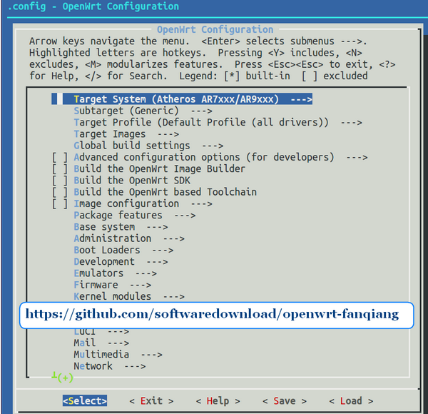
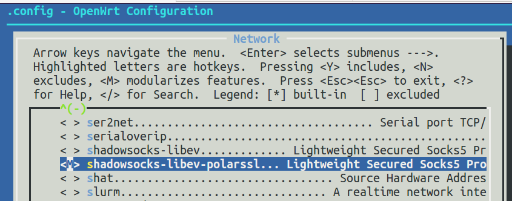
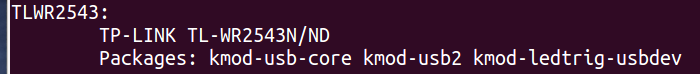

# OpenWrt 编译翻墙固件教程

# OpenWrt 编译翻墙固件教程

实践前面的教程，翻墙已经不是问题，白脸也很 happy。在这一章中，我们要定制自己 OpenWrt 固件，刷上定制的固件，不用任何设置就自动翻墙并自动更新规则。

* * *

#### 最简单的路由器刷 OpenWrt 固件翻墙教程:

[`github.com/softwaredownload/openwrt-fanqiang`](https://github.com/softwaredownload/openwrt-fanqiang "最简单的路由器刷 OpenWrt 固件翻墙教程")

#### 在线阅读 OpenWrt 翻墙路由器教程:

[`www.gitbook.com/book/softwaredownload/openwrt-fanqiang/details`](https://www.gitbook.com/book/softwaredownload/openwrt-fanqiang/details)

# 编译 shadowsocks-libev for OpenWrt ipk 安装包

# 编译 shadowsocks-libev for OpenWrt ipk 安装包

不同 OpenWrt 版本下编译的 shadowsocks-libev ipk 一般是不能通用的。比如现在用的是 trunk 版的 OpenWrt，如果使用 OpenWrt Chaos Calmer 15.05 下编译的 shadowsocks-libev，可能安装后根本不能启动。

前面我曾编译出翻墙固件，其中 shadowsocks-libev 是别人编译，从 sourceforge 上下载的，刷上固件后，shadowsocks 总是没有自动启动，运行/usr/bin/ss-redir，报告没有找到这个文件，其实文件是在的，只是不兼容。所以，最好还是自行编译 shadowsocks-libev。

以下 **不要使用 root 用户来操作**

下面是在 Ubuntu 64bit 下编译 shadowsocks-libev for OpenWrt ipk 安装包的步骤：

## 安装依赖库，不同的操作系统版本可能要作相应调整

```
sudo apt-get install build-essential subversion libncurses5-dev zlib1g-dev gawk gcc-multilib flex git-core gettext 
```

## 下载 OpenWrt 源代码

```
cd ~/Downloads
git clone git://git.openwrt.org/openwrt.git 
```

## 下载 shadowsocks-libev 源码

```
cd ~/Downloads/openwrt
pushd package
git clone https://github.com/shadowsocks/shadowsocks-libev.git
popd 
```

或者：

```
cd ~/Downloads/openwrt/package
git clone https://github.com/shadowsocks/shadowsocks-libev.git

编译 DIR505 固件 2015-12 版时用的源码版本是：Date:   Tue Dec 22 21:42:40 2015 
```

## 更新 Feeds，使 package 在 make menuconfig 中可用，而不是真正安装或编译

```
cd ~/Downloads/openwrt
./scripts/feeds update -a
./scripts/feeds install -a    
make defconfig 
```

## 先编译要用到的工具和库

```
make prereq && make tools/install && make toolchain/install 
```

等待时间较长，可以先和大妈一起去跳个广场舞，制造更多噪音恶心一下别人:)

## make menuconfig 配置选项

```
# 运行命令
make menuconfig 
```

有三个选项：

*   y: 编译进固件
*   m: 编译出安装包，但不打包进固件
*   n: 排除

输入命令`make menuconfig`进入配置程序后：

*   Target System:
    *   Atheros AR7xxx/AR9XXX (Default value，不同的路由器，可能选择不同)
        适合： WNDR4300, DIR505A1, TLWR2543
*   Subtarget:
    *   Generic device with NAND flash
        适合： WNDR4300
    *   Generic
        适合： DIR505A1
*   Target Profile: (因我们只是编译包，这步可以不选)
*   Network, 选择 shadowsocks-libev 和 shadowsocks-libev-polarssl, 按 m 设置为编译独立 ipk 安装包
*   Save && Exit


图 make menuconfig


图　选择 shadowsocks-libev-polarssl

## 编译 shadowsocks-libev for OpenWrt

```
make V=99 package/shadowsocks-libev/openwrt/compile 
```

## 查看编译出的 shadowsocks-libev 和 shadowsocks-libev-polarssl 文件

```
cd ~/Downloads/openwrt/bin/ar71xx/packages/base/
tree
├── libc_1.1.11-1_ar71xx.ipk
├── libgcc_5.2.0-1_ar71xx.ipk
├── libopenssl_1.0.2e-1_ar71xx.ipk
├── libpolarssl_1.3.15-1_ar71xx.ipk
├── libpthread_1.1.11-1_ar71xx.ipk
├── shadowsocks-libev_2.4.3_ar71xx.ipk
├── shadowsocks-libev-polarssl_2.4.3_ar71xx.ipk
└── zlib_1.2.8-1_ar71xx.ipk    

# 如果用来编译翻墙固件，把 shadowsocks-libev 复制到 Image Builder 目录下：    
# for DIR505A1:
cp shadowsocks* ~/Downloads/OpenWrt-ImageBuilder-ar71xx-generic.Linux-x86_64/packages/base
# for WNDR4300
cp shadowsocks* ~/Downloads/OpenWrt-ImageBuilder-ar71xx-nand.Linux-x86_64/packages/base 
```

把文件 scp 复制到 OpenWrt 路由器/tmp，就可以　`opkg install shadowsocks-libev_2.4.3_ar71xx.ipk`　安装了。

#### 参考：

*   [`wiki.openwrt.org/doc/howto/buildroot.exigence`](http://wiki.openwrt.org/doc/howto/buildroot.exigence)
*   [`wiki.openwrt.org/doc/howto/build`](http://wiki.openwrt.org/doc/howto/build)
*   [`github.com/shadowsocks/shadowsocks-libev`](https://github.com/shadowsocks/shadowsocks-libev)
*   [`sourceforge.net/projects/openwrt-dist/files/shadowsocks-libev/`](http://sourceforge.net/projects/openwrt-dist/files/shadowsocks-libev/)
*   [`0066.in/archives/312`](https://0066.in/archives/312)

# 下载和设置翻墙配置文件

# 下载和设置翻墙配置文件

自己手工收集编辑翻墙所用到的配置文件是件比较累的事情。最快的方法是 git clone 本项目，修改其中某些选项。

## 下载翻墙配置文件

```
cd ~/Downloads
git clone https://github.com/softwaredownload/openwrt-fanqiang 
```

默认配置文件目录：openwrt-fanqiang/openwrt/default

针对特定路由器的配置文件目录，以路由器型号为目录名，如 openwrt-fanqiang/openwrt/wndr4300

## 复制配置文件，以 wndr4300 路由器为例：

*   本地建立配置文件目录，如 ~/Downloads/openwrt-wndr4300
*   复制默认配置文件到 ~/Downloads/openwrt-wndr4300

    ```
     mkdir ~/Downloads/openwrt-wndr4300

      # Linux 下复制默认配置文件
      cp -R ~/Downloads/openwrt-fanqiang/openwrt/default/* ~/Downloads/openwrt-wndr4300/

      # 复制 WNDR4300 路由器的特定配置文件，同名文件就覆盖
      cp -R ~/Downloads/openwrt-fanqiang/openwrt/wndr4300/* ~/Downloads/openwrt-wndr4300/ 
    ```

## 修改配置文件，编译后就直接可以用了。否则刷上固件后登录路由器再修改。主要修改如下文件：

```
~/Downloads/openwrt-wndr4300/etc/shadowsocks.json
~/Downloads/openwrt-wndr4300/usr/bin/shadowsocks-firewall
~/Downloads/openwrt-wndr4300/etc/uci-defaults/defaults 
```

*   shadowsocks.json 中 server 必须改成你的服务器实际 IP
*   defaults 中 wan-username 和 wan-password 必改
*   shadowsocks-firewall 中 1.0.9.8 必须改成你的服务器实际 IP

*   编译自定义固件时，设置 FILES=~/Downloads/openwrt-wndr4300

## 自定义配置文件用途说明

定制固件的前提是你要有一台服务器运行 shadowsocks 服务端 ss-server。

*   etc/dnsmasq.conf 设置 dnsmasq 配置文件目录
*   etc/shadow 登录路由器的密码， 默认是 fanqiang
*   etc/uci-defaults/defaults 默认上网设置及时区等设置

## 关于 /etc/uci-defaults 目录

uci-defaults 目录下的文件会在路由器第一次启动时由/etc/init.d/boot 执行,如果在文件末尾加上 exit 0, 则执行就会删除此文件，否则执行成功则删除，不成功则在下次启动时继续执行直到成功。

我们在这个目录下创建一个 defaults 文件，在这个文件中设置上网参数，时区等。

To set some system defaults the first time the device boots, create a script in the folder

All scripts in that folder are automatically executed by /etc/init.d/boot and if they exited with code 0 deleted afterwards (scripts that did not exit with code 0 are not deleted and will be re-executed during the next boot until they also successfully exit).

### 默认端口及修改方法（可以不改）：

*   shadowsocks 服务端监听端口：1098
    *   文件位置： 服务器/etc/shadowsocks-libev/config.json
    *   如更改，路由器里 /etc/shadowsocks.json 也相应更改
*   路由器 shadowsocks ss-redir 监听端口：7654
    *   文件位置： 路由器/etc/shadowsocks.json
    *   如更改， 路由器/usr/bin/shadowsocks-firewall 也相应更改
*   路由器 shadowsocks ss-tunnel 监听端口: 3210
    *   文件位置: 路由器/etc/init.d/shadowsocks
    *   如更改, 路由器 /etc/dnsmasq.d/gfwlist.conf 也相应更改

以上端口建议不改。程序运行稳定后，相关密码可以改掉。

### 端口关联的理解：

*   shadowsocks-firewall 负责把非中国流量转发到本地端口 7654
*   ss-redir 监听端口 7654，该端口流量都加密走自己的服务器通道
*   dnsmasq 把非国内重要域名的 dns 查询转发本地 3210 端口
*   ss-tunnel 监听本地端口 3210,把该端口的 dns 查询转发到自己服务器向 8.8.8.8 查询

## 设置可执行权限

```
chmod +x usr/bin
chmod +x usr/bin/*
chmod +x etc/uci-defaults
chmod +x etc/uci-defaults/defaults 
```

### 参考：

*[`wiki.openwrt.org/doc/uci`](http://wiki.openwrt.org/doc/uci)

# 使用 Image Builder 编译自动翻墙 OpenWrt 固件

# 使用 Image Builder 编译自动翻墙 OpenWrt 固件

Image Builder 又叫 Image Generator，利用它我们可以方便地定制适合自己无线路由器的固件。

## 编译 OpenWrt 自定义翻墙固件的注意事项

*   不要用“root”用户编译
*   进入到编译系统目录中执行编译相关命令，如：~/Downloads/openwrt
*   在编译版的路径中不能够出现空格
*   如果已经用 root 用户下载并解压了源码，可用命令改属主成普通用户：sudo chown -R user:user ~/Downloads/openwrt

## 下载适合自己无线路由器的 Image Builder

*   进入 [`downloads.openwrt.org/`](http://downloads.openwrt.org/)

*   选择 Binary Releases 或 Development Snapshots

    *   目前的 Binary Releases: [`downloads.openwrt.org/chaos_calmer/15.05/`](http://downloads.openwrt.org/chaos_calmer/15.05/)
    *   Development Snapshots: [`downloads.openwrt.org/snapshots/trunk/`](http://downloads.openwrt.org/snapshots/trunk/)
*   选择 CPU 类型，如 ar71xx: [`downloads.openwrt.org/snapshots/trunk/ar71xx/`](http://downloads.openwrt.org/snapshots/trunk/ar71xx/)

*   选择 Flash 类型, 如 generic: [`downloads.openwrt.org/snapshots/trunk/ar71xx/generic/`](http://downloads.openwrt.org/snapshots/trunk/ar71xx/generic/)

下载命令举例:

```
cd ~/Downloads
wget http://downloads.openwrt.org/snapshots/trunk/ar71xx/generic/OpenWrt-ImageBuilder-ar71xx-generic.Linux-x86_64.tar.bz2
tar -xjf  OpenWrt-ImageBuilder-ar71xx-generic.Linux-x86_64.tar.bz2 
```

## 下载包含默认翻墙配置文件的 openwrt-fanqiang 项目

*   git 下载 openwrt-fanqiang 项目

    cd ~/Downloads git clone [`github.com/softwaredownload/openwrt-fanqiang`](https://github.com/softwaredownload/openwrt-fanqiang)

*   或者下载 zip 文件

    [`github.com/softwaredownload/openwrt-fanqiang/archive/master.zip`](https://github.com/softwaredownload/openwrt-fanqiang/archive/master.zip)

本地项目文件夹是： ~/Downloads/openwrt-fanqiang

## 复制 openwrt-fanqiang 里面的翻墙配置文件到 openwrt-tlwr2543 目录下

建立一个配置文件夹，以路由器型号结束，如 ~/Downloads/openwrt-tlwr2543。

```
cd ~/Downloads
mkdir openwrt-tlwr2543

cd openwrt-fanqiang
cp -R openwrt/default/* ~/Downloads/openwrt-tlwr2543/
cp -R openwrt/tlwr2543/* ~/Downloads/openwrt-tlwr2543/ 
```

上面的操作，先复制共用的配置文件 openwrt/default/ *到 openwrt-tlwr2543 目录下
然后复制 wr2543 专用的配置文件(如果存在)到 openwrt/tlwr2543/* 到 openwrt-tlwr2543 目录下，如果有同名文件就覆盖。

如果你要贡献本项目，也是先在 openwrt-fanqiang/openwrt 目录下先建立路由器型号为名称的文件夹，再把专用的配置文件放到此文夹下。注意文件夹和文件名都是小写的。

## 修改 TL-WR2543 路由器翻墙配置文件

### 主要修改以下文件：

```
openwrt-tlwr2543/etc/shadowsocks.json
openwrt-tlwr2543/usr/bin/shadowsocks-firewall
openwrt-tlwr2543/etc/uci-defaults/defaults 
```

为了方便以后升级，可以写个 bash 文件自动修改配置文件。

一切操作尽量自动化，你甚至可以自动化一切操作：下载 ImageBuilder，下载 OpenWrt 源码，下载 shadowsocks-libev 源码，同步 openwrt-fanqiang 源码，编译 ipk，修改翻墙设置，编译翻墙固件，早上一觉醒来，新鲜出炉、美味可口的翻墙固件就已经摆放在桌上了。

下面是一个自动修改配置文件的例子，从中可以知道需要修改哪些地方。从 2015 年 12 月起，可能用于自动化修改的默认值都应该标准化，方便自动化操作。

```
#!/bin/bash

# Author: https://github.com/softwaredownload/openwrt-fanqiang
# Date:   2015-12-24

REPOSITORY=~/Downloads/openwrt-fanqiang
CONFIG=~/Downloads/openwrt-tlwr2543

createdir() {
    rm -rf $CONFIG
    mkdir $CONFIG
}

copy() {
    cp -R $REPOSITORY/openwrt/default/* $CONFIG/
    cp -R $REPOSITORY/openwrt/tlwr2543/* $CONFIG/
}

setmod() {
    chmod +x $CONFIG/usr/bin/shadowsocks-firewall
    chmod +x $CONFIG/etc/uci-defaults
    chmod +x $CONFIG/etc/uci-defaults/*
}

modify() {
    # server ip address
    sed -i 's/1.0.9.8/server_ip/' $CONFIG/etc/shadowsocks.json

    # server_port
    sed -i 's/1098/server_port/' $CONFIG/etc/shadowsocks.json

    # local_port
    sed -i 's/7654/7654/' $CONFIG/etc/shadowsocks.json

    # password
    sed -i 's/killgfw/killgfw/' $CONFIG/etc/shadowsocks.json

    # method
    sed -i 's/aes-256-cfb/aes-256-cfb/' $CONFIG/etc/shadowsocks.json

    # server ip addresss
    sed -i 's/1.0.9.8/server_ip/' $CONFIG/usr/bin/shadowsocks-firewall

    # local_port
    sed -i 's/7654/7654/' $CONFIG/usr/bin/shadowsocks-firewall

    # ppoe username
    sed -i 's/wan-username/wan-username/' $CONFIG/etc/uci-defaults/defaults

    # ppoe password
    sed -i 's/wan-password/wan-password/' $CONFIG/etc/uci-defaults/defaults

    # wifi password
    sed -i 's/icanfly9876/icanfly9876/g' $CONFIG/etc/uci-defaults/defaults

    # root password
    sed -i 's/\\nfanqiang/\\nfanqiang/' $CONFIG/etc/uci-defaults/defaults
}

if [ "$1" = "createdir" ]; then
    createdir
elif [ "$1" = "copy" ]; then
    copy
elif [ "$1" = "setmod" ]; then
    setmod
elif [ "$1" = "modify" ]; then
    modify
else
    echo "usage: createdir copy setmod modify"
fi 
```

**自动修改翻墙配置文件用法：**

```
./config-tlwr2543.sh createdir
./config-tlwr2543.sh copy
./config-tlwr2543.sh setmod
./config-tlwr2543.sh modify 
```

## 确定 OpenWrt 无线路由器的 PROFILE 值

```
cd OpenWrt-ImageBuilder-ar71xx-generic.Linux-x86_64
make info 
```

找到自己固件的型号，比如我的是 `TP-LINK TL-WR2543N/ND`,它的 PROFILE 值是 TLWR2543。如下图：



## 找出默认应该包含进 OpenWrt 固件的包

对于 TP-LINK WR2543 无线路由器来说，可以这样获取：

```
echo $(wget -qO - http://downloads.openwrt.org/snapshots/trunk/ar71xx/generic/config | sed -ne 's/^CONFIG_PACKAGE_\([a-z0-9-]*\)=y/\1/ip') 
```

由于 OpenWrt 开发非常活跃，不同版本的基础包可能是不同的。

2015-12-24 的基础包：

> base-files busybox dnsmasq dropbear firewall fstools jsonfilter libc libgcc mtd netifd opkg procd swconfig ubox ubus ubusd uci usign kmod-ledtrig-usbdev kmod-lib-crc-ccitt kmod-nls-base kmod-ip6tables kmod-ipt-conntrack kmod-ipt-core kmod-ipt-nat kmod-nf-conntrack kmod-nf-conntrack6 kmod-nf-ipt kmod-nf-ipt6 kmod-nf-nat kmod-ipv6 kmod-ppp kmod-pppoe kmod-pppox kmod-slhc kmod-gpio-button-hotplug kmod-usb-core kmod-usb-ohci kmod-usb2 kmod-ath kmod-ath9k kmod-ath9k-common kmod-cfg80211 kmod-mac80211 libip4tc libip6tc libxtables libblobmsg-json libexpat libiwinfo libjson-c libnl-tiny libubox libubus libuci ip6tables iptables hostapd-common iw odhcp6c odhcpd ppp ppp-mod-pppoe wpad-mini iwinfo jshn libjson-script uboot-envtools

2014-09-01 获取的基础包：

> base-files busybox dnsmasq dropbear firewall fstools jsonfilter libc libgcc mtd netifd opkg procd swconfig ubox ubus ubusd uci kmod-crypto-aes kmod-crypto-arc4 kmod-crypto-core kmod-ledtrig-usbdev kmod-lib-crc-ccitt kmod-nls-base kmod-ip6tables kmod-ipt-conntrack kmod-ipt-core kmod-ipt-nat kmod-ipt-nathelper kmod-ipv6 kmod-ppp kmod-pppoe kmod-pppox kmod-slhc kmod-gpio-button-hotplug kmod-usb-core kmod-usb-ohci kmod-usb2 kmod-ath kmod-ath9k kmod-ath9k-common kmod-cfg80211 kmod-mac80211 libip4tc libip6tc libxtables libblobmsg-json libiwinfo libjson-c libnl-tiny libubox libubus libuci ip6tables iptables hostapd-common iw odhcp6c odhcpd ppp ppp-mod-pppoe wpad-mini iwinfo jshn libjson-script uboot-envtools

默认包要包含在 PACKAGES 命令行参数中，并再加上必要的包：

```
luci-ssl ipset wget shadowsocks-libev iptables-mod-nat-extra bind-dig 
```

如果你的 openWrt 版本是 ATTITUDE ADJUSTMENT，可能加上 iptables-mod-nat-extra 包，如果没安装的话 iptables 的端口转发会不支持。

注意，在编译前要把 shadowsocks-libev 及其他要用到的 .ipk 文件放到 ImageBuilder 的目录下 packages/base/：

```
# 对于 TLWR2543,DIR505A1:
~/Downloads/OpenWrt-ImageBuilder-ar71xx-generic.Linux-x86_64/packages/base/

# 对于 WNDR4300:
~/Downloads/OpenWrt-ImageBuilder-ar71xx-nand.Linux-x86_64/packages/base/ 
```

## OpenWrt Image Builder 的三个命令行参数

*   PROFILE 指定设备类型，此处是　TLWR2543
*   PACKAGES 指定要编译进固件的包
*   FILES 指定要编译进固件的自定义文件，如网络有关配置文件, ~/Downloads/openwrt-tlwr2543

## 开始编译 OpenWrt 自动翻墙固件

```
cd ~/Downloads/OpenWrt-ImageBuilder-ar71xx-generic.Linux-x86_64
make image PROFILE=TLWR2543 PACKAGES="base-files busybox dnsmasq dropbear firewall fstools jsonfilter libc libgcc mtd netifd opkg procd swconfig ubox ubus ubusd uci usign kmod-ledtrig-usbdev kmod-lib-crc-ccitt kmod-nls-base kmod-ip6tables kmod-ipt-conntrack kmod-ipt-core kmod-ipt-nat kmod-nf-conntrack kmod-nf-conntrack6 kmod-nf-ipt kmod-nf-ipt6 kmod-nf-nat kmod-ipv6 kmod-ppp kmod-pppoe kmod-pppox kmod-slhc kmod-gpio-button-hotplug kmod-usb-core kmod-usb-ohci kmod-usb2 kmod-ath kmod-ath9k kmod-ath9k-common kmod-cfg80211 kmod-mac80211 libip4tc libip6tc libxtables libblobmsg-json libexpat libiwinfo libjson-c libnl-tiny libubox libubus libuci ip6tables iptables hostapd-common iw odhcp6c odhcpd ppp ppp-mod-pppoe wpad-mini iwinfo jshn libjson-script uboot-envtools ipset wget shadowsocks-libev-polarssl luci-ssl" FILES=~/Downloads/openwrt-tlwr2543 
```

编译好的的固件在 ImageBuilder 的 bin/ar71xx/目录下。

```
# 对于 TLWR2543,DIR505A1:
~/Downloads/OpenWrt-ImageBuilder-ar71xx-generic.Linux-x86_64/bin/ar71xx/

# 对于 WNDR4300:
~/Downloads/OpenWrt-ImageBuilder-ar71xx-nand.Linux-x86_64/bin/ar71xx/ 
```

升级固件要用到的是 ...sysupgrade.bin，比如　openwrt-ar71xx-generic-tl-wr2543-v1-squashfs-sysupgrade.bin

然后把这个固件刷进 TP-LINK WR2543N，重启路由器后后就能免设置智能翻墙。

## 刷翻墙固件后管理员登录 OpenWrt

刷好固件并重启路由器后，电脑连上无线网络 eastking-tlwr2543, 然后就可用密码`fanqiang` 登录路由器。

*   ssh 登录 openwrt 管理路由器：

    ```
     ssh root@192.168.1.1 
    ```

*   浏览器打开 192.168.1.1 登录

以后玩 OpenWrt 出问题，可以重新刷上这个翻墙固件就又可以在网上畅行无阻了。

#### 参考：

*   [`wiki.openwrt.org/doc/howto/obtain.firmware.generate`](http://wiki.openwrt.org/doc/howto/obtain.firmware.generate)
*   [`wiki.openwrt.org/doc/howto/build`](https://wiki.openwrt.org/doc/howto/build)

# 如何使用别人预编译的 OpenWrt 翻墙固件

# 如何使用别人预编译的 OpenWrt 翻墙固件 for TP-LINK WR2543N (包含 shadowsocks-libev)

如果你的无线路由器和我的一样，也是　TP-LINK wr2543N v1，你不想自己编译固件，那么可以下载我预先编译好的固件，刷好固件好，稍微设置下，就可以自动翻墙。

在下载和刷 OpenWrt 固件前，确保熟悉本教程的前面部分，已经配置好 shadowsocks-libev 服务端，并能自由进入路由器的安全模式。再次强调，刷机有风险，风险自承担。

该固件只是在 OpenWrt trunk 版加上：luci-ssl wget shadowsocks-libev 的最新版，还有翻墙要用到的配置，没有添加其他任何内容。

## 翻墙默认配置

*   [教程用到的 OpenWrt 翻墙配置文件](https://github.com/softwaredownload/openwrt-fanqiang/tree/master/openwrt](https://github.com/softwaredownload/openwrt-fanqiang/tree/master/openwrt)

*   [教程中用到的 shadowsocks 服务端配置文件](https://github.com/softwaredownload/openwrt-fanqiang/tree/master/ubuntu)

## 下载 OpenWrt 固件 for TP-LINK wr2543N

到下面的网址下载：

[`software-download.name/2014/openwrt-ar71xx-generic-tl-wr2543-v1-squashfs-sysupgrade-bin-with-shadowsocks/`](https://software-download.name/2014/openwrt-ar71xx-generic-tl-wr2543-v1-squashfs-sysupgrade-bin-with-shadowsocks/)

下载后保存在 Ubuntu: `~/Downloads/openwrt-ar71xx-generic-tl-wr2543-v1-squashfs-sysupgrade.bin`

## 复制 OpenWrt 固件到路由器

```
scp ~/Downloads/openwrt-ar71xx-generic-tl-wr2543-v1-squashfs-sysupgrade.bin root@192.168.1.1:/tmp/ 
```

## 登录 OpenWrt 路由器,并查看文件大小是否正确

```
ssh root@192.168.1.1
root@OpenWrt: cd /tmp/
ls 
```

## 升级 OpenWrt 固件(不保留原来配置)

```
root@OpenWrt:/tmp# sysupgrade -n openwrt-ar71xx-generic-tl-wr2543-v1-squashfs-sysupgrade.bin 
```

## 路由器重启后，电脑连接到无线网络 eastking-wr2543

## ssh 登录并修改设置：

```
ssh root@192.168.1.1 
```

输入密码 `fanqiang` 登录

有时会提示错误：

```
@@@@@@@@@@@@@@@@@@@@@@@@@@@@@@@@@@@@@@@@@@@@@@@@@@@@@@@@@@@
@    WARNING: REMOTE HOST IDENTIFICATION HAS CHANGED!     @
@@@@@@@@@@@@@@@@@@@@@@@@@@@@@@@@@@@@@@@@@@@@@@@@@@@@@@@@@@@
IT IS POSSIBLE THAT SOMEONE IS DOING SOMETHING NASTY!
Someone could be eavesdropping on you right now (man-in-the-middle attack)!
It is also possible that a host key has just been changed.
The fingerprint for the RSA key sent by the remote host is
cf:c5:12:34:56:0b:4d:1c:56:48:6a:87:04:cf:b8:83.
Please contact your system administrator.
Add correct host key in /home/openwrt-fanqiang/.ssh/known_hosts to get rid of this message.
Offending RSA key in /home/openwrt-fanqiang/.ssh/known_hosts:3
  remove with: ssh-keygen -f "/home/openwrt-fanqiang/.ssh/known_hosts" -R 192.168.1.1
RSA host key for 192.168.1.1 has changed and you have requested strict checking.
Host key verification failed. 
```

解决办法就是复制并运行提示中的清理命令：

```
ssh-keygen -f "/home/openwrt-fanqiang/.ssh/known_hosts" -R 192.168.1.1 
```

### 以下设置必须修改：

*   /etc/shadowsocks.json
    *   server 必须改成你的服务器实际 IP
*   /etc/config/network
    *   wan-username 和 wan-password 必改
*   /usr/bin/shadowsocks-firewall
    *   1.0.9.8 必须改成你的服务器实际 IP

如果你还改了其他默认值，请自行修改相应文件。不建议修改其他默认值，以提高一次成功率。

## 执行以下命令使修改生效

```
root@OpenWrt:~# /etc/init.d/shadowsocks stop
root@OpenWrt:~# /etc/init.d/shadowsocks start
root@OpenWrt:~# /etc/init.d/network restart 
```

测试一下是否可以在网上畅行无阻了。

#### 本教程已经在 github 开源，欢迎提交改进，报告 bug:

[`github.com/softwaredownload/openwrt-fanqiang`](https://github.com/softwaredownload/openwrt-fanqiang)