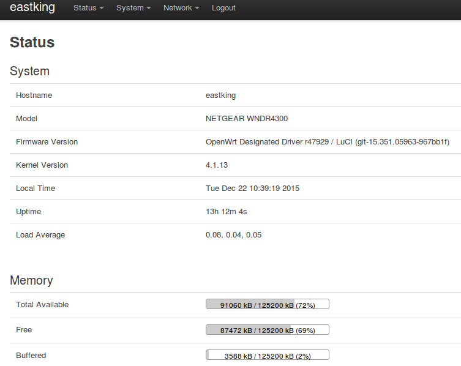
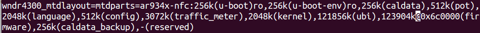
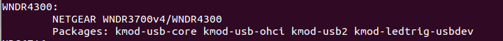
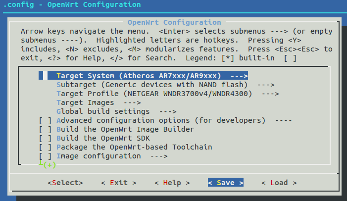
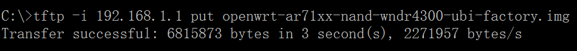

# 应用: Netgear WNDR4300 刷 OpenWrt 翻墙教程

# 网件 Netgear WNDR4300 刷 OpenWrt 翻墙教程

网件 Netgear WNDR4300 是很多网友推荐的可刷 OpenWRT 的无线路由器。

WNDR4300 有 v1 和 v2 的区别，目前国行都是 v1 版本。



## 网件 Netgear WNDR4300 无线路由器的优点

*   刷 OpenWrt 方便。购买后，登录管理界面可以直接刷 OpenWrt
*   WNDR4300 自带不死 uboot，刷机比较安全
*   硬件配置高。据网友测试，同时接入 40 台机器都没有问题
*   无线信号强。150 平方的室内基本无信号死角
*   有一个 USB 接口，可以挂载设备

## 网件 Netgear WNDR4300 国行硬件信息

千兆双频，300+450Mbps 的无线连接，2.4G 和 5G 无线信号可以同时使用，1000Mbps 有线端口，内置 5 天线（两根 5G+三根 2.4G），采用 Atheros AR9344 处理器，频率 550MHz，128M DDR2 内存，128M ROM，USB 可接硬盘进行共享，带有 wifi 开关按钮可以单独关闭无线信号。

```
Version        v1                
CPU            Atheros AR9344 rev2 560MHz MIPS 74Kc V4.12
Ram            128MiB
Flash        128MiB NAND
Network        1 WAN + 4x LAN (GBit)
Wireless    AR9580 [an 3x3:3] + AR9344 [bgn 2x2:2]
USB            Yes 
```

## 如何购买网件 Netgear WNDR4300 无线路由器

目前自营电商的价格一般是 299 元，TB 价大约 280 元。

## 参考信息

*   [Netgear WNDR4300 OpenWrt 官网 Wiki](https://wiki.openwrt.org/toh/netgear/wndr4300)
*   [Windows 下 Netgear WNDR4300 刷 OpenWrt 固件 PDF 教程 by 书浅](https://software-download.name/2015/netgear-wndr4300-shua-openwrt/)
*   [gy408 预编译集成固件 for WNDR4300](https://github.com/gygy/gygy.github.io)

* * *

#### 最简单的路由器刷 OpenWrt 固件翻墙教程:

[`github.com/softwaredownload/openwrt-fanqiang`](https://github.com/softwaredownload/openwrt-fanqiang "最简单的路由器刷 OpenWrt 固件翻墙教程")

#### 在线阅读 OpenWrt 翻墙路由器教程:

[`www.gitbook.com/book/softwaredownload/openwrt-fanqiang/details`](https://www.gitbook.com/book/softwaredownload/openwrt-fanqiang/details)

# WNDR4300 下载和设置 Image Builder

# 下载和设置 OpenWrt Image Builder for 网件 Netgear WNDR4300 路由器

下载 OpenWrt ImageBuilder 时有二种选择：稳定发行版和最新 trunk 版。

## 　OpenWrt ImageBuilder for 网件 Netgear WNDR4300 稳定发行版的下载

进入网址： [`downloads.openwrt.org/`](http://downloads.openwrt.org/)

现在是 2015 年 12 月 22 日，可以看到：

> Chaos Calmer 15.05
> Released: Fri, 11 Sep 2015

WNDR4300 是 NAND 内存，进入下面的网址下载适合 WNDR4300 的 ImageBuilder 稳定发行版:

[`downloads.openwrt.org/chaos_calmer/15.05/ar71xx/nand/`](http://downloads.openwrt.org/chaos_calmer/15.05/ar71xx/nand/)

我尝试用稳定发行版编译自动翻墙固件，出现错误，后来改用 trunk 版就顺利成功了。本教程用的是 trunk 版。

## OpenWrt ImageBuilder for 网件 Netgear WNDR4300 最新 trunk 版的下载

Linux 下，下载工具一般默认保存到 ~/Downloads，工作在 Downloads 目录，下载，解压和编译也比较方便。

```
cd ~/Downloads
wget http://downloads.openwrt.org/snapshots/trunk/ar71xx/nand/OpenWrt-ImageBuilder-ar71xx-nand.Linux-x86_64.tar.bz2
tar -xjf OpenWrt-ImageBuilder-ar71xx-nand.Linux-x86_64.tar.bz2 
```

## 网件 Netgear WNDR4300 路由器完全使用 128Ｍ内存教程

将 ubi 和 firmware 增加 96M，完全使用 128M flash,以实现 WNDR4300 路由器 overlay 分区大于 90MB 的功能

在 linux 下用 vi 命令可以很方便地查找和修改特定字符。

*   查找 23552k，替换成 121856k
*   查找 25600k，替换成 123904k

下面就用 vi 来修改：

```
cd ~/Downloads/OpenWrt-ImageBuilder-ar71xx-nand.Linux-x86_64/target/linux/ar71xx/image
cp Makefile Makefile.bak

vi Makefile

#change ubi size to 121856k    
# search
/23552k
# delete word
dw
# insert
i
121856k

#change firmware size to 123904k
/25600k
dw
i
123904k

#Save and exit
ZZ 
```

修改好后是这样的：



## 确定网件 Netgear WNDR4300 路由器的 PROFILE 值

```
cd OpenWrt-ImageBuilder-ar71xx-nand.Linux-x86_64
make info 
```

下图最上面一行显示，PROFILE 值是 WNDR4300：



## 确定应该包含在自编译 WNDR4300 路由器翻墙固件里的包

### 1\. 在 Linux 下运行命令自动获取基础包：

```
echo $(wget -qO - http://downloads.openwrt.org/snapshots/trunk/ar71xx/nand/config | sed -ne 's/^CONFIG_PACKAGE_\([a-z0-9-]*\)=y/\1/ip') 
```

结果如下：

> base-files busybox dnsmasq dropbear firewall fstools jsonfilter libc libgcc mtd netifd opkg procd swconfig ubox ubus ubusd uci usign kmod-lib-crc-ccitt kmod-ip6tables kmod-ipt-conntrack kmod-ipt-core kmod-ipt-nat kmod-nf-conntrack kmod-nf-conntrack6 kmod-nf-ipt kmod-nf-ipt6 kmod-nf-nat kmod-ipv6 kmod-ppp kmod-pppoe kmod-pppox kmod-slhc kmod-gpio-button-hotplug kmod-spi-bitbang kmod-spi-gpio kmod-ath kmod-ath9k kmod-ath9k-common kmod-cfg80211 kmod-mac80211 libip4tc libip6tc libxtables libblobmsg-json libexpat libiwinfo libjson-c libnl-tiny libubox libubus libuci ip6tables iptables hostapd-common iw odhcp6c odhcpd ppp ppp-mod-pppoe wpad-mini iwinfo jshn libjson-script procd-nand ubi-utils uboot-envtools

### 2\. 获取网件 Netgear WNDR4300 路由器相关包：

```
make info
Current Target: "ar71xx (Generic devices with NAND flash)"
Default Packages: base-files libc libgcc busybox dropbear mtd uci opkg netifd fstools kmod-gpio-button-hotplug swconfig kmod-ath9k wpad-mini uboot-envtools dnsmasq iptables ip6tables ppp ppp-mod-pppoe firewall odhcpd odhcp6c
Available Profiles:
...
WNDR4300:
    NETGEAR WNDR3700v4/WNDR4300
    Packages: kmod-usb-core kmod-usb-ohci kmod-usb2 kmod-ledtrig-usbdev 
```

那就再增加上面的 Default Packages 和 WNDR4300 Packages。去重排序后，再去掉 dnsmasq，

### 3\. 增加自定义包

```
ipset wget libopenssl shadowsocks-libev luci-ssl iptables-mod-nat-extra bind-dig dnsmasq-full 
```

Dnsmasq 提供 DNS 缓存和 DHCP 服务功能。作为域名解析服务器(DNS)，dnsmasq 可以通过缓存 DNS 请求来提高对访问过的网址的连接速度。作为 DHCP 服务器，dnsmasq 可以为局域网电脑提供内网 ip 地址和路由。

默认的 dnsmasq 为 base 版本，该版本不能对特定的域名地址进行标记操作（因为我们需要对一些特定域名如 twitter 等进行标记），改为更加强大的 dnsmasq-full

luci-ssl 是用来网页界面管理路由器，安装后就可以　[`192.168.1.1`](https://192.168.1.1) 登录 WNDR4300 路由器

bind-dig 可以调试域名解析

shadowsocks-libev　翻墙主角

# WNDR4300 编译 shadowsocks-libev ipk

# 编译 shadowsocks-libev ipk for 网件 Netgear WNDR4300 路由器

不同 OpenWrt 版本下编译的 shadowsocks-libev ipk 一般是不能通用的。比如现在用的是 trunk 版的 OpenWrt，如果使用 OpenWrt Chaos Calmer 15.05 下编译的 shadowsocks-libev，可能安装后根本不能启动。

前面我曾编译出翻墙固件，其中 shadowsocks-libev 是别人编译，从 sourceforge 上下载的，刷上固件后，shadowsocks 总是没有自动启动，运行/usr/bin/ss-redir，报告没有找到这个文件，其实文件是在的，只是不兼容。所以，最好还是自行编译 shadowsocks-libev。

按官网的[说法](https://wiki.openwrt.org/doc/howto/build)，以下 **不要使用 root 用户来操作**

## 编译 shadowsocks-libev ipk 安装包

请同时参考前面的教程：编译 shadowsocks-libev for OpenWrt ipk 安装包

下面都是在 Linux 下操作。

```
cd ~/Downloads
git clone git://git.openwrt.org/openwrt.git

pushd package
git clone https://github.com/shadowsocks/shadowsocks-libev.git
popd

cd ~/Downloads/openwrt
./scripts/feeds update -a
./scripts/feeds install -a    

make defconfig
make prereq
make menuconfig            

＃ Target System: Atheros AR7xxx/AR9XXX  
＃ Subtarget: Generic device with NAND flash
＃ Target Profile: (因我们只是编译包，这步可以不选)
＃ Network, 选择 shadowsocks-libev-openssl 和 shadowsocks-libev-polarssl,  按 m 设置为编译独立 ipk 安装包
＃ Save && Exit

#　这一步花了几个小时
make tools/install && make toolchain/install

# 开始编译
make V=99 package/shadowsocks-libev/openwrt/compile 
```



输出文件在　openwrt/bin/ar71xx/packages/base/目录下，主要有：

```
shadowsocks-libev_2.4.3_ar71xx.ipk
shadowsocks-libev-polarssl_2.4.3_ar71xx.ipk
libopenssl_1.0.2e-1_ar71xx.ipk
libpolarssl_1.3.15-1_ar71xx.ipk 
```

把所有 ipk 都复制到 ImageBuilder 的 packages/base 目录下

```
cd ~/Downloads/openwrt/bin/ar71xx/packages/base/
cp * ~/Downloads/OpenWrt-ImageBuilder-ar71xx-nand.Linux-x86_64/packages/base 
```

# WNDR4300 修改翻墙配置文件

# 设置网件 Netgear WNDR4300 翻墙配置文件

要翻墙成功，这一步是最重要的。

分三步，下载本项目 openwrt-fanqiang；复制配置文件；修改配置文件。

下面以 linux 系统 ~/Downloads 下操作为例。

## 下载包含默认翻墙配置文件的 openwrt-fanqiang 项目

*   git 下载 openwrt-fanqiang 项目

    cd ~/Downloads git clone [`github.com/softwaredownload/openwrt-fanqiang`](https://github.com/softwaredownload/openwrt-fanqiang)

*   或者下载 zip 文件

    [`github.com/softwaredownload/openwrt-fanqiang/archive/master.zip`](https://github.com/softwaredownload/openwrt-fanqiang/archive/master.zip)

本地项目文件夹是： ~/Downloads/openwrt-fanqiang

## 复制 openwrt-fanqiang 里面的翻墙配置文件到 openwrt-wndr4300 目录下

建立一个配置文件夹，以路由器型号结束，如 ~/Downloads/openwrt-wndr4300。

```
cd ~/Downloads
mkdir openwrt-wndr4300

cd openwrt-fanqiang
cp -R openwrt/default/* ~/Downloads/openwrt-wndr4300/
cp -R openwrt/wndr4300/* ~/Downloads/openwrt-wndr4300/ 
```

上面的操作，先复制共用的配置文件 openwrt/default/ *到 openwrt-wndr4300 目录下
然后复制 wndr4300 专用的配置文件到 openwrt/wndr4300/* 到 openwrt-wndr4300 目录下，如果有同名文件就覆盖。

如果你要贡献本项目，也是先在 openwrt-fanqiang/openwrt 目录下先建立路由器型号为名称的文件夹，再把专用的配置文件放到此文夹下。注意文件夹和文件名都是小写的。

## 修改 Netgear WNDR4300 翻墙配置文件

### 主要修改以下文件：

```
openwrt-wndr4300/etc/shadowsocks.json
openwrt-wndr4300/usr/bin/shadowsocks-firewall
openwrt-wndr4300/etc/uci-defaults/defaults 
```

为了方便以后升级，可以写个 bash 文件自动修改配置文件。

一切操作尽量自动化，你甚至可以自动化一切操作：下载 ImageBuilder，下载 OpenWrt 源码，下载 shadowsocks-libev 源码，同步 openwrt-fanqiang 源码，编译 ipk，修改翻墙设置，编译翻墙固件，早上一觉醒来，新鲜出炉、美味可口的翻墙固件就已经摆放在桌上了。

下面是一个自动修改配置文件的例子，从中可以知道需要修改哪些地方。从 2015 年 12 月起，可能用于自动化修改的默认值都应该标准化，方便自动化操作。

### config-wndr4300.sh:

```
#!/bin/bash

# Author: https://github.com/softwaredownload/openwrt-fanqiang
# Date:   2015-12-20

REPOSITORY=~/Downloads/openwrt-fanqiang
CONFIG=~/Downloads/openwrt-wndr4300

createdir() {
    rm -rf $CONFIG
    mkdir $CONFIG
}

copy() {
    cp -R $REPOSITORY/openwrt/default/* $CONFIG/
    cp -R $REPOSITORY/openwrt/wndr4300/* $CONFIG/
}

setmod() {
    chmod +x $CONFIG/usr/bin/shadowsocks-firewall
    chmod +x $CONFIG/etc/uci-defaults
    chmod +x $CONFIG/etc/uci-defaults/*
}

modify() {
    # server ip address
    sed -i 's/1.0.9.8/server_ip/' $CONFIG/etc/shadowsocks.json

    # server_port
    sed -i 's/1098/server_port/' $CONFIG/etc/shadowsocks.json

    # local_port
    sed -i 's/7654/7654/' $CONFIG/etc/shadowsocks.json

    # password
    sed -i 's/killgfw/killgfw/' $CONFIG/etc/shadowsocks.json

    # method
    sed -i 's/aes-256-cfb/aes-256-cfb/' $CONFIG/etc/shadowsocks.json

    # server ip addresss
    sed -i 's/1.0.9.8/server_ip/' $CONFIG/usr/bin/shadowsocks-firewall

    # local_port
    sed -i 's/7654/7654/' $CONFIG/usr/bin/shadowsocks-firewall

    # ppoe username
    sed -i 's/wan-username/wan-username/' $CONFIG/etc/uci-defaults/defaults

    # ppoe password
    sed -i 's/wan-password/wan-password/' $CONFIG/etc/uci-defaults/defaults

    # wifi password
    sed -i 's/icanfly9876/icanfly9876/g' $CONFIG/etc/uci-defaults/defaults

    # router login password for root
    sed -i 's/\\nfanqiang/\\nfanqiang/' $CONFIG/etc/uci-defaults/defaults
}

if [ "$1" = "createdir" ]; then
    createdir
elif [ "$1" = "copy" ]; then
    copy
elif [ "$1" = "setmod" ]; then
    setmod
elif [ "$1" = "modify" ]; then
    modify
else
    echo "usage: createdir copy setmod modify"
fi 
```

### config-wndr4300.sh 使用方法：

必改值是：

```
server_ip
wan-username
wan-password 
```

如果你比较懒，就改这三项就行了，可以说本教程是最简单的翻墙方案了。

选改值：

```
router login password for root
wifi password 
```

其他值一般保持默认值就可以了。

假设 config-wndr4300.sh 在~/Downloads 目录下，运行命令自动修改翻墙配置：

```
cd ~/Downloads
sudo chmod +x config-wndr4300.sh
./config-wndr4300.sh createdir
./config-wndr4300.sh copy
./config-wndr4300.sh setmod
./config-wndr4300.sh modify 
```

# WNDR4300 编译自动翻墙固件

# 编译 OpenWrt 自动翻墙固件 for 网件 Netgear WNDR4300 路由器

经过前面几个步骤，一切准备就绪，下面就正确开始编译 Netgear WNDR4300 专用全自动翻墙固件了。

## 编译 OpenWrt 自动翻墙固件前的系统准备

```
sudo apt-get update
sudo apt-get install git-core build-essential libssl-dev libncurses5-dev unzip 
```

## OpenWrt Image Builder 的三个命令行参数

*   PROFILE 指定设备类型，此处是　WNDR4300
*   PACKAGES 指定要编译进固件的包
*   FILES 指定要编译进固件的自定义文件，如网络有关配置文件, 默认目录：~/Downloads/openwrt-wndr4300

## 开始编译 OpenWrt 自动翻墙固件 for 网件 Netgear WNDR4300 路由器

命令：

```
cd ~/Downloads/OpenWrt-ImageBuilder-ar71xx-nand.Linux-x86_64/

make image PROFILE=WNDR4300 PACKAGES="base-files busybox dropbear firewall fstools jsonfilter libc libgcc mtd netifd opkg procd swconfig ubox ubus ubusd uci usign kmod-lib-crc-ccitt kmod-ipv6 kmod-ip6tables kmod-ipt-conntrack kmod-ipt-core kmod-ipt-nat kmod-nf-conntrack kmod-nf-conntrack6 kmod-nf-ipt kmod-nf-ipt6 kmod-nf-nat kmod-ppp kmod-pppoe kmod-pppox kmod-slhc kmod-gpio-button-hotplug kmod-spi-bitbang kmod-spi-gpio kmod-ath kmod-ath9k kmod-ath9k-common kmod-cfg80211 kmod-mac80211 libip4tc libip6tc libxtables libblobmsg-json libexpat libiwinfo libjson-c libnl-tiny libubox libubus libuci ip6tables iptables hostapd-common iw odhcp6c odhcpd ppp ppp-mod-pppoe wpad-mini iwinfo jshn libjson-script procd-nand ubi-utils uboot-envtools base-files libc libgcc busybox dropbear mtd uci opkg netifd fstools kmod-gpio-button-hotplug swconfig kmod-ath9k wpad-mini uboot-envtools kmod-usb-core kmod-usb-ohci kmod-usb2 kmod-ledtrig-usbdev ipset wget libopenssl shadowsocks-libev luci-ssl iptables-mod-nat-extra bind-dig dnsmasq-full" FILES=~/Downloads/openwrt-wndr4300 
```

编译时报错：

> opkg_install_cmd: Cannot install package kmod-ipv6

移除 kmod-ipv6 后编译成功。

编译好的的固件在：

```
~/Downloads/OpenWrt-ImageBuilder-ar71xx-nand.Linux-x86_64/bin/ar71xx/ 
```

其中包含：

```
openwrt-ar71xx-nand-wndr4300-ubi-factory.img
openwrt-ar71xx-nand-wndr4300-squashfs-sysupgrade.tar 
```

可见生成了二种格式的固件，img 格式和 tar 格式。 其中 img 格式只能用 tftp 的方法进行刷入。而 tar 也只能通过 已刷了 Openwrt 的 WEB 端进行刷入。

### 部分编译错误处理

1.  Build dependency: Please install the openssl library (with development headers)

    For Centos：

    ```
     yum install openssl-devel 
    ```

    For Ubuntu：

    ```
     sudo apt-get install libssl-dev 
    ```

2.  Unable to open feeds configuration in line 42

    使用 `svn co svn://svn.openwrt.org/openwrt/trunk/` 下载后再编译的方法没有遇到这个问题。

3.  configure: error: you should not run configure as root (set FORCE_UNSAFE_CONFIGURE=1 in environment to bypass this check)

    See config.log' for more details

    将下载的文件的所有者改为自己,假设用户名是 ubuntu

    `sudo chown -Rv ubuntu /home/ubuntu/openwrt`

    再重新运行`make`

# WNDR4300 怎样刷自动翻墙固件

# 网件 Netgear WNDR4300 路由器怎样刷 OpenWrt 自动翻墙固件

## 两种翻墙固件格式 img tar 的区别

```
openwrt-ar71xx-nand-wndr4300-ubi-factory.img
openwrt-ar71xx-nand-wndr4300-squashfs-sysupgrade.tar 
```

我们编译出了两种固件，一种为 ...ubi-factory.img 格式，一种为 ...squashfs-sysupgrade.tar 格式。 其中 img 格式只能用 tftp 的方法刷入。而 tar 只能通过已刷了 Openwrt 的 WEB 端进行刷入。下面分别说明 两种不同的刷入方法：

tftp 刷固件的方式，不管原来的固件是什么格式，都可以刷 factory.img

## 网件 Netgear WNDR4300 路由器进入恢复模式的方法

*   关闭路由器电源
*   用 牙签，或其他尖物 按住设备背面的机身背面的红色小圆孔(Restore Factory Settings button)
*   开启电源开关
*   观察电源灯（此时保持按住 Restore Factory Settings 按钮不要松手），直到电源灯由 橙色闪烁 状态变到 绿色闪烁 状态（说明设备已经进入到了 TFTP 修复模式 ）

## Linux 下 Netgear WNDR4300 路由器用 tftp 刷翻墙固件

*   将电脑用网线连接到设备的 LAN 口，而不是 wan 口。国行 Netgear WNDR4300 的 wan 口是黄色的
*   将电脑的本地连接 IP 设置为 192.168.1.X （此例中 IP 地址设置为 192.168.1.2 ），子网掩码为 255.255.255.0，网关为 192.168.1.1
*   路由器进入恢复模式
*   测试能否连接到路由器：

    ```
     ping 192.168.1.1
      PING 192.168.1.1 (192.168.1.1) 56(84) bytes of data.
      Warning: time of day goes back (-3646479862160196504us), taking countermeasures.
      Warning: time of day goes back (-3646479862160196420us), taking countermeasures. 
    ```

*   网件 Netgear WNDR4300 路由器刷翻墙固件

    ```
     sudo apt-get install tftp
      #　进入固件所在目录
      cd ~/Downloads/OpenWrt-ImageBuilder-ar71xx-nand.Linux-x86_64/bin/ar71xx
      echo -e "binary\nrexmt 1\ntimeout 60\ntrace\nput openwrt-ar71xx-nand-wndr4300-ubi-factory.img\n" | tftp 192.168.1.1 
    ```

*   观察指示灯，文件传送完毕后，等待 80 秒左右，设备会自动重启（请耐心等待，切勿将路由器手动断电）。设备重启后，看到亮绿灯，一定要按机身后面的电源开关手动断电、开机，否则可能没有无线 5G 这不是 BUG，其他 openwrt 也是一样的。每次刷 factory.img 都要这样

## Windows 下 Netgear WNDR4300 路由器用 tftp 刷翻墙固件

*   启用 tftp。Windows 10 下：控制面板，所有控制面板项，程序和功能，启用或关闭 Windows 功能，启用“TFTP”客户端
*   将电脑用网线连接到设备的 LAN 口
*   将电脑的本地连接 IP 设置为 192.168.1.X （此例中 IP 地址设置为 192.168.1.2 ），子网掩码为 255.255.255.0，网关 192.168.1.1
*   路由器进入恢复模式
*   测试能否连接到路由器： ping 192.168.1.1
*   网件 Netgear WNDR4300 路由器刷翻墙固件

    *   按 Windows+R,输入 cmd 并回车调出命令行程序
    *   假设 openwrt-ar71xx-nand-wndr3700v4-ubi-factory.img 在 C:\盘
    *   运行命令：

        ```
         cd C:\
          tftp -i 192.168.1.1 put openwrt-ar71xx-nand-wndr3700v4-ubi-factory.img 
        ```

        

*   观察指示灯，设备重启后，看到亮绿灯，再手动断电、开机，否则可能没有无线 5G

更详细的 WNDR4300 刷 openwrt PDF 图文教程：
[Windows 下 Netgear WNDR4300 刷 OpenWrt 固件 PDF 教程 by 书浅](https://software-download.name/2015/netgear-wndr4300-shua-openwrt/)

# WNDR4300 登录并设置翻墙固件

# 登录并设置已经刷了 OpenWrt 翻墙固件的网件 Netgear WNDR4300 路由器

## Netgear WNDR4300 预编译翻墙固件下载(2015-12-22)

[`software-download.name/2015/netgear-wndr4300-openwrt-fanqiang-gujian/`](https://software-download.name/2015/netgear-wndr4300-openwrt-fanqiang-gujian/)

你按照[本教程](https://github.com/softwaredownload/openwrt-fanqiang)编译了 WNDR4300 路由器 OpenWrt 全自动翻墙固件，并且刷进了路由器，如果一切正常，就可以零设置自动翻墙了。运气不够好，就要登录路由器修改一下设置。

你懶得自己编译翻墙固件，下载了本教程提供的 Netgear WNDR4300 路由器翻墙固件并刷进了路由器，就必须手动修改一些值才能自动翻墙。

本教程就针对上面这两种情况。

## 怎样登录已经刷了 OpenWrt 翻墙固件的网件 Netgear WNDR4300 路由器

用网线连接电脑和路由器，将电脑的本地连接 IP 设置为 192.168.1.2，子网掩码为 255.255.255.0，网关为：192.168.1.1

*   网页登录地址： [`192.168.1.1`](https://192.168.1.1)
*   ssh 登录：　root @192.168.1.1
*   默认登录密码： fanqiang

## Linux 下 ssh 登录 WNDR4300 路由器并修改设置

```
eastking@ubuntu:~$ ssh root@192.168.1.1
root@192.168.1.1's password: 
BusyBox v1.24.1 (2015-12-18 16:02:57 CET) built-in shell (ash)

Author:
https://github.com/softwaredownload/openwrt-fanqiang

# server_ip
root@OpenWrt:~# vi /etc/shadowsocks.json

# server_ip
root@OpenWrt:~# vi /usr/bin/shadowsocks-firewall

# wan-username, wan-password
root@OpenWrt:~# vi /etc/config/network

# wifi password, optional
root@OpenWrt:~# vi /etc/config/wireless 
```

如果你修改了本教程默认的 shadowsocks local_port 和 tunnel_port，还得修改/etc/dnsmasq.d/下相关文件中的端口号。

## 执行以下命令使修改生效

```
root@OpenWrt:~# /etc/init.d/shadowsocks stop
root@OpenWrt:~# /etc/init.d/shadowsocks start
root@OpenWrt:~# /etc/init.d/dnsmasq restart
root@OpenWrt:~# /etc/init.d/network restart 
```