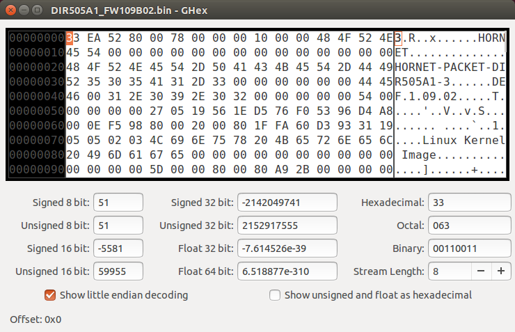
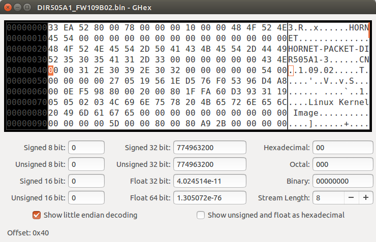
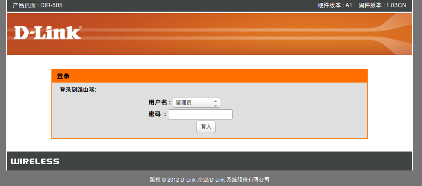
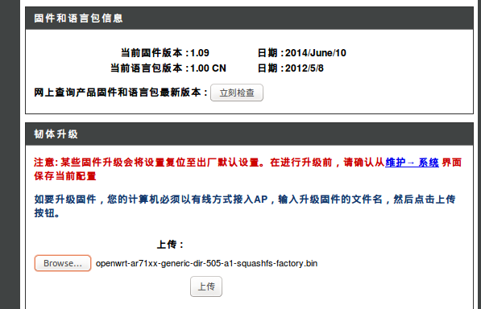
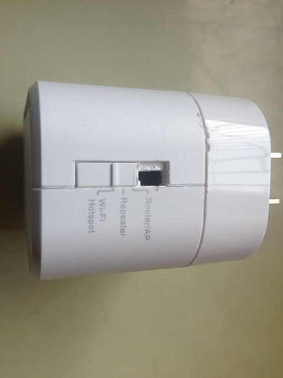

# 应用：D-Link DIR-505 刷 OpenWrt 翻墙教程

# D-Link DIR-505 路由器刷 OpenWrt 固件翻墙教程

前面的教程用结合 TP-LINK TL-WR2543N 来讲解翻墙原理与方法，并不是我特别推荐 TP-LINK TL-WR2543N，而是因为手头正好有这个路由器。毫无疑问，初学者使用教程同款路由器比较容易上手。但此型号趋向退市，价格也不便宜，网上有二手货，如果功能正常倒也可以考虑。

另外的选择，是使用 D-Link DIR-505 便携式路由器。配置高，价格便宜。

## D-Link DIR 505 硬件信息

```
Architecture:        MIPS 24Kc
Vendor:                Atheros
Bootloader:            UBoot 1.1.4
System-On-Chip:     SoC: Atheros AR9330 rev 1
CPU/Speed:            Atheros AR9330 400.000MHz
Flash-Chip:            NANYA NT5TU32M16DG-AC
Flash size:            8192 KiB
RAM:                64 MiB
Wireless:            802.11b/g/n
Ethernet:            10/100 full duplex
USB:                Yes 1 x 2.0 ar7240-ehci
Serial:                Yes - tested working over TTL converter (3.3V!)
JTAG:     Nope 
```

与之同价格档次的 TP-LINK TL-WR706N 150M 迷你型无线路由器， AR9331 SOC 2MB Flash/16MB RAM, 相比之下简直是垃圾。我花数百元购买的 TP-LINK TL-WR2543N，也不过是 8MB Flash, 64MB RAM 内存。

还有，D-Link DIR-505 自带不死恢复模式，调试 OpenWrt 系统出现问题时我们既可以进 D-Link 的恢复模式刷新固件，也可以进入 OpenWrt 的恢复模式刷新固件，可谓是最安全的路由器。

## 如何购买 D-Link DIR 505 A1

我不是 D-Link 的员工，也无意为其做广告。DIR-505 是我购买的第一款 D-Link 路由器。

我是 2014 年 8 月从淘宝 D-Link 官方旗舰店买的 D-Link DIR 505 A1，69 元, 固件版本号：1.03CN。买了后，看了下手机淘宝，只要 59 元。准备再入一个，都刷上 OpenWrt，方便随时随地无障碍上网。

* * *

#### 最简单的路由器刷 OpenWrt 固件翻墙教程:

[`github.com/softwaredownload/openwrt-fanqiang`](https://github.com/softwaredownload/openwrt-fanqiang "最简单的路由器刷 OpenWrt 固件翻墙教程")

#### 在线阅读 OpenWrt 翻墙路由器教程:

[`www.gitbook.com/book/softwaredownload/openwrt-fanqiang/details`](https://www.gitbook.com/book/softwaredownload/openwrt-fanqiang/details)

# 如何进入 DIR-505 恢复模式

# 如何进入 DIR-505 恢复模式

在学习 OpenWrt 可能要测试很多配置，有时会出现错误，需恢复或补救，这时就需要进入路由器的恢复模式。

有两种方法进入 DIR-505 的恢复模式。

## 进入 D-Link 恢复模式

把 DIR-505 和 计算机用网线连接起来，设置计算机网卡的 IPv4 地址为 192.168.0.12， 子网掩码 255.255.255.0， 在路由器启动时顶住 reset 孔，当红色指示灯开始缓慢闪烁时，松开 reset 孔。然后浏览器打开 192.168.0.1，这里你可以上传原厂固件或刷 OpenWrt 固件。

Plug in your computer to the unit, assign it an ip address of 192.168.0.12, and boot the unit up while holding down the reset. Once the red light starts to blink slowly, release the reset, and go to 192.168.0.1 on your web browser. From there you can upload a new image. After successful flashing, you'll see a "Success" page in your browser.

刷新固件完成后，重新改回自动获取 IP 地址。

## 进入 OpenWrt 恢复模式

用网线将路由器和电脑连接起来，将电脑网卡的 IPv4 地址设置成 192.168.1.23

路由器插上电源重新开机, 在启动时多次按压路由器侧面的圆形 WPS 按钮直到 LED 指示灯开始快速闪烁。

For the generic failsafe mode you can follow [`wiki.openwrt.org/doc/howto/generic.failsafe`](http://wiki.openwrt.org/doc/howto/generic.failsafe) You can use the WPS button for that. While booting up, just press it several times until the LED flashes very quick. If you're still not able to telnet it on 192.168.1.1 maybe there's something wrong on the client-side.

接下来就是 ubuntu 里 telnet 进入 OpenWrt 并设置 root 密码。

```
telnet 192.168.1.1 
```

telnet 连上后就设置 root 密码，自动启用 ssh:

```
root@OpenWrt:/# passwd
Changing password for root
New password:
Retype password:
Password for root changed by root
root@OpenWrt:/# 
```

这里，可以在 Ubuntu 里 Ctrl + Shift + t 新开一个命令行窗口，尝试 ssh 连接 OpenWrt:

```
ssh root@192.168.1.1 
```

如果 ssh 连上了，则后面设置的内容和 前面 TLWR-2543N 翻墙教程一样了。

要注意的是，D-Link DIR-505 使用接口名称 eth1 而不是通常的 eth0\.

Other than similar routers (e.g., the TP-Link TL-WR703N), the D-Link DIR-505 uses the interface eth1 rather than eth0\. This means that if you build your own firmware, you must configure /etc/config/network accordingly (option ifname 'eth1'), or you will not be able to connect later on via Ethernet.

如果 telnet 连不上，尝试一下直接 ssh 登录。

## 设置 D-Link DIR-505k 路由器无线连接

在没有设置无线连接前，要登录 OpenWrt，必须用网线把电脑和路由器连接起来，不太方便。设置无线连接后，电脑就可以通过无线方式连上路由器，再登录 DIR-505 OpenWrt 进行设置。

```
uci set wireless.@wifi-device[0].disabled=0;
uci set wireless.@wifi-iface[0].ssid='eastking-dir505';
uci set wireless.@wifi-iface[0].encryption='psk2+ccmp';
uci set wireless.@wifi-iface[0].key='icanfly9876';
uci commit wireless;
wifi 
```

设置好无线连接后，就可以拔掉电脑的有线连接，连接无线，再 ssh 登录路由器。

### 参考：

*   [`forum.openwrt.org/viewtopic.php?id=38742&p=8`](https://forum.openwrt.org/viewtopic.php?id=38742&p=8)
*   [`wiki.openwrt.org/toh/d-link/dir-505#debricking.`](http://wiki.openwrt.org/toh/d-link/dir-505#debricking.)
*   [`my.oschina.net/umu618/blog/271630`](http://my.oschina.net/umu618/blog/271630)

# DIR-505 刷 OpenWrt 固件过程

# D-Link DIR-505 A1 刷 OpenWrt 固件过程

D-Link 路由器是锁区的, 不能直接刷 OpenWrt 固件。要先到 D-Link 官方国际站下载原厂固件，用 16 进制编辑器把 DEF 改成 CN，升级固件，再刷 OpenWrt 固件。

## 下载 D-Link DIR-505 A1 国际版官方固件

下载地址：

*   [`support.dlink.com.au/download/download.aspx?product=DIR-505`](http://support.dlink.com.au/download/download.aspx?product=DIR-505)
*   ftp://files.dlink.com.au/products/DIR-505/REV_A/Firmware/

## 用 16 进制编辑器修改固件的国家代码，DEF 改成 CN

准备一个 16 进制编辑器，在本文中，我用的是 Ubuntu 下的轻量级 16 进制编辑器 GHex,把固件拖到 GHex 打开固件。



修改后变成如下：



Alt+S 保存对固件的修改。

你也可以到下面网址直接下载修改好 16 进制值的固件：

[`software-download.name/2014/dlink-dir-505-openwrt-fanqiang/`](https://software-download.name/2014/dlink-dir-505-openwrt-fanqiang/)

## 刷修改国家后的官方固件

按照路由器官方手册，电脑连上路由器。

在 Ubuntu 下电脑连接 DIR-505 路由器的方法： 　 DIR-505 路由器出厂默认设置没有开启 DHCP，所以我们要给电脑手动设置和路由器同网段的 IPv4 地址才能连上路由器。 路由器插上电源。右上角无线信号处，选择 Edit Connections, 选择 dlink-xxxx,xxxx 为路由器 MAC ID 的后 4 位，Edit..., IPv4 Setings, Method 选择 Manula 手动，Address 选择 Add, 设置 Address 为 192.168.0.2，Netmask 255.255.255.0, Gateway 192.168.0.1。如此设置好后电脑就能连上无线网络 dlink-xxxx 了。

浏览器首次进入 [`192.168.0.1`](http://192.168.0.1) 会出现设置向导，点取消，然后会出现密码登录页面：



直接点击 **登入** 按钮，再点击界面上部的 **维护**，然后点击左侧栏的 **固件** 进入升级固件页面，点击 **Browse...** 上传我们修改好的固件：


然后点击 **上传** 按钮完成刷新固件，接下来就可以刷 OpenWrt 固件了。

## DIR-505A1 刷 OpenWrt 固件

### 下载 OpenWrt 固件 for DIR-505A1

*   [`downloads.openwrt.org/snapshots/trunk/ar71xx/generic/`](http://downloads.openwrt.org/snapshots/trunk/ar71xx/generic/)
*   [`downloads.openwrt.org/snapshots/trunk/ar71xx/generic/openwrt-ar71xx-generic-dir-505-a1-squashfs-factory.bin`](http://downloads.openwrt.org/snapshots/trunk/ar71xx/generic/openwrt-ar71xx-generic-dir-505-a1-squashfs-factory.bin)

### DIR-505 刷 OpenWrt 固件

我们是在原厂固件上刷 OpenWrt,一定要下载 factory.bin.上传后，等待 150 秒，DIR-505A1 成功刷上了 OpenWrt 开源固件。



### 参考：

*   [`my.oschina.net/umu618/blog/268466`](http://my.oschina.net/umu618/blog/268466)

# DIR-505 启用工作模式开关

# D-Link DIR-505 启用工作模式开关

## DIR-505 硬件开启四种应用模式

D-Link DIR-505 在全球销售多款型号，不同型号外观不一样，但内部硬件是一样的。在中国销售的 DIR-505 A1, 也就是本教程所用的型号， 模式开关共有三档，在开关处动动手，就可以启用四种模式。

撕掉标贴，去掉螺丝，就可以打开 DIR-505,把开关剪短，剪掉挡住开关上推的底面，完工后如下图：



## Router 模式和 AP 模式

便携式式无线路由器常有 Router 模式和 AP 模式，有的路由器用两个档位对应这两种模式，拨到 Router 档就用 Router 模式，拨到 AP 档就用 AP 模式。DIR-505 原厂固件，Router 和 AP 共用一个档位，需要用哪种，需要登录路由器进行选择和设置。现在我们已经刷了 OpenWrt，档位对应的模式需要自己定义设置。

在本教程中，把新开的第四档作为 AP 档，原来的 Router/AP 档作为 Router 档。

在 Router 模式时，DIR-505 作为无线路由器使用，有线接口作为 WAN 口，连接到 ADSL Modem。计算机通过无线的方式连接到路由器。在这种模式下一般需要设置拨号上网帐号。

在 AP 模式时，通常在 DIR-505 前端还有路由器，DIR-505 的有线接口作为 LAN 口使用，前端路由器的 LAN 口引出网线连接到 DIR-505\. 在宾馆上网，把有线扩展为无线常应用此种模式。

## /etc/rc.local 利用　GPIO 读取开关位置

rc.local 内容如下：

```
# Put your custom commands here that should be executed once
# the system init finished. By default this file does nothing.

if [ ! -f /etc/config/backup/network ]; then
        cp /etc/config/network /etc/config/backup/
        cp /etc/config/wireless /etc/config/backup/
        cp /etc/config/firewall /etc/config/backup/
        cp /etc/config/dhcp /etc/config/backup/
fi

read_gpio() {
 (echo $1 > /sys/class/gpio/export) >& /dev/null
 (echo "in" > /sys/class/gpio/gpio$1/direction) >& /dev/null
 return `cat /sys/class/gpio/gpio$1/value`;
}
read_gpio 19;
v=$?;
read_gpio 20;
v=$v$?;
read_gpio 21;
v=$v$?;
read_gpio 22;
v=$v$?;
read_gpio 23;
v=$v$?;
case "$v" in
 10001) v="router";;
 11001) v="repeater";;
 01001) v="hotspot";;
 11000) v="ap";;
 *) v="error";;
esac

/usr/bin/$v

logger working mode: $v

exit 0 
```

原理：先备份原始的配置文件，不同模式的设置都是基于原始配置文件，以免出现混乱。

在/usr/bin 目录下创建相应模式的 bash 文件，根据不同的 GPIO 值调用的不同的文件。 在本教程中中主要应用 /usr/bin/router 和 /usr/bin/ap 这两个文件。

代码的最新版本，请查看:

*   [`github.com/softwaredownload/openwrt-fanqiang/tree/master/openwrt/dir505`](https://github.com/softwaredownload/openwrt-fanqiang/tree/master/openwrt/dir505)

你使用时，可以直接下载整个项目到本地，所有配置文件自然在其中:

```
git clone https://github.com/softwaredownload/openwrt-fanqiang 
```

### 参考：

*   [`my.oschina.net/umu618/blog/273945`](http://my.oschina.net/umu618/blog/273945)

# DIR-505 Router 模式翻墙教程

# DIR-505 Router 模式

## /usr/bin/router 代码：

```
#!/bin/sh

# Author: https://github.com/softwaredownload/openwrt-fanqiang
# Date: 2014-08-22

cp /etc/config/backup/* /etc/config/

uci delete network.lan.ifname
uci delete network.lan.type

uci add network interface
uci rename network.@interface[-1]='wan'
uci commit network

uci set network.wan.ifname='eth1'
uci set network.wan.peerdns=0
uci set network.wan.proto='pppoe'
uci set network.wan.username='wan-username'
uci set network.wan.password='wan-password'
uci set network.wan.peerdns=0

uci commit network

# default is no this option
#uci set dhcp.lan.ignore=0
#uci commit dhcp

uci set wireless.@wifi-device[0].channel=11
uci set wireless.@wifi-device[0].txpower=15
uci set wireless.@wifi-device[0].disabled=0
uci set wireless.@wifi-device[0].country='CN'
uci set wireless.@wifi-iface[0].mode='ap'
uci set wireless.@wifi-iface[0].ssid='eastking-dir505'
uci set wireless.@wifi-iface[0].encryption='psk2'
uci set wireless.@wifi-iface[0].key='icanfly9876'

uci commit wireless
wifi

/etc/init.d/network restart 
```

## 代码说明：

先把备份的原始配置文件覆盖到配置文件目录，所有设置都基于原始配置文件。 在使用 Router 模式时，有线接口为 WAN 口，这时 wan 的　interface name 是　eth1, 默认 lan 的 interface name 使用了 eth1, 要删除。

代码的最新版本，请查看:　

*   `github.com/softwaredownload/openwrt-fanqiang/tree/master/openwrt/dir505`

# DIR-505 AP 模式翻墙教程

# DIR-505 AP 模式翻墙教程

## /usr/bin/ap 代码：

```
#!/bin/sh

# Author: https://github.com/softwaredownload/openwrt-fanqiang
# Date: 2014-08-22

cp /etc/config/backup/* /etc/config/

uci set network.lan.gateway=192.168.1.1
uci set network.lan.dns=192.168.1.1
uci set network.lan.ipaddr=192.168.1.234

uci commit network

uci set dhcp.lan.ignore=1
uci commit dhcp

uci set wireless.@wifi-device[0].channel=11
uci set wireless.@wifi-device[0].txpower=15
uci set wireless.@wifi-device[0].disabled=0
uci set wireless.@wifi-device[0].country='CN'
uci set wireless.@wifi-iface[0].mode='ap'
uci set wireless.@wifi-iface[0].ssid='eastking-dir505'
uci set wireless.@wifi-iface[0].encryption='psk2'
uci set wireless.@wifi-iface[0].key='icanfly9876'

uci commit wireless
wifi

/etc/init.d/network restart 
```

## 代码说明：

在 AP 模式下，DIR-505 的有线接口作为 LAN 口使用，连接到前端路由器的 LAN 口。 假设 DIR-505 前端路由器的 IP 地址是 192.168.1.1，设置 DIR-505 的 lan 网关和 dns 都是 192.168.1.1，再设置 DIR-505 的 lan IP 地址为 192.168.1.234。

## DIR-505 穿越功夫网翻墙方法

### 假设上级路由器没有设置翻墙

电脑设置无线连接 eastking-dir505 的 IPv4 地址是 192.168.1.235（不同于路由器的地址），设置子网掩码为 255.255.255.0，网关和 DNS 为路由器的地址即 192.168.1.234，重启路由器后，电脑连上 eastking-dir505　即可自动翻墙

原理：以 DIR-505 作为 DNS 服务器，我们已经把 DIR-505 设置成翻墙路由器，自然可以打败功夫网了。

### 假设上级路由器已经翻墙

电脑设置无线连接 eastking-dir505 为 DHCP 即可。 原理：以上级路由器作为 DNS 服务器，上级路由器已经翻墙，二级路由器就可以免设置自动翻墙了。

如果你想节省路由器资源，这时就可以禁用 dir-505 dns 及翻墙相关服务：

```
/etc/init.d/dnsmasq stop
/etc/init.d/dnsmasq disable
/etc/init.d/shadowsocks stop
/etc/init.d/shadowsocks disable 
```

代码的最新版本，请查看:　

*   [`github.com/softwaredownload/openwrt-fanqiang/tree/master/openwrt/dir505`](https://github.com/softwaredownload/openwrt-fanqiang/tree/master/openwrt/dir505)

### 参考：

*   [`wiki.openwrt.org/doc/recipes/bridgedap`](http://wiki.openwrt.org/doc/recipes/bridgedap)

# DIR-505 编译 OpenWrt 全自动翻墙固件

# 编译 OpenWrt 全自动翻墙固件 for D-Link DIR-505 A1

除了增加模式转换开头，其他和编译　TP-LINK WR2543N 翻墙固件一样。

## 下载适合 D-Link DIR505 无线路由器的 Image Builder

Image Builder 又叫 Image Generator，利用它我们可以方便地定制适合自己无线路由器的固件。

### 选择 OpenWrt 版本：

```
* 进入　http://downloads.openwrt.org/
* Development Snapshots 最新开发版，我们的选择
* Binary Releases, 最后发行的稳定版本　
* 进入 http://downloads.openwrt.org/snapshots/trunk/ 
```

### 选择 CPU 类型：

```
* 选择 ar71xx: http://downloads.openwrt.org/snapshots/trunk/ar71xx/ 
```

### 选择 Flash 类型：

```
* 选择 generic: http://downloads.openwrt.org/snapshots/trunk/ar71xx/generic/ 
```

### 下载 Image Builder for DID-505 (Version: 23-Dec-2015 16:38)

```
* 页面搜索 dir-505 如果找到，说明我们找对了目录
* 下载 Image Builder:

cd ~/Downloads
wget http://downloads.openwrt.org/snapshots/trunk/ar71xx/generic/OpenWrt-ImageBuilder-ar71xx-generic.Linux-x86_64.tar.bz2
tar -xjf  OpenWrt-ImageBuilder-ar71xx-generic.Linux-x86_64.tar.bz2 
```

## 确定 OpenWrt 无线路由器的 PROFILE 值

```
cd OpenWrt-ImageBuilder-ar71xx-generic.Linux-x86_64
make info 
```

找到自己固件的型号，D-Link DIR 505 A1 的 PROFILE 值是 DIR505A1。如下图：


## 找出默认应该包含进 OpenWrt 固件的包

对于 D-Link DIR-505 A1 无线路由器来说，可以这样获取：

```
echo $(wget -qO - http://downloads.openwrt.org/snapshots/trunk/ar71xx/generic/config | sed -ne 's/^CONFIG_PACKAGE_\([a-z0-9-]*\)=y/\1/ip') 
```

2015-12-24 的基础包：

> base-files busybox dnsmasq dropbear firewall fstools jsonfilter libc libgcc mtd netifd opkg procd swconfig ubox ubus ubusd uci usign kmod-ledtrig-usbdev kmod-lib-crc-ccitt kmod-nls-base kmod-ip6tables kmod-ipt-conntrack kmod-ipt-core kmod-ipt-nat kmod-nf-conntrack kmod-nf-conntrack6 kmod-nf-ipt kmod-nf-ipt6 kmod-nf-nat kmod-ipv6 kmod-ppp kmod-pppoe kmod-pppox kmod-slhc kmod-gpio-button-hotplug kmod-usb-core kmod-usb-ohci kmod-usb2 kmod-ath kmod-ath9k kmod-ath9k-common kmod-cfg80211 kmod-mac80211 libip4tc libip6tc libxtables libblobmsg-json libexpat libiwinfo libjson-c libnl-tiny libubox libubus libuci ip6tables iptables hostapd-common iw odhcp6c odhcpd ppp ppp-mod-pppoe wpad-mini iwinfo jshn libjson-script uboot-envtools

2014-09-01 查询得到的基础包是：

> base-files busybox dnsmasq dropbear firewall fstools jsonfilter libc libgcc mtd netifd opkg procd swconfig ubox ubus ubusd uci kmod-crypto-aes kmod-crypto-arc4 kmod-crypto-core kmod-ledtrig-usbdev kmod-lib-crc-ccitt kmod-nls-base kmod-ip6tables kmod-ipt-conntrack kmod-ipt-core kmod-ipt-nat kmod-ipt-nathelper kmod-ipv6 kmod-ppp kmod-pppoe kmod-pppox kmod-slhc kmod-gpio-button-hotplug kmod-usb-core kmod-usb-ohci kmod-usb2 kmod-ath kmod-ath9k kmod-ath9k-common kmod-cfg80211 kmod-mac80211 libip4tc libip6tc libxtables libblobmsg-json libiwinfo libjson-c libnl-tiny libubox libubus libuci ip6tables iptables hostapd-common iw odhcp6c odhcpd ppp ppp-mod-pppoe wpad-mini iwinfo jshn libjson-script uboot-envtools

默认包要包含在 PACKAGES 命令行参数中，并再加上必要的包：

```
luci-ssl ipset wget shadowsocks-libev iptables-mod-nat-extra bind-dig 
```

注意，在编译前要把 shadowsocks-libev 及其他要用到的 .ipk 文件放到目录下：

```
~/Downloads/OpenWrt-ImageBuilder-ar71xx-generic.Linux-x86_64/packages/base/ 
```

如果你的 openWrt 版本是 ATTITUDE ADJUSTMENT，可能加上 iptables-mod-nat-extra 包，如果没安装的话 iptables 的端口转发会不支持。

## 按照教程 编译 shadowsocks-libev for OpenWrt ipk 安装包

## 下载和设定自定义翻墙配置文件

下面以 linux 系统 ~/Downloads 下操作为例。

```
cd ~/Downloads
git clone https://github.com/softwaredownload/openwrt-fanqiang 
```

本地项目文件夹是： ~/Downloads/openwrt-fanqiang

建立一个配置文件夹，以路由器型号结束，如 ~/Downloads/openwrt-dir505。

```
cd ~/Downloads
mkdir openwrt-dir505

cd openwrt-fanqiang
cp -R openwrt/default/* ~/Downloads/openwrt-dir505/
cp -R openwrt/dir505/* ~/Downloads/openwrt-dir505/ 
```

上面的操作，先复制共用的配置文件 openwrt/default/ *到 openwrt-dir505 目录下
然后复制 dir505 专用的配置文件到 openwrt/dir505/* 到 openwrt-dir505 目录下，如果有同名文件就覆盖。

## 设置可执行权限

```
cd ~/Downloads/openwrt-dir505
chmod +x usr/bin
chmod +x usr/bin/*
chmod +x etc/uci-defaults
chmod +x etc/uci-defaults/defaults 
```

说明：etc/uci-defaults 目录下的文件会在路由器第一次启动时执行一次。在这里我们设置一些常用值。

## 必须修改的 DIR505 翻墙配置文件：

*   ~/Downloads/openwrt-dir505/etc/shadowsocks.json
    *   server 改成你的服务器实际 IP
*   ~/Downloads/openwrt-dir505/usr/bin/router
    *   wan-username 和 wan-password 改成实际值
*   ~/Downloads/openwrt-dir505/usr/bin/shadowsocks-firewall
    *   1.0.9.8 必须改成你的服务器实际 IP

## 自动复制和修改 DIR-505 翻墙设置文件

### config-dir505.sh:

```
#!/bin/bash

# Author: https://github.com/softwaredownload/openwrt-fanqiang
# Date:   2015-12-24

REPOSITORY=~/Downloads/openwrt-fanqiang
CONFIG=~/Downloads/openwrt-dir505

createdir() {
    rm -rf $CONFIG
    mkdir $CONFIG
}

copy() {
    cp -R $REPOSITORY/openwrt/default/* $CONFIG/
    cp -R $REPOSITORY/openwrt/dir505/* $CONFIG/
}

setmod() {
    chmod +x $CONFIG/usr/bin/shadowsocks-firewall
    chmod +x $CONFIG/etc/uci-defaults
    chmod +x $CONFIG/etc/uci-defaults/*
}

modify() {
    # server ip address
    sed -i 's/1.0.9.8/server_ip/' $CONFIG/etc/shadowsocks.json

    # server_port
    sed -i 's/1098/server_port/' $CONFIG/etc/shadowsocks.json

    # local_port
    sed -i 's/7654/7654/' $CONFIG/etc/shadowsocks.json

    # password
    sed -i 's/killgfw/killgfw/' $CONFIG/etc/shadowsocks.json

    # method
    sed -i 's/aes-256-cfb/aes-256-cfb/' $CONFIG/etc/shadowsocks.json

    # server ip addresss
    sed -i 's/1.0.9.8/server_ip/' $CONFIG/usr/bin/shadowsocks-firewall

    # local_port
    sed -i 's/7654/7654/' $CONFIG/usr/bin/shadowsocks-firewall

    # ppoe username
    sed -i 's/wan-username/wan-username/' $CONFIG/usr/bin/router

    # ppoe password
    sed -i 's/wan-password/wan-password/' $CONFIG/usr/bin/router

    # wifi password
    sed -i 's/icanfly9876/icanfly9876/g' $CONFIG/usr/bin/ap
    sed -i 's/icanfly9876/icanfly9876/g' $CONFIG/usr/bin/router

    # root password
    sed -i 's/\\nfanqiang/\\nfanqiang/' $CONFIG/etc/uci-defaults/defaults
}

if [ "$1" = "createdir" ]; then
    createdir
elif [ "$1" = "copy" ]; then
    copy
elif [ "$1" = "setmod" ]; then
    setmod
elif [ "$1" = "modify" ]; then
    modify
else
    echo "usage: createdir copy setmod modify"
fi 
```

用法：在 config-dir505.sh 所在目录运行：

```
./config-dir505.sh createdir
./config-dir505.sh copy
./config-dir505.sh setmod
./config-dir505.sh modify 
```

## 开始编译 OpenWrt 自动翻墙固件

```
cd ~/Downloads/OpenWrt-ImageBuilder-ar71xx-generic.Linux-x86_64
make image PROFILE=DIR505A1 PACKAGES="base-files busybox dnsmasq dropbear firewall fstools jsonfilter libc libgcc mtd netifd opkg procd swconfig ubox ubus ubusd uci usign kmod-ledtrig-usbdev kmod-lib-crc-ccitt kmod-nls-base kmod-ip6tables kmod-ipt-conntrack kmod-ipt-core kmod-ipt-nat kmod-nf-conntrack kmod-nf-conntrack6 kmod-nf-ipt kmod-nf-ipt6 kmod-nf-nat kmod-ipv6 kmod-ppp kmod-pppoe kmod-pppox kmod-slhc kmod-gpio-button-hotplug kmod-usb-core kmod-usb-ohci kmod-usb2 kmod-ath kmod-ath9k kmod-ath9k-common kmod-cfg80211 kmod-mac80211 libip4tc libip6tc libxtables libblobmsg-json libexpat libiwinfo libjson-c libnl-tiny libubox libubus libuci ip6tables iptables hostapd-common iw odhcp6c odhcpd ppp ppp-mod-pppoe wpad-mini iwinfo jshn libjson-script uboot-envtools luci-ssl ipset wget shadowsocks-libev iptables-mod-nat-extra bind-dig" FILES=~/Downloads/openwrt-dir505 
```

报告错误：

> opkg_install_cmd: Cannot install package kmod-ipv6

移除 kmod-ipv6 再次编译，成功。

查看编译好的固件:

```
cd ~/Downloads/OpenWrt-ImageBuilder-ar71xx-generic.Linux-x86_64/bin/ar71xx/
ls -lh *505*.bin
... 7.6M Dec 24 15:20 openwrt-ar71xx-generic-dir-505-a1-squashfs-factory.bin
... 5.4M Dec 24 15:20 openwrt-ar71xx-generic-dir-505-a1-squashfs-sysupgrade.bin 
```

升级固件要用到的是　openwrt-ar71xx-generic-dir-505-a1-squashfs-sysupgrade.bin，如果在原厂固件上刷要用 openwrt-ar71xx-generic-dir-505-a1-squashfs-factory.bin

先本地修改好配置文件再编译，然后把翻墙固件刷进 D-Link DIR-505 A1 后，就能零设置智能、自动翻墙。

只要配置文件设置不出差错，编译固件一般都能成功，保存好这个固件，以后随便折腾路由器，出现问题大不了重刷一次，几分钟时间就一切都恢复正常。

#### 参考：

*   [`wiki.openwrt.org/doc/howto/obtain.firmware.generate`](http://wiki.openwrt.org/doc/howto/obtain.firmware.generate)

# DIR-505 刷预编译 OpenWrt 翻墙固件

# D-Link DIR-505 A1 刷通用 OpenWrt

照前面的教程自己编译翻墙固件，编译出来后刷进路由器，就能实现零设置自动翻墙。出于各种原因，有的朋友可能不想自己编译固件，又想用 DIR-505 实现智能翻墙，就要下载预编译的通用翻墙固件，刷好后，登录路由器，用 vi 修改少数几个设置，就能实现智能翻墙，本教程就是针对这些朋友而写。

路由器的开关拨到刻有 Router/AP　字样的档位，如果你没有给路由器动过手术，就是从上往下数的第一档。

## DIR-505 原厂固件刷翻墙固件的方法

适合购买了 D-Link DIR-505 A1 后没有刷过任何固件的朋友。

### 刷修改了 16 进制值的原厂固件

到下面地址下载已经修改了 16 进制值的原厂固件:

[`software-download.name/2014/dlink-dir-505-openwrt-fanqiang/`](https://software-download.name/2014/dlink-dir-505-openwrt-fanqiang/)

照官方手册说明网页登录路由器，刷新固件

### 刷 DIR-505 的翻墙固件 factory.bin

到下面地址下载用于 DIR-505 的翻墙固件:

[`software-download.name/2014/dlink-dir-505-openwrt-fanqiang/`](https://software-download.name/2014/dlink-dir-505-openwrt-fanqiang/)

下载　openwrt-ar71xx-generic-dir-505-a1-squashfs-factory.bin

按照官方手册的说明刷新固件。

## OpenWrt 固件基础上升级到翻墙固件

注意，下面步骤适合于你已经在你的 DIR-505 上刷了 OpenWrt 固件,你想要升级到可以自己翻墙的 openwrt 固件。

### 下载翻墙固件　sysupgrade.bin

到下面地址下载用于 DIR-505 的翻墙固件 openwrt-ar71xx-generic-dir-505-a1-squashfs-sysupgrade.bin:

[`software-download.name/2014/dlink-dir-505-openwrt-fanqiang/`](https://software-download.name/2014/dlink-dir-505-openwrt-fanqiang/)

### 命令行上传固件到路由器

电脑通过网线或无线连接到路由器，然后:：

```
cd ~/Downloads/OpenWrt-ImageBuilder-ar71xx-nand.Linux-x86_64/bin/ar71xx/
scp openwrt-ar71xx-generic-dir-505-a1-squashfs-sysupgrade.bin root@192.168.1.1:/tmp/ 
```

### ssh 登录 OpenWrt 路由器

```
ssh root@192.168.1.1
cd /tmp 
```

### sysupgrade 升级固件并取消保留原来配置文件

```
root@OpenWrt:/tmp# sysupgrade -n openwrt-ar71xx-generic-dir-505-a1-squashfs-sysupgrade.bin 
```

参数 `-n` 表示升级时不保留原来的配置文件。

等待两分钟等刷新固件并重启完成。

# 登录并设置 DIR-505 OpenWrt 翻墙固件

# 登录并设置 DIR-505 OpenWrt 翻墙固件

ADSL Modem 网线连接到路由器的有线接口。路由器的开关拨到刻有 Router/AP　字样的档位，如果你没有给路由器动过手术，就是从上往下数的第一档。本文以 router 模式为例，如果你的应用场景是 ap 模式，请自行相应变通。

## 电脑连接 DIR-505 路由器

电脑连接到无线 网络 **eastking-dir505**

无线密码:

```
2014-09-01 版： wsjdw,8181 
新版都是： icanfly9876 
```

## ssh 登录 OpenWrt 翻墙固件

```
ssh root@192.168.1.1 
```

输入密码 `fanqiang` 登录 ssh

有时会提示错误：

```
@@@@@@@@@@@@@@@@@@@@@@@@@@@@@@@@@@@@@@@@@@@@@@@@@@@@@@@@@@@
@    WARNING: REMOTE HOST IDENTIFICATION HAS CHANGED!     @
@@@@@@@@@@@@@@@@@@@@@@@@@@@@@@@@@@@@@@@@@@@@@@@@@@@@@@@@@@@
IT IS POSSIBLE THAT SOMEONE IS DOING SOMETHING NASTY!
Someone could be eavesdropping on you right now (man-in-the-middle attack)!
It is also possible that a host key has just been changed.
The fingerprint for the RSA key sent by the remote host is
cf:c5:12:34:56:0b:4d:1c:56:48:6a:87:04:cf:b8:83.
Please contact your system administrator.
Add correct host key in /home/openwrt-fanqiang/.ssh/known_hosts to get rid of this message.
Offending RSA key in /home/openwrt-fanqiang/.ssh/known_hosts:3
  remove with: ssh-keygen -f "/home/openwrt-fanqiang/.ssh/known_hosts" -R 192.168.1.1
RSA host key for 192.168.1.1 has changed and you have requested strict checking.
Host key verification failed. 
```

解决办法就是复制并运行提示中的清理命令：

```
ssh-keygen -f "/home/openwrt-fanqiang/.ssh/known_hosts" -R 192.168.1.1 
```

然后就可以正常登录了。

## 登录后用 vi 修改设置：

```
root@OpenWrt:~#　vi /etc/shadowsocks.json 
root@OpenWrt:~#　vi /usr/bin/router
root@OpenWrt:~#　vi /usr/bin/ap     #如果是 ap 模式
root@OpenWrt:~#　vi /usr/bin/shadowsocks-firewall 
```

分别修改以下值：

*   shadowsocks.json 中，server 改成你的服务器实际 IP
*   router/ap 中　wan-username 和 wan-password 改成实际值
*   shadowsocks-firewall 中，1.0.9.8 必须改成你的服务器实际 IP

如果你还改了其他默认值，请自行修改相应文件。不建议修改其他默认值，以提高一次成功率。熟悉以后，建议修改 shadowsock 密码。

## 执行以下命令使修改生效

```
root@OpenWrt:~# /etc/init.d/shadowsocks restart
root@OpenWrt:~# /etc/init.d/dnsmasq restart
root@OpenWrt:~# /etc/init.d/network restart

# 查看 dnsmasq ss-redir ss-tunnel 是否在运行。翻墙出出现故障的时候也要查看：
ps 
```

2015-12-24 测试 router 模式， 修改配置文件，编译出固件，刷进路由器，然后不用再修改任何设置就可以翻墙。

等待约两分钟，就可以测试是否可以在网上畅行无阻了。