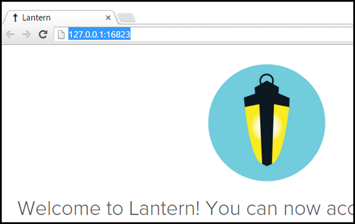
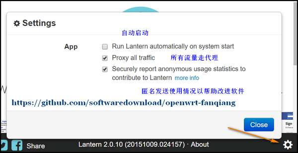
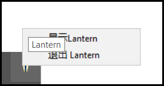
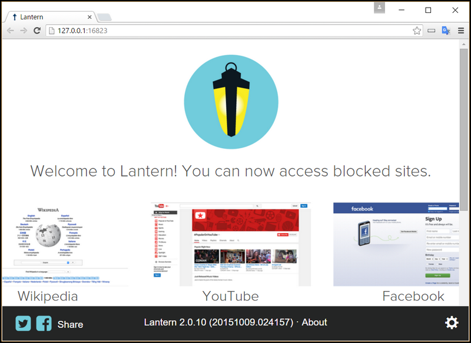
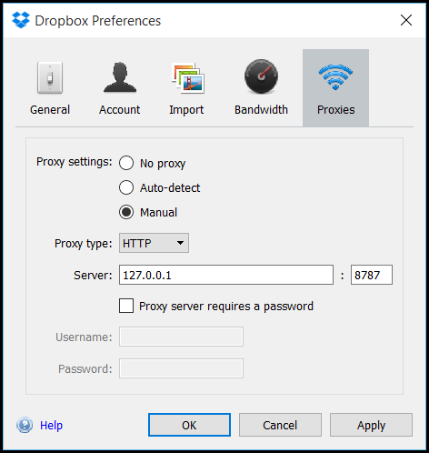
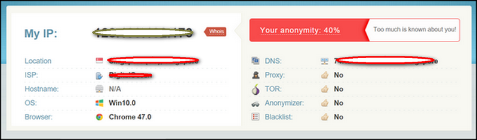
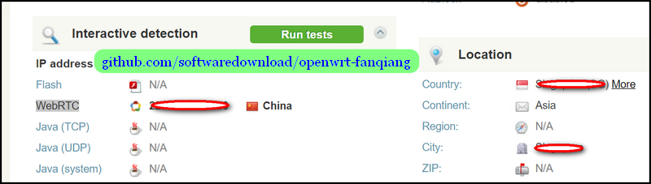
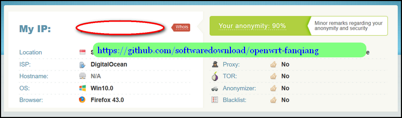
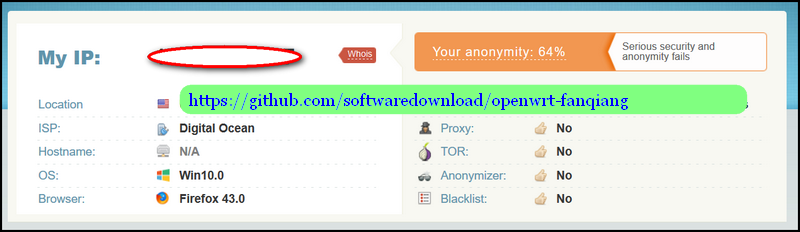
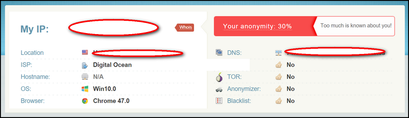

# 其他翻墙软件使用教程

# 其他翻墙软件、方案教程

本教程主要内容是 路由器刷 OpenWrt，安装 shadowsocks 翻墙。有时也要用一下其他翻墙软件。

* * *

#### 最简单的路由器刷 OpenWrt 固件翻墙教程:

[`github.com/softwaredownload/openwrt-fanqiang`](https://github.com/softwaredownload/openwrt-fanqiang "最简单的路由器刷 OpenWrt 固件翻墙教程")

#### 在线阅读 OpenWrt 翻墙路由器教程:

[`www.gitbook.com/book/softwaredownload/openwrt-fanqiang/details`](https://www.gitbook.com/book/softwaredownload/openwrt-fanqiang/details)

# 利用 lantern 蓝灯实现浏览器自动翻墙

# 利用 lantern 蓝灯实现浏览器自动翻墙教程

蓝灯运用了多种技术，通过自有服务器或者运行 lantern 的用户转发流量实现浏览器全自动翻墙。

## latern 蓝灯和 OpenWrt shadowsocks 翻墙的区别

*   蓝灯主要是浏览器自动翻墙
*   [路由器 OpenWrt shadowsocks 翻墙方案](https://github.com/softwaredownload/openwrt-fanqiang) 是所有接入的设备都自动翻墙,可定制性更高

## 为什么选择 lantern 蓝灯翻墙

有很多的翻墙软件，有闭源的，也有开源的，我们优先选择开源软件。闭源软件缺少外界监督，不能保证没有问题。

蓝灯就是优秀的开源翻墙软件。今天是 2016-01-10，在 Github 上已经 6516 Star, 2228 Fork，开发很活跃。

## 下载 lantern 蓝灯翻墙软件

Github 下载：
[`github.com/getlantern/lantern`](https://github.com/getlantern/lantern)

主页下载:
[`getlantern.org/`](https://getlantern.org/)

## 蓝灯翻墙软件安装和设置

*   停止路由器的 shadowsocks 翻墙
    登录 OpenWrt 路由器，运行命令:

    ```
     /etc/init.d/shadowsocks stop 
    ```

    如果你是按照　[`github.com/softwaredownload/openwrt-fanqiang`](https://github.com/softwaredownload/openwrt-fanqiang) 设置的翻墙，那么还得检查一下 [/etc/init.d/shadowsocks](https://github.com/softwaredownload/openwrt-fanqiang/blob/master/openwrt/default/etc/init.d/shadowsocks) 里的 start, stop 函数是否正确。2016-01-10 前这两个函数有 bug，导致执行 stop 后上网不正常。

*   打开 [Chrome 浏览器](https://www.google.com/chrome/browser/desktop/)

*   安装或运行 lantern 蓝灯，会自动在 Chrome 里打开新的页面，地址栏显示了翻墙转发的地址和端口，比如 `http://127.0.0.1:16823/`
    

*   点击打开页面的右下角的齿轮图标设置 lantern 翻墙配置:
    

*   右键点击电脑右下角托盘图标退出 lantern(Windows 为例)
    

如果一切正常，一运行蓝灯，就可以点击蓝灯新打开的页面上的 YouTube 图标看视频了，非常方便。



## 配置网络软件走 Lantern 翻墙代理:

蓝灯默认会在 127.0.0.1 上开启一个 HTTP 代理,端口号是 8787
在网络软件的代理界面上设置 HTTP 代理:

```
地址: 127.0.0.1 
端口号: 8787 
```

（注：“127.0.0.1”表示“本机地址”）

于是，开启 Lantern, Dropbox 就可以正常使用了：


## lantern 蓝灯翻墙软件配置文件研究

进入 lantern 蓝灯翻墙软件安装目录：

### Windows 下进入 lantern 安装目录

按 Windows 键，输入
%appdata%

然后就可以进入 Lantern 安装目录。

### Mac 下进入 lantern 安装目录

```
/Users/name/Library/Application Support/Lantern 
```

### 配置文件：Lantern/lantern-2.0.10.yaml

2.0.10 是版本号，随不同版本而变化。

log 文件，可以了解翻墙详细过程：

```
Lantern/logs/lantern.log  

...  
geolookup.go:161 Successfully looked up IP '1.0.9.8' and country 'CN'  
... 
```

### Lantern 配置文件中的流量转发服务器 IP 地址

Lantern/lantern-2.0.10.yaml 中找到类似如下内容，替换成其他服务器，把文件设为只读，就可以更换服务器：

```
fallback-1.0.9.8:
  addr: 1.0.9.8:443
  pipelined: false
  cert: "-----BEGIN CERTIFICATE-----\n...\n-----END
    CERTIFICATE-----\n"
  authtoken: B... https://github.com/softwaredownload/openwrt-fanqiang ...C 
```

### Ubuntu 下自己编译 lantern 翻墙软件

先准备好 Go 语言开发环境，假设 Go 程序的源码在 `~/golib/src` 目录下。

```
sudo apt-get update
sudo apt-get install -y git curl libappindicator3-dev build-essential libgtk-3-dev

＃ Use the Go compiler to build the lantern binary
cd ~/golib/src
git clone https://github.com/getlantern/lantern.git

cd lantern
source setenv.bash
go build -o lantern github.com/getlantern/flashlight

＃ Use curl to test that the proxy is working fine:
curl -x 127.0.0.1:8787 https://www.google.com/humans.txt

＃ This line will run Lantern without opening the browser window:
./lantern -headless 
```

### Reference:

*   [`github.com/getlantern/lantern`](https://github.com/getlantern/lantern)
*   [`getlantern.org`](https://getlantern.org)
*   [`github.com/getlantern/lantern/blob/393657edd298268b66ad0bf3184ad7b6f21da5c0/README.md`](https://github.com/getlantern/lantern/blob/393657edd298268b66ad0bf3184ad7b6f21da5c0/README.md)

# 加强翻墙上网的匿名性

# 怎样加强上网的匿名性

即使翻墙上网了，真实的上网信息，如本机 IP 地址，系统语言,系统时区等等还是可能暴露。

## 怎样检查翻墙后浏览器上网的匿名性

访问下面网站检查自己的匿名程度：

### [`whoer.net/#extended`](https://whoer.net/#extended)

## 蓝灯翻墙，浏览器匿名程度测试

下图，蓝灯翻墙，Chrome 浏览器，匿名程度 40%，很差:


再拉下去看，WebRTC 暴露了本机 IP 地址：


下图，蓝灯翻墙，FireFox 浏览器，开启隐私设置后 WeRTC 已经关闭，匿名程度高达 90%：


## 路由器刷 OpenWrt，安装 shadowsocks-libev 翻墙，浏览器匿名程度测试

下图，FireFox 浏览器，同样设置，WeRTC 已经关闭，匿名程度 64%：


Chrome 浏览器，匿名程度只有 30%了：


## 防止浏览器 WebRTC 泄露本机 IP 地址:

### Chrome 浏览器安装插件就可以了： WebRTC Leak Prevent

安装以后，路由器刷 OpenWrt，安装 shadowsocks-libev 翻墙，Chrome 浏览器的匿名程度提升到了 64%

### FireFox 浏览器关闭 WebRTC

地址栏输入： `about config`
搜索：`media.peerconnection.enabled` 双击由 true 改为 false，就可以彻底匿名了！

### Opera 浏览器安装插件：WebRTC Leak Prevent

#### 什么是 WebRTC What is WebRTC:

WebRTC，名称源自网页实时通信（Web Real-Time Communication）的缩写，是一个支持网页浏览器进行实时语音对话或视频对话的技术，是谷歌 2010 年以 6820 万美元收购 Global IP Solutions 公司而获得的一项技术。

WebRTC 实现了基于网页的视频会议，标准是 WHATWG 协议，目的是通过浏览器提供简单的 javascript 就可以达到实时通讯（Real-Time Communications (RTC)）能力。

WebRTC（Web Real-Time Communication）项目的最终目的主要是让 Web 开发者能够基于浏览器（Chrome\FireFox...）轻易快捷开发出丰富的实时多媒体应用，而无需下载安装任何插件，Web 开发者也无需关注多媒体的数字信号处理过程，只需编写简单的 Javascript 程序即可实现，W3C 等组织正在制定 Javascript 标准 API，目前是 WebRTC 1.0 版本，Draft 状态；另外 WebRTC 还希望能够建立一个多互联网浏览器间健壮的实时通信的平台，形成开发者与浏览器厂商良好的生态环境。同时，Google 也希望和致力于让 WebRTC 的技术成为 HTML5 标准之一，可见 Google 布局之深远。[1] WebRTC 提供了视频会议的核心技术，包括音视频的采集、编解码、网络传输、显示等功能，并且还支持跨平台：windows，linux，mac，android。