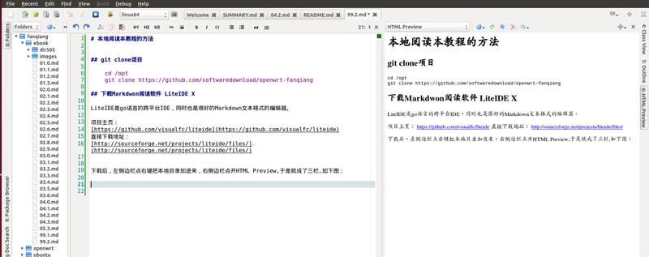

# 附录

# 附录

翻墙常用资源及如何贡献本项目

* * *

#### 最简单的路由器刷 OpenWrt 固件翻墙教程:

[`github.com/softwaredownload/openwrt-fanqiang`](https://github.com/softwaredownload/openwrt-fanqiang "最简单的路由器刷 OpenWrt 固件翻墙教程")

#### 在线阅读 OpenWrt 翻墙路由器教程:

[`www.gitbook.com/book/softwaredownload/openwrt-fanqiang/details`](https://www.gitbook.com/book/softwaredownload/openwrt-fanqiang/details)

# 翻墙软件、教程汇总

# 翻墙教程资源汇总

## 翻墙软件

*   [Shadowsocks Download](http://shadowsocks.org)
*   [Shadowsocks libev](https://github.com/shadowsocks/shadowsocks-libev)
*   [Lantern 浏览器自动翻墙](https://github.com/getlantern/lantern)
*   [Gohop - VPN in GO lang](https://github.com/bigeagle/gohop)
*   [Obfuscated OpenSSH Patch by zinglau](https://github.com/zinglau/obfuscated-openssh-patches)
*   [Obfuscated OpenSSH by aligo](https://github.com/aligo/obfuscated-openssh)
*   [Obfuscated OpenSSH by brl](https://github.com/brl/obfuscated-openssh)
*   [V2Ray 模块化的代理软件包](https://github.com/v2ray/v2ray-core)
*   [Socks5_c 轻量级的 socks5 代理](https://github.com/hmgle/socks5_c)
*   [MProxy 最小的 http 代理](https://github.com/examplecode/mproxy)
*   [GoProxy go 写的隧道代理服务器](https://github.com/shell909090/goproxy)
*   [XX-Net 接力 GoAgent](https://github.com/XX-net/XX-Net)

## 翻墙方案

*   [打造 OpenWrt 智能自动透明翻墙路由器](https://github.com/softwaredownload/openwrt-fanqiang)
*   [FreeRouter_V2](https://github.com/lifetyper/FreeRouter_V2)
*   [Autovpn for OpenWrt](https://code.google.com/p/autovpn-for-openwrt/)
*   [Proxy for GFW](https://github.com/jiyanmoyu/proxy_for_gfw)
*   [fqrouter, Android as router](https://github.com/fqrouter/fqrouter)
*   [openwrt GFW](https://github.com/hackgfw/openwrt-gfw)
*   [dnsforwarder](https://github.com/holmium/dnsforwarder)
*   [Autddvpn beta](https://code.google.com/p/autoddvpn-beta/)

## 翻墙辅助

*   [dnsmasq China List](https://github.com/felixonmars/dnsmasq-china-list)

## 翻墙教程

*   [FreeRouter V2 完全手册 PDF 下载](https://github.com/lifetyper/FreeRouter_V2/raw/master/FreeRouterV2_HandBook.pdf)
*   [在华为 HG255D OpenWrt 上安装和配置 Shadowsocks 并实现智能流量转发](http://www.shuyz.com/install-shadowsocks-on-hg255d-openwrt-and-config-nat.html)
*   用 PDNSD + Google DNS 获得高速正确的 dns 解析
*   [基于 OpenWRT 的自动翻墙路由器](http://samsonly.us/?p=85)
*   [Tunlr-style DNS unblocking](http://trick77.com/2014/03/01/tunlr-style-dns-unblocking-pandora-netflix-hulu-et-al/)
*   [DNS unblocking using Dnsmasq and HAProxy](http://trick77.com/2014/03/02/dns-unblocking-using-dnsmasq-haproxy/)

## OpenWrt 教程

*   [跟 hoowa 学做智能路由](http://www.leiphone.com/author/hoowa)
*   [跟 UMU 一起玩 OpenWRT](http://my.oschina.net/umu618/blog?catalog=269802)

# 本机阅读本教程的方法

# 本地阅读本教程的方法

## git clone 项目

```
cd ~/Downloads
git clone https://github.com/softwaredownload/openwrt-fanqiang 
```

## 下载 Markdwon 阅读软件 LiteIDE X

LiteIDE 是 go 语言的跨平台 IDE，同时也是很好的 Markdown 文本格式的编辑器。

*   项目主页： [`github.com/visualfc/liteide`](https://github.com/visualfc/liteide)
*   直接下载地址： [`sourceforge.net/projects/liteide/files/`](http://sourceforge.net/projects/liteide/files/)

下载后，左侧边栏点右键把本地目录加进来，Alt+4 快捷键打开 HTML Preview，Ubuntu 中下如下图：



你是个有爱心的人，阅读了本教程，想要回馈这个开源项目，在阅读时顺便修改一些错字，加进补充内容，增加一章你的路由器应用本教程翻墙的过程等等，然后提交　pull request.

# 知识若不分享，实在没有意义

# 知识若不分享，实在没有意义

## 这个世界为什么圣人这么少？

人类历史上存在过无数人，他们都不见了，他们都到哪里去了，他们曾有过什么样的故事，可曾有人在想起他们的笑容？通过历史书，我们知道了历史上存在过的一些人物的名字，其中少数人，为人类的发展作出了特别的贡献，我们可以称他们为圣人，这样的人，一只手就数得过来。

历史上存在过的人这么多，为什么圣人却这么少？

我认为，这是因为，普通人的一生，主要是在思考怎么得到更多，而较少想到去付出。得到越多越好，付出越少越好，这就是普通人。

圣人是怎么样的，是不是只想着付出，不计收获？不是的，我认为圣人是付出得到比较均衡的人。只付出而不得到，自己就很快会陷入困境，就没有能力去帮助更多人。圣人得到什么，就会想着怎么样去回馈外界，回馈社会，在回馈过程中自己得到快速成长，从而有更大的能力去回馈更多，圣人于是逐渐长成。

我这么说，并不是希望谁成为圣人。圣人并不知道自己是圣人，也不会去想这个事情。有一个信念，就要去实行，生命的意义就在于点滴的行动，能做多少就做多少，当生命之花最终凋落时，我们得到的都将失去，我们付出的也许还会存在于这个世界很长的时间。

## 我为什么写这个教程

生在天朝，上网各种不方便，很是苦恼，什么 OpenWrt，没有听说过，不知道哇。上网查相关论坛，非注册用户附件下载隐藏，图片隐藏，各种限制。也有一些教程散布在网上，需要自己整合。终于，花了 N 个白天，给家里的路由器翻墙了。我是个习惯于换位思考的人，想想自己花了很多时间查各种资料，何不花时间整合各种资源并加上自己的心得，写成系列教程，公布在网上？

于是，又是 N 个白天（N > 10)，学习 Git, GitHub, GitBook, Ubuntu, Markdown, OpenWrt，各种调试、编译。经常一天的绝大部分时间在写这个教程。钱可以少赚些，当下够用就行，这个教程还得认真写，没有想过要得到什么，只是觉得白发已生，人生不能虚度，给这个世界留下一些自己的印记也总是好的。虽然不对别人说，但也未尝不可在人少时偷偷笑一声，并对自己说：我这样的好人，在这个世界上可是不多呢，哈哈。

## 为什么以开源方式发布在 GitHub

为什么不写在博客上呢？如果写在博客上，就要自己维护博客，一直维护下去总是个麻烦事。GitHub 总比自己维护的博客稳定，或者说能存在更长时间。即使 GitHub 倒闭，也就一个 git 命令就可以托管到其他网站，何况 GitHub 至少现在看来是来日方长呢。

开源方式发布，更是希望阅读本教程翻墙成功的朋友，如果你的路由器型号不被本教程覆盖，就写下自己的翻墙实践过程，提交到本项目中，以帮助相关朋友。我在教程中以 D-Link DIR-505 为范例，演示了如何参与到本项目中来，将在下一节详述。

# 如何贡献本项目

# 如何贡献本项目

虽然说原理是通用的，本教程内容可以应用到绝大多数路由器中去。然而，高手毕竟少数，多数有翻墙需求的人可能都没有用过 Linux 系统，没有听说过 OpenWrt，针对他们，最好是一种路由器类型（型号）一个教程。并且最好提供预编译的固件，刷上这个预编译的固件后，修改极少的参数就可以自动翻墙。

在你应用本教程原理翻墙的过程中，把详细应用过程一步步写下来，并贡献到本项目中，以帮助更多的人。

假如你的路由器是 netgear wndr3800

## 如何通过 Github 贡献本项目：

先阅读 Github [贡献向导](https://github.com/manastech/crystal/blob/master/Contributing.md),然后：

*   Fork 本项目 ( [`github.com/softwaredownload/openwrt-fanqiang/fork`](https://github.com/softwaredownload/openwrt-fanqiang/fork) )
*   创建你的分支 (git checkout -b my-new-feature)
*   提交你的改进 (git commit -am 'Add some feature')
*   Push 到你的分支 (git push origin my-new-feature)
*   到 github.com 创建 Pull Request

## 如何为新的路由器创建翻墙教程：

```
cd openwrt-fanqiang
mkdir -p ebook/wndr3800/images
mkdir openwrt/wndr3800 
```

在 ebook 目录下创建以路由器型号为名的目录，以 wndr3800 为例，教程在 ebook/wndr3800 目录下，图片在 wndr3800/images 在目录下。

wndr3800 专用的配置文件在 openwrt/wndr3800 下，注意，openwrt/default 目录已经有的配置文件可以省略。

路径、文件名都小写，因 Windows 系统是大小写不敏感的。

在你的教程中最好提供预编译固件的稳定下载地址。如果你没有稳定的下载空间，可以提交一个 issue,附上临时下载地址，我会上传到稳定下载地址，然后你可以修改教程加上稳定下载地址。注意教程目录下不要直接包含固件文件，大的二进制文件不需要用 git 跟踪。

你可以用 LiteIDE 写教程。

修改目录文件，　openwrt/SUMMARY.md，把你的教程作为新的一章，放在最后一章之前。

如果你的路由器型号与教程中的相同或类似，你也可以参与到本项目中来，你可以修正错误，补充不详细的地方，文字润色，提出建议等。