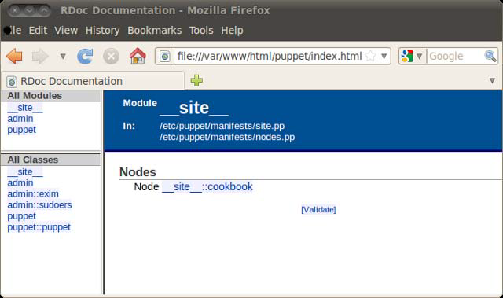
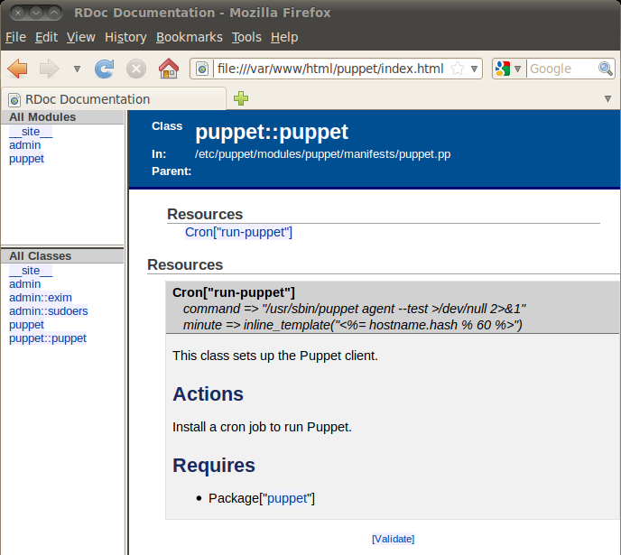
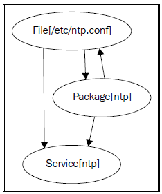

# 监控、报告和排错

## 监控、报告和排错

> Found problem more than one. However, this does not mean that relevant part is thing by mistake. Could be fertilized by special purpose in other application program.
> 
> — Error message

在本章中，我们将学习如下内容：

*   生成报告

*   通过 Email 发送包含特定标签的日志信息

*   创建图形化报告

*   自动生成 HTML 文档

*   绘制依赖关系图

*   测试你的 Puppet 配置清单

*   执行模拟运行

*   检测编译错误

*   理解 Puppet 的错误信息

*   显示命令的输出结果

*   输出调试信息

*   检查配置设置

*   使用标签

*   使用运行阶段

*   使用不同的环境

大家都有这样的经验：当看到一些新技术时会莫名的兴奋，急着赶回家进行实验。 当然，一旦你开始尝试使用它，马上就会遇到问题。 这是怎么回事呢？它为什么不工作呢？我怎么能看到引擎盖下发生了什么呢？ 本章将帮助你回答这些问题，并为你介绍解决常见的 Puppet 问题的工具。 我们还会看到：如何对你的 Puppet 基础设施生成有用的报告， 以及 Puppet 如何帮你对整个网络进行监视和故障排查。

# 生成报告

### 生成报告

> What the world really needs is more love and less paperwork.
> 
> — Pearl Bailey

大型的基础设施架构往往是真正的第一受害者。如果你正管理着许多机器， 那么使用 Puppet 的报告设施，可以为你提供一些关于正在发生什么的有价值的信息。

#### 操作步骤

要启用报告，只要将如下的行加入客户端的 puppet.conf 文件：

```
report = true 
```

#### 工作原理

启用报告之后，Puppet 将在 Puppetmaster 上生成报告文件，包含如下的数据：

*   从 Puppetmaster 获取配置所需要的时间

*   Puppet 的总体运行时间

*   运行期间的日志消息输出

*   客户端配置清单中的所有资源列表

*   Puppet 是否改变了每个资源

*   一个资源是否与配置清单不同步

默认情况下，这些报告存储在 /var/lib/puppet/reports 目录下，你也可以使用 reportdir 参数指定到不同的位置。你可以创建自己的脚本处理这些报告 （这些报告都是标准的 **YAML** 格式），或者使用工具，例如 **Puppet Dashboard** 来获得您的网络图形概览。

#### 更多用法

在下文中将解释从 Puppet 报告中收集信息的几个实用技巧。

##### 从命令行启用报告

如果你只是想要一个报告，或者你不想让所有客户端都发送报告， 你可以切换到命令行，手动执行带有 --report 参数的命令：

```
# puppet agent --test --report 
```

你还可以使用如下带有 --summarize 参数的命令看到关于 Puppet 的运行统计概要信息：

```
# puppet agent --test --summarize
info: Retrieving plugin
info: Caching catalog for cookbook.bitfieldconsulting.com
info: Applying configuration version '1306169315'
notice: Finished catalog run in 0.58 seconds
Changes:
Events:
Resources:
             Total: 7
Time:
  Config retrieval: 3.65
        Filebucket: 0.00
          Schedule: 0.00 
```

##### 将 Puppet 的信息记入系统日志

Puppet 也可以将日志信息发送到 Puppetmaster 的 **系统日志（syslog）**， 因此你可以使用标准的 syslog 工具分析这些日志消息。 为了实现这一点，你可以在 Puppetmaster 的配置文件 puppet.conf 中添加如下所示的选项：

```
[master]
reports = store,log 
```

默认的报告类型是 store （将报告输出到 /var/lib/puppet/reports）， log 选项是告诉 Puppet 同时将消息发送到 syslog。

#### 参见本书

*   本章的 创建图形化报告 一节

*   本章的 输出调试信息 一节

*   第九章的 使用 Puppet Dashboard 一节

# 通过 Email 发送包含特定标签的日志信息

### 通过 Email 发送包含特定标签的日志信息

像大多数系统管理员一样，如果没有收到足够的邮件，你会寻找一种方法生成邮件。 另外一种 Puppet 报告形式被称为 tagmail。这会根据你设定的 e-mail 地址将日志信息发送到你指定的邮箱。

#### 操作步骤

1.  在 puppet.conf 文件中为 reports 添加以逗号分割的 tagmail 选项：

    ```
    [master]
    reports = store,tagmail 
    ```

2.  在 /etc/puppet/tagmail.conf 文件中，添加一些 **标签（tags）**并指定相应的 e-mail 地址。例如：下面的配置行将所有的日志消息发送到 john@bitfieldconsulting.com ：

    ```
    all: john@example.com 
    ```

3.  一旦 Puppet 运行，你就会收到一份类似如下内容的 e-mail：

    ```
    From: report@cookbook.bitfieldconsulting.com
    Subject: Puppet Report for cookbook.bitfieldconsulting.com
    To: john@example.com

    Mon Jan 17 08:42:30 -0700 2011 //cookbook.bitfieldconsulting.com/
    Puppet (info): Caching catalog for cookbook.bitfieldconsulting.com
    Mon Jan 17 08:42:30 -0700 2011 //cookbook.bitfieldconsulting.com/
    Puppet (info): Applying configuration version '1295278949' 
    ```

#### 工作原理

Puppet 在 tagmail.conf 配置文件中查找每一行配置， 匹配标签（tag）并将消息发送到指定的邮箱。名为 all 的特殊标签会匹配所有的消息。 名为 err 的标签会匹配所有的错误消息：

```
err: john@example.com 
```

你可以在 tagmail.conf 文件中定义多个规则， Puppet 会为所有匹配的规则发送邮件。 在下面的例子中，错误消息发送到一个邮件地址， 而与 web 服务器相关的消息发送到另一个邮件地址：

```
err: puppetmaster@example.com
webserver: webteam@example.com 
```

#### 更多用法

tagmail 报告是一个非常强大的特性， 你可能需要在实践中才能获得相关的体会。 下面列出了一些有用的技巧。

##### 什么是标签？

在 使用标签 一节中将会对标签做更详细的解释，但为了能使用标签的报告特性， 现在只要知道 **tag** 可以为节点（node）或类（class）命名就足够了。例如： webserver 标签匹配所有执行 webserver 类的客户端。

你也可以像下面这样使用 tag 函数直接添加一个标签：

```
class exim {
    tag("email")
    service { "exim4":
        ensure => running,
        enable => true,
    }
} 
```

##### 指定多个标签或排除指定的标签

你可以在 tagmail.conf 文件中以逗号间隔方式指定一个标签列表， 也可以在某个标签之前使用叹号（!）排除这个标签。

```
all, !webserver: puppetmaster@example.com 
```

##### 发送报告到多个 e-mail 地址

你可以将消息同时发送到多个地址，用如下的方式使用逗号分割多个 e-mail 地址：

```
err: puppetmaster@example.com, sysadmin@example.com 
```

#### 参见本书

*   本章的 生成报告 一节

*   本章的 创建图形化报告 一节

*   本章的 使用标签 一节

# 创建图形化报告

### 创建图形化报告

让我们面对现实，老板们总是喜欢看漂亮的图片。 Puppet 使用 **RRD**（**Round-Robin Database**） 图形库生成适应生产的报告数据，生成图形化的技术指标，如客户端的运行时间等。

#### 准备工作

你需要在系统上安装 RRD 工具以及 Ruby 所需的相关链接库。 对于 Ubuntu 系统需要执行如下命令：

```
# apt-get install rrdtool librrd-ruby 
```

#### 操作步骤

添加 rrdgraph 报告类型到你的 puppet.conf 文件：

```
reports = store,rrdgraph 
```

#### 工作原理

每次运行，Puppet 会将数据记录到客户端的 RRD 目录 （默认为 /var/lib/puppet/rrd/<clientname>）。 它会为事件（events）、资源（resources）以及获取时间（retrieval time） 创建 PNG 格式的图片，当然若你希望使用第三方的 RRD 工具处理，可以使用以 .rrd 结尾的原始数据文件。

#### 更多用法

要获得关于图形化报告的更详细的信息，你可以使用 Puppet Dashboard。

#### 参见本书

*   第九章的 使用 Puppet Dashboard 一节

# 自动生成 HTML 文档

### 自动生成 HTML 文档

> An expert is someone who is one page ahead of you in the manual.
> 
> — David Knight

像大多数工程师一样，我从来没有阅读过手册，除非或者直到产品实际出现了十万火急的情况。 然而，随着你的配置清单代码不断增多且越来越复杂，使用 Puppet 的自动文档工具 puppet doc 为你的节点（node）和类（class）生成 HTML 文档是非常有用的。

#### 操作步骤

在你的配置清单目录下运行如下的 puppet doc 命令：

```
puppet doc --all --outputdir=/var/www/html/puppet --mode rdoc \
  --manifestdir=/etc/puppet/manifests/ 
```



#### 工作原理

puppet doc 在 /var/www/html/puppet 目录下生成结构化的 HTML 文档树， 这与 **RDoc** 生成的文档很类似，RDoc 是流行的 Ruby 文档生成器。 这使理解不同配置清单代码之间的相互关系便得更容易， 因为你可以点击被包含的类名称便能看到它的定义。

#### 更多用法

puppet doc 将根据你当前的配置清单生成基本的文档。 然而，你可以在你的配置清单文件中使用标准的 RDoc 语法包含更多的有用信息。 下面是一个在类中添加一些注释文档的例子：

```
class puppet {
 # This class sets up the Puppet client.
 #
 # ==Actions
 # Install a cron job to run Puppet.
 #
 # ==Requires
 # * Package["puppet"]
 #
    cron { "run-puppet":
        command => "/usr/sbin/puppet agent --test >/dev/null 2>&1",
        minute => inline_template("<%= hostname.hash.abs % 60 %>"),
    }
} 
```

你在文档中为每个类添加的注释，会显示在生成的 HTML 文件里，如图所示：



# 绘制依赖关系图

### 绘制依赖关系图

依赖关系会迅速变得复杂起来，并且很容易形成 **循环依赖**（**circular dependency**） （即 A 依赖 B，B 又依赖 A），这将导致 Puppet 发生错误并停止工作。 幸运的是， Puppet 的 --graph 选项可以很容易生成一个资源之间的依赖关系图， 它可以帮助我们解决循环依赖的问题。

#### 准备工作

使用如下命令安装查看图片文件所需的 graphviz 软件包：

```
# apt-get install graphviz 
```

#### 操作步骤

1.  创建 /etc/puppet/modules/admin/manifests/ntp.pp 文件，添加包含如下循环依赖的代码：

    ```
    class admin::ntp {
        package { "ntp":
          ensure =&gt; installed,
          require =&gt; File["/etc/ntp.conf"],
        }

        service { "ntp":
          ensure =&gt; running,
          require =&gt; Package["ntp"],
        }

        file { "/etc/ntp.conf":
          source =&gt; "puppet:///modules/admin/ntp.conf",
          notify =&gt; Service["ntp"],
          require =&gt; Package["ntp"],
        }
    } 
    ```

2.  复制已存在的 ntp.conf 文件到 Puppet：

    ```
    # cp /etc/ntp.conf /etc/puppet/modules/admin/files 
    ```

3.  在一个节点上包含这个类：

    ```
    node cookbook {
        include admin::ntp
    } 
    ```

4.  运行 Puppet：

    ```
    # puppet agent --test
    info: Retrieving plugin
    info: Caching catalog for cookbook.bitfieldconsulting.com

    err: Could not apply complete catalog: Found 1 dependency cycle:
    (File[/etc/ntp.conf] =&gt; Package[ntp] =&gt; File[/etc/ntp.conf]);
    try using the '--graph' option and open the '.dot' files in
    OmniGraffle or GraphViz

    notice: Finished catalog run in 0.42 seconds 
    ```

5.  使用上面建议的 --graph 选项运行 Puppet：

    ```
    # puppet agent --test --graph 
    ```

6.  检查已经创建的图片文件：

    ```
    # ls /var/lib/puppet/state/graphs/
    expanded_relationships.dot relationships.dot resources.dot 
    ```

7.  创建一个图形化的关系依赖图

    ```
    # dot -Tpng -o relationships.png \
      /var/lib/puppet/state/graphs/relationships.dot 
    ```

8.  使用如下命令查看关系依赖图：

    ```
    # eog relationships.png 
    ```

    

#### 工作原理

当你运行 puppet --graph （或者在 puppet.conf 文件中启用 graph 选项）， Puppet 会生成三个 **DOT** 格式（一种图形语言）的文件。三个文件分别是：

*   resources.dot：显示资源的类和层次结构，但没有依赖关系

*   relationships.dot：以箭头显示资源之间的依赖关系，如上图所示

*   expanded_relationships.dot：一个更详细版本的关系图

dot 工具（是 graphviz 软件包的一部分） 可以将这些文件转换为 PNG 格式进行查看。

在关系图中，你的配置清单中的每个资源显示为一个气球， 用带箭头的线连接它们表示依赖关系。 从上面的例子中我们可以看到，在 File["/etc/ntp.conf"] 和 Package["ntp"] 之间存在循环依赖关系。

为了解决循环依赖问题，你要做的就是删除一条依赖关系线，从而打破循环。

#### 更多用法

即使你不用去寻找错误（bug），资源和其关系图也非常有用。 如果你为一个非常复杂的网络设计类和资源，研究资源关系图可以让你看起来更简单。 同样，当依赖关系变得过于复杂，通过阅读配置清单难于理解时，关系图比文档就显得更为有用。

# 测试你的 Puppet 配置清单

### 测试你的 Puppet 配置清单

> If all else fails, immortality can always be assured by spectacular error.
> 
> — J.K. Galbraith

你总会遭遇麻烦，就像趴在你的挡风玻璃上的一只虫子。遗憾的是像 **Nagios** 那样标准的检测监视工具也不能面面俱到地检测你要的一切。 许多技术指标对于排错是很有帮助的，例如平均负载和磁盘占用， 我更希望我的系统能提供关于应用和服务的更高级别的信息。

例如，如果你运行的是一个 web 应用程序，你不能肯定它正监听 80 端口并能返回 HTTP 200 OK 状态。也许它只是返回 Apache 默认的欢迎页面。

如果你的 web 应用程序是一个在线商店，例如：你可能希望检查以下几项：

*   大家能否看到预期的页面（例如：“欢迎光临 FooStore”）?

*   用户能否正常登录（假定应用程序支持 session 会话）?

*   搜索某种产品能否返回期待的结果？

*   响应时间是否令人满意？

这种监控（专注于应用程序的行为，而不是对服务器自身指标的度量） 经常被称作 **行为驱动的监控**（**behavior-driven monitoring**）。

与开发者改变代码后经常使用行为驱动的测试（behavior-driven tests） 来校验应用程序是否正常一样， 你可以在产品上线后持续地使用行为驱动的监控。

事实上，感谢有 cucumber-nagios 这样的工具存在，你可以和开发人员使用同样的测试。 Lindsay Holmwood 为流行的 **Cucumber** 测试框架所做的封装可以让你运行针对 Nagios 的基于 Cucumber 的测试，这似乎是对 Nagios 进行评估的标准方法。

#### 准备工作

1.  为了安装 cucumber-nagios ，你首先要安装依赖的包。如果你在用 Ubuntu 或 Debian， 可能需要从源代码安装 **RubyGems** ，因为 cucumber-nagios 需要 RubyGems 1.3.6 或更高的版本。 从 RubyGems 站点： [`rubygems.org/pages/download`](http://rubygems.org/pages/download) 下载 **tarball** 。 解压缩之后运行 ruby setup.rb 编译并安装此软件包。

2.  接下来，你需要安装相关依赖包：

    ```
    # apt-get install ruby1.8-dev libxml2-dev 
    ```

3.  最后，使用如下命令安装 cucumber-nagios ：

    ```
    # gem install cucumber-nagios 
    ```

#### 操作步骤

1.  一旦 RubyGems 和相关依赖安装完成后，你就可以开始写 Cucumber 测试了。 要做到这一点，首先使用 cucumer-nagios-gen 来帮助我们创建一个项目目录和所需要的一切：

    ```
    # cucumber-nagios-gen project mytest

    Generating with project generator:
        [ADDED] features/steps
        [ADDED] features/support
        [ADDED] .gitignore
        [ADDED] .bzrignore
        [ADDED] lib/generators/feature/%feature_name%.feature
        [ADDED] Gemfile
        [ADDED] bin/cucumber-nagios
        [ADDED] lib/generators/feature/%feature_name%_steps.rb
        [ADDED] README 
    ```

    你新创建的 cucumber-nagios 项目可以在 /root/mytest 找到。

    下一步， 使用如下命令安装所需的 RubyGems：

    ```
    bundle install 
    ```

    你的项目已经作为一个 git 仓库初始化了。

2.  有一个好主意是在项目目录里运行 bundle install ，因为 cucumber-nagios 建议你这么做。这样做的话 cucumber-nagios 会在项目目录里安装所有依赖的包。 然后你就可以移动项目目录到其他任何一台机器，不必再安装依赖包就可以工作。

    ```
    # cd mytest
    # bundle install 
    ```

3.  现在我们开始写测试。下面的例子用于测试 Google 的主页：

    ```
    # cucumber-nagios-gen feature www.google.com home
    Generating with feature generator:
    [ADDED] features/www.google.com/home.feature
    [ADDED] features/www.google.com/steps/home_steps.rb 
    ```

4.  如果你要编辑 home.feature 文件， 会发现 cucumber-nagios 已经为你生成了一个基本的测试：

    ```
    Feature: www.google.com
      It should be up

      Scenario: Visiting home page
        When I go to "http://www.google.com"
        Then the request should succeed 
    ```

    你可以在项目下使用如下命令运行这个测试：

    ```
    # cucumber --require features features/www.google.com/home.feature
    Feature: www.google.com
      It should be up

      Scenario: Visiting home page # features/www.google.
      com/home.feature:4

        When I go to "http://www.google.com" # features/steps/http_
        steps.rb:11

        Then the request should succeed # features/steps/http_
        steps.rb:64

    1 scenario (1 passed)
    2 steps (2 passed)
    0m0.176s 
    ```

5.  假设一切正常（若不正常，请联系 Google）， 要对 Nagios 的检测使用此特性， 你要做的所有工作就是使用 cucumber-nagios 代替 cucumber ：

    ```
    # bin/cucumber-nagios features/www.google.com/home.feature

    CUCUMBER OK - Critical: 0, Warning: 0, 2 okay | passed=2;
    failed=0; nosteps=0; total=2; time=0 
    ```

#### 工作原理

任何脚本都可以成为 Nagios 监控的一个插件； 它只是返回执行完成后退出的状态 （0 为成功，1 为警告，2 为紧急）。cucumber-nagios 封装 Cucumber 来实现测试， 并且打印出有用信息，而后 Nagios 将通过警告或者 web 接口发送报告。

#### 更多用法

就其本身而言，并非你在此做的所有工作都有用。但不管怎样，Cucumber 可以让你写出十分复杂的 Web 交互脚本： 你可以填写表单字段、搜索、 单击按扭、在页面上匹配文本等等。要监控你的 web 应用或服务的任何特性， 首先弄清楚用户使用 web 浏览器的行为习惯，然后根据这些用户行为， 使用 Cucumber 创建自动监控脚本。

你可以从 Cucumber 网站 [`cukes.info/`](http://cukes.info/) 上找到更多关于 cucumber-nagios 的信息。

# 执行模拟运行

### 执行模拟运行

> No alarms and no surprises.
> 
> — Radiohead

我讨厌惊喜。有时你的 Puppet 配置清单没有像你预期的那样执行， 或者在你不知情的情况下，或许别人又提交了改变。 不管哪种情况发生，在 Puppet 执行配置清单之前能精确地获知它将要执行些什么是非常必要的。

例如，若更新了一个生产服务的配置文件并重新启动该服务，很可能会导致非计划性的停机时间。 又如，有时人为的手动编辑的配置文件会被 Puppet 同步更新时覆盖。

为了避免这些问题，你可以使用 Puppet 的 **模拟运行**（**dry run**）模式， 也称 **无操作**（**no operation，noop**）模式，来避免真正的执行。

#### 操作步骤

使用 --noop 开关运行 Puppet：

```
# puppet agent --test --noop
info: Connecting to sqlite3 database: /var/lib/puppet/state/
clientconfigs.sqlite3
info: Caching catalog for cookbook.bitfieldconsulting.com
info: Applying configuration version '1296492323'
--- /etc/exim4/exim4.conf   2011-01-17 08:13:34.349716342 -0700
+++ /tmp/puppet-file20110131-20189-127zyug-0 2011-01-31
09:45:27.792843709 -0700
@@ -1,4 +1,5 @@
 #########
+# allow spammers to use our host as a relay
 #########
notice: /Stage[main]/Admin::Exim/File[/etc/exim4/exim4.conf]/content: is
{md5}02798714adc9c7bf82bf18892199971a, should be {md5}6f46256716c0937f3b6
ffd6776ed059b (noop)
info: /Stage[main]/Admin::Exim/File[/etc/exim4/exim4.conf]: Scheduling
refresh of Service[exim4]
notice: /Stage[main]/Admin::Exim/Service[exim4]: Would have triggered
'refresh' from 1 events
notice: Finished catalog run in 0.90 seconds 
```

#### 工作原理

在 noop 模式下，Puppet 会和常规运行模式一样运行，只是不会对客户端产生实际影响。 它会告知最终将会执行什么，你可以和你所预期的进行对比。如果有任何不同，重新检查配置清单 或机器的当前状态。

在前面的例子中，注意 Puppet 警告我们由于配置文件更新，它将会重新启动 exim 服务。 这或许是我们所期待的，也可能不是， 但不管怎样，预先知道这样的警告是有用的。 我制定了一个流程规则， 当在生产服务器上应用任何重要更新之前, 先在 noop 模式下运行 Puppet，验证发生的改变是否与我们预期一致。

#### 更多用法

你也可以使用模拟运行模式作为一个简单的审计工具。 它会告诉你从 Puppet 最近一次应用配置清单之后的任何改变。 一些组织要求所有的配置变更都通过 Puppet 来实现，这是一种对变更实施控制的过程。 使用 Puppet 的模拟运行模式可以检测到未授权的更改，之后决定是否合并应用这些改变到 Puppet 的配置清单，或者撤消改变。

#### 参见本书

*   第六章的 资源的审计 一节

# 检测编译错误

### 检测编译错误

> My mechanic told me, *I couldn’t repair your brakes, so I made your horn louder*.
> 
> — Steven Wright

通常，当出现问题时，我们会在继续运行前先停止它并修复错误。然而， 当以守护进程模式运行时，Puppet 会忽略配置清单的编译错误， 仅从缓存中应用最近一次已知可运行的版本。这个行为是由 usecacheonfailure 配置设置的， 且默认值为 true：

```
# puppet --genconfig |grep usecacheonfailure
  # usecacheonfailure = true 
```

值得注意的是，当你手动执行 puppet agent --test 应用配置清单时， 这种情况不会发生：如果配置清单中有任何错误，Puppet 将提示错误并拒绝执行。 这是因为 --test 开关是如下选项的缩写：

```
# puppet agent --onetime --verbose --ignorecache --no-daemonize --no-usecacheonfailure 
```

因为 usecacheonfailure 仅当 Puppet 以守护进程运行时有效， 有时你不会注意到一段时间内配置清单中的错误，因为 Puppet 会静默地运行旧版本的配置清单而不是显示出错信息。

#### 操作步骤

如果你想改变这一行为，在 puppet.conf 中做如下设置：

```
 usecacheonfailure = false 
```

#### 工作原理

使用这种设置后，Puppet 将立即输出错误信息并拒绝运行，直至所有的配置清单均正确。

# 理解 Puppet 的错误信息

### 理解 Puppet 的错误信息

停一停！下面是解决错误的时间。Puppet 的错误消息会令人困惑， 有时不会包含关于如何解决问题的实质信息。

#### 操作步骤

往往第一步是根据错误消息的文本搜索网页，看看你能找到的关于此错误的解释， 并根据这些有益的建议来修复错误。 下面是一些常见的令人费解的错误以及尽可能明确的解释：

*   Could not evaluate: Could not retrieve information from source(s)

    这意味着你为 source 参数指定的一个文件没有被 Puppet 发现。 请检查该文件是否存在，同时检查资源路径是否正确。

*   change from absent to file failed: Could not set file on ensure: No such file or directory

    经常导致这一错误的原因是，Puppet 试图在某目录中写文件，而此目录不存在。 检查该目录是否存在或者已经在 Puppet 中被定义， 以及该目录是否为文件资源所要求的目录（这样的目录总是要首先创建的）。

*   undefined method ‘closed?’ for nil:NilClass

    这种无用的错误消息相当于“出错了”。 这种错误往往可以由许多不同的原因引起， 但你可以进一步检查哪个资源、哪个类或哪个模块所引起的。 一个诀窍是添加 --debug 开关运行 puppet 从而获得更多有用的信息：

    ```
    # puppet agent --test --debug 
    ```

    你也可以检查 Git 的历史日志看看最近配置清单是否有改动， 这可能是另一种方式来确定是什么扰乱了 Puppet 的正常工作。

*   Could not parse for environment --- "--- production": Syntax error at end of file at line 1

    这可能是由于命令行选项输入错误引起的：例如，你输入了 puppet -verbose 而不是 puppet --verbose 。这种错误一般是很难被发现的。

*   Could not request certificate: Retrieved certificate does not match private key; please remove certificate from server and regenerate it with the current key

    可能是节点的 SSL 主机密钥已经改变，或 Puppet 的 SSL 目录已被删除， 又或者你试图用与已存在的节点主机名请求新证书。 一般而言，最简单的解决方法是先从客户端删除 Puppet 的 SSL 目录（通常是 /etc/puppet/ssl） 之后在 Puppetmaster 上运行 puppet cert --clean <nodename> 。 然后再次运行 Puppet，生成正确的证书请求。

*   Could not retrieve catalog from remote server: wrong header line format

    通常这种错误是在编译模板时出现的。如果在你的 ERB 上有语法错误，就会看到类似的信息， 如下面的代码片段：

    ```
    rails_env &lt;%!= app_env %&gt; 
    ```

*   Duplicate definition: X is already defined in [file] at line Y; cannot redefine at [file] line Y

    这曾经引起我的困惑。Puppet 抱怨有重复的资源定义，通常如果你有两个同名的资源， Puppet 将会帮忙告诉你两者都定义了。 但在这种情况下，它指出了相同的文件和行号。 一个资源怎么可能是其自身的副本呢？

    答案是：若它是 define，就会出现这种情况的错误。如果你对一个 define 创建了两个实例， 并且两个实例的所有资源都包含在这个 define 中，他们需要有不同的名字。例如：

    ```
    define check_process() {
        exec { "is-process-running?":
            command =&gt; "/bin/ps ax |/bin/grep ${name} &gt;/tmp/
     pslist.${name}.txt",
        }
    }

    check_process { "exim": }
    check_process { "nagios": } 
    ```

    ```
    # puppet agent --test
    info: Retrieving plugin
    err: Could not retrieve catalog from remote server: Error 400 on
    SERVER: Duplicate definition: Exec[is-process-running?] is already
    defined in file /etc/puppet/manifests/nodes.pp at line 22; cannot
    redefine at /etc/puppet/manifests/nodes.pp:22 on node cookbook.
    bitfieldconsulting.com
    warning: Not using cache on failed catalog
    err: Could not retrieve catalog; skipping run 
    ```

    因为 exec 资源被命名为 is-process-running。 不管你传递什么参数到 define，都会保持这个相同的名字, Puppet 会拒绝创建它的两个实例。 解决方法是在每个资源的标题部分包含实例的名字，如下所示：

    ```
    exec { "is-process-${name}-running?":
        command =&gt; "/bin/ps ax |/bin/grep ${name} &gt;
     /tmp/pslist.${name}.txt",
    } 
    ```

# 显示命令的输出结果

### 显示命令的输出结果

> Computer says no.
> 
> — Little Britain

一个问题的详细反馈会对解决问题有帮助。当你使用 exec 资源在节点上执行命令时， 并不总能轻易地找出其为何没有正确执行。如果命令返回一个非零的退出状态，Puppet 就会返回类似如下的错误消息：

```
err: /Stage[main]//Node[cookbook]/Exec[this-will-fail]/returns: change
from notrun to 0 failed: /bin/ls file-that-doesnt-exist returned 2
instead of one of [0] at /etc/puppet/manifests/nodes.pp:10 
```

通常我们希望看到执行失败时的输出，而不仅仅是一个退出的状态码。 你可以使用 logoutput 参数实现。

#### 操作步骤

用 logoutput 参数定义如下的 exec 资源：

```
exec { "this-will-fail":
    command   => "/bin/ls file-that-doesnt-exist",
    logoutput => on_failure,
} 
```

#### 工作原理

现在，如果命令执行失败，Puppet 同时会打印命令的错误输出：

```
notice: /Stage[main]//Node[cookbook]/Exec[this-will-fail]/returns: /bin/
ls: cannot access file-that-doesnt-exist: No such file or directory
err: /Stage[main]//Node[cookbook]/Exec[this-will-fail]/returns: change
from notrun to 0 failed: /bin/ls file-that-doesnt-exist returned 2
instead of one of [0] at /etc/puppet/manifests/nodes.pp:11 
```

#### 更多用法

你可以使用如下的配置为所有的 exec 资源设置打印错误输出的默认值：

```
Exec {
    logoutput => on_failure,
} 
```

若不管命令执行成功与否，你都想看到其输出，需使用如下的配置：

```
 logoutput => true, 
```

# 输出调试信息

### 输出调试信息

真理会使你获得自由。在调试问题时，若能输出配置清单某一个点上的信息将会对问题解决有很大帮助。 这是一种很好的报告问题的方式，例如，如果一个变量没有定义或者定义了一个非法的值。 有时，获知一个特定的代码片段已经被执行也是很有用的。 Puppet 的 notify 资源可以让你显示出调试信息。

#### 操作步骤

在你的配置清单中要被调研的检查点上定义 notify 资源：

```
notify { "Got this far!": } 
```

#### 工作原理

当这个资源被编译时，Puppet 就会显示如下的信息：

```
notice: Got this far! 
```

#### 更多用法

如果你有颗勇敢的心，喜欢尝试，当然我也希望你是那样的一个人， 你或许会从自己的调试信息中发现大量的代码不能工作的原因。 所以知道如何获得更多的 Puppet 调试特性将非常有用。 下面将解释其中的一些用法。

##### 输出变量的值

你可以在消息中引用变量：

```
notify { "operatingsystem is $operatingsystem": } 
```

Puppet 会在输出中引用变量的值：

```
notice: operatingsystem is Ubuntu 
```

##### 输出资源的完整路径

对于更高级的调试， 你可以使用 withpath 参数显示哪个类的 notify 消息被执行了：

```
notify { "operatingsystem is $operatingsystem":
    withpath => true,
} 
```

现在 notify 消息将显示类似如下的完整资源路径前缀：

```
notice: /Stage[main]/Nagios::Target/Notify[operatingsystem is Ubuntu]/
message: operatingsystem is Ubuntu 
```

##### 将调试信息记录到 Puppetmaster

有时你仅仅想要在 Puppetmaster 上记录日志消息，而不在客户端生成额外的输出。 你可以使用 notice 函数实现：

```
notice("I am running on node $fqdn") 
```

现在，当你运行 Puppet 时，就不会在客户端看到任何输出，但在 Puppetmaster 上会有一条如下的消息被记录到 syslog 系统日志：

```
Jan 31 11:51:38 cookbook puppet-master[22640]: (Scope(Node[cookbook]))
I am running on node cookbook.bitfieldconsulting.com 
```

# 检查配置设置

### 检查配置设置

突击测验，炙手可热！你已经知道 Puppet 的配置设置保存在 puppet.conf 文件里， 在该文件里没有提及的任何参数都会使用其默认值。 你怎样才能显示所有的配置参数的值呢（不管它是否在 puppet.conf 文件里有明确设置）？ 你可以使用 Puppet 的 --genconfig 开关。

#### 操作步骤

运行如下命令：

```
# puppet --genconfig 
```

#### 工作原理

这将输出每个配置参数以及值（配置参数有许多）。 无论如何，输出里包含的解释每个参数的说明会非常有用。

要找到你感兴趣的特定参数，你可以像这样使用 grep 命令过滤：

```
# puppet --genconfig |grep "reportdir ="
    reportdir = /var/lib/puppet/reports 
```

# 使用标签

### 使用标签

标签（Tag），我们需要你！有时 Puppet 的一个类需要知道另一个类，或者至少要知道其是否已存在。 例如，一个管理防火墙的类或许需要知道一个节点是否是 web 服务器。

Puppet 的 tagged 函数会告诉你一个被命名的类或资源是否已经存在于这个节点的目录中。 你还可以对一个节点或类应用任何标签并检查这些标签是否存在。

#### 操作步骤

1.  为了帮你辨别你是否运行在一个指定的节点或一组节点，所有节点会根据节点名被自动打标签， 并从父节点那里继承名称。

    ```
    node bitfield_server {
        include bitfield
    }

    node cookbook inherits bitfield_server {
        if tagged("cookbook") {
            notify { "this will succeed": }
        }
        if tagged("bitfield_server") {
            notify { "so will this": }
        }
    } 
    ```

2.  为了告诉你一个节点是否包含一个指定的类， 所有的节点会用他们包含的所有类其父类的名字自动打标签：

    ```
    include apache::port8000

    if tagged("apache::port8000") {
        notify { "this will succeed": }
    }

    if tagged("apache") {
        notify { "so will this": }
    } 
    ```

3.  如果你想要在一个节点上设置指定的标签，则需使用 tag 函数：

    ```
    tag("old-slow-server")
    if tagged("old-slow-server") {
        notify { "this will succeed": }
    } 
    ```

4.  如果你想要对一个指定的资源设置标签，则需使用 tag **元参数**（**metaparameter**）：

    ```
    file { "/etc/ssh/sshd_config":
        source =&gt; "puppet:///modules/admin/sshd_config",
        notify =&gt; Service["ssh"],
        tag    =&gt; "security",
    } 
    ```

5.  你也可以使用标签来确定哪一部分配置清单将被应用。 如果你在 Puppet 的命令行上使用 --tags 选项，仅仅被打上了指定标签的类或资源被应用。 例如，你只想要更新 exim 的配置而不想运行其他部分的配置清单，执行如下命令：

    ```
    # puppet agent --test --tags exim 
    ```

#### 更多用法

你可以使用标签创建一个资源的集合。例如，如果某服务需要依赖一大批文件片段， 你可以使用下面的配置：

```
class firewall::service {
    service { "firewall":
        …
    }

    File <| tag == "firewall-snippet" |> ~> Service["firewall"]
}

class myapp {
    file { "/etc/firewall.d/myapp.conf":
        tag => "firewall-snippet",
        …
    }
} 
```

在此，我们指定如果更新了被标记为 firewall-snippet 的任何 file 资源， 就通知 firewall 服务。 我们所要做的全部工作就是为特定的应用程序或服务添加防火墙配置片段， 且应用程序或服务是打了 firewall-snippet 标签的， 剩下的工作交由 Puppet 完成。

虽然我们添加了 notify => Service["firewall"] 到每一个资源片段，但是如果 我们定义的 firewall 服务不断变化，就不得不捕获这些变化并据此更新所有的片段。 标签可以让我们把相应的代码进行逻辑封装，这样也使得将来的维护和重构会更加容易。

# 使用运行阶段

### 使用运行阶段

> What do you get when you play country music backwards? You get your girl back, your dog back, your pick-up back, and you stop drinking.
> 
> — Louis Saaberda

重要的是要以正确的顺序做事情。 一个普遍的需求是应用一个特定的资源之前必须先应用它所依赖的所有资源 （例如，安装一个软件包仓库），或者之后运行其他资源 （例如，一旦其所依赖的包都已安装，就部署应用程序）。 Puppet 的 **run stages** 用于实现这种功能。

#### 操作步骤

1.  添加如下代码到你的配置清单：

    ```
    class install_repos {
        notify { "This will be done first": }
    }

    class deploy_app {
        notify { "This will be done last": }
    }

    stage { "first": before =&gt; Stage["main"] }
    stage { "last": require =&gt; Stage["main"] }

    class { "install_repos": stage =&gt; "first" }
    class { "deploy_app": stage =&gt; "last" } 
    ```

2.  运行 Puppet：

    ```
    # puppet agent --test
    info: Retrieving plugin
    info: Caching catalog for cookbook.bitfieldconsulting.com
    info: Applying configuration version '1303127505'
    notice: This will be done first
    notice: /Stage[first]/Beginning/Notify[This will be done first]/
    message: defined 'message' as 'This will be done first'
    notice: This will be done last
    notice: /Stage[last]/End/Notify[This will be done last]/message:
    defined 'message' as 'This will be done last'
    notice: Finished catalog run in 0.59 seconds 
    ```

#### 工作原理

1.  首先把要做的工作根据先后顺序声明为两个类。

    ```
    class install_repos {
        notify { "This will be done first": }
    }

    class deploy_app {
        notify { "This will be done last": }
    } 
    ```

2.  然后创建一个名为 first 的运行阶段：

    ```
    stage { "first": before =&gt; Stage["main"] } 
    ```

    参数 before 指定了 first 阶段必须在 main 阶段（默认阶段）之前完成的一切。

3.  接着创建一个名为 last 的运行阶段：

    ```
    stage { "last": require =&gt; Stage["main"] } 
    ```

    参数 require 指定了在 last 阶段之前 main 阶段必须完成的一切。

4.  最后，我们引用 install_repos 和 deploy_app 两个类， 指定他们 分别应该是 first 阶段和 last 阶段的一部分：

    ```
    class { "install_repos": stage =&gt; "first" }
    class { "deploy_app": stage =&gt; "last" } 
    ```

    注意我们使用的是 class 关键字，而不是 include 关键字， 就像为类传递参数一样。 你能想象，作为一个参数，stage 可以被传递到任何类。

5.  Puppet 会按照如下的顺序应用 stage：

    ```
    i. first
    ii. main
    iii. last 
    ```

#### 更多用法

事实上，只要你喜欢你可以定义许多运行阶段，并为他们安排执行顺序。 这可以简化配置清单的复杂性，否则在很大程度上就会需要很多资源之间的明确的依赖关系。 如果你可以将所有资源分为 A 和 B 两组，A 组资源必须要在 B 组资源之前运行完成， 这是使用运行阶段的典型情况。

Gary Larizza 写了一篇有用的关于使用运行阶段的介绍文章，并结合了一些实际的例子， 网址为 [`glarizza.posterous.com/using-run-stages-with-puppet`](http://glarizza.posterous.com/using-run-stages-with-puppet) 。

# 使用不同的环境

### 使用不同的环境

> A Zen student went up to a hot dog vendor and said: "Make me one with everything".
> 
> — Joke

环境背景很重要。 如果你想对 Puppet 的配置清单在应用到生产环境之前先进行测试， 你可以使用 Puppet 的 **environment** 特性来做到。 这可以让你根据环境应用不同的配置清单来设置客户机。例如，你可以定义如下的环境：

*   development

*   staging

*   production

你可以在 puppet.conf 文件中设置环境。在本例中，我们将添加一个 development 环境，用于指向一套不同的配置清单。

#### 操作步骤

在 puppet.conf 文件中添加如下行：

```
[development]
manifest = /etc/puppet/env/development/manifests/site.pp
modulepath = /etc/puppet/env/development/modules:/etc/puppet/modules 
```

#### 工作原理

你可以根据你的喜好将一套与一个环境相关的配置清单存在磁盘的任何位置， 只要设置 manifest 参数指向顶级的 site.pp 文件即可。在本例中, 我们为 development 环境所编制的配置清单保存在 /etc/puppet/env/development 目录。 类似地，你还需要使用 modulepath 参数指定这个环境需要使用的模块目录。

在上面的例子中，参数 modulepath 同时包括了 /etc/puppet/modules； 所以若 Puppet 在你的 development 环境中找不到模块，它也会在默认的环境中寻找。 这就意味着你仅需要将区别于其他环境的模块存入 development 环境。

默认的环境是 production，所以如果你没有指定 Puppet 的环境的话，将会使用默认环境。

#### 更多用法

如果你使用 Git 这样的版本控制系统，你的不同环境可以是 Git 的不同分支。 一旦你编制了新模块并完成了测试，就可以将其合并（merge）到用于生产环境的 Git 主分支（master branch）。 你可以在 R.I. Pienaar 的文章里了解更多使用环境的技巧： [`www.devco.net/archives/2009/10/10/puppet_environments.php`](http://www.devco.net/archives/2009/10/10/puppet_environments.php) 。

>  译者注
> 
> 你还可以参考 [`puppetlabs.com/blog/git-workflow-and-puppet-environments/`](http://puppetlabs.com/blog/git-workflow-and-puppet-environments/) 了解关于使用 Git 和 Puppet 动态环境的技巧。

你可以用多种方式指定客户端的环境。 一种方式是在运行 Puppet 时使用 --environment 开关：

```
# puppet agent --test --environment=development 
```

另一种方式是在客户端的 puppet.conf 文件中使用 environment 参数指定：

```
[main]
environment=development 
```

如果你使用的是外部节点分类器脚本（将在本书第九章的描述），也可以指定客户端所属的环境。

你也可以为每一个环境指定不同的 fileserver.conf（参考 配置 Puppet 的文件服务器 一节）。 为了实现此功能，需要在 Puppetmaster 的配置文件 puppet.conf 中为每个环境设置 fileserverconfig 参数：

```
[development]
fileserverconfig = /etc/puppet/fileserver.conf.development

[production]
fileserverconfig = /etc/puppet/fileserver.conf.production 
```

更多的信息，请参考 Puppet Labs 的“使用多环境”的页面： [`projects.puppetlabs.com/projects/1/wiki/Using_Multiple_Environments`](http://projects.puppetlabs.com/projects/1/wiki/Using_Multiple_Environments) 。

#### 参见本书

*   第一章的 使用版本控制 一节

*   第三章的 使用模块 一节

*   第九章的 使用外部节点分类器 一节