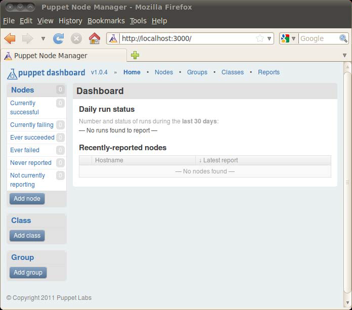
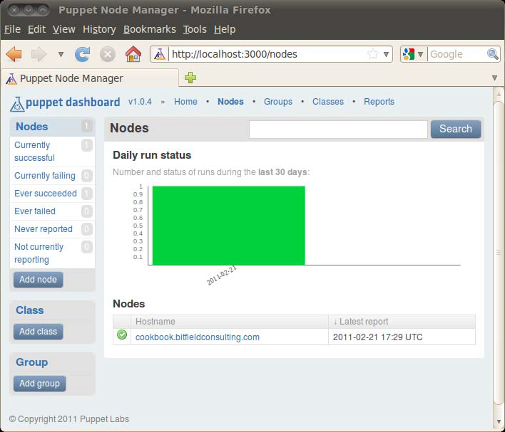
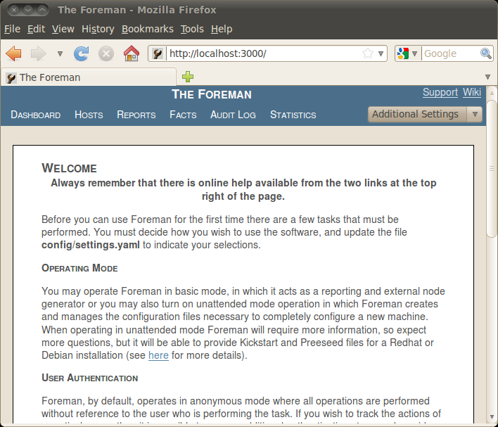
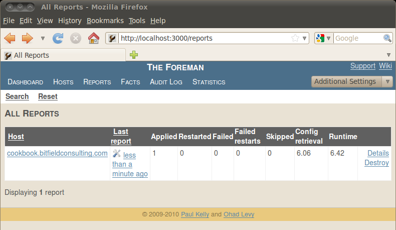
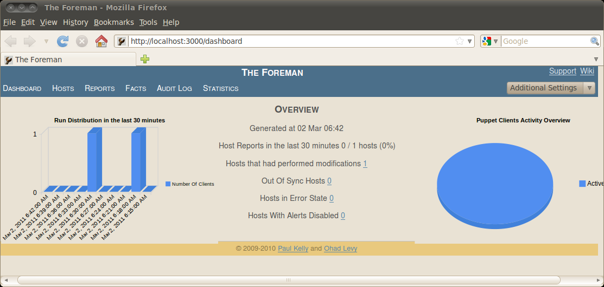

# 外部工具和 Puppet 生态环境

## 外部工具和 Puppet 生态环境

> Unix is the answer, but only if you phrase the question very carefully.
> 
> — Belinda Asbell

在本章中，我们将学习如下内容：

*   创建 Facter 的自定义 fact

*   在运行 Puppet 之前和之后执行命令

*   从 Shell 会话生成 Puppet 配置清单

*   从运行的系统上生成 Puppet 配置清单

*   使用 Puppet Dashboard

*   使用 Foreman

*   使用 MCollective

*   使用公共模块

*   使用外部节点分类器

*   创建自定义的资源类型

*   创建自定义的提供者

Puppet 本身就是一个有用的工具，但组合使用 Puppet 与其他工具和框架可以得到更大的利益。 在本章我们会看到：使用工具（Facter、cft 和 puppet resource）获得 Puppet 所需的数据； 使用工具（Foreman 和 Puppet Dashboard）管理和报告来自 Puppet 的数据。

你还会学到：如何通过创建你自定义的资源类型扩展 Puppet，并在不同的平台上实现自定义类型； 如何使用外部节点分类器脚本整合 Puppet 和数据库（例如：LDAP）； 如何使用来自 Puppet Forge 的公共模块；以及 Puppet 如何与系统管理框架 MCollective 协同工作。

# 创建 Facter 的自定义 fact

### 创建 Facter 的自定义 fact

虽然 Facter 内置的 facts 很有用，但实际上添加你自己的 facts 也是很容易的。 例如，如果你的机器位于不同的数据中心或托管提供商，你可以为此目的添加一个 **自定义 fact** 以便让 Puppet 决定是否需要应用一些本地设置（例如，本地 DNS 服务器）。

#### 准备工作

1.  在配置文件 puppet.conf 中开启 pluginsync 选项：

    ```
    [main]
        pluginsync = true 
    ```

2.  为 fact 创建一个目录。此目录位于相应的模块目录中，目录名为 lib/facter。 例如，你可以使用目录 modules/admin/lib/facter。你创建的任何自定义 facts 都位于此目录下并且 Puppet 会将其同步到客户端。

#### 操作步骤

1.  创建一个名为 hello.rb 的包含如下内容的脚本文件：

    ```
    Facter.add(:hello) do
        setcode do
            "Hello, world"
        end
    end 
    ```

2.  在客户端运行 Puppet。这会将 fact 同步到客户机：

    ```
    # puppet agent --test
    info: Retrieving plugin

    notice: /File[/var/lib/puppet/lib/facter/hello.rb]/ensure: defined
    content as '{md5}7314e71d35db83b563a253e741121b1d'

    info: Loading downloaded plugin /var/lib/puppet/lib/facter/hello.rb
    info: Loading facts in hello
    info: Loading facts in hello
    info: Loading facts in hello
    info: Loading facts in hello
    info: Connecting to sqlite3 database: /var/lib/puppet/state/
    clientconfigs.sqlite3

    info: Caching catalog for cookbook.bitfieldconsulting.com
    info: Applying configuration version '1297258039'

    notice: Finished catalog run in 0.57 seconds 
    ```

3.  通过直接运行 Facter 命令的方式检测 fact：

    ```
    # facter hello
    Hello, world 
    ```

4.  现在你可以在一个 Puppet 的配置清单中应用这个自定义的 fact：

    ```
    notify { $hello: } 
    ```

5.  当你运行 Puppet，对自定义 fact 的引用将返回其对应的值：

    ```
    notice: Hello, world 
    ```

#### 工作原理

Facter 内置的 facts 与我们刚刚创建的自定义 fact 相同的方式定义。 这种架构使添加和修改 facts 更为方便，并为你提供了一种在配置清单中读取主机信息的标准方法。

Facts 可以包含任何 Ruby 代码，语句块 setcode do … end 中最后算出的值将作为 fact 的返回值。 例如，你可以做个更有用的 fact，下面的代码将返回当前登录的用户数：

```
Facter.add(:users) do
    setcode do
        %x{/usr/bin/who |wc -l}.chomp
    end
end 
```

其输出是：

```
notice: 2 users logged in 
```

#### 更多用法

你可以扩展 facts 使用以创建一个完全 “无节点定义（nodeless）” 的 Puppet 配置： 换言之，Puppet 可以仅基于 facts 的结果决定将哪些资源应用到一台机器。 Jordan Sissel 写了篇介绍这种方法的文章： [`www.semicomplete.com/blog/geekery/puppet-nodeless-configuration.html`](http://www.semicomplete.com/blog/geekery/puppet-nodeless-configuration.html) 。

在网络上有许多可用的自定义 facts 的例子，包括 Cosimo Streppone 撰写的关于 “根据 IP 地址决定数据中心的位置” 的文章，网址为： [`my.opera.com/cstrep/blog/puppet-custom-facts-and-master-less-puppet-deployment`](http://my.opera.com/cstrep/blog/puppet-custom-facts-and-master-less-puppet-deployment) 。

# 在运行 Puppet 之前和之后执行命令

### 在运行 Puppet 之前和之后执行命令

如果你希望在每次运行 Puppet 之前执行命令，可以在配置文件中使用 prerun_command 配置。 类似地，你也可以使用 postrun_command 配置运行 Puppet 之后需要执行的命令。 这种机制为 Puppet 与其他软件的集成提供了强大的钩子，甚至可以触发其他机器上的事件。

prerun 和 postrun 命令必须能成功运行（即其返回的状态码为 0），否则 Puppet 将报告一个错误。这可以让你通过 Puppet 的报告机制获得任何命令的错误报告。

#### 操作步骤

在 puppet.conf 中设置 prerun_command 或 postrun_command 要执行的命令：

```
prerun_command  = /usr/local/bin/before-puppet-run.sh
postrun_command = /usr/local/bin/after-puppet-run.sh 
```

#### 更多用法

你可以使用 prerun 和 postrun 命令将 Puppet 与 Ubuntu 的 etckeeper 版本库整合起来。 **Etckeeper** 是一种用于跟踪 /etc 目录中文件变化的版本控制系统。 为了实现此功能，在 puppet.conf 配置文件中定义如下的执行命令：

```
prerun_command=/etc/puppet/etckeeper-commit-pre
postrun_command=/etc/puppet/etckeeper-commit-post 
```

# 从 Shell 会话生成 Puppet 配置清单

### 从 Shell 会话生成 Puppet 配置清单

> I object to being called a chess genius, because I consider myself to be an all around genius who just happens to play chess, which is rather different.
> 
> — Bobby Fischer

并非所有人都是天才。如果你确切地知道安装一个应用程序或服务都需要做些什么的话， 你马上就可以创建 Puppet 的配置清单。尽管如此，你通常还是需要首先做些小小的试验， 比如找到你要安装的软件包、需要编辑哪些配置文件等等。 你可以使用 script 命令记录你的 Shell 会话，然后根据会话文件的记录内容开发 Puppet 的配置清单，这是个不错的方法。

但如果有一个工具能通过读取你的会话文件生成 Puppet 配置清单的话是不是更精彩呢？ 为了实现此功能，**cft** （读音为 'sift'）应运而生。 一旦你激活它，cft 监视你的 Shell 会话并记住你安装的任何软件包、任何服务的配置、 任何你创建或编辑的文件，等等。 当会话记录结束，cft 会生成一个重现你刚刚所做的所有改变的完整的 Puppet 配置清单。

#### 准备工作

1.  当前完整的 cft 支持仅能用于 Red Hat/CentOS 发行版；针对 Debian/Ubuntu 发行版的完整的支持正在开发中，估计不久之后即可完成。 如果你正在使用 Red Hat/CentOS，只要安装 cft 即可：

    ```
    # yum install cft 
    ```

2.  对于 Debian/Ubuntu 系统，请参考如下安装说明，网址为： [`fmtyewtk.blogspot.com/2011/01/porting-cft-to-debian.html`](http://fmtyewtk.blogspot.com/2011/01/porting-cft-to-debian.html) 。

#### 操作步骤

1.  在本例中我们将使用 cft 监视 NTP 安装的软件包并生成实现相同功能的配置清单。

    ```
    # cft begin ntp
    # apt-get install ntp
    Reading package lists... Done
    Building dependency tree
    Reading state information... Done
    Suggested packages:
      ntp-doc
    The following NEW packages will be installed:
      ntp
    0 upgraded, 1 newly installed, 0 to remove and 385 not upgraded.

    Need to get 517kB of archives.
    After this operation, 1,323kB of additional disk space will be used.
    Get:1 http://us.archive.ubuntu.com/ubuntu/ lucid/main ntp
    1:4.2.4p8+dfsg-1ubuntu2 [517kB]
    Fetched 517kB in 5s (101kB/s)
    Selecting previously deselected package ntp.
    (Reading database ... 135278 files and directories currently
    installed.)
    Unpacking ntp (from .../ntp_1%3a4.2.4p8+dfsg-1ubuntu2_i386.deb)
    ...
    Processing triggers for man-db ...
    Processing triggers for ureadahead ...
    ureadahead will be reprofiled on next reboot
    Setting up ntp (1:4.2.4p8+dfsg-1ubuntu2) ...
     * Starting NTP server ntpd

    # vi /etc/ntp.conf
    # service ntp restart
     * Stopping NTP server ntpd
    [ OK ]
     * Starting NTP server ntpd

    # cft finish ntp
    # cft manifest ntp

    class ntp {
        package { 'ntp':
            ensure =&gt; '1:4.2.4p8+dfsg-1ubuntu2'
        }

        service { 'ntp':
            enable =&gt; 'true',
            ensure =&gt; 'running'
        }

        file { '/etc/ntp.conf':
            group  =&gt; 'root',
            owner  =&gt; 'root',
            mode   =&gt; '0644',
            source =&gt; '/tmp/cft/ntp/after/etc/ntp.conf'
        }
    } 
    ```

#### 工作原理

首先告诉 cft 开始记录系统的改变，并将其会话存储在 ntp 中?—?cft begin ntp 。

然后，当你安装 ntp 软件包时，cft 会记录这个事实。 软件包安装了服务的启动脚本，配置了在机器启动时启动服务，cft 同时也记录了这些。 最后，cft 注意到你编辑了 /etc/ntp.conf 文件，并保存了一份修改后的拷贝以备后用。

当你运行 cft finish ntp 命令，这会停止记录变化。 现在你可以使用 cft manifest ntp 命令生成与你的控制台会话等效的 Puppet 配置清单。

正如你看到的，生成的配置清单包括了 package 声明（由命令 apt-get install ntp 触发）：

```
package { 'ntp':
    ensure => '1:4.2.4p8+dfsg-1ubuntu2'
} 
```

同时包括了再现包安装脚本作用的 service 声明，启动服务并设置开机启动：

```
service { 'ntp':
    enable => 'true',
    ensure => 'running'
} 
```

这个声明是由于你手动配置了如下命令所生成的：

```
# service ntp start
# update-rc.d ntp defaults 
```

配置清单的最后一部分封装了 ntp.conf 文件的改变。 cft 只知道你对这个文件做了改变，但不知道你具体做了哪些改变， 所以 cft 将修改后的整个文件做为一个拷贝，并使其可以通过 Puppet 分发这个文件：

```
file { '/etc/ntp.conf':
    group  => 'root',
    owner  => 'root',
    mode   => '0644',
    source => '/tmp/cft/ntp/after/etc/ntp.conf'
} 
```

当你将此配置清单放入 Puppet，还需要从原始路径（/tmp/cft/ntp/after/etc/ntp.conf） 复制 ntp.conf 文件到你的模块树的适当位置，并根据这个位置修改 source 参数的值。

#### 更多用法

cft 是快速生成 Puppet 配置清单原型的一个强大工具。 你可以找一台构建配置清单的主机，尽可能使用 cft 记录你的安装和配置过程， 并使用它对整个会话进行编码生成 Puppet 的配置清单。 虽然这还需要一些额外的编辑工作，但是比你从头开始编写配置清单要快得多。

# 从运行的系统上生成 Puppet 配置清单

### 从运行的系统上生成 Puppet 配置清单

除了使用 cft 从系统管理员的控制台会话生成 Puppet 配置清单以外， 还可以使用 **puppet resource** 从系统中已存在的配置生成 Puppet 配置清单。 例如，你可以使用 puppet resource 生成系统中所有用户的配置清单。 这对于生成工作系统的快照并将这些配置快速转换到 Puppet 是相当有用的。

#### 操作步骤

1.  要生成指定用户的配置清单，请运行：

    ```
    # puppet resource user john
    user { 'john':
        password_min_age =&gt; '0',
        password_max_age =&gt; '99999',
        uid      =&gt; '1002',
        password =&gt; '!',
        gid      =&gt; '1001',
        groups   =&gt; ['git'],
        ensure   =&gt; 'present',
        comment  =&gt; 'John Arundel',
        home     =&gt; '/home/john',
        shell    =&gt; '/bin/bash'
    } 
    ```

2.  要生成指定服务的配置清单，请运行：

    ```
    # puppet resource service ntp
    service { 'ntp':
        ensure =&gt; 'running',
        enable =&gt; 'true'
    } 
    ```

3.  要生成指定软件包的配置清单，请运行：

    ```
    # puppet resource package exim4
    package { 'exim4':
        ensure =&gt; '4.71-3ubuntu1'
    } 
    ```

#### 更多用法

你可以使用 puppet resource 检查 Puppet 每种可用的资源类型。 在上面的例子中，我们针对一个资源类型的具体实例生成了配置清单， 然而你也可以使用 puppet resource 导出一种资源类型的所有实例：

```
# puppet resource user
user { 'Debian-exim':
    ensure           => 'present',
    uid              => '117',
    gid              => '124',
    home             => '/var/spool/exim4',
    password         => '!',
    password_min_age => '0',
    password_max_age => '99999',
    shell            => '/bin/false'
}

user { 'avahi':
    ensure           => 'present',
    uid              => '104',
    gid              => '111',
    home             => '/var/run/avahi-daemon',
    password         => '*',
    password_min_age => '0',
    comment          => 'Avahi mDNS daemon,,,',
    password_max_age => '99999',
    shell            => '/bin/false'
}
... 
```

这会产生许多输出！

# 使用 Puppet Dashboard

### 使用 Puppet Dashboard

**Puppet Dashboard** 是一个管理 Puppet 安装的有用的工具，尤其对于大量的安装， 并且能够通过一个 Web 界面看到节点的信息和报告。 **Puppet Dashboard** 可以为你显示最近运行 Puppet 的节点，它们运行了多长时间， 是否有任何节点的错误报告，以及是否有一段时间内没有运行 Puppet 的节点等。

#### 准备工作

1.  从 Puppet Labs 站点 [`www.puppetlabs.com/misc/download-options/`](http://www.puppetlabs.com/misc/download-options/) 下载 Puppet Dashboard 软件包并解压缩。 软件包中有一个安装说明文件 README.markdown，但你可能需要先安装以下依赖的包（部分或全部）：

    ```
    # apt-get install -y build-essential irb libmysql-ruby
    libmysqlclient-dev libopenssl-ruby libreadline-ruby mysql-server
    rake rdoc ri ruby ruby-dev 
    ```

2.  为 Puppet Dashboard 应用程序创建一个 MySQL 数据库和用户（使用自己的口令）：

    ```
    # mysql -uroot
    Welcome to the MySQL monitor. Commands end with ; or \g.
    Your MySQL connection id is 39
    Server version: 5.1.41-3ubuntu12.9 (Ubuntu)

    Type 'help;' or '\h' for help. Type '\c' to clear the current
    input statement.

    mysql&gt; create database dashboard;
    Query OK, 1 row affected (0.00 sec)

    mysql&gt; grant all on dashboard.* to dashboard@localhost identified
    by 'topsecret';
    Query OK, 0 rows affected (0.01 sec)

    mysql&gt; flush privileges;
    Query OK, 0 rows affected (0.00 sec) 
    ```

3.  复制 Puppet Dashboard 提供的样例文件 database.yml，并做适当的修改：

    ```
    # cd puppetlabs-puppet-dashboard-071acf4
    # cp config/database.yml.example config/database.yml
    # vi config/database.yml 
    ```

    ```
    production:
      database: dashboard
      username: dashboard
      password: topsecret
      encoding: utf8
      adapter: mysql 
    ```

4.  使用应用程序提供的 Rake 任务创建如下的初始化数据库：

    ```
    # rake RAILS_ENV=production db:migrate 
    ```

#### 操作步骤

1.  启动内置的 Web 服务器：

    ```
    # script/server -e production
    =&gt; Booting WEBrick
    =&gt; Rails 2.3.5 application starting on http://0.0.0.0:3000
    =&gt; Call with -d to detach
    =&gt; Ctrl-C to shutdown server
    [2011-02-21 09:54:32] INFO WEBrick 1.3.1
    [2011-02-21 09:54:32] INFO ruby 1.8.7 (2010-01-10) [i486-linux]
    [2011-02-21 09:54:37] INFO WEBrick::HTTPServer#start: pid=16570
    port=3000

    Using a web browser, connect to localhost:3000 
    ```

2.  如图所示，你应该看到 Puppet Dashboard 的界面：

    

3.  现在你需要配置 Puppetmaster 向 Puppet Dashboard 发送报告。 为了实现这个功能，你需要配置 puppet.conf 文件的 reports 参数，为其添加 http 报告：

    ```
    reports = http,log 
    ```

4.  重新启动 Puppetmaster 使新配置的报告生效。

5.  在节点上运行 Puppet：

    ```
    # puppet agent --test 
    ```

6.  在 Puppet Dashboard 界面中单击 **Nodes** 链接。 如图所示，你应该看到表明 Puppet 运行成功的绿色区域：

    

#### 工作原理

当在一个节点上运行了 Puppet，它会使用其报告装置向 Puppet Dashboard 发送报告。 Puppet Dashboard 会存储这些数据并利用这些数据显示所有节点上的 Puppet 活动的图表和摘要。

#### 更多用法

你也可以使用 Puppet Dashboard 创建新的节点或类，并控制哪些节点需要包含哪些类。 实际上，它为你管理 Puppet 配置清单提供了一个 Web 接口， 所以你可以通过 Web 浏览器来编辑配置清单，而不是直接修改文本文件。 这是一个有吸引力的功能，尤其用于想让其他团队或部门的人能够管理他们自己的 Puppet 配置时。

为了实现 Puppet Dashboard 的这个功能，你需要配置 Puppet 使用 **external node classifier**； 这将在 使用外部节点分类器 一节中介绍。

#### 参见本书

*   第二章的 生成报告 一节

*   第二章的 创建图形化报告 一节

*   本章的 使用外部节点分类器 一节

# 使用 Foreman

### 使用 Foreman

**Foreman** 是一个基于 Web 的类似于 Puppet Dashboard 的 Puppet 管理工具，但它更为雄心勃勃。 Foreman 不仅可以管理 Puppet 报告、节点和配置清单，而且可以为你供应新机器。 如果你需要自动创建大量的服务器或者你需要频繁地重建服务器，Foreman 将有助于你实现这一过程。

#### 准备工作

1.  在你的系统中添加 Foreman 包的仓库，参考说明： [`theforeman.org/projects/foreman/wiki/Installation_instructions`](http://theforeman.org/projects/foreman/wiki/Installation_instructions) 。

2.  安装 Foreman 包：

    ```
    # apt-get update
    # apt-get install foreman 
    ```

3.  系统将提示你选择一种数据库，请根据需要选择 mysql、pgsql 或 sqlite。

4.  根据选择的数据库，安装你的数据库所依赖的软件包：

    ```
    # apt-get install foreman-mysql
    # apt-get install foreman-pgsql
    # apt-get install foreman-sqlite3 
    ```

5.  复制文件 /etc/foreman/extras/puppet/foreman/files/foremanreport.rb 到你的 Puppet 自定义报告目录（通常是 /usr/lib/ruby/1.8/puppet/reports） 并将其重命名为 foreman.rb：

    ```
    # cp /etc/foreman/extras/puppet/foreman/files/foreman-report.rb \
         /usr/lib/ruby/1.8/puppet/reports/foreman.rb 
    ```

6.  编辑 foreman.rb 文件设置你的 Foreman 服务器 URL：

    ```
    # URL of your Foreman installation
    $foreman_url="http://cookbook.bitfieldconsulting.com:3000" 
    ```

7.  编辑你的 puppet.conf 添加 foreman 报告类型到已启用的报告类型列表：

    ```
    [master]
    reports = store,log,foreman 
    ```

8.  重新启动 Puppetmaster 使新配置的报告生效。

#### 操作步骤

1.  启动 Foreman 服务器：

    ```
    # /usr/share/foreman/script/server -e production 
    ```

2.  使用你之前设置的 URL（[`cookbook.bitfieldconsulting.com:3000）浏览`](http://cookbook.bitfieldconsulting.com:3000）浏览) Foreman 的 web 界面。

    你应该看到如下的 Foreman 初始欢迎界面：

    

3.  现在，在一个客户端运行 Puppet：

    ```
    # puppet agent --test 
    ```

    在 Foreman 的 Web 界面中进入 **Reports** 标签页，如图所示，你会看到刚刚运行的客户报告：

    

4.  进入 Dashboard 标签页你会看到一个针对所有客户的 **OVERVIEW** （本例中只有一个客户）。

    

#### 更多用法

此处我们仅仅接触到了 Foreman 的一些基本功能。既然已经运行了一个配置好的 Foreman， 你就可以尝试不同的报告、图表、以及 Foreman 提供的其他信息。 当你有很多主机需要管理，并希望看到 Puppet 如何跨越整个网络的运行统计时， 这些信息会变得更有价值。

Foreman 的另一个主要特性是供应：它可以使用 PXEboot 和 Kickstart 从头创建物理服务器或虚拟服务器，对 Puppet 证书进行自动签名，并运行 Puppet 将机器带入生产状态。 欲了解更多有关如何实现的详细信息，请查阅 Foreman 文档： [`theforeman.org/projects/foreman/wiki/Unattended_installations`](http://theforeman.org/projects/foreman/wiki/Unattended_installations) 。

> 
> 
> 如果你决定将 Foreman 用于生产环境，就值得为其设置 Apache 虚拟主机， 而不是使用 Webrick 带动 Foreman。 Webrick 对测试环境很有用，但它不是真正的生产级别的 Web 服务器。

# 使用 MCollective

### 使用 MCollective

**Marionette Collective**（简称为 **MCollective**）是一个系统管理工具。 MCollective 可以在大量服务器上并行运行命令，它采用广播架构， 所以，你可以使用它管理一个大型网络而不需要一个中央主服务器或资产数据库。

每台服务器都运行一个 MCollective 守护进程监听请求，并在本地执行命令或返回有关服务器的信息。 这也可以用来过滤目标服务器列表。 例如，你可以使用 MCollective 在符合特定条件的所有服务器上执行给定的命令。

你可以考虑将 MCollective 作为 Puppet 的一个补充（尽管它也可以与 Chef 或其他配置管理系统协同工作）。 例如，你配置一个新节点的过程可能需要改变其他机器上的防火墙配置，对数据库服务器授予适当的权限，等等。 这仅使用 Puppet 是不太容易做到的。虽然你可以使用 Shell 脚本和 SSH 自动化执行特定的工作， 但是 MCollective 提供了解决这个普遍问题的强大而灵活的方式。

#### 准备工作

1.  MCollective 使用 ActiveMQ 消息代理框架（实际上，可以使用任何 STOMPcompliant 中间件， 但 ActiveMQ 是一个受欢迎的选择）， ActiveMQ 需要 Java 运行环境， 如果你的系统还没有安装 Java，先安装它：

    ```
    # apt-get install gcj-4.4-jre-headless 
    ```

2.  到 ActiveMQ 下载页面 [`activemq.apache.org/download.html`](http://activemq.apache.org/download.html) 下载 “Unix 发布” 最近的稳定版 tar 包。

3.  安装 stomp gem ：

    ```
    # gem install stomp 
    ```

4.  到 [`www.puppetlabs.com/misc/download-options/`](http://www.puppetlabs.com/misc/download-options/) 下载 MCollective 最近的稳定版 .deb 包。

5.  安装已下载的 .deb 包：

    ```
    # dpkg -i mcollective_1.0.1-1_all.deb mcollective-client_1.0.1-1_
    all.deb mcollective-common_1.0.1-1_all.deb 
    ```

6.  从 MCollective 的下载页面下载与 .deb 版本相同的 tar 包 （因为其中包含了 ActiveMQ 配置文件样例）。

7.  编辑 MCollective 的 server.cfg 文件：

    ```
    # vi /etc/mcollective/server.cfg 
    ```

8.  将参数 plugin.stomp.host 设置为你的服务器名（即你运行 ActiveMQ 的服务器）：

    ```
    plugin.stomp.host = cookbook.bitfieldconsulting.com 
    ```

9.  对 MCollective 的 client.cfg 文件做同样的设置：

    ```
    # vi /etc/mcollective/client.cfg 
    ```

10.  解压缩 MCollective 的 tar 包并复制 ActiveMQ 的配置文件样例到 /etc/mcollective：

    ```
    # tar xvzf mcollective-1.0.1.tgz
    # cp mcollective-1.0.1/ext/activemq/examples/single-broker/activemq.xml \
       /etc/mcollective 
    ```

11.  编辑这个配置文件设置 mcollective 用户的口令与 server.cfg 中的相同：

    ```
    # vi /etc/mcollective/activemq.xml 
    ```

12.  解压缩 ActiveMQ 的 tar 包，用指定的配置文件启动 ActiveMQ 的服务：

    ```
    # tar xvzf apache-activemq-5.4.2-bin.tar.gz
    # apache-activemq-5.4.2/bin/activemq start xbean:/etc/mcollective/
    activemq.xml

    INFO: Using default configuration
    (you can configure options in one of these file: /etc/default/
    activemq /root/.activemqrc)

    INFO: Invoke the following command to create a configuration file
    bin/activemq setup [ /etc/default/activemq | /root/.activemqrc ]

    INFO: Using java '/usr/bin/java'

    INFO: Starting - inspect logfiles specified in logging.properties
    and log4j.properties to get details

    INFO: pidfile created : '/root/apache-activemq-5.4.2/data/
    activemq.pid' (pid '3322') 
    ```

13.  启动 MCollective 的服务：

    ```
    # service mcollective start
    Starting mcollective: * 
    ```

#### 操作步骤

1.  使用如下命令检查 MCollective 和 ActiveMQ 是否启动且正常运行：

    ```
    # mc-ping
    cookbook                             time=68.82 ms

    ---- ping statistics ----
    1 replies max: 68.82 min: 68.82 avg: 68.82 
    ```

2.  如果未看到任何结果输出，检查 mcollectived 守护进程是否已运行，并检查用于 ActiveMQ 的 Java 进程是否已运行。

3.  针对你的机器运行 mc-inventory 查看 MCollective 知道的关于 cookbook 机器的信息：

    ```
    # mc-inventory cookbook
    Inventory for cookbook:

        Server Statistics:
                           Version: 1.0.1
                        Start Time: Mon Mar 07 11:44:53 -0700 2011
                       Config File: /etc/mcollective/server.cfg
                        Process ID: 4220
                    Total Messages: 14
           Messages Passed Filters: 6
                 Messages Filtered: 5
                      Replies Sent: 5
              Total Processor Time: 0.8 seconds
                       System Time: 0.47 seconds

        Agents:
                 discovery rpcutil
        Configuration Management Classes:

        Facts:
              mcollective =&gt; 1 
    ```

4.  通过在 /etc/mcollective/facts.yaml 中添加如下的代码片段为服务器创建一个新的自定义 fact：

    ```
    purpose: webserver 
    ```

5.  现在使用 MCollective 查找所有匹配这个 fact 的机器：

    ```
    # mc-find-hosts --with-fact purpose=webserver
    cookbook 
    ```

#### 工作原理

**MCollective** 是一个广播框架；当你发出一个像 mc-find-hosts 这样的请求时， MCollective 就为所有请求的客户端发送消息：“有没有客户匹配这个过滤器呀？” 所有匹配过滤器的客户端都会发送一个回复，MCollective 会将这些回复收集到一起并为你输出这些信息。

你可以为特定的任务安装大量的插件和代理（例如，运行 Puppet）。 这些插件和代理都是安装在客户端上的，MCollective 处理发送命令到所有匹配机器所涉及的通信， 并整理勘校其任何结果。

#### 更多用法

尽管我们只涉及了使用 MCollective 的一些基本步骤，但是它显然是一个功能强大的工具， 它既可以收集有关服务器的信息，也可以通过选择 fact 针对一个服务器列表执行命令。 例如，你可以获得一个过去 24 小时没有运行 Puppet 的机器列表。 又如，你可以对所有 Web 服务器或所有 x86_64 架构的机器执行一系列动作。

MCollective 本身只为这类应用提供了一个框架。对于不同的应用有各种各样的插件可用， 而且编写自己的插件也是很容易的。在下面的例子中，我们将使用 package 插件，此插件允许你查询和操作包。

##### 安装 MCollective 插件

1.  从 GitHub 克隆 MCollective 插件仓库：

    ```
    # git clone https://github.com/puppetlabs/mcollective-plugins.git 
    ```

2.  复制插件文件到适当的目录：

    ```
    # cd mcollective-plugins
    # cp agent/package/mc-package /usr/bin
    # cp agent/package/puppet-package.rb \
         /usr/share/mcollective/plugins/mcollective/agent/package.rb
    # cp agent/package/package.ddl \
         /usr/share/mcollective/plugins/mcollective/agent 
    ```

3.  重新启动 MCollective：

    ```
    # service mcollective restart 
    ```

4.  运行 mc-inventory 检查该插件是否出现在 Agents 列表中：

    ```
    # mc-inventory cookbook

    Inventory for cookbook:
        Server Statistics:
                           Version: 1.0.1
                        Start Time: Tue Mar 08 08:28:29 -0700 2011
                       Config File: /etc/mcollective/server.cfg
                        Process ID: 6047
                    Total Messages: 1
           Messages Passed Filters: 1
                 Messages Filtered: 0
                      Replies Sent: 0
              Total Processor Time: 0.04 seconds
                       System Time: 0.02 seconds

        Agents:
            discovery        package        rpcutil

        Configuration Management Classes:

        Facts:
            mcollective =&gt; 1
            purpose =&gt; webserver 
    ```

5.  试着执行 mc-package 命令检验如下命令是否正常工作：

    ```
    # mc-package status apache2
    Do you really want to operate on packages unfiltered? (y/n): y
     * [ =========================================================&gt; ] 1 / 1

    cookbook                            version = apache2-2.2.14-5ubuntu8.4

    ---- package agent summary ----
              Nodes: 1 / 1
           Versions: 1 * 2.2.14-5ubuntu8.4
       Elapsed Time: 0.58 s 
    ```

    package 代理提供了一个强大的方法用于在你的整个网络（或特定的机器） 上检查包版本、安装或更新所需的软件包。 有关此插件和其他 MCollective 插件的更多细节，请查看 wiki 页面： [`projects.puppetlabs.com/projects/mcollective-plugins/wiki`](http://projects.puppetlabs.com/projects/mcollective-plugins/wiki) 。

    有关 MCollective 的更多信息，请访问其主页： [`docs.puppetlabs.com/mcollective/`](http://docs.puppetlabs.com/mcollective/) 。

# 使用公共模块

### 使用公共模块

> Plagiarize, plagiarize, plagiarize / Only be sure always to call it, please *research*.
> 
> *Lobachevsky* — Tom Lehrer

如果你对自己编制的代码有疑问，使用他人的吧。在许多情况下， 当你要写一个 Puppet 模块来管理一些软件或服务时，不必从头开始编写。 对许多流行的应用程序，在 **Puppet Forge** 站点上都提供了社区贡献的模块。 有时，一个社区模块正是你所需要的，你可以下载并马上开始使用它。 若社区提供的模块不能满足你的需求，你可以对其进行一些修改，以适应你的特定需求和环境。

如果你是个 Puppet 的新手，能从一些现有的代码开始对你将是一个很大的帮助。但另一方面， 社区模块往往编写得尽可能通用和便携，为了实现此目的所需的额外代码可能使其更难理解。

一般地，在你未阅读和理解 Puppet Forge 提供的模块代码之前， 我建议你不要将其作为 ‘活动的（drop-in）’ 模块源来部署。 Puppet Forge 提供的模块为你的 Puppet 基础设施引入了一个外部的依赖， 但它并不能帮你提升对 Puppet 的理解也不利于提升你使用 Puppet 的经验。 相反，我会用它作为一个获取灵感的源泉，从这方面讲它还是很有帮助的。 从 Puppet Forge 获取的模块应该是一个起点，你可以用它作为基础，制定和完善自己的模块。

要知道，一个给定的模块可能无法在你的 Linux 发行上工作。请检查模块自带的 README 文件，查看这个模块是否支持你的操作系统。

#### 准备工作

1.  使用 Puppet Forge 模块的最简单方法是安装 puppet-module 工具：

    ```
    # gem install puppet-module
    Fetching: puppet-module-0.3.2.gem (100%)
    ******************************************************************

    Thank you for installing puppet-module from Puppet Labs!
    * Usage instructions: read "README.markdown" or run `puppetmodule
      usage`
    * Changelog: read "CHANGES.markdown" or run `puppet-module
      changelog`
    * Puppet Forge: visit http://forge.puppetlabs.com/

    ******************************************************************

    Successfully installed puppet-module-0.3.2
    1 gem installed
    Installing ri documentation for puppet-module-0.3.2...
    Installing RDoc documentation for puppet-module-0.3.2... 
    ```

2.  运行 puppet-module 查看其可用的任务：

    ```
    # puppet-module
    Tasks:
      puppet-module build [PATH_TO_MODULE]
        # Build amodule for release
      puppet-module changelog
        # Display the changelog for this tool
      puppet-module changes [PATH_TO_MODULE]
        # Show modified files in an installed m...
      puppet-module clean
        # Clears module cache for all repositories
      puppet-module generate USERNAME-MODNAME
        # Generate boilerplate for a new module
      puppet-module help [TASK]
        # Describe available tasks or one speci...
      puppet-module install MODULE_NAME_OR_FILE [OPTIONS]
        # Install a module (eg, 'user-modname')...
      puppet-module repository
        # Show currently configured repository
      puppet-module search TERM
        # Search the module repository for a mo...
      puppet-module usage
        # Display detailed usage documentation ...
      puppet-module version
        # Show the version information for this...

    Options:
      -c, [--config=CONFIG] # Configuration file
                            # Default: /etc/puppet/puppet.conf 
    ```

#### 操作步骤

在本例中，我们将使用 puppet-module 查找并安装一个管理 Tomcat 应用程序服务器的模块。

1.  查找合适的模块：

    ```
    # puppet-module search tomcat
    =====================================
    Searching http://forge.puppetlabs.com
    -------------------------------------
    2 found.
    --------
    camptocamp/tomcat (0.0.1)
    jeffmccune/tomcat (1.0.1) 
    ```

2.  在本例中，我们将安装 Jeff McCune 版本的 tomcat 模块：

    ```
    # cd /etc/puppet/modules
    # puppet-module install jeffmccune/tomcat
    Installed "jeffmccune-tomcat-1.0.1" into directory:
    jeffmccune-tomcat 
    ```

3.  现在就可以在你的配置清单中使用这个模块了：查看其源代码将向你展示这是如何实现的。

#### 工作原理

puppet-module 工具使用简单地自动化过程从 Puppet Forge 站点搜索和下载模块。 你也可以浏览该网站查询可用的模块： [`forge.puppetlabs.com/`](http://forge.puppetlabs.com/) 。

#### 更多用法

并非所有公开可用的模块都保存在 Puppet Forge 上。其他的存放位置是在 GitHub 上：

*   [`github.com/camptocamp`](https://github.com/camptocamp)

*   [`github.com/example42`](https://github.com/example42)

Dean Wilson 在他的 Puppet Cookbook 站点： [`puppetcookbook.com/`](http://puppetcookbook.com/) 维护了一个优秀的 Puppet 的仓库，还包括一些技巧和处方。

# 使用外部节点分类器

### 使用外部节点分类器

当 Puppet 运行在一个节点上，它需要知道这个节点应该应用了哪些类。 例如，如果这是一个 web 服务器节点，它可能需要包含一个 apache 类。 将类映射到节点的一种简单方法是在配置清单里声明，例如下面是一个 nodes.pp 文件的例子：

```
node web1 {
    include apache
} 
```

另外，你可以使用 **外部节点分类器**（**external node classifier，ENC**）来实现这个工作。 一个外部节点分类器是任何可执行程序，它可以接受一个节点的名称，并返回该节点的类列表。 例如，这可能是一个简单的 shell 脚本， 或者是对一个可以决定如何映射类到节点的更复杂的程序或 API 的封装。

#### 准备工作

在你的 puppet.conf 配置文件中设置如下的参数：

```
[master]
external_nodes = /usr/local/bin/puppet_node_classifier
node_terminus  = exec 
```

#### 操作步骤

1.  创建如下的简单脚本 /usr/local/bin/puppet_node_classifier：

    ```
    #!/bin/bash
    if [ "$1" == "cookbook.bitfieldconsulting.com" ]; then
      cat &lt;&lt;"END"
    ---
    classes:
      - admin::sudoers
      - admin::exim
      - puppet
      - nagios::target

    environment: production
    parameters:
      location: Bitfield HQ
    END

    else
      exit 1
    fi 
    ```

2.  为该脚本添加可执行权限：

    ```
    # chmod 755 /usr/local/bin/puppet_node_classifier 
    ```

3.  运行 Puppet：

    ```
    # puppet agent --test
    info: Retrieving plugin
    info: Caching catalog for cookbook.bitfieldconsulting.com
    info: Applying configuration version '1299677816'
    notice: Finished catalog run in 1.19 seconds 
    ```

#### 工作原理

Puppet 调用你在 puppet.conf 中由参数 external_nodes 指定的脚本， 并传递节点的名称作为命令行参数。在本例的脚本中，我们检查这个参数， 如果它与 cookbook.bitfieldconsulting.com 相同，将为其输出一个 Puppet 所需的 YAML 格式的类列表。 否则，此脚本将返回退出状态码 1（向 Puppet 指出该节点没有被发现）。

该脚本还设置了 environment 的值（参见 使用不同的环境 一节中关于这个参数的解释）。 同时将变量 location 设置成了 Bitfield HQ?—?此变量是个自定义变量，对于 Puppet 并无特殊含义， 但是由于在 ENC 中定义的变量是顶级范围的变量，可以在你的配置清单里引用此处定义的变量， 所以，例如你可以使用它决定 DNS 解析器的设置。你可以在此设置任何你需要的变量。

显然，这个脚本并不十分有用，因为它只是输出了一个预先确定的类列表。 一个更复杂的脚本可能会检查数据库，从中查找节点所需的类列表， 或从一个哈希或外部文本文件中查找节点所需的类列表。 我希望，这个例子足以让你开始写出自己的更复杂的外部节点分类器。

有关外部节点分类器的详细信息，请参考： [`docs.puppetlabs.com/guides/external_nodes.html`](http://docs.puppetlabs.com/guides/external_nodes.html) 。

#### 更多用法

使用外部分类器的主要用途是使 Puppet 可以连接 LDAP 目录服务。 许多大型组织都有个 LDAP 基础设施，你可以设置 Puppet，使它可以从 LDAP 目录服务获取信息， 并且其他 LDAP 客户也可以通过 Puppet 获得由其管理的节点信息。

欲了解更多有关如何做到这一点的详细信息，请访问 “Puppet 和 LDAP” 页面： [`projects.puppetlabs.com/projects/puppet/wiki/LDAP_Nodes`](http://projects.puppetlabs.com/projects/puppet/wiki/LDAP_Nodes) 。

此功能也可用于 Puppet Dashboard 和 Foreman 通过 Web 界面管理节点和类之间的关系?—?他们将以外部节点分类器来处理。

# 创建自定义的资源类型

### 创建自定义的资源类型

该到你发挥创意的时间了。你已经知道了各种不同的 Puppet 资源类型： 包（package）, 文件（file）、用户（user），等等。 通常情况下，你既可以组合使用这些内置资源类型做你需要做的一切， 又可以通过一个自定义 define 作为一种资源（以内置资源同样的方式）来使用 （参见第四章 书写更优质的配置清单 中有关 define 的内容）。

但是，如果你需要创建自己的资源类型，Puppet 也可以很容易地实现。 原生的资源类型都是使用 Ruby 书写的，为了创建自己的资源类型，你需要对 Ruby 有一个基本的了解。

让我们重新回顾一下 **资源类型**（**type**）和 **提供者**（**provider**）之间的区别。 资源类型描述了一个资源和它可拥有的参数（例如，package 类型）。 提供者则告诉 Puppet 如何针对特定的平台或情况去实现一个资源 （例如，apt/dpkg 提供者为 Debian/Ubuntu 系统实现 package 资源）。

一种类型（如：package）可以有多个提供者（如：apt、yum、fink 等等）。 如果你声明一个资源时没有指定提供者，Puppet 会根据环境选择一个最合适的提供者。

在本节中，我们将看到如何创建一个管理 Git 仓库的自定义资源类型； 在下一节，我们将编写一个实现这种资源类型的提供者。

#### 准备工作

1.  在你的 puppet.conf 文件中启用 pluginsync（若还未启用）：

    ```
    [main]
    pluginsync = true 
    ```

2.  在你的 Puppet 仓库中，为你的插件和类型创建一个自定义模块（若还不存在）：

    ```
    # cd /etc/puppet/modules
    # mkdir custom 
    ```

3.  在这个模块中，创建 lib/puppet/type 目录：

    ```
    # cd custom
    # mkdir -p lib/puppet/type 
    ```

#### 操作步骤

在 type 目录中创建一个名为 gitrepo.rb 的文件，其内容如下：

```
Puppet::Type.newtype(:gitrepo) do
    ensurable

    newparam(:source) do
        isnamevar
    end

    newparam(:path)
end 
```

#### 工作原理

第一行注册一个名为 gitrepo 的新类型：

```
Puppet::Type.newtype(:gitrepo) do 
```

ensurable 行确保自动给出该类型的属性（与 Puppet 内置的资源类似）：

```
 ensurable 
```

现在，我们将给出此类型的一些参数。就目前而言，我们所需要的参数分别是： source 参数用于指定 Git 仓库源的 URL；path 参数用于告诉 Puppet 要在文件系统中的什么位置创建仓库。

```
 newparam(:source) do
        isnamevar
    end 
```

isnamevar 声明告诉 Puppet 参数 source 是此类型的 namevar。 因此当你声明这个资源的实例时，你给出的任何名字将被视为 source 的值。例如：

```
gitrepo { "git://github.com/puppetlabs/puppet.git":
    path => "/home/john/work/puppet",
} 
```

最后，我们添加 path 参数：

```
 newparam(:path) 
```

#### 更多用法

一旦你熟悉了创建自己的资源类型的方法，你就可以使用自定义的资源类型替换复杂的 exec 资源， 这会使你的配置清单更具可读性。 然而，通过对自定义资源类型的代码添加一些文档和参数校验使其更强壮更具可重用性是一个好主意。

##### 文档

我在上面故意举了一个简单的例子，但是当你要为生产环境开发真正的自定义类型时， 你应该加入文档字符串描述类型及其参数的用途。例如：

```
Puppet::Type.newtype(:gitrepo) do
    @doc = "Manages Git repos"

    ensurable

    newparam(:source) do
        desc "Git source URL for the repo"
        isnamevar
    end

    newparam(:path) do
        desc "Path where the repo should be created"
    end
end 
```

##### 校验

当某人试图向资源传递错误的值时，你可以使用参数校验（validate）生成有用的错误信息。 例如，你可以校验要创建仓库的目录是否已真实存在：

```
 newparam(:path) do
    validate do |value|
      basepath = File.dirname(value)
      unless File.directory?(basepath)
        raise ArgumentError , "The path %s doesn't exist" %basepath
      end
    end
  end 
```

你也可以为参数指定一个允许的取值列表，例如：

```
newparam(:breakfast) do
    newvalues(:bacon, :eggs, :sausages)
end 
```

# 创建自定义的提供者

### 创建自定义的提供者

在上一节，我们创建了一个新的名为 gitrepo 的自定义资源类型并告诉 Puppet 此类型需要携带两个参数，分别为 source 和 path。 然而到目前为止，我们还没有告诉 Puppet 如何检出仓库，即如何创建这种类型的具体实例。 这正是提供者（provider）的用武之地。

正如我们之前看到的，一个类型经常会有几种可能的提供者。在本例中， 对一个 Git 仓库进行实例化仅有一种明智的方法，所以我们只需一个提供者：git。 如果你想要扩展这个自定义类型（将其称之为 repo 而非 gitrepo）， 不难想象只要针对不同类型的仓库创建若干不同的提供者即可，例如：git、svn、cvs 等等。

#### 准备工作

1.  在你的 custom 模块的 lib/puppet 目录中, 创建一个名为 provider/gitrepo 的子目录：

    ```
    # mkdir -p lib/puppet/provider/gitrepo 
    ```

2.  在 gitrepo 目录中，使用如下内容创建一个名为 git.rb 的文件：

    ```
    require 'fileutils'

    Puppet::Type.type(:gitrepo).provide(:git) do
        commands :git =&gt; "git"

        def create
            git "clone", resource[:source], resource[:path]
        end

        def exists?
            File.directory? resource[:path]
        end
    end 
    ```

#### 操作步骤

1.  在 Puppet 配置清单中添加如下代码为新的资源类型 gitrepo 创建一个实例：

    ```
    gitrepo { "https://github.com/puppetlabs/puppet.git":
        path   =&gt; "/tmp/puppet",
        ensure =&gt; present,
    } 
    ```

2.  现在运行 Puppet，你的新类型将被加载并进行了实例化：

    ```
    # puppet agent --test
    info: Retrieving plugin
    notice: /File[/var/lib/puppet/lib/puppet]/ensure: created
    notice: /File[/var/lib/puppet/lib/puppet/provider]/ensure: created

    notice: /File[/var/lib/puppet/lib/puppet/provider/gitrepo]/ensure:
    created

    notice: /File[/var/lib/puppet/lib/puppet/provider/gitrepo/git.rb]/
    ensure: defined content as '{md5}a12870d89a4b517e48fe417ce2e12ac2'

    notice: /File[/var/lib/puppet/lib/puppet/type]/ensure: created

    notice: /File[/var/lib/puppet/lib/puppet/type/gitrepo.rb]/ensure:
    defined content as '{md5}90d5809e1d01dc9953464e8d431c9639'

    info: Loading downloaded plugin /var/lib/puppet/lib/puppet/
    provider/gitrepo/git.rb

    info: Loading downloaded plugin /var/lib/puppet/lib/puppet/type/
    gitrepo.rb

    info: Redefining gitrepo in Puppet::Type
    info: Caching catalog for cookbook.bitfieldconsulting.com
    info: Applying configuration version '1299850325'

    notice: /Stage[main]//Node[cookbook]/Gitrepo[https://github.com/
    puppetlabs/puppet.git]/ensure: created

    notice: Finished catalog run in 74.43 seconds 
    ```

> 
> 
> 注意：由于 Puppet 的一个错误，当你首次创建新类型的实例时，可能需要两次运行 puppet agent：第一次加载类型的定义，第二次才真正创建实例。 如果你看到如下的信息：
> 
> ```
> err: /Stage[main]//Node[cookbook]/Gitrepo[https://
> github.com/puppetlabs/puppet.git]: Could not
> evaluate: No ability to determine if gitrepo exists 
> ```
> 
> 就意味着你正遭遇此错误带来的困扰?—?别急，再次运行 Puppet 即可正常工作。 当你读到本书的出版物时，这个错误很可能已经被修复。

#### 工作原理

首先我们为 gitrepo 类型注册一个资源类型的提供者：

```
Puppet::Type.type(:gitrepo).provide(:git) do 
```

当你在配置清单中声明此类型的一个实例时，Puppet 会先检查是否有已经存在的实例：

```
def exists?
    File.directory? resource[:path]
end 
```

Puppet 会调用我们实现的 exists? 方法来做这种检查。 如果已有一个匹配实例 path 参数的目录存在，它返回 true。

如果 exists? 返回 true，那么 Puppet 将不会采取进一步的行动， 否则 Puppet 将通过调用 create 方法试图创建这个资源：

```
def create
    git "clone", resource[:source], resource[:path]
end 
```

在这种情况下，create 方法会执行 git clone ，这会将原始仓库 （由 source 参数指定）克隆到由 path 参数指定的目录。

#### 更多用法

你已经看到 Puppet 的自定义类型和提供者的强大之处。 实际上，他们可以做任何事情?—?至少是 Ruby 可以做的任何事情。 如果在你管理的某一部分基础设施中，使用了复杂的 define 和 exec 资源， 你就应该考虑将它们替换为自定义资源类型。 实际上，在你创建自定义类型之前可以先环顾一下周围是否已经有人实现了你需要的自定义资源类型。

此处我举的例子比较简单，你还有更多有关书写自定义类型的内容需要学习。 如果你要分发代码以供他人使用（或者，即使你不分发代码），在代码中包含必要的测试是一个好主意。

Puppet Labs 有一些有关开发自定义类型的有用页面： [`docs.puppetlabs.com/guides/custom_types.html`](http://docs.puppetlabs.com/guides/custom_types.html) 和 [`projects.puppetlabs.com/projects/1/wiki/Development_Practical_Types`](http://projects.puppetlabs.com/projects/1/wiki/Development_Practical_Types) 。 有关如何编写符合 Puppet Labs 标准的测试信息，请参考 [`projects.puppetlabs.com/projects/1/wiki/Development_Writing_Tests`](http://projects.puppetlabs.com/projects/1/wiki/Development_Writing_Tests) 。

James Turnbull 为自定义类型的开发撰写了一篇相当不错的易于遵循的介绍文章 “Creating Puppet types and providers is easy…”，其地址为： [`www.kartar.net/2010/02/puppet-types-and-providers-are-easy/`](http://www.kartar.net/2010/02/puppet-types-and-providers-are-easy/) 。

Dean Wilson 也提供了一个非常有启发性的例子，用于管理 APT 资源： [`github.com/deanwilson/puppet-aptsourced`](https://github.com/deanwilson/puppet-aptsourced) 。